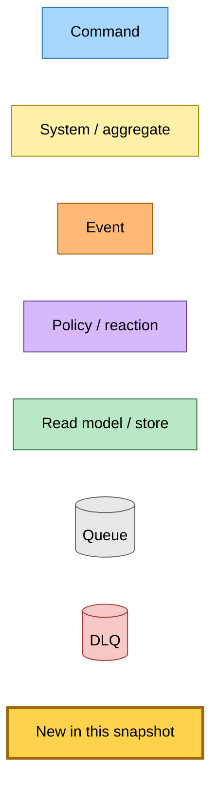
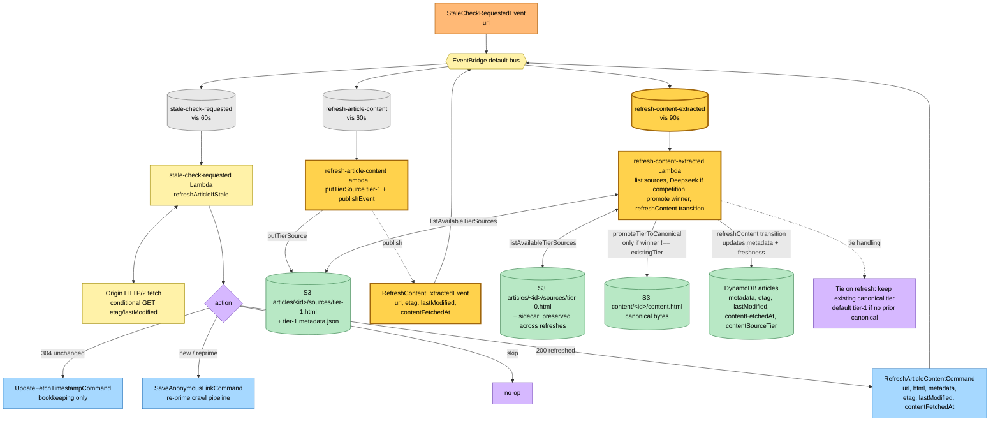
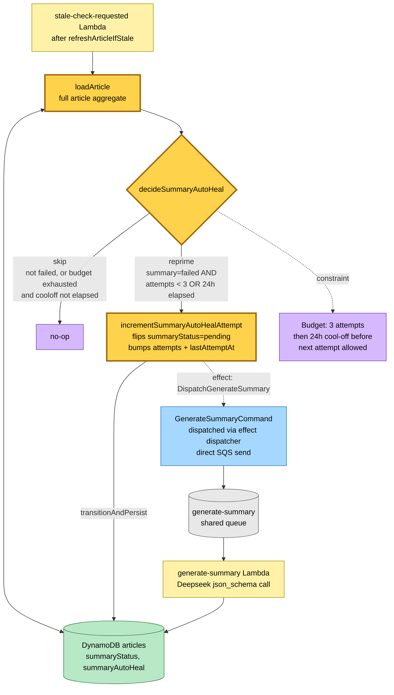

# Refresh Tier-Selection & Summary Auto-Heal Flow — Event Storming

**Commit:** `1c1095ca` &nbsp;•&nbsp; **Commit date:** 2026-05-13 &nbsp;•&nbsp; **Generated:** 2026-05-13 &nbsp;•&nbsp; **Branch:** `claude/harden-article-aggregate-bqGgo`
**Subject:** `refactor(hutch): exhaustive switch over crawl.status in renderReaderSlot`

A point-in-time map of the **refresh tier-selection pipeline** and the **summary auto-heal** mechanism. The previous snapshot ([`98f2e47`](../2026-05-01-98f2e47/recrawl-and-auto-heal-flow.md)) described `RefreshArticleContentCommand` as an in-place metadata update. That description is now obsolete: refresh now writes a tier-1 source and runs the full selector so a prior tier-0 winner is preserved.

What is new in this snapshot:

- **`RefreshContentExtractedEvent`** — a new event published by the `refresh-article-content` handler after it writes the freshly-fetched HTML as `sources/tier-1.html`. A new `refresh-content-extracted` Lambda subscribes to it and runs the Deepseek selector across all available tier sources (same shape as the recrawl path's `recrawl-content-extracted` handler). The selector result drives `promoteTierToCanonical` only when the winner tier differs from the existing canonical, and then calls `refreshContent` to update metadata + freshness timestamps. This means a tier-0 winner from the extension no longer silently flips to tier-1 on refresh.
- **Summary auto-heal** — the stale-check handler now loads the article after its freshness check and calls `decideSummaryAutoHeal`. When the summary is `failed` and the retry budget allows (3 attempts, then 24h cool-off), it dispatches `incrementSummaryAutoHealAttempt` which flips `summaryStatus` back to `pending` and emits a `GenerateSummaryCommand` effect. The crawl axis stays operator-only (admin recrawl).

> Snapshots are historical. Any file path referenced below may be renamed, moved, or deleted in the future. Treat as an artefact, not a live guide.

---

## Legend

Mermaid source

---

## Refresh tier-selection flow — stale article to fresh canonical

When `refreshArticleIfStale` returns `action=refreshed`, the stale-check handler publishes `RefreshArticleContentCommand` with the fetched HTML payload. The refresh handler writes the HTML as a tier-1 source and publishes the new `RefreshContentExtractedEvent`. The downstream selector Lambda lists all available tier sources, runs the Deepseek contest when competition exists, promotes the winner to canonical, and calls the `refreshContent` domain transition to update metadata and freshness timestamps.

Mermaid source

---

## Summary auto-heal — bounded retry from stale-check

After `refreshArticleIfStale` completes, the stale-check handler loads the full article and calls `decideSummaryAutoHeal`. When the summary is in a `failed` state and the retry budget permits (≤ 3 attempts, with a 24h cool-off after exhaustion), `incrementSummaryAutoHealAttempt` flips `summaryStatus` back to `pending` and emits a `GenerateSummaryCommand` effect via the effect dispatcher. The crawl axis does not auto-heal — only the admin recrawl path can reprime a failed crawl.

Mermaid source

---

## Command → System → Event(s) reference

| Command / Event | Handler / system | Emits / writes | Triggers next |
|---|---|---|---|
| `StaleCheckRequestedEvent` | `stale-check-requested` Lambda | `refreshArticleIfStale` decides action; summary auto-heal via `decideSummaryAutoHeal` + `incrementSummaryAutoHealAttempt` | `RefreshArticleContentCommand` (200), `UpdateFetchTimestampCommand` (304), `SaveAnonymousLinkCommand` (new/reprime), or `GenerateSummaryCommand` (auto-heal) |
| `RefreshArticleContentCommand` | `refresh-article-content` Lambda | Writes `sources/tier-1.html` + sidecar via `putTierSource` | Publishes `RefreshContentExtractedEvent` |
| `RefreshContentExtractedEvent` (**new**) | `refresh-content-extracted` Lambda | `listAvailableTierSources`; runs Deepseek selector if competition, short-circuits on a single tier; `promoteTierToCanonical` (S3 CopyObject + Dynamo SET `contentSourceTier`) only when winner differs from existing; `refreshContent` transition (metadata + freshness) | (terminal — no downstream event) |
| `decideSummaryAutoHeal` (**new**, in-process) | `stale-check-requested` Lambda, after freshness check | Reads `summaryAutoHeal` from article; returns `reprime` or `skip` | `incrementSummaryAutoHealAttempt` → `GenerateSummaryCommand` (via effect dispatcher) |
| `incrementSummaryAutoHealAttempt` (**new**, transition) | Domain aggregate transition | Flips `summaryStatus=pending`, bumps `summaryAutoHeal.attempts`, sets `summaryAutoHeal.lastAttemptAt` | Effect: `DispatchGenerateSummary` → `generate-summary` Lambda |

---

## Why refresh needs the selector step

Before this change, `RefreshArticleContentCommand` updated metadata in-place — the freshly-fetched HTML **always** became the canonical content. If an article had a tier-0 winner (extension-captured DOM, often strictly better for paywalled or JS-rendered sites), a stale-check refresh would silently overwrite it with the server-side tier-1 fetch. By routing through the selector, refresh gets the same tier-preservation semantics as the user-save and recrawl paths: tier-0 stays tier-0 unless tier-1 genuinely wins the Deepseek contest.
