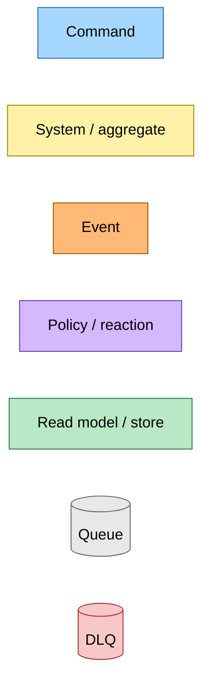

# Entry-Point Redesign on the Typed Aggregate — Event Storming

**Commit:** `7873556` &nbsp;•&nbsp; **Commit date:** 2026-05-13 &nbsp;•&nbsp; **Generated:** 2026-05-13 &nbsp;•&nbsp; **Branch:** `claude/redesign-aggregate-entry-point-jy6GE`
**Subject:** `feat(@packages/domain,@packages/hutch-infra-components,save-link): add submitLink/requestRecrawl transitions and SubmitLinkCommand`

> Mermaid sources only — SVG render skipped (sandboxed Chromium unavailable in this environment).

A point-in-time map of the **aggregate transitions, command, and effect dispatcher** that form the entry-point substrate. The previous snapshot ([`1c1095ca`](../2026-05-13-1c1095ca/refresh-and-auto-heal-flow.md)) described the refresh tier-selection and auto-heal mechanism. This snapshot documents the aggregate transitions, the unified command, and the effect dispatcher case.

What is in this snapshot:

- **`submitLink` (upsert transition)** — runs on first save (synthesises a hostname-only pending stub so the queue card renders immediately) and on every subsequent save (idempotent no-op on the row, always re-dispatches the `SubmitLinkCommand`).
- **`requestRecrawl` (operator recovery transition)** — sets `freshness.contentFetchedAt = epoch` so the next stale-check treats the row as expired, resets crawl + summary axes to pending, and clears `summaryAutoHeal` so a previously-exhausted summary gets full retry budget. The standard refresh path then runs — no parallel recrawl-completed pipeline.
- **`SubmitLinkCommand`** — EventBridge command with `{ url, userId?, rawHtml? }` detail, dispatched via SQS.
- **`dispatch-submit-link` effect** — the aggregate's effect type includes a variant for entry-point dispatches; the `lambda-effect-dispatcher` forwards it to the SQS dispatcher; the dep-bundle wires `dispatchSubmitLink` next to `dispatchGenerateSummary`.
- **`upsertAndPersist` orchestrator** — `initTransitionAndPersist` returns both `transitionAndPersist` (asserts the row exists — regular mutations) and `upsertAndPersist` (allows undefined — entry-point upserts). Both skip the DDB write when the transition's `writes` array is empty so `submitLink` can idempotent no-op the row while still re-dispatching its effect.

> Snapshots are historical. Any file path referenced below may be renamed, moved, or deleted in the future. Treat as an artefact, not a live guide.

---

## Legend

<details><summary>Mermaid source</summary>



</details>

---

## Submit-link flow — aggregate transition and command dispatch

The `submitLink` transition synthesises a stub on first save (or no-ops on a re-save), then dispatches `SubmitLinkCommand` via SQS to EventBridge.

<details><summary>Mermaid source</summary>

```mermaid
flowchart TD
    classDef command fill:#a6d8ff,stroke:#1e6fb8,color:#000
    classDef system  fill:#fff2a8,stroke:#a08a00,color:#000
    classDef store   fill:#b8e8c5,stroke:#2f7a45,color:#000

    %% Aggregate transitions
    Submit[submitLink transition<br/>upsert: stub on first save<br/>no-op + redispatch on rest]:::system

    %% DDB row
    DDB[(DynamoDB articles<br/>crawl/summary axes,<br/>freshness, autoHeal)]:::store
    Submit -. save .-> DDB

    %% Effect dispatch
    EffDisp[lambda-effect-dispatcher<br/>case dispatch-submit-link]:::system
    Submit -. dispatch-submit-link effect .-> EffDisp

    %% Command
    SLC[SubmitLinkCommand<br/>{ url, userId?, rawHtml? }]:::command
    EffDisp -- SQS send --> SLC

    %% Bus
    Bus{{EventBridge default-bus}}:::system
    SLC --> Bus
```

</details>

---

## Operator recrawl flow — recovery via setTTLToPast

`requestRecrawl` is the operator's recovery affordance. It flips a healthy article's row back to pending by setting `freshness.contentFetchedAt = new Date(0).toISOString()`, then dispatches a `SubmitLinkCommand` to re-trigger the standard pipeline.

<details><summary>Mermaid source</summary>

```mermaid
flowchart TD
    classDef command fill:#a6d8ff,stroke:#1e6fb8,color:#000
    classDef system  fill:#fff2a8,stroke:#a08a00,color:#000
    classDef store   fill:#b8e8c5,stroke:#2f7a45,color:#000

    Recrawl[requestRecrawl transition<br/>contentFetchedAt=epoch<br/>crawl→pending<br/>summary→pending<br/>summaryAutoHeal=attempts:0]:::system

    DDB[(DynamoDB articles row<br/>freshness.contentFetchedAt = 1970-01-01)]:::store
    Recrawl -. save .-> DDB

    SLC[SubmitLinkCommand<br/>{ url } no userId/rawHtml<br/>= operator initiated]:::command
    Recrawl -. dispatch-submit-link effect .-> SLC

    Bus{{EventBridge default-bus}}:::system
    SLC --> Bus
```

</details>

---

## Submit transition state — pending stub vs idempotent no-op vs re-dispatch

`submitLink` is an upsert: it has three runtime branches depending on the loaded row state. The transition's `writes` array is empty on idempotent paths so the orchestrator skips the DDB write while still dispatching the SQS message — that re-triggers a stuck pending row without churning the freshness timestamp.

<details><summary>Mermaid source</summary>

```mermaid
flowchart TD
    classDef command fill:#a6d8ff,stroke:#1e6fb8,color:#000
    classDef system  fill:#fff2a8,stroke:#a08a00,color:#000
    classDef policy  fill:#d6b8ff,stroke:#6b3fb0,color:#000

    Entry[upsertAndPersist submitLink]:::system
    Load{load article}:::policy
    Entry --> Load

    None[article === undefined<br/>first save]:::policy
    Pending[crawl.kind === 'pending'<br/>in-flight]:::policy
    Term[crawl.kind in ready/failed/unsupported<br/>terminal]:::policy

    Load -- undefined --> None
    Load -- pending --> Pending
    Load -- terminal --> Term

    Stub[Synthesise hostname stub<br/>title='Article from host'<br/>crawl/summary=pending<br/>writes=metadata,freshness,crawl,summary]:::system
    NoOp1[article unchanged<br/>writes=[]<br/>save skipped]:::policy
    NoOp2[article unchanged<br/>writes=[]<br/>save skipped<br/>operator must use requestRecrawl to flip]:::policy

    None --> Stub
    Pending --> NoOp1
    Term --> NoOp2

    Effect[dispatch-submit-link effect]:::system
    Stub --> Effect
    NoOp1 --> Effect
    NoOp2 --> Effect

    SLC[SubmitLinkCommand → SQS]:::command
    Effect --> SLC
```

</details>

---

## Command → System → Event(s) reference

The events and commands published or consumed in this snapshot's flows:

| Command / Event | System that handles it | Emits | Triggers next |
|---|---|---|---|
| `submitLink` (transition) | `upsertAndPersist` orchestrator | `dispatch-submit-link` effect | `SubmitLinkCommand` via SQS |
| `requestRecrawl` (transition) | `transitionAndPersist` orchestrator | `dispatch-submit-link` effect | `SubmitLinkCommand` via SQS |
| `dispatch-submit-link` effect | `lambda-effect-dispatcher` | `SubmitLinkCommand` SQS message | EventBridge consumer |
