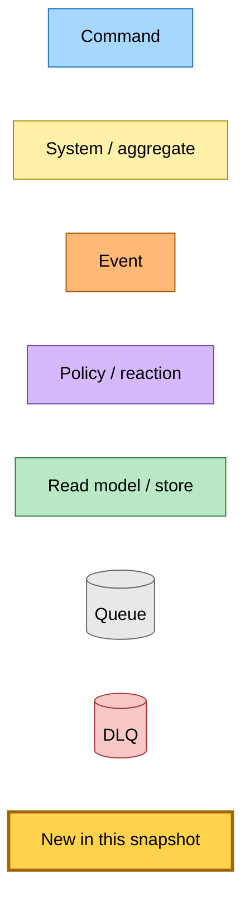
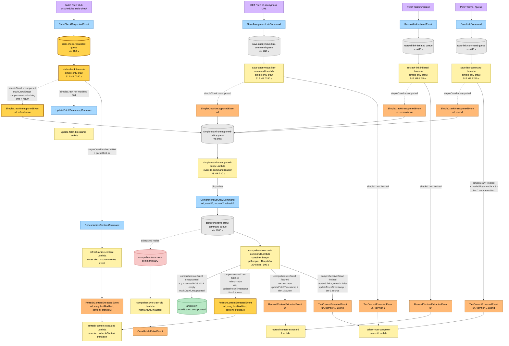

# Stale-check Migration through the Comprehensive-Crawl Path — Event Storming

**Base commit:** `628bc23` &nbsp;•&nbsp; **Commit date:** 2026-05-18 &nbsp;•&nbsp; **Generated:** 2026-05-18 &nbsp;•&nbsp; **Branch:** `claude/merge-pr-350-7ZGlA`
**Subject:** `feat(save-link): switch OCR Lambdas to container images with native pdftoppm (#337)` (this snapshot reflects the working-tree state after the stale-check migration lands)

A point-in-time map of the new stale-check refresh chain: the freshness-check Lambda is now simple-only — when the conditional GET returns a non-HTML body (PDF, etc.) the stale-check Lambda writes a `comprehensive-fetching` stage marker, emits `SimpleCrawlUnsupportedEvent` with `refresh=true`, and returns. The `simple-crawl-unsupported-policy` Lambda dispatches `ComprehensiveCrawlCommand` (with the `refresh` flag still set), and the `comprehensive-crawl-command` Lambda branches on `refresh` to emit `RefreshContentExtractedEvent` (with re-fetch `etag` / `lastModified` / `contentFetchedAt`) instead of `TierContentExtractedEvent` or `RecrawlContentExtractedEvent`. The existing `refresh-content-extracted` Lambda already runs the selector contest across all tier sources and drives the `refreshContent` aggregate transition — no downstream rewiring needed.

What is new in this snapshot:

- **`stale-check` Lambda is simple-only** — drops the `mupdf` rasterizer + DeepInfra OpenAI client + `DEEPINFRA_API_KEY` env var. Memory shrinks 2048→512 MB, timeout 600→240 s, SQS visibility 1200→480 s.
- **`SimpleCrawlUnsupportedEvent` schema gains `refresh?: boolean`** with a `.refine` constraint that `recrawl` and `refresh` are mutually exclusive.
- **`ComprehensiveCrawlCommand` schema gains `refresh?: boolean`** with the same mutex constraint.
- **`stale-check` → `SimpleCrawlUnsupportedEvent` edge** — when `simpleCrawl` returns `unsupported` (e.g. PDF body) on a stale-check refresh, the Lambda writes `crawlStage="comprehensive-fetching"`, emits the event with `refresh=true`, and returns. This is the new edge that completes the unification of all four entry points (`save-link-command`, `save-anonymous-link-command`, `recrawl-link-initiated`, `stale-check`) behind a single PDF path.
- **`comprehensive-crawl-command` refresh branch** — on `refresh=true`, the Lambda skips `updateFetchTimestamp` (the `refreshContent` aggregate transition sets freshness directly) and emits `RefreshContentExtractedEvent` carrying the re-fetch's `etag`, `lastModified`, and `contentFetchedAt`.
- **`mupdf` is gone from the repository** — `pdftoppm` (in the `comprehensive-crawl-command` container image, Phase 2) is the only PDF rasterizer; lives in one Lambda. `init-mupdf-lazy.ts` + `mupdf.d.ts` deleted. `mupdf` dependency removed from `@packages/crawl-article/package.json`.

> Snapshots are historical. Any file path referenced below may be renamed, moved, or deleted in the future. Treat as an artefact, not a live guide.

---

## Legend

---

## End-to-end flow — every entry path through the comprehensive-crawl dispatch boundary

All four callers below now share the same `SimpleCrawlUnsupportedEvent` → policy → `ComprehensiveCrawlCommand` chain when the body is non-HTML. The chain forks at the comprehensive Lambda based on which flag is set on the command: `recrawl=true` → `RecrawlContentExtractedEvent`; `refresh=true` → `RefreshContentExtractedEvent`; neither → `TierContentExtractedEvent`. `recrawl` and `refresh` are mutually exclusive (the schemas refine this).

---

## What the stale-check Lambda used to do — for contrast

Before this snapshot, `stale-check` carried the full `mupdf` + DeepInfra dependency footprint and ran PDF OCR in-process. On a stale-check tick for a PDF URL the Lambda would:

1. Look up freshness + crawl status in DynamoDB
2. Apply the TTL + terminal-action gate
3. Call `crawlArticle` (composed simple + comprehensive crawl)
4. If PDF: rasterise via mupdf, send pages to DeepInfra vision OCR, build HTML
5. Publish `RefreshArticleContentCommand` with the extracted HTML
6. Hold the SQS message visible for up to 1200 s, with 2048 MB / 600 s allocated

The cost: stale-check tied up its concurrency for tens of seconds per PDF, and the 2048 MB / 600 s / mupdf footprint was paid even by HTML-only freshness checks that never touched OCR.

After this snapshot, the same Lambda:

1. Looks up freshness + crawl status in DynamoDB
2. Applies the TTL + terminal-action gate
3. Calls `simpleCrawl` directly (no comprehensive crawl in-process)
4. On HTML: parses + publishes `RefreshArticleContentCommand` (same as before)
5. On 304: publishes `UpdateFetchTimestampCommand` (same as before)
6. On non-HTML body: writes `comprehensive-fetching` stage marker, emits `SimpleCrawlUnsupportedEvent` with `refresh=true`, returns at t+1 s — the policy → comprehensive Lambda chain owns the remaining ~5 minutes of OCR work on its own queue and concurrency budget

---

## Stale-check worker decision matrix

| Branch | Side effects | Returns | Downstream emission |
|---|---|---|---|
| Row missing | `publishSaveAnonymousLink` | `"new"` | `SaveAnonymousLinkCommand` (re-primes the crawl) |
| Crawl status terminal-skip (`failed` / `unsupported`) | none | `"skip"` | (none) |
| Within TTL window | none | `"skip"` | (none) |
| `simpleCrawl` `not-modified` (304) | `publishUpdateFetchTimestamp` | `"unchanged"` | `UpdateFetchTimestampCommand` |
| `simpleCrawl` `failed` | none | `"skip"` | (none) |
| `simpleCrawl` `unsupported` | `markCrawlStage("comprehensive-fetching")` + `emitSimpleCrawlUnsupported({ refresh: true })` | `"tier-1-deferred"` | `SimpleCrawlUnsupportedEvent` (url, refresh=true) |
| `parseHtml` fails on fetched HTML | none | `"skip"` | (none) |
| `simpleCrawl` `fetched` + parse ok | `publishRefreshArticleContent` | `"refreshed"` | `RefreshArticleContentCommand` |

After any of the above, the handler runs the summary auto-heal check — `decideSummaryAutoHeal` may reprime a `summary=failed` row via `incrementSummaryAutoHealAttempt`.

Policy Lambda's matrix (updated to thread `refresh`):

| Event | Side effects | Dispatches |
|---|---|---|
| `SimpleCrawlUnsupportedEvent` (url, userId?, recrawl?, refresh?) | none | `ComprehensiveCrawlCommand` (url, userId?, recrawl?, refresh?) |

Comprehensive Lambda's matrix (updated to branch on `refresh`):

| Command | `comprehensiveCrawl` result | Side effects | Downstream emission |
|---|---|---|---|
| `ComprehensiveCrawlCommand` (recrawl=false, refresh=false) | `fetched` | parse + media + S3 + DDB; `updateFetchTimestamp` | `TierContentExtractedEvent` (with optional userId) |
| `ComprehensiveCrawlCommand` (recrawl=true) | `fetched` | parse + media + S3 + DDB; `updateFetchTimestamp` | `RecrawlContentExtractedEvent` |
| `ComprehensiveCrawlCommand` (refresh=true) | `fetched` | parse + media + S3 + DDB; **skip** `updateFetchTimestamp` — `refreshContent` aggregate transition sets freshness from the event | `RefreshContentExtractedEvent` (carries re-fetch `etag` / `lastModified` / `contentFetchedAt`) |
| any | `unsupported` (e.g. PDF too large, OCR empty, non-PDF body) | `markCrawlUnsupported` | (terminal — no downstream emit) |
| any | `failed` | throws | (record routed to batchItemFailures → SQS retry → DLQ) |
| any | parse error | `markCrawlFailed` + throws | (record routed to batchItemFailures → SQS retry → DLQ) |

---

## Command → System → Event reference

| Command / Event | Handler | Side effects | Emits |
|---|---|---|---|
| `SaveLinkCommand` (url, userId) | `save-link-command` Lambda (simple-only) | Simple crawl → if fetched: write tier-1 source. If unsupported: emit `SimpleCrawlUnsupportedEvent`. | `TierContentExtractedEvent` or `SimpleCrawlUnsupportedEvent` (url, userId) |
| `SaveAnonymousLinkCommand` (url) | `save-anonymous-link-command` Lambda (simple-only) | Same shape, no userId. | `TierContentExtractedEvent` or `SimpleCrawlUnsupportedEvent` (url) |
| `RecrawlLinkInitiatedEvent` (url) | `recrawl-link-initiated` Lambda (simple-only) | Same shape; threads `recrawl=true` through `saveLinkWork` options. | `RecrawlContentExtractedEvent` or `SimpleCrawlUnsupportedEvent` (url, recrawl=true) |
| **`StaleCheckRequestedEvent` (url)** | **`stale-check` Lambda (simple-only)** | Freshness gate; simpleCrawl. On HTML: publishes `RefreshArticleContentCommand`. On 304: publishes `UpdateFetchTimestampCommand`. **On unsupported: emit `SimpleCrawlUnsupportedEvent` (url, refresh=true).** | `RefreshArticleContentCommand`, `UpdateFetchTimestampCommand`, `SaveAnonymousLinkCommand`, **`SimpleCrawlUnsupportedEvent` (url, refresh=true)** |
| **`SimpleCrawlUnsupportedEvent` (url, userId?, recrawl?, refresh?)** | `simple-crawl-unsupported-policy` Lambda | Event-to-command reactor: forwards all four fields. | `ComprehensiveCrawlCommand` (url, userId?, recrawl?, refresh?) |
| `SimpleCrawlUnsupportedEvent` DLQ message | `simple-crawl-unsupported-policy-dlq` Lambda | `transitionAndPersist(markCrawlExhausted)` | `CrawlArticleFailedEvent` |
| **`ComprehensiveCrawlCommand` (url, userId?, recrawl?, refresh?)** | `comprehensive-crawl-command` Lambda (container image, pdftoppm) | pdftoppm rasterise + DeepInfra OCR → tier-1 source. On unsupported: `markCrawlUnsupported`. Branches on flag: `recrawl` → RecrawlContentExtractedEvent; **`refresh` → RefreshContentExtractedEvent (skip updateFetchTimestamp)**; else TierContentExtractedEvent. | `TierContentExtractedEvent`, `RecrawlContentExtractedEvent`, or **`RefreshContentExtractedEvent`** |
| `ComprehensiveCrawlCommand` DLQ message | `comprehensive-crawl-dlq` Lambda | `transitionAndPersist(markCrawlExhausted)` | `CrawlArticleFailedEvent` |
| `RefreshArticleContentCommand` (url, html, metadata, …) | `refresh-article-content` Lambda (unchanged) | Writes the freshly-fetched HTML as a tier-1 source. | `RefreshContentExtractedEvent` (url, etag, lastModified, contentFetchedAt) |
| `RefreshContentExtractedEvent` (url, etag?, lastModified?, contentFetchedAt) | `refresh-content-extracted` Lambda (unchanged) | Selector contest across all tier sources; promote winner to canonical; `refreshContent` aggregate transition (sets freshness). | (no downstream emission required for refresh) |
| `TierContentExtractedEvent` | `select-most-complete-content` Lambda (unchanged) | Selector contest over tier sources; promote winner to canonical | `LinkSavedEvent` / `AnonymousLinkSavedEvent` (on canonical change); `CrawlArticleCompletedEvent` |
| `RecrawlContentExtractedEvent` | `recrawl-content-extracted` Lambda (unchanged) | Same as selector but always dispatches `GenerateSummaryCommand` | `LinkSavedEvent` / `RecrawlCompletedEvent` |

---

## Trust + capacity boundary

After this snapshot, all four entry points are simple-only at 512 MB / 240 s zip-based. Only one Lambda — `comprehensive-crawl-command` — holds the heavyweight OCR dependency footprint (Docker image, `pdftoppm`, DeepInfra client). The trust boundary diagram is unchanged from Phase 1, but now extends to cover the stale-check Lambda:

- **IAM**: stale-check's role drops `events:PutEvents` for the OCR result events; it now only emits `SimpleCrawlUnsupportedEvent`, `RefreshArticleContentCommand`, `UpdateFetchTimestampCommand`, `SaveAnonymousLinkCommand`. The comprehensive Lambda owns the OCR-result emissions.
- **Capacity**: stale-check no longer competes with HTML or PDF traffic for the same memory pool. A flood of stale-check ticks cannot stall save-link saves, and a flood of save-link PDFs cannot stall stale-check refreshes.
- **Dependencies**: `mupdf` is now entirely gone from the repo. `pdftoppm` lives in the `comprehensive-crawl-command` Docker image only.
- **Failure domain**: stale-check has its own SQS queue + DLQ + SNS alarm. Refresh failures of PDFs route through the comprehensive Lambda's own DLQ chain.

---

## Risks / open items

1. **Wire-format extension is forever.** The new `refresh?: boolean` field on `SimpleCrawlUnsupportedEvent` and `ComprehensiveCrawlCommand` joins `source` + `detailType` as deployment contracts. Renaming or removing the field later requires coordinated redeploy of publisher (`save-link` package) + subscriber (`save-link` package — same package today, but a future split would surface this).
2. **`recrawl` / `refresh` mutex is enforced at the schema level via `.refine`.** Future authors who add a fourth flag must respect this — the chain forks on whichever flag is set, and overlap would mis-route.
3. **Freshness data semantics shift for refreshed PDFs.** Today, `RefreshContentExtractedEvent`'s `etag` / `lastModified` come from the in-place refresh's conditional fetch (in the `refresh-article-content` Lambda). When the refresh flows through the comprehensive Lambda, the values come from the comprehensive Lambda's own re-fetch (the same network call that fed the OCR). Both are valid (content was re-fetched, headers are correct as of the re-fetch), but the recorded timestamp is the comprehensive re-fetch time, not the freshness-check time. No downstream consumer relies on the distinction today; if one ever does, thread `requestedAt` through `SimpleCrawlUnsupportedEvent` → `ComprehensiveCrawlCommand` → `RefreshContentExtractedEvent`.
4. **Stale-check picks up a URL whose row was just deleted** — the comprehensive Lambda's existing "row missing" graceful handling (its DDB writes use the standard `transitionAndPersist` path that flips terminal on the aggregate; if the row is gone the write is a no-op + log warning) already covers this. No new behaviour needed.
5. **Deploy ordering.** Pulumi shrinks the stale-check Lambda (memory + timeout + env) before the runtime change rolls; the runtime change refers to the smaller memory limit but the existing Lambda still has the larger limit during the brief window between Pulumi and the runtime push, so no runtime-side allocation issue. The new schema fields are backward-compatible — old serialised events (without `refresh`) still parse.
