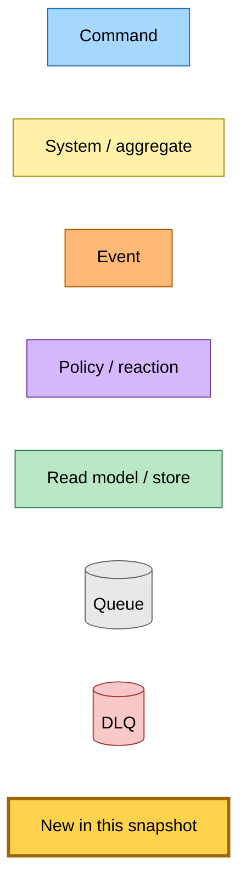
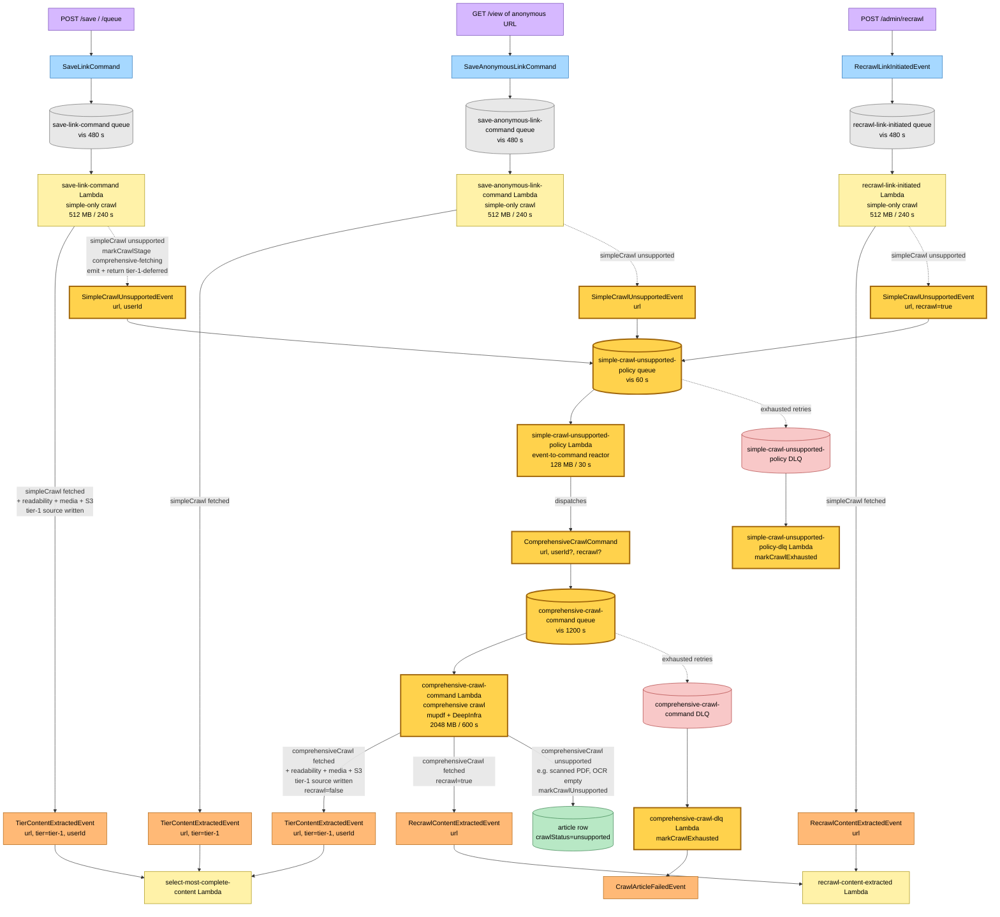

# Cross-Lambda Comprehensive Crawl Split — Event Storming

**Base commit:** `a44a728` &nbsp;•&nbsp; **Commit date:** 2026-05-18 &nbsp;•&nbsp; **Generated:** 2026-05-18 &nbsp;•&nbsp; **Branch:** `claude/split-crawl-paths-XTNnX`
**Subject:** `feat(@packages/check-failed-articles): exclude browser-internal scheme URLs from canary (#345)` (this snapshot reflects the working-tree state after the comprehensive-crawl split lands)

A point-in-time map of the new comprehensive-crawl split: the PDF / heavy crawl path is lifted out of the simple-only save-link / save-anonymous-link / recrawl-link-initiated Lambdas into a dedicated `comprehensive-crawl-command` Lambda. Save-link Lambdas emit `SimpleCrawlUnsupportedEvent` when the simple crawl bails; the `simple-crawl-unsupported-policy` Lambda subscribes to the event and dispatches `ComprehensiveCrawlCommand`. Save-link Lambdas no longer hold a concurrency slot during PDF extraction — they emit and return.

What is new in this snapshot:

- **`SimpleCrawlUnsupportedEvent`** — new EventBridge event (`source: "hutch.save-link"`, `detailType: "SimpleCrawlUnsupported"`, detail: `{ url, userId?, recrawl? }`). Emitted by `save-link-work` whenever `simpleCrawl` returns `unsupported`. The intermediate event decouples the Command → Command dispatch that would otherwise violate the Command → System → Event(s) pattern.
- **`simple-crawl-unsupported-policy` Lambda** — event-to-command reactor. Subscribes to `SimpleCrawlUnsupportedEvent` and dispatches `ComprehensiveCrawlCommand`. Lightweight (128 MB / 30 s) with its own SQS queue, DLQ, and EventBridge subscription.
- **`simple-crawl-unsupported-policy-dlq` Lambda** — mirrors other DLQ handlers: flips `crawlStatus="exhausted"` when the policy Lambda exhausts its `maxReceiveCount`.
- **`ComprehensiveCrawlCommand`** — EventBridge command (`source: "hutch.save-link"`, `detailType: "ComprehensiveCrawlCommand"`, detail: `{ url, userId?, recrawl? }`). Dispatched by the policy Lambda. The downstream Lambda branches on `recrawl` to emit either `TierContentExtractedEvent` (default save path) or `RecrawlContentExtractedEvent` (admin recrawl path).
- **`comprehensive-crawl-command` Lambda** — new Lambda with its own SQS queue, DLQ, and EventBridge subscription. Holds the mupdf + DeepInfra deps that previously lived on the three save-link Lambdas. Runs the comprehensive crawl, parses the resulting HTML, writes a tier-1 source, and emits the appropriate downstream event itself.
- **`comprehensive-crawl-dlq` Lambda** — mirrors `save-link-dlq`: flips `crawlStatus="exhausted"` and emits `CrawlArticleFailedEvent` when the comprehensive Lambda exhausts its `maxReceiveCount`.
- **`tier-1-deferred` `SaveLinkWorkResult`** — new return variant. `saveLinkWork` writes `crawlStage="comprehensive-fetching"`, emits the event, and returns. The caller logs and does **not** publish `TierContentExtractedEvent` — the comprehensive Lambda owns that emission.
- **Simple-only save-link Lambdas** — `save-link-command`, `save-anonymous-link-command`, `recrawl-link-initiated` all drop their mupdf / OpenAI / `DEEPINFRA_API_KEY` dependency footprints. Memory shrinks from 2048→512 MB, timeout from 600→240 s, SQS visibility from 1200→480 s. PDFs no longer compete with HTML for these Lambdas' concurrency.

> Snapshots are historical. Any file path referenced below may be renamed, moved, or deleted in the future. Treat as an artefact, not a live guide.

---

## Legend

---

## End-to-end flow — every entry path through the new dispatch boundary

The three callers below all share the same `saveLinkWork` worker. When the simple crawl bails on a non-HTML content type, `saveLinkWork` writes a `comprehensive-fetching` stage marker, emits `SimpleCrawlUnsupportedEvent`, and returns `"tier-1-deferred"`. The save-link Lambda releases its SQS message and frees its concurrency slot immediately. The `simple-crawl-unsupported-policy` Lambda subscribes to the event and dispatches `ComprehensiveCrawlCommand` — the comprehensive Lambda picks up the command on its own queue.

---

## What the save-link Lambda used to do — for contrast

Before this snapshot, all three Lambdas (`save-link-command`, `save-anonymous-link-command`, `recrawl-link-initiated`) carried the full mupdf + DeepInfra dependency footprint. On a PDF save, the Lambda would:

1. Fetch the URL via simple crawl
2. See `unsupported`, fall through to in-process comprehensive crawl
3. Run mupdf rasterisation per page (~9 MB pixmap each)
4. Submit per-page images to DeepInfra vision-OCR (~ 30 s+ for a dense paper)
5. Hold the SQS message visible the whole time (1200 s visibility timeout, 2048 MB memory)
6. Write the tier-1 source and emit `TierContentExtractedEvent`

The cost: a single PDF tied up one Lambda concurrency slot for tens of seconds, and the 2048 MB / 600 s / mupdf footprint was paid even by HTML-only saves that never touched the OCR path.

After this snapshot, the same Lambda:

1. Fetches the URL via simple crawl
2. Sees `unsupported`, writes `comprehensive-fetching` stage marker, emits `SimpleCrawlUnsupportedEvent`, returns immediately
3. The Lambda's concurrency slot is free at t+1s — the policy Lambda dispatches `ComprehensiveCrawlCommand` and the comprehensive Lambda owns the remaining ~5 minutes of work on its own queue and concurrency budget

---

## Worker decision matrix

| Caller | `simpleCrawl` result | `saveLinkWork` returns | Side effects | Downstream emission |
|---|---|---|---|---|
| `save-link-command` | `fetched` | `tier-1-written` | parse + media + S3 + DDB | `TierContentExtractedEvent` (with userId) |
| `save-link-command` | `unsupported` | `tier-1-deferred` | `markCrawlStage` + emit `SimpleCrawlUnsupportedEvent` | (deferred — policy → comprehensive chain emits) |
| `save-link-command` | `failed` / `not-modified` | throws | `logParseError` + emit tier-1 failure outcome | (record routed to batchItemFailures) |
| `save-anonymous-link-command` | `fetched` | `tier-1-written` | parse + media + S3 + DDB | `TierContentExtractedEvent` (no userId) |
| `save-anonymous-link-command` | `unsupported` | `tier-1-deferred` | emit `SimpleCrawlUnsupportedEvent` | (deferred) |
| `recrawl-link-initiated` | `fetched` | `tier-1-written` | parse + media + S3 + DDB | `RecrawlContentExtractedEvent` |
| `recrawl-link-initiated` | `unsupported` | `tier-1-deferred` | emit `SimpleCrawlUnsupportedEvent` (recrawl=true) | (deferred — comprehensive Lambda emits `RecrawlContentExtractedEvent`) |

Policy Lambda's matrix:

| Event | Side effects | Dispatches |
|---|---|---|
| `SimpleCrawlUnsupportedEvent` (url, userId?, recrawl?) | none | `ComprehensiveCrawlCommand` (url, userId?, recrawl?) |

Comprehensive Lambda's own matrix:

| Command | `comprehensiveCrawl` result | Side effects | Downstream emission |
|---|---|---|---|
| `ComprehensiveCrawlCommand` (recrawl=false) | `fetched` | parse + media + S3 + DDB; `markCrawlStage` progression | `TierContentExtractedEvent` (with optional userId) |
| `ComprehensiveCrawlCommand` (recrawl=true) | `fetched` | parse + media + S3 + DDB | `RecrawlContentExtractedEvent` |
| any | `unsupported` (e.g. PDF too large, OCR empty, non-PDF body) | `markCrawlUnsupported` | (terminal — no downstream emit) |
| any | `failed` | throws | (record routed to batchItemFailures → SQS retry → DLQ) |
| any | parse error | `markCrawlFailed` + throws | (record routed to batchItemFailures → SQS retry → DLQ) |

---

## Command → System → Event reference

| Command / Event | Handler | Side effects | Emits |
|---|---|---|---|
| `SaveLinkCommand` (url, userId) | `save-link-command` Lambda (simple-only) | Simple crawl → if fetched: write tier-1 source. If unsupported: emit `SimpleCrawlUnsupportedEvent`. | `TierContentExtractedEvent` on `tier-1-written`; `SimpleCrawlUnsupportedEvent` (url, userId) on `tier-1-deferred` |
| `SaveAnonymousLinkCommand` (url) | `save-anonymous-link-command` Lambda (simple-only) | Same shape, no userId. | `TierContentExtractedEvent` or `SimpleCrawlUnsupportedEvent` (url) |
| `RecrawlLinkInitiatedEvent` (url) | `recrawl-link-initiated` Lambda (simple-only) | Same shape; threads `recrawl=true` through `saveLinkWork` options. | `RecrawlContentExtractedEvent` or `SimpleCrawlUnsupportedEvent` (url, recrawl=true) |
| **`SimpleCrawlUnsupportedEvent` (url, userId?, recrawl?)** | **`simple-crawl-unsupported-policy` Lambda** | Event-to-command reactor: forwards all fields. | `ComprehensiveCrawlCommand` (url, userId?, recrawl?) |
| `SimpleCrawlUnsupportedEvent` DLQ message | `simple-crawl-unsupported-policy-dlq` Lambda | `transitionAndPersist(markCrawlExhausted)` | `CrawlArticleFailedEvent` |
| **`ComprehensiveCrawlCommand` (url, userId?, recrawl?)** | **`comprehensive-crawl-command` Lambda** | mupdf rasterise + DeepInfra OCR → tier-1 source. On unsupported: `markCrawlUnsupported`. On recrawl flag: emit RecrawlContentExtractedEvent; else TierContentExtractedEvent. | `TierContentExtractedEvent` or `RecrawlContentExtractedEvent` |
| `ComprehensiveCrawlCommand` DLQ message | `comprehensive-crawl-dlq` Lambda | `transitionAndPersist(markCrawlExhausted)` | `CrawlArticleFailedEvent` |
| `TierContentExtractedEvent` | `select-most-complete-content` Lambda (unchanged) | Selector contest over tier sources; promote winner to canonical | `LinkSavedEvent` / `AnonymousLinkSavedEvent` (on canonical change); `CrawlArticleCompletedEvent` |
| `RecrawlContentExtractedEvent` | `recrawl-content-extracted` Lambda (unchanged) | Same as selector but always dispatches `GenerateSummaryCommand` | `LinkSavedEvent` / `RecrawlCompletedEvent` |

---

## Trust boundary

The comprehensive Lambda is a separate trust + capacity domain:

- **IAM**: its own role with DynamoDB UpdateItem, S3 PutObject on the content bucket, EventBridge `events:PutEvents`. The publisher save-link Lambdas only need EventBridge publish (already had it).
- **Capacity**: its own reserved concurrency and SQS queue depth. A PDF flood cannot starve HTML saves.
- **Dependencies**: mupdf (`external: ["mupdf"]`), OpenAI client, `DEEPINFRA_API_KEY` env var — all moved off the save-link Lambdas.
- **Failure domain**: its own DLQ + SNS alarm + email subscription. PDF extraction failures don't pollute the save-link DLQ alarm signal.

The policy Lambda is a minimal bridge between the event and the command:

- **IAM**: EventBridge `events:PutEvents` only — no DynamoDB, no S3.
- **Capacity**: 128 MB / 30 s — the lightest Lambda in the pipeline.
- **Failure domain**: its own DLQ + SNS alarm. If the policy fails, the DLQ handler flips `crawlStatus=exhausted` so the article doesn't stay stuck at `comprehensive-fetching`.

---

## Risks / open items

1. **Wire-format is forever.** Both `source: "hutch.save-link"` + `detailType: "SimpleCrawlUnsupported"` and `detailType: "ComprehensiveCrawlCommand"` are stored in deployed EventBridge rules. Renaming later requires coordinated redeploy of publisher + subscriber.
2. **DLQ email subscriptions require manual confirmation.** First `pulumi up` creates unconfirmed SNS subscriptions for both the policy DLQ and comprehensive-crawl DLQ. The alarms will not page until the operator confirms.
3. **stale-check Lambda is unchanged** — it still runs comprehensive crawl in-process for stale-refresh. Future work could route through `SimpleCrawlUnsupportedEvent` → policy → `ComprehensiveCrawlCommand` for consistency, but stale-check's semantics (re-extract on freshness check) differ enough that this snapshot leaves it alone.
4. **Deploy ordering.** Pulumi creates the new Lambdas + queues + EventBridge rules before save-link's code rolls; the rules are in place before any save-link Lambda emits the new event, so no events are dropped in the deploy gap.
5. **Extra hop latency.** The intermediate `SimpleCrawlUnsupportedEvent` → policy Lambda → `ComprehensiveCrawlCommand` adds ~50-200ms of EventBridge + SQS + cold-start latency compared to the direct dispatch. This is acceptable because the comprehensive crawl itself takes tens of seconds to minutes.
