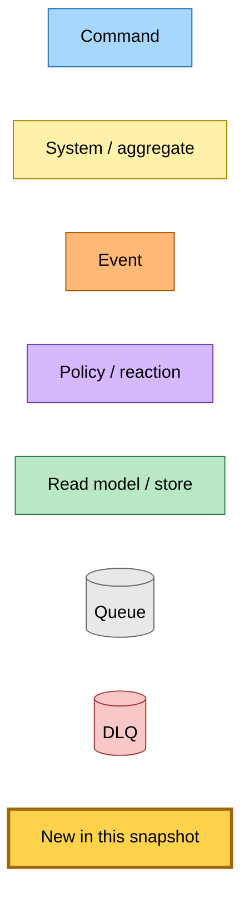
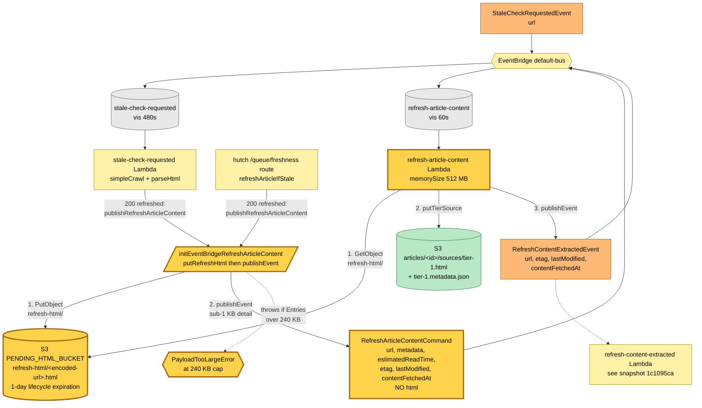

# Refresh HTML S3 Staging — Event Storming

**Commit:** `527ea4c` &nbsp;•&nbsp; **Commit date:** 2026-05-19 &nbsp;•&nbsp; **Generated:** 2026-05-19 &nbsp;•&nbsp; **Branch:** `claude/remove-html-payloads-foNSC`
**Subject:** `fix: stage refresh HTML in S3 to keep EventBridge payloads under 256 KB`

A point-in-time map of the **refresh tier-selection pipeline** after the wire format for `RefreshArticleContentCommand` was changed to drop inline HTML. The previous snapshot ([`1c1095ca`](../2026-05-13-1c1095ca/refresh-and-auto-heal-flow.md)) showed the command carrying the freshly-fetched HTML in `detail.html`. That description is now obsolete: a 1.92 MB slashdata article tripped EventBridge's 256 KB per-request cap and parked four messages in `stale-check-requested-dlq`. The synchronous hutch `/queue/freshness` path was one large URL away from the same crash.

What is new in this snapshot:

- **`refresh-html/` S3 staging prefix** in the existing `PENDING_HTML_BUCKET`. Both publishers (the `stale-check-requested` Lambda and the synchronous hutch `/queue/freshness` route in `initEventBridgeRefreshArticleContent`) `PutObject` the fetched HTML under `refresh-html/<encoded-url>.html` *before* publishing `RefreshArticleContentCommand`. The consumer (`refresh-article-content` Lambda) derives the same key from the URL via `ArticleResourceUniqueId.toS3RefreshHtmlKey()` and `GetObject`s the staged bytes — mirrors the existing `SaveLinkRawHtmlCommand` pattern.
- **`RefreshArticleContentCommand.detailSchema`** no longer carries `html`. The wire payload shrinks from up-to-1.92 MB to sub-1 KB (just `url`, `metadata`, `estimatedReadTime`, freshness headers). The detail no longer scales with article size.
- **`PayloadTooLargeError` publisher guard** in `initEventBridgePublisher`. Computes `Buffer.byteLength(JSON.stringify(Entries))` before `client.send`; if > 240 KB, throws before any AWS call so an oversized event surfaces as a Lambda failure (→ SQS DLQ → existing SNS alarm) instead of bouncing 4xx off AWS for the SQS visibility window. With every wire payload now sub-1 KB, an oversized event is a programming error.
- **1-day S3 lifecycle expiration** on the `pending-html/` and `refresh-html/` prefixes of `PENDING_HTML_BUCKET`. Staging objects are read once, never canonical, so they expire aggressively. Implemented by extending `HutchS3ReadWrite` with an optional `expirationRules` arg that emits `aws.s3.BucketLifecycleConfigurationV2`.

> Snapshots are historical. Any file path referenced below may be renamed, moved, or deleted in the future. Treat as an artefact, not a live guide.

---

## Legend

<details><summary>Mermaid source</summary>



</details>

---

## Refresh flow — S3-staged HTML, sub-1 KB wire payload

Both refresh publishers — the asynchronous `stale-check-requested` Lambda and the synchronous hutch `/queue/freshness` route via `refreshArticleIfStale` — funnel through a shared shape: **stage HTML to S3, then publish the event without HTML**. The `refresh-article-content` Lambda reads the staged HTML by deriving the key from the URL, writes it as a tier-1 source, and publishes `RefreshContentExtractedEvent` (unchanged from `1c1095ca`).

<details><summary>Mermaid source</summary>



</details>

---

## Wire-format change — RefreshArticleContentCommand detail

| Field | Before (`1c1095ca`) | After (`527ea4c`) |
|---|---|---|
| `url` | `z.string()` | `z.string()` |
| `html` | `z.string()` (up to 1.92 MB) | **removed** |
| `metadata` | `{ title, siteName, excerpt, wordCount, imageUrl? }` | unchanged |
| `estimatedReadTime` | `z.number()` | unchanged |
| `etag` | `z.string().optional()` | unchanged |
| `lastModified` | `z.string().optional()` | unchanged |
| `contentFetchedAt` | `z.string()` | unchanged |

The `source`, `detailType`, and `name` (`hutch.api` / `RefreshArticleContentCommand` / `refresh-article-content-command`) are unchanged, so the EventBridge subscription rule and SQS queue are unchanged. The schema change is publisher- and consumer-side only.

---

## Infrastructure changes

| Lambda | Change |
|---|---|
| `stale-check-requested` | + `PENDING_HTML_BUCKET_NAME` env • + `pendingHtmlBucket.writePolicies("stale-check-requested-refresh-html")` |
| `refresh-article-content` | + `PENDING_HTML_BUCKET_NAME` env • + `pendingHtmlBucket.readPolicies("refresh-article-content-refresh-html")` • memorySize 256 → 512 MB |
| hutch web | no change — `PENDING_HTML_BUCKET_NAME` and write policies already wired for the `pending-html/` (extension) prefix |
| `pending-html-bucket` | + 1-day expiration on `pending-html/` and `refresh-html/` prefixes via `BucketLifecycleConfigurationV2` |

---

## Production cutover

The 4 stuck `stale-check-requested-dlq` messages cannot be redriven — their `detail.html` is inlined and would fail the new zod parse. After deploy:

```bash
# Re-emit StaleCheckRequestedEvent for the affected URL via the new (S3-staging) chain
aws events put-events --entries '[{"Source":"hutch.api","DetailType":"StaleCheckRequested","Detail":"{\"url\":\"https://www.slashdata.co/post/global-developer-population-trends-2025-how-many-developers-are-there\"}","EventBusName":"<bus>"}]'

# Purge the DLQ — the redrive is happening through the bus, not through the DLQ
aws sqs purge-queue --queue-url "$STALE_CHECK_DLQ_URL"
```

Any in-flight queue messages that crossed the deploy boundary with the legacy `{url, html, metadata, …}` shape will fail zod parse on the new handler and land in the DLQ; the same recovery applies.

---

## Deferred follow-ups

Tracked but not in this snapshot:

- `SubmitLinkCommand.rawHtml` symmetric migration to S3 staging. No live consumer today; lands with the future `submit-link` Lambda.
- CloudWatch alarm on `PayloadTooLargeError` log pattern across all Lambda log groups, plumbed to the existing ops email.
