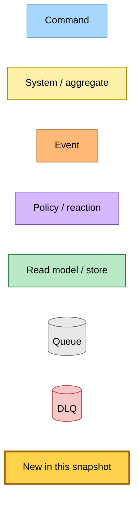
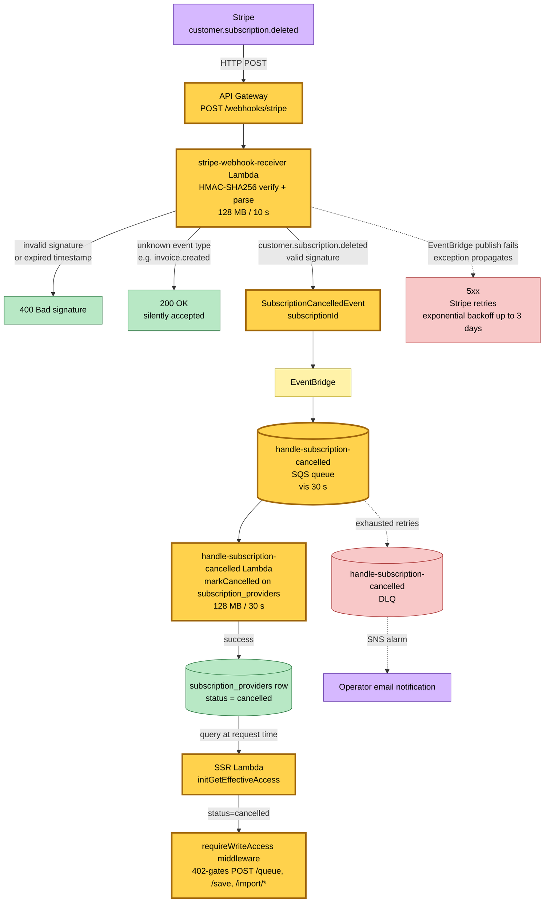

# Stripe Webhook Cancellation Flow — Event Storming

**Base commit:** `53a7bed3` &nbsp;•&nbsp; **Commit date:** 2026-05-23 &nbsp;•&nbsp; **Generated:** 2026-05-23 &nbsp;•&nbsp; **Branch:** `claude/stoic-brahmagupta-IPsCv`
**Subject:** `feat(hutch): extract Stripe webhook into dedicated Lambda with EventBridge`

A point-in-time map of the Stripe webhook cancellation flow: Stripe sends `customer.subscription.deleted` to a dedicated API Gateway-fronted Lambda that verifies the HMAC signature and emits `SubscriptionCancelledEvent` via EventBridge. A separate SQS-backed Lambda subscribes to the event and marks the subscription as cancelled in DynamoDB. The SSR Lambda's `initGetEffectiveAccess` reads the subscription status at request time and gates write access accordingly.

What is new in this snapshot:

- **`SubscriptionCancelledEvent`** — new EventBridge event (`source: "hutch.stripe-webhook"`, `detailType: "SubscriptionCancelled"`, detail: `{ subscriptionId }`). Emitted by the Stripe webhook receiver Lambda after signature verification.
- **`stripe-webhook-receiver` Lambda** — API Gateway-fronted (not SQS-backed). Verifies Stripe HMAC-SHA256 signature with `timingSafeEqual`, validates timestamp tolerance (300s), parses the event body via Zod. Returns 200 after successful EventBridge publish; lets publish failures propagate as 5xx so Stripe retries.
- **`handle-subscription-cancelled` Lambda** — SQS-backed via `HutchSQSBackedLambda`. Subscribes to `SubscriptionCancelledEvent` via EventBridge. Marks the `subscription_providers` row as `status='cancelled'`. Failed records are reported via `SQSBatchResponse.batchItemFailures` for per-record retry; exhausted retries land in DLQ with SNS email alarm.
- **Effective access gating** — `initGetEffectiveAccess` in the SSR Lambda reads the subscription row and derives a discriminated union (`FullAccessTier | InactiveAccess`). `requireWriteAccess` middleware 402-gates write endpoints for cancelled/trial-expired users.

> Snapshots are historical. Any file path referenced below may be renamed, moved, or deleted in the future. Treat as an artefact, not a live guide.

---

## Legend

---

## End-to-end flow — Stripe cancellation to write-access gating

Stripe sends `customer.subscription.deleted` via HTTP POST to an API Gateway route. The `stripe-webhook-receiver` Lambda verifies the HMAC-SHA256 signature (including timestamp tolerance), parses the event body, and publishes `SubscriptionCancelledEvent` to EventBridge. EventBridge routes the event to an SQS queue fronting the `handle-subscription-cancelled` Lambda, which marks the subscription row as cancelled. On the next authenticated request, the SSR Lambda's `initGetEffectiveAccess` reads the updated row and returns `InactiveAccess`, causing `requireWriteAccess` to 402-gate write endpoints.

---

## Failure paths

| Failure point | Behaviour | Recovery |
|---|---|---|
| Stripe signature invalid / expired | `stripe-webhook-receiver` returns 400; Stripe does **not** retry 4xx | No action — invalid requests are rejected by design |
| EventBridge publish fails | Exception propagates; API Gateway returns 5xx; Stripe retries with exponential backoff up to 3 days | Automatic via Stripe retry |
| `handle-subscription-cancelled` Lambda throws | SQS retries per `maxReceiveCount`; exhausted messages land in DLQ with SNS email alarm | Operator redrives from DLQ |
| `markCancelled` DynamoDB write fails | Record reported in `batchItemFailures`; SQS retries that record | Automatic via SQS retry, then DLQ |

---

## Command → System → Event reference

| Command / Event | Handler | Side effects | Emits |
|---|---|---|---|
| Stripe `customer.subscription.deleted` (HTTP POST) | `stripe-webhook-receiver` Lambda (API Gateway) | HMAC verify, parse body | `SubscriptionCancelledEvent` (subscriptionId) |
| `SubscriptionCancelledEvent` (subscriptionId) | `handle-subscription-cancelled` Lambda (SQS-backed) | `markCancelled` on `subscription_providers` table | (terminal — no downstream event) |

---

## Trust boundary

The `stripe-webhook-receiver` is an API Gateway-fronted Lambda (not SQS-backed):

- **IAM**: EventBridge `events:PutEvents` only — no DynamoDB, no S3.
- **Capacity**: 128 MB / 10 s — signature verification and JSON parsing only.
- **Failure domain**: Stripe's built-in retry mechanism (exponential backoff, up to 3 days) handles transient EventBridge failures. The webhook receiver has no DLQ of its own because API Gateway is the queue analogue.

The `handle-subscription-cancelled` is an SQS-backed Lambda:

- **IAM**: DynamoDB `GetItem`, `Query`, `UpdateItem` on `subscription_providers` table.
- **Capacity**: 128 MB / 30 s — single DynamoDB write per event.
- **Failure domain**: its own SQS queue + DLQ + SNS alarm + email subscription. DLQ arrivals page the operator for manual redrive.
