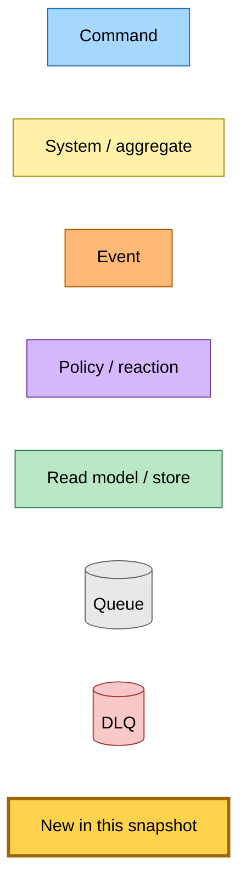
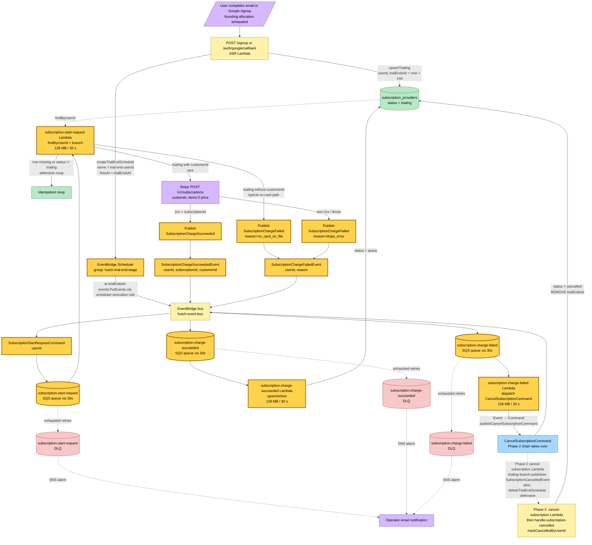
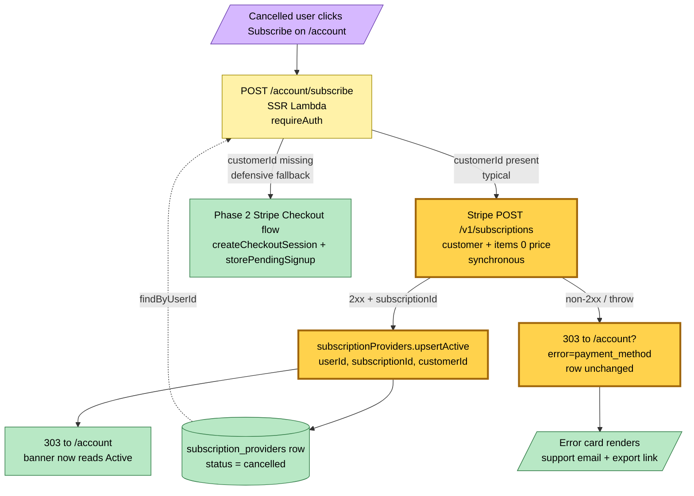
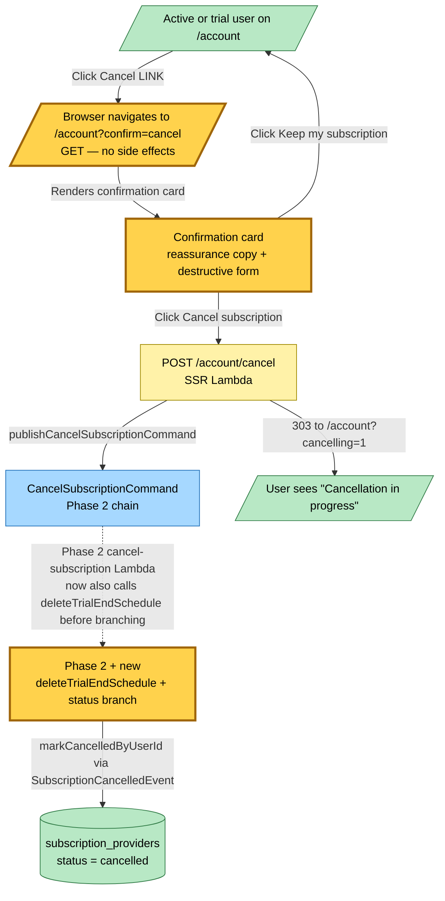

# Trial-End Conversion & One-Click Resubscribe Flow — Event Storming

**Base commit:** `af1a3b2` &nbsp;•&nbsp; **Commit date:** 2026-05-24 &nbsp;•&nbsp; **Generated:** 2026-05-24 &nbsp;•&nbsp; **Branch:** `claude/sweet-ride-xqPZP`
**Subject:** `feat(hutch): trial-end scheduler, charge chain, one-click resubscribe, final copy`

A point-in-time map of the two new conversion flows added in Phase 3:

1. **Trial-end auto-conversion** — at trial signup, an EventBridge Scheduler one-shot rule is created targeting the EventBridge bus with a `SubscriptionStartRequestCommand` payload. When the schedule fires at `trialEndsAt`, the `subscription-start-request` Lambda reads the row and either creates a Stripe subscription on the existing customer (rare — only if a card was attached out-of-band) or publishes `SubscriptionChargeFailed` (the typical no-card case). Charge-failed routes back through Phase 2's `CancelSubscriptionCommand` → `SubscriptionCancelledEvent` chain.
2. **User-initiated one-click resubscribe** — `POST /account/subscribe` on a `cancelled` row with `customerId` calls Stripe `subscriptions.create` synchronously on the saved customer and writes `status='active'`. No Stripe checkout UI. Stripe API failure (declined card, removed payment method) 303s to `/account?error=payment_method`, which renders a friendly error card with a support email link.

What is new in this snapshot:

- **`SubscriptionStartRequestCommand`** — new EventBridge command (`source: "hutch.subscriptions"`, `detailType: "SubscriptionStartRequestCommand"`, detail: `{ userId }`). Published exclusively by the EventBridge Scheduler at trial end; consumed by the `subscription-start-request` Lambda.
- **`SubscriptionChargeSucceededEvent`** — new EventBridge event (`source: "hutch.subscriptions"`, `detailType: "SubscriptionChargeSucceeded"`, detail: `{ userId, subscriptionId, customerId }`). Published by the `subscription-start-request` Lambda after a successful Stripe `subscriptions.create`; consumed by the `subscription-charge-succeeded` Lambda which calls `upsertActive`.
- **`SubscriptionChargeFailedEvent`** — new EventBridge event (`source: "hutch.subscriptions"`, `detailType: "SubscriptionChargeFailed"`, detail: `{ userId, reason }`) where `reason` is `"no_card_on_file"` or `"stripe_error"`. Published by the `subscription-start-request` Lambda; consumed by the `subscription-charge-failed` Lambda which dispatches `CancelSubscriptionCommand`, reusing Phase 2's cancel chain to flip the row to `cancelled`.
- **EventBridge Scheduler group + execution role** — new Pulumi resources. The role is assumed by the EventBridge Scheduler service when a schedule fires and has permission to `events:PutEvents` on the hutch bus.
- **`subscription-start-request` Lambda** — SQS-backed via `HutchSQSBackedLambda`. Subscribes to `SubscriptionStartRequestCommand`. Reads the row, branches:
  - row missing OR `status !== 'trialing'` → noop (defensive — user already converted or cancelled).
  - `trialing` without `customerId` → publishes `SubscriptionChargeFailed({ reason: "no_card_on_file" })`. No Stripe call.
  - `trialing` with `customerId`, Stripe success → publishes `SubscriptionChargeSucceeded`.
  - `trialing` with `customerId`, Stripe throws → publishes `SubscriptionChargeFailed({ reason: "stripe_error" })`.
- **`subscription-charge-succeeded` Lambda** — SQS-backed. Subscribes to `SubscriptionChargeSucceededEvent`. Calls `upsertActive` on the `subscription_providers` row. Terminal.
- **`subscription-charge-failed` Lambda** — SQS-backed. Subscribes to `SubscriptionChargeFailedEvent`. Dispatches `CancelSubscriptionCommand` (Event → Command, allowed by Command/System/Event guidelines).
- **`cancel-subscription` Lambda (Phase 2, modified)** — now calls `deleteTrialEndSchedule({ userId })` after the row lookup, before branching. The `trialing` branch MUST clear the schedule before it can fire and try to charge a now-cancelled user; all other branches call delete idempotently (DeleteSchedule swallows `ResourceNotFoundException`).
- **Auth trial-signup (email + Google OAuth)** — both signup paths now call `createTrialEndSchedule({ userId, firesAt: trialEndsAt })` immediately after `upsertTrialing`. Schedule creation failure is logged and the signup continues — the trial works via `trialEndsAt`-based expiry in `effective-access`, so the degraded behaviour (silent expiry → inactive) is identical to the no-card happy path.
- **Checkout success handler (Phase 0, modified)** — now calls `deleteTrialEndSchedule({ userId })` after `upsertActive`. Idempotent for first-time paid signups where no schedule exists; cleans up the schedule for trial-user-subscribes that converted before trial end.
- **`POST /account/subscribe` cancelled branch (Phase 2, upgraded)** — for a cancelled row WITH `customerId`, calls Stripe `subscriptions.create` synchronously on the saved customer + `upsertActive` → 303 to `/account`. No Stripe checkout UI. On Stripe failure, 303 to `/account?error=payment_method`. For the defensive no-`customerId` case (legacy data, manual fix-up), falls back to the Phase 2 Stripe checkout flow.
- **Active state Cancel button → confirmation link** — the active card's destructive `<form method="POST" action="/account/cancel">` is replaced with an `<a href="/account?confirm=cancel">` link. The destructive POST lives only inside the `?confirm=cancel` card body, behind reassurance copy.
- **New template branches** — `account-card--confirm-cancel` (reassurance copy + destructive POST form + keep-link) and `account-card--error-payment-method` (support email + export link). Visible via `req.query.confirm === "cancel"` (only for active users) and `req.query.error === "payment_method"` respectively.
- **`createSubscriptionOnExistingCustomer`** — new method on the Stripe subscriptions wrapper. Issues `POST /v1/subscriptions` with `customer + items[0][price]` form encoding; returns `{ subscriptionId }`. Two runtime consumers: the `subscription-start-request` Lambda handler and the `POST /account/subscribe` cancelled branch.

> Snapshots are historical. Any file path referenced below may be renamed, moved, or deleted in the future. Treat as an artefact, not a live guide.

---

## Legend

---

## End-to-end flow — trial-end auto-conversion

At trial signup, the SSR Lambda writes the trialing row and creates a one-shot EventBridge Schedule named `trial-end-<userId>` in the `hutch-trial-end-<stage>` group. The schedule's `ScheduleExpression` is `at(<trialEndsAt>)` with `ActionAfterCompletion: DELETE` so it removes itself after firing. When the schedule fires, it publishes a `SubscriptionStartRequestCommand` envelope onto the hutch event bus (using the dedicated scheduler-execution IAM role). EventBridge routes the command to the `subscription-start-request` Lambda via SQS. The handler reads the row and branches on the typical case: `trialing` without `customerId` → `SubscriptionChargeFailedEvent({ reason: "no_card_on_file" })` → `subscription-charge-failed` handler → `CancelSubscriptionCommand` → Phase 2's chain → row flipped to `cancelled`.

---

## End-to-end flow — user-initiated one-click resubscribe

`POST /account/subscribe` on a `cancelled` row with `customerId` skips Stripe Checkout entirely. The SSR Lambda calls Stripe `subscriptions.create` synchronously on the saved customer + `upsertActive` → 303 to `/account`. If Stripe rejects the call (declined card, expired card, removed payment method), the SSR Lambda logs and 303s to `/account?error=payment_method` which renders the friendly error card. The defensive no-`customerId` branch falls back to the Phase 2 Stripe checkout flow.

---

## End-to-end flow — confirmation step on Cancel

The active card no longer carries a destructive POST. Clicking "Cancel subscription" navigates the browser to `/account?confirm=cancel` via GET. That URL state renders the confirmation card: reassurance copy + a destructive `<form method="POST" action="/account/cancel">` + a "Keep my subscription" link back to `/account`. The destructive POST publishes `CancelSubscriptionCommand` (Phase 2 chain), which now also calls `deleteTrialEndSchedule` defensively at the top of the handler.

---

## Command → System → Event reference

| Command / Event | Handler | Side effects | Emits |
|---|---|---|---|
| EventBridge Scheduler fires at `trialEndsAt` | EventBridge Scheduler service (managed) | events:PutEvents to hutch-event-bus via scheduler-execution role | `SubscriptionStartRequestCommand` |
| `SubscriptionStartRequestCommand` (userId) | `subscription-start-request` Lambda (SQS-backed) | Reads `subscription_providers` row, optional Stripe `subscriptions.create` on existing customer | `SubscriptionChargeSucceededEvent` OR `SubscriptionChargeFailedEvent` |
| `SubscriptionChargeSucceededEvent` (userId, subscriptionId, customerId) | `subscription-charge-succeeded` Lambda (SQS-backed) | `upsertActive` on `subscription_providers` table | (terminal — no downstream event) |
| `SubscriptionChargeFailedEvent` (userId, reason) | `subscription-charge-failed` Lambda (SQS-backed) | Dispatches `CancelSubscriptionCommand` (Event → Command) | `CancelSubscriptionCommand` |
| `CancelSubscriptionCommand` (userId) — Phase 2 + modified | `cancel-subscription` Lambda (SQS-backed) | NEW: `deleteTrialEndSchedule({ userId })` at top; existing per-status branch | `SubscriptionCancelledEvent` (direct for trial+pending) or Stripe DELETE (for active) |
| User clicks Subscribe on `/account` (cancelled row + customerId) | SSR Lambda (synchronous) | Stripe `subscriptions.create` + `upsertActive` | (terminal — 303 to /account; if Stripe throws, 303 to /account?error=payment_method) |
| User clicks Cancel LINK on active card | Browser GET to `/account?confirm=cancel` | Renders confirmation card; no state change | (terminal — confirmation step) |

---

## Trust boundaries

The `subscription-start-request` Lambda:

- **IAM**: DynamoDB `GetItem` on `subscription_providers`. EventBridge `PutEvents` (to publish charge-succeeded/failed). External: Stripe API POST `/v1/subscriptions`.
- **Capacity**: 128 MB / 30 s — one Stripe API call and at most one EventBridge publish per event.
- **Failure domain**: own SQS queue + DLQ + SNS alarm + email subscription.

The `subscription-charge-succeeded` Lambda:

- **IAM**: DynamoDB `UpdateItem` on `subscription_providers`. NO EventBridge publish.
- **Capacity**: 128 MB / 30 s.
- **Failure domain**: own SQS queue + DLQ + SNS alarm.

The `subscription-charge-failed` Lambda:

- **IAM**: EventBridge `PutEvents` (to publish `CancelSubscriptionCommand`). NO DynamoDB.
- **Capacity**: 128 MB / 30 s.
- **Failure domain**: own SQS queue + DLQ + SNS alarm.

The `cancel-subscription` Lambda (Phase 2, modified):

- **IAM**: NEW: `scheduler:DeleteSchedule` on the trial-scheduler group's schedules. Existing: DynamoDB `GetItem` on `subscription_providers`, EventBridge `PutEvents`, Stripe API DELETE.

The SSR Lambda (the request-response composition root):

- **IAM**: NEW: `scheduler:CreateSchedule` + `scheduler:DeleteSchedule` on the trial-scheduler group, plus `iam:PassRole` on the scheduler-execution role. Existing: DynamoDB access, EventBridge publish, S3 read/write, etc.

The EventBridge Scheduler execution role (new):

- **IAM**: `events:PutEvents` on the hutch event bus. Trust policy allows assumption by `scheduler.amazonaws.com`.
- **Capacity**: managed by AWS — schedules execute server-side without consuming Lambda quota.

---

## Failure paths

| Failure point | Behaviour | Recovery |
|---|---|---|
| Trial-end schedule creation fails at signup | Logged as warning; signup continues without schedule; user account + trial row created normally | Trial still works via `trialEndsAt`-based expiry in `effective-access`; auto-conversion just won't fire — identical to no-card happy path |
| Trial-end schedule fires but Lambda fails to read DynamoDB | SQS retries per `maxReceiveCount`; exhausted → DLQ + SNS alarm | Operator redrives from DLQ; defensive noop if row state has moved on |
| Stripe `subscriptions.create` declines at trial-end | Lambda publishes `SubscriptionChargeFailed(stripe_error)` → cancel chain | Row ends up `cancelled`; user can attempt one-click resubscribe later or update card via support |
| EventBridge publish fails (any of the three new events) | Record reported in `batchItemFailures`; SQS retries | Automatic via SQS retry → DLQ → SNS |
| Stripe `subscriptions.create` fails during one-click resubscribe | SSR Lambda 303s to `/account?error=payment_method`; row unchanged | User contacts support; row stays `cancelled` |
| User cancels mid-trial via `/account?confirm=cancel` → POST /account/cancel | Phase 2 chain + new `deleteTrialEndSchedule` clears the pending schedule | Idempotent: subsequent schedule fires (if any race) noop because row status is no longer `trialing` |
| Schedule double-fires (defensive) | Second invocation reads row; status is `active` or `cancelled` so handler noops | No mutation; idempotent |

---

## Effective-access read path (unchanged from Phase 2)

`initGetEffectiveAccess` is the read-side projection. With the Phase 3 scheduler in place, the lazy "trial-expired = trialing row + trialEndsAt past" defensive branch becomes a fallback that should rarely trigger — the scheduler is now the authoritative path that flips the row to `cancelled`. No code change in `initGetEffectiveAccess` itself.

---

## Migration notes

- **EventBridge Scheduler group + role** are created as new Pulumi resources. They are stage-isolated (`hutch-trial-end-staging` vs `hutch-trial-end-prod`).
- **Existing trialing rows have NO schedule.** This snapshot intentionally does not backfill — those users will fall through to the lazy "trial-expired" defensive branch in `initGetEffectiveAccess`. A one-off CLI script can iterate `subscription_providers` and create schedules for any row with `status='trialing' && trialEndsAt > now` if desired; in practice the trial cohort is small enough that the lazy fallback suffices.
- **`pending_cancellation`** remains vestigial. No flow in Phase 3 writes it; the effective-access defensive branch from Phase 2 treats it as read-only.
