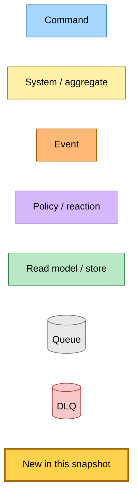
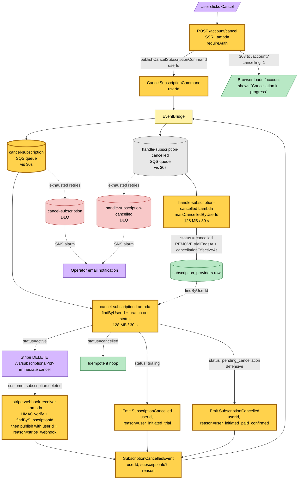
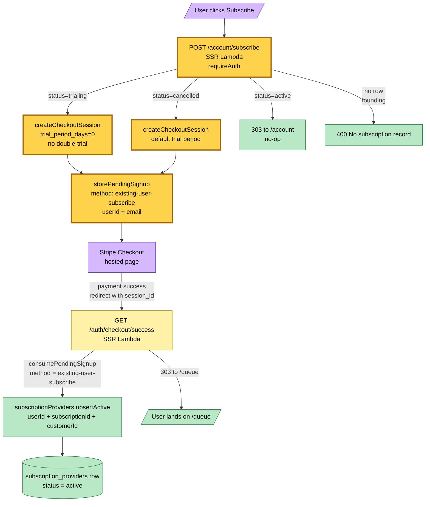

# Account Cancel & Subscribe Flow — Event Storming

**Base commit:** `af1a3b2f` &nbsp;•&nbsp; **Commit date:** 2026-05-24 &nbsp;•&nbsp; **Generated:** 2026-05-23 &nbsp;•&nbsp; **Branch:** `main`
**Subject:** `feat(hutch): account menu + user-initiated cancellation chain (#402)`

A point-in-time map of the user-initiated cancel & in-app subscribe flows surfacing through the new `/account` page. Cancellation goes through a **`CancelSubscriptionCommand`** → handler-Lambda → branch (Stripe API for paid users, direct `SubscriptionCancelledEvent` emission for trial users) → unified `SubscriptionCancelledEvent` handler that writes `status='cancelled'`. Subscribe goes through synchronous Stripe checkout creation + existing `/auth/checkout/success` handler with a new `existing-user-subscribe` pending-signup variant.

What is new in this snapshot:

- **`CancelSubscriptionCommand`** — new EventBridge command (`source: "hutch.subscriptions"`, `detailType: "CancelSubscriptionCommand"`, detail: `{ userId }`). Published by `POST /account/cancel` and consumed by the new `cancel-subscription` Lambda.
- **`SubscriptionCancelledEvent` payload broadening** — moves `source` from `"hutch.stripe-webhook"` → `"hutch.subscriptions"` (the event now has multiple producers), and the detail schema grows from `{ subscriptionId }` to `{ userId, subscriptionId?, reason }`. `reason` is an audit-only enum (`stripe_webhook | user_initiated_trial | user_initiated_paid_confirmed`). `userId` is required; `subscriptionId` is optional for trial cancels that have no Stripe subscription.
- **`cancel-subscription` Lambda** — SQS-backed via `HutchSQSBackedLambda`. Subscribes to `CancelSubscriptionCommand`. Looks up the row by `userId`, branches on `status`:
  - `active` → calls Stripe `DELETE /v1/subscriptions/<id>` (immediate cancel). Stripe fires `customer.subscription.deleted` → existing webhook chain → `SubscriptionCancelledEvent` (with `reason: stripe_webhook`).
  - `trialing` → publishes `SubscriptionCancelledEvent` directly (`reason: user_initiated_trial`, no `subscriptionId`).
  - `pending_cancellation` (vestigial) → publishes `SubscriptionCancelledEvent` (`reason: user_initiated_paid_confirmed`).
  - `cancelled` → idempotent noop.
- **Stripe webhook receiver updated** — looks up `userId` via `subscriptionId-index` GSI before publishing `SubscriptionCancelledEvent`, so the published event always carries `userId` and the downstream handler can operate on the primary key.
- **`SubscriptionCancelled` handler updated** — switches from `markCancelled({ subscriptionId })` (GSI lookup + update) to `markCancelledByUserId({ userId })` (direct primary-key update). The handler no longer hits the GSI.
- **`/account` page** — new authenticated SSR route with four reachable states (`founding | active | trial | inactive`). Trial-expired and cancelled both render identical inactive DOM — the internal `reason` does not leak into copy.
- **`POST /account/cancel`** — publishes `CancelSubscriptionCommand`, 303s to `/account?cancelling=1`. HTTP layer never calls Stripe directly.
- **`POST /account/subscribe`** — synchronous Stripe checkout creation. Stores a new `existing-user-subscribe` pending-signup variant; the existing `/auth/checkout/success` handler consumes it and calls `upsertActive` on the existing userId. Trial users get `trial_period_days: 0` to suppress double-trial; cancelled users get the default trial.
- **`pending_cancellation` narrowed to read-only** — defensive change in `initGetEffectiveAccess`. No flow in the redesigned chain writes this state; any legacy row that has it is treated as inactive.

> Snapshots are historical. Any file path referenced below may be renamed, moved, or deleted in the future. Treat as an artefact, not a live guide.

---

## Legend

Mermaid source

---

## End-to-end flow — user clicks Cancel on /account

`POST /account/cancel` publishes `CancelSubscriptionCommand` and 303s back to `/account?cancelling=1`. The `cancel-subscription` Lambda picks up the command from SQS, reads the `subscription_providers` row, and branches on `status`. The `active` branch calls Stripe's immediate-cancel API; Stripe sends `customer.subscription.deleted` to the existing webhook chain (which is updated to look up `userId` via the GSI before publishing). The `trialing` and `pending_cancellation` branches publish `SubscriptionCancelledEvent` directly. Either way, the unified `handle-subscription-cancelled` Lambda calls `markCancelledByUserId` to flip the row to `cancelled`.

Mermaid source

---

## End-to-end flow — user clicks Subscribe on /account

`POST /account/subscribe` looks up the row and branches on `status`. Trial users go through Stripe Checkout with `trial_period_days: 0` to suppress a second free trial; cancelled users use the default 14-day trial. Both write an `existing-user-subscribe` pending-signup row keyed by the Stripe `checkoutSessionId`, then 303 to the Stripe-hosted Checkout URL. On successful payment, Stripe redirects to the existing `/auth/checkout/success` route which consumes the pending signup and `upsertActive`s the existing user's subscription row.

Mermaid source

---

## Effective-access read path (no change in fields, narrowed branch)

`initGetEffectiveAccess` is the read-side projection used by both the SSR Lambda's `requireWriteAccess` middleware and the `/account` view-model. After this snapshot:

- `pending_cancellation` returns `tier: "inactive", access: "read-only", banner: "inactive", reason: "subscription-cancelled"`. No flow in the redesign produces this state; the branch exists as a defensive read-side narrowing so legacy rows surface as inactive (worst case for the user, but recoverable via Subscribe).
- All other branches unchanged.

---

## Failure paths

| Failure point | Behaviour | Recovery |
|---|---|---|
| `POST /account/cancel` publish fails | 5xx; user sees an error, retries by clicking again | Retry via UI |
| `cancel-subscription` Lambda throws (active branch, Stripe API down) | SQS retries per `maxReceiveCount`; exhausted → DLQ with SNS email alarm | Operator redrives from DLQ once Stripe is back |
| `cancel-subscription` Lambda throws (trialing/pending branch, EventBridge publish fails) | Same — SQS retry → DLQ → email | Operator redrives |
| Stripe `customer.subscription.deleted` arrives before row exists in DynamoDB | Webhook lookup returns no row; webhook logs warning and returns 200 (Stripe stops retrying); no event emitted | Operator can manually emit `SubscriptionCancelledEvent` if needed |
| `SubscriptionCancelled` handler `markCancelledByUserId` fails | Record reported in `batchItemFailures`; SQS retries that record | Automatic via SQS retry → DLQ |

---

## Command → System → Event reference

| Command / Event | Handler | Side effects | Emits |
|---|---|---|---|
| User clicks Cancel (HTTP POST /account/cancel) | SSR Lambda | Publishes `CancelSubscriptionCommand` | `CancelSubscriptionCommand` |
| `CancelSubscriptionCommand` (userId) | `cancel-subscription` Lambda (SQS-backed) | active: Stripe DELETE / trialing+pending: emit / cancelled: noop | `SubscriptionCancelledEvent` (direct, for trial+pending) — active relies on Stripe webhook to emit |
| Stripe `customer.subscription.deleted` (HTTP POST) | `stripe-webhook-receiver` Lambda (API Gateway) | HMAC verify + GSI lookup of userId by subscriptionId | `SubscriptionCancelledEvent` (`reason: stripe_webhook`) |
| `SubscriptionCancelledEvent` (userId, subscriptionId?, reason) | `handle-subscription-cancelled` Lambda (SQS-backed) | `markCancelledByUserId` on `subscription_providers` table | (terminal — no downstream event) |
| User clicks Subscribe (HTTP POST /account/subscribe) | SSR Lambda | `createCheckoutSession` + `storePendingSignup` (`method: existing-user-subscribe`) | (terminal — synchronous redirect to Stripe) |
| Stripe checkout success (HTTP GET /auth/checkout/success?session_id=…) | SSR Lambda | `consumePendingSignup` + `upsertActive` on `subscription_providers` | (terminal — synchronous redirect) |

---

## Trust boundaries

The `cancel-subscription` Lambda is SQS-backed:

- **IAM**: DynamoDB `GetItem` on `subscription_providers` table (read-only — does not mutate the row directly; row updates happen in `handle-subscription-cancelled`). EventBridge `PutEvents` (to publish `SubscriptionCancelledEvent` for trial+pending branches). External: Stripe API DELETE on `/v1/subscriptions/<id>`.
- **Capacity**: 128 MB / 30 s — one Stripe API call and at most one EventBridge publish per event.
- **Failure domain**: own SQS queue + DLQ + SNS alarm + email subscription.

The `stripe-webhook-receiver` Lambda is API Gateway-fronted (unchanged in trust shape, but now reads from DynamoDB):

- **IAM**: now also requires DynamoDB `Query` on `subscription_providers` GSI (`subscriptionId-index`) for the userId lookup before publishing. EventBridge `PutEvents` to publish `SubscriptionCancelledEvent`.
- **Capacity**: 128 MB / 10 s — signature verification + GSI lookup + EventBridge publish.

The `handle-subscription-cancelled` Lambda is SQS-backed (unchanged):

- **IAM**: DynamoDB `UpdateItem` on `subscription_providers` table (primary-key update now — no longer needs GSI access).
- **Capacity**: 128 MB / 30 s.
