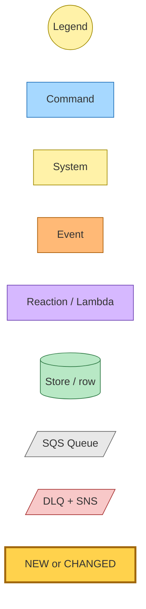
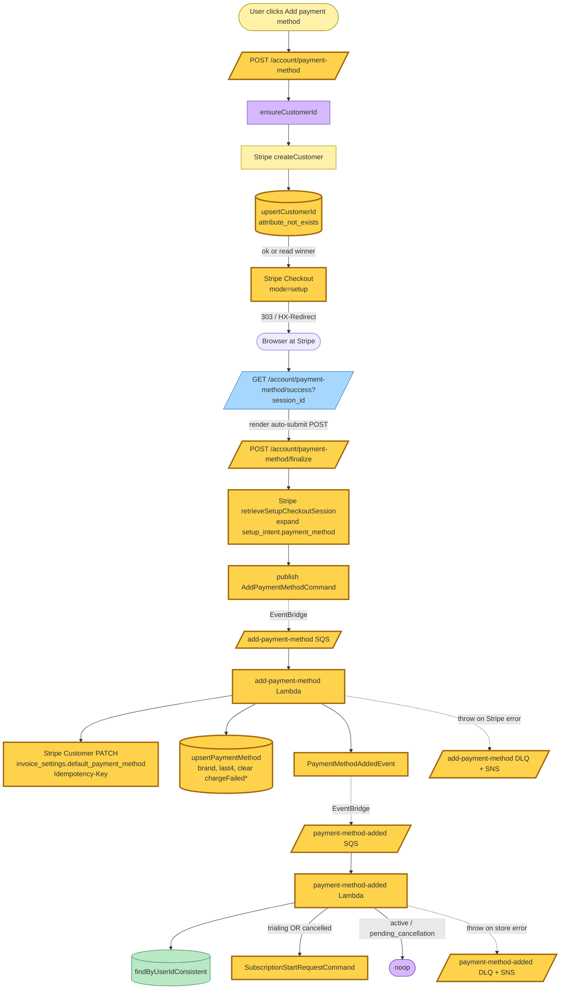
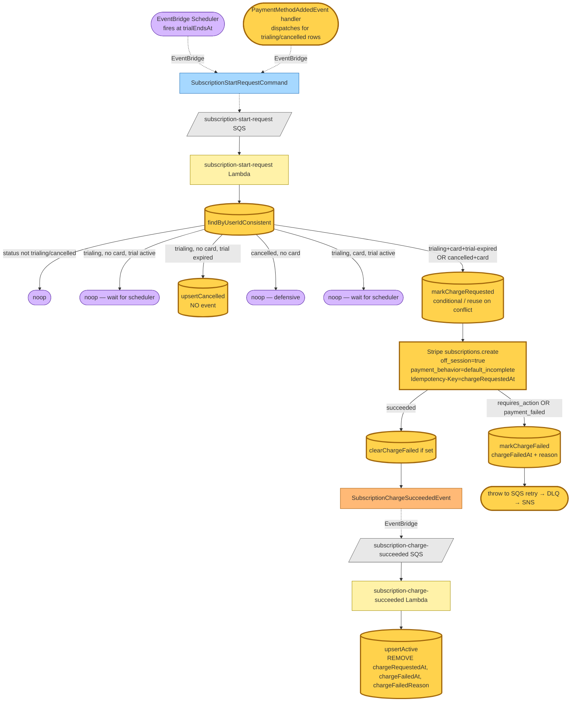
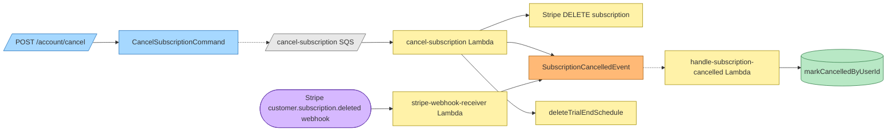

# Decoupled card capture and subscription creation

Snapshot of the post-decoupling subscription state machine. The single
"Subscribe — $3.99/month" button has been split into two stages: card
capture via Stripe Checkout `mode=setup`, then a deferred off-session
charge driven by the existing trial-end scheduler OR a new
`PaymentMethodAddedEvent` (for users who add a card after their trial
has lapsed or after a cancellation).

The auto-cancel-on-decline cascade (`SubscriptionChargeFailedEvent` →
`CancelSubscriptionCommand` → row flips to `cancelled`) is gone.
Charge failures are now persisted on the row (`chargeFailedAt` +
`chargeFailedReason`) and surfaced as a warning banner on `/account`;
SQS retry exhaustion still pages the operator via the standard DLQ +
SNS alarm.

## Legend

| Role | Fill | Stroke |
|---|---|---|
| Command | `#a6d8ff` | `#1e6fb8` |
| System / aggregate | `#fff2a8` | `#a08a00` |
| Event | `#ffb976` | `#a85800` |
| Policy / reaction | `#d6b8ff` | `#6b3fb0` |
| Read model / store | `#b8e8c5` | `#2f7a45` |
| Queue | `#e8e8e8` | `#666` |
| DLQ | `#f8c8c8` | `#a83434` |
| **New / changed in this snapshot** | `#ffd24c` | `#a0660b` (3px) |

## Card capture (Add payment method)

## Trial-end charge + post-trial charge

## Cancellation chain (unchanged)

## Command → System → Event(s) reference

| Command / Event | Handler | Emits | Triggers next |
|---|---|---|---|
| **`AddPaymentMethodCommand`** (new) | `add-payment-method` Lambda | `PaymentMethodAddedEvent` | payment-method-added Lambda |
| **`PaymentMethodAddedEvent`** (new) | `payment-method-added` Lambda | `SubscriptionStartRequestCommand` (for trialing/cancelled) | subscription-start-request Lambda |
| `SubscriptionStartRequestCommand` (existing — new branching) | `subscription-start-request` Lambda | `SubscriptionChargeSucceededEvent` (success) OR row write + throw (failure) | subscription-charge-succeeded Lambda OR DLQ SNS |
| `SubscriptionChargeSucceededEvent` (existing — handler clears charge sentinels) | `subscription-charge-succeeded` Lambda | (terminal — row write) | n/a |
| ~~`SubscriptionChargeFailedEvent`~~ (DELETED) | ~~`subscription-charge-failed` Lambda~~ | ~~`CancelSubscriptionCommand`~~ | DLQ row banner replaces this chain |
| `CancelSubscriptionCommand` (unchanged) | `cancel-subscription` Lambda | `SubscriptionCancelledEvent`, deleteTrialEndSchedule | handle-subscription-cancelled Lambda |
| `SubscriptionCancelledEvent` (unchanged) | `handle-subscription-cancelled` Lambda | (terminal — row write) | n/a |

## Idempotency & race-condition strategy

Three layers of defence prevent duplicate charges across SQS at-least-once
redeliveries, EventBridge fan-out duplicates, and concurrent producer races
(the trial-end scheduler firing at the same moment as PaymentMethodAddedEvent):

1. **DynamoDB conditional write on `chargeRequestedAt`** — first writer wins;
   conflicts cause the loser to re-read the winner's `chargeRequestedAt` and
   reuse it as the Stripe Idempotency-Key.
2. **Stripe Idempotency-Key** on `customers.update` (set default PM) and
   `subscriptions.create` — Stripe dedupes server-side for 24h, so even
   without the conditional write Stripe would not double-charge.
3. **`ConsistentRead: true`** in `findByUserIdConsistent` — eliminates
   eventual-consistency windows where the scheduler reads stale row state
   while a card-add write is in flight.

## Deletion / deploy ordering

`SubscriptionChargeFailedEvent` + its handler are deleted in the same
commit. The unsubscribe (Pulumi removes the `eventBus.subscribe` rule)
and the Lambda deletion happen in the same `pulumi up`. Stripe-side
behaviour is preserved: the producer (`subscription-start-request`)
stops emitting in the same code commit, so no in-flight events of the
deleted type can exist at deploy time. Any pre-existing in-flight
messages on the DLQ-bound queue would dead-letter to SNS — operationally
acceptable given the queue typically carries no traffic.
