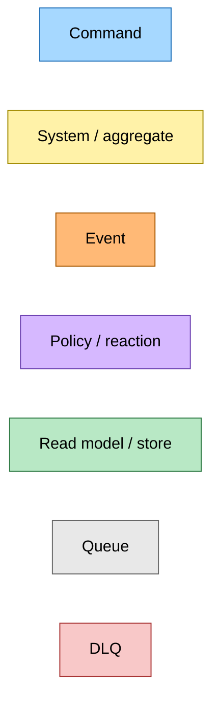
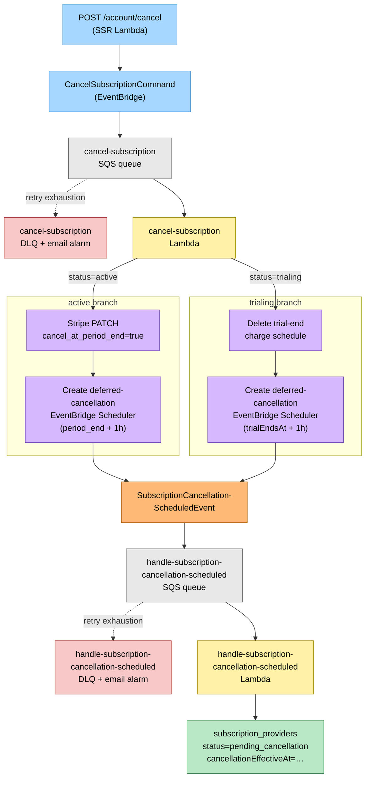
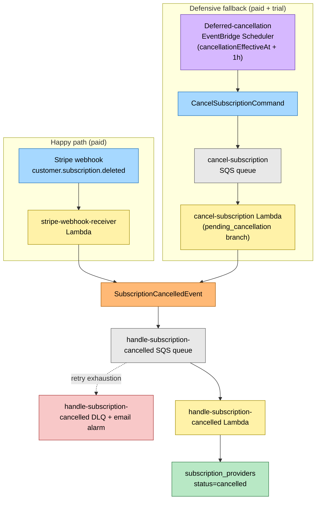
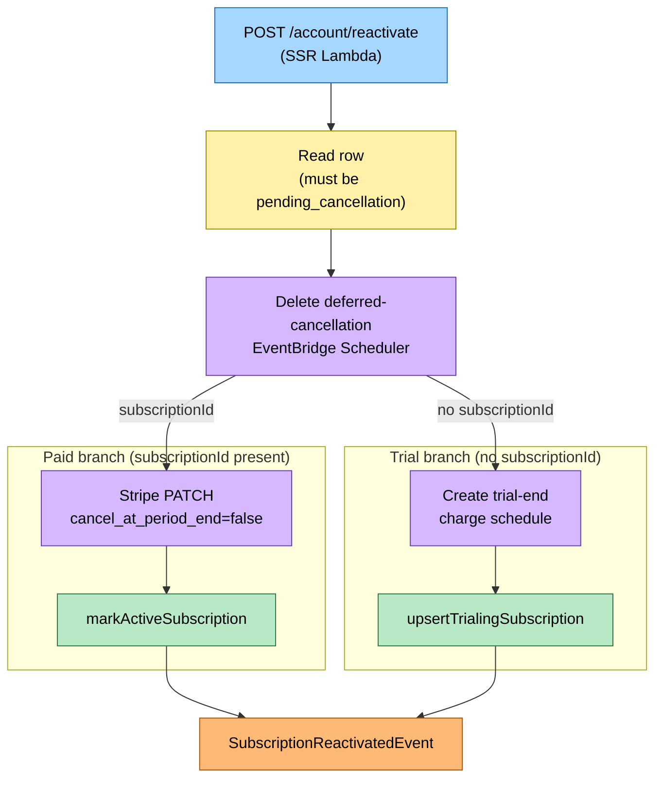
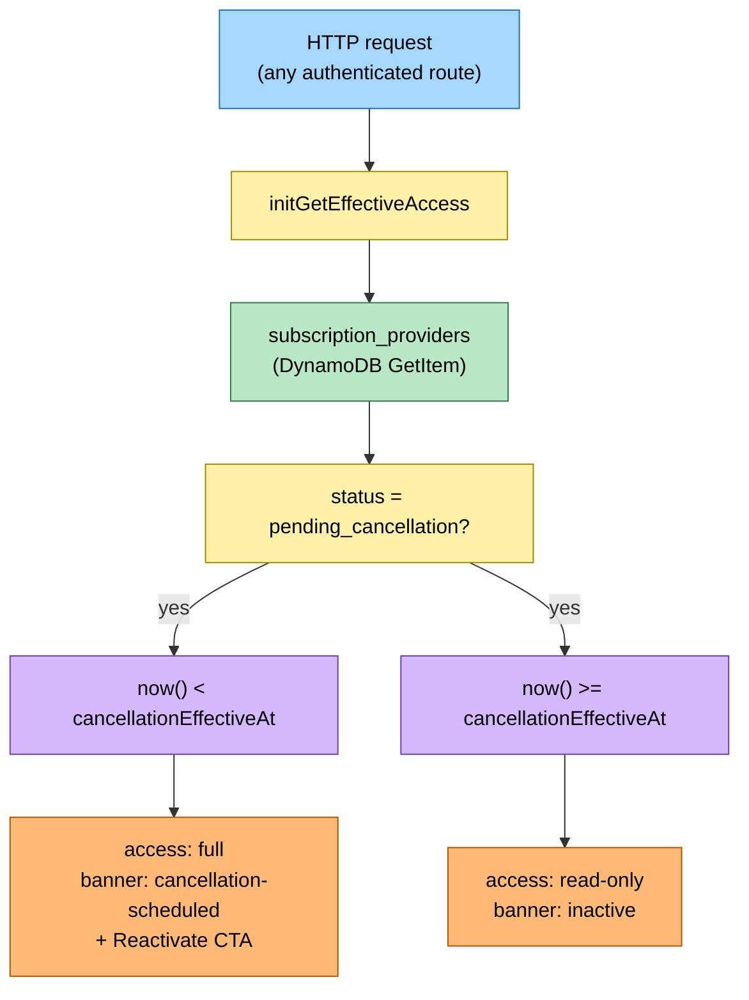

# Deferred Subscription Cancellation Flow

> **Snapshot commit:** `60e8e699` (2026-05-28, branch `claude/laughing-dirac-QlUGH`)
>
> **Scope:** user-initiated cancel (`POST /account/cancel`), deferred-cancellation convergence (Stripe webhook + EventBridge Scheduler), reactivation (`POST /account/reactivate`), and the `pending_cancellation` access gate.

---

## Legend

---

## Diagram 1 — Cancel flow (active + trialing)

User clicks Cancel on the account page. The SSR Lambda publishes `CancelSubscriptionCommand` via EventBridge. The `cancel-subscription` Lambda branches on the row's current status: paid users get a Stripe `cancel_at_period_end` PATCH, trial users get their trial-end schedule deleted. Both branches create a deferred-cancellation EventBridge Scheduler rule and emit `SubscriptionCancellationScheduledEvent`. The `handle-subscription-cancellation-scheduled` Lambda writes `status='pending_cancellation'` + `cancellationEffectiveAt` to the row.

---

## Diagram 2 — Convergence: deferred scheduler + Stripe webhook

Two paths drive the row from `pending_cancellation` to `cancelled`. The happy path is Stripe's `customer.subscription.deleted` webhook arriving before the scheduler fires. The defensive fallback is the deferred-cancellation EventBridge Scheduler firing `CancelSubscriptionCommand` at `cancellationEffectiveAt + 1h` against a row already in `pending_cancellation`. Both paths converge on `handle-subscription-cancelled`.

---

## Diagram 3 — Reactivation flow

User clicks Reactivate on the account page while in `pending_cancellation`. The SSR Lambda deletes the deferred-cancellation schedule first (prevents re-cancel race), then branches: paid users get a Stripe PATCH to reverse `cancel_at_period_end` + row flipped to `active`; trial users get the trial-end charge schedule recreated + row flipped back to `trialing`. Both paths publish `SubscriptionReactivatedEvent` (no load-bearing handler today).

---

## Diagram 4 — Access gate (pending_cancellation time window)

The SSR Lambda calls `initGetEffectiveAccess` on every request. A `pending_cancellation` row grants full access while `now() < cancellationEffectiveAt`, showing a `cancellation-scheduled` banner with a Reactivate CTA. Past that instant, the user drops to `inactive` / read-only.

---

## Command → System → Event(s) reference table

| Command / Trigger | System | Event(s) emitted | Next command(s) |
|---|---|---|---|
| `POST /account/cancel` | SSR Lambda (hutch) | — | `CancelSubscriptionCommand` |
| `CancelSubscriptionCommand` (active row) | cancel-subscription Lambda | `SubscriptionCancellationScheduledEvent` | — (creates deferred-cancellation EventBridge Scheduler) |
| `CancelSubscriptionCommand` (trialing row) | cancel-subscription Lambda | `SubscriptionCancellationScheduledEvent` | — (deletes trial-end schedule, creates deferred-cancellation EventBridge Scheduler) |
| `CancelSubscriptionCommand` (pending_cancellation row) | cancel-subscription Lambda | `SubscriptionCancelledEvent` | — |
| `CancelSubscriptionCommand` (cancelled row) | cancel-subscription Lambda | — (noop) | — |
| `SubscriptionCancellationScheduledEvent` | handle-subscription-cancellation-scheduled Lambda | — (writes `pending_cancellation` row) | — |
| Deferred-cancellation EventBridge Scheduler (fires at `cancellationEffectiveAt + 1h`) | EventBridge Scheduler | — | `CancelSubscriptionCommand` (defensive fallback) |
| Stripe webhook `customer.subscription.deleted` | stripe-webhook-receiver Lambda | `SubscriptionCancelledEvent` | — |
| `SubscriptionCancelledEvent` | handle-subscription-cancelled Lambda | — (writes `cancelled` row) | — |
| `POST /account/reactivate` (paid) | SSR Lambda (hutch) | `SubscriptionReactivatedEvent` | — (deletes deferred-cancellation schedule, Stripe PATCH, markActive) |
| `POST /account/reactivate` (trial) | SSR Lambda (hutch) | `SubscriptionReactivatedEvent` | — (deletes deferred-cancellation schedule, creates trial-end schedule, upsertTrialing) |
