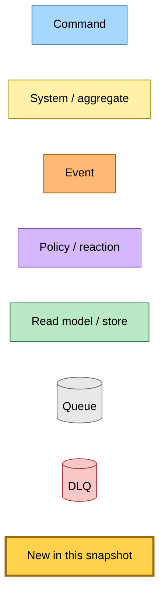
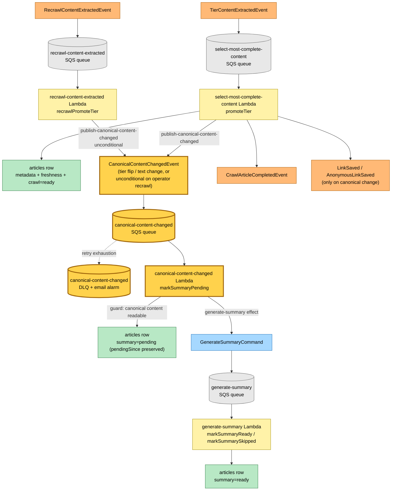

# Event-Driven Summary Regeneration on Canonical Content Change

> **Snapshot commit:** `0610dc08` (2026-05-30, branch `main`)
>
> **Scope:** the new `CanonicalContentChangedEvent` seam. Two
> canonical-establishing transitions — the save / tier-selector path
> (`promoteTier`) and the operator-recrawl path (`recrawlPromoteTier`) — stop
> resetting the summary axis themselves and instead announce that the canonical
> content changed; a new `canonical-content-changed` Lambda subscribes and
> re-primes the summary (`markSummaryPending`) so the existing `generate-summary`
> worker regenerates against the new canonical instead of cache-hitting a stale
> terminal `skipped`/`ready` summary. `promoteTier` announces on a tier flip or
> content-hash change; `recrawlPromoteTier` announces **unconditionally** (an
> operator recrawl is an explicit "rebuild this", so every recrawl regenerates).
>
> **Why:** a row could sit permanently at `summaryStatus=skipped(content-too-short)`
> when the canonical **tier flipped** (`canonicalChanged=true`) but the readable
> text hashed identically to a value already recorded during a transient degraded
> crawl (`contentChanged=false`). `promoteTier` gated regeneration on
> `contentChanged` only, so it never re-fired; the universal `link-saved →
> GenerateSummaryCommand` path then cache-hit the stale `skipped` row. Moving
> regeneration onto an independent subscriber closes that gap and keeps the
> staleness decision in one place (OCP): a future transcript/embedding consumer is
> a new `eventBus.subscribe(CanonicalContentChangedEvent, …)` and nothing else.

---

## Legend

Mermaid source

---

## Diagram — selector announces, subscriber regenerates

Two publishers feed the same event. `TierContentExtractedEvent` drives the
`select-most-complete-content` Lambda; its `promoteTier` transition emits
`publish-canonical-content-changed` whenever the canonical **tier flipped** OR the
**readable text changed** (a row with no prior hash counts as changed — lazy
backfill). `RecrawlContentExtractedEvent` drives the `recrawl-content-extracted`
Lambda; its `recrawlPromoteTier` transition emits `publish-canonical-content-changed`
**unconditionally** on every promotion (operator recrawl always regenerates).
Neither transition touches the summary axis. The new `canonical-content-changed`
Lambda subscribes, guards on the canonical S3 object being readable, and runs
`markSummaryPending`, which flips the summary to `pending` (preserving an existing
`pendingSince` so the SLO age-gate is not reset) and dispatches
`GenerateSummaryCommand` to the existing queue. The unchanged `generate-summary`
worker — no longer cache-hitting a terminal row — regenerates and writes
`markSummaryReady`.

Mermaid source

---

## Command → System → Event(s) reference table

| Command / Trigger | System | Event(s) emitted | Next command(s) |
|---|---|---|---|
| `TierContentExtractedEvent` | `select-most-complete-content` Lambda (`promoteTier`) | `CanonicalContentChanged` (on tier flip OR text change), `CrawlArticleCompleted`, `LinkSaved` / `AnonymousLinkSaved` (only on canonical change) | — |
| `RecrawlContentExtractedEvent` | `recrawl-content-extracted` Lambda (`recrawlPromoteTier`) | `CanonicalContentChanged` (unconditional — every operator recrawl), `RecrawlCompleted` | — |
| `CanonicalContentChangedEvent` *(new)* | `canonical-content-changed` Lambda (`markSummaryPending`) | — (writes `summary=pending`) | `GenerateSummaryCommand` |
| `GenerateSummaryCommand` | `generate-summary` Lambda (`markSummaryReady` / `markSummarySkipped`) | `SummaryGenerated` (on ready) | — |
| `LinkSavedEvent` | `link-saved` Lambda | — | `GenerateSummaryCommand` (universal save path, unchanged) |

> **Scope boundary:** `promoteTier` (save / tier-selector) and
> `recrawlPromoteTier` (operator recrawl) both announce `CanonicalContentChanged`.
> Two paths are intentionally NOT migrated: the automatic stale-refresh
> (`refreshContent`) keeps its `contentChanged`-gated inline regeneration (an
> automatic refresh should not burn tokens on unchanged content), and the
> tie-kept-canonical case (`recrawlTieKeptCanonical`) does not emit the event
> because the canonical content is, by definition, unchanged. Migrating
> `refreshContent` for full consistency is a documented follow-up.
