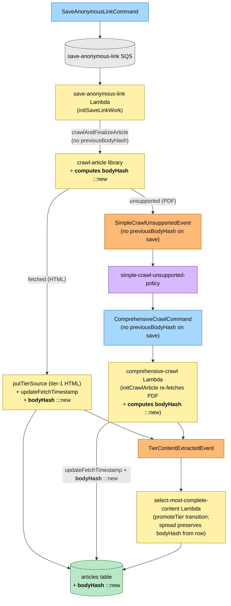

# Pre-Parse Body-Hash Gate — Refresh Flow

Commit: `a13e8ce`
Date (commit): 2026-05-30
Generated: 2026-05-30
Branch: `claude/loving-johnson-ZZw55`

## Why

When the article-refresh chain re-fetches a URL whose origin returns
`200 OK` (rather than `304 Not Modified`), the system previously paid the
full parse cost — including mupdf extraction on 200+ page PDFs that can
take tens of seconds — even when the bytes returned were byte-identical to
the previously parsed version. Origins that strip / ignore conditional
headers (static-file hosts, asset CDNs, dynamic-print services) routinely
return `200 OK` for content that has not actually changed.

The change computes a SHA-256 of the raw response body in the crawl
library immediately after the body is materialised, compares it against
a `bodyHash` value persisted on the freshness row, and short-circuits the
parse on match. The hash propagates through the existing event chain
alongside `etag` / `lastModified` so the next refresh tick can repeat the
check.

## Legend

| Role | Fill | Stroke |
|---|---|---|
| Command | `#a6d8ff` | `#1e6fb8` |
| System / aggregate | `#fff2a8` | `#a08a00` |
| Event | `#ffb976` | `#a85800` |
| Policy / reaction | `#d6b8ff` | `#6b3fb0` |
| Read model / store | `#b8e8c5` | `#2f7a45` |
| Queue | `#e8e8e8` | `#666` |
| DLQ | `#f8c8c8` | `#a83434` |
| **New** (this snapshot) | `#ffd24c` | `#a0660b` |

`:::new` marks the fields and edges introduced by this PR.

## Refresh flow (HTML + PDF) with the body-hash gate

The diagram covers every Lambda that touches the refresh chain. The
byte-gate fires inside the crawl library on a 200 OK whose body hashes to
the value persisted on the freshness row.

```mermaid
flowchart TD
	classDef command fill:#a6d8ff,stroke:#1e6fb8,color:#000;
	classDef system fill:#fff2a8,stroke:#a08a00,color:#000;
	classDef event fill:#ffb976,stroke:#a85800,color:#000;
	classDef policy fill:#d6b8ff,stroke:#6b3fb0,color:#000;
	classDef store fill:#b8e8c5,stroke:#2f7a45,color:#000;
	classDef queue fill:#e8e8e8,stroke:#666,color:#000;
	classDef new fill:#ffd24c,stroke:#a0660b,stroke-width:3px,color:#000;

	%% Trigger
	WebSlash["/queue/&lt;id&gt;/freshness<br/>or scheduler"]:::command
	WebSlash --> StaleEvent
	StaleEvent["StaleCheckRequestedEvent"]:::event
	StaleEvent --> StaleQueue
	StaleQueue[(stale-check SQS)]:::queue
	StaleQueue --> StaleCheck
	StaleCheck["stale-check Lambda<br/>(initStaleCheckHandler)"]:::system

	%% Freshness read
	ArticleTable[("articles table<br/>etag, lastModified,<br/>contentFetchedAt,<br/><b>bodyHash</b> :::new")]:::store
	StaleCheck -->|findArticleFreshness<br/>reads <b>bodyHash</b> :::new| ArticleTable

	%% Crawl call (in-process)
	StaleCheck -->|crawlAndFinalizeArticle<br/>&#123; etag, lastModified,<br/><b>previousBodyHash</b> :::new &#125;| CrawlLib["crawl-article library<br/>conditional GET<br/>+ <b>SHA-256 of body</b> :::new<br/>+ <b>gate vs previousBodyHash</b> :::new"]:::system

	CrawlLib -- "not-modified<br/>(304 OR byte-gate hit) :::new" --> UFTCmd
	CrawlLib -- "fetched (HTML)" --> RefreshHtmlPath
	CrawlLib -- "unsupported (PDF body)" --> UnsupportedEvent
	CrawlLib -- "failed" --> SkipDone(["skip"])

	%% Not-modified branch
	UFTCmd["UpdateFetchTimestampCommand<br/>+ <b>bodyHash</b> :::new"]:::command
	UFTCmd --> UFTQueue
	UFTQueue[(update-fetch-timestamp SQS)]:::queue
	UFTQueue --> UFTLambda
	UFTLambda["update-fetch-timestamp Lambda"]:::system
	UFTLambda -->|"writes contentFetchedAt<br/>+ <b>bodyHash</b> :::new"| ArticleTable

	%% HTML fetched path
	RefreshHtmlPath["publishRefreshArticleContent<br/>(stages HTML in S3)"]:::policy
	RefreshHtmlPath --> RACmd
	RACmd["RefreshArticleContentCommand<br/>+ <b>bodyHash</b> :::new"]:::command
	RACmd --> RAQueue
	RAQueue[(refresh-article-content SQS)]:::queue
	RAQueue --> RALambda
	RALambda["refresh-article-content Lambda"]:::system
	RALambda --> RCEvent

	%% PDF unsupported path
	UnsupportedEvent["SimpleCrawlUnsupportedEvent<br/>&#123; refresh: true,<br/><b>previousBodyHash</b> :::new &#125;"]:::event
	UnsupportedEvent --> SCUQueue
	SCUQueue[(simple-crawl-unsupported-policy SQS)]:::queue
	SCUQueue --> Policy["simple-crawl-unsupported-policy Lambda"]:::policy
	Policy --> CompCmd
	CompCmd["ComprehensiveCrawlCommand<br/>+ <b>previousBodyHash</b> :::new"]:::command
	CompCmd --> CompQueue
	CompQueue[(comprehensive-crawl SQS)]:::queue
	CompQueue --> CompLambda
	CompLambda["comprehensive-crawl Lambda<br/>re-fetches via crawl-article<br/>+ <b>byte-gate</b> :::new"]:::system

	CompLambda -- "not-modified<br/>(byte-gate hit) :::new" --> UFTLambdaCall["updateFetchTimestamp<br/>(in-process call<br/>+ <b>bodyHash</b> :::new)"]:::system
	UFTLambdaCall -->|writes| ArticleTable

	CompLambda -- "fetched (PDF parsed)" --> RCEventPdf

	RCEvent["RefreshContentExtractedEvent<br/>+ <b>bodyHash</b> :::new"]:::event
	RCEventPdf["RefreshContentExtractedEvent<br/>+ <b>bodyHash</b> :::new"]:::event

	%% Persister
	RCEvent --> RCEQueue
	RCEventPdf --> RCEQueue
	RCEQueue[(refresh-content-extracted SQS)]:::queue
	RCEQueue --> RCELambda
	RCELambda["refresh-content-extracted Lambda<br/>runs selector + refreshContent transition"]:::system
	RCELambda -->|"refreshContent input.freshness:<br/>etag, lastModified,<br/>contentFetchedAt, <b>bodyHash</b> :::new"| ArticleTable
```

Mermaid source

## Save / recrawl flow (unchanged downstream, threaded `bodyHash`)

The save and recrawl chains do not send a `previousBodyHash` (no prior body
to compare against), so the gate never fires on those entry points. The
freshly computed `bodyHash` from the crawl library is persisted via
`updateFetchTimestamp` so subsequent refreshes have a value to compare
against.

Mermaid source

## Wire-format change reference

The table below enumerates every wire-format mutation in this PR, all of
which are optional fields so in-flight messages and legacy rows continue to
flow.

| Wire format | Field added | Role |
|---|---|---|
| `SimpleCrawlUnsupportedEvent` | `previousBodyHash?: string` | Stale-check publishes with the row's stored hash so the policy → comprehensive chain can re-fire the gate on a PDF re-fetch. |
| `ComprehensiveCrawlCommand` | `previousBodyHash?: string` | Forwarded by the policy Lambda; consumed by the comprehensive Lambda when it invokes `crawlArticle`. |
| `UpdateFetchTimestampCommand` | `bodyHash?: string` | Stale-check carries forward the existing hash on `not-modified` so a row that previously had none lands one on first match. |
| `RefreshArticleContentCommand` | `bodyHash?: string` | Stale-check publishes the freshly-hashed body on the HTML `fetched` path; the refresh-article-content Lambda forwards it to the downstream event. |
| `RefreshContentExtractedEvent` | `bodyHash?: string` | The refresh-content-extracted Lambda lands it on the freshness row via `refreshContent(input.freshness.bodyHash)`. |

DynamoDB freshness row gains a `bodyHash` string attribute. DynamoDB is
schemaless on non-key attributes, so no migration is required.

## Library / type changes

| Type | Change |
|---|---|
| `CrawlArticle` callable params | `previousBodyHash?: string` |
| `CrawlArticleResult & { status: "fetched" }` | `bodyHash: string` (always populated) |
| `CrawlAndFinalizeArticle` params | `previousBodyHash?: string` |
| `CrawlAndFinalizeResult & { status: "fetched" }` | `bodyHash: string` |
| `UpdateFetchTimestamp` callable | `bodyHash?: string` |
| `ArticleFreshness` (aggregate) | `bodyHash?: string` |
| `ArticleFreshnessData` (provider) | `bodyHash?: string` |

## Comprehensive-Lambda `not-modified` path — design note

The comprehensive Lambda's previously-fetched code paths were:
- `unsupported` — `markCrawlUnsupported` transition, no event emitted.
- `fetched` — tier source written, freshness updated, downstream event emitted.

This PR adds a `not-modified` path that fires when the comprehensive
re-fetch returns 200 OK whose body matches the carried-forward
`previousBodyHash`. We call `updateFetchTimestamp` directly in-process to
bump `contentFetchedAt` and carry the hash forward — consistent with the
existing `unsupported` path's non-publish pattern. No new event was added
because the canonical row state is already correct; the gate exists solely
to skip a no-op parse.

The alternative — introducing a `ContentFetchVerifiedEvent` that a tiny
new Lambda subscribed to — would require a whole new queue + DLQ + alarm
chain for what is logically a single-row update already available
in-process. The pragmatic option was preferred. If a future consumer ever
needs to react to "body verified unchanged" externally, the event can be
introduced at that point.

## Rollout & rollback notes

- **In-flight messages without the new fields** continue to flow because
  all new fields are optional. A message dispatched before deploy that
  arrives after will simply skip the gate (no `previousBodyHash` →
  parse runs → new `bodyHash` is computed and persisted).
- **Legacy DynamoDB rows without `bodyHash`** behave the same way on
  their first post-deploy refresh: gate is skipped, parse runs, hash is
  computed and persisted, next refresh benefits.
- **Rollback**: revert the commit. Existing freshness rows that gained a
  `bodyHash` retain it (unread attribute, harmless). No data migration.
  Wire-format additions are backward-compatible removals.
