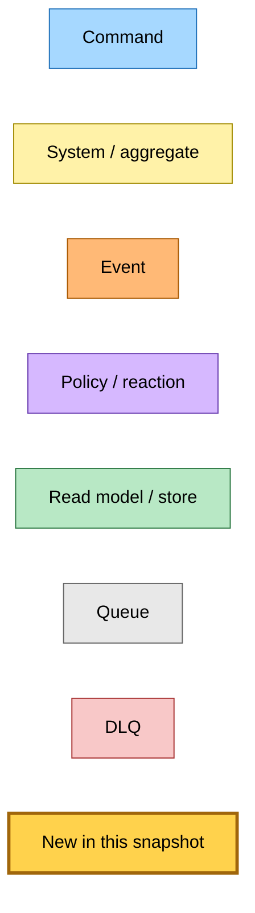
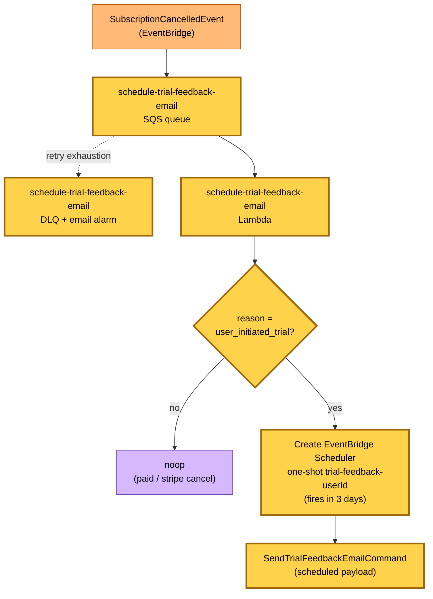
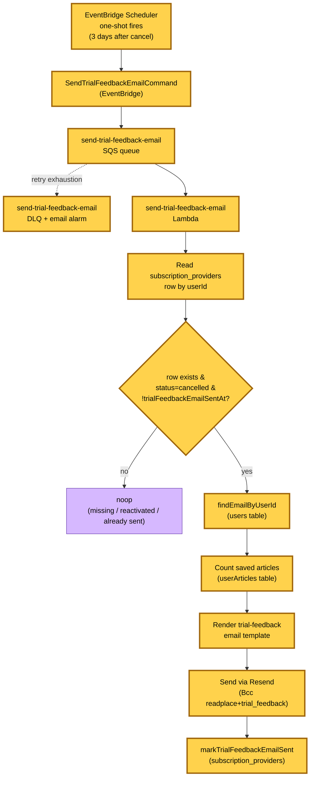
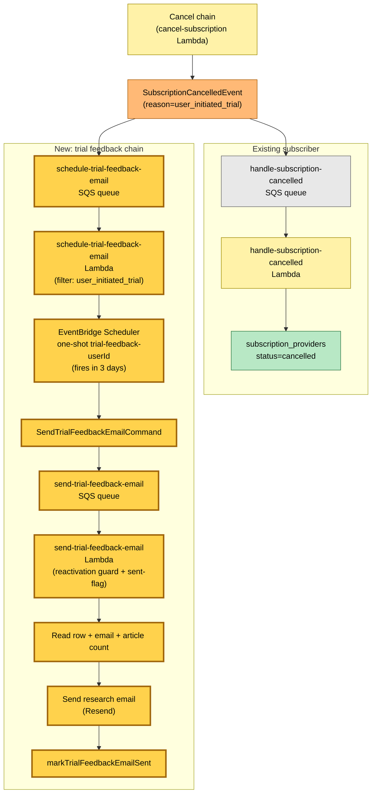

# Trial Feedback Research Email Flow

> **Snapshot commit:** `a6469fc8` (2026-05-30, branch `claude/quirky-newton-wDzsX`)
>
> **Scope:** trial-feedback research email for churned trials — `SubscriptionCancelledEvent` (reason=`user_initiated_trial`) triggers a 3-day delayed "what was missing?" email via two SQS-backed Lambdas and an EventBridge Scheduler one-shot.

---

## Legend

---

## Diagram 1 — Schedule trial feedback email

`SubscriptionCancelledEvent` arrives via EventBridge. The `schedule-trial-feedback-email` Lambda filters on `reason='user_initiated_trial'` (paid churn and Stripe-side cancels are noops). For qualifying events it creates a deterministic-name EventBridge Scheduler one-shot (`trial-feedback-<userId>`) that fires 3 days later with `SendTrialFeedbackEmailCommand`. The deterministic name means at-least-once duplicate `SubscriptionCancelledEvent` deliveries overwrite the same schedule instead of stacking.

---

## Diagram 2 — Send trial feedback email

The EventBridge Scheduler one-shot fires `SendTrialFeedbackEmailCommand` via EventBridge. The `send-trial-feedback-email` Lambda re-reads the subscription row and applies three guards: (1) row must exist, (2) status must be `cancelled` (reactivation guard), (3) `trialFeedbackEmailSentAt` must be unset (sent-flag dedupe). On pass, it looks up the user's email, counts their saved articles, renders the personalised research email, sends via Resend (Bcc to `readplace+trial_feedback@readplace.com`), and stamps `trialFeedbackEmailSentAt` on the row.

---

## Diagram 3 — End-to-end: cancel to feedback email

Complete flow from trial cancellation through to the research email delivery, showing how the existing `SubscriptionCancelledEvent` (from the cancel chain) fans out to both the existing `handle-subscription-cancelled` Lambda and the new trial-feedback scheduling chain.

---

## Command → System → Event(s) reference table

| Command / Trigger | System | Event(s) emitted | Next command(s) |
|---|---|---|---|
| `SubscriptionCancelledEvent` (reason=`user_initiated_trial`) | schedule-trial-feedback-email Lambda | — | Creates EventBridge Scheduler one-shot `trial-feedback-<userId>` (fires in 3 days with `SendTrialFeedbackEmailCommand`) |
| `SubscriptionCancelledEvent` (reason=`user_initiated_paid_confirmed` or `stripe_webhook`) | schedule-trial-feedback-email Lambda | — (noop) | — |
| EventBridge Scheduler one-shot fires (`trial-feedback-<userId>`) | EventBridge Scheduler | — | `SendTrialFeedbackEmailCommand` |
| `SendTrialFeedbackEmailCommand` (row cancelled, no sent flag) | send-trial-feedback-email Lambda | — (sends email via Resend, stamps `trialFeedbackEmailSentAt`) | — |
| `SendTrialFeedbackEmailCommand` (row missing, reactivated, or already sent) | send-trial-feedback-email Lambda | — (noop) | — |
