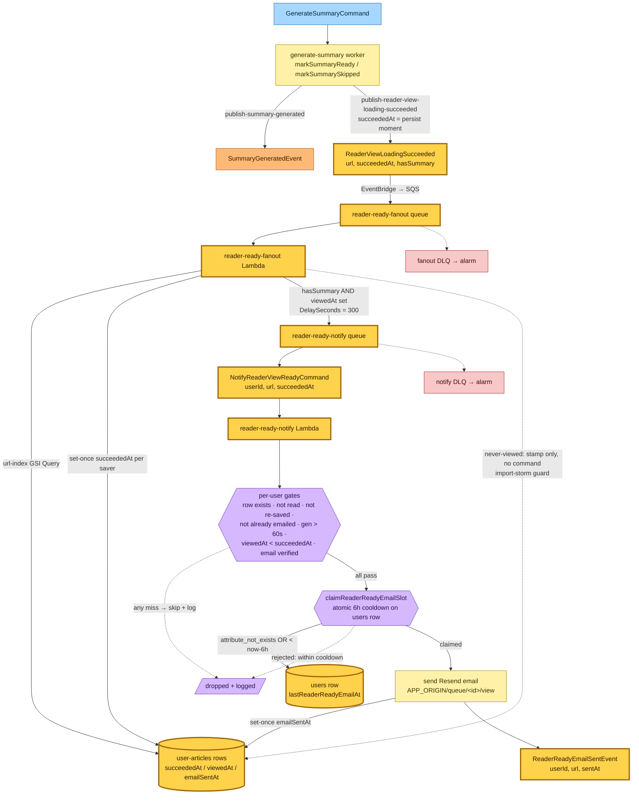
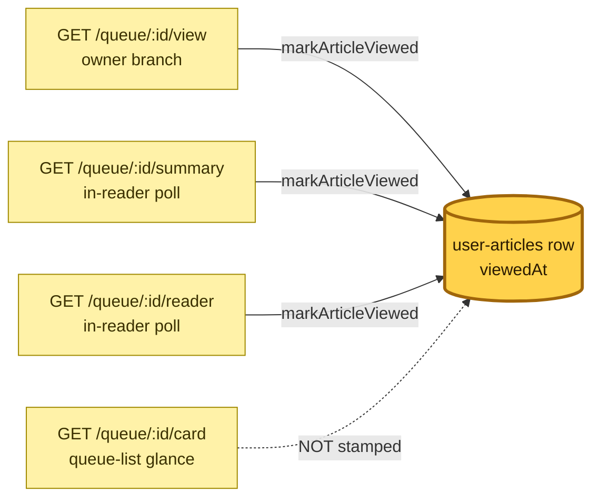

# Reader-ready notification flow

> **Commit:** `fc406ec` · **Date:** 2026-05-30 · **Branch:** `claude/dazzling-cray-tkyDl`
> **Subject:** feat(hutch,save-link): email savers when their reader view is ready

When a saved article's clean reader view (crawled content + AI summary) reaches a
successful terminal state, the system emails the saver a link — but only if they
opened the reader while it was still loading and left before it finished, the
generation took longer than a minute, and they have not already been emailed in
the last 6 hours. Presence is detected entirely server-side from the existing
htmx poll; there is **no new client-side JavaScript**.

## Legend

| Role | Fill | Stroke |
|---|---|---|
| Command | `#a6d8ff` | `#1e6fb8` |
| System / aggregate | `#fff2a8` | `#a08a00` |
| Event | `#ffb976` | `#a85800` |
| Policy / gate | `#d6b8ff` | `#6b3fb0` |
| Read model / store | `#b8e8c5` | `#2f7a45` |
| Queue | `#e8e8e8` | `#666` |
| DLQ | `#f8c8c8` | `#a83434` |

**Nodes introduced by this change are outlined in thick amber (`:::new`).**

## End-to-end flow

## Presence (server-side only)

A present user's final in-reader poll lands at-or-after `succeededAt`, so
`viewedAt ≥ succeededAt` ⇒ suppressed. A user who opened it, watched it load, then
left has `viewedAt < succeededAt` ⇒ emailed. A user who never opened it has no
`viewedAt` ⇒ never emailed. The ~5-minute notify delay gives the terminal poll
time to land; `succeededAt` is captured in the domain at the persist moment, so
it is always ≤ any later poll's `viewedAt`.

## Command → System → Event(s) reference

| Command / Event | Handler (system) | Emits | Triggers next |
|---|---|---|---|
| GenerateSummaryCommand *(existing)* | generate-summary worker | SummaryGeneratedEvent *(existing)*, **ReaderViewLoadingSucceeded** | reader-ready-fanout |
| **ReaderViewLoadingSucceeded** (per-URL, global) | **reader-ready-fanout** Lambda (EventBridge → SQS) | — (stamps per-user `succeededAt`; dispatches a command) | **NotifyReaderViewReadyCommand** (only for viewers, when `hasSummary`) |
| **NotifyReaderViewReadyCommand** (per-user, direct SQS, `DelaySeconds=300`) | **reader-ready-notify** Lambda | **ReaderReadyEmailSentEvent** (on send) | — (no load-bearing consumer; wired for future analytics/digest) |
| **ReaderReadyEmailSentEvent** | *(none yet)* | — | — |

### Gates on `NotifyReaderViewReadyCommand` (skip + log on any miss)

1. user-article row still exists (not deleted)
2. `status !== "read"`
3. `savedAt <= succeededAt` (not re-saved after success)
4. `emailSentAt` not set (not already emailed)
5. `succeededAt − savedAt > 60s` (generation took over a minute)
6. `viewedAt` is set AND `viewedAt < succeededAt` (viewed while loading, left before ready)
7. user email exists AND `emailVerified`
8. atomic claim of the 6h per-user cooldown on the users row

Only after all gates pass and the cooldown is claimed does the Lambda send the
email, set `emailSentAt` (set-once), and publish `ReaderReadyEmailSentEvent`.

> SVG render skipped — sandboxed Chromium unavailable in this environment.
> Mermaid sources are embedded above and render in GitHub's Markdown viewer.
