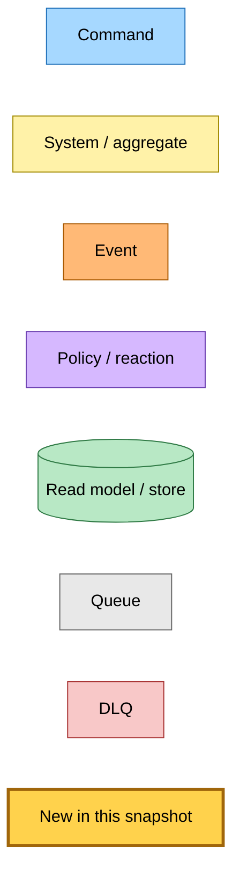
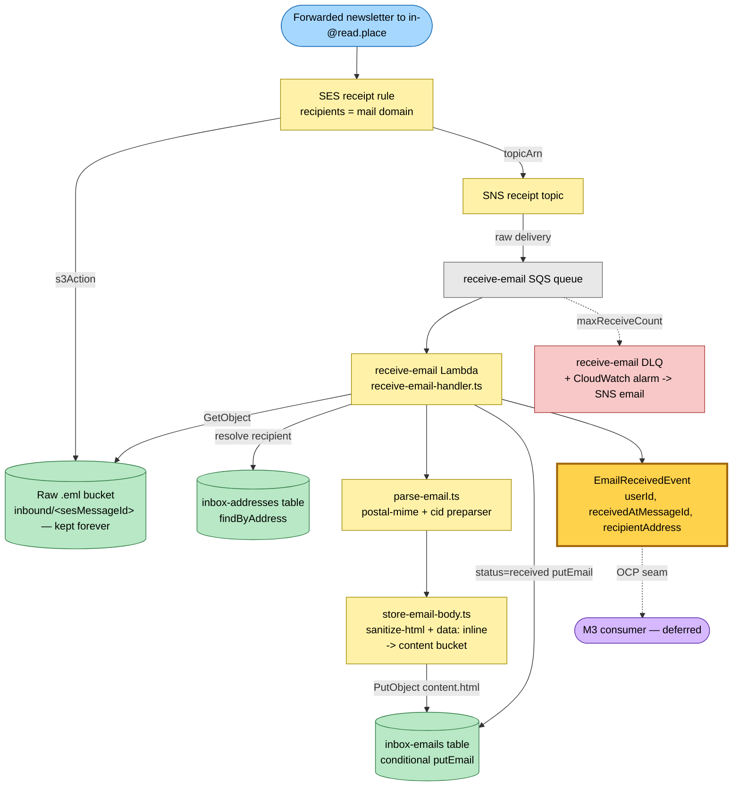
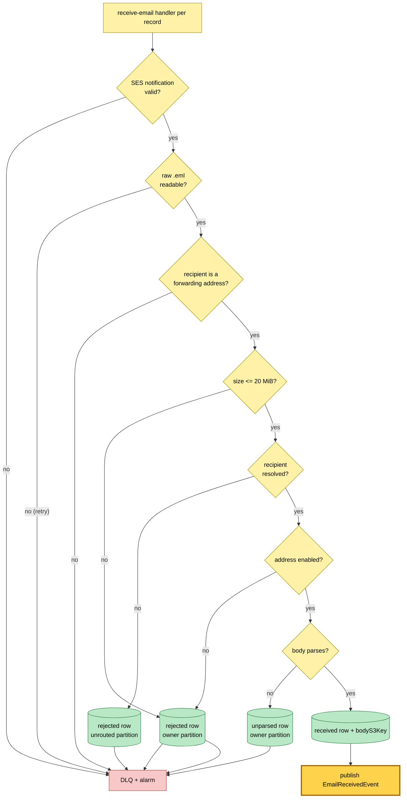
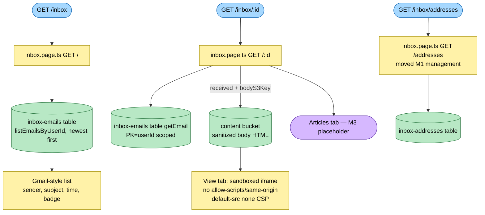

# Email receive & read flow (M2)

Snapshot of the inbound email-forwarding flow at commit `23f75dd`. A forwarded
newsletter is received via AWS SES, parsed + sanitized, stored, surfaced as the
new past-tense `EmailReceivedEvent`, and read back in the `/inbox` UI. Everything
is gated behind `?feature=email`.

**New in this snapshot** (highlighted `:::new` in gold): the `EmailReceivedEvent`
wire format and the SES → SNS → SQS → `receive-email` Lambda chain that publishes
it. There is no M2 consumer — M3 attaches to `EmailReceivedEvent` to extract
links from the stored body without touching the publisher (Open/Closed).

> File paths in this document are accurate as of this commit and may later move.

---

## Legend



<details><summary>Mermaid source</summary>



</details>

---

## Inbound receive flow

A real email arrives at `in-<token>@read.place`. The SES receipt rule (catch-all
on the mail domain — addresses are minted dynamically) stores the raw `.eml`
forever and notifies SNS; the receive queue drains it. The `receive-email`
handler is command-shaped (it can reject) and ends by publishing the
irreversible fact `EmailReceivedEvent`.



<details><summary>Mermaid source</summary>



</details>

### Degrade-with-alert branches (★15)

Oversize, unknown-recipient, disabled-recipient, and unparseable mail are never
silently dropped: each records an auditable row (or none, for a non-forwarding
recipient — the raw `.eml` is still kept forever) and fails the record to the
DLQ so the existing alarm pages the operator. Only the happy path publishes the
event.



<details><summary>Mermaid source</summary>



</details>

---

## Read flow (web, behind ?feature=email)

The `/inbox` surface reads the stores the receive flow wrote. It is not
event-driven — a modest page-level poll surfaces newly-arrived mail.



<details><summary>Mermaid source</summary>



</details>

---

## Command → System → Event(s) reference

| Command / trigger | System (handler) | Event(s) emitted | Next command(s) |
|---|---|---|---|
| Email to `in-<token>@read.place` | SES receipt rule → S3 + SNS | (SNS receipt notification) | enqueue to receive-email SQS |
| SQS message (SES notification) | `receive-email` Lambda (`receive-email-handler.ts`) | **`EmailReceivedEvent`** (happy path only) | none in M2 — M3 subscribes |
| oversize / unknown / disabled / unparseable | `receive-email` Lambda | none — audit row + DLQ failure | DLQ alarm → operator email |
| `GET /inbox` | `inbox.page.ts` `GET /` | none (read model) | — |
| `GET /inbox/:id` | `inbox.page.ts` `GET /:id` | none (read model) | — |
| `GET /inbox/addresses` | `inbox.page.ts` `GET /addresses` | none (read model) | — |
| `POST /inbox/create` · `POST /inbox/disable` | `inbox.page.ts` (M1) | none | — |

### Wire format

```
EmailReceivedEvent
  name:        "email-received"
  source:      "hutch.inbox"
  detailType:  "EmailReceived"
  detail:      { userId, receivedAtMessageId, recipientAddress }   (all strings)
```
