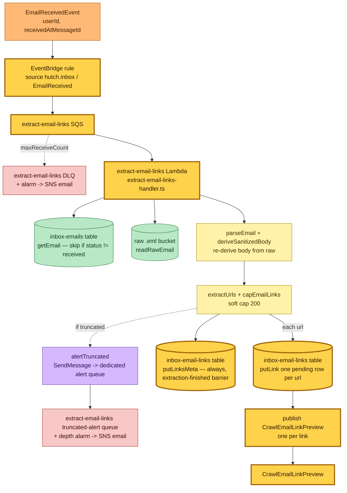
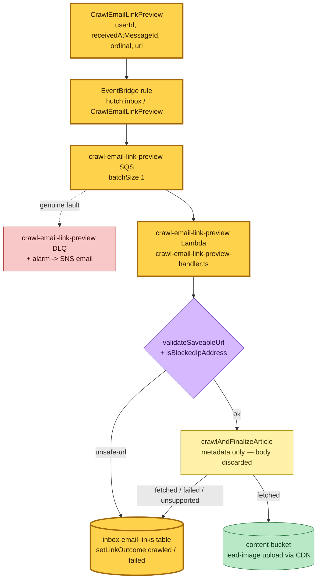
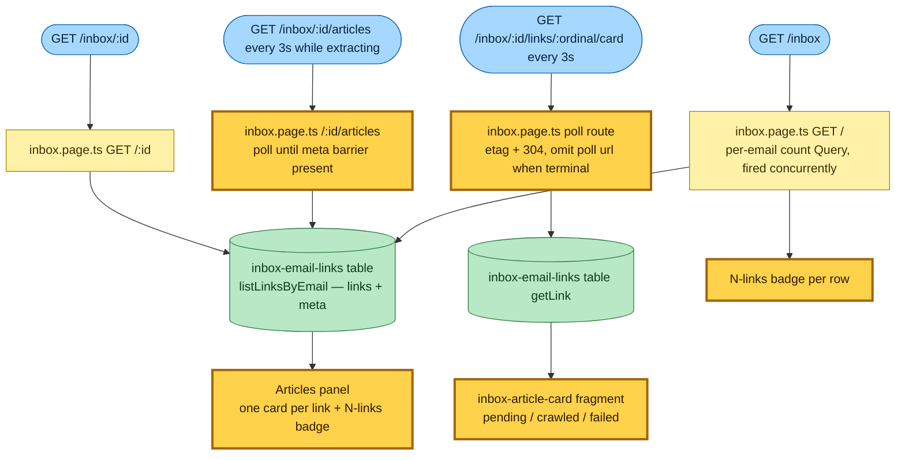

# Inbox link-preview flow (M3)

> **Commit:** `cd26b26` · **Date:** 2026-06-28 · **Branch:** `claude/email-link-previews-bs64f0`
> **Subject:** feat(hutch,save-link): wire the inbox link-preview pipeline end to end

After M2 stored a forwarded newsletter and published the past-tense
`EmailReceivedEvent` (with no consumer), M3 attaches two consumers that extract
the links inside the email and crawl a **preview** of each — title, excerpt,
lead image, site name — exactly like the `/queue` cards, **with nothing saved to
the reading queue**. Everything stays behind `?feature=email`.

The pipeline mirrors how `/queue` fans each imported URL into its own
`SaveLinkCommand`: `extract-email-links` emits one `CrawlEmailLinkPreview` per
link, and `crawl-email-link-preview` consumes one per message — SQS gives the
fan-out concurrency, per-link retry, and per-link DLQ isolation for free.

> File paths in this document are accurate as of this commit and may later move.

## Legend

| Role | Fill | Stroke |
|---|---|---|
| Command | `#a6d8ff` | `#1e6fb8` |
| System / aggregate | `#fff2a8` | `#a08a00` |
| Event | `#ffb976` | `#a85800` |
| Policy / gate | `#d6b8ff` | `#6b3fb0` |
| Read model / store | `#b8e8c5` | `#2f7a45` |
| Queue | `#e8e8e8` | `#666` |
| DLQ | `#f8c8c8` | `#a83434` |

**Nodes introduced by this change are outlined in thick amber (`:::new`).**

## Extract flow — `EmailReceivedEvent` → links + fan-out (★14)

`extract-email-links` re-derives the body from the **immutable raw `.eml`** (read
raw → re-parse → re-sanitize through the shared `deriveSanitizedBody`), so a
future parse/sanitize change applies to extraction too — never a body sanitized
by stale logic. It extracts URLs, applies the per-email soft cap (200), writes
one `pending` link row per URL, and fans out one `CrawlEmailLinkPreview` per link.
The per-email meta row is **always** written last as an "extraction finished"
barrier (its presence is what the detail view polls against); `truncated` is just
one field on it. A truncated email still ships the first N previews (the working
path) while raising an alert on a **dedicated alert queue** — off the failure DLQ,
so the DLQ's depth alarm stays unambiguous (degrade-with-alert, deterministic
count signal only).



## Crawl flow — `CrawlEmailLinkPreview` → preview, no queue write (★16)

`crawl-email-link-preview` runs the same SSRF-guarded `crawlAndFinalizeArticle`
the save pipeline uses (fail-closed `validateSaveableUrl` + `isBlockedIpAddress`
on every connect/redirect hop), keeps only the metadata, **discards the body**,
and stamps the outcome on the link row. A dead/blocked/paywalled link is an
expected `failed` preview (the record is ACKed); only a store-write fault or a
malformed envelope fails the record to the DLQ. Neither Lambda is granted the
articles/user-articles tables — the "nothing saved to /queue" invariant lives at
the IAM boundary.



## Read flow — Articles tab + per-card poll (behind ?feature=email)

The detail page reads `inbox-email-links` in one partition Query. Before the
extractor writes its meta barrier the Articles panel itself polls
`GET /inbox/:id/articles` every 3 s (a "Looking for links…" state) and swaps in the
finished card set the instant extraction completes — so a just-received email is
never shown a terminal "No links found", and the card set is never frozen
mid-extraction. Once the cards render, each `pending` card polls
`GET /inbox/:id/links/:ordinal/card` every 3 s (etag + 304, shared `MAX_POLLS`
budget) until terminal — reusing the `/queue` card machinery. The list and detail
header show an "N links" badge derived from the same Query (no parent-row
denormalisation). The crawl is paid once at receipt; the tab never triggers one.



## Command → System → Event(s) reference

| Command / trigger | System (handler) | Event(s) emitted | Next |
|---|---|---|---|
| `EmailReceivedEvent` | `extract-email-links` Lambda | **`CrawlEmailLinkPreview`** (one per link) | crawl consumer |
| link cap hit | `extract-email-links` Lambda | none — `truncated` flag on the meta barrier + dedicated alert-queue message | alert-queue depth alarm → operator |
| `CrawlEmailLinkPreview` | `crawl-email-link-preview` Lambda | none — `setLinkOutcome` write | — (nothing to /queue) |
| `GET /inbox/:id` | `inbox.page.ts` `GET /:id` | none (read model) | per-card poll |
| `GET /inbox/:id/links/:ordinal/card` | `inbox.page.ts` poll route | none (read model) | self until terminal |
| `GET /inbox` | `inbox.page.ts` `GET /` | none (read model) | — |

### Wire format

```
CrawlEmailLinkPreview
  name:        "crawl-email-link-preview"
  source:      "hutch.inbox"
  detailType:  "CrawlEmailLinkPreview"
  detail:      { userId, receivedAtMessageId, ordinal, url }   (all strings)
```

### Storage — `hutch-inbox-email-links`

```
PK  userLinkGroup = `${userId}#${receivedAtMessageId}`   (all links of one email colocate)
SK  ordinal       = "0000".."1999"  (link rows)  |  "meta"  (reserved per-email summary)
link row:  url, status (pending|crawled|failed), title?, excerpt?, siteName?, imageUrl?, failureReason?
meta row:  truncated   (always written once extraction finishes — its presence is the "extraction ran" barrier the detail view polls against)
```

One partition Query answers every read (Articles tab, per-card poll, list/header
badge) — no GSI, no scan. Kept forever (no TTL); re-derivable from the raw `.eml`.
Deletion protection + PITR guard the cache.
