# Inbox deployable split — inbound-email pipeline during the double-delivery overlap

> **Commit:** `bec433e1` · **Date:** 2026-07-10 · **Branch:** `inbox-split`
> **Subject:** feat(hutch): export the inbox notification topic ARN for the inbox deployable

The inbound-email pipeline (M2 receive + M3 link previews) is mid-extraction
from the `hutch` deployable into a new **`projects/inbox`** deployable. This
snapshot captures the deliberately overlapped state:

- **`inbox` (new)** carries its own copies of the three consumers —
  `inbox-receive-email` (SNS→SQS), `inbox-extract-email-links` (subscribes
  `EmailReceivedEvent`, rule `inbox-extract-email-links-rule`) and
  `inbox-crawl-email-link-preview` (subscribes `CrawlEmailLinkPreview`, rule
  `inbox-crawl-email-link-preview-rule`) — plus an `inbox-web` Lambda that
  takes over the `/inbox` pages on hutch's API Gateway by route precedence.
- **`hutch` (current)** still runs its original consumers (`receive-email`,
  `extract-email-links`, `crawl-email-link-preview`), their queues, their
  EventBridge rules and its SNS subscription, and still mounts the `/inbox`
  router in its SSR Lambda (now shadowed). These are scheduled for removal in
  the follow-up cleanup commit.
- **`hutch` keeps owning** SES receiving (`InboxMail`: domain identity + DKIM +
  MX, the catch-all receipt rule set, the immutable raw-email bucket, the SNS
  notification topic) and the three DynamoDB tables
  (`hutch-inbox-addresses`, `hutch-inbox-emails`, `hutch-inbox-email-links`).
  The topic ARN is exported cross-stack (`inboxNotificationTopicArn`) for the
  inbox stack's SNS subscription.

During the window every stage is **delivered twice** (once per stack). That is
safe by design: every handler is replay-idempotent (conditional puts, no-op
duplicates, terminal `UpdateItem`s), so the overlap costs duplicate compute,
never duplicate state. Physical names are `inbox-`-prefixed throughout because
EventBridge `PutRule` is an upsert and Lambda/SQS names are account-scoped — a
same-named resource would *steal* hutch's live rule/queue instead of standing
up beside it.

> File paths in this document are accurate as of this commit and may later move.

---

## Legend


<details><summary>Mermaid source</summary>

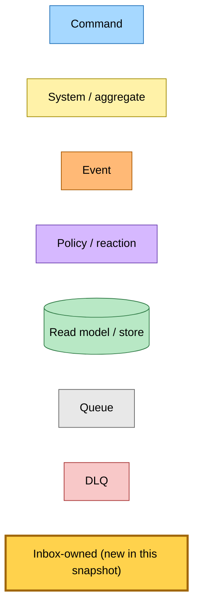

</details>

Everything owned by the new `inbox` deployable is gold (`:::new`). Hutch's
still-live originals keep their normal role colours — they are **current**
production infrastructure until the cleanup commit removes them.

---

## Ownership map & cross-stack seams

`hutch` remains the owner of everything a mail *arrives through* (SES is
account/region-singular for receiving — exactly one active receipt rule set)
and of the three tables both stacks read/write. The `inbox` stack attaches to
hutch through exactly four deploy-time StackReference outputs; everything else
it needs (table names, bucket names, the content-media CDN domain) is a config
constant read from its own Pulumi config, so deploy order is only coupled where
it genuinely must be (`hutch` deploys first so the outputs exist). Both stacks
resolve the same platform event bus via `HutchEventBus.fromPlatformStack`.


<details><summary>Mermaid source</summary>

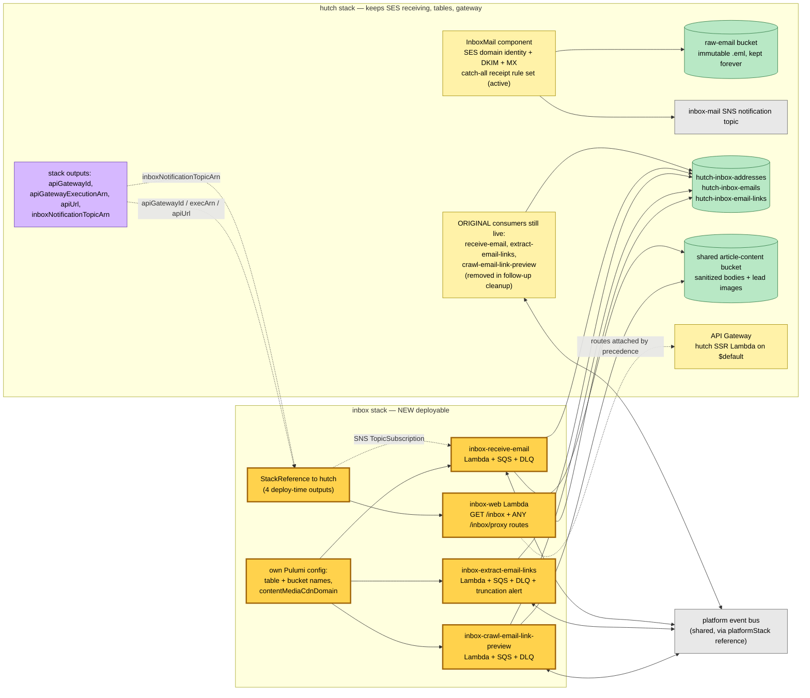

</details>

---

## Receive flow — SES → SNS → two SQS subscriptions (double delivery starts here)

SES cannot target SQS directly, so the catch-all receipt rule stores the raw
`.eml` to S3 (`inbound/<sesMessageId>`) and publishes the receipt to the SNS
topic. During the overlap the topic has **two** raw-delivery SQS subscriptions —
hutch's original `receive-email` queue and the new `inbox-receive-email` queue —
so **both** receive workers (same handler code,
`receive-email-handler.ts`) process every inbound mail. Each queue's policy
admits only the topic; each worker's queue matches its 120 s timeout so an
in-flight parse is never redelivered.

The handler's ordering makes the replay safe: sanitized **body to S3 before the
row, row before the event** — and it re-publishes `EmailReceivedEvent` even
when `putEmail` reports a duplicate (a crash between row and publish must not
lose the event; consumers are idempotent). Net effect during the overlap:
`EmailReceivedEvent` is published **twice per deliverable recipient** (once per
stack), on top of identical rows.

Expected catch-all-MX conditions never page: unknown recipient, disabled
recipient, and oversize/unparseable mail addressed *only* to unknown/disabled
addresses each record an auditable row (unrouted partition `__unrouted__`) and
ACK. A whole-message fault (oversize > 20 MiB, unparseable MIME) pages — fails
the record to the DLQ so the alarm emails the operator — **only when a real,
enabled recipient lost mail**. A body that sanitizes to nothing persists an
`unparsed` row (no event) so the UI shows its graceful panel.


<details><summary>Mermaid source</summary>

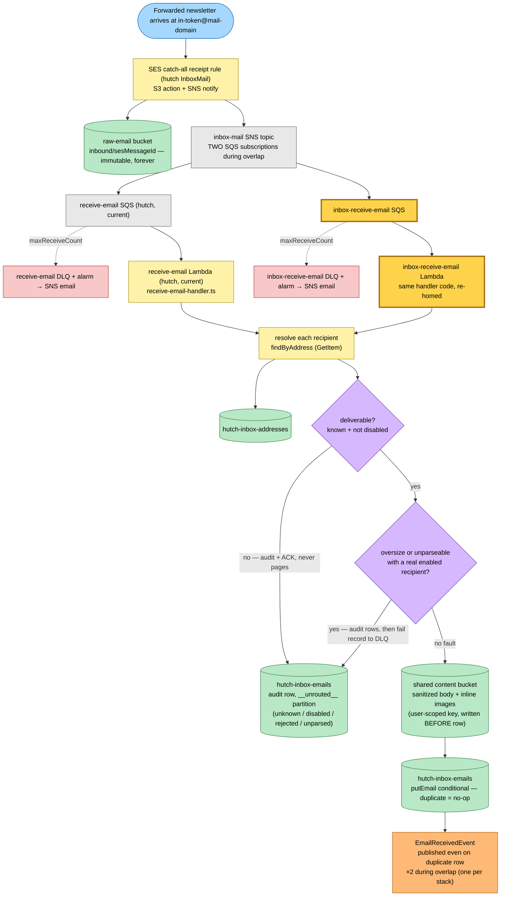

</details>

---

## Extract flow — one `EmailReceivedEvent`, two EventBridge rules

`EmailReceivedEvent` (source `hutch.inbox`, detail-type `EmailReceived`) now
matches **two rules on the shared bus**: hutch's original default-named
`email-received-rule` (targeting hutch's `extract-email-links` queue) and the
explicitly named `inbox-extract-email-links-rule` (targeting the new
`inbox-extract-email-links` queue). The explicit name is what keeps the new
subscription *distinct* — `PutRule` upserts by name, so reusing the event's
default rule name would have re-pointed hutch's live rule instead of adding a
second one.

Both workers run the same `extract-email-links-handler.ts`: skip unless the row
is `status=received`, **re-derive the body from the immutable raw `.eml`**
(read raw → re-parse → re-sanitize via the shared `deriveSanitizedBody`),
extract URLs, apply the soft cap (200), write one `pending` link row per URL
(conditional put — a replay is a no-op duplicate), fan out one
`CrawlEmailLinkPreview` per link, and write the per-email meta row **last** as
the "extraction finished" barrier. Truncation is a successful degradation: the
first N previews still ship while a message goes to a **stack-local dedicated
alert queue** (never the failure DLQ) whose send-rate alarm emails the
operator — each stack owns its own alert queue + topic + alarm
(`extract-email-links-truncated-alert` current, `inbox-…-truncated-alert` new).

With the receive stage already publishing the event twice, each extract queue
sees **two copies** — up to four executions per email across both stacks, all
converging on the same rows and (idempotently re-)publishing the same per-link
commands.


<details><summary>Mermaid source</summary>

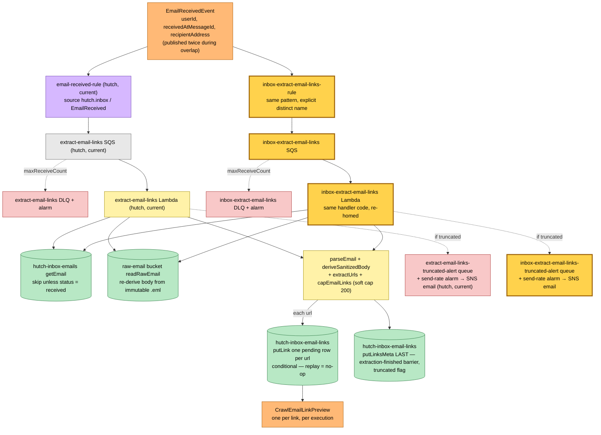

</details>

---

## Crawl flow — one `CrawlEmailLinkPreview`, two rules, converging writes

Same doubling at the last hop: `CrawlEmailLinkPreview` matches hutch's original
default-named `crawl-email-link-preview-rule` and the new
`inbox-crawl-email-link-preview-rule`. Both workers run the same
`crawl-email-link-preview-handler.ts` over the same SSRF-guarded
`crawlAndFinalizeArticle` the save pipeline uses (`isBlockedIpAddress` on every
connect and redirect hop — fail-closed before any network call), keep only the
metadata, **discard the body**, upload the lead-image thumbnail to the shared
content bucket (served via the save-link content-media CDN), and stamp the
outcome on the link row with `setLinkOutcome` (an `UpdateItem` — replays and
the twin worker's write converge on the same terminal metadata; last write
wins). A dead/blocked/paywalled link is an *expected* `failed` preview and is
ACKed; only a genuine store-write fault or malformed envelope DLQs.

Neither stack's Lambda is granted the articles/user-articles tables — the
"nothing saved to /queue" invariant stays enforced at the IAM boundary in
**both** deployables.


<details><summary>Mermaid source</summary>

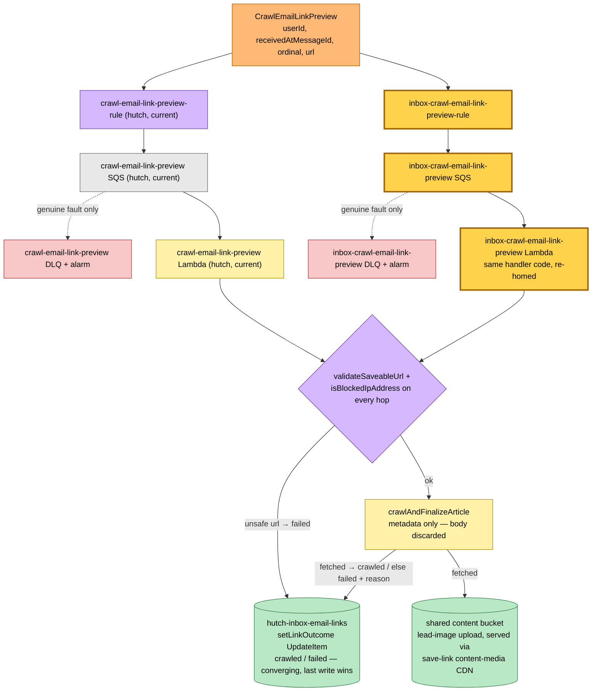

</details>

---

## Web flow — `/inbox` re-routed by API Gateway route precedence

The `inbox` stack attaches its own integration to **hutch's existing API
Gateway** (id + execution ARN via StackReference) with route keys `GET /inbox`
and `ANY /inbox/{proxy+}`. More-specific routes win over `$default`, so
`readplace.com/inbox` is now served by the `inbox-web` Lambda while every other
path still falls through to hutch's SSR Lambda — which **still mounts its own
`/inbox` router** (`server.ts`), now unreachable behind the more-specific
routes and removed in the follow-up cleanup. The pages are the same M2/M3 UI
(received list, addresses, sandboxed email detail, per-link preview cards with
3 s polling), served same-origin so `hutch_sid` session auth keeps working:
the Lambda authenticates each request against the sessions table
(`GetItem`, plus `UpdateItem` when verifying an inbox address flips the
session's email-verified flag), resolves the user via the users `userId-index`,
reads subscription state for the trial banner, and reads sanitized bodies from
the shared content bucket.


<details><summary>Mermaid source</summary>

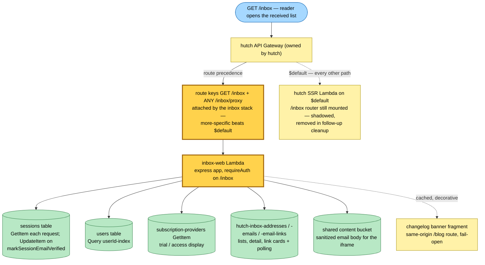

</details>

---

## Command → System → Event(s) reference

| Command / trigger | System (handler) | Event(s) emitted | Next |
|---|---|---|---|
| Mail arrives at the mail domain | SES catch-all receipt rule (hutch `InboxMail`) | raw `.eml` to S3, receipt JSON to SNS topic | both receive queues (2 SNS subscriptions) |
| SNS receipt notification | `receive-email` Lambda (hutch, current) **and** `inbox-receive-email` Lambda (new) — same handler | **`EmailReceivedEvent`** per deliverable recipient (so ×2 during overlap); none on audit/ACK branches | both extract rules |
| `EmailReceivedEvent` | `extract-email-links` Lambda (hutch, current) **and** `inbox-extract-email-links` Lambda (new) — same handler | **`CrawlEmailLinkPreview`** one per link, per execution | both crawl rules |
| link cap hit (200) | either extract Lambda | none — `truncated` flag on the meta barrier + message to that stack's dedicated alert queue | stack-local send-rate alarm → operator email |
| `CrawlEmailLinkPreview` | `crawl-email-link-preview` Lambda (hutch, current) **and** `inbox-crawl-email-link-preview` Lambda (new) — same handler | none — `setLinkOutcome` UpdateItem (converging) | — (nothing to /queue, IAM-enforced in both stacks) |
| `GET /inbox`, `ANY /inbox/{proxy+}` | `inbox-web` Lambda (new, via route precedence) | none (read model) | per-card / per-panel polling |
| any other path | hutch SSR Lambda (`$default`) | — | its `/inbox` router is shadowed dead code until cleanup |

### Double-delivery arithmetic (and why it is safe)

| Stage | Copies during overlap | Convergence mechanism |
|---|---|---|
| SNS receipt → receive workers | 2 (one per queue subscription) | `putEmail` conditional put — duplicate row is a no-op; body S3 key deterministic (user-scoped) |
| `EmailReceivedEvent` published | 2 per deliverable recipient (each worker re-publishes even on duplicate row) | consumers idempotent |
| extract executions | up to 4 per email (2 publishes × 2 rules) | `putLink` conditional put; `putLinksMeta` rewrites the same value |
| `CrawlEmailLinkPreview` published | up to 4 per link | consumer idempotent |
| crawl executions | up to 8 per link (4 publishes × 2 rules) | `setLinkOutcome` UpdateItem — terminal metadata, last write wins |

The overlap multiplies compute and origin fetches, never state. Operator
alerting also doubles (each stack has its own DLQ alarms and truncation
alert) — accepted for the window.

### Wire formats (unchanged by the split — defined in `@packages/hutch-infra-components` `events.ts`)

```
EmailReceivedEvent
  name:        "email-received"
  source:      "hutch.inbox"
  detailType:  "EmailReceived"
  detail:      { userId, receivedAtMessageId, recipientAddress }   (all strings)

CrawlEmailLinkPreview
  name:        "crawl-email-link-preview"
  source:      "hutch.inbox"
  detailType:  "CrawlEmailLinkPreview"
  detail:      { userId, receivedAtMessageId, ordinal, url }       (all strings)
```

The event *names* also seed the default EventBridge rule names — which is why
hutch's original rules are `email-received-rule` / `crawl-email-link-preview-rule`
and the inbox stack **must** pass explicit `name` options
(`inbox-extract-email-links`, `inbox-crawl-email-link-preview`) to
`eventBus.subscribe`: same-named `PutRule` is an upsert that would re-target
hutch's live rule rather than add a second subscription.

### What the follow-up cleanup removes (hutch side)

- `receive-email`, `extract-email-links`, `crawl-email-link-preview` Lambdas,
  their SQS queues/DLQs/alarms, hutch's SNS `TopicSubscription`, the
  `email-received-rule` / `crawl-email-link-preview-rule` EventBridge rules,
  and the `extract-email-links-truncated-alert` queue + topic + alarm.
- The `/inbox` router mounted in the SSR Lambda (already shadowed by route
  precedence).

Hutch permanently keeps: `InboxMail` (SES receiving + raw bucket + SNS topic),
the three inbox DynamoDB tables, the shared content bucket, the API Gateway,
and the `inboxNotificationTopicArn` / gateway stack outputs the inbox
deployable consumes.
