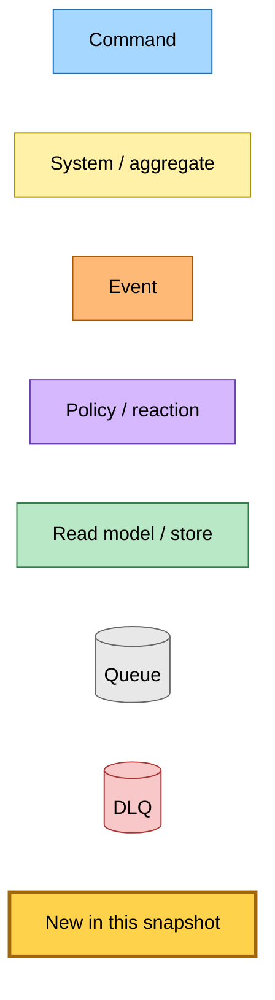
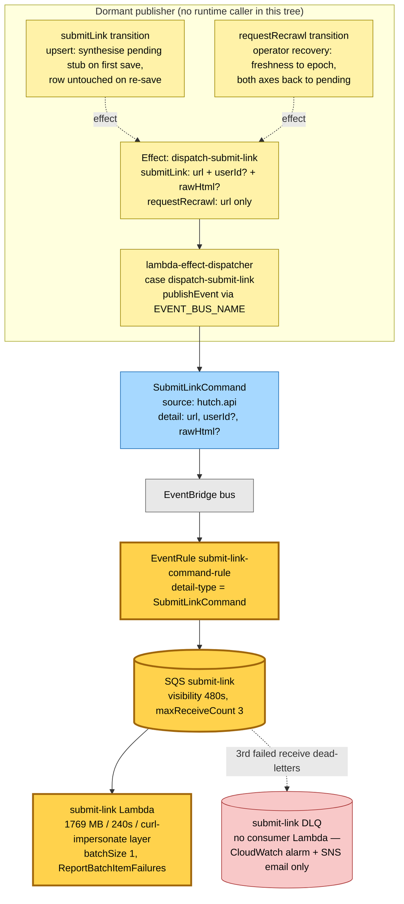
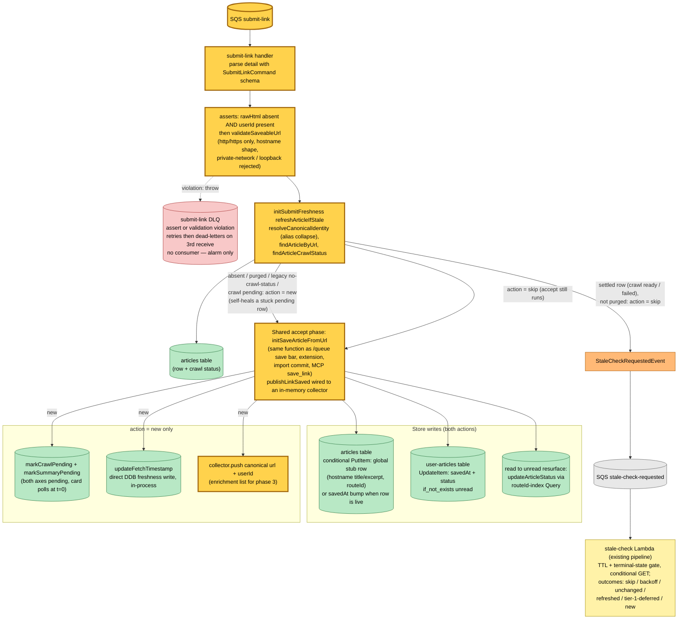
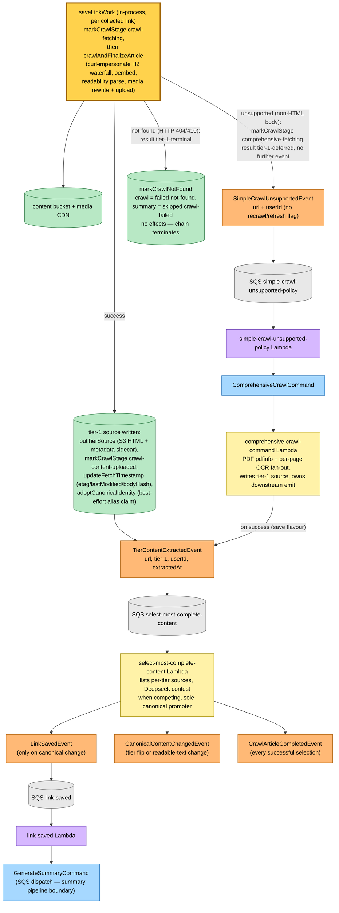
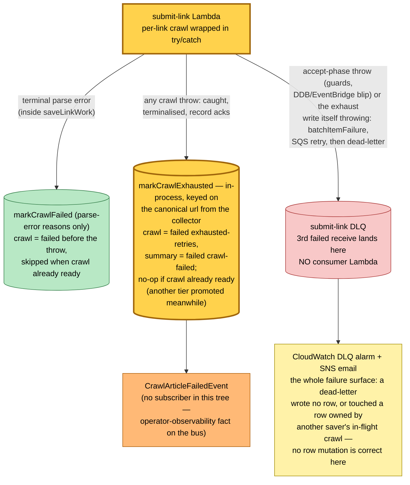

# Submit-Link Entry Point — SubmitLinkCommand Subscriber Lambda — Event Storming

**Base commit:** `37d5f61a` &nbsp;•&nbsp; **Commit date:** 2026-07-19 &nbsp;•&nbsp; **Generated:** 2026-07-19 &nbsp;•&nbsp; **Branch:** `main`
**Subject:** `refactor(@packages/article-store,hutch): move the crawl and summary mark providers into the article-store package`

> **Dirty-tree snapshot.** The subscriber wiring documented here is **uncommitted** on top of `37d5f61a` (staged but not committed at generation time): modified `projects/save-link/src/infra/index.ts`, `src/packages/hutch-infra-components/src/save-link-lambdas.ts`, `projects/save-link/package.json`, `pnpm-lock.yaml`, plus new `projects/save-link/src/runtime/submit-link.main.ts` and `projects/save-link/src/runtime/domain/submit-link/`. This document describes the working tree as it stands, not the commit. An earlier revision of this change carried a `submit-link-dlq` consumer Lambda; it was removed after review (see §4) and is not in the tree.

The entry-point redesign foundation ([`2026-05-13-a8c3a85`](../2026-05-13-a8c3a85/)) shipped `SubmitLinkCommand` (`{ url, userId?, rawHtml? }`), two aggregate transitions that emit a `dispatch-submit-link` effect, and the effect-dispatcher case that publishes the command via EventBridge — all **dormant**: no transition had a runtime caller and no subscriber existed on the bus. This change activates the receiving side. A new `submit-link` Lambda subscribes to `SubmitLinkCommand` and implements the **authenticated URL-only shape** `{ url, userId }`: it accepts the save synchronously (queue-card stub, savedAt bump, read→unread resurface) and then runs the tier-1 crawl **in-process**, emitting the same downstream events the existing save pipeline uses. A failed crawl is terminalised **in-process on the canonical row** rather than thrown — the record still acks, so SQS retries are reserved for failures a retry can actually heal.

What is new in this snapshot (highlighted `:::new` in every diagram):

- **`submit-link` SQS queue** — visibility 480 s (2× the Lambda's 240 s timeout), `dlqMaxReceiveCount: 3` — deliberately **not** the crawl queues' fail-fast 1: crawl failures terminalise in-process and never throw out of the record, so a thrown record is an accept-phase failure (a DynamoDB/EventBridge blip) that a retry genuinely can heal.
- **`submit-link` Lambda** — 1769 MB / 240 s, curl-impersonate layer, wired to articles + user-articles tables (articles **with indexes**: the read→unread resurface resolves the row via the `routeId-index`), content bucket read/write, generate-summary queue send, EventBridge publish.
- **`eventBus.subscribe(SubmitLinkCommand, …)`** — the EventBridge rule + SQS target that turns the previously fire-and-forget publish into a consumed command.
- **Alarm-only DLQ — deliberately no consumer Lambda.** A dead-lettered submit record either wrote no article row at all (pre-accept failure) or touched a row owned by another saver's in-flight crawl (`skip`-accept failure), so no row mutation is ever correct at the DLQ boundary. The `HutchSQS` CloudWatch alarm + SNS email is the whole failure surface.
- **Handler + submit-specific freshness** — `initSubmitLinkCommandHandler` and `initSubmitFreshness` (a `RefreshArticleIfStale` implementation that never fetches inline and is **crawl-status-aware**: absent, purged, legacy no-crawl-status, and `pending` rows are treated as `new` so a stuck pending row self-heals; only settled rows are handed to the async stale-check pipeline via `StaleCheckRequestedEvent`).
- **`@packages/save-article` dependency in save-link** — the handler reuses the exact `initSaveArticleFromUrl` accept phase that the `/queue` save bar, the browser-extension save, the import commit, and the MCP `save_link` tool call.

**Intended first producer (not in this tree):** a follow-up change will make the inbox project's extract-email-links Lambda publish `SubmitLinkCommand` for each kept newsletter link. Only prose here — the diagrams show what exists.

> Snapshots are historical. Any file path referenced below may be renamed, moved, or deleted in the future. Treat as an artefact, not a live guide.

---

## Legend

New/changed pieces in this snapshot carry the amber **new** highlight (`fill:#ffd24c`, `stroke:#a0660b`, 3 px stroke); everything else is pre-existing infrastructure shown for context.

Mermaid source

---

## 1. Every flow touching `SubmitLinkCommand` — dormant publisher, activated subscription

The publisher side is unchanged from `a8c3a85` and still has **no runtime caller**: nothing in the working tree invokes the `submitLink` or `requestRecrawl` transitions, so the `dispatch-submit-link` effect never fires in production. What changed is the receiving side — the command now has a rule, a queue, and a Lambda, so the day a producer lands (the inbox link-extractor is the intended first one) the chain is live end to end without further infra work.

Mermaid source

---

## 2. Subscriber intake and the accept phase — stub in the queue before any crawl

The handler is strict about the shape it implements today: `rawHtml` present (tier-0 submission) or `userId` absent (anonymous submission) fail an `assert` and the record retries — deterministically — until the third receive dead-letters it. Those branches have no handler yet, and the DLQ alarm is the signal that a producer started sending them early. The accepted `{ url, userId }` shape then runs the exact accept phase every other authenticated save entry point runs (`initSaveArticleFromUrl`), so the queue-card stub, the `savedAt` bump, and the read→unread resurface land **synchronously inside the handler, before any crawl starts** — the user's queue shows the card even though the command was processed off a queue.

The freshness decision is submit-specific (`initSubmitFreshness`) and deliberately never fetches inline. The web tier's `RefreshArticleIfStale` implementation performs the conditional GET in the request path; a command handler must not dispatch commands (Command → System → Event(s), never Command → Command), so a **settled** article (crawl `ready` or `failed`) is instead reported to the bus as `StaleCheckRequestedEvent` — a fact — and the existing async stale-check pipeline owns whether a refresh actually happens.

It is also **crawl-status-aware**: `new` is returned not only for an absent or purged row but also when the row has **no crawl status** (a legacy pre-state-machine row) or its crawl is still **`pending`**. That makes the entry point self-healing — a crash between the queue-row write and the crawl re-primes and re-crawls on the SQS retry, or on any later submit of the same URL — and modernises legacy rows the next time anyone submits them.

Mermaid source

On `skip` the collector stays empty — no crawl runs in this Lambda; the stale-check pipeline decides whether content refreshes. On `new` the collector holds exactly one link and the handler proceeds to the enrichment phase below.

---

## 3. In-process enrichment — the same tier-1 crawl routine as `save-link-command`

After the accept phase completes, each collected link runs `saveLinkWork` **in the same invocation** — the identical routine the `save-link-command` Lambda uses (crawl → parse → tier-1 source write), followed by the same `TierContentExtractedEvent` that hands off to the tier selector. Where the classic path publishes `SaveLinkCommand` and lets a second Lambda crawl, this handler folds accept + crawl into one Lambda and keeps the event boundary identical downstream.

Mermaid source

---

## 4. Failure paths — in-process terminalisation, alarm-only DLQ

The per-link crawl is wrapped in a try/catch. `saveLinkWork`'s throw classes — a network-level `crawl-failed`, and terminal parse errors (which first flip the row to `crawl = failed` in-process so the reader sees the failure on the next poll) — **no longer fail the record**: the handler logs a warning and runs `transitionAndPersist(markCrawlExhausted, { reason: exhausted-retries, receiveCount })` keyed on the **canonical** URL from the collector (not the raw submitted URL — the accept phase resolved aliases before the row was written), then acks. The `ready`-guard inside `markCrawlExhausted` still protects a row another tier promoted while the crawl was failing — single writer per terminal state. Only if that terminalisation write itself throws does the record fail, joining the accept-phase throw classes (the §2 guard asserts, DynamoDB/EventBridge blips) in SQS retry; the third failed receive dead-letters.

The DLQ deliberately has **no consumer Lambda** (an earlier revision reused the `save-link-dlq` row-mutator here; adversarial review removed it). By the time a record dead-letters, it either **wrote no article row at all** — the failure happened before or inside the accept phase, so there is no row to mutate — or it ran the `skip` accept against **a row owned by another saver's in-flight crawl**, which a DLQ-side `markCrawlExhausted` would incorrectly terminalise. No row mutation is ever correct at this boundary, so the CloudWatch alarm + SNS email wired by `HutchSQSBackedLambda` is the whole failure surface.

Mermaid source

---

## Command → System → Event(s) reference

| Command / trigger | System that handles it | Event(s) emitted | Next command(s) triggered |
|---|---|---|---|
| `SubmitLinkCommand` `{ url, userId }` **(new subscriber)** | `submit-link` Lambda: guards → submit freshness → shared accept phase → in-process tier-1 crawl | `StaleCheckRequestedEvent` (settled article already exists); `SimpleCrawlUnsupportedEvent` (non-HTML body); `TierContentExtractedEvent` (tier-1 source written); `CrawlArticleFailedEvent` (crawl threw — terminalised in-process on the canonical row); none on not-found (terminal in-process) | none directly — the handler dispatches no commands by design |
| `SubmitLinkCommand` with `rawHtml` or without `userId` | no handler yet — assert fails; retried, dead-letters on the 3rd receive; the DLQ alarm email is the only effect (no DLQ consumer) | — | — |
| `StaleCheckRequestedEvent` | stale-check Lambda (existing) | `SimpleCrawlUnsupportedEvent` (`refresh=true`, PDF path) | `RefreshArticleContentCommand` (stale HTML, via S3-staged body), `UpdateFetchTimestampCommand` (304), `SaveAnonymousLinkCommand` (missing/failed row redrive) |
| `SimpleCrawlUnsupportedEvent` | simple-crawl-unsupported-policy Lambda (existing) | — | `ComprehensiveCrawlCommand` |
| `ComprehensiveCrawlCommand` | comprehensive-crawl-command Lambda (existing) | `TierContentExtractedEvent` (save flavour; recrawl/refresh flavours under flags) | — |
| `TierContentExtractedEvent` | select-most-complete-content Lambda (existing, sole canonical promoter) | `LinkSavedEvent` (canonical change), `CanonicalContentChangedEvent` (tier flip / text change), `CrawlArticleCompletedEvent` (every selection) | via `LinkSavedEvent` → link-saved Lambda → `GenerateSummaryCommand`; via `CanonicalContentChangedEvent` → summary re-prime |
| dead-lettered `SubmitLinkCommand` | no consumer **(deliberate)** — CloudWatch DLQ alarm + SNS email only; no row mutation is correct at this boundary (see §4) | — | — |
| `submitLink` / `requestRecrawl` aggregate transition (dormant — no caller) | article aggregate + lambda-effect-dispatcher | — | `SubmitLinkCommand` via the `dispatch-submit-link` effect |

---

## Design notes and caveats observed in the working tree

- **No Command → Command dispatch anywhere in the handler.** Every outbound message is a past-tense fact (`StaleCheckRequested`, `SimpleCrawlUnsupported`, `TierContentExtracted`); reactions to those facts are owned by the existing policy/selector Lambdas. This is what forced the submit-specific freshness implementation: the web tier's inline conditional-GET path publishes `RefreshArticleContentCommand` itself, which a command handler must not do.
- **`publishUpdateFetchTimestamp` is not a publish here.** The composition root wires it to the direct DynamoDB `updateFetchTimestamp` provider, so the `new`-branch freshness stamp is an in-process write — unlike the web tier, which routes the same contract through `UpdateFetchTimestampCommand`.
- **`requestRecrawl`'s `dispatch-submit-link` effect carries no `userId`.** Under the current handler asserts, a command produced by that (still dormant) transition would retry and dead-letter as an "anonymous submission". The anonymous branch must land before either dormant transition gains a caller that relies on it.
- **Accepted residual: concurrent submits of the same URL can crawl it concurrently.** Because a `pending` crawl status maps to `new`, two in-flight submits of one URL both collect and crawl it — duplicate work, last write wins the tier-1 source slot, and the selector is idempotent, so state converges. In the same class: an in-process exhaust can transiently mark a shared pending row `failed` while another saver's crawl of the same URL is still in flight; that is recovered when the surviving crawl's selection promotes — `promoteTier` writes `crawl = ready` unconditionally. This is the same residual class the existing `save-link-command` DLQ mutator already accepts.
- **Re-saves resurface without touching content.** The `skip` branch (settled rows only — crawl `ready` or `failed`) still bumps `savedAt`, upserts the user-articles row, and flips a `read` row back to `unread` — exactly the `/queue` save-button behaviour — while content refresh rides the stale-check pipeline asynchronously. A `pending` or legacy row instead re-runs the full `new` branch, re-priming both axes and re-crawling.
