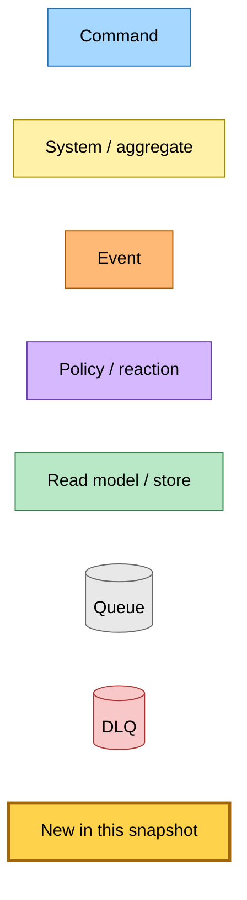
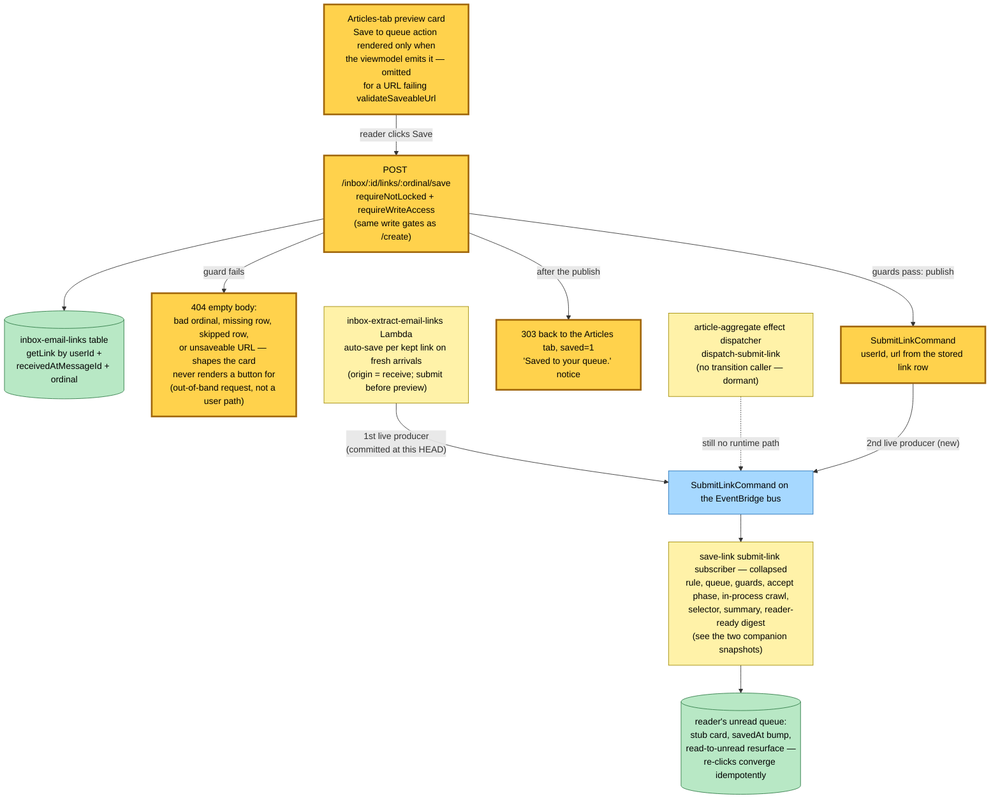

# Inbox "Save to Queue" Button — SubmitLinkCommand's Second Live Producer — Event Storming

**Base commit:** `cc404eb8` &nbsp;•&nbsp; **Commit date:** 2026-07-19 &nbsp;•&nbsp; **Generated:** 2026-07-19 &nbsp;•&nbsp; **Branch:** `main`
**Subject:** `feat(inbox,@packages/domain,@packages/hutch-infra-components): save kept newsletter links to the reader's queue`

> **Dirty-tree snapshot.** The save-button wiring documented here is **uncommitted** on top of `cc404eb8`: modified `projects/inbox/src/runtime/web/pages/inbox/inbox.page.ts`, `inbox-link-card.viewmodel.ts`, `inbox-article-card.template.html`, `inbox-articles-panel.template.html`, `inbox-email-detail.viewmodel.ts`, `inbox-email-detail.styles.css`, `projects/inbox/src/runtime/app.ts`, `lambda.main.ts`, `server.main.ts`, `test-app.ts`, `projects/inbox/src/infra/index.ts`, plus new `inbox-link-save-url.ts` and route tests. This document describes the working tree as it stands, not the commit.

The base commit is the auto-save producer this snapshot builds on: `cc404eb8` committed the inbox link extractor's per-kept-link `SubmitLinkCommand` fan-out documented in the companion snapshot [`2026-07-19-f6b67fff/inbox-link-to-queue.md`](../2026-07-19-f6b67fff/inbox-link-to-queue.md) (generated while that change was still uncommitted), which in turn feeds the `submit-link` subscriber documented in [`2026-07-19-37d5f61a/submit-link-entry-point.md`](../2026-07-19-37d5f61a/submit-link-entry-point.md). **That flow is unchanged.** This snapshot adds an additive producer: the inbox **web** Lambda gains a user-facing per-link **"Save to queue"** button on preview cards, making it the **second live** `SubmitLinkCommand` producer (alongside the extract Lambda; the aggregate effect dispatcher remains dormant with no transition caller).

Why it exists: emails received **before** the auto-save deployed hold preview cards whose links were never queued — the auto-save only fires on fresh arrivals (`origin: "receive"`), and the operator backfill deliberately re-derives previews only. The button is the **user-facing counterpart of the origin-gated backfill**: the reader saves a historical link deliberately, one click at a time, instead of an operator replay mass-saving years of mail.

What is new in this snapshot (highlighted `:::new` in the diagram):

- **`POST /inbox/:id/links/:ordinal/save`** — carries the same write gates as `/create` (`requireNotLocked` + `requireWriteAccess`; landing an article in the queue is a save action). Loads the link row and returns **404** for an unparseable ordinal, a missing row, a `skipped` row, or a URL failing `validateSaveableUrl` — the card never renders the button for those shapes, so any such request is out-of-band, not a user path. On the happy path it publishes `SubmitLinkCommand { userId, url: link.url }` and 303s back to the email's Articles tab with `saved=1`, rendered as a "Saved to your queue." notice.
- **Viewmodel-gated button** — the card's action list omits the save entry whenever `validateSaveableUrl` fails, so the card never offers a Save that can only fail; the route re-checks the same predicate server-side. `skipped` links are excluded a level up: they never render an article card at all (they list on the Skipped tab under a different viewmodel), which is why the route's `skipped` 404 has no on-card counterpart to mirror. The button **does** render on `pending` and `failed` preview cards — a reader can queue a link whose preview crawl has not landed or has failed, since the queue save is an independent pipeline.
- **Idempotent re-clicks** — a duplicate submit converges in the subscriber exactly like any re-save: `savedAt` bump, read→unread resurface, no duplicate row (and a still-`pending` article row re-primes rather than duplicating).
- **Infra: publish rights only** — the `inbox-web` Lambda gains `EVENT_BUS_NAME` and `eventBus.grantPublish`. The IAM boundary from M3 still stands: no inbox Lambda role touches the articles/user-articles tables — the queue write happens only in save-link's subscriber role, reached by command.

> Snapshots are historical. Any file path referenced below may be renamed, moved, or deleted in the future. Treat as an artefact, not a live guide.

---

## Legend

New/changed pieces in this snapshot carry the amber **new** highlight (`fill:#ffd24c`, `stroke:#a0660b`, 3 px stroke); everything else is pre-existing infrastructure shown for context.

Mermaid source

---

## The three producers of `SubmitLinkCommand` — two live, one dormant

The button's flow is deliberately thin: gate, load, validate, publish, redirect. Everything downstream of the command — the subscriber's accept phase, the in-process crawl, the selector, the summary, the reader-ready digest — is exactly the chain the companion snapshots document; one collapsed node stands in for all of it.

Mermaid source

---

## Command → System → Event(s) reference

| Command / trigger | System that handles it | Event(s) emitted | Next command(s) triggered |
|---|---|---|---|
| reader clicks "Save to queue" on a preview card | inbox-web Lambda **(new route)** — write gates, link-row load, 404 for shapes the card never offers, 303 + notice on success | — | `SubmitLinkCommand { userId, url }` |
| `SubmitLinkCommand` `{ url, userId }` | save-link `submit-link` Lambda (see [subscriber snapshot](../2026-07-19-37d5f61a/submit-link-entry-point.md)) | `StaleCheckRequestedEvent` / `SimpleCrawlUnsupportedEvent` / `TierContentExtractedEvent` / `CrawlArticleFailedEvent` per its documented branches | selector → summary → reader-ready chains (see [producer snapshot](../2026-07-19-f6b67fff/inbox-link-to-queue.md)) |

---

## Design notes and caveats observed in the working tree

- **The button and the backfill split the historical-mail problem deliberately.** The origin gate keeps operator replays preview-only because mass-saving is never safe to automate; the button hands the same decision to the reader at per-link granularity, behind their own click and their own write gates. Fresh arrivals need neither — the auto-save covers them.
- **Guard parity, from two different levels.** The route's 404 predicate rejects `skipped` rows and unsaveable URLs; the UI reaches the same result by two separate mechanisms — the card list filters `skipped` links out entirely (they belong to the Skipped tab), and the viewmodel drops the save entry from the card's action list for an unsaveable URL. The two halves are enforced in different files, so the parity is a convention rather than a shared predicate; the route re-checking both is what actually holds the line. Producer-side validation keeps the subscriber's DLQ quiet — the same principle as the extract Lambda's guard triple.
- **The route publishes the STORED url (`link.url`), never `resolvedUrl` or user input.** The only client-controlled inputs are the email id and ordinal, which select a row the user already owns. Even when the preview crawl followed a redirect and recorded a different final URL, the save publishes the original stored URL and lets the save pipeline do its own redirect-following and canonical-identity resolution — the same URL the auto-save producer would have submitted.
- **The whole surface stays behind the email feature flag.** The generated save URL carries `feature=<EMAIL_FEATURE>` because the inbox routes 404 without it; a save POST missing the flag 404s like every other inbox route.
- **No new failure surface.** A publish failure surfaces as the request failing (the web Lambda's error path) — there is no queue, retry, or DLQ on the producer side; the reader just clicks again. Everything async lives behind the subscriber's already-documented queue semantics.
- **The success notice is stateless.** `saved=1` rides the 303 redirect's query string; nothing is written to the inbox rows — the queue row itself (visible on /queue immediately, thanks to the subscriber's synchronous accept phase) is the durable evidence.
