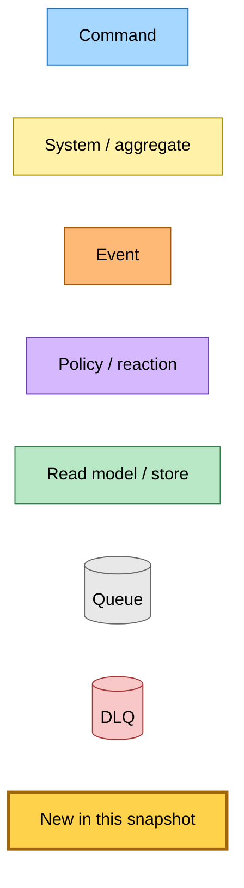
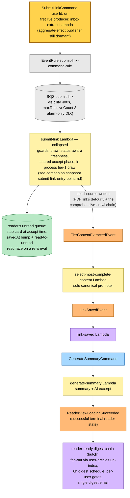

# Inbox Link → Queue Save — SubmitLinkCommand's First Producer — Event Storming

**Base commit:** `f6b67fff` &nbsp;•&nbsp; **Commit date:** 2026-07-19 &nbsp;•&nbsp; **Generated:** 2026-07-19 &nbsp;•&nbsp; **Branch:** `main`
**Subject:** `feat(save-link,@packages/hutch-infra-components): add the submit-link Lambda consuming SubmitLinkCommand`

> **Dirty-tree snapshot.** The producer wiring documented here is **uncommitted** on top of `f6b67fff`: modified `projects/inbox/src/runtime/domain/inbox/extract-email-links-handler.ts` (+ test), `projects/inbox/src/runtime/domain/inbox/receive-email-handler.ts`, `projects/inbox/src/runtime/domain/inbox/backfill-email-links.ts`, `projects/inbox/src/runtime/extract-email-links.main.ts`, `projects/inbox/src/infra/index.ts` (comment-only), `src/packages/hutch-infra-components/src/events.ts`, `src/packages/domain/src/inbox/inbox-address.schema.ts`, and `src/packages/domain/src/inbox/index.ts`. This document describes the working tree as it stands, not the commit.

The base commit itself is the subscriber half of this chain: `f6b67fff` committed the `submit-link` Lambda documented in the companion snapshot [`2026-07-19-37d5f61a/submit-link-entry-point.md`](../2026-07-19-37d5f61a/submit-link-entry-point.md) (generated while that change was still uncommitted on the previous HEAD). This snapshot documents the **first live producer**: the inbox project's extract-email-links Lambda now publishes `SubmitLinkCommand { userId, url }` for every kept newsletter link, so a forwarded newsletter's articles land in the reader's unread queue through the same entry point every save surface uses. The `dispatch-submit-link` aggregate-effect publisher remains dormant (still no transition caller) — inbox is the only thing that produces the command.

What is new in this snapshot (highlighted `:::new` in the diagrams; new edges hang off highlighted nodes):

- **`publishSubmitLink` in the extract handler, published BEFORE the preview command** — for each link that survives classification/triage and is stored `pending`, the handler publishes `SubmitLinkCommand { userId, url }` first and only then the existing per-link `CrawlEmailLinkPreview`. The order is load-bearing: the preview consumer is what flips the link row terminal, so preview-first would open a silent-loss window (see the caveats — a crash between the two publishes would make the retry's pending-gate skip a submit that never happened).
- **Three guards keep the subscriber's DLQ quiet and backfills save-free.** The submit fires only when `origin === "receive"` (a backfill replay never mass-saves), `userId !== UNROUTED_USER_ID` (audit-partition mail has no real user to save for), and `validateSaveableUrl` succeeds (a localhost / private-IP / oversized / non-http link still gets a preview card, but no queue save). The URL guard mirrors the subscriber's own validation assert, so nothing inbox produces can dead-letter on it.
- **`origin: "receive" | "backfill"` — a new REQUIRED field on `EmailReceivedEvent`.** The receive worker stamps `"receive"`; the operator backfill (`backfill-email-links`) stamps `"backfill"`. The backfill deletes the email's link rows before republishing — which resets the very pending-gate the submit dedupe relies on — so without this gate a backfill replay would re-submit every historical link and mass-save/resurface old mail into readers' queues. Required, not optional-with-default, per the repo's no-silent-defaults policy for internal contracts; events in flight at deploy time briefly dead-letter and drain.
- **`UNROUTED_USER_ID` promoted to `@packages/domain/inbox`** — previously a private const inside the receive handler; the extract handler now needs the same sentinel, so it moved to the domain package (`inbox-address.schema.ts`) and both handlers import it.
- **Zero infra changes.** The extract Lambda already had `eventBus.grantPublish` and `EVENT_BUS_NAME` for the preview fan-out; the new publish reuses the same EventBridge publisher. The only `projects/inbox/src/infra/index.ts` edits are comments. The `SubmitLinkCommand` JSDoc in the wire-format package was corrected to name the real roles: inbox extract Lambda as issuer, save-link's `submit-link` Lambda as consumer, the aggregate effect dispatcher still dormant.
- **The M3 "nothing saved to /queue" invariant is superseded.** The M3 snapshot ([`2026-06-28-cd26b26`](../2026-06-28-cd26b26/)) documented that inbox link handling writes nothing to the articles/user-articles tables, enforced at the IAM boundary. The IAM boundary **stands** — no inbox Lambda role touches those tables — but queue saves now happen: they ride `SubmitLinkCommand` into save-link's subscriber, routed by command, never from an inbox Lambda's own role.

> Snapshots are historical. Any file path referenced below may be renamed, moved, or deleted in the future. Treat as an artefact, not a live guide.

---

## Legend

New/changed pieces in this snapshot carry the amber **new** highlight (`fill:#ffd24c`, `stroke:#a0660b`, 3 px stroke); everything else is pre-existing infrastructure shown for context.

Mermaid source

---

## 1. Inbox side — one email in, two commands per kept link out

A forwarded newsletter arrives via SES and the receive worker stores the raw `.eml`, the sanitized body, and one row per recipient, then publishes `EmailReceivedEvent` (`origin: "receive"`) per stored row — **including rows in the `__unrouted__` audit partition** (unknown or disabled forwarding addresses), which is why the extract-side guard is live code, not dead code. A second producer publishes the same event: the operator backfill, which deletes an email's link rows and republishes with `origin: "backfill"` so the deployed extraction re-derives previews under the current classification — but never queue saves. The extract worker re-derives the body from the immutable raw `.eml`, extracts and caps the links, classifies them (action links like unsubscribe/confirm are terminal `skipped` at birth), runs one batched LLM triage per email (non-article verdicts also skip; `unavailable` fails open), and stores one `pending` row per kept link **before** publishing anything, so the Articles tab shows pending cards immediately.

Per kept link the fan-out is now two commands **in a deliberate order**: `SubmitLinkCommand` (the queue save, behind the three guards) first, then `CrawlEmailLinkPreview` (the inbox-side preview card). Re-delivery semantics are conditional-put-then-check: a row a previous delivery drove to a terminal state (`crawled` / `failed` / `skipped`) re-publishes **nothing**; a row still `pending` re-publishes **both** commands, which both consumers tolerate idempotently. Submit-first is what makes that gate safe — only the preview publish triggers the consumer that flips the row terminal, so any crash mid-fan-out leaves the row `pending` and the retry re-publishes both (the duplicate submit converges in the subscriber).

```mermaid
flowchart TD
    classDef command fill:#a6d8ff,stroke:#1e6fb8,color:#000
    classDef system  fill:#fff2a8,stroke:#a08a00,color:#000
    classDef event   fill:#ffb976,stroke:#a85800,color:#000
    classDef policy  fill:#d6b8ff,stroke:#6b3fb0,color:#000
    classDef store   fill:#b8e8c5,stroke:#2f7a45,color:#000
    classDef queue   fill:#e8e8e8,stroke:#666,color:#000
    classDef new     fill:#ffd24c,stroke:#a0660b,stroke-width:3px,color:#000

    SES["SES catch-all receipt<br/>raw .eml to immutable bucket,<br/>SNS notify"]:::system
    RQ[("SQS inbox-receive-email<br/>(SNS to SQS bridge)")]:::queue
    SES --> RQ
    RW["inbox-receive-email Lambda<br/>parse, sanitize, store body + row<br/>per recipient (unknown/disabled address<br/>resolves to the __unrouted__ audit partition)"]:::system
    RQ --> RW

    ERE["EmailReceivedEvent<br/>userId, receivedAtMessageId,<br/>origin: receive | backfill (NEW required field)<br/>(published per stored row,<br/>audit partition included)"]:::new
    RW -- "origin = receive" --> ERE

    BF["operator backfill (backfill-email-links)<br/>deletes the email's link rows + meta,<br/>republishes so the DEPLOYED extraction<br/>re-classifies previews — never saves"]:::system
    BF -- "origin = backfill" --> ERE

    XQ[("SQS inbox-extract-email-links<br/>rule inbox-extract-email-links")]:::queue
    ERE --> XQ
    X["inbox-extract-email-links Lambda<br/>re-derive body from raw .eml,<br/>extract + cap links, classify,<br/>one batched LLM triage per email"]:::system
    XQ --> X

    Skip[("terminal skipped rows:<br/>action links (unsubscribe/confirm),<br/>triage non-article verdicts<br/>— never fanned out")]:::store
    X -- "skip classification" --> Skip

    Pend[("inbox-email-links table<br/>conditional put: pending row per kept link<br/>(cards render before any fan-out)")]:::store
    X -- "kept link" --> Pend

    Redeliver["re-delivery check:<br/>row already terminal — publish nothing;<br/>row still pending — publish both again<br/>(consumers idempotent)"]:::system
    Pend --> Redeliver

    Guard["queue-save guards, checked first:<br/>origin = receive<br/>AND userId is not UNROUTED_USER_ID<br/>AND validateSaveableUrl SUCCESS"]:::new
    Redeliver -- "pending" --> Guard

    SLC["SubmitLinkCommand userId, url<br/>published FIRST"]:::new
    Guard -- "all guards pass" --> SLC

    NoSave["no queue save:<br/>backfill replay, audit-partition mail<br/>(no real user), or unsaveable URL<br/>(localhost / private IP / oversized / non-http)"]:::system
    Guard -- "any guard fails" --> NoSave

    CP["CrawlEmailLinkPreview<br/>published SECOND, after the submit:<br/>its consumer flips the row terminal, so<br/>preview-first plus a crash between the two<br/>publishes would let the retry's pending-gate<br/>silently skip a submit that never happened"]:::new
    SLC --> CP
    NoSave --> CP

    PQ[("SQS inbox-crawl-email-link-preview")]:::queue
    CP --> PQ
    PW["inbox-crawl-email-link-preview Lambda<br/>SSRF-guarded metadata crawl, keeps<br/>metadata + lead image, discards body;<br/>IAM: no articles/user-articles access"]:::system
    PQ --> PW
    LinkRow[("link row: crawled / failed<br/>(preview card terminal)")]:::store
    PW --> LinkRow
```

Mermaid source

---

## 2. Queue side — the command lands in the reader's unread queue

`SubmitLinkCommand` rides the existing EventBridge subscription into save-link's `submit-link` Lambda — the subscriber this base commit added. Its internals (guard asserts, crawl-status-aware freshness, shared accept phase, in-process tier-1 crawl with in-process failure terminalisation, alarm-only DLQ) are documented in the companion snapshot [`submit-link-entry-point.md`](../2026-07-19-37d5f61a/submit-link-entry-point.md) and are **not** redrawn here — one collapsed node stands in for that whole flow. Everything inbox produces satisfies the subscriber's asserts by construction (authenticated, saveable, no `rawHtml`), so the newsletter path exercises only the happy intake.

Downstream, the newsletter link is indistinguishable from any other authenticated save: stub queue card at accept time, tier source written, selector promotion, summary generation, and — for a reader who opened the article while it was still loading — the reader-ready digest email.

Mermaid source

---

## Command → System → Event(s) reference

| Command / trigger | System that handles it | Event(s) emitted | Next command(s) triggered |
|---|---|---|---|
| `EmailReceivedEvent` (`origin: "receive" \| "backfill"` — new required field) | inbox-extract-email-links Lambda **(revised)** — re-derive body, extract, cap, classify, triage, store rows | — | **`SubmitLinkCommand` first**, per kept pending link when `origin = "receive"` ∧ routed ∧ saveable **(new)**; then `CrawlEmailLinkPreview` per kept pending link; nothing for terminal rows on re-delivery |
| operator backfill run (`backfill-email-links`) | deletes the email's link rows + meta barrier, republishes the receive event so the deployed extraction re-classifies | `EmailReceivedEvent` with `origin: "backfill"` | preview re-extraction only — the origin gate suppresses every `SubmitLinkCommand` |
| `CrawlEmailLinkPreview` | inbox-crawl-email-link-preview Lambda (existing) — preview metadata only, no queue tables at the IAM boundary | — | — |
| `SubmitLinkCommand` `{ url, userId }` | save-link `submit-link` Lambda (committed at this HEAD — see [companion snapshot](../2026-07-19-37d5f61a/submit-link-entry-point.md)) | `StaleCheckRequestedEvent` (settled row), `SimpleCrawlUnsupportedEvent` (non-HTML), `TierContentExtractedEvent` (tier-1 written), `CrawlArticleFailedEvent` (crawl failure, terminalised in-process) | none directly |
| `TierContentExtractedEvent` | select-most-complete-content Lambda (existing) | `LinkSavedEvent`, `CanonicalContentChangedEvent`, `CrawlArticleCompletedEvent` | via `LinkSavedEvent` → link-saved Lambda → `GenerateSummaryCommand` |
| `GenerateSummaryCommand` | generate-summary Lambda (existing) | `SummaryGeneratedEvent`; `ReaderViewLoadingSucceeded` on the successful terminal reader state | via `ReaderViewLoadingSucceeded` → hutch reader-ready digest chain (fan-out → 6h schedule → `SendUserDigestCommand` → digest email) |

---

## Design notes and caveats observed in the working tree

- **The M3 invariant is superseded, not violated.** "Nothing saved to /queue" (M3, [`2026-06-28-cd26b26`](../2026-06-28-cd26b26/)) is no longer true as a product statement — newsletter links now land in the queue. What survives is the mechanism the invariant was really about: no inbox Lambda role can write the articles/user-articles tables. The queue write happens in save-link's subscriber under save-link's role, reached only by command.
- **The guards mirror the subscriber, so the DLQ stays quiet by design.** `validateSaveableUrl` runs on both sides: inbox filters before publishing, and the subscriber asserts on receipt. Without the producer-side gate, every tracking-pixel localhost link in a newsletter would burn three subscriber receives and page the operator via the DLQ alarm.
- **Audit mail gets previews, never saves.** `EmailReceivedEvent` fires for the `__unrouted__` partition too (the operator can inspect what a guessed/disabled address received), so only the new `UNROUTED_USER_ID` guard stands between dictionary-spam mail and a queue write — there is no user-articles partition it could sensibly land in.
- **The publish order is load-bearing — submit before preview.** An earlier revision of this change published the preview first and treated the order as irrelevant; adversarial review falsified that. The preview consumer is what flips the link row terminal, so with preview-first, a throw between the two publishes followed by SQS redelivery hits the pending-gate on a now-terminal row and **silently skips a submit that never happened** — preview card shown, article never in the queue, no alarm anywhere. Submit-first closes the window: a crash after the submit leaves the row `pending` (only the preview publish triggers the flipper), the retry re-publishes both, and the duplicate submit converges in the subscriber.
- **Re-delivery is bounded by link-row state, not by the consumers.** A terminal link row publishes nothing on re-delivery. A still-pending row re-publishes both commands: the preview crawler is last-write-wins, and the submit subscriber's crawl-status-aware freshness maps the still-`pending` article row to `new` — it re-primes and re-crawls the same row, converging rather than duplicating.
- **The `origin` gate is what keeps the backfill honest.** The backfill deletes an email's link rows before republishing, so every historical link re-enters extraction as freshly `pending` — the pending-gate dedupe is defeated **by design** for previews (that is the point of a backfill) and would therefore mass-save and read→unread-resurface years of old mail if the submit rode the same replay. `origin === "receive"` pins queue saves to genuine arrivals; a backfill can never touch a reader's queue. The field is required rather than optional-with-default (repo policy: no silent defaults on internal contracts); the few events in flight across the deploy fail schema-parse, dead-letter, and drain.
- **Per-email volume is bounded upstream.** The link cap (with its truncate-degrade + dedicated alert queue) bounds the `SubmitLinkCommand` fan-out exactly as it bounds previews — a 200-link digest cannot flood the reader's queue beyond the cap.
