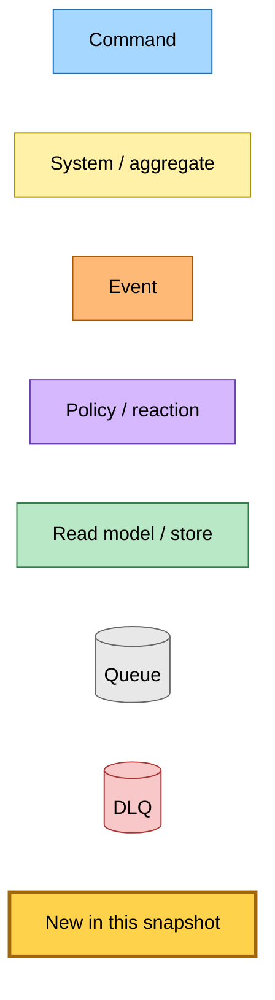
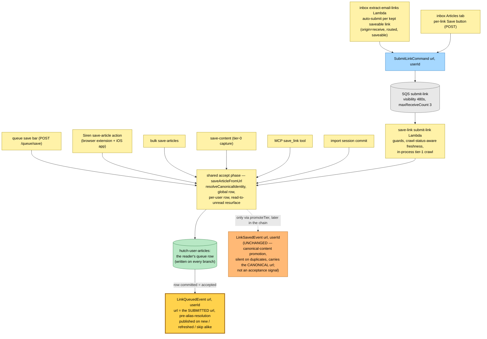
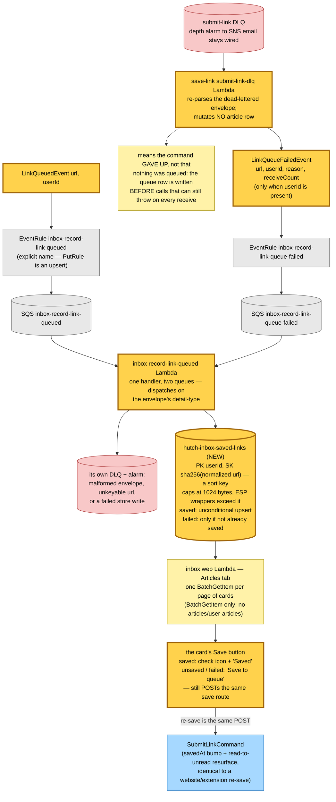

# Saved-Link Read Model — LinkQueued as the Accept-Terminal Fact — Event Storming

**Base commit:** `599d63be` &nbsp;•&nbsp; **Commit date:** 2026-07-26 &nbsp;•&nbsp; **Generated:** 2026-07-26 &nbsp;•&nbsp; **Branch:** `main`
**Subject:** `fix(ios): verify App Store screenshots against git rather than trust deliver`

> **Dirty-tree snapshot.** Everything documented here is **uncommitted** on top of `599d63be`. Modified: `src/packages/hutch-infra-components/src/{events.ts,index.ts}`, `src/packages/provider-contracts/src/events.ts`, `src/packages/save-article/src/save-article-from-url.ts`, `src/packages/domain/src/inbox/{index.ts,inbox-saved-link.types.ts}`, `src/packages/inbox-store/src/{index.ts,dynamodb-inbox-saved-link.ts}`, `src/packages/test-fixtures/**`, `src/packages/web-test-harness/src/bundle.types.ts`, `projects/hutch/src/{infra,runtime}/**`, `projects/save-link/src/{infra,runtime}/**`, `projects/inbox/src/{infra,runtime}/**`, and four `Pulumi.*.yaml` files. This document describes the working tree as it stands, not the commit.

The Articles tab of a received email (`/inbox/:emailId?tab=articles`) renders one card per extracted link, each with a "Save to queue" button. Until now an already-saved link, a never-saved link, and a link whose save failed rendered byte-identical HTML — and since [`f6b67fff`](../2026-07-19-f6b67fff/) *most* kept links on a live-received email are auto-submitted to the queue at extraction time, so the majority of those buttons were already lying by omission.

This snapshot adds the fact that makes the state knowable, and the read model that renders it:

- **`LinkQueuedEvent { url, userId }` — a new irreversible fact, published at the accept terminal inside `@packages/save-article`.** Every save surface routes through `initSaveArticleFromUrl`, so one publish point covers all seven: the queue save bar, the Siren `save-article` action (extension + iOS), the bulk save, tier-0 `save-content`, MCP `save_link`, the import commit, and save-link's `submit-link` Lambda (which is where both inbox paths — the extractor's auto-submit and the per-link Save button — land). It fires on **every** freshness branch, including the `skip` that writes the per-user row and publishes nothing else.
- **Why not `LinkSavedEvent`.** That event is published only by the effect dispatcher when `promoteTier` flips canonical content, it carries the aggregate's **canonical** URL, and it fires **zero** times for a duplicate save of a settled article. It is a content-promotion signal, not an acceptance signal; keying a saved-state read model on it would leave a re-saved link permanently unsaved on screen and would mismatch the URL the consumer submitted. It is untouched here, and its single subscriber (link-saved → `GenerateSummaryCommand`) is unaffected — no summary-regeneration risk.
- **`url` is the submitted URL, captured before `resolveCanonicalIdentity`.** The consumer keyed its lookup on the URL it submitted; the fact answers in the same terms.
- **`LinkQueueFailedEvent { url, userId, reason, receiveCount }`** — published by a new `submit-link-dlq` handler off the submit-link DLQ, so a save that exhausted its accept retries does not leave a claim standing. The queue's depth alarm stays wired; the handler mutates no article row.
  **The fact is weaker than "nothing was queued", and the read model treats it that way.** The accept phase writes the reader's queue row *first* and five awaited calls after it can still throw — plus the enrichment loop's in-process terminalisation, which can throw deterministically on all three receives. So a record can dead-letter with the article sitting in the queue the whole time. An unguarded failure write would strand that link reading "Save to queue" forever, since nothing later corrects it. **An accepted save therefore outranks a failure**: the failure write carries `ConditionExpression: attribute_not_exists(linkKey) OR #state <> :saved` and a rejected condition is a no-op, not an error.
- **A new inbox-owned read model** (`hutch-inbox-saved-links`, PK `userId` / SK the hashed normalized URL) written by a new `inbox-record-link-queued` Lambda fed by **two** queues — one per fact, because `eventBus.subscribe` creates one queue policy per call. The Articles tab resolves a page of cards with a single `BatchGetItem`.
  **The sort key is a SHA-256 of the normalized URL, not the URL itself**, because a sort key is capped at 1024 bytes and newsletters routinely carry ESP wrapper URLs longer than that. Stored raw, one such link would fail the whole `BatchGetItem` and 500 the entire Articles tab — not merely fail to resolve itself — and would permanently dead-letter its own save. The row carries the URL as a plain attribute so it still names something in the console.
- **The IAM boundary holds.** No inbox role reads or writes `hutch-articles` / `hutch-user-articles`. That constraint is precisely why this state arrives as a fact rather than a cross-boundary read.
- **Moment-in-time semantics, stated as a product decision.** Removing an article from the queue publishes no fact, so a row here outlives the queue row it describes. The button keeps reading "Saved", and stays clickable — re-saving is the same POST it always was, landing on the same upsert the website and extension re-save through (`savedAt` bump + read→unread resurface).

---

## Legend

New/changed pieces carry the amber **new** highlight (`fill:#ffd24c`, `stroke:#a0660b`, 3 px stroke); everything else is pre-existing infrastructure shown for context.

Mermaid source

---

## 1. Every save surface emits the accept-terminal fact

`initSaveArticleFromUrl` is the shared accept phase: it resolves canonical identity, writes the global article row and the per-user queue row, and resurfaces a previously-read article as unread. The new publish sits immediately after that returns — the row is committed, so the save is accepted — and carries `params.url`, the URL as submitted, captured *before* the canonical resolution on the line above.

Note the two producers that do **not** publish it: the aggregate effect dispatcher's `LinkSavedEvent` (a different fact, unchanged) and any path that never reaches the accept phase (an unsaveable URL, a refused authorization gate) — which is exactly the "the save command engaged" boundary the button's semantics require.

Mermaid source

---

## 2. The facts land in an inbox-owned read model, and the button renders from it

Both facts feed one Lambda through two queues. Two queues rather than one because `eventBus.subscribe` provisions a queue policy per call, so a second rule pointed at a shared queue would contend for that single physical policy. Rule names are explicit for the same reason `PutRule` is an upsert: a defaulted name can silently retarget another stack's rule.

The write is an unconditional upsert on both paths — every fact is re-published on SQS redelivery and on every re-save — so redelivery converges rather than duplicating.

Mermaid source

---

## Command → System → Event(s) reference

| Command / trigger | System that handles it | Event(s) emitted | Next command(s) triggered |
|---|---|---|---|
| any save surface (queue bar, Siren/extension/iOS, bulk, save-content, MCP, import) | the shared accept phase in `@packages/save-article` — canonical identity, global row, per-user row, read→unread resurface | **`LinkQueuedEvent` (new)** on every freshness branch; `LinkSavedEvent` only via the later `promoteTier` promotion | none directly |
| `SubmitLinkCommand` `{ url, userId }` | save-link `submit-link` Lambda → the same accept phase, then in-process tier-1 crawl | **`LinkQueuedEvent` (new)**; `StaleCheckRequestedEvent` (settled row), `SimpleCrawlUnsupportedEvent` (non-HTML), `TierContentExtractedEvent` (tier-1 written), `CrawlArticleFailedEvent` (terminalised in-process) | none directly |
| `SubmitLinkCommand` dead-letters after 3 receives | **save-link `submit-link-dlq` Lambda (new)** — publishes only; no row mutation; skips a command with no `userId` | **`LinkQueueFailedEvent` (new)** | none |
| **`LinkQueuedEvent` (new)** | **inbox `record-link-queued` Lambda (new)** | — (terminal: upsert `state="saved"`) | none |
| **`LinkQueueFailedEvent` (new)** | **the same inbox Lambda, second queue (new)** | — (terminal: conditional upsert `state="failed"`, dropped when an accepted save is already recorded) | none |
| `GET /inbox/:id?tab=articles` and its three fragment routes (panel poll, articles/more, per-card poll) | inbox web Lambda — one `BatchGetItem` against the read model per rendered page | — | the rendered Save button, whose POST re-enters `SubmitLinkCommand` |
| account deletion | hutch `delete-account` Lambda — now also drops the user's read-model partition | — | none |

---

## Design notes and caveats

- **The fact lives in the shared package, not in the submit-link Lambda.** Publishing from the command handler would have covered only the inbox's two paths and missed the website save bar, the extension, iOS, MCP, and import — every one of which reaches the same accept phase in-process without ever touching `SubmitLinkCommand`.
- **The skip branch is the whole reason a new fact was needed.** A reader saving a link whose article is already settled writes the per-user row and publishes no existing event. Keyed on `LinkSavedEvent`, that reader's button could never flip, no matter how many times they clicked.
- **The ETag is part of the contract.** The per-card poll route's validator now hashes the save state alongside crawl status, title, and resolved URL. Without that, a card whose save landed after the reader's last poll would keep matching its old ETag and answer `304` forever — the indicator would never appear on a polling card.
- **Crawl-terminal cards do not poll**, so a save that lands after the redirect shows up on the next page load rather than in place. The post-save toast is already present-tense ("Adding to your queue…") for exactly this reason. A poll nudge for terminal cards after `?saved=1` is a deliberate follow-up, not part of this change.
- **Two known false negatives, both accepted.** (1) The key normalizes tracking params and scheme but does not follow redirects or canonical adoption, so the same article reached through a different wrapper URL reads as unsaved. (2) Saves made before this subscriber deploys are absent — the read model is built forward, with no backfill. Both degrade to an extra click, which is idempotent.
- **The failure fact renders identically to unsaved.** It is stored so the state is auditable and so a later tri-state UI needs no new pipeline, but a reader today sees only "this is still savable" — which is the truthful thing to show for a save that never landed.
- **`HutchDLQEventHandler` drains the DLQ destructively**, as it already does at twelve other call sites. The depth alarm stays wired, but for successfully-processed dead letters the email is best-effort; the failure fact plus error-level logs become the primary trail, and the handler's own failure path restores visibility so the alarm fires on a genuinely stuck message.
