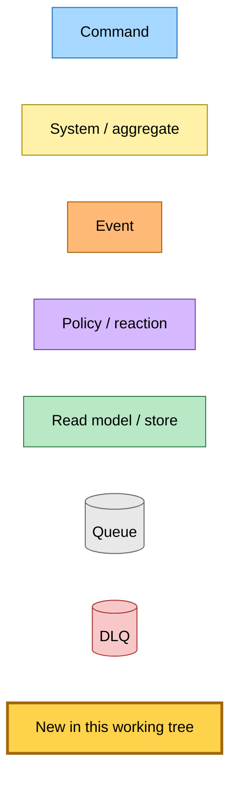
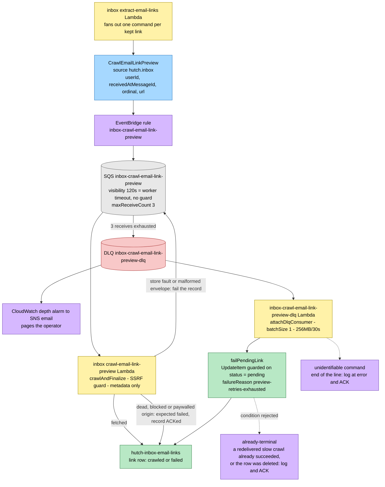
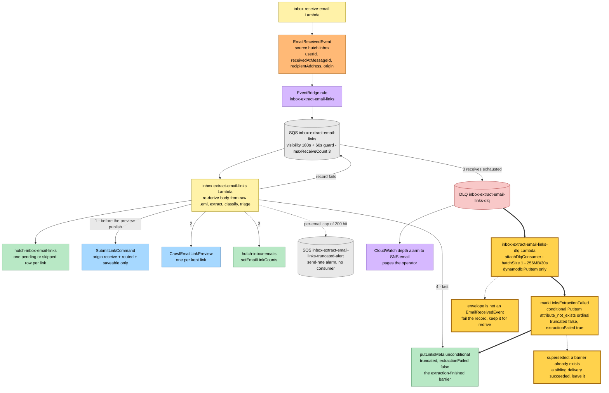
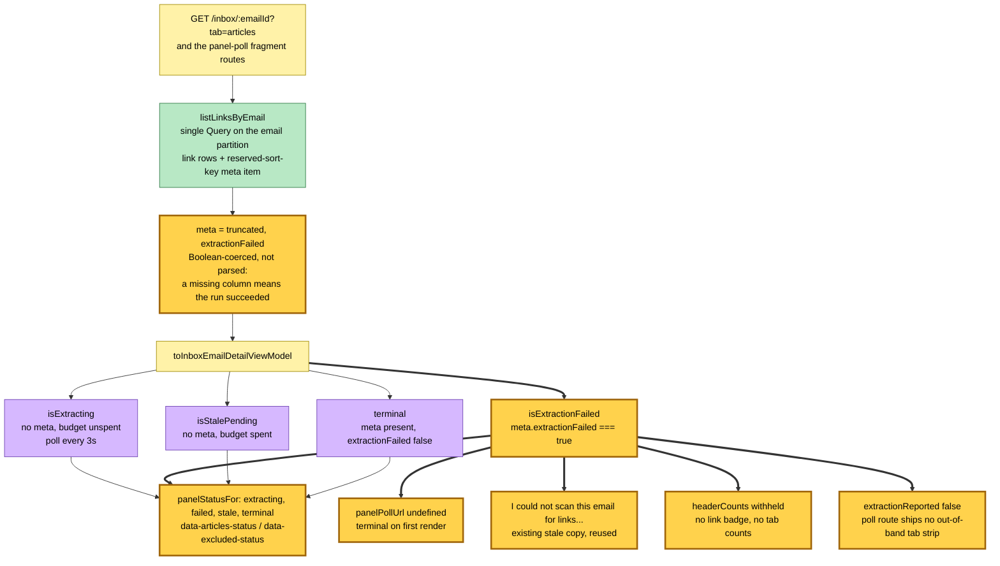
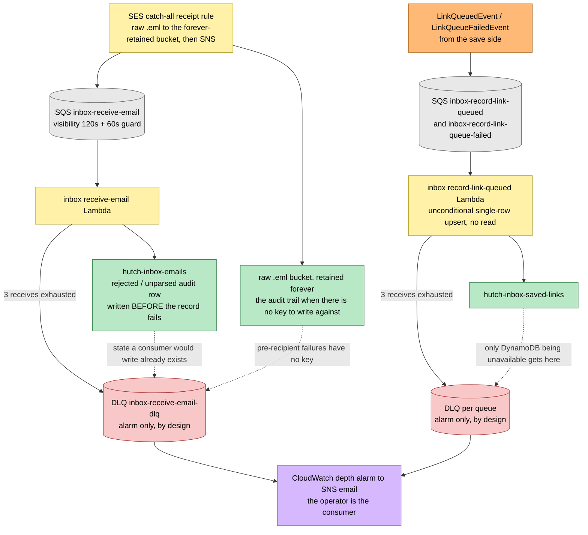

# Inbox Dead-Letter Terminal States — Event Storming

**Base commit:** `bf096547` &nbsp;•&nbsp; **Commit date:** 2026-07-27 &nbsp;•&nbsp; **Generated:** 2026-07-27 &nbsp;•&nbsp; **Branch:** `main`
**Subject:** `refactor(inbox): assert which state an element is in, not that it is absent`

> **Dirty-tree snapshot.** The crawl-preview half of this document is **committed** (`9f1b5c9c`, "fix: terminalise inbox link previews that dead-letter", an ancestor of the base commit). The extraction half is **uncommitted** on top of `bf096547`. New in the working tree: `projects/inbox/src/runtime/inbox-extract-email-links-dlq.main.ts`, `projects/inbox/src/runtime/domain/inbox/extract-email-links-dlq-handler.ts`, `projects/inbox/src/runtime/web/pages/inbox/inbox-panel-status.ts` (each with its test). Modified: `projects/inbox/src/infra/index.ts`, `projects/inbox/src/runtime/domain/inbox/extract-email-links-handler.ts`, `projects/inbox/src/runtime/web/pages/inbox/{inbox-email-detail.viewmodel.ts,inbox-articles-panel.*,inbox-excluded-panel.*}`, `src/packages/domain/src/inbox/inbox-email-link.types.ts`, `src/packages/inbox-store/src/dynamodb-inbox-email-link.ts`, `src/packages/test-fixtures/src/providers/inbox-email/in-memory-inbox-email-link.ts`, `projects/inbox/src/runtime/server.main.ts`, and one seeding line in `projects/hutch/src/runtime/delete-account/delete-account-handler.test.ts`.

The inbox's two async chains — link extraction and per-link preview crawl — each had a happy path with a terminal state and a failure path with none. Both are SQS-backed with `maxReceiveCount: 3` (the `HutchSQS` default); when a message exhausted its receives it landed in a DLQ whose only consumer was a CloudWatch depth alarm. The alarm pages an operator, but nothing wrote the give-up into the state the reader's page renders from, so the UI kept describing work that had already stopped:

- **A link whose crawl exhausted its retries stayed `pending` forever.** Its preview card polled `/inbox/:id/links/:ordinal/card` every 3 s until `MAX_POLLS` (300 → 15 minutes) ran out, then settled on "Preview didn't arrive". A reader could not tell that from a slow crawl.
- **An extraction that exhausted its retries never wrote its meta barrier.** The barrier's *presence* is what tells the detail view extraction finished; without it both tab panels showed "Looking for links…" for the whole 15-minute budget and then fell back to the same stale notice.

The crawl-preview half shipped first, deliberately narrow. This snapshot documents that as current state and adds the extraction half plus the read-model field that lets an extraction give-up be told apart from an email that genuinely contained no links.

- **`inbox-crawl-email-link-preview-dlq`** *(committed at `9f1b5c9c`)* — a plain `HutchLambda` mounted on the preview queue's DLQ via `attachDlqConsumer`. It parses the EventBridge envelope's `detail` through `CrawlEmailLinkPreview.detailSchema` piped into a branding schema, and calls the **new** store method `failPendingLink({ failureReason: "preview-retries-exhausted" })`. **Store-only: it publishes no event.** `failed` is a state the card already renders as "No preview available", so no view change was needed to collect the outcome.
- **The preview write is guarded on the row still being `pending`.** `setLinkOutcome` is conditional only on the row existing and would overwrite a successfully crawled preview. That is reachable: the crawl queue's visibility timeout (120 s) *equals* its worker timeout with no receive-to-invoke guard, so a slow-but-successful crawl can be redelivered and the copy that dead-letters may be chasing a link another copy already crawled. `failPendingLink` returns `"already-terminal"` in that race instead of repainting a good preview as a failure. (The missing guard on that queue is a separate, unfixed bug.)
- **`HutchDLQEventHandler` is not reused, in either consumer.** That component hardcodes `DYNAMODB_ARTICLES_TABLE` from its `tableName` arg, which would put a var by that name inside an inbox Lambda and undercut the invariant that no inbox role touches the articles tables. Its DLQ wiring — the receive policy plus the `EventSourceMapping` with `ReportBatchItemFailures` — was extracted to `attachDlqConsumer`, keeping resource names and parents identical so no URN moved across its twelve existing save-link callsites.
- **`inbox-extract-email-links-dlq`** *(uncommitted)* — the same `attachDlqConsumer` shape on the extract queue's DLQ. It calls a **new** store method `markLinksExtractionFailed`, which writes the meta barrier itself with a new required `extractionFailed: true` field. Writing an *ordinary* barrier here would be worse than writing nothing: with no link rows behind it, the panel reads meta-present-with-zero-rows as the terminal "No links found in this email." — a claim about an email nobody managed to read.
- **The give-up barrier is a conditional `PutItem` (`attribute_not_exists(ordinal)`); the success barrier stays unconditional.** Delivery is at-least-once, so one attempt can succeed while a duplicate exhausts its receives — overwriting that success would paint a permanent failure over a real card set. The reverse race self-heals: `putLinksMeta` is unconditional, so a successful run landing moments later replaces the give-up marker.
- **`InboxEmailLinksMeta` gains a required `extractionFailed`**, coerced (not schema-parsed) on read, because rows written before the field existed carry no such column and their absence means the extraction that wrote them succeeded.
- **The detail view derives `isExtractionFailed`** and makes both panels terminal *immediately* — no poll URL at all, rather than burning the budget first — reusing the existing "I couldn't scan this email for links…" copy. The header badge and the tab counts are withheld (an extraction that gave up has no trustworthy count), and `extractionReported` is forced `false` so the poll route never ships its out-of-band tab strip.
- **A new `failed` value on the panel status attribute**, and a single `panelStatusFor` that both panels call, so the two panels cannot drift apart on which state outranks which. `failed` reads identically to `stale` for the reader; a test and the DOM attribute can still tell an immediate give-up from a budget that ran out.

Three other inbox DLQs were examined and **deliberately left consumer-less** — see [§4](#4-deliberate-non-changes--the-dlqs-that-stay-alarm-only).

---

## Legend

The amber **new** highlight (`fill:#ffd24c`, `stroke:#a0660b`, 3 px stroke) marks only what *this working tree* adds on top of the base commit: the extract-DLQ path and the `extractionFailed` marker that carries it into the read model. The crawl-preview DLQ consumer is drawn unhighlighted — it is committed, existing state. Everything else is pre-existing infrastructure shown for context, so each diagram is the complete current state of its flow rather than a diff.

Mermaid source

---

## 1. Crawl preview — the link row reaches `failed` instead of staying `pending`

*Committed at `9f1b5c9c`; drawn here as existing state.*

`CrawlEmailLinkPreview` is a command on the shared bus (`source: hutch.inbox`, `detailType: CrawlEmailLinkPreview`, detail `{ userId, receivedAtMessageId, ordinal, url }`), one per kept link. The inbox stack subscribes it under the explicit rule name `inbox-crawl-email-link-preview` — PutRule is an upsert, so a defaulted name would steal hutch's rule rather than stand up beside it — routing to the `inbox-crawl-email-link-preview` queue (visibility **120 s**, `maxReceiveCount: 3`).

The worker runs the same SSRF-guarded `crawlAndFinalize` the save pipeline uses, keeps only the metadata, discards the body, and stamps `crawled` or `failed` onto the link row via `setLinkOutcome`. A dead, blocked, or paywalled origin is an *expected* `failed` preview and the record is ACKed — only a genuine store fault or a malformed envelope fails the record. So a message reaching the DLQ means the failure survived three receives: a Lambda timeout on a slow origin, an OOM, a DynamoDB fault.

The consumer on that DLQ writes through `failPendingLink`, a conditional `UpdateItem` on `attribute_exists(ordinal) AND #status = :pending`. The guard is load-bearing precisely because this queue's visibility timeout equals its worker timeout: a slow-but-successful crawl can be redelivered while the first invocation is still finishing, so the copy that dead-letters may be chasing a link another copy already crawled. That race, and a row deleted out from under it (account deletion, or the operator backfill that deletes link rows first), both surface as `"already-terminal"` — an outcome, not a fault, logged at info and ACKed. A record whose envelope does not identify a link is also ACKed rather than retried: this queue is the end of the line, so failing it would replay the same unparseable message forever.

Mermaid source

**Before this handler**, the DLQ's only consumer was the depth alarm: the link row stayed `pending`, its card polled every 3 s for 15 minutes and then settled on "Preview didn't arrive". **After**, the row is terminal within one DLQ delivery and the card renders the `failed` state it already knew how to draw.

---

## 2. Link extraction — the barrier gets written even when extraction gives up

*Uncommitted in this working tree.*

`EmailReceivedEvent` (`source: hutch.inbox`, detail `{ userId, receivedAtMessageId, recipientAddress, origin }`) is published by the receive worker once a forwarded email is parsed, sanitized, stored, and a row written. The inbox stack subscribes it under rule `inbox-extract-email-links` onto the `inbox-extract-email-links` queue (visibility **240 s** = the 180 s worker timeout plus a 60 s receive-to-invoke guard; `maxReceiveCount: 3`).

The worker re-derives the body from the immutable raw `.eml`, extracts links, classifies and LLM-triages them, writes one row per link, and then — in a fixed order that the read side depends on — fans out per kept link, writes the counts, and writes the meta barrier **last**:

1. per kept link: one `SubmitLinkCommand` (only when `origin === "receive"`, the user is routed, and the URL passes `validateSaveableUrl`) **before** one `CrawlEmailLinkPreview`, because the preview consumer flips the row terminal and a crash between the two publishes would let the retry's pending-gate skip a submit that never happened;
2. `setEmailLinkCounts` onto the email row;
3. `putLinksMeta` — the "extraction finished" barrier, now carrying `extractionFailed: false`.

Truncation has its own dedicated alert queue and send-rate alarm, deliberately *not* the failure DLQ, so the DLQ's "messages awaiting redrive" contract stays unambiguous. That arrangement is unchanged.

The new consumer sits on the failure DLQ and writes the barrier itself, flagged as a give-up. Unlike the preview consumer it uses `.parse` rather than `.safeParse`: a dead letter whose envelope is not an `EmailReceivedEvent` throws into the catch and **fails the record**, because on this queue an unparseable message is the whole email's link set and is worth keeping for the operator rather than ACKing away.

Mermaid source

**Why conditional, and why only here.** The two writers race in both directions and the asymmetry is deliberate:

| Race | Outcome |
|---|---|
| Duplicate delivery dead-letters *after* a sibling delivery succeeded | The conditional `PutItem` is rejected → `"superseded"`. The real card set survives. |
| Dead-letter lands *before* the successful run finishes | The give-up marker is written, then the successful run's **unconditional** `putLinksMeta` overwrites it moments later. Self-healing. |

---

## 3. Read-model effect — the barrier the reader sees

*Uncommitted in this working tree.*

`listLinksByEmail` is a single Query over the email's partition: link rows plus the reserved-sort-key meta item. The meta item is now read as `{ truncated, extractionFailed }`, both **coerced** with `Boolean(...)` rather than schema-parsed, because pre-feature rows carry no `extractionFailed` column and their absence means the extraction that wrote them succeeded.

The detail viewmodel already distinguished three extraction states; `extractionFailed` adds the fourth and it outranks the poll budget entirely:

| Viewmodel flag | Condition | Panel behaviour |
|---|---|---|
| `isExtracting` | received email, no meta row, budget unspent | polls its own fragment route every 3 s, shows "Looking for links…" |
| `isExtractionFailed` | **meta row present with `extractionFailed: true`** | **terminal immediately — no poll URL — shows the "I couldn't scan this email…" copy** |
| `isStalePending` | no meta row, budget spent | terminal, same copy (a pre-feature email, or an extractor that died without reaching its DLQ) |
| terminal | meta row present, `extractionFailed: false` | renders cards / empty message / truncation notice |

Because `isExtractionFailed` implies the meta row is present, `awaitingMeta` is false, so `isExtracting` and `isStalePending` are both false and `panelPollUrl` is `undefined` on the very first render. `panelStatusFor` in the new `inbox-panel-status.ts` is the one place the precedence is written down; both panels call it and render it into `data-articles-status` / `data-excluded-status`.

Mermaid source

---

## 4. Deliberate non-changes — the DLQs that stay alarm-only

Three other inbox DLQs were examined in the same pass and left with the alarm as their only consumer. Both decisions are about whether a dead letter carries a key the handler could write a truthful state against.

**`inbox-receive-email` — the audit row is already written, or there is no key to write against.** The worker's oversize and unparsed paths persist `rejected` / `unparsed` audit rows *before* failing the record, so the state a DLQ consumer would write already exists. The earlier failure paths — a body that never resolved to a recipient, a raw object that could not be read — have no `userId` + `receivedAtMessageId` to key a row on at all. For those, the immutable raw `.eml`, retained forever in the raw bucket, **is** the audit trail. Adding a consumer would mean inventing a partition key for mail whose owner is unknown.

**`inbox-record-link-queued` and `inbox-record-link-queue-failed` — a dead letter there means DynamoDB itself was unavailable.** The saved-link read-model handler's only writes are unconditional single-row upserts against `hutch-inbox-saved-links`; there is no conditional check, no read, no external call. Three exhausted receives therefore point at the table being unavailable, not at a state transition anyone can complete — and the state a consumer would try to write is the very write that just failed three times. The alarm is the correct response.

Mermaid source

---

## Command → System → Event(s) reference

| Command / trigger | System that handles it | Event(s) emitted | Next command(s) triggered |
|---|---|---|---|
| SES receipt → SNS → SQS | inbox `receive-email` Lambda — fetch raw `.eml`, resolve recipient, parse, rehost images, sanitize, write row | `EmailReceivedEvent` `{ userId, receivedAtMessageId, recipientAddress, origin }` | none directly |
| `EmailReceivedEvent` | inbox `extract-email-links` Lambda — re-derive body from raw `.eml`, extract, classify, triage, write link rows, counts, then the meta barrier last | — (terminal: rows + `putLinksMeta { truncated, extractionFailed: false }`) | `SubmitLinkCommand` (per kept link, `origin: "receive"` + routed + saveable), then `CrawlEmailLinkPreview` (per kept link) |
| `EmailReceivedEvent` **dead-letters after 3 receives** | **inbox `extract-email-links-dlq` Lambda (new, uncommitted)** — `attachDlqConsumer` on the extract queue's DLQ | — (**store-only**; terminal: `markLinksExtractionFailed`, a conditional `PutItem` writing `extractionFailed: true`, returning `"superseded"` when a barrier already exists; a non-`EmailReceivedEvent` envelope fails the record) | none |
| `CrawlEmailLinkPreview` `{ userId, receivedAtMessageId, ordinal, url }` | inbox `crawl-email-link-preview` Lambda — SSRF-guarded `crawlAndFinalize`, metadata kept, body discarded | — (terminal: `setLinkOutcome` `crawled` or `failed`) | none |
| `CrawlEmailLinkPreview` **dead-letters after 3 receives** | inbox `crawl-email-link-preview-dlq` Lambda (committed at `9f1b5c9c`) — `attachDlqConsumer` on the preview queue's DLQ | — (**store-only**; terminal: `failPendingLink { failureReason: "preview-retries-exhausted" }` guarded on `status = pending`, returning `"already-terminal"` when a redelivered crawl already succeeded or the row is gone; an unidentifiable envelope is logged and ACKed) | none |
| `SubmitLinkCommand` `{ url, userId }` | save-link `submit-link` Lambda — shared accept phase, then in-process tier-1 crawl | `LinkQueuedEvent`; plus the crawl chain's own facts | none directly |
| `LinkQueuedEvent` / `LinkQueueFailedEvent` | inbox `record-link-queued` Lambda, one queue per fact | — (terminal: unconditional upsert into `hutch-inbox-saved-links`) | none |
| `GET /inbox/:emailId` and its panel/card fragment routes | inbox web Lambda — one Query per email for links + meta, one `BatchGetItem` for save state | — | the rendered Save button, whose POST publishes `SubmitLinkCommand` |
| any of the three DLQs in [§4](#4-deliberate-non-changes--the-dlqs-that-stay-alarm-only) | **no Lambda, by design** — the CloudWatch depth alarm → SNS email | — | none |

---

## Design notes and caveats

- **A consumer destroys the redrive material, and for extraction that cost is higher.** `9f1b5c9c` deliberately scoped the extract queue *out* for two reasons: its meta row had no field in which to express "extraction failed" (this working tree adds one), and a consumer drains the DLQ it watches, destroying the messages reserved for operator redrive. That second cost is not symmetric. A dead letter on the preview queue is *one link's* preview — replayable by re-crawling, and worth little enough that terminalising beats keeping. A dead letter on the extract queue is *a whole email's link set*: redriving it after fixing the extractor would re-derive every link, every triage verdict, every queue save. Consuming it trades that recovery for a truthful UI. The trade is taken here on the grounds that the raw `.eml` is retained forever, so the operator can re-publish `EmailReceivedEvent` for the affected message from the source of truth rather than from a queued copy — but it is a real loss of the cheapest recovery path, and worth revisiting if extraction dead letters ever arrive in bulk.
- **Neither DLQ consumer uses `HutchDLQEventHandler`.** That component hardcodes `DYNAMODB_ARTICLES_TABLE` from its `tableName` arg and grants bus-publish rights. Setting a var by that name inside an inbox Lambda would undercut the invariant that no inbox role touches the articles tables, even though the value passed would be the links table. Its DLQ wiring lives in `attachDlqConsumer` instead, which both inbox callsites use directly against a plain `HutchLambda`.
- **Both handlers are store-only and publish nothing.** Every other DLQ consumer in the fleet publishes a domain failure fact (`CrawlArticleFailedEvent`, `SummaryGenerationFailed`, `LinkQueueFailedEvent`). These two do not, because nothing downstream needs to react: the only consumer of a failed preview or a failed extraction is the reader's own page, which reads the row directly. Neither Lambda is granted `EVENT_BUS_NAME` or publish rights.
- **IAM is scoped to the one write each handler makes.** The preview DLQ Lambda gets `dynamodb:UpdateItem` (`failPendingLink`); the extract DLQ Lambda gets `dynamodb:PutItem` only (the barrier is a conditional Put). Both are 256 MB / 30 s, `batchSize: 1`, and both are attached to the DLQ of a queue whose `HutchSQSBackedLambda` depth alarm stays wired.
- **The two handlers disagree on what to do with a malformed envelope, on purpose.** The preview handler `safeParse`s and ACKs an unidentifiable command — one link is not worth pinning a queue on. The extract handler `.parse`s and lets the throw fail the record, keeping a whole email's dead letter available for redrive.
- **`extractionFailed` is required, not optional, on the domain type.** Every writer of `InboxEmailLinksMeta` must state which kind of barrier it is writing; the only place absence is tolerated is the DynamoDB read, where it is coerced to `false` for legacy rows. The dev-server fixture, the in-memory test store, and one seeding line in the account-deletion test were updated in the same pass.
- **The depth alarm degrades to best-effort on the two consumed DLQs.** A message consumed within seconds may never breach the depth threshold, so the primary trail is the terminal row plus an error-level log on every terminalisation. A dead letter the handler *cannot* process fails its record and restores visibility, so the alarm still fires on a genuinely stuck message. This matches the tradeoff save-link already accepted at its own DLQ callsites.
- **`failed` and `stale` are indistinguishable to the reader by choice.** Their situations are identical — the links are not coming — so they share copy. The distinction lives in the DOM status attribute and in the tests, where the difference between "gave up immediately" and "burned the whole budget" is worth asserting.
- **The preview queue's missing receive-to-invoke guard is still open.** Its visibility timeout equals the worker timeout, which is what makes the redelivery race real in the first place; `failPendingLink`'s `pending` guard contains the damage rather than removing the cause.
- **No wire format changed.** `EmailReceivedEvent` and `CrawlEmailLinkPreview` keep their `source`, `detailType`, and schemas; the DLQ consumers read the same EventBridge envelope the source queue carried. The deployment contract is unchanged — only new subscribers on existing dead-letter queues, plus one new required field on an internal store type.
