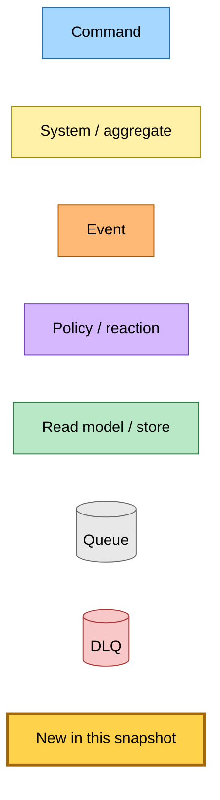
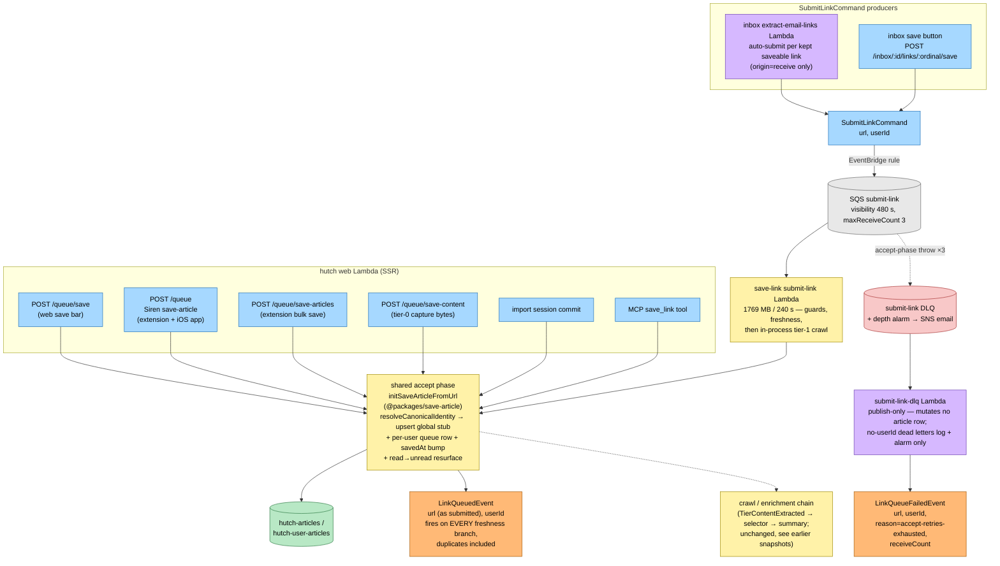
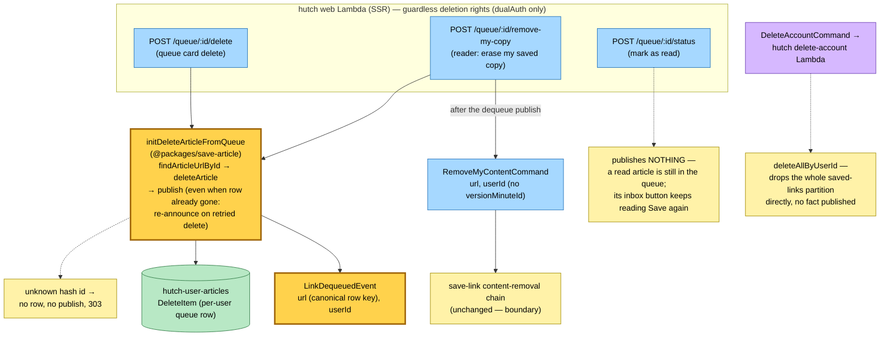
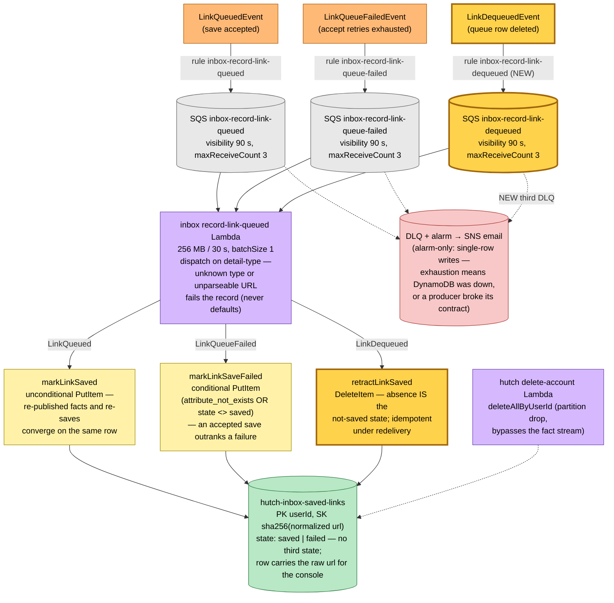
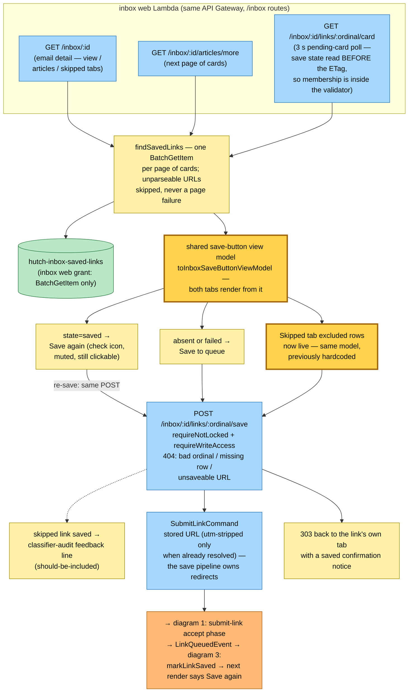

# Queue-Membership Facts — LinkDequeued Closes the Inbox Read-Model Loop — Event Storming

**Base commit:** `759068f8` &nbsp;•&nbsp; **Commit date:** 2026-08-03 &nbsp;•&nbsp; **Generated:** 2026-08-03 &nbsp;•&nbsp; **Branch:** `main`
**Subject:** `feat: bind inbox save buttons to live queue membership`

Until this commit the inbox's saved-link read model was **append-only**: a link once accepted into the reader's queue read "Saved" forever, even after the reader deleted the article, and the Skipped tab's rows hardcoded "Save to queue" and never changed state at all. This snapshot documents the fact that ends a row's claim — and the complete current state of all three queue-membership flows that share one subscriber:

- **`LinkDequeuedEvent { url, userId }` — a new irreversible fact, the inverse of `LinkQueuedEvent`.** Published by a new `initDeleteArticleFromQueue` orchestrator in `@packages/save-article`, which both hutch delete surfaces (`POST /queue/:id/delete` and `POST /queue/:id/remove-my-copy`) now route through: resolve the row's URL by reader hash id, delete the per-user queue row, then announce the deletion. The fact is published **even when the row was already gone** — the row may have been deleted by an earlier attempt whose publish failed after the delete committed, and the retry of that request is the only chance to re-announce it. The consumer retracts idempotently, so a duplicate fact is harmless while a suppressed one leaves the link reading as saved for good.
- **`url` is the deleted row's own key: the canonical URL after alias resolution** — not the URL a save was submitted with (which is what `LinkQueuedEvent` carries). The two differ only for a save of an adopted terminal URL; accepted rather than closed with a second key, because no such stale row has been observed (Evidence Over Speculation).
- **Two deliberate non-publishers.** Marking an article read publishes nothing — a read article is still in the queue, so its inbox button keeps reading "Save again". Account deletion publishes nothing either: the hutch delete-account Lambda calls the store's `deleteAllByUserId` and drops the whole partition directly.
- **The subscriber becomes a dispatcher.** The existing inbox `record-link-queued` Lambda now routes on the envelope's `detail-type` across an explicit three-entry table: `LinkQueued` → unconditional upsert, `LinkQueueFailed` → conditional put (an accepted save outranks a failure), `LinkDequeued` → **delete the row**, restoring the absence that means "not saved" rather than recording a third state. A detail-type outside the table fails the record to the DLQ rather than defaulting — defaulting is how a deletion would be recorded as a save.
- **A third SQS queue + DLQ (`inbox-record-link-dequeued`)** feeds the same Lambda, because `eventBus.subscribe` provisions one queue policy per call — one rule per queue, all converging on one handler. The rule name is explicit for the same reason every inbox rule's is: EventBridge `PutRule` is an upsert, and a colliding default name would silently retarget someone else's rule.
- **Both email-detail tabs now share one save-button view model.** In the queue → "Save again" (check icon, muted style, still clickable — re-saving is the same POST, landing on the same upsert every re-save lands on: `savedAt` bump + read→unread resurface). Absent or failed → "Save to queue". The Skipped tab's excluded rows render from the same model, so saving a skipped link — which doubles as the reader's verdict that the classifier was wrong, logged as classifier-audit feedback — now flips its button like any kept card's. The per-card poll fragment reads the save state **before** computing its ETag, so a card whose membership changed after the reader's last poll can never revalidate stale.
- **The IAM boundary holds in the same one direction as before.** No inbox role reads or writes the queue tables — the new grant on the inbox subscriber is `DeleteItem` on the inbox's own read-model table. Membership state still arrives as save-side facts, never as a cross-boundary read.

---

## Legend

New/changed pieces carry the amber **new** highlight (`fill:#ffd24c`, `stroke:#a0660b`, 3 px stroke); everything else is pre-existing infrastructure shown for context.

Mermaid source

---

## 1. The accept-terminal fact and its failure twin (unchanged, shown complete)

Every authenticated save surface routes through the shared accept phase `initSaveArticleFromUrl` in `@packages/save-article`: resolve canonical identity, upsert the global article row and the per-user queue row, resurface a read article as unread — then publish `LinkQueuedEvent` with the URL **as submitted**, captured before canonical resolution. It fires on every freshness branch, including the skip that writes the per-user row and publishes nothing else, so a duplicate save announces itself exactly like a first save.

The failure twin comes off the `submit-link` DLQ: an accept-phase throw (DynamoDB/EventBridge blip) retries up to 3 receives, and exhaustion hands the dead letter to the `submit-link-dlq` handler, which publishes `LinkQueueFailedEvent` and mutates no article row — the row either does not exist or belongs to another saver's in-flight crawl. The fact means "the command gave up", **not** "nothing was queued": the accept phase writes the queue row first and several calls after it can still throw, which is why the read model lets an accepted save outrank a failure.

Mermaid source

---

## 2. NEW — the retraction fact: deleting a queue row announces itself

`initDeleteArticleFromQueue` is the delete-side counterpart of the shared accept phase, and both hutch delete surfaces route through it. The URL is resolved **before** the delete (it is the row's canonical key — the thing being deleted); the publish happens **after** the delete commits, and unconditionally — even when `deleteArticle` reports the row was already gone, because that is exactly the retried-request case whose first publish may have failed.

`/remove-my-copy` additionally hands content erasure to save-link via the pre-existing `RemoveMyContentCommand` (tier-0 capture + authored snapshots + re-select / re-crawl / purge — that chain is unchanged and documented in the removal snapshot's lineage; here it is a boundary).

Mermaid source

---

## 3. One subscriber, three queues — the read model stays a pure function of the facts

All three facts cross the platform-stack EventBridge bus and land on the **same** inbox Lambda through three separate SQS queues — one rule per queue because each `eventBus.subscribe` provisions the queue's single physical policy. The handler dispatches on the envelope's `detail-type`; the write each fact maps to encodes the model's precedence rules. Every DLQ is alarm-only by design: the writes are single-row puts/deletes, so exhausting three receives means the datastore itself was unavailable — and a malformed URL or an unrouted detail-type is a producer contract violation worth paging on, never a record to skip or default.

Mermaid source

---

## 4. The read side — both tabs render live membership, and the loop closes

The inbox web Lambda resolves a whole page of buttons in one `BatchGetItem` (its only grant on the table). Both email-detail tabs — the Articles tab's link cards **and** the Skipped tab's excluded rows — now derive their button from the same shared view model, so the four states collapse to two renderings: `saved` → "Save again", anything else → "Save to queue". A URL that cannot be normalized is skipped rather than failing the page, and the sort key is a SHA-256 of the normalized URL because ESP wrapper URLs routinely exceed DynamoDB's 1024-byte key cap — stored raw, one such link would 500 the whole tab.

Clicking either button posts the same save route, which publishes `SubmitLinkCommand` — and the loop closes through diagram 1's accept phase back into diagram 3's read model. Saving a *skipped* link additionally logs the reader's implicit classifier verdict.

Mermaid source

---

## Command → System → Event(s) reference table

| Command / trigger | System (handler) | Event(s) emitted | Next command(s) triggered |
|---|---|---|---|
| `POST /queue/save` (save bar), `POST /queue` (Siren save-article, extension + iOS), `POST /queue/save-articles` (bulk), `POST /queue/save-content` (tier-0 bytes), import commit, MCP `save_link` | hutch web Lambda → shared accept phase (`initSaveArticleFromUrl`) | **`LinkQueuedEvent`** (every branch, duplicates included); `LinkSaved` on new/refreshed content (enrichment chain, unchanged) | — (facts only; crawl chain continues out of band) |
| `SubmitLinkCommand` (from inbox extract-email-links auto-submit, or the inbox save button) | save-link `submit-link` Lambda (SQS, visibility 480 s, maxReceiveCount 3) → same shared accept phase, then in-process tier-1 crawl | **`LinkQueuedEvent`**; `TierContentExtractedEvent` / `SimpleCrawlUnsupportedEvent` (enrichment, unchanged) | selector → summary chain (unchanged) |
| `SubmitLinkCommand` dead-letter (accept retries exhausted) | `submit-link-dlq` Lambda (publish-only; no row mutation) | **`LinkQueueFailedEvent`** `{url, userId, reason, receiveCount}` (only when the command carried a `userId`) | — (DLQ depth alarm stays wired alongside) |
| **`POST /queue/:id/delete`** | hutch web Lambda → **`initDeleteArticleFromQueue`** (NEW): resolve URL → delete per-user row → publish, even when the row was already gone | **`LinkDequeuedEvent`** `{url (canonical row key), userId}` (NEW) | — |
| **`POST /queue/:id/remove-my-copy`** | same as `/delete`, then hand content erasure to save-link | **`LinkDequeuedEvent`** (NEW), then `RemoveMyContentCommand` | save-link content-removal chain (unchanged, boundary) |
| `POST /queue/:id/status` (mark as read) | hutch web Lambda | — deliberately none (a read article is still in the queue) | — |
| `DeleteAccountCommand` | hutch delete-account Lambda | — none for this model; calls `deleteAllByUserId` (drops the saved-links partition directly) | — |
| `LinkQueuedEvent` | inbox `record-link-queued` Lambda via SQS `inbox-record-link-queued` (rule `inbox-record-link-queued`) | — (store-only: unconditional `PutItem` `state=saved`) | — |
| `LinkQueueFailedEvent` | same Lambda via SQS `inbox-record-link-queue-failed` (rule `inbox-record-link-queue-failed`) | — (store-only: conditional `PutItem` `state=failed`; an accepted save outranks it) | — |
| **`LinkDequeuedEvent`** | same Lambda via **NEW** SQS `inbox-record-link-dequeued` + DLQ (rule `inbox-record-link-dequeued`) | — (store-only: **`DeleteItem`** — absence is the not-saved state) | — |
| `GET /inbox/:id` (+ panel fragments, `/articles/more`, per-card poll) | inbox web Lambda: `findSavedLinks` `BatchGetItem` → shared save-button view model (both tabs) | — (read only; save state sits inside the card poll's ETag) | reader click → `POST /inbox/:id/links/:ordinal/save` |
| `POST /inbox/:id/links/:ordinal/save` | inbox web Lambda (write gates; 404 for bad ordinal / missing row / unsaveable URL; skipped-link saves also log classifier feedback) | — (publishes a command, not a fact) | `SubmitLinkCommand` → loop back to the accept phase |

**Wire formats** (deployment contracts): `LinkQueuedEvent` = `hutch.save-article` / `LinkQueued`; `LinkQueueFailedEvent` = `hutch.save-link` / `LinkQueueFailed`; **`LinkDequeuedEvent` = `hutch.save-article` / `LinkDequeued` (NEW)**. All three ride the shared platform-stack EventBridge bus.
