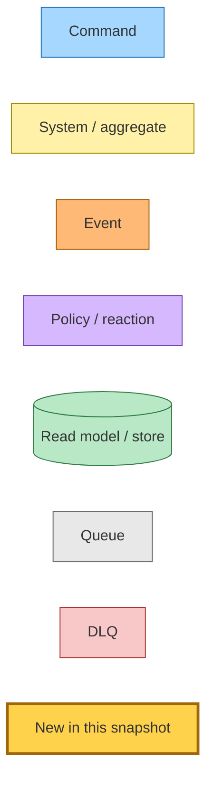
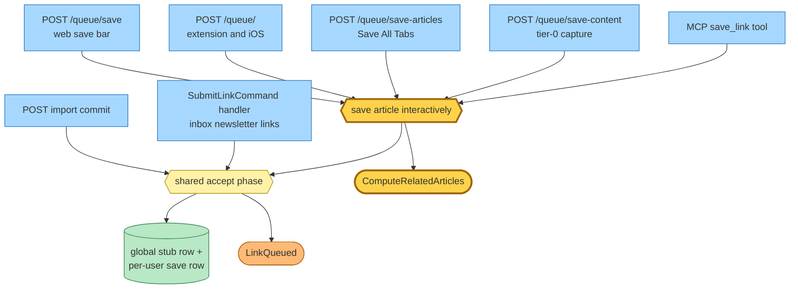
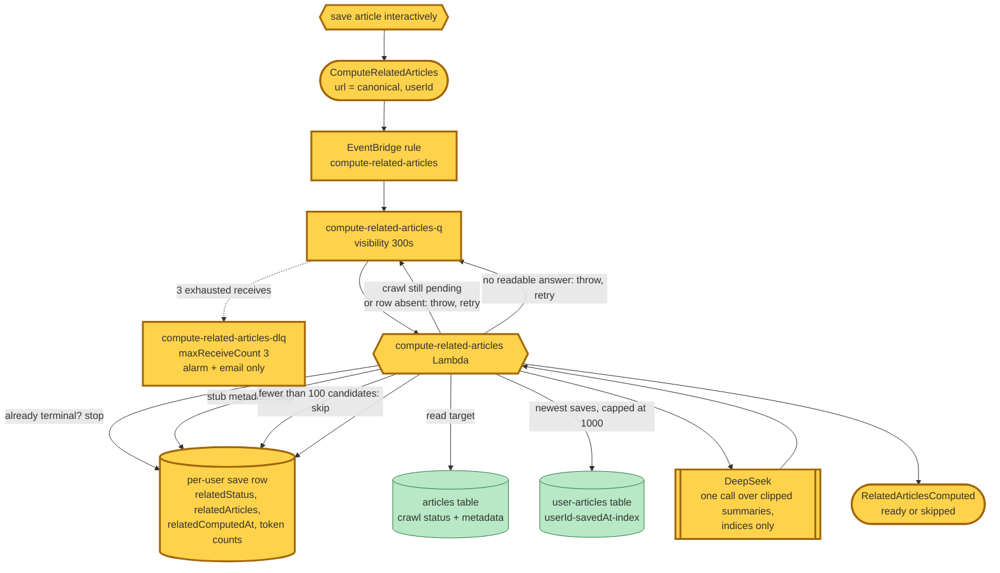
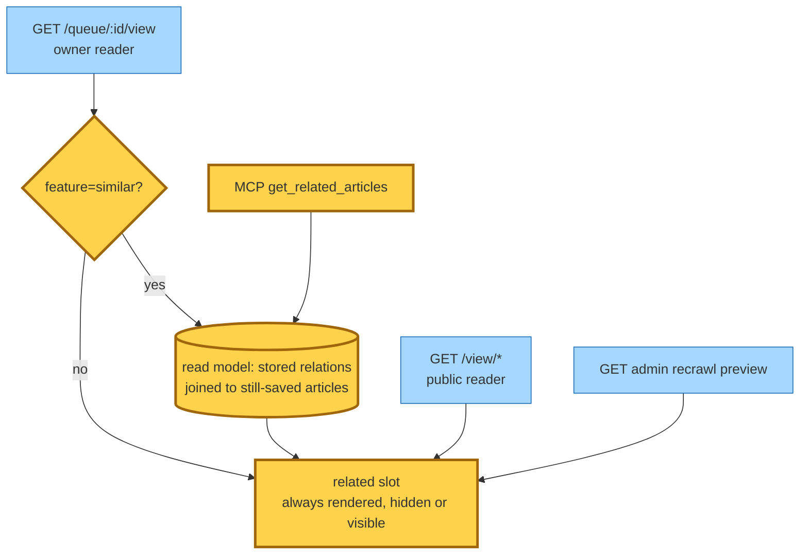

# Related saved articles — save-triggered resurfacing

Snapshot base commit `b1e7ece7` (2026-08-03, branch `main`). **The working tree was dirty when this snapshot was taken** — the whole feature is uncommitted on top of the base commit.

Entry point: every *interactive* save surface (the `/queue` save bar, the extension/iOS Siren save, Save All Tabs, tier-0 capture, and the MCP `save_link` tool).

## Legend

Nodes new in this snapshot are drawn with a thick amber border (`:::new`). Everything else already existed at the base commit.

Mermaid source

## Which saves ask for relations

The shared accept phase is unchanged. A decorator wraps it for the interactive surfaces only, so the bare accept phase — used by the import commit and by the unified save command's subscriber — publishes nothing new. The inbox path could not publish it in any case: it already handles a command, and command → command across a Lambda boundary is forbidden.

Mermaid source

## End-to-end flow

The command carries the **canonical** url the accept phase resolved to — the articles-table partition key and the per-user save row's sort key — unlike `LinkQueued`, which deliberately carries the url exactly as submitted.

Mermaid source

## Read side

The stored relations are per-user derived data, so they never reach a page rendering someone else's view. The owner reader is additionally gated on an opt-in querystring toggle; the MCP tool is not gated.

Mermaid source

## Command → System → Event(s) reference

| Command / Event | Handled by | Emits | Triggers next |
|---|---|---|---|
| **ComputeRelatedArticles** (new) — `hutch.save-article` / `ComputeRelatedArticles`, `{url, userId}` | `compute-related-articles` Lambda, fed by `compute-related-articles-q` off an EventBridge rule | `RelatedArticlesComputed` (`ready` or `skipped`) | nothing today |
| **RelatedArticlesComputed** (new) — `hutch.save-link` / `RelatedArticlesComputed`, `{url, userId, outcome, relatedCount, inputTokens, outputTokens}` | no subscriber | — | — |
| LinkQueued (unchanged) | inbox `record-link-queued` | — | — |

## Decisions worth recording

**One LLM call, indices only.** The model never sees or returns a url. It is given the saved article and a numbered list of the reader's earlier saves and answers with positions plus a one-line reason; positions outside the list, repeats, and over-long reasons are discarded server-side. Candidate titles and excerpts are untrusted scraped text, and the prompt says so.

**The worker waits rather than guesses.** A save writes a stub row (`Article from <hostname>`) before the crawl fills in real metadata. If the crawl is still pending — or the article row has not appeared yet — the record throws and SQS redelivers, so the model is never asked to judge a placeholder. If the crawl reached a terminal state without ever replacing the stub, the row is marked skipped instead, because no metadata will ever arrive.

**Alarm-only dead-letter, deliberately.** There is no DLQ consumer. An absent `relatedStatus` renders as the hidden slot, so there is no terminal row state to flip and nothing for the reader to see; the queue's DLQ alarm and its email subscription are the operator signal. This mirrors the existing `canonical-content-changed` consumer.

**Results freeze at first computation.** A re-save republishes the command, and the worker cache-hits on any terminal `relatedStatus`. Recomputing when the canonical content changes is deliberately not wired.

**Relations live on the per-user save row, not the shared article.** They are one reader's relations to their own earlier saves, so deleting the save deletes them with it, and no other reader's page can surface them. The read path re-checks that each stored relation is still saved and still has a crawled article behind it, so a since-deleted or purged item drops out rather than rendering a dead link.

**Two token counts are stored** alongside the result, mirroring the summary axis, so the per-article cost of the feature is measurable from the table.
