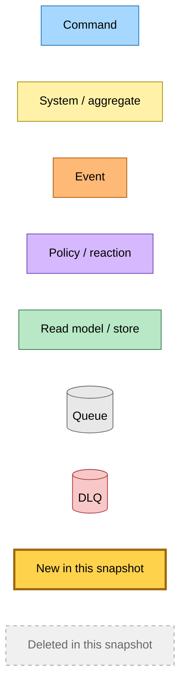
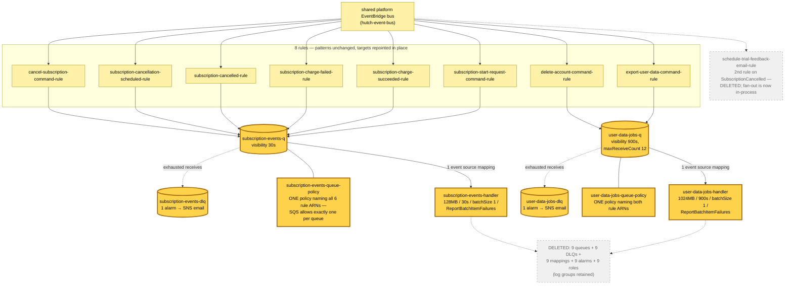
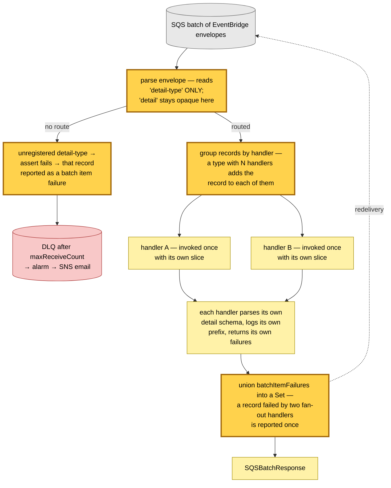
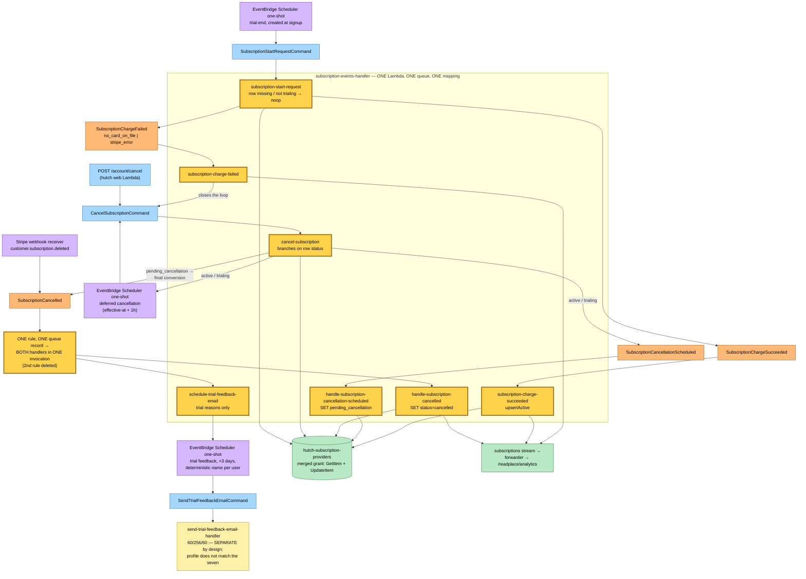
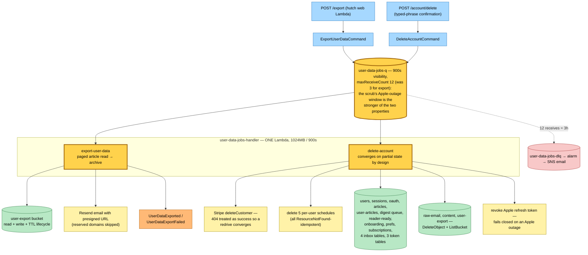

# Shared-Queue Handler Consolidation — One Lambda per Family, Routed by `detail-type` — Event Storming

**Base commit:** `cb3ec007` &nbsp;•&nbsp; **Commit date:** 2026-08-04 &nbsp;•&nbsp; **Generated:** 2026-08-04 &nbsp;•&nbsp; **Branch:** `main`
**Subject:** `refactor(hutch,@packages/hutch-infra-components): merge low-traffic handler families onto shared queues`

Nine SQS-backed Lambdas became two. **No command or event definition changed** — every `source`/`detailType` wire value, every schema, and every rule's event pattern is byte-identical to the previous snapshot. What changed is the *topology underneath* them: which queue a rule delivers to, and which process consumes it.

The forcing measurement: an **event source mapping, not a message, is the unit of SQS cost.** An idle queue produced exactly 360 empty receives per hour over 30 consecutive hours (min 359, max 360) — `2 pollers × 60s / 20s long poll`, AWS's documented idle floor — and that rate held to within 1.5% across a 539× swing in daily volume. Production moved ~37,600 messages in 30 days and spent ~15.4M SQS requests finding them: **410 polling calls per message delivered.** A queue + handler pair therefore costs ≈ $5.14/yr across both accounts *before it carries anything*, and the subscription/billing family — eight queues — moved 141 messages between them in 30 days.

- **Two families merged, chosen by runtime profile, not by intuition.** `subscription-events` (30 s visibility / 128 MB / 30 s) takes seven handlers; `user-data-jobs` (900 s / 1024 MB / 900 s) takes two. `send-trial-feedback-email` is **deliberately excluded** at 60/256/60 — folding it in would either halve its timeout or double the memory of the other seven. The digest pair is left alone: its producer/consumer self-loop and dedicated scheduler target are a different *shape*, not merely a different profile.
- **Routing is on `detail-type`, a discriminator the envelope already carries.** Every merged queue is EventBridge-fed, so each record's body is a full EventBridge envelope. `initHandleByDetailType` groups a batch's records by their registered handlers, invokes each handler once with its slice, and unions the `batchItemFailures`. A `detail-type` outside the table **fails that record to the DLQ** rather than defaulting — defaulting is how an unrouted billing event would vanish silently.
- **Only the composition roots merged.** Every domain handler under `src/runtime/<name>/<name>-handler.ts` and its tests are untouched: each still parses its own envelope, owns its own error handling, and returns its own partial-batch failures. The nine deleted files were `*.main.ts` wiring, nothing else.
- **`SubscriptionCancelled` had two subscribers, so its second rule is deleted** and the fan-out now happens inside one invocation. That couples their retries — a failure in the feedback scheduler re-runs the cancel marker. Both were verified idempotent before merging: `markCancelledByUserId` is an unconditional `SET status = cancelled` guarded only by `attribute_exists(userId)`, and the feedback scheduler deletes-then-creates a deterministic per-user schedule.
- **`HutchEventBus.subscribeAll` exists because SQS permits exactly one policy per queue.** N rules onto one queue cannot each mint their own `QueuePolicy`, so the new method creates one rule + one target per event and a *single* combined policy naming every rule ARN. The one-rule case keeps a **scalar** `aws:SourceArn` rather than a one-element array: IAM treats them identically, but the rendered JSON differs, and the scalar form is what keeps this a no-op for the ~40 existing subscriptions elsewhere in the fleet.
- **Observability collapses with the fleet.** Six `LAMBDA_NAMES` entries became one; `LOG_GROUPS`, the dashboard's origin filter, and the forwarder's source list all derive from it, so the collapse propagates atomically and the `satisfies` constraint makes a partial edit a compile error. Handler attribution survives in each line's message prefix (`[cancel-subscription]`, `[SubscriptionCancelled]`, …) rather than in the log-group name.
- **Two accepted trade-offs, both recorded rather than hidden.** The merged roles hold the *union* of their group's permissions (`user-data-jobs` additionally gains `events:PutEvents`, which `delete-account` lacked and `export-user-data` had). And `export-user-data` inherits `dlqMaxReceiveCount: 12` (was 3) — dropping to 3 would regress `delete-account`'s deliberate ride-out-an-Apple-outage window, the stronger of the two properties.

---

## Legend

New/changed pieces carry the amber **new** highlight (`fill:#ffd24c`, `stroke:#a0660b`, 3 px stroke); everything else is pre-existing infrastructure shown for context. Deleted infrastructure is drawn with a dashed stroke where it aids the comparison.

Mermaid source

---

## 1. Topology — what the merge actually moved

Rules and their event patterns are unchanged and **update in place**; only each target's queue ARN moves. The one structural deletion is the duplicate `SubscriptionCancelled` rule, whose fan-out is now in-process.

Mermaid source

---

## 2. The router — one process, many handlers

`initHandleByDetailType` is the only new logic in the change. It never parses a `detail`; it reads `detail-type` alone and hands whole records onward, so each domain handler keeps sole ownership of its own schema.

Mermaid source

---

## 3. Subscription lifecycle — complete current state

Every arrow below already existed; what changed is that all six boxes now run **inside one Lambda**. Producers are unchanged: the hutch web Lambda, the Stripe webhook receiver, EventBridge Scheduler one-shots, and the family's own handlers publishing back onto the bus.

Mermaid source

---

## 4. User data jobs — the two long-running data-rights commands

Both were already EventBridge-fed commands with an identical 900/1024/900 profile. `remove-my-content-command` is **not** here: it lives in `projects/save-link`, and merging across independently deployable Pulumi stacks would couple their release cadence.

Mermaid source

---

## Command → System → Event(s) reference table

No wire value changed. The **System** column is what this snapshot re-writes.

| Command / trigger | System (handler) | Event(s) emitted | Next command(s) triggered |
|---|---|---|---|
| `POST /account/cancel`; `subscription-charge-failed`; deferred-cancellation Scheduler one-shot | **`subscription-events` Lambda** (was `cancel-subscription`) — branches on row status: `active` → Stripe `cancel_at_period_end` + deferred schedule; `trialing` → delete trial-end schedule + deferred schedule; `pending_cancellation` → final conversion; `cancelled` → noop; **missing row → warn + noop** | `SubscriptionCancellationScheduled` (active/trialing) or `SubscriptionCancelled` (pending_cancellation) | — |
| `SubscriptionCancellationScheduled` | **`subscription-events` Lambda** (was `handle-subscription-cancellation-scheduled`) | — (store-only: `status='pending_cancellation'` + `cancellationEffectiveAt`) | — |
| `SubscriptionCancelled` — **one rule, two handlers, one invocation** | **`subscription-events` Lambda** (was two Lambdas on two queues): `handle-subscription-cancelled` marks the row cancelled and emits the `cancelled` analytics line; `schedule-trial-feedback-email` creates the +3-day one-shot for trial reasons only, non-trial → noop | — (store + scheduler writes; analytics stream) | `SendTrialFeedbackEmailCommand`, via the one-shot |
| `SubscriptionStartRequestCommand` — trial-end Scheduler one-shot | **`subscription-events` Lambda** (was `subscription-start-request`) — row missing or not `trialing` → noop; `trialing` + `customerId` → Stripe `subscriptions.create`; `trialing` without → immediate failure | `SubscriptionChargeSucceeded` or `SubscriptionChargeFailed` | — |
| `SubscriptionChargeSucceeded` | **`subscription-events` Lambda** (was `subscription-charge-succeeded`) | — (store-only: `upsertActive`; analytics stream) | — |
| `SubscriptionChargeFailed` | **`subscription-events` Lambda** (was `subscription-charge-failed`) | — (analytics stream) | `CancelSubscriptionCommand` — closes the loop through the same queue |
| `SendTrialFeedbackEmailCommand` — Scheduler one-shots + Stripe `invoice.payment_failed` | `send-trial-feedback-email` Lambda — **unchanged, still its own queue and mapping** (60/256/60 does not match the family) | — | — |
| `DeleteAccountCommand` | **`user-data-jobs` Lambda** (was `delete-account`) | — | `RemoveMyContentCommand` is *not* involved; content erasure for the queue path lives in save-link |
| `ExportUserDataCommand` | **`user-data-jobs` Lambda** (was `export-user-data`) | `UserDataExported` / `UserDataExportFailed` | — |
| Any record whose `detail-type` is not in the route table | **`initHandleByDetailType`** — `assert` fails, record reported as a batch item failure | — | → DLQ → alarm → SNS email |

**Wire formats** (deployment contracts, all unchanged): `hutch.subscriptions` / `CancelSubscriptionCommand`, `SubscriptionCancellationScheduled`, `SubscriptionCancelled`, `SubscriptionChargeSucceeded`, `SubscriptionChargeFailed`, `SubscriptionStartRequestCommand`, `SendTrialFeedbackEmailCommand`; `hutch.api` / `DeleteAccountCommand`, `ExportUserDataCommand`. All ride the shared platform-stack EventBridge bus.

---

## Fleet effect

| | Before | After |
|---|---:|---:|
| Event source mappings (this change's families) | 9 | 2 |
| DLQ alarms + SNS topics + email subscriptions | 9 | 2 |
| Main queues + DLQs | 18 | 4 |
| EventBridge rules | 9 | 8 |
| Account-wide mappings (staging, measured) | 62 | 55 |

Verified on staging by a targeted apply before landing: all eight `detail-type`s processed on the merged Lambdas, the `SubscriptionCancelled` fan-out ran both handlers in a single invocation, no DLQ arrivals, no traffic reaching the old Lambdas — then reverted, leaving the stack byte-identical.
