# Authored-Content Removal — One Scope, State-Derived Repair — Event Storming

**Base commit:** `dfbaa030` &nbsp;•&nbsp; **Commit date:** 2026-08-05 &nbsp;•&nbsp; **Generated:** 2026-08-06 &nbsp;•&nbsp; **Branch:** `main`
**Subject:** `feat(inbox,@packages/web-shell): swap the Skipped tab's save button in place`

**Captured from a dirty working tree** — the removal-scope fold, the callerless `remove-my-copy` route deletion, the dead-CSS/dead-event cleanup, and the accompanying test rewrites are uncommitted on top of the base commit. Everything below describes the **complete current state of the working tree**, not a diff.

The content-erasure path used to have two scopes on one command. `RemoveMyContentCommand.versionMinuteId` was optional: present meant "delete this one authored crawl-version snapshot and stop"; absent meant "whole copy" — also delete the remover's tier-0 capture and its sidecar, then re-select / re-crawl / purge-and-tombstone. The whole-copy scope was published by exactly one route, `POST /queue/:id/remove-my-copy`, whose form had been deleted from the reader in commit `4b2af381`. It had no caller.

There is now **one scope**. `versionMinuteId` is required, `remove-my-copy` is gone, and the two behaviours that only the copy scope used to reach are re-derived:

- **Tier-0 erasure is a consequence, not a scope.** `resolveAuthoredContentKeys` adds the tier-0 source object *and* its metadata sidecar to the delete set when the named snapshot is the **last** one this user authored (`allAuthored.length === 1 && namedEntries.length === 1`) **and** the tier-0 sidecar's `authorUserId` credits them. Deleting your second-to-last version leaves the capture that still backs your remaining version; deleting your last one takes the capture with it. A missing or malformed sidecar reads as *unauthored* rather than throwing — throwing would redeliver the same command forever against the same broken bytes.
- **The tail is gated on stored state, not on the delivered scope.** The old `if (versionMinuteId !== undefined) continue` is replaced by a predicate over what the row actually holds: read the article's `contentSourceTier`; if it is absent, stop; list the tier sources still readable in S3; if the canonical's own tier is still among them, stop. Only when the canonical body is a copy of a source that **no longer exists** does the repair tail run. This is what makes the handler correct under at-least-once redelivery — on a second delivery the objects are already gone and *nothing* resolves, so a predicate derived from "what did I just erase" would silently skip the repair, while a predicate derived from stored state still fires.
- **The saver count flipped from "others" to "everyone".** The purge-vs-recrawl branch used to call `countOtherSaversByUrl` (which *excludes* the remover) because a whole-copy removal had already dropped the remover's queue row in hutch. A version delete does **not** touch any queue row, so excluding the remover would let the handler purge and tombstone an article the remover still holds — and `reader-permalink.ts` states the invariant directly: *"a tombstone can't coexist with an owning row"*, which is what keeps an owner's own reader from wrongly 404-ing. The new `countSaversByUrl` counts **all** savers on the `url-index` GSI. `count-other-savers-by-url.ts` is kept, unchanged, because the account-scrub handler still needs the exclusion (it counts *before* dropping the user's rows, so its own rows must not inflate the count).
- **Everything downstream is untouched.** `ReselectAfterRemovalEvent` and `RecrawlLinkInitiatedEvent` carry the same payloads to the same Lambdas; the purge + tombstone terminal is the same pair of store writes. What changed is *which deliveries reach them*.
- **`initEventBridgeRemoveMyContent` collapsed to a pass-through.** With no optional field left, the conditional spread that built the detail object is gone.

A second, unrelated withdrawal rides this working tree: **`UserDataExportFailedEvent` and its detail type are deleted**. It was declared in `@packages/hutch-infra-components` at the async-export design (snapshot `56099f1`, where the table already recorded it as *"declared, not emitted"*) and never gained a publisher or a subscriber — the export path's failure signal has always been the DLQ alarm + SNS email, not a fact on the bus. Section 5 shows the export flow as it stands now.

---

## Legend

Colour convention is the repo-wide one from `.architecture/index.md`. New/changed pieces carry the amber **new** highlight (`fill:#ffd24c`, `stroke:#a0660b`, 3 px stroke).

Five nodes are highlighted across the diagrams:

1. **`RemoveMyContentCommand`** — `versionMinuteId` is now required.
2. **The last-authored-snapshot rule** in `resolveAuthoredContentKeys` — the tier-0 capture + sidecar erasure it now gates.
3. **The repair predicate** — `contentSourceTier` present **and** its source gone.
4. **`countSaversByUrl`** — counts every saver, remover included.
5. **`UserDataExported`** in section 5 — highlighted as the **surviving** terminal of the export flow. The change there is a *removal*: `UserDataExportFailedEvent` no longer exists, and a current-state diagram cannot highlight a node that isn't there, so the highlight marks the node that now carries the whole terminal story and the caption states what was withdrawn.


Mermaid source

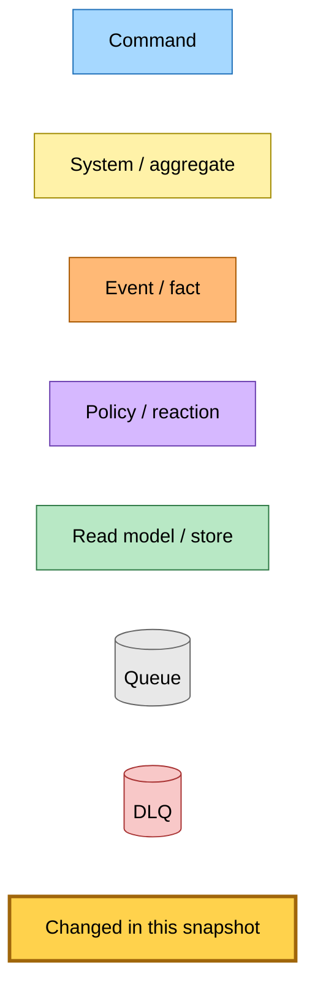

---

## 1. Entry — the reader's per-version delete control

The only producer of `RemoveMyContentCommand` is `POST /queue/:id/remove-my-version`, reached from a form inside the reader's crawl bookmark. The bookmark's removal controls are built **only** on the authenticated owner reader — the public `/view` render and the iOS chromeless branch never receive `crawlBookmarkRemoval`, so a viewer with no removal rights sees neither the `me` badge nor a delete form.

Which tabs get a form is decided by `findArticleCrawlVersions(url)` filtered to entries whose `authorUserId` equals the owner's id. Each such tab renders a `POST` form with the tab's minute id in a hidden `versionMinuteId` input.

The route sits behind `dualAuth` + `resolveVerificationStatus` and **deliberately carries no save gates** — no `requireNotLocked`, no `requireWriteAccess`, exactly like the sibling `/delete`. Removing content you authored is a deletion right, so a read-only or locked account must still be able to exercise it. The safety property is server-side, not gate-side: the worker only ever deletes objects whose crawl-version log entry or tier-0 sidecar credits *this* `userId`, so a forged article id or version id resolves to an empty key set.

The route **does not touch the queue row** and publishes no dequeue fact. That is the whole reason the worker's saver count had to change (section 3).


Mermaid source

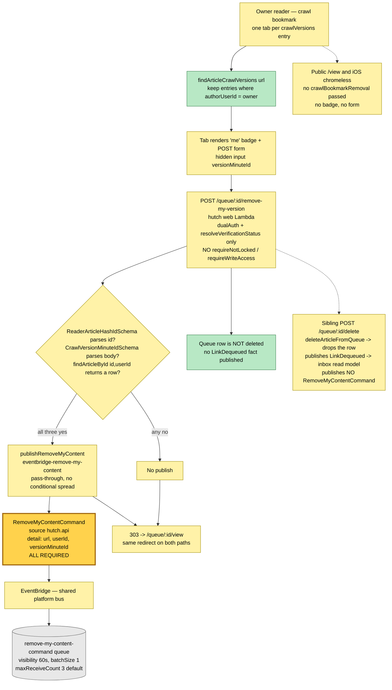

---

## 2. The worker's erase phase

`remove-my-content-command` Lambda: 256 MB, 60 s timeout, `batchSize: 1`. IAM is exactly what the three phases need — `GetItem`/`UpdateItem` on the articles table (indexes excluded), `Query` on the user-articles table **with** indexes for the `url-index` GSI, read + delete on the content bucket, and `events:PutEvents` on the bus.

Every step is idempotent against at-least-once redelivery: resolving against already-deleted objects yields no keys, `DeleteObjects` on absent keys is a no-op, and `pruneCrawlVersions` converges once the entries are gone (it is a compare-and-swap on the raw stored array — a concurrent writer fails the condition and SQS redelivers).

The schema tightening has one deployment consequence worth stating: a message already in flight **without** `versionMinuteId` no longer parses, so it fails its record, retries to `maxReceiveCount`, and lands on the DLQ (alarm + SNS email, no consumer). Given the only producer of that shape was a route with no UI, the in-flight population is expected to be empty.


Mermaid source

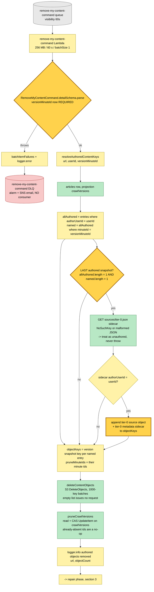

---

## 3. The repair phase — three branches from one predicate

The canonical body is a **copy** of whichever tier source won selection. An erasure is therefore only complete once that source is gone *and* the copy has been rebuilt from something else — or removed outright. The predicate that decides this reads stored state:

| Read | Meaning when it stops the tail |
|---|---|
| `findContentSourceTier(url)` → `undefined` | The row has no canonical tier at all — never promoted, already tombstoned (the tombstone strips `contentSourceTier`), or a legacy row. Nothing to repair. |
| `listAvailableTierSources(url)` still contains that tier | The canonical body is still backed by a live source. The erasure removed a version snapshot only. Nothing to repair. |

Everything past those two guards is the repair tail, and it is exactly the tail the old whole-copy scope ran:

1. **Sources remain, but not the canonical's** → publish `ReselectAfterRemovalEvent`.
2. **No sources remain, but savers do** → publish `RecrawlLinkInitiatedEvent`. This is the branch whose count changed: `countSaversByUrl` pages the `url-index` GSI with `Select: COUNT` and counts **every** saver. Because a version delete leaves the remover's own queue row in place, the remover themselves is usually the reason this branch is taken.
3. **Nothing and nobody remains** → `purgeArticleContent` + `tombstoneArticle`, the terminal state.


Mermaid source

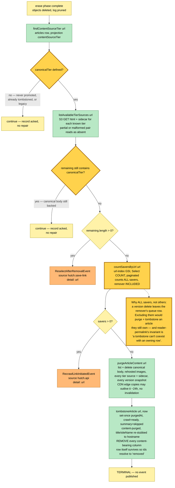

---

## 4. Downstream — where each repair branch terminates

Both repair events land on existing, unchanged infrastructure.

**Reselect branch.** `reselect-after-removal` Lambda (3008 MB — it holds full tier-source HTML in memory) normalises each record into the shape the ordinary selection core parses and delegates to `initSelectMostCompleteContentHandler`. Three deliberate normalisations: **no `userId`** (so a canonical flip cannot fire the saved!-notification variant at the remover), **`tier-1` as the nominal fresh tier** (a post-removal tie can only involve tier-1, and the tie-break needs a member of the candidate set), and **no `extractedAt`** (nothing was freshly extracted; the selector anchors any new snapshot to its own clock). Its queue rides the shared `save-link-failures` DLQ, whose router dispatches by source-queue name to a handler that flips the row to `crawlStatus=failed` via `markCrawlExhausted`.

`ReselectAfterRemovalEvent` is deliberately **not** a `TierContentExtractedEvent`: that event's `userId` means "who saved", and its consumer treats zero remaining sources as a retryable race — which mid-removal it genuinely is, since the publisher checked `remaining > 0` before emitting.

**Recrawl branch.** `recrawl-link-initiated` Lambda re-runs the simple tier-1 crawl against the public origin and writes a fresh tier-1 source, then emits `RecrawlContentExtractedEvent` into the recrawl selector. Its queue is `dlqMaxReceiveCount: 1` — a recrawl's tier-1 crawl hits the same deterministic origin block every time, so retries only keep the row sitting in "fetching". A non-HTML body defers to the comprehensive-crawl chain, which emits the same `RecrawlContentExtractedEvent` when it lands.

**Purge branch.** Terminal by construction: two store writes, no event. Pollers stop because both axes land on terminal non-error states; the failed-articles canary never surfaces the row; `reader-permalink` 404s the id directly because it resolves but carries `purgedAt`.


Mermaid source

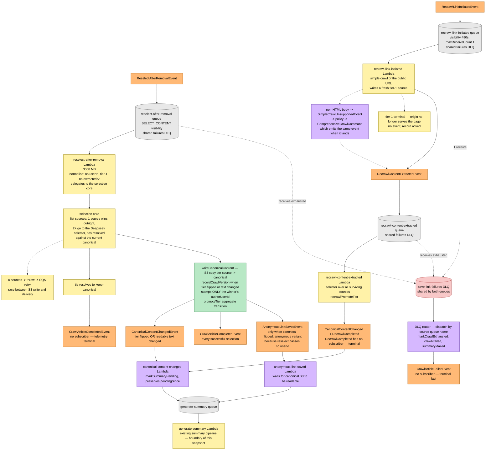

---

## 5. Export user data — the flow whose failure fact was withdrawn

`POST /export/start` looks the requester's email up, publishes `ExportUserDataCommand`, and 303s to a "preparing" page immediately so the API Gateway 30 s cap is never the bottleneck. The command shares the `user-data-jobs` queue and Lambda with `DeleteAccountCommand` (both 900 s / 1024 MB, `dlqMaxReceiveCount: 12`), routed inside the process by `detail-type`. The worker pages the user's articles 500 at a time, streams one JSON envelope to the private exports bucket under `exports/<userId>/`, presigns a `GetObject` URL for `EXPORT_DOWNLOAD_TTL_SECONDS` (7 days — the same constant the bucket lifecycle rule and the email copy read), emails the link via Resend, and publishes `UserDataExportedEvent`.

`UserDataExportedEvent` has **no subscriber**: it is a terminal fact on the bus. It is highlighted amber not because it changed, but because the change here was the *deletion* of its sibling. **`UserDataExportFailedEvent` (`hutch.export-user-data` / `UserDataExportFailed`, detail `{ userId, reason, receiveCount }`) is gone.** It was declared when the async export shipped and never emitted or subscribed — the earlier snapshot's own table recorded it as *"declared, not emitted"*. Failure has always been signalled by the queue's DLQ alarm and its SNS email, and that is unchanged.


Mermaid source

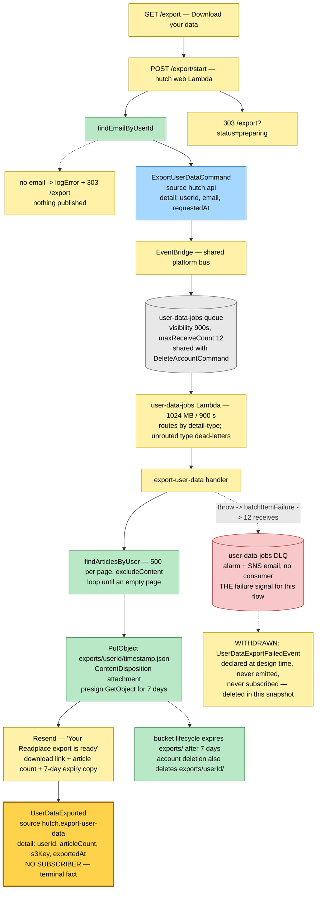

---

## Command → System → Event(s) reference table

| Command / trigger | System (handler) | Event(s) emitted | Next command(s) triggered |
|---|---|---|---|
| `POST /queue/:id/remove-my-version` — reader crawl-bookmark form, owner only | hutch web Lambda. `dualAuth` + `resolveVerificationStatus` only. Parses the hash id and `versionMinuteId`, resolves the article for this owner. Does **not** touch the queue row. Redirects 303 to the reader either way. | `RemoveMyContentCommand` `{ url, userId, versionMinuteId }` — **`versionMinuteId` now required** | — |
| `RemoveMyContentCommand` (`hutch.api` / `RemoveMyContentCommand`) | `remove-my-content-command` Lambda, 256 MB / 60 s, own queue at 60 s visibility. **Erase:** resolve the named snapshot iff this user authored it, plus their tier-0 source + sidecar when it is their last authored snapshot and the sidecar credits them; `DeleteObjects`; CAS-prune the log. **Repair predicate:** `contentSourceTier` absent → stop; canonical's tier still readable → stop. | `ReselectAfterRemovalEvent` (sources remain) **or** `RecrawlLinkInitiatedEvent` (no sources, savers remain) **or** none (purge + tombstone, or predicate stopped) | — |
| — repair branch 3 (no sources, **no savers**) | Same Lambda: `purgeArticleContent` (canonical body, rehosted images, all tier sources + sidecars, all version snapshots) then `tombstoneArticle` (set-once `purgedAt`, terminal non-error axes, content-bearing columns removed, metadata re-stubbed to the hostname) | — **terminal, store-only** | — |
| `ReselectAfterRemovalEvent` (`hutch.save-link` / `ReselectAfterRemoval`) | `reselect-after-removal` Lambda, 3008 MB. Normalises to the selection core's shape with **no `userId`**, nominal tier `tier-1`, no `extractedAt`; runs the Deepseek selector over surviving sources; writes canonical, records a crawl version when tier or text changed, `promoteTier` | `CanonicalContentChanged` (tier flipped or text changed), `CrawlArticleCompleted` (every successful selection), `AnonymousLinkSaved` (only when the canonical flipped — anonymous because no `userId` was passed) | `GenerateSummaryCommand` via the `canonical-content-changed` and `anonymous-link-saved` Lambdas |
| `RecrawlLinkInitiatedEvent` (`hutch.api` / `RecrawlLinkInitiated`) | `recrawl-link-initiated` Lambda. Simple crawl of the public URL, writes a fresh tier-1 source. Non-HTML defers to the comprehensive chain; a terminal origin failure publishes nothing | `RecrawlContentExtracted` (or, when deferred, the comprehensive Lambda emits it) | — |
| `RecrawlContentExtractedEvent` | `recrawl-content-extracted` Lambda — selector over all surviving sources, `recrawlPromoteTier` | `CanonicalContentChanged`, `RecrawlCompleted` (**no subscriber** — terminal) | `GenerateSummaryCommand` via `canonical-content-changed` |
| `CanonicalContentChangedEvent` | `canonical-content-changed` Lambda — `markSummaryPending`, preserving an existing `pendingSince` | — | `GenerateSummaryCommand` |
| `CrawlArticleCompletedEvent`, `RecrawlCompletedEvent`, `CrawlArticleFailedEvent` | no subscriber | — | — (terminal telemetry facts) |
| Reselect / recrawl / recrawl-extracted retry exhaustion | shared `save-link-failures` DLQ → router dispatches by source-queue name → `markCrawlExhausted` (`crawl=failed`, `summary=failed`) | `CrawlArticleFailed` | — |
| `RemoveMyContentCommand` retry exhaustion | its own DLQ — **alarm + SNS email, no consumer** | — | — |
| `POST /queue/:id/delete` (sibling, for contrast) | hutch web Lambda → `deleteArticleFromQueue`: resolve the canonical URL, drop the per-user row, publish the dequeue fact even when the row was already gone | `LinkDequeued` | — (inbox saved-link read model deletes its row) |
| `POST /export/start` | hutch web Lambda — `findEmailByUserId`, publish, 303 to the preparing page | `ExportUserDataCommand` `{ userId, email, requestedAt }` | — |
| `ExportUserDataCommand` (`hutch.api` / `ExportUserDataCommand`) | `user-data-jobs` Lambda, 1024 MB / 900 s, shared queue routed by `detail-type`. Pages articles, uploads the JSON envelope, presigns a 7-day URL, emails via Resend | `UserDataExported` (**no subscriber** — terminal fact). **`UserDataExportFailed` no longer exists** — the DLQ alarm is the failure signal | — |

**Wire formats** (deployment contracts): `hutch.api` / `RemoveMyContentCommand` — **narrowed**, `versionMinuteId` changed from optional to required; `hutch.save-link` / `ReselectAfterRemoval`; `hutch.api` / `RecrawlLinkInitiated`; `hutch.save-link` / `RecrawlContentExtracted`, `CanonicalContentChanged`, `CrawlArticleCompleted`, `RecrawlCompleted`, `CrawlArticleFailed`, `AnonymousLinkSaved`; `hutch.api` / `ExportUserDataCommand`; `hutch.export-user-data` / `UserDataExported`. **Deleted:** `hutch.export-user-data` / `UserDataExportFailed`. All ride the shared platform-stack EventBridge bus.

---

## Known gaps — accepted and on the record

**1. A tier-0 capture that lost selection is never attributed, so it can never be erased through this flow.**
`recordCrawlVersion` stamps only the **winning** source's `authorUserId` onto the `crawlVersions` log entry. If a user's extension capture (tier-0) loses the selector's comparison to the crawler's tier-1 fetch, no log entry ever credits them. The reader's delete control is built from exactly that log (`findArticleCrawlVersions` filtered to `authorUserId === owner`), so that population gets **no delete control at all**, and the worker's `resolveAuthoredContentKeys` can never reach its tier-0 branch for them — the branch is gated on there being a named authored snapshot in the first place.

This is **pre-existing and unchanged by this snapshot**: the deleted `remove-my-copy` route's form was gated on the same authored-versions condition, so a losing capture never had a control under the old two-scope design either. The real fix is upstream — attribute the capture at capture time rather than at selection time — and is deliberately not attempted here.

**2. On the recrawl branch, the canonical body derived from the erased capture survives until a later successful crawl.**
When the repair tail takes branch 2, the canonical S3 object is still the copy made from the now-deleted tier-0 source. `RecrawlLinkInitiatedEvent` is published and the recrawl Lambda fetches the public origin — but if that fetch fails (origin block, 404, non-HTML deferral that also fails), no new tier source is written, the recrawl selector never runs, and the stale canonical body stays readable until some later crawl succeeds. The row does not silently look healthy: an exhausted recrawl flips it to `crawl=failed` via the shared DLQ router. But the bytes remain. Purging eagerly instead was rejected because the branch is taken precisely when savers — usually including the remover — still hold the URL, and purging would tombstone an article they own, violating the invariant `reader-permalink.ts` relies on.
