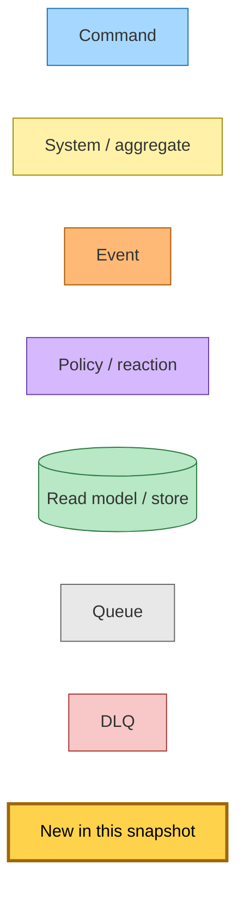
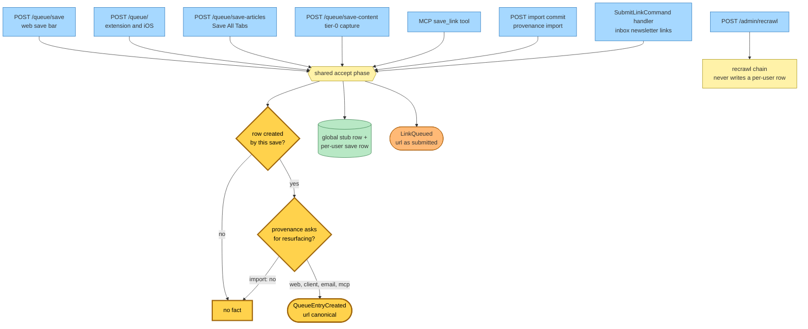
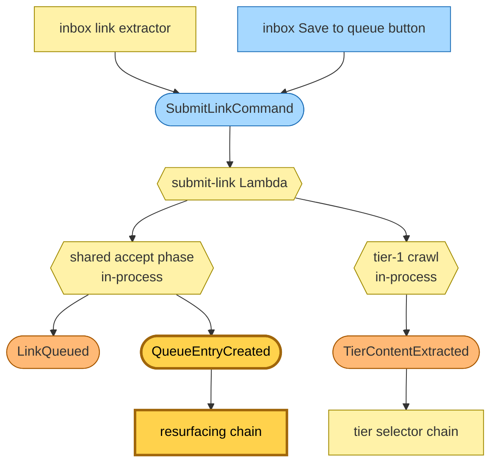
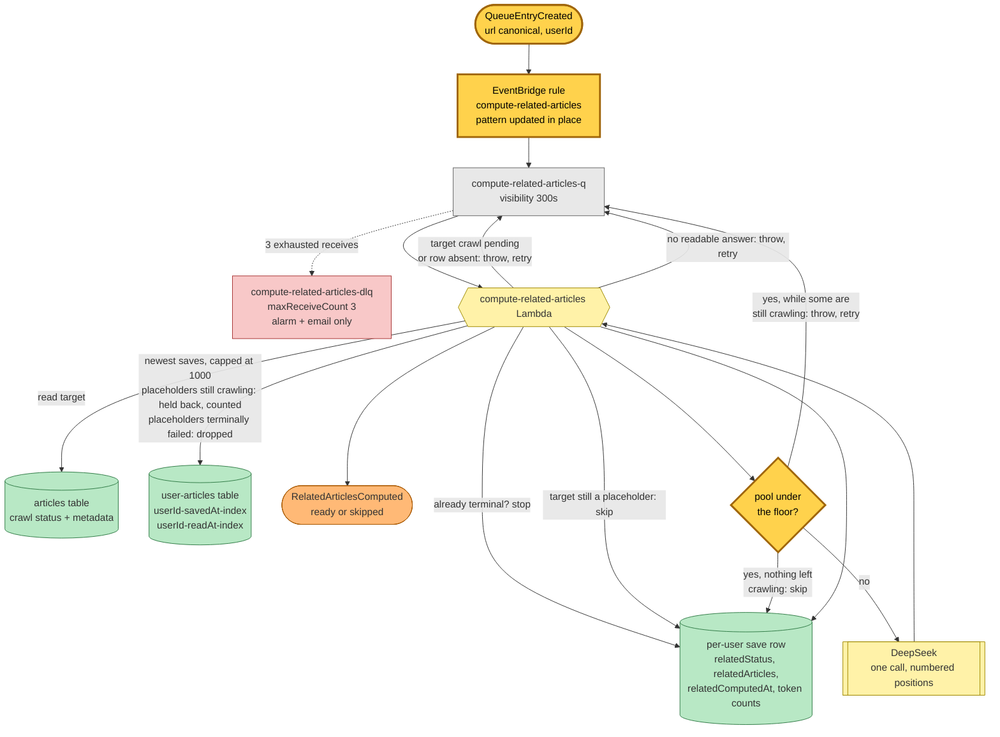
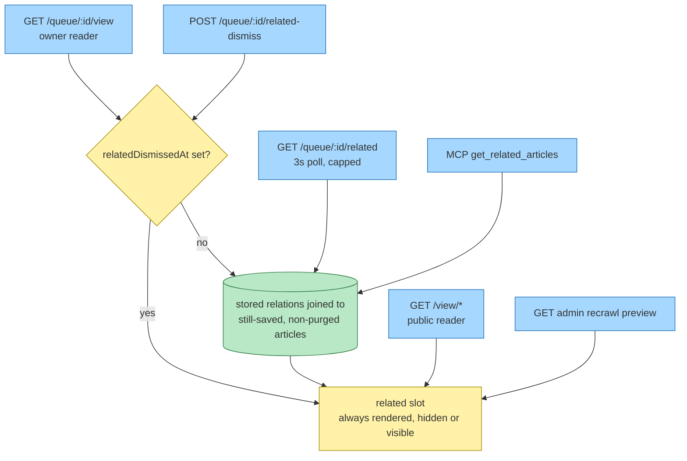

# Resurfacing earlier saves — the trigger becomes a fact — Event Storming

**Base commit:** `faf71f6b` &nbsp;•&nbsp; **Commit date:** 2026-08-13 &nbsp;•&nbsp; **Generated:** 2026-08-13 &nbsp;•&nbsp; **Branch:** `main`
**Subject:** `fix(save-link): derive the tier snapshot's crawl status from the canonical enum (#1063)`

**Captured from a dirty working tree** — the whole change is uncommitted on top of the base commit. Everything below describes the **complete current state of the working tree**, not a diff.

Entry point: every save surface that writes a per-user queue row — the `/queue` save bar, the extension and iOS Siren action, Save All Tabs, tier-0 capture, the assistant's save tool, the import commit, and the newsletter-link subscriber.

Supersedes the `b1e7ece7` snapshot on three points: its entry-point line ("every *interactive* save surface"), its "Which saves ask for relations" section and the decorator node in it, and its statement that the newsletter path could not participate because command → command across a Lambda boundary is forbidden. That prohibition still holds — it is precisely why the request stops being a command. The rest of that snapshot's decisions survive unchanged.

## Legend

Nodes new in this snapshot are drawn with a thick amber border (`:::new`). Everything else already existed at the base commit.

Mermaid source

## Which saves ask for relations

The decorator that wrapped only the interactive compositions is gone. The one shared accept phase every save surface routes through now publishes the fact itself, so no call site can opt out and no new surface can forget. Two gates sit on the publish, both inside the accept phase: the save must have **created** the reader's row, and the save's **provenance** must be one that asks for resurfacing. The provenance table is exhaustive over the provenance union, so adding a save surface is a compile error until someone decides.

The import commit is the one provenance that declines. It is not a semantic distinction — an import creates queue rows like any other save — but a cost one: a commit carries up to two thousand links in a single request and each resurfacing is its own model call over the reader's whole library.

Recrawl reaches none of this by construction: it never calls the accept phase and never writes a per-user row.

Mermaid source

## The newsletter path

This is the gap the change closes. The newsletter subscriber runs inside a command handler, so it may publish facts but may not dispatch a command across a Lambda boundary. Modelling the request as `QueueEntryCreated` — a fact about the reader's queue rather than an instruction to a worker — is what lets it participate at all. It publishes the fact through the same event publisher it already uses for the accepted-save fact and the tier fact; the Lambda already held bus publish rights, so no infrastructure changed on this side.

Mermaid source

## End-to-end flow

The worker is unchanged in shape: it still cache-hits a terminal status, still waits rather than guesses while the target's crawl metadata is landing, still makes exactly one model call over numbered positions, and still writes terminal-once to the reader's own save row. Its trigger changed, and its notion of "not ready" widened.

The widening is the second half of the change. A save writes a placeholder title before its crawl lands, and those placeholder rows were passing the candidate filter — they carry a title, a site name and an excerpt, all synthesised from the hostname. On a single interactive save that is a rounding error; on a newsletter batch the candidate query is newest-first, so the pool the model would be shown is dominated by placeholders, and the answer is written terminally. Candidates still holding a placeholder are now held back from the pool, and the ones whose crawl is still pending are counted as awaited; a placeholder whose crawl reached a terminal state is dropped uncounted, because no metadata will ever arrive for it and counting it would hold the pool in retry forever. A pool under the comparison floor while any held-back save is still crawling throws for redelivery instead of recording a permanent skip; once nothing is left crawling, the thin pool is recorded as skipped exactly as before.

Mermaid source

## Read side

Unchanged by this snapshot, and reproduced here because the snapshot describes complete current state. The stored relations are per-user derived data, so they never reach a page rendering someone else's view. The opt-in querystring toggle the previous snapshot drew no longer exists in the code; the owner reader's slot is gated only on the reader having dismissed it.

Mermaid source

## Command → System → Event(s) reference

| Command / Event | Handled by | Emits | Triggers next |
|---|---|---|---|
| **QueueEntryCreated** (new) — `hutch.save-article` / `QueueEntryCreated`, `{url, userId}`; `url` is canonical | `compute-related-articles` Lambda, fed by `compute-related-articles-q` off the same-named EventBridge rule | `RelatedArticlesComputed` (`ready` or `skipped`) | nothing today |
| ~~ComputeRelatedArticles~~ (removed) — was `hutch.save-article` / `ComputeRelatedArticles` | — | — | replaced by `QueueEntryCreated` |
| **RelatedArticlesComputed** (unchanged) — `hutch.save-link` / `RelatedArticlesComputed` | no subscriber | — | — |
| LinkQueued (unchanged) — `url` as submitted | inbox `record-link-queued` | — | — |
| SubmitLinkCommand (unchanged) | `submit-link` Lambda | `LinkQueued`, **`QueueEntryCreated`**, `TierContentExtracted` | tier selector chain, resurfacing chain |
| RecrawlLinkInitiated (unchanged) | `recrawl-link-initiated` Lambda | `RecrawlContentExtracted` | recrawl selector chain — never reaches resurfacing |

## Decisions worth recording

**The trigger is a fact, not a request.** The worker used to consume a command that only one publisher issued and only one consumer handled. Modelling the same moment as "a save added an article to a reader's queue" is what makes the newsletter path legal — a command handler may publish facts but may not dispatch a command across a Lambda boundary — and it leaves the moment available to a second consumer later without another publisher change.

**The fact carries the canonical url; its sibling carries the submitted one.** `LinkQueued` deliberately carries the url exactly as submitted, so a consumer keyed on what it submitted can match. `QueueEntryCreated` carries the url the accept phase resolved to, because that is the articles-table partition key and the per-user row's sort key. Publishing it from inside the accept phase, where the canonical url is already a local, makes reaching for the wrong one unrepresentable rather than merely tested.

**The rule name is pinned to the consumer, not the event.** The bus derives the rule, the target and both queue policies from one name. Letting it follow the renamed event would have replaced the queue's single policy, and a queue with no policy is a queue EventBridge cannot send to. Pinning it keeps the change to an in-place pattern update; the preview confirms one rule updating and nothing replaced.

**Both publisher and subscriber deploy in parallel, so the wire rename has a gap.** Whichever stack lands first, the other side's messages match no rule for the length of the window and those saves get no relations. That renders as the hidden slot — no error, no dead letter, no terminal row state — so the cost is bounded and self-correcting for every later save.

**Import declines on cost, and says so in data.** The provenance table is exhaustive over the provenance union rather than a negative check, so the decision is one entry per surface and a new surface cannot be added without making it. Turning import back on is a one-word edit.

**A placeholder is not a candidate.** The previous snapshot recorded that the worker waits rather than guesses so the model is never asked to judge a placeholder — but that only ever held for the target. Candidates were filtered on having a title, a site name and an excerpt, all three of which the placeholder synthesises from the hostname. Holding them back is the same rule applied one level out, and the thin-pool outcome had to become non-terminal with it: filtering alone would have traded a permanently wrong answer for a permanently empty one. The waiting is scoped by crawl state, mirroring the distinction the target check already draws: a placeholder whose crawl is still pending is awaited, one whose crawl reached a terminal state is dropped uncounted — a crawl that terminally failed leaves the placeholder in place forever, so awaiting it would turn one dead link into a permanent retry loop that dead-letters every future save of a small-library reader.

**The comparison floor stays terminal when it is genuinely unreachable.** A reader with fewer than fifty crawled saves still records a skip that is never recomputed. That is pre-existing, invisible — a skipped row and a pending row both render the hidden slot — and deliberately left alone here.
