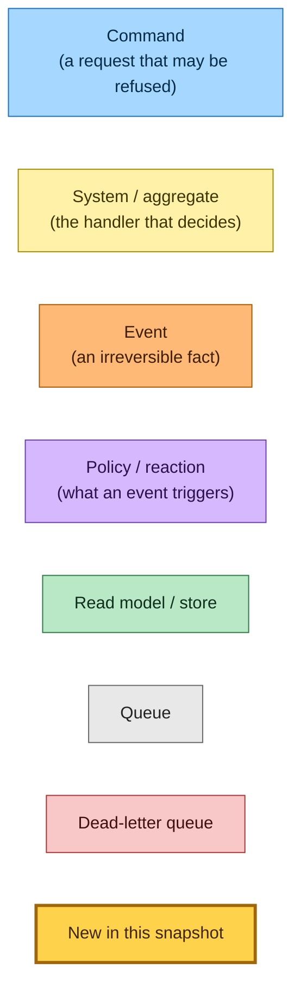
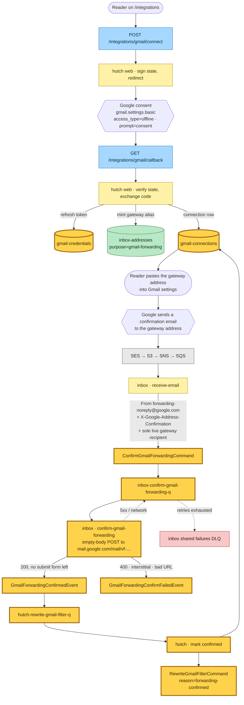
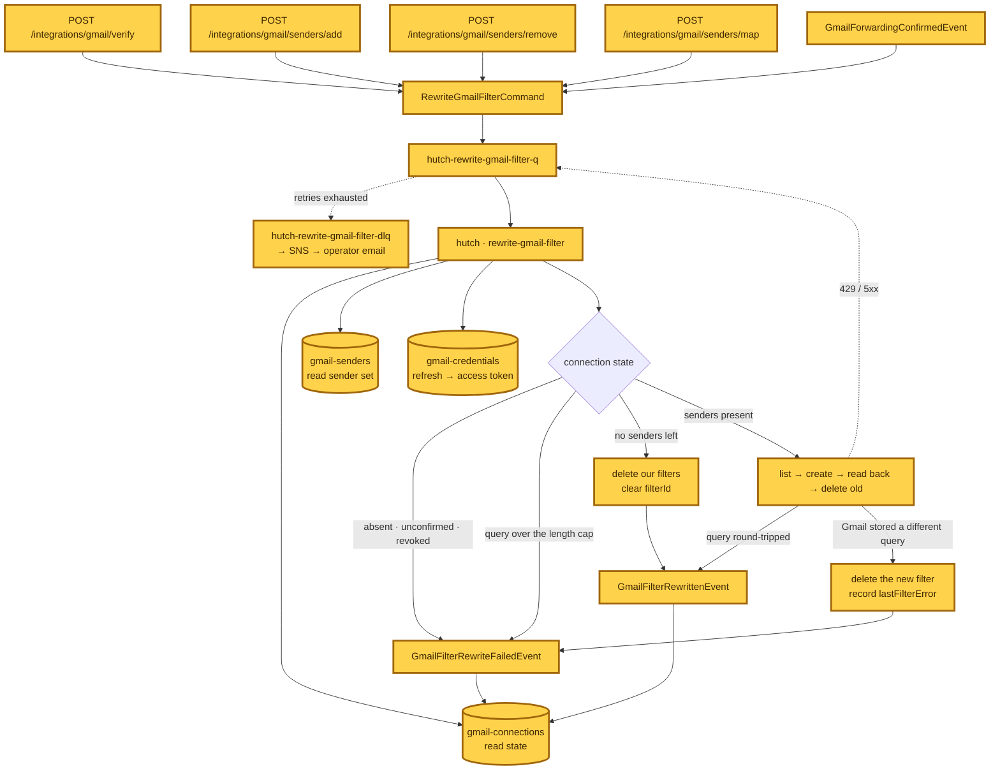
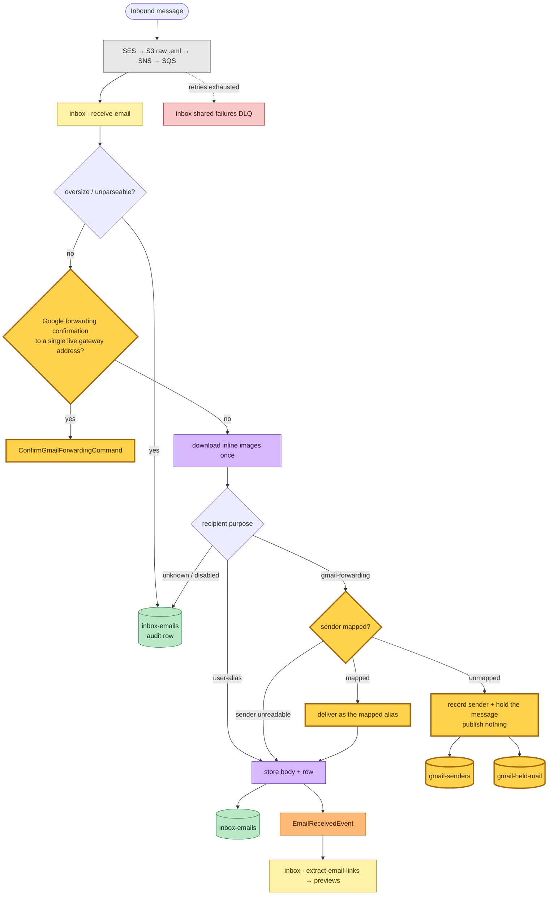
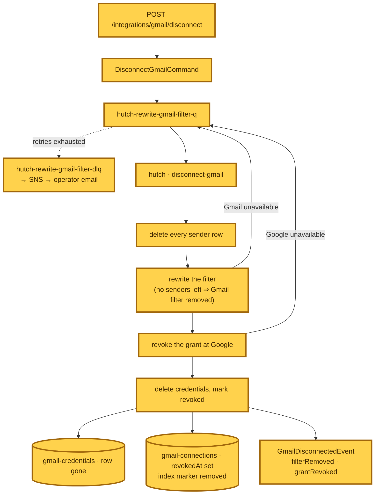

# Gmail integration — event storming

**Commit:** `ffa98af7` — *feat: write and maintain the Gmail forwarding filter from a reader's senders*
**Commit date:** 2026-08-28 · **Generated:** 2026-08-28 · **Branch:** `main`

A point-in-time map of every command, system and event involved in connecting a
Gmail account, confirming its forwarding address, writing and maintaining the
Gmail filter, routing forwarded mail by sender, and disconnecting.

---

## Legend

Every node in the diagrams below carries one of these roles. Nodes drawn with a
thick amber border (`:::new`) are the ones this snapshot introduces — the whole
Gmail flow is new since the previous snapshot, so the highlight marks the
commands and events that did not exist in it at all.

Mermaid source

---

## 1. Connect and confirm

Connecting is an ordinary authenticated page action. Google issues the grant,
Readplace mints a gateway address, and the reader pastes that address into
Gmail's own forwarding settings — the one step no API can perform, because
`forwardingAddresses.create` is restricted to domain-wide-delegated service
accounts that a consumer `@gmail.com` cannot grant.

Google then emails a confirmation link to the gateway address, which lands in
Readplace's own inbound pipeline. The receive worker recognises it and hands it
to a dedicated worker that completes the confirmation with an empty-body POST —
no credentials involved, which is why that worker lives in the inbox stack
rather than beside the OAuth secret.

Mermaid source

---

## 2. Filter lifecycle

`RewriteGmailFilterCommand` carries only the reader's id and a reason — never a
snapshot of the sender set — so a redelivery reconciles against current truth
rather than replaying a stale list. Four page actions and one event dispatch it.

The worker holds three rules, each answering a distinct failure: it creates the
replacement before deleting what it supersedes; it reads the new filter back and
compares the query byte-for-byte, because Gmail accepts an over-long query and
then silently never matches it; and it decides which filters are its own from
Gmail's state rather than from stored ids, so a crashed run self-heals to
exactly one filter.

Mermaid source

---

## 3. Inbound mail routing

One receive worker serves every inbound message. Mail addressed to an ordinary
alias behaves exactly as it did before this commit. Two branches are new: the
Google confirmation is claimed before any outbound image fetch can be triggered,
and mail arriving at a gateway address is routed by its sender rather than by
the address it was sent to.

An unmapped sender is recorded and held. Nothing is published for it, so the
link-extraction Lambda is never invoked and no preview crawl runs for a
newsletter the reader has not claimed.

Mermaid source

---

## 4. Disconnect

Disconnecting is a command rather than an inline write for two reasons: the
Gmail filter has to be removed *before* the grant is revoked, or a rule keeps
forwarding to an address that no longer routes; and performing that removal in
the request path would place a restricted-scope credential in the web Lambda.

The steps are ordered so that an outage leaves the reader connected rather than
half-disconnected — the token is only forgotten once Google has confirmed the
revocation.

Mermaid source

---

## Command → System → Event(s) reference

| Command / Event | Handled by | Emits | Triggers next |
|---|---|---|---|
| `POST /integrations/gmail/connect` | hutch web | — (303 to Google) | reader completes consent |
| `GET /integrations/gmail/callback` | hutch web | — (303 back to the list) | writes credentials, gateway alias, connection row |
| `ConfirmGmailForwardingCommand` | inbox · confirm-gmail-forwarding | `GmailForwardingConfirmedEvent`, `GmailForwardingConfirmFailedEvent` | on success, the filter rewrite |
| `GmailForwardingConfirmedEvent` | hutch · rewrite-gmail-filter Lambda | `RewriteGmailFilterCommand` | marks the connection confirmed first |
| `GmailForwardingConfirmFailedEvent` | *(no consumer)* | — | recorded for operators only |
| `POST /integrations/gmail/verify` | hutch web | `RewriteGmailFilterCommand` (`requested`) | filter rewrite |
| `POST /integrations/gmail/senders/add` | hutch web | `RewriteGmailFilterCommand` (`sender-added`) | filter rewrite |
| `POST /integrations/gmail/senders/remove` | hutch web | `RewriteGmailFilterCommand` (`sender-removed`) | filter rewrite |
| `POST /integrations/gmail/senders/map` | hutch web | `RewriteGmailFilterCommand` (`sender-added`) | mints an alias, then the rewrite |
| `RewriteGmailFilterCommand` | hutch · rewrite-gmail-filter | `GmailFilterRewrittenEvent`, `GmailFilterRewriteFailedEvent` | terminal |
| `GmailFilterRewrittenEvent` | *(no consumer)* | — | terminal fact |
| `GmailFilterRewriteFailedEvent` | *(no consumer)* | — | surfaced on the page via `lastFilterError` |
| `POST /integrations/gmail/disconnect` | hutch web | `DisconnectGmailCommand` | teardown |
| `DisconnectGmailCommand` | hutch · disconnect-gmail | `GmailDisconnectedEvent` | terminal |
| `GmailDisconnectedEvent` | *(no consumer)* | — | terminal fact |
| `EmailReceivedEvent` | inbox · extract-email-links | link previews | pre-existing flow, unchanged |

All three Gmail detail types — `RewriteGmailFilter`, `GmailForwardingConfirmed`
and `DisconnectGmail` — route to a single hutch Lambda behind one SQS queue and
one DLQ, split by `detail-type` at the composition root. Each carries its own
stack-prefixed EventBridge rule name, so a rule can never be silently upserted
over another stack's.

---

## Stores

| Store | Stack | Keys | Written by |
|---|---|---|---|
| `gmail-credentials` | hutch | hash `userId` | callback, disconnect |
| `gmail-connections` | hutch | hash `userId`, sparse `connected-index` | callback, confirm, rewrite, disconnect |
| `inbox-gmail-senders` | inbox | hash `userId`, range `senderEmail` | page actions, receive worker, rewrite |
| `inbox-gmail-held-mail` | inbox | hash `userId`, range `receivedAt#messageId`, LSI on `senderEmail#…` | receive worker |
| `inbox-addresses` | inbox | hash `address`, `userId-index` | callback (gateway), sender mapping |

`countConnected` reads the sparse `connected-index` with `Select: "COUNT"`, so
the coming 100-user alarm never scans. The marker attribute is written while a
connection is live and removed when it is revoked, so the index holds only live
rows.

---

## Known gaps at this commit

- **Account deletion does not touch the Gmail stores.** Deleting an account
  leaves the credentials, connection, sender and held-mail rows in place and
  does not revoke at Google. The tables are keyed by `userId`, so the cleanup is
  a Query and delete per table, but nothing calls it yet.
- **No consumer for the three terminal facts.** `GmailFilterRewriteFailed`,
  `GmailForwardingConfirmFailed` and `GmailDisconnected` are published and
  logged; the failure state a reader sees comes from `lastFilterError` on the
  connection row, not from the event.
- **No alarm on the 100-user cap.** The counting path exists; the metric filter,
  emitter and alarm do not.
- **The filter query length cap is unmeasured.** The constant is a chosen value,
  guarded by the mandatory post-create read-back rather than by knowledge of
  Gmail's real ceiling.
