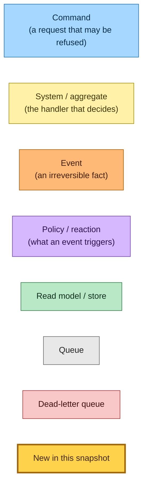
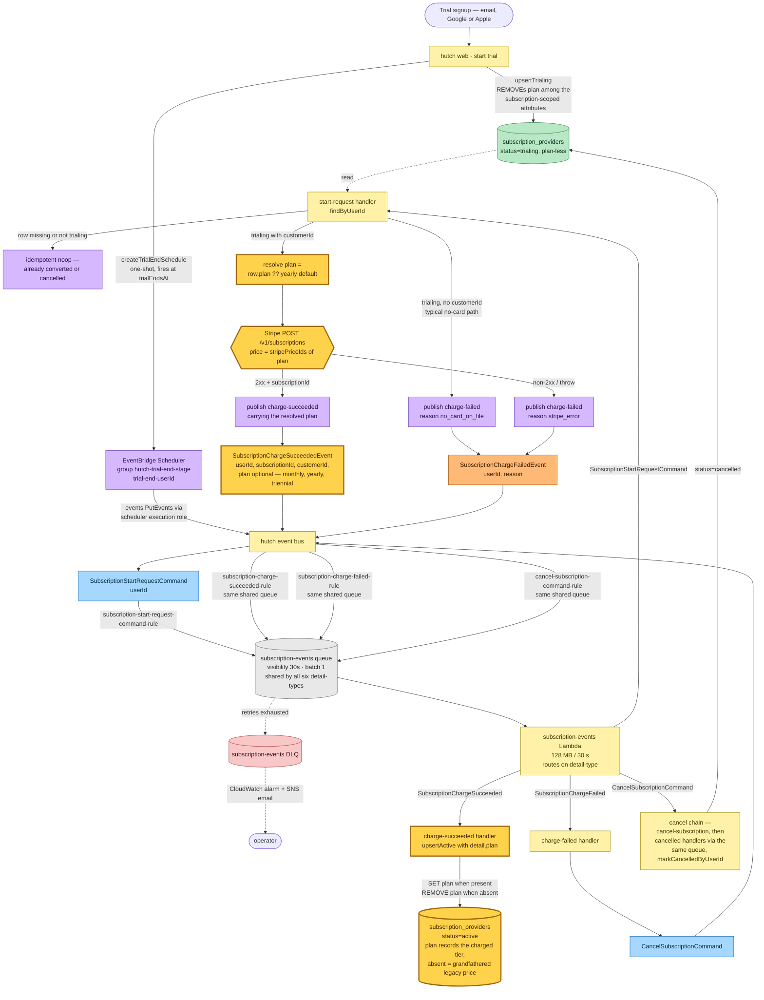
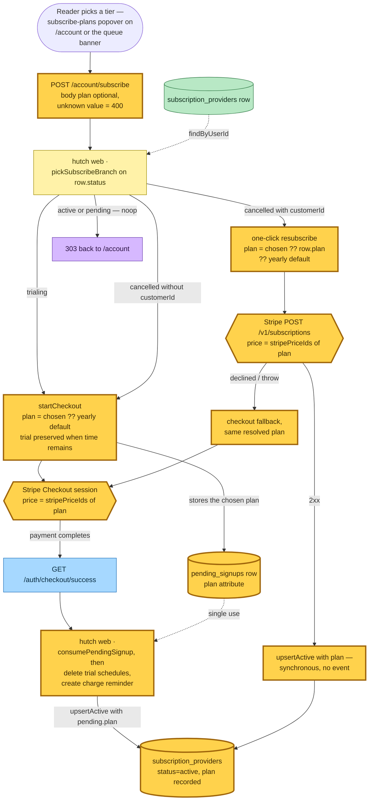

# Billing Plan on the Trial-End Charge Chain — Event Storming

**Base commit:** `d581f65d8` &nbsp;•&nbsp; **Commit date:** 2026-09-01 &nbsp;•&nbsp; **Generated:** 2026-09-02 &nbsp;•&nbsp; **Branch:** `main`
**Subject:** `refactor(@packages/web-shell): name the reader-failure banner's clicks after where they happen`

> **Dirty-tree snapshot.** The 3-tier pricing change documented here is **uncommitted** on top of `d581f65d8` at generation time. This document describes the working tree as it stands, not the commit. The wire-format change that mandates this snapshot is one line — an optional `plan` field on `SubscriptionChargeSucceededEvent`'s detail schema in the shared event catalogue — but the flows it rides through are shown in their complete current state.

This snapshot extends the trial-end conversion chain first mapped in
[`2026-05-24-bf80b57a`](../2026-05-24-bf80b57a/trial-end-conversion-flow.md) and re-wired onto a
shared queue in [`2026-08-04-cb3ec007`](../2026-08-04-cb3ec007/). Pricing goes from one
subscription price to three self-serve tiers — **monthly $10/mo**, **yearly $60/yr** (featured),
**triennial $108/3yr** — and the trial-end charge chain must now know *which* tier to charge and
*record* which tier it charged:

1. **The producer picks the plan.** The `subscription-start-request` handler (inside the shared
   `subscription-events` Lambda) resolves `plan = row.plan ?? DEFAULT_BILLING_PLAN` (`"yearly"`),
   charges Stripe at `stripePriceIds[plan]`, and stamps the resolved plan onto the
   `SubscriptionChargeSucceeded` event it publishes. In the current tree a trialing row is always
   plan-less (`upsertTrialing` REMOVEs the attribute), so the default is the live path; the
   `row.plan` read is the seam through which a future plan-choosing trial signup flows with no
   further wire change.
2. **The consumer records the plan the charge was made on.** The `subscription-charge-succeeded`
   handler forwards `detail.plan` into `upsertActive`, which SETs the row's `plan` attribute when
   the event carries one and REMOVEs it when it does not.
3. **Absence is meaningful, not back-compat convenience.** Internal contracts in this repo prefer
   required fields, but a `SubscriptionChargeSucceeded` event already enqueued at deploy time was
   charged at the legacy single $49/yr price — none of the three new tiers describes it, so
   recording one would be false. The absent field flows through to a plan-less row: the
   subscriber keeps their existing Stripe subscription and price (nothing in the app re-prices
   it), i.e. they are grandfathered. Making the field required would only dead-letter those
   in-flight events, and a redrive still could not conjure a true plan for them.

What is new in this snapshot (highlighted `:::new` in every diagram):

- **`plan` on `SubscriptionChargeSucceededEvent.detailSchema`** — `z.enum(["monthly", "yearly",
  "triennial"]).optional()`. The only wire-format change in the catalogue; `SubscriptionStartRequestCommand`
  and `SubscriptionChargeFailedEvent` are untouched.
- **`BillingPlan` union + `DEFAULT_BILLING_PLAN`** (`"yearly"`) in the provider contracts, with
  the tier table and display strings in the web shell's pricing module.
- **`stripePriceIds: Record<BillingPlan, string>`** replaces the scalar `stripePriceId` in both
  composition roots that talk to Stripe. Three env vars — `STRIPE_PRICE_ID_MONTHLY`,
  `STRIPE_PRICE_ID_YEARLY`, `STRIPE_PRICE_ID_TRIENNIAL` — replace `STRIPE_PRICE_ID` on the
  SSR Lambda and the `subscription-events` Lambda. No IAM, queue, rule, or schedule changes.
- **`upsertActive` gains optional `plan`** — SET when present, REMOVE when absent, so a
  redelivered legacy event converges on the grandfathered plan-less row instead of leaving a
  stale attribute behind. `upsertTrialing` now REMOVEs `plan` alongside the other
  subscription-scoped attributes.
- **`plan` on the DynamoDB row schema** — parsed tolerantly (`.catch(undefined)`): every read of
  the row feeds the save gate and the header banner, so one malformed attribute degrades to
  "no plan" rather than locking the account.
- **The synchronous plan writers** — the same three-tier choice rides the checkout flows that
  write the row directly without touching this event: the subscribe-plans popover posts a
  `plan` to `POST /account/subscribe`; Stripe Checkout sessions are created at
  `stripePriceIds[plan]` and the pending-signup row carries the plan to
  `GET /auth/checkout/success`; the one-click resubscribe charges
  `chosenPlan ?? row.plan ?? DEFAULT_BILLING_PLAN`. All converge on the same `upsertActive`
  write the event consumer uses.

> Snapshots are historical. Any file path referenced below may be renamed, moved, or deleted in
> the future. Treat as an artefact, not a live guide.

---

## Legend

Every node in the diagrams below carries one of these roles. Nodes drawn with a thick amber
border (`:::new`) are the ones this snapshot introduces or changes — here that is the `plan`
field riding the success event, the producer's plan resolution and per-plan price lookup, and
the consumer's plan-recording write.

Mermaid source

---

## 1. Trial-end conversion chain — complete current state

At trial signup the SSR Lambda writes the plan-less trialing row and creates the one-shot
EventBridge Schedule `trial-end-<userId>` firing at `trialEndsAt`. Since
[`2026-08-04-cb3ec007`](../2026-08-04-cb3ec007/) the whole subscription state machine shares
**one** SQS queue and **one** Lambda: six EventBridge rules — one per command/event, each named
`<event-name>-rule` — converge on the `subscription-events` queue, whose single queue policy
admits all six, and the Lambda routes each record on the envelope's `detail-type`. The chain
below therefore re-enters the same queue and Lambda at every hop.

The typical trial has no card on file, so the typical path is still charge-failed →
cancel chain. The charging path — a trialing row that *does* hold a `customerId` (attached
out-of-band; no current flow writes one while the row stays trialing) — is where the plan now
rides: the handler resolves the plan, charges that tier's price id, and publishes the fact with
the plan on it, so the row records the plan the charge was actually made on rather than
whatever the pricing table says at read time.

Mermaid source

---

## 2. Where the row's plan comes from — the synchronous writers

The event consumer's `upsertActive` is one of three writers of the plan-bearing row; the other
two are synchronous request-path writes that never touch `SubscriptionChargeSucceeded` but must
stay shape-consistent with it. The plan choice enters through the subscribe-plans popover — a
three-panel grid rendered on `/account` and the queue's subscription banner, each panel a form
posting its tier as a hidden `plan` input to `POST /account/subscribe` (an unknown value is a
400; an absent one falls back per branch below). The home page renders the same tier table as
marketing copy; its CTAs lead into signup, not into this POST.

The `row.plan ?? …` fallback in the one-click resubscribe is the same seam the trial-end
handler uses: a cancelled subscriber who re-subscribes without re-choosing gets the tier their
row last recorded, and a grandfathered (plan-less) one gets the default.

Mermaid source

---

## Command → System → Event(s) reference

| Command / Event | Handler | Side effects | Emits |
|---|---|---|---|
| EventBridge Scheduler fires at `trialEndsAt` | EventBridge Scheduler service (managed) | `events:PutEvents` to the hutch bus via the scheduler execution role | `SubscriptionStartRequestCommand` |
| `SubscriptionStartRequestCommand` (userId) | `subscription-events` Lambda → start-request handler | Reads the row; **NEW:** resolves `plan = row.plan ?? "yearly"` and calls Stripe `subscriptions.create` at `stripePriceIds[plan]` | `SubscriptionChargeSucceededEvent` (**NEW:** carrying `plan`) OR `SubscriptionChargeFailedEvent` |
| `SubscriptionChargeSucceededEvent` (userId, subscriptionId, customerId, **plan?**) | `subscription-events` Lambda → charge-succeeded handler | **NEW:** `upsertActive` forwards `detail.plan` — SET when present, REMOVE when absent | (terminal — no downstream event) |
| `SubscriptionChargeFailedEvent` (userId, reason) | `subscription-events` Lambda → charge-failed handler | Dispatches the cancel command (Event → Command) | `CancelSubscriptionCommand` |
| `CancelSubscriptionCommand` (userId, reason) | `subscription-events` Lambda → cancel-subscription handler | Deletes trial schedules; per-status branch; downstream cancelled handlers flip the row | `SubscriptionCancelledEvent` or `SubscriptionCancellationScheduledEvent` |
| Reader posts a tier to `/account/subscribe` (trialing) | SSR Lambda (synchronous) | **NEW:** Stripe Checkout session at `stripePriceIds[plan]`; pending-signup row stores `plan` | (terminal — 303 to Stripe Checkout) |
| Stripe redirects to `/auth/checkout/success` | SSR Lambda (synchronous) | **NEW:** `upsertActive` with `pending.plan`; deletes trial schedules; creates the charge reminder | (terminal — 303 to return URL) |
| Reader posts a tier to `/account/subscribe` (cancelled + customerId) | SSR Lambda (synchronous) | **NEW:** Stripe `subscriptions.create` at `stripePriceIds[chosen ?? row.plan ?? "yearly"]` + `upsertActive` with that plan | (terminal — 303 to /account; decline falls back to Checkout at the same plan) |

---

## Trust boundaries

Nothing structural changes: no new Lambda, queue, rule, schedule, table, or IAM statement. The
whole change is wire-format plus configuration.

The `subscription-events` Lambda (shared subscription state machine):

- **IAM**: unchanged — DynamoDB `GetItem`/`UpdateItem` on `subscription_providers`, EventBridge
  `PutEvents`, scheduler manage policy, Stripe via HTTPS.
- **Environment**: `STRIPE_PRICE_ID` → **`STRIPE_PRICE_ID_MONTHLY` / `STRIPE_PRICE_ID_YEARLY` /
  `STRIPE_PRICE_ID_TRIENNIAL`**. The composition root builds `stripePriceIds` from the three
  required accessors, so a missing tier fails the boot, not the charge.

The SSR Lambda (request-response composition root):

- **IAM**: unchanged.
- **Environment**: same three-way price-id swap as above.

---

## Failure paths

| Failure point | Behaviour | Recovery |
|---|---|---|
| `SubscriptionChargeSucceeded` enqueued **before** the deploy, consumed after | Detail has no `plan`; schema accepts it; `upsertActive` REMOVEs the row's `plan` | Correct by design — that charge was made at the legacy single price; the row reads as grandfathered and the subscriber's Stripe subscription is untouched |
| A tier's price-id env var missing at deploy | `requireEnv` throws at composition-root load — the Lambda fails to boot | Fix the stack config; no partial pricing table can ever serve traffic |
| Stripe declines the trial-end charge | Handler publishes charge-failed (`stripe_error`) → cancel chain, as before | Row ends up cancelled; a later one-click resubscribe reuses `row.plan` if any was recorded |
| Redelivery of a plan-carrying success event | `upsertActive` is idempotent — same SET, same row | No drift |
| Redelivery interleaved with a plan-less legacy event | Last write wins; the legacy event REMOVEs, the plan-carrying one SETs | Whichever fact arrived last is what the row records — both describe real charges, and the operator can redrive from the DLQ in order |
| Malformed `plan` attribute on a stored row | The row schema's tolerant parse degrades it to `undefined` | Reads (save gate, banner, `/account`) see a plan-less row instead of a locked account; the next plan-carrying write repairs it |
| Records exhausting SQS retries | Shared `subscription-events` DLQ + CloudWatch alarm + SNS email | Operator redrive, unchanged from the consolidation snapshot |

---

## Why `plan` is optional on an internal event

This repo's testing conventions demand required fields on internal contracts — producer and
consumer deploy together, so the compiler should force every producer to supply the value. The
`plan` field is the documented exception, and the reasoning is recorded here because the schema
line alone looks like the forbidden "optional for backward compatibility":

- A `SubscriptionChargeSucceeded` sitting in the queue across the deploy describes a charge made
  at the legacy $49/yr price. None of `monthly`/`yearly`/`triennial` is true of it.
- The absence therefore *is* the datum: it flows through `upsertActive`'s REMOVE branch into the
  plan-less row that the read side treats as grandfathered. That is the semantically-optional
  carve-out — modelling reality, not tolerating a sloppy producer.
- Every in-repo producer today (`subscription-start-request` is the only one) supplies the field
  unconditionally; the type on the publisher contract (`PublishSubscriptionChargeSucceeded`)
  requires it, so the compiler still forbids a producer dropping it. Only the wire schema, which
  must also describe pre-deploy history, admits absence.
