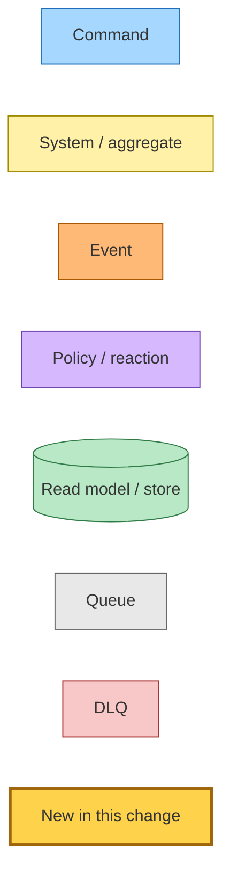
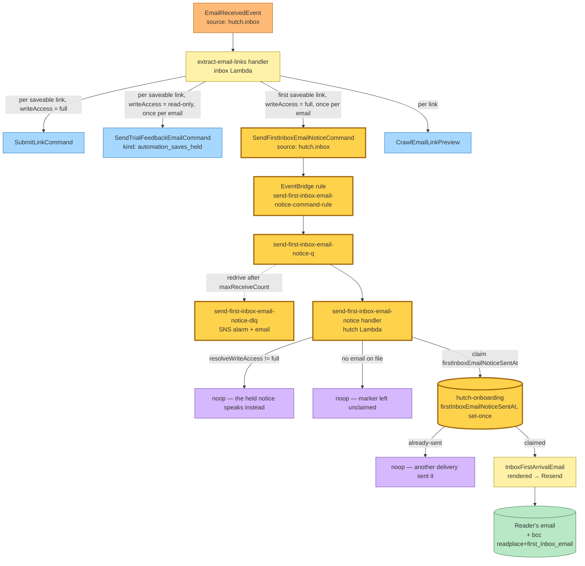

# First-inbox-email notice

Architecture snapshot pinned to `8a97952d` (`fix(hutch): restore the interaction
states of the light-pinned pages`, 2026-09-02, branch `main`). **Captured from a
dirty working tree** — the whole first-inbox-email-notice feature is uncommitted
on top of this base commit.

This snapshot documents the flow that produces and consumes the new
`SendFirstInboxEmailNoticeCommand`: the first time an email to a reader's
Readplace inbox actually saves an article link, a good-standing reader gets one
email, once per account, pointing them at `/inbox`.

## Legend

Event-storming notation — **command → system → event(s)** — with the underlying
infrastructure (handlers, queues/DLQs, EventBridge rules, datastore
reads/writes, external APIs) surfaced inside each step. Nodes and edges added by
**this change** are highlighted with a thick amber border (`:::new`).





<details><summary>Mermaid source</summary>

```
flowchart LR
  cmd[Command]:::command
  sys[System / aggregate]:::system
  evt[Event]:::event
  pol[Policy / reaction]:::policy
  rm[(Read model / store)]:::store
  q[Queue]:::queue
  dlq[DLQ]:::dlq
  chg[New in this change]:::new
  classDef command fill:#a6d8ff,stroke:#1e6fb8;
  classDef system fill:#fff2a8,stroke:#a08a00;
  classDef event fill:#ffb976,stroke:#a85800;
  classDef policy fill:#d6b8ff,stroke:#6b3fb0;
  classDef store fill:#b8e8c5,stroke:#2f7a45;
  classDef queue fill:#e8e8e8,stroke:#666;
  classDef dlq fill:#f8c8c8,stroke:#a83434;
  classDef new fill:#ffd24c,stroke:#a0660b,stroke-width:3px;
```

</details>

## End-to-end flow

`EmailReceivedEvent` drives the inbox `extract-email-links` consumer, which — for
every saveable link belonging to a routed reader on a `receive` (not `backfill`)
run — already fans out one `CrawlEmailLinkPreview` and, gated on the reader's
write access, either one `SubmitLinkCommand` (full access, the link is saved) or,
once per email, one `SendTrialFeedbackEmailCommand` carrying
`kind: automation_saves_held` (read-only, the save is held).

**This change** adds one more fan-out on the full-access branch: the **first**
saveable link a good-standing reader's email produces also publishes
`SendFirstInboxEmailNoticeCommand`. The publisher signals no first-ness — it
fires on every qualifying email — so the hutch consumer is the idempotency
point. It re-checks write access and email-on-file, then claims a lifetime-once
marker on the onboarding row (`firstInboxEmailNoticeSentAt`) with a conditional
`UpdateItem` before sending; only the delivery that wins the claim sends the
`InboxFirstArrivalEmail` through Resend. Like the saves-held handler, it ends at
the send and publishes no event.

The saves-held notice and this first-inbox notice are **mutually exclusive** by
construction: saves-held fires when `resolveWriteAccess` is not `full`, this one
only when it is `full`.





<details><summary>Mermaid source</summary>

```
flowchart TB
  emailReceived[EmailReceivedEvent<br/>source: hutch.inbox]:::event
  extract[extract-email-links handler<br/>inbox Lambda]:::system
  emailReceived --> extract

  extract -->|per saveable link, writeAccess = full| submit[SubmitLinkCommand]:::command
  extract -->|per saveable link, writeAccess = read-only, once per email| held[SendTrialFeedbackEmailCommand<br/>kind: automation_saves_held]:::command
  extract -->|first saveable link, writeAccess = full, once per email| notice[SendFirstInboxEmailNoticeCommand<br/>source: hutch.inbox]:::new
  extract -->|per link| crawlPreview[CrawlEmailLinkPreview]:::command

  notice --> rule[EventBridge rule<br/>send-first-inbox-email-notice-command-rule]:::new
  rule --> queue[send-first-inbox-email-notice-q]:::new
  queue -. redrive after maxReceiveCount .-> dlq[send-first-inbox-email-notice-dlq<br/>SNS alarm + email]:::new
  queue --> consumer[send-first-inbox-email-notice handler<br/>hutch Lambda]:::new

  consumer -->|resolveWriteAccess != full| noopA[noop — the held notice speaks instead]:::policy
  consumer -->|no email on file| noopB[noop — marker left unclaimed]:::policy
  consumer -->|claim firstInboxEmailNoticeSentAt| onboarding[(hutch-onboarding<br/>firstInboxEmailNoticeSentAt, set-once)]:::new
  onboarding -->|already-sent| noopC[noop — another delivery sent it]:::policy
  onboarding -->|claimed| send[InboxFirstArrivalEmail<br/>rendered → Resend]:::system
  send --> readerInbox[(Reader's email<br/>+ bcc readplace+first_inbox_email)]:::store

  classDef command fill:#a6d8ff,stroke:#1e6fb8;
  classDef system fill:#fff2a8,stroke:#a08a00;
  classDef event fill:#ffb976,stroke:#a85800;
  classDef policy fill:#d6b8ff,stroke:#6b3fb0;
  classDef store fill:#b8e8c5,stroke:#2f7a45;
  classDef queue fill:#e8e8e8,stroke:#666;
  classDef dlq fill:#f8c8c8,stroke:#a83434;
  classDef new fill:#ffd24c,stroke:#a0660b,stroke-width:3px;
```

</details>

## Command → System → Event(s) reference

| Command | Source | System (handler) | Event(s) emitted | Next command(s) |
|---|---|---|---|---|
| `EmailReceivedEvent` *(event)* | `hutch.inbox` | inbox `extract-email-links` | — | `CrawlEmailLinkPreview`, `SubmitLinkCommand`, `SendTrialFeedbackEmailCommand` (`automation_saves_held`), **`SendFirstInboxEmailNoticeCommand`** |
| **`SendFirstInboxEmailNoticeCommand`** *(new)* | `hutch.inbox` | hutch `send-first-inbox-email-notice` | — *(ends at the email send; publishes no event, matching the saves-held precedent)* | — |

## Notes

- **Rollout.** Publisher (inbox) and consumer (hutch) deploy in parallel. A
  publish that lands before the consumer's EventBridge rule exists is dropped by
  EventBridge with no DLQ and no alarm; the reader's next linked email
  re-triggers the notice.
- **Marker placement.** The lifetime-once marker lives on the `hutch-onboarding`
  table, not the subscription row: founding-allocation signups never get a
  subscription row, and the subscription-row markers are cleared on every new
  trial/active window, whereas this notice is once per account for good.
  Account deletion already scrubs the onboarding row.
- **Idempotency.** The claim (`ConditionExpression:
  attribute_not_exists(firstInboxEmailNoticeSentAt)`) precedes the send, so a
  concurrent or redelivered command sends exactly once; a send failure after the
  claim is retried as a batch item failure but converges to at-most-once (same
  trade the saves-held handler makes).
