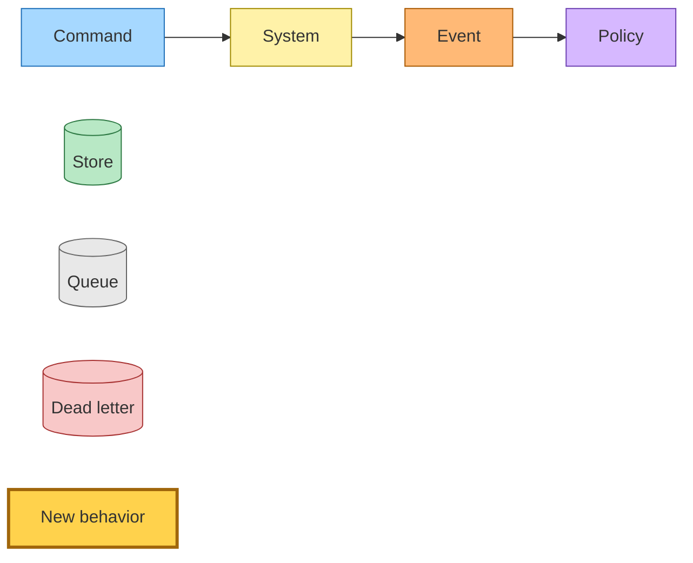
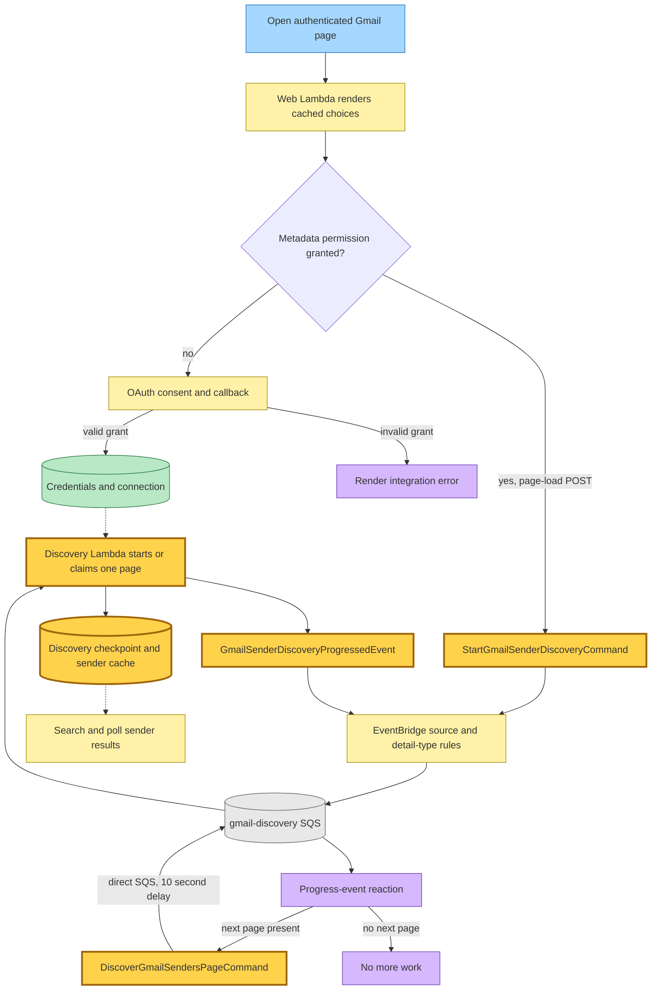
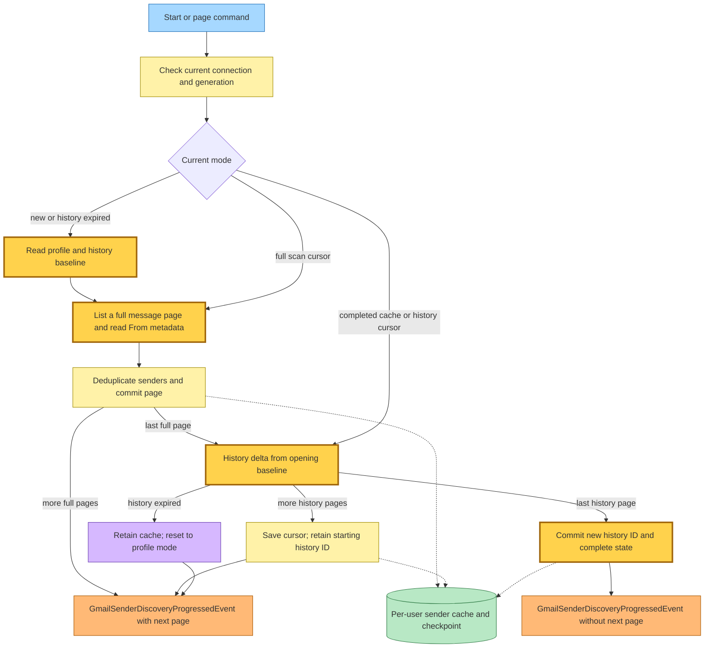
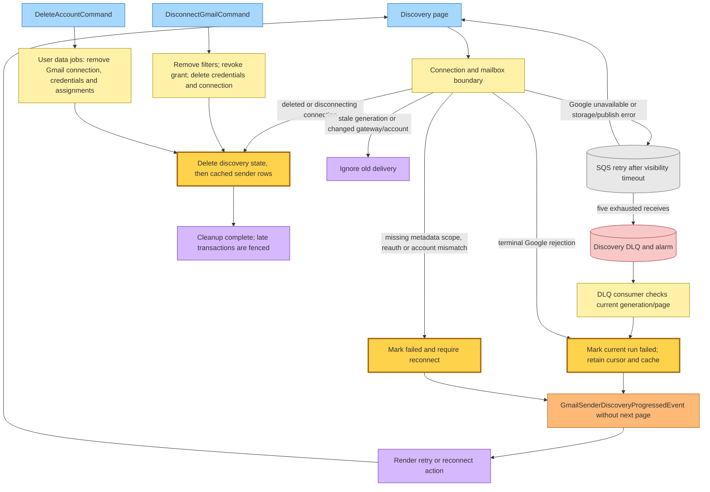
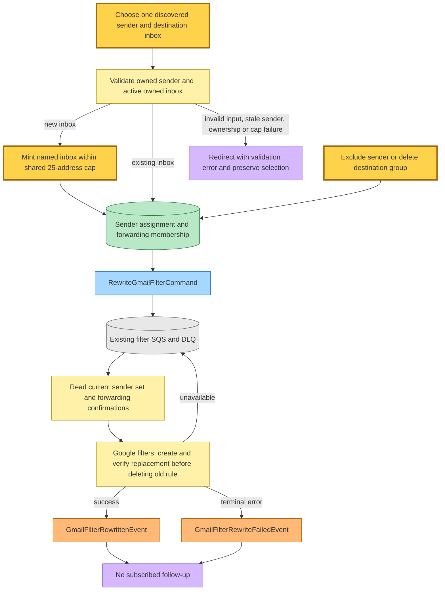

# Gmail sender discovery and inbox assignment

Base commit: `7a54f447`, 2026-09-11, `main` — `fix(ios): keep shared readlist choices in sync across processes`.

Generated 2026-09-12 from the dirty working tree. The Gmail discovery, consent and picker changes documented here are uncommitted additions over that base commit.

Opening the Gmail page starts a durable scan of the connected mailbox. Each completed page contributes immediately usable sender choices; leaving the page does not stop the worker. A completed scan retains its sender cache and Gmail history checkpoint so the next visit refreshes changes rather than scanning the mailbox again. The sender cache is separate from the existing sender observations and forwarding assignments.

## Legend

Gold identifies the new discovery and assignment behavior. The other colors retain the shared event-storming roles. A command handler emits a fact; the fact's reaction dispatches the next command.

Mermaid source

## Page open, consent and durable continuation

The authenticated GET renders cached senders. A page-load form posts the start request through the existing authentication, unlocked-account and write-access gates. Missing metadata scope presents reconnect instead. OAuth requests `gmail.settings.basic` and `gmail.metadata`, verifies signed state and the five-minute cookie, exchanges the code for an offline grant, and requires both scopes. A declined or incomplete grant leaves the existing forwarding connection intact. Reconnecting to another account is rejected before credentials are replaced; changing accounts requires disconnect first.

The HTTP POST publishes only the user identifier and redirects immediately. Its previous `updatedAt` value lets the read side continue polling while the asynchronous start has not yet changed the cached complete state. Search, selected sender and destination survive polling. The picker accepts one sender from the owner's discovered list; it never needs to hold a request open while Gmail is scanned.

Mermaid source

Both EventBridge rules target one queue through one queue policy, restricted to their source rule ARNs. The page command uses the shared validated SQS dispatcher with a ten-second delay. EventBridge envelopes carry `detail-type`; direct page commands use the dispatcher's `{detail}` envelope and the page schema identifies them. Batch size is one, Lambda timeout is 60 seconds, queue visibility is 90 seconds, and page claims expire after 60 seconds. The role can read the Gmail connection and credential tables, conditionally write the discovery table, publish facts and send its continuation to the queue. There is no new external secret or cross-stack output. The discovery table belongs to hutch and is configured in both staging and prod.

## Mailbox paging and incremental refresh

The worker binds state to the user, normalized Gmail account identity and gateway address. It captures `users.getProfile.historyId` before the first message page. Full scans call `users.messages.list` without Spam/Trash, then fetch only From metadata and labels. The metadata scope does not allow the message-list `q` filter, so the provider removes Spam, Trash, drafts and sent-only messages after reading their labels. Incoming messages carrying both SENT and INBOX remain eligible. From headers are parsed into normalized addresses and optional display names; duplicates collapse by address.

The provider bounds each call to 25 metadata message IDs with five concurrent metadata requests. History pages also have an opaque cursor for any unprocessed message IDs inside a large history record; a single bulk label change cannot create an unbounded invocation. History includes message additions and label additions/removals so a message moved back from Spam or Trash can add its sender.

Mermaid source

Arrows from the final full page to history mean a persisted continuation, not an extra Gmail page in the same invocation. The baseline remains unchanged until the last history page commits, which closes the gap for messages arriving during a long initial scan. An expired Gmail history checkpoint returns to profile/full scanning with cached choices still visible. The cache records senders observed in eligible messages; deleting or relabeling an old message does not retract an already discovered sender.

The DynamoDB partition key is `userId`; sort key `recordKey` is `STATE` or `SENDER#<normalized email>`. Reads use the primary partition and strong consistency, never a full table scan or a GSI. A conditional start chooses one active generation. A claim protects a generation/page pair. Most pages write the next checkpoint and all deduplicated sender rows in one transaction. Multi-author headers can yield more than 99 distinct addresses; those pages write chunks of at most 99 senders with a conditional generation/page check, then advance the checkpoint only with the final chunk. Partial chunks are safe to repeat. The public read model exposes running/complete/failed, scanned message count, update time and an explicit reconnect requirement; absent state renders idle.

## Retry, permission failure and erasure

Mermaid source

Transient failures throw so the existing SQS message remains retryable. A page committed before a publish failure is not scanned again: redelivery returns the persisted next page. A failed run restarts with a fresh generation but preserves its mode, page token, history baseline and scanned count. Permission failures set `requiresReconnect` and do not revoke or disable existing forwarding. Access-token reuse is tied to the latest strongly read stored refresh token, preventing a warm worker from using a token from the previous grant.

The DLQ consumer marks only still-running work failed, checking generation/page when present, and publishes a terminal progress fact. Malformed or failed DLQ records remain retryable; the queue's CloudWatch/SNS alarm remains in place. Cached choices survive failures. The development composition runs the same paged worker in the background, with an injected ten-second wait between pages and logged failures.

Disconnect remains on the existing filter worker queue: clear assignments, reconcile filters, revoke at Google, then remove credentials and connection before deleting discovery data. An unavailable Google operation retries before final removal. If a cleanup retry finds the connection already deleted, it still removes discovery data. Account erasure removes the connection first, then Gmail credentials, sender assignments and discovery data as part of the existing idempotent user-data job. A start that read the connection just before deletion cannot leave orphan mailbox data: its page rechecks the strongly consistent connection lookup and removes any late discovery state. An old delivery for a replaced account/gateway does not delete the new account's cache.

## Assignment and forwarding context

Mermaid source

Saved mappings are grouped by destination, with individual sender exclusion and group removal. Creating an inbox reuses the existing account-wide limit check shared with ordinary inbox aliases; gateway addresses remain outside that cap. Google forwarding confirmation remains required before a direct-destination rule can be written. Pending mapped destinations retain gateway forwarding, and strongly read confirmations prevent an eventual index read from acknowledging work before its filter exists. The existing receive path continues to route gateway mail by sender assignment and reject disabled destinations. Discovery itself does not forward mail, read message bodies, or publish inbound-email events.

## Command → System → Event(s) reference

| Command or input event | Handling system | Emitted fact or terminal effect | Next command |
|---|---|---|---|
| Page-load discovery POST | Authenticated hutch web Lambda | Publishes start intent and returns 303 | `StartGmailSenderDiscoveryCommand` |
| `StartGmailSenderDiscoveryCommand` | Discovery Lambda | `GmailSenderDiscoveryProgressedEvent` after start/page result | The event reaction may dispatch `DiscoverGmailSendersPageCommand` |
| `DiscoverGmailSendersPageCommand` | Discovery Lambda | `GmailSenderDiscoveryProgressedEvent` after persisted page or terminal result | Same event reaction while a next page remains |
| `GmailSenderDiscoveryProgressedEvent` | Discovery Lambda event branch | Sends a delayed page command, or terminates | `DiscoverGmailSendersPageCommand` when `nextPage` exists |
| Exhausted discovery message | Discovery DLQ Lambda | Marks failed and publishes terminal `GmailSenderDiscoveryProgressedEvent`; stale/settled state is ignored | None |
| Sender assignment, exclusion or group removal POST | Authenticated hutch web Lambda | Updates sender assignment records and redirects | `RewriteGmailFilterCommand` |
| `RewriteGmailFilterCommand` | Existing filter worker | `GmailFilterRewrittenEvent` or `GmailFilterRewriteFailedEvent`; unavailable operations retry | None |
| `GmailForwardingConfirmedEvent` | Existing filter worker reaction | Reconciles newly confirmed forwarding destination through its existing command publisher | `RewriteGmailFilterCommand` |
| `DisconnectGmailCommand` | Existing filter worker disconnect handler | `GmailDisconnectedEvent` after removal, or retry on unavailability | None |
| `DeleteAccountCommand` | Existing user-data jobs Lambda | Removes Gmail data alongside the account's other owned data and closes the user account; no emitted event | None |

## Source map and deployment

The shared event catalogue is `src/packages/hutch-infra-components/src/events.ts`; the discovery port is `src/packages/domain/src/gmail/gmail-discovery.types.ts`. The worker and handlers live under `projects/hutch/src/runtime/domain/gmail/`; production entry points are `gmail-discovery.main.ts` and `gmail-discovery-dlq.main.ts`. The metadata/history provider is `projects/hutch/src/runtime/providers/gmail-api/gmail-mailbox.ts`. DynamoDB storage is `src/packages/inbox-store/src/dynamodb-gmail-discovery.ts`, with the matching in-memory store under `src/packages/test-fixtures/src/providers/gmail-discovery/`.

`projects/hutch/src/infra/hutch-storage.ts` provisions the table; `projects/hutch/src/infra/index.ts` wires the queue, DLQ, two consumers, two EventBridge rules, IAM, alarms and environment. The web, filter/disconnect and user-data-jobs compositions receive discovery-table access for their reads or lifecycle deletion. No inbox or save-link stack consumes the new events. Consumer and publisher changes deploy together within hutch; a page opened before its new EventBridge rule is live can be retried on the next visit. Existing Gmail users must grant the added metadata scope before discovery can start; existing forwarding remains available during that consent transition.
