# Previously read on this topic — Event Storming

**Base commit:** `8460925ea` &nbsp;•&nbsp; **Commit date:** 2026-09-14 &nbsp;•&nbsp; **Generated:** 2026-09-14 &nbsp;•&nbsp; **Branch:** `main`
**Subject:** `refactor(save-link,@packages/hutch-infra-components): drop the retired compute-related-past-reads queue policies`

**Captured from a clean working tree** at the base commit. Everything below describes the **complete current state of the code at that commit**, not a diff.

Entry point: the owner reader, `GET /queue/:id/view`, both in the web shell and in the app shell. It renders the "Previously read on this topic" section between the TL;DR summary and the article body. The section's load-fired `POST /queue/:id/topic-reads` is the only publisher of `ComputeRelatedPastReads`. The same selection is also precomputed for every save that publishes `QueueEntryCreated`, because the shared related-articles worker now runs a second, independent pass on that fact.

Supersedes the `faf71f6b` snapshot on five points:

1. That snapshot says the worker "still makes exactly one model call". A `QueueEntryCreated` record now runs two independent passes in one invocation, and each pass can make its own model call.
2. It shows one EventBridge rule feeding `compute-related-articles-q`. Two rules now feed that queue.
3. It describes this consumer's **single-event** subscription, where the bus derives the rule, the target and both queue policies from one name. The consumer now uses the bus's **multi-event** subscription instead — that form already existed — so each rule and target takes its own entry's name, while one queue policy and one DLQ policy take the subscription's name. The `QueueEntryCreated` entry's name is still overridden to the consumer's, so its rule, target and both policies all read `compute-related-articles`; the consumer-pinned rule name that snapshot recorded still holds.
4. Its read side has changed. The owner reader now also loads and renders the past-reads section, the per-user save row carries a second, independent set of `pastReads*` attributes, and `GET` and `POST /queue/:id/topic-reads` are new routes.
5. One correction is not caused by this change. That snapshot drew the public `/view` reader and the admin recrawl preview rendering the related slot, but neither did so at `faf71f6b`.

Everything else in that snapshot still holds: the accept-phase gates, import declining on cost, placeholder candidates being held back, Next read's write-once row, and its terminal floor of fifty saves.

## Legend

Nodes new in this snapshot are drawn with a thick amber border (`:::new`). That includes the corrected single queue policy and DLQ policy on the shared queue. Everything else already existed at the `faf71f6b` snapshot.

Mermaid source

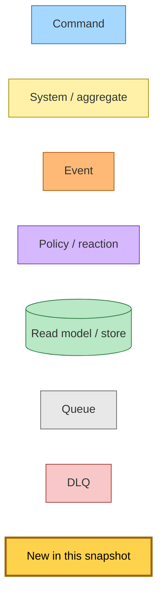

## What asks for a selection

Three things put past-reads work on the queue. Only the first two publish the command.

**The reader's visit.** Every owner-reader render carries a hidden form inside the section, including the render that shows a reader-failure notice. The form posts to `POST /queue/:id/topic-reads`. htmx fires it on load and discards the reply. A second form — the visible "Find previously read on this topic" button — is emitted inside a `<noscript>` block, but only while the section has no rows, and that is exactly the state in which the whole section carries its hidden class and is `display: none`. The button is therefore in the markup and never visible, so a reader without JavaScript has no working way to ask for a selection; their section fills only if a save's `QueueEntryCreated` already computed it.

The route sits behind the router-wide sign-in middleware. An HTML request needs a session and is otherwise answered `303` to `/login`; a Siren request needs a valid bearer token and is otherwise answered `401` with a Siren error and a `WWW-Authenticate` header. A Siren client holding a valid token can therefore reach the POST, and, sending no `HX-Request` header, gets the redirect branch. The route carries none of the save gates, so a locked or read-only account can still request a selection. It looks the article up in the reader's **default** list and publishes only when it finds the row. An unparseable or unowned id publishes nothing and still answers 204 to htmx, or 303 back to the reader otherwise.

The route checks nothing else: not read status, not dismissal, not staleness. It asks on every open and leaves "has anything changed" entirely to the worker's fingerprint. Some further details:

- **The `readlist` field.** The command carries `readlist` only when the request's `queue` param names a non-default list. The compute URL the page renders never carries that param, so the page's own requests never set the field.
- **Bus failures.** The publish is not caught in the route, so a bus failure fails the request.
- **The redirect target.** The 303 keeps only the native-surface markers and drops any `queue` param, so a non-htmx submit lands on the default-list reader.
- **Local development and tests.** The publisher only records the command, so no selection runs outside a deployed stage. The read side is faked too — see *Candidates and links*.

**The poll.** While the section is pending, it re-fetches its fragment every three seconds and swaps the whole fragment in. The fragment re-renders the same hidden form. In htmx a `load` trigger fires the first time an element is initialised, and a swapped-in fragment is a new element. So each successful poll swap publishes one more command. That continues up to the 300-poll budget, plus one final request from the fragment that settles. This follows from htmx's trigger handling. Nobody has watched it happen in a browser, and no test counts the requests.

**A save, without the command.** The shared accept phase publishes `QueueEntryCreated` under the same two gates as before: the save created the reader's row, and the provenance is not import. The worker runs the past-reads pass on that fact alongside Next read, so a new save can have its section computed before the reader first opens it. Filing an existing article into another list publishes neither message.


Mermaid source

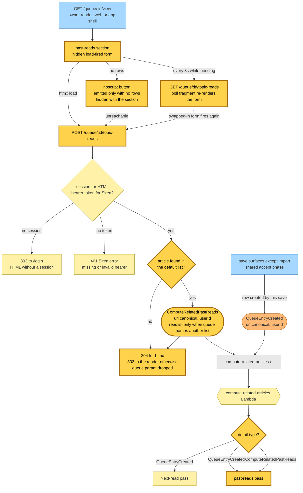

## End-to-end flow

The past-reads pass handles both message types the same way. It parses either one with the command's detail schema, since `QueueEntryCreated`'s `{url, userId}` fits that schema, and it never reads `readlist`.

**Waiting on the target.** The pass shares Next read's target lookup:

- **Purged target.** The pass logs and acknowledges the record. It writes nothing and publishes nothing. Next read, by contrast, records a terminal skip here.
- **Absent target, or crawl still pending.** The pass throws, the record is redelivered after the 300-second visibility timeout, and it dead-letters after three receives. "Absent" covers both no row at all and a present, unpurged row that fails the describable shape — title, site name or excerpt missing or not a string. A malformed row never settles, so every request for that article dead-letters instead of waiting for anything, and the Next-read pass on the same `QueueEntryCreated` record is dragged into the same retries.
- **Crawl failed or unsupported.** The pass does not wait for these.

**The fingerprint.** The pass gathers the candidate pool (next section), then fingerprints its inputs with SHA-256. The input is the selector version, the target's url, title, site and description, and the sorted candidate urls. The target's description is its summary, else its summary excerpt, else its excerpt — the same fallback candidates use. So the open article's own summary landing after a result was stored changes the fingerprint and forces exactly one recompute with a model call, including for a result precomputed at save time. If the fingerprint equals the one stored on the row, the pass publishes `RelatedPastReadsComputed` with outcome `unchanged` and zero counts, writes nothing, and stops.

**Empty results without a model call.** On a changed fingerprint, two cases store an empty result with the new fingerprint and never call the model:

- The target still carries its placeholder title.
- The target's title and description match a read candidate in this pool whose site differs. The check indexes only the pages handed to this call, and the past-reads pass hands it no unread candidates, so a boilerplate or block page that matches only an unread save, or another reader's article, is not caught and the model is called for it.

Candidates whose text is shared across sites are filtered out of the pool before the call.

**The model call.** The pass then makes one call through the same selector machinery Next read uses: the same DeepSeek `deepseek-flash` client in JSON-object mode, the same message shape and the same validation. It passes its own prompt and puts every candidate under the past-reads heading. The rules for the answer:

- **No floor.** An empty or thin pool is still sent, and the prompt treats zero picks as the normal answer.
- **At most three picks.** Picks beyond three are dropped, and so are out-of-range or duplicate indexes, without a log line. Reasons are clipped to 120 characters.
- **Unreadable answers retry.** An answer with no text, invalid JSON or a shape mismatch throws for redelivery.

**The write.** The result is written to the open article's save row with a conditional update:

- **Stored.** The pass publishes `ready` with the match count and token counts. Stored empty results publish `ready` too.
- **Superseded.** The pass logs and publishes nothing. Nothing earlier checks that the save row still exists: a missing row reads back as having no fingerprint, so a save deleted before the worker ran — or one whose default-list row never existed — still costs a full gather and a model call, and is only caught here, again on any redelivery of the record.
- **Any throw is a batch failure.** Every step above sits inside one per-record guard: parsing the detail and the user id, the target lookup, listing the reader's lists, querying the read index, batch-hydrating candidates, reading the stored state, the model call (transport and HTTP errors as well as unreadable answers), the conditional write and the publish. Each throw fails that record, which is redelivered and dead-letters after three receives. A publish that fails *after* a write stored its result is not replayable as `ready`: on redelivery the stored fingerprint now matches, so the pass publishes `unchanged` and that write's `ready` event is never emitted.

Nothing ever writes a failed state. A record that exhausts its receives leaves the row as it was: still pending if it was never computed, or holding the previous result.


Mermaid source

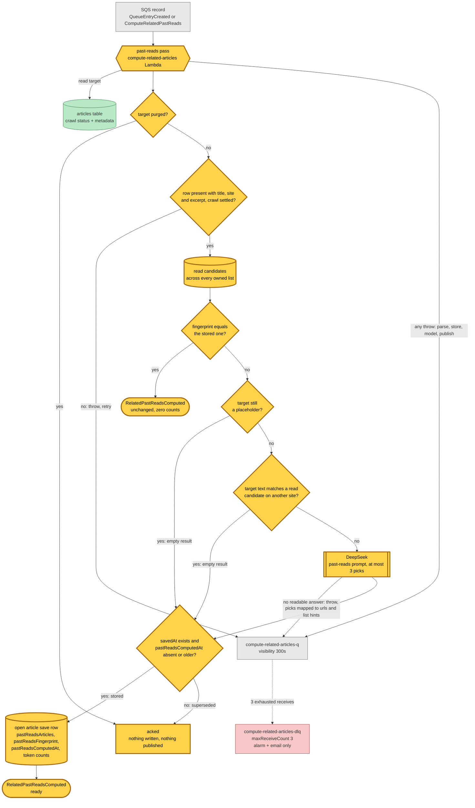

## Candidates and links

**The pool.** The pool is the reader's reading history. The pass lists the reader's owned lists from their definition rows (a consistent read) and visits the default list first, then each owned list in creation order. For each list it queries that list's partition on `userId-readAt-index`, newest read first. That index only holds rows marked read, because marking an article unread removes `readAt`.

**Merging lists.** The open article is excluded by its canonical url. Each list is capped at 1,000 rows. That cap loses nothing, because a url in the reader's newest 1,000 reads overall is also in its own list's newest 1,000. When the same canonical url was read in several lists, the strictly newer `readAt` wins and tags the candidate with its list. On a tie, the list visited first keeps it.

**Trimming and hydrating.** The merged set is sorted newest first, with url as the tie-break, and sliced to 1,000 *before* the candidates are read from the articles table. Hydration then drops rows that fail the schema, purged rows and rows still carrying a placeholder title, and nothing backfills them. Placeholders whose crawl is still pending are counted, but the past-reads pass ignores that count. A candidate's description is its summary, else its summary excerpt, else its excerpt.

**Storage.** The result lives on the open article's row in the user-articles table, keyed by the bare user id and the canonical url, which is the default-list partition. The pass writes these attributes:

- `pastReadsArticles`: each entry holds a url, a reason and an optional list hint
- `pastReadsFingerprint`
- `pastReadsComputedAt`
- `pastReadsInputTokens`
- `pastReadsOutputTokens`

They sit beside Next read's `relatedStatus`, `relatedArticles`, `relatedComputedAt`, `relatedDismissedAt` and `relatedDismissedSuggestionId`, and the pass never touches those. The update requires `savedAt` to exist and `pastReadsComputedAt` to be absent or strictly older than the new value — a stored timestamp equal to the new one is also rejected. A failed condition is reported as superseded.

**Reading it back.** When the page renders, the stored result is re-checked rather than trusted:

1. A row with no `pastReadsComputedAt` is pending.
2. A computed row with no stored matches is ready and empty, and nothing more is read.
3. Otherwise every stored match is batch-read against every list the reader owns. A match survives only if it is marked read in at least one list and its article row can still be linked: it has a route id, title and site, and is not purged. Stored order is kept.

**Where each link opens.** Each surviving match opens in the first list, in priority order, that currently holds its url in any status. The order is the list the reader is viewing, then the default list, then the owned lists by creation. The default list is written as no `queue` param. In the deployed store the list hint written with each match is never consulted for this.

Each row links to `/queue/:id/view`, keeping any app-shell markers and adding a `queue` param when the destination is not the default list. The link is tagged `utm_source=reader`, `utm_medium=internal`, `utm_content=topic-read` and `utm_term=<source article id>`, and opens as a boosted navigation that swaps `main`.

**Local development and tests read a different store.** The local server, the hutch route tests and the e2e server resolve past reads through an in-memory fake rather than the deployed store, and the fake behaves differently on both points above: it checks read status only through the default list, and it uses the stored list hint directly as the link destination, ignoring the viewing list and the priority order. The route test for cross-list links depends on that — it seeds a match read only in the default list with the hint `work` and expects the link to carry `queue=work`, where the deployed store would send it to the default list. Cross-list destination resolution is therefore covered only by the article store's own unit tests. The e2e server additionally seeds results directly through `POST /e2e/seed-past-reads`, which writes the fingerprint `e2e-seeded`.


Mermaid source

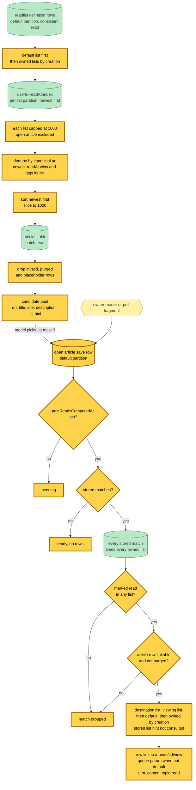

## Read side

**Opening the reader.** The owner reader resolves ownership in the list named by its `queue` param. Non-owners and anonymous visitors are redirected to the public `/view/<url>` before anything else loads. For the owner, the page stamps the view and then loads four things in parallel: Next read, past reads (passing the list being viewed), reader state and list filing. A store error while loading past reads is logged and treated as pending. The section's first poll URL is always set and never depends on Next-read dismissal. Next read's poll URL, by contrast, is set only when the card has not been dismissed. Past reads is loaded on **every** owner open, before the reader state is known: when that state carries a failure notice, the loaded result is thrown away and replaced with ready-and-empty with no poll — store errors from that discarded read are still logged — while the compute form is still rendered.

**The section.** The section sits inside the article body, after the summary slot and before the body slot, in both the web-shell and app-shell renders.

- **Visibility comes from rows, not status.** With no rows it is `display: none` and reserves no space. With rows it shows the "Previously read on this topic" eyebrow and up to three links, each with its title, site and reason.
- **Status only drives polling.** A pending section with a poll URL fetches every three seconds and swaps itself out whole.
- **A ready section never polls.** So when a section opens already ready, the recompute its own load-fired request asks for shows up on the reader's *next* open, not on this one.

**The poll fragment.** `GET /queue/:id/topic-reads` is a pure read behind sign-in.

- **Lookup.** It looks the article up in the default list and answers 404 with an empty body when that misses.
- **Budget.** It clamps the poll count to 300 and emits the next poll URL only while under that budget.
- **Destination lists.** It resolves destinations with the viewing list taken from `queue`. The poll URL never carries that param, so fragments rank the default list first. A match owned in both the default list and the viewed list can therefore open in a different list once a poll resolves it than a first render would have picked.
- **No notice check.** The fragment renders from the store read alone; the reader-failure notice is a page-level decision that the fragment never sees.
- **Caching.** It answers with a weak ETag and `private, no-cache`, and a matching `If-None-Match` gets 304.

**Caching the reader page.** The reader page's own cache decision ignores past-reads state. "Settled" considers only the reader poll, the summary poll and whether Next read is pending. A cached page still carries its own poll and compute request.

**What gets nothing.**

- **Public and admin views.** The public `/view/*` reader and the admin recrawl preview render the article body without the section: no markup, no poll, no compute request.
- **Other surfaces.** No Siren API route or MCP tool exposes past reads, and MCP's `get_related_articles` reads Next read only.
- **Dismissal.** Past reads has no dismissal of its own. Dismissing Next read writes only Next read's own dismissal attributes — `relatedDismissedAt`, plus `relatedDismissedSuggestionId` when the post carries a suggestion id and a removal of that attribute when it does not — and never touches any `pastReads*` attribute.

**Two names that look related.** The existing `readplace-related-past-reads` analytics dashboard, and the experiment constant of the same name, predate this section. They measure Next read's past-read fallback. No widget targets `utm_content=topic-read` by name at this commit, but the dashboard's generic "internal clicks by section / element" widget groups every internal click by `utm_source` and `utm_content`, so topic-read row clicks are counted there as `reader` / `topic-read`. Both compute forms — the one htmx fires on load and the no-JS fallback button — are excluded from the untracked call-to-action audit; the recorded reason covers only the load-fired one, that tagging it would count a "click" on every reader open.


Mermaid source

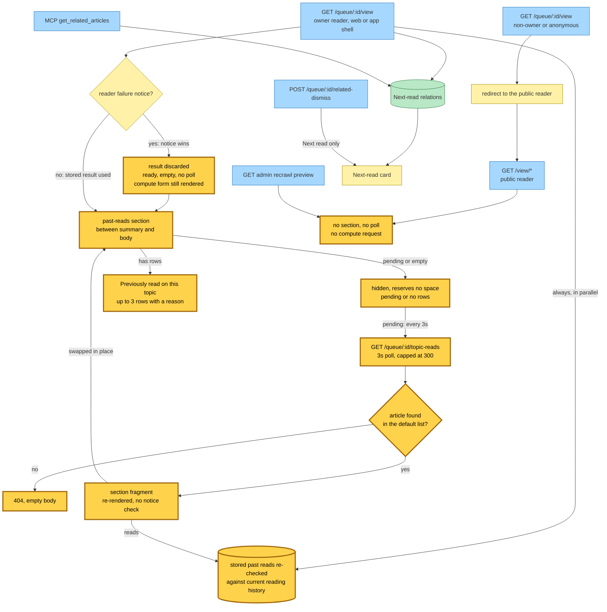

## The shared queue

Past reads added no queue, no Lambda, no GSI, no environment variable and no IAM grant. It extends the `compute-related-articles` worker, and one subscription now puts two rules on that worker's queue:

- **`compute-related-articles-rule`** matches `hutch.save-article` / `QueueEntryCreated`. Its name stays pinned to the consumer rather than the event, so the rule was not replaced.
- **`compute-related-past-reads-rule`** matches `hutch.save-link` / `ComputeRelatedPastReads`. The command's source is `hutch.save-link` even though the hutch web Lambda publishes it, using its existing bus-wide publish grant.

Each rule has its own target on `compute-related-articles-q`, with `compute-related-articles-dlq` as the target's dead-letter queue. The subscription declares **one** queue policy, `compute-related-articles-queue-policy`, and **one** DLQ policy, `compute-related-articles-dlq-policy`. Each allows `events.amazonaws.com` to `sqs:SendMessage` when `aws:SourceArn` equals either rule's ARN.

**The queue, the Lambda and the grants.**

- **Queue.** Visibility timeout is 300 seconds. The DLQ keeps the default three receives and 14-day retention, and it has an alarm with an SNS email and no consumer.
- **Lambda.** 256 MB, 300-second timeout, batch size 1, with partial batch failures reported.
- **IAM.** The existing grants already covered the new reads and writes: get and batch-get on the articles table, and get, batch-get, query and update on the user-articles table and its indexes. The worker's bus-wide publish grant covers `RelatedPastReadsComputed`.

**Dispatch.** The Lambda reads each record's `detail-type`:

- A `QueueEntryCreated` record goes to the Next-read pass and then to the past-reads pass.
- A `ComputeRelatedPastReads` record goes only to the past-reads pass.
- Any other detail type reaches neither pass and is acknowledged without work. Neither rule can deliver one today.

**Retries.** Failures from both passes merge into one set, so a record that fails either pass is redelivered whole, and both passes run again. The pass that already succeeded still runs: Next read cache-hits its terminal status, but past reads repeats the target lookup and the whole candidate gather — the definition rows, every owned list's read index, and the batch hydration — before it compares fingerprints, and publishes `unchanged` only if the target text and the candidate url set are still identical. If either changed between receives (the target's summary landed, the reader marked something read), it calls the model again and writes again. A pass that earlier ended as purged or superseded stored no fingerprint at all: a purged target is simply acknowledged again, and a superseded run can spend another model call before failing the same condition. A record that exhausts its receives dead-letters both computations at once.

The body is JSON-parsed for dispatch outside any per-record guard, so a body that is not JSON fails the whole invocation instead of one item.

**Timeouts.** Each DeepSeek request *attempt* aborts at 240 seconds, inside the 300-second Lambda timeout, and the shared constant that carries both numbers records the intent that the client give up first. The client is built without a retry setting, so the SDK's default of two retries applies and a timed-out or failed attempt is retried while retries remain. One selector call is therefore not bounded below the Lambda timeout: what ends a hung call is the 300-second invocation timeout, not a DeepSeek error, and an invocation timeout fails the whole record with no partial batch response. A `QueueEntryCreated` record can run two such calls in a row inside that single budget. Each pass skips its call on a cache hit and on its empty-result branches. No call durations were measured.

**Outside the Lambda.** An offline simulation harness reuses the same read-candidate gather, the same past-reads prompt, the same boilerplate-filtered selector and the same fingerprint against the production account (it asserts the production profile and refuses static credentials), calls DeepSeek, and writes only a local report file. It writes no rows and publishes no events.


Mermaid source

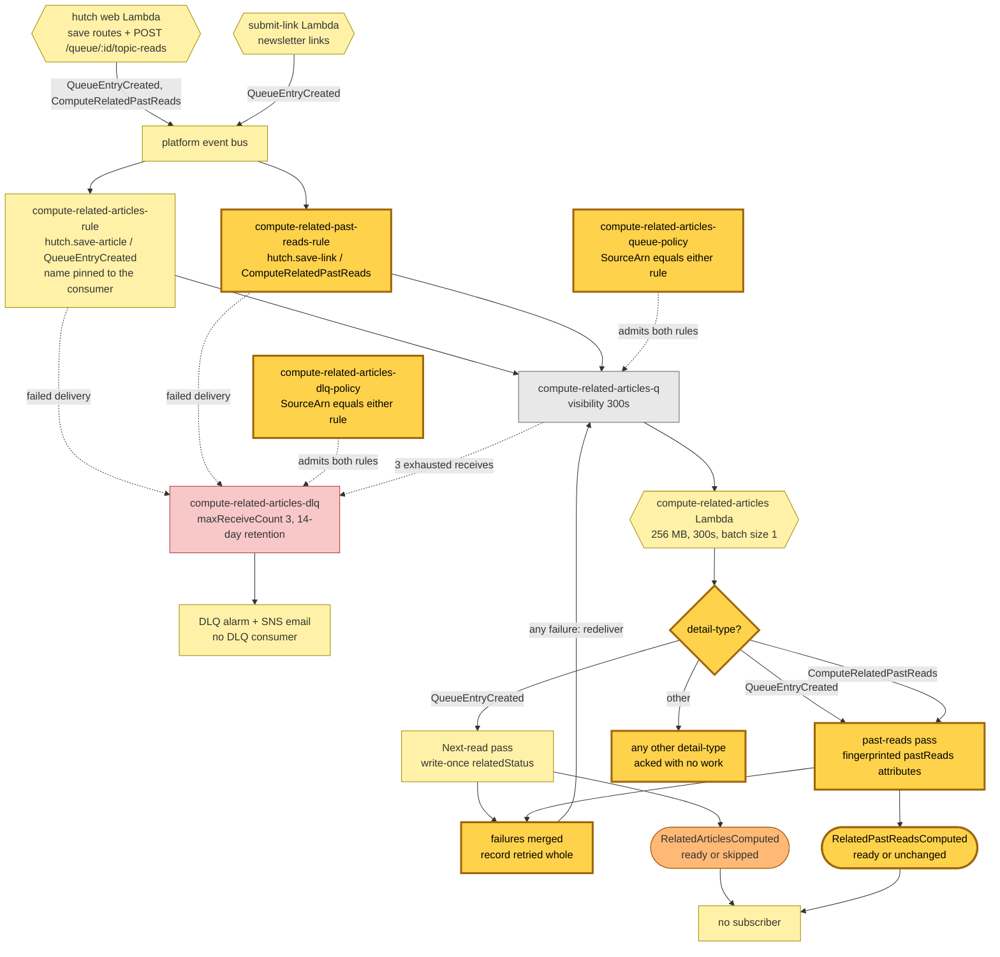

## Command → System → Event(s) reference

| Command / Event | Handled by | Emits | Triggers next |
|---|---|---|---|
| **ComputeRelatedPastReads** (new): `hutch.save-link` / `ComputeRelatedPastReads`, `{url, userId, readlist?}`. `url` is canonical. Published only by `POST /queue/:id/topic-reads` from the hutch web Lambda | `compute-related-articles` Lambda, past-reads pass only, fed by `compute-related-articles-q` off `compute-related-past-reads-rule` | `RelatedPastReadsComputed` (`ready` or `unchanged`). Nothing when the target is purged, the write is superseded, or the pass throws | nothing |
| **RelatedPastReadsComputed** (new): `hutch.save-link` / `RelatedPastReadsComputed`, `{url, userId, outcome, relatedCount, inputTokens, outputTokens}`. `outcome` is `ready` or `unchanged`; there is no skip | no subscriber | — | — |
| **QueueEntryCreated** (consumer extended): `hutch.save-article` / `QueueEntryCreated`, `{url, userId}`. `url` is canonical | `compute-related-articles` Lambda, Next-read pass then past-reads pass on the same record, fed off `compute-related-articles-rule` | `RelatedArticlesComputed` (`ready` or `skipped`) and `RelatedPastReadsComputed` (`ready` or `unchanged`) | nothing |
| RelatedArticlesComputed (unchanged): `hutch.save-link` / `RelatedArticlesComputed` | no subscriber | — | — |
| SubmitLinkCommand (unchanged) | `submit-link` Lambda, running the shared accept phase for newsletter links | `QueueEntryCreated` when it created the reader's row, alongside its other facts | both related passes |

## Decisions worth recording

**Past reads is its own selection, not a second tier of Next read.** Next read ranks unread saves ahead of read ones, writes once and can be dismissed. The topic section answers a narrower question: which articles the reader has already *finished* discuss this same subject. It answers under a stricter prompt that expects no match for most articles, over read articles only, with its own model call, its own attributes and its own events. It never reads or writes `relatedStatus`, so dismissing Next read, or Next read skipping a small library, changes nothing here. It has no comparison floor: Next read needs fifty saves, while past reads sends whatever pool exists. A placeholder target or a boilerplate page is stored as an empty *ready* result carrying the fingerprint, not as a skip. When the crawl later replaces the placeholder title, the fingerprint changes and the next request recomputes.

**The pool is reading history across every list, deduped by canonical identity.** A read article counts wherever the reader read it, and an article read in two lists appears once, tagged with the list of its newest read. Capping each list at the overall limit before merging is exact, not approximate: the newest 1,000 reads overall are each within their own list's newest 1,000. The slice happens before hydration, so dropped placeholders or purged rows shrink the pool rather than being backfilled.

**Recompute when inputs change, and never let an older answer win.** Next read's write is terminal-once. Past reads is recomputable: a fingerprint over the selector version, the target's text and the exact set of candidate urls decides whether a request does any work. The conditional write accepts a result only when its timestamp is strictly newer than the stored one, and only while the save row still exists — but that existence check happens at the write, after the gather and the model call have already been paid for. Marking another article read or unread changes the candidate set and so invalidates the cache. The target's own text is in the fingerprint, so the open article's summary landing after a result was stored forces exactly one recompute; a *candidate's* summary landing later does not. Bumping the selector version invalidates everything.

**GET never computes; the reader's visit is the request.** The poll fragment is a pure read, so conditional GET is safe. The only request for work is the load-fired POST, sent on every open, and the worker's fingerprint is what makes that cheap when nothing changed. The price is that a pending section's poll swaps re-fire the POST, so a first open can publish a command every three seconds until a result lands.

**The section polls regardless of Next-read dismissal.** Next read's poll is withheld once the card is dismissed. The topic section keeps its own budget and has no dismissal control, and dismissing Next read writes only Next read's own attributes. Its styling is deliberately plain: no thumbnails, dates, read badges, dismiss controls or card backgrounds.

**Links resolve to wherever the reader owns the match now.** The deployed render re-checks every stored match against every list the reader owns. It keeps only matches still marked read somewhere, and sends each to the list being viewed, else the default list, else the oldest owned list that holds it. A match that was moved, unread or deleted since selection is corrected or dropped immediately, without waiting for a recompute. The list hint written with each match is not used for this — except in local development and the route tests, whose in-memory store trusts that hint and only looks at the default list, which is why the resolution rule is covered by the article store's own unit tests rather than by route tests.

**Reading history never reaches a page someone else sees.** The result lives on the reader's own save row, so it is removed together with the save. The section renders only when the owner reader supplies its list-aware link builder. The public `/view` reader, the admin recrawl preview and the redirect that non-owners get all render the article body without it.

**One queue, dispatched by detail-type.** The pass reuses the worker's target lookup, selector machinery, DeepSeek client, table grants and environment, so no infrastructure was added. The cost is coupling. The two passes share one retry budget and one dead-letter queue, a failure in either redelivers both, and a `QueueEntryCreated` record can put two model calls — each of which the SDK may retry past its own 240-second attempt timeout — inside one 300-second invocation.

**One subscription per queue, because SQS keeps one policy per queue.** The feature first subscribed the queue a second time, the way a single-event consumer subscribes. Each subscription declared its own queue policy and DLQ policy, each listing only its own rule, and SQS holds exactly one policy per queue, so the later write replaced the earlier one. In staging and prod the live queue and DLQ policies admitted only `compute-related-past-reads-rule`. Deliveries of `QueueEntryCreated` to Next read would have been denied, and the past-reads-only DLQ policy would not have admitted them to the target's dead-letter queue either. No save matched the rule in that window, so nothing was lost. The fix is the single subscription above, whose one policy lists both rule ARNs. The `QueueEntryCreated` entry keeps its consumer-pinned rule name, so neither live rule was replaced.

**Retiring a queue policy takes two deploys.** Deleting a queue-policy resource clears the queue's policy attribute. Pulumi applies deletes after updates, and deploys run without refresh. Dropping the stray `compute-related-past-reads-queue-policy` and `compute-related-past-reads-dlq-policy` in the same change would therefore have left the queue with no policy and nothing to notice. So the fix went out in two steps:

1. **First deploy.** A transitional option kept the two stray resources declared for one deploy, carrying the same union policy and marked retain-on-delete. All four policies updated in place, with nothing deleted or replaced.
2. **Next commit.** The option and the two retained resources were removed, and Pulumi dropped them from state without touching the queue.

The steady state is one queue policy and one DLQ policy, both named for `compute-related-articles`.

## Open questions the code does not settle

**The command's own description disagrees with its use.** Its definition says new saves emit it, and that it carries the source list "so a match can be resolved back into an owned list". In code, saves emit `QueueEntryCreated` instead. The page never sets `readlist`, the worker never reads it, and destinations are resolved at render.

**A reader without JavaScript has no way to ask.** The fallback form is emitted only in the state where the section is hidden, so its button never renders visibly and nothing says whether that was intended. Were it submitted, the 303 would return to the default-list reader, dropping any `queue` param the reader arrived with.

**Articles kept only in a custom list.** This happens, for example, when an article is removed from the default list but kept in another. The owner reader resolves such an article through its list-bound lookup, but every past-reads read and write is keyed to the default-list row, and both topic-reads routes look the article up in the default list. Reading the code:

- the section stays pending;
- the POST publishes nothing and still answers 204;
- the poll answers 404.

htmx does not swap a 4xx response by default, so the section would keep re-polling the same first poll URL every three seconds without ever spending its budget, for as long as the page stays open. Next read's poll shares the same default-list lookup. No test covers this case.

**Re-requests while the target's crawl is pending.** Each command the poll re-fires waits by redelivery, so a crawl that stays pending beyond three receives would dead-letter every one of them into the alarm. A target row that is present but malformed never settles at all and dead-letters the same way. Before the first result is stored, commands that overlap all miss the cache, and each can run its own selection. The monotonic write keeps the last one stored. The volume this produces has not been measured.

**No save gates on the POST.** `POST /queue/:id/topic-reads` has no locked-account or write-access gate, and no comment or test says whether that is intended.

**One invocation, up to two model calls, none of them bounded.** A `QueueEntryCreated` record can make two DeepSeek calls inside one 300-second invocation, and because the client keeps the SDK's default two retries on a 240-second attempt timeout, even a single call can outlive the invocation. The Lambda timeout is what stops it, failing both passes. No duration measurements were read, and nothing records whether that budget has been approached.
