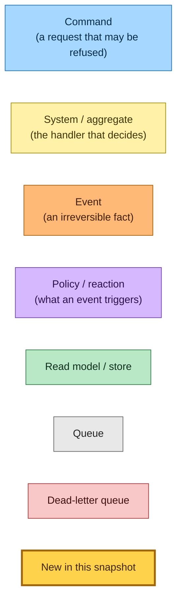
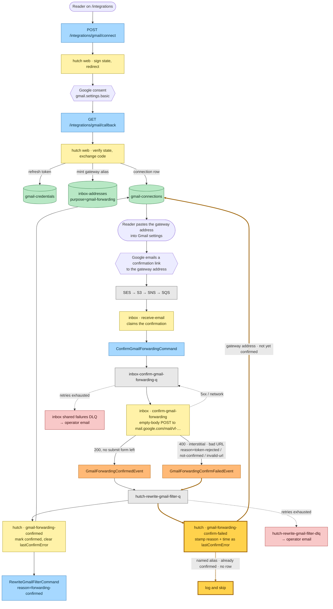
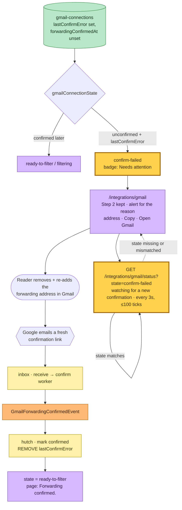

# Gmail forwarding confirmation — event storming

**Commit:** `d4a98d90` — *feat(hutch): show when each previously-read match was last read, and ship the section*
**Commit date:** 2026-09-15 · **Generated:** 2026-09-15 · **Branch:** `main`

A point-in-time map of how a reader connects Gmail, confirms the forwarding
address, and — new in this snapshot — how a confirmation that Google *rejects*
or *never completes* is recorded on the connection row, surfaced to the reader
as a "Needs attention" step 2, and recovered on its own once the reader re-adds
the address and Google confirms.

The `GmailForwardingConfirmFailedEvent` has existed and been published by the
inbox confirm worker since the Gmail integration shipped (see
[`2026-08-28-ffa98af7`](../2026-08-28-ffa98af7/)), but nothing consumed it — a
failed confirmation was observable in CloudWatch and invisible to the reader.
This snapshot gives it its first consumer.

> Captured from a dirty working tree — the whole change is uncommitted on top of
> the base commit `d4a98d90`.

---

## Legend

Every node in the diagrams below carries one of these roles. Nodes drawn with a
thick amber border (`:::new`) are the ones this snapshot introduces: the new
EventBridge subscription that routes the failed-confirmation fact into the
existing filter Lambda, the handler that records it, the `lastConfirmError` row
field and the `confirm-failed` connection state it drives, and the reader-facing
recovery surface.

Mermaid source

---

## 1. Connect, confirm, and the failed-confirmation branch

Connecting is an ordinary authenticated page action. Google issues the grant,
Readplace mints a gateway address, and the reader pastes that address into
Gmail's own forwarding settings — the one step no API can perform, because
`forwardingAddresses.create` is restricted to domain-wide-delegated service
accounts that a consumer `@gmail.com` cannot grant.

Google then emails a confirmation link to the gateway address, which lands in
Readplace's own inbound pipeline. The receive worker recognises it and hands it
to a credential-free worker that opens the link with an empty-body POST. That
worker has four terminal outcomes: it publishes `GmailForwardingConfirmedEvent`
on success and `GmailForwardingConfirmFailedEvent` (with a reason —
`token-rejected`, `not-confirmed`, or `invalid-url`) for the three ways Google's
page can refuse; a transient 5xx/network error is left on the queue to retry and
eventually dead-letters to the operator.

**New in this snapshot:** the hutch `rewrite-gmail-filter` Lambda — which already
subscribed the *confirmed* fact — now also subscribes the *failed* fact through
one added EventBridge rule onto the same queue. A new handler stamps the reason
and a timestamp onto the connection row as `lastConfirmError`, but only when the
failed address is the connection's own gateway and the connection is not already
confirmed; otherwise it logs and skips. No new event, command, Lambda, queue,
metric, or alarm — the consumer rides the existing filter Lambda and its queue.

Mermaid source

The four amber edges are the only wiring this snapshot adds: the failed fact's
new subscription onto the existing queue (`E2 → Q2`), its delivery to the new
handler (`Q2 → S6`), and the handler's two outcomes — stamping `lastConfirmError`
on the gateway's own unconfirmed row (`S6 → R3`) or logging and skipping
(`S6 ⇢ SKIP`). Every node they touch except `S6`/`SKIP` already existed.

---

## 2. What the reader sees, and the recovery loop

`gmailConnectionState` derives the connection's state from the row. It gains one
member — `confirm-failed` — returned when the forwarding address is still
unconfirmed **and** `lastConfirmError` is set. The check sits immediately before
`awaiting-confirmation`, so a row that later confirms (which clears
`lastConfirmError`) still reads as confirmed even if a stale error lingers, and a
duplicate delivery of an already-spent link is harmless.

The Gmail page keeps Step 2 on screen for both `awaiting-confirmation` and
`confirm-failed`, so the address, Copy and Open Gmail stay available. The badge
reads "Needs attention", an alert names what went wrong and tells the reader to
remove and re-add the address in Gmail, and the poll line keeps watching. The
status route now carries a `state` representation hint so the self-updating poll
fragment names which of the two waiting states it last rendered; a poll that
names the wrong state (or none — an open tab from before the deploy) gets one
full-page redirect and comes back naming the current state. When the reader
re-adds the address and Google confirms, the page flips to "Forwarding
confirmed." on its own, exactly as it did before.

Mermaid source

---

## Command → System → Event(s) reference

| Command / Event | Handled by | Emits | Triggers next |
|---|---|---|---|
| `POST /integrations/gmail/connect` | hutch web | — (303 to Google) | reader completes consent |
| `GET /integrations/gmail/callback` | hutch web | — (303 back to the list) | writes credentials, gateway alias, connection row |
| `ConfirmGmailForwardingCommand` | inbox · confirm-gmail-forwarding | `GmailForwardingConfirmedEvent`, `GmailForwardingConfirmFailedEvent` | on success, the filter rewrite; on failure, the new consumer below |
| `GmailForwardingConfirmedEvent` | hutch · rewrite-gmail-filter Lambda (confirmed handler) | `RewriteGmailFilterCommand` | marks the connection confirmed and clears `lastConfirmError` first |
| **`GmailForwardingConfirmFailedEvent`** | **hutch · rewrite-gmail-filter Lambda (confirm-failed handler)** *(new consumer)* | — | **stamps `lastConfirmError` on the gateway's connection row; the page surfaces it** |
| `RewriteGmailFilterCommand` | hutch · rewrite-gmail-filter | `GmailFilterRewrittenEvent`, `GmailFilterRewriteFailedEvent` | terminal |
| `GmailFilterRewriteFailedEvent` | *(no consumer)* | — | surfaced on the page via `lastFilterError` |
| `DisconnectGmailCommand` | hutch · disconnect-gmail | `GmailDisconnectedEvent` | terminal |

`GmailForwardingConfirmFailedEvent` is the only wiring change: it joins
`RewriteGmailFilterCommand`, `GmailForwardingConfirmedEvent` and
`DisconnectGmailCommand` as the fourth detail type routed to the single hutch
`rewrite-gmail-filter` Lambda behind one SQS queue and one DLQ, split by
`detail-type` at the composition root. It carries its own stack-prefixed
EventBridge rule (`hutch-gmail-forwarding-confirm-failed`), so the rule can never
be silently upserted over another stack's. The Lambda already reads and updates
the `gmail-connections` table, so no new environment variable, table, or IAM
statement is added — the infrastructure preview is one new rule, one new target
on the existing queue, and the queue/DLQ policy growing by one source ARN, with
nothing replaced or deleted.

---

## Stores

| Store | Stack | Keys | Written by |
|---|---|---|---|
| `gmail-credentials` | hutch | hash `userId` | callback, disconnect |
| `gmail-connections` | hutch | hash `userId`, sparse `connected-index` | callback, confirm, **confirm-failed (new: `lastConfirmError`)**, rewrite, disconnect |
| `inbox-addresses` | inbox | hash `address`, `userId-index` | callback (gateway), sender mapping |

`lastConfirmError` is a new optional attribute on the `gmail-connections` row:
`{ reason, at }`, where `reason` is exactly the failed event's enum. It is
written by the new confirm-failed handler and removed by
`markForwardingConfirmed`, so a confirmation that lands after a failure leaves a
clean row. A missing attribute reads as `undefined`, so rows written before the
deploy stay `awaiting-confirmation` with no backfill.

---

## Known gaps at this commit

- **A confirmation that never arrives at all still reaches only the operator.**
  When Google is unreachable for every attempt, the confirm command dead-letters
  to the inbox shared failures DLQ and pages the operator; the reader gets the
  generic poll-exhausted copy, not a specific message. Reaching the reader from
  there would need the DLQ Lambda to publish onto the bus or write into another
  stack's table, and no such failure has been observed.
- **A failed confirmation of a *named* inbox alias is not stamped.** The new
  consumer marks the connection only when the failed address is the connection's
  own gateway, mirroring how the confirmed handler decides what to mark.
- **The three earlier gaps from `2026-08-28-ffa98af7` that remain:** account
  deletion still does not touch the Gmail stores; there is still no consumer for
  `GmailFilterRewriteFailed` or `GmailDisconnected`; and the filter query length
  cap is still unmeasured. Only the confirm-failed leg of "no consumer for the
  terminal facts" is closed here.
