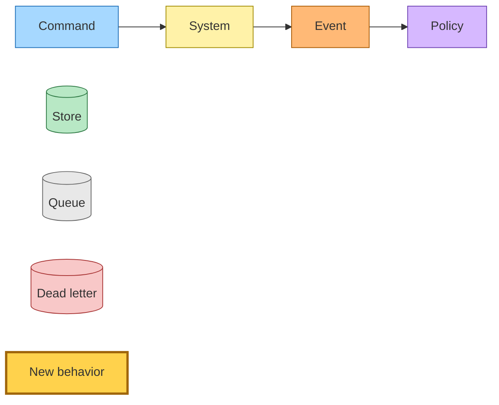
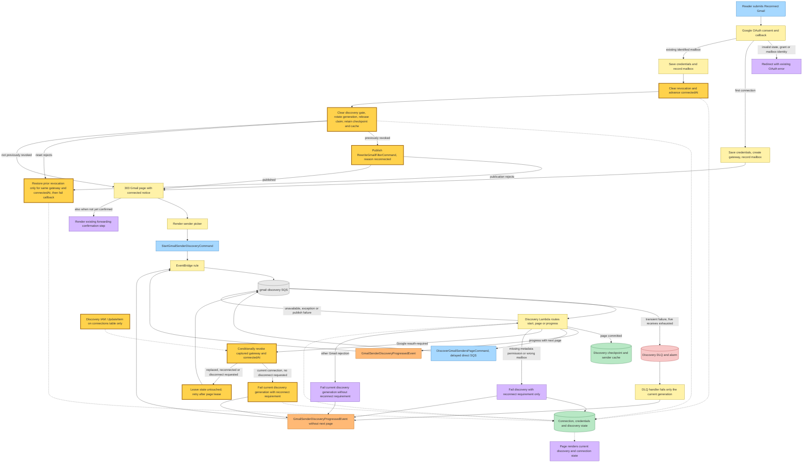
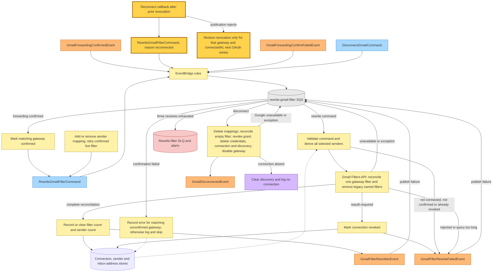

# Gmail reconnect restoration

Base commit: `4cfb5f1c3`, 2026-09-18, `main` — `fix(hutch,@packages/domain)!: use private reader URLs in MCP`.

Generated 2026-09-18 from the dirty working tree. The Gmail reconnect restoration and review fixes documented here are uncommitted on top of that base commit.

A successful Gmail reconnect must restore the state that caused the reader to reconnect: the sender picker is available again, discovery resumes from its saved checkpoint, and a previously revoked grant triggers one whole-state filter reconciliation. Gold identifies this snapshot's new behavior. Other colors retain the shared event-storming roles.

## Legend

Mermaid source

## Callback recovery and sender discovery

The authenticated reader posts the existing reconnect form, completes Google consent, then returns to the callback with its signed state cookie. Invalid state, unusable grants and unavailable account identity redirect with the existing errors. The callback retains the existing identity guard: a different mailbox or an existing connection without a recorded mailbox is rejected before credentials change. A first connection saves credentials, creates a gateway connection and records its mailbox. An existing connection saves credentials and records its mailbox before clearing revocation and advancing `connectedAt`. It then clears the discovery reconnect flag, assigns a fresh random generation and removes the page claim in one update. This update requires the state row to exist, so it never creates an incomplete checkpoint; it retains the state, cursor, cached senders and history baseline while allowing a running scan to resume immediately.

For a previously revoked connection, the callback publishes the filter-rewrite command before returning its success redirect. If resetting discovery or publishing rejects, it conditionally restores revocation for the same gateway and the `connectedAt` it just wrote, then propagates the error. A subsequent OAuth attempt can therefore retry reconciliation; an intervening reconnect, disconnect request or replacement connection cannot be revoked by that callback's recovery write. Credential or mailbox-persistence failures happen before the previous revocation marker is cleared.

The callback redirects using the existing notice URL. The Gmail page's existing load-triggered form then publishes discovery asynchronously. Discovery captures the connection before calling Gmail. A reauth result conditionally revokes only that gateway and `connectedAt`, provided disconnect has not been requested. When the conditional write loses, it leaves discovery state untouched and fails the record for redelivery: the queue's 90-second visibility window outlasts the 60-second page lease, and stale generations are ignored. Advancing the connection timestamp before rotating discovery's generation closes both possible orderings: an old worker cannot revoke the replacement grant, and an old worker that revoked just before reconnect cannot later mark the new discovery generation failed. A current failed grant retains its checkpoint and reconnect requirement. Missing metadata permission and a mismatched mailbox remain reconnect requirements without revoking forwarding. Discovery now has a dedicated `UpdateItem` grant for the connections table; credentials remain read-only and no index permission is added.

Mermaid source

## Whole-state filter reconciliation

The filter-rewrite command remains one command with an additive `reconnected` reason. The reason is informational to the handler's log; the worker derives the full current selected-sender set from stored mappings. All selected senders forward to the one confirmed gateway address, with sender-to-inbox routing handled on receipt. The worker reads Gmail's own filters to identify ownership, including legacy filters pointing directly to the reader's inbox addresses, and replaces those with the gateway filter. It creates and reads back a replacement before deleting old filters; an empty selected set deletes owned filters. Consequently, one command corrects any number of sender changes accumulated while the grant was revoked.

The callback publishes that command only when the connection it read before clearing state had `revokedAt`. A normal scope upgrade and a reconnect prompted only by discovery metadata access do not request a filter rewrite. Existing publishers continue to use the same command: confirmation of a forwarding address, adding a sender, removing a sender, and the reader's filter-retry action (`retry-requested`), which requires confirmation and an unrevoked connection. The existing shared queue also handles forwarding-confirmation failures and disconnect requests. No EventBridge rule, queue, Lambda, DLQ or table is added; one scoped connection-update IAM policy is added to discovery.

Mermaid source

## Command → System → Event(s) reference

| Command or event | System | Event(s) emitted | Next command(s) |
|---|---|---|---|
| `StartGmailSenderDiscoveryCommand` | Gmail discovery Lambda starts or resumes a checkpointed mailbox scan | `GmailSenderDiscoveryProgressedEvent` | The progress reaction directly dispatches `DiscoverGmailSendersPageCommand` when another page exists. |
| `DiscoverGmailSendersPageCommand` | Gmail discovery Lambda claims and processes the requested generation/page | `GmailSenderDiscoveryProgressedEvent` | The progress reaction directly dispatches the next page when present. |
| `GmailSenderDiscoveryProgressedEvent` | Gmail discovery progress reaction | None | Direct SQS `DiscoverGmailSendersPageCommand` when `nextPage` exists; otherwise no action. The page independently reads stored state. |
| `RewriteGmailFilterCommand` (`forwarding-confirmed`, `sender-added`, `sender-removed`, `retry-requested`, `reconnected`) | Rewrite-filter Lambda reconciles all selected senders into the confirmed gateway filter and removes legacy owned filters | `GmailFilterRewrittenEvent` on success; `GmailFilterRewriteFailedEvent` on terminal failure | None. Unavailable Gmail responses, exceptions and failed event publication retry the same SQS record. |
| `GmailForwardingConfirmedEvent` | Forwarding-confirmed handler marks the connected gateway confirmed | None directly | Publishes `RewriteGmailFilterCommand` with `forwarding-confirmed`. |
| `GmailForwardingConfirmFailedEvent` | Shared filter Lambda records an error only for the matching unconfirmed gateway | None | None; page reads the recorded error. |
| `DisconnectGmailCommand` | Shared filter Lambda deletes mappings, runs the empty-state reconcile in process, revokes the grant and removes connection state | `GmailDisconnectedEvent` on successful teardown; no event when already disconnected | None. Unavailable Google responses retry the same record. |
| `GmailDisconnectedEvent` | EventBridge fan-out point | None in this flow | None. |
| `GmailFilterRewrittenEvent` | EventBridge fan-out point | None in this flow | None. |
| `GmailFilterRewriteFailedEvent` | EventBridge fan-out point | None in this flow | None. |

The key restoration chain is: current discovery or filter work sees a dead grant → the connection records revocation → successful reconnect clears the discovery gate, fences old discovery work and emits `RewriteGmailFilterCommand(reason: reconnected)` → the worker reconciles Gmail against saved mappings. The connection and discovery-generation fences prevent delayed failures from undoing a replacement or a completed reconnect; conditional restoration after a failed reset or publication preserves a later OAuth retry without revoking a newer connection. The identity-migration case for a connection with no recorded mailbox remains deliberately outside this snapshot's behavior: the existing callback refusal is unchanged.
