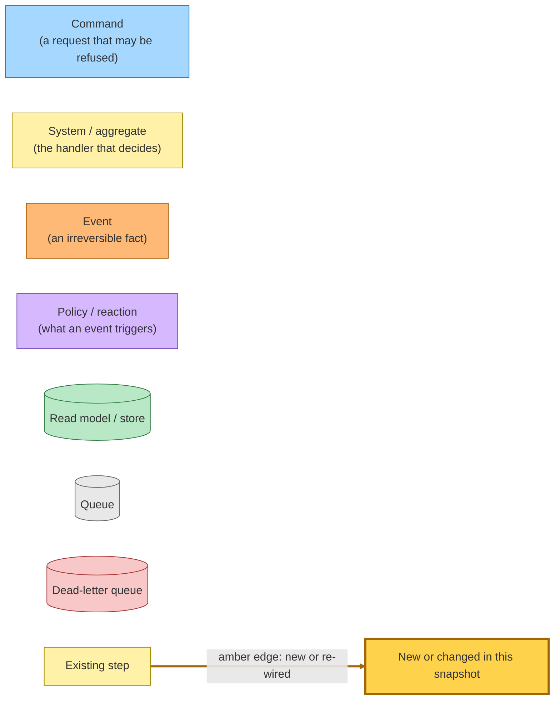
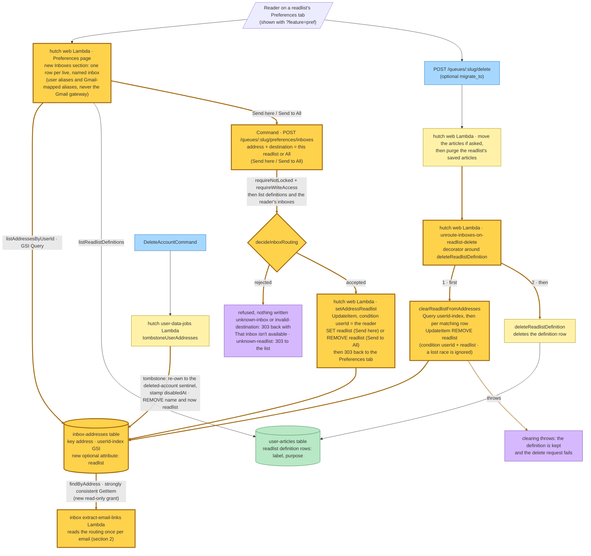
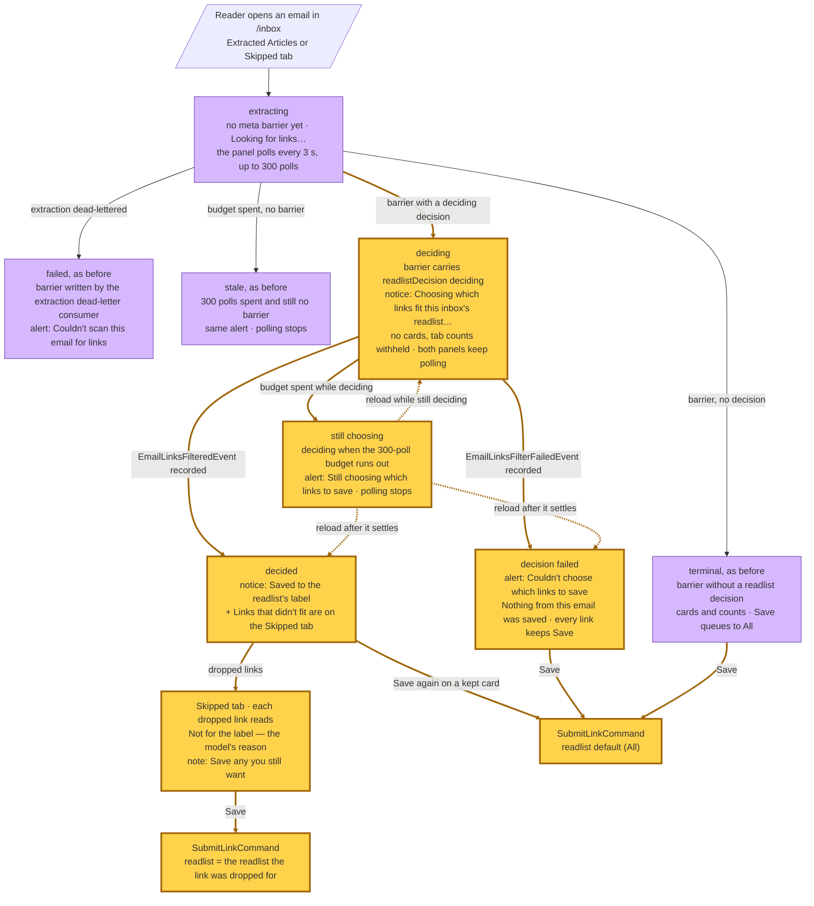

# Inbox readlist routing — event storming

**Commit:** `56b596c` — *feat: restyle the inbox to the brand guidelines*
**Commit date:** 2026-09-24 · **Generated:** 2026-09-24 · **Branch:** `rp/amazing-euler-ez42yq`

A point-in-time map of routing an inbox address to a readlist. Until now, every
saveable article link in a newsletter was saved to the reader's **All**
readlist. A reader can now route any live, named inbox — a user alias or a
Gmail-mapped alias — to one of their readlists from that readlist's
Preferences tab. Mail that arrives at a routed inbox no longer saves every
article link. The inbox extractor hands the email's saveable article links to a
new save-link Lambda in one `EmailLinksTriagedEvent`. That Lambda reads the
purpose the reader wrote for the readlist and asks DeepSeek once which links
fit it. It saves only those links, each accepted at All and then filed into the
readlist, and announces the decision as `EmailLinksFilteredEvent`. A new inbox
recorder marks the dropped links and settles the email's decision, so the
email's page can say where the links went and offer the dropped ones on the
Skipped tab. Mail to an unrouted inbox takes the same path as before.

`SubmitLinkCommand` changes with it. Its authenticated shape now **requires** a
`readlist` (`"default"` is All), so every producer states where a save goes.

> Captured from the uncommitted working tree — the whole feature is uncommitted
> on top of the base commit `56b596c`. The wire formats, the save-link filter,
> submit and dead-letter wiring, and the shared domain and store packages were
> finished at capture. Concurrent work was still editing the inbox recorder, the
> inbox email page and the hutch Preferences routing form. Every claim below was
> checked against the tree as it stood when the snapshot was taken.

---

## Legend

Every node in the diagrams below has one of these roles. Nodes drawn with a
thick amber border (`:::new`) are new or changed in this snapshot, and amber
edges (a `linkStyle` override) are new or re-wired connections. Changed
nodes include `SubmitLinkCommand`, whose wire format gained a required field,
the extractor and the submit handler, which gained a branch each, and the two
inbox tables, which gained an attribute each. Queues, DLQs and stores are drawn
as cylinders and told apart by colour, and by the words SQS or DLQ on the new
(amber) ones.

Mermaid source

---

## 1. Routing an inbox to a readlist

The Preferences tab of every readlist except All (shown only with
`?feature=pref`) gains an **Inboxes** section. It lists the reader's live, named
inboxes: user aliases and Gmail-mapped aliases. The hidden Gmail forwarding
gateway is never listed and cannot be routed. Each row's button posts `address`
and `destination` to `POST /queues/:slug/preferences/inboxes`, behind the same
`requireNotLocked` + `requireWriteAccess` gates as the purpose form. The
destination is either this readlist ("Send here") or All ("Send to All").

The handler lists the reader's readlist definitions and inboxes, then
`decideInboxRouting` refuses the request in three cases, and nothing is written:

- `unknown-readlist`: the reader does not own the readlist, or it is All, which
  has no preferences. The reader is redirected to the readlist list.
- `unknown-inbox`: the address is not one of the reader's live, named inboxes.
- `invalid-destination`: the destination is neither this readlist nor All.

The last two redirect back to the Preferences tab with the alert "That inbox
isn't available — It may have been turned off. Pick another inbox." An accepted
decision is one ownership-guarded `UpdateItem` on the inbox-addresses row
(`SET readlist` or `REMOVE readlist`), followed by a redirect back to the tab.
The row's optional `readlist` attribute is the only routing state, and a
missing attribute and `"default"` both mean All. The hutch web Lambda already
had read and write access to that table and its GSI, so the form needs no new
grant.

Two other writers stop a mapping from outliving the readlist it points at:

- **Deleting a readlist** now runs through a decorator around the
  readlist-definition delete. The decorator first clears every inbox row that
  points at the readlist: it queries the reader's addresses through the GSI,
  then sends one conditional `REMOVE readlist` per match. A row that was
  re-routed in the meantime fails its condition and is left alone. Only then is
  the definition deleted. If clearing throws, the definition survives and the
  request fails, so no inbox is left routed to a readlist that is gone.
- **Account deletion's** address tombstone already re-owned each row to the
  deleted-account sentinel, stamped `disabledAt` and stripped the alias name.
  It now also removes `readlist`.

Two things read the mapping. The Preferences page uses it to show where each
inbox goes ("Goes to &lt;label&gt;") and which button to offer. The extractor
is the only reader on the mail path: it reads the address row once per email
with a strongly consistent `GetItem`, through a new read-only grant, so a
route changed moments before a newsletter arrives is honoured.

Mermaid source

The amber edges are the routing form (Preferences page → POST →
`decideInboxRouting` → the conditional update), the decorator's
clear-then-delete order on readlist delete, the tombstone's extra `REMOVE`, and
the extractor's new read.

---

## 2. An email arrives: extract → filter → save and file → record

**Extraction.** `EmailReceivedEvent` still drives the inbox extractor. Its
`recipientAddress` is the *delivery* address: for mail forwarded through the
Gmail gateway, the receive worker has already swapped in the claimed sender's
mapped alias. A Gmail-mapped inbox therefore routes exactly like a user alias.
The extractor re-derives the body from the raw message, extracts and caps the
links, classifies them, makes its one triage call, and conditionally puts one
pending or skipped row per link, all as before. Then comes the routing gate.
The address row is read only for a real arrival (`origin: receive`) to a real
user with **full** write access. The email counts as routed when that row names
a readlist other than All and still belongs to the email's reader. A missing
address row throws, so SQS redelivers the record, and a record that exhausts its
receives gets the extraction dead-letter barrier.

**Unchanged path.** Every email that is not routed takes this path: an unrouted
inbox, an inbox routed to All, an address that has since passed to another
owner, and a read-only reader, whose routing is never read and whose saves are
held. Backfill replays and mail to the unrouted audit partition still get
previews only. Each pending link still gets a `CrawlEmailLinkPreview`. A
full-access reader gets one `SubmitLinkCommand` per saveable link whose row is
still pending, now stamped `readlist: "default"`, and one first-inbox notice. A read-only reader gets one
saves-held notice instead.

**Routed path.** This path needs at least one saveable, non-skipped article
link. The extractor publishes, in this order:

1. `CrawlEmailLinkPreview` for each pending link, unchanged, so previews still
   render.
2. One `EmailLinksTriagedEvent` with those links: ordinal, URL, and anchor text
   clipped to 120 characters.
3. One `SendFirstInboxEmailNoticeCommand`.

It then writes the link counts and, last, the meta barrier, which now carries
`readlistDecision: {state: "deciding", readlist}`. The barrier write uses
`if_not_exists`, so a redelivery never reopens a decision that has settled. No
`SubmitLinkCommand` leaves the inbox for a routed email. If a routed email has
no link left to decide on, it falls back to the unchanged path, which then has
nothing to save and records no decision.

**Filter.** `EmailLinksTriagedEvent` reaches the new save-link
`filter-email-links` Lambda on its own queue: visibility 360 s, Lambda timeout
300 s, `maxReceiveCount` 2, batch size 1. The queue dead-letters into the shared
`save-link-failures-dlq`. The Lambda's only table grant is `Query` on
user-articles, which it uses to list the reader's readlist definitions with a
strongly consistent read. It then takes one of three branches:

- **Definition missing** (the readlist was deleted after the mail arrived): it
  keeps every link, saves to All (`savedTo: "default"`, label "All"), and
  records the decision as `readlist-missing`.
- **No purpose**: it keeps every link, saves to the readlist, and records
  `no-purpose`.
- **Has a purpose**: it makes one DeepSeek call with `deepseek-v4-pro`, thinking
  enabled, in JSON-object mode. The call has a 240 s client timeout and no SDK
  retries, and output is capped at 32,768 tokens. The purpose, subject, sender
  and links go in as untrusted data. The model must label every input ordinal
  exactly once as keep or drop, each with a one-sentence reason. The kept and
  dropped sets are computed in code, and reasons are clipped to 120 characters.
  An ordinal outside the input, a repeated ordinal or an unlabelled one throws,
  and SQS retries the whole decision. This branch records `filtered`.

The filter then publishes one `SubmitLinkCommand {readlist: savedTo}` per kept
link (Event → Command) and, last, one `EmailLinksFilteredEvent` (Event → Event).
That event carries the dropped ordinals with their reasons, plus the input,
output and reasoning token counts. A failed publish fails the record before the
decision is announced. After the second failed receive, the triage
dead-letters. The failures router picks a handler by source queue, and it gains
a route that publishes `EmailLinksFilterFailedEvent` with reason
`decision-retries-exhausted` and the receive count. Nothing falls back to All.
A decision that could not be made saves nothing more.

**Save and file.** save-link `submit-link` accepts every save at All exactly as
before:

- it writes the queue row, bumps savedAt and resurfaces a read save as unread;
- it publishes `LinkQueuedEvent`, and `QueueEntryCreatedEvent` for a new queue
  entry;
- it stamps onboarding for email provenance;
- it runs the tier-1 crawl in-process.

When `readlist ≠ "default"`, it then files the accepted article into that
readlist. Filing writes a row in the readlist's partition with a newly
allocated savedAt. If the filed copy was read, it also marks the article unread
in every readlist that holds it, which is why the role gains `Query` and
`BatchGetItem` on user-articles. The dormant effect dispatcher's authenticated
`SubmitLinkCommand` now carries `readlist: "default"`.

**Record.** `EmailLinksFilteredEvent` and `EmailLinksFilterFailedEvent` reach
the new inbox `record-email-links-filtered` Lambda. Two EventBridge rules feed
one queue, which has one queue policy and the Lambda's own alarmed DLQ. The
recorder is store-only and publishes nothing:

- **Filtered.** It sets `droppedFor {readlist, readlistLabel, reason}` on each
  dropped link row. The write requires the row to exist and not be skipped;
  otherwise the recorder logs "not a candidate" and moves on. It never touches
  `status`, and the preview crawl's own `UpdateItem` never touches `droppedFor`,
  so the two writes to the same row cannot overwrite each other.
- **Settle.** It then settles the barrier from `deciding` to `decided
  {readlist: savedTo, readlistLabel}` for a filtered fact, or to `failed
  {readlist}` for a filter-failed fact. The update only applies while the
  decision is still `deciding`. If that condition fails, the recorder re-reads
  the barrier with a strongly consistent read. If there is no barrier yet, the
  decision beat the extractor (which writes its barrier after publishing the
  triage), so the recorder throws and SQS retries. If the decision has already
  settled, the fact is a no-op.

The inbox IAM boundary is unchanged. The recorder's only grant is `GetItem` and
`UpdateItem` on the email-links table, and no inbox role reads the articles or
user-articles tables.

```mermaid
flowchart TD
  RCV["inbox receive-email Lambda<br/>Gmail gateway mail is delivered as the claimed<br/>sender's mapped alias · other mail as addressed"]:::sys
  ERE["EmailReceivedEvent<br/>source hutch.inbox · origin receive or backfill<br/>recipientAddress = the delivery address"]:::evt
  QX[("inbox-extract-email-links-q<br/>SQS · visibility 240 s")]:::queue
  DQX[("inbox-failures-dlq<br/>shared DLQ · alarm")]:::dlq
  DLX["inbox-failures-dlq router Lambda<br/>markLinksExtractionFailed: barrier with<br/>extractionFailed, only if no barrier yet"]:::sys
  EX["inbox extract-email-links Lambda<br/>re-derive the body from the raw .eml · extract and cap links<br/>classify + one triage call (deepseek-flash)<br/>conditional put of pending or skipped link rows"]:::new
  ADDR[("inbox-addresses table<br/>readlist")]:::new
  LINKS[("inbox-email-links table<br/>link rows (new: droppedFor)<br/>meta barrier (new: readlistDecision)")]:::new
  GATE{"routed to a readlist,<br/>with links to decide?"}:::new
  PREV["CrawlEmailLinkPreview<br/>one per pending link, on every branch"]:::cmd
  PRVL["inbox crawl-email-link-preview Lambda<br/>setLinkOutcome: status + preview fields<br/>(never touches droppedFor)"]:::sys
  HELD["SendTrialFeedbackEmailCommand<br/>kind automation_saves_held · once per email"]:::cmd
  FIRST["SendFirstInboxEmailNoticeCommand<br/>once per email"]:::cmd
  HUTCHN["hutch send-trial-feedback-email and<br/>send-first-inbox-email-notice Lambdas<br/>(unchanged · end at the email send)"]:::sys
  TRI["EmailLinksTriagedEvent<br/>source hutch.inbox · readlist, senderEmail, subject<br/>links: ordinal, url, anchorText ≤ 120 chars (min 1)"]:::new
  QF[("filter-email-links-q<br/>SQS · visibility 360 s · maxReceiveCount 2 · batch 1")]:::new
  FL["save-link filter-email-links Lambda<br/>timeout 300 s · 256 MB"]:::new
  UA[("user-articles table<br/>readlist definitions · per-user saves")]:::store
  FD{"the routed readlist's<br/>definition?"}:::new
  MISS["definition missing · keep every link<br/>savedTo default (All) · decision readlist-missing"]:::new
  NOP["no purpose · keep every link<br/>savedTo the readlist · decision no-purpose"]:::new
  LLM{{"DeepSeek deepseek-v4-pro, thinking enabled<br/>one call labels every link keep or drop + a reason<br/>kept and dropped are derived in code"}}:::new
  PUB["filter-email-links Lambda publishes<br/>1 · SubmitLinkCommand per kept link<br/>2 · EmailLinksFilteredEvent once, last"]:::new
  DQF[("save-link-failures-dlq<br/>shared DLQ · alarm")]:::dlq
  DLF["save-link-failures-dlq router Lambda<br/>routes by source queue<br/>new route for filter-email-links-q"]:::new
  FFAIL["EmailLinksFilterFailedEvent<br/>source hutch.save-link · readlist, reason, receiveCount"]:::new
  FILT["EmailLinksFilteredEvent<br/>source hutch.save-link · savedTo, readlistLabel, decision<br/>dropped: ordinal + reason · token counts"]:::new
  SUB["SubmitLinkCommand<br/>readlist now required (default = All)<br/>also published by the email page's Save (section 3)"]:::new
  QS[("submit-link-q<br/>SQS · visibility 480 s · maxReceiveCount 3")]:::queue
  SL["save-link submit-link Lambda<br/>1 · accept at All: queue row, savedAt bump, read → unread<br/>2 · readlist ≠ default: file the accepted article into it<br/>3 · tier-1 crawl in-process"]:::new
  LQ["LinkQueuedEvent · QueueEntryCreatedEvent<br/>(unchanged)"]:::evt
  CRAWL["TierContentExtractedEvent · SimpleCrawlUnsupportedEvent<br/>StaleCheckRequestedEvent · CrawlArticleFailedEvent<br/>(unchanged crawl chain)"]:::evt
  LQF["LinkQueueFailedEvent<br/>(unchanged)"]:::evt
  RLQ["inbox record-link-queued Lambda<br/>saved-link read model (unchanged)"]:::sys
  QR[("inbox-record-email-links-filtered-q<br/>SQS · two rules, one queue · visibility 90 s")]:::new
  DQR[("inbox-record-email-links-filtered-dlq<br/>own DLQ · alarm + email")]:::new
  REC["inbox record-email-links-filtered Lambda<br/>store-only · publishes nothing<br/>1 · SET droppedFor on each dropped link row<br/>2 · settle the barrier: deciding → decided or failed"]:::new
  WEB["inbox web Lambda · email page<br/>links panel polls (section 3)"]:::new

  RCV --> ERE
  ERE -->|"rule inbox-extract-email-links"| QX
  QX --> EX
  QX -.->|"3rd receive fails"| DQX
  DQX --> DLX
  DLX --> LINKS
  EX -->|"findByAddress · consistent GetItem<br/>full-access receive only"| ADDR
  EX --> GATE
  EX -->|"per pending link"| PREV
  PREV --> PRVL
  PRVL --> LINKS
  GATE -->|"no · read-only reader"| HELD
  GATE -->|"no · full access, per saveable link"| SUB
  GATE -->|"no · full access, first saveable link"| FIRST
  GATE -->|"yes · once"| TRI
  GATE -->|"yes · once, after the triage"| FIRST
  HELD --> HUTCHN
  FIRST --> HUTCHN
  EX -->|"link counts, then the barrier LAST<br/>readlistDecision deciding when routed"| LINKS
  TRI -->|"rule email-links-triaged"| QF
  QF --> FL
  FL -->|"Query readlist definitions<br/>strongly consistent"| UA
  FL --> FD
  FD -->|"missing"| MISS
  FD -->|"no purpose"| NOP
  FD -->|"has a purpose"| LLM
  LLM -.->|"unknown, repeated or unlabelled ordinal:<br/>throw → SQS retry"| QF
  MISS --> PUB
  NOP --> PUB
  LLM -->|"decision filtered"| PUB
  PUB -->|"1 · Event → Command<br/>readlist = savedTo"| SUB
  PUB -->|"2 · Event → Event"| FILT
  QF -.->|"2nd receive fails"| DQF
  DQF --> DLF
  DLF -->|"filter route · reason decision-retries-exhausted<br/>fails closed: nothing more is saved"| FFAIL
  SUB -->|"rule submit-link-command"| QS
  QS --> SL
  QS -.->|"3rd receive fails"| DQF
  DLF -->|"submit-link route"| LQF
  SL -->|"accept at All, then file into the readlist<br/>new Query + BatchGetItem grant"| UA
  SL --> LQ
  SL --> CRAWL
  LQ --> RLQ
  LQF --> RLQ
  FILT -->|"rule inbox-record-email-links-filtered"| QR
  FFAIL -->|"rule inbox-record-email-links-filter-failed"| QR
  QR --> REC
  QR -.->|"3rd receive fails"| DQR
  REC -->|"conditional UpdateItems; a settle that outruns<br/>the barrier throws → retry · settled → no-op"| LINKS
  LINKS -->|"one Query per email partition"| WEB

  classDef cmd fill:#a6d8ff,stroke:#1e6fb8;
  classDef sys fill:#fff2a8,stroke:#a08a00;
  classDef evt fill:#ffb976,stroke:#a85800;
  classDef pol fill:#d6b8ff,stroke:#6b3fb0;
  classDef store fill:#b8e8c5,stroke:#2f7a45;
  classDef queue fill:#e8e8e8,stroke:#666;
  classDef dlq fill:#f8c8c8,stroke:#a83434;
  classDef new fill:#ffd24c,stroke:#a0660b,stroke-width:3px;
  linkStyle 6,7,12,14,15,18,19,20,21,22,23,24,25,26,27,28,29,30,31,32,33,34,39,44,45,46,47,48,49 stroke:#a0660b,stroke-width:3px;
```

Mermaid source

Unchanged in this diagram: the receive worker, the preview crawl, the two
notice commands and their hutch consumers, the extraction dead-letter barrier,
the submit queue and its `LinkQueueFailedEvent` dead-letter route, and the
saved-link read model. The amber edges are the routing read, the gate's `yes`
branch, the `readlist` stamp on the unrouted submit, the barrier's new
decision, the whole filter chain and its dead-letter route, the new filing step,
the recorder chain, and the email page's read of the settled state.

---

## 3. What the email page shows

The page's panel state ladder gains `deciding` between `extracting` and
`failed`. It is ordered `extracting → deciding → failed → stale → terminal`.
Both the Extracted Articles panel and the Skipped panel derive their state from
the same barrier:

- **deciding**: the barrier carries a `deciding` decision and the poll is within
  its budget. Both panels show "Choosing which links fit this inbox's
  readlist…" and keep polling every 3 s. The budget is 300 polls, the same as
  extraction's. The panels show no cards, and the tab strip's counts are held
  back until the decision settles.
- **decided**: the Extracted Articles panel says "Saved to &lt;label&gt;." and
  adds "Links that didn't fit are on the Skipped tab." when anything was
  dropped. A dropped link moves to the Skipped tab, which now holds links that
  are skipped *or* dropped. There it reads "Not for &lt;label&gt; —
  &lt;reason&gt;" under the note "Links that didn't fit &lt;label&gt; weren't
  saved. Save any you still want." Its Save button files the link into the
  readlist it was dropped for.
- **decision failed**: the alert reads "Couldn't choose which links to save —
  Nothing from this email was saved. Use Save on any link you want to keep."
  Every link keeps its Save button. The saves go to All, because only a dropped
  link carries a readlist.
- **still choosing**: the decision is still `deciding` when the 300-poll budget
  runs out. The panel stops polling and shows "Still choosing which links to
  save — This is taking longer than usual. Reload later to see what was saved."
  A reload starts a fresh budget.

An unrouted email never enters `deciding`, and its states — `extracting`,
`failed`, `stale` and `terminal` — behave as before. The per-link Save route
publishes `SubmitLinkCommand` with `readlist` set to the readlist the link was
dropped for, or `"default"` for any other link.

Mermaid source

The purple states behave as before. The amber states and edges are the routed
email's decision states and the `readlist` each Save now carries.

---

## Command → System → Event(s) reference

| Command / Event | Source | Handled by | Emits | Triggers next |
|---|---|---|---|---|
| **`POST /queues/:slug/preferences/inboxes`** *(new)* | hutch web | hutch web Lambda: `decideInboxRouting`, then an ownership-guarded `UpdateItem` | — (303) | sets or removes the inbox address row's `readlist` |
| `POST /queues/:slug/delete` | hutch web | hutch web Lambda: the delete now runs through the **unroute decorator** | — (303) | clears every inbox route to the readlist, then deletes its definition |
| `DeleteAccountCommand` | `hutch.api` | hutch user-data-jobs | *(unchanged)* | the address tombstone now also removes `readlist` |
| `EmailReceivedEvent` | `hutch.inbox` | inbox extract-email-links | **`EmailLinksTriagedEvent`** *(routed email only)* | `CrawlEmailLinkPreview` per pending link; unrouted: `SubmitLinkCommand {readlist: "default"}` per saveable link plus `SendFirstInboxEmailNoticeCommand`, or `SendTrialFeedbackEmailCommand` (`automation_saves_held`) for a read-only reader; routed: `SendFirstInboxEmailNoticeCommand` once, after the triage |
| **`EmailLinksTriagedEvent`** *(new)* | `hutch.inbox` | **save-link filter-email-links** *(new)* | **`EmailLinksFilteredEvent`**, published last | `SubmitLinkCommand {readlist: savedTo}` per kept link |
| *dead letter of the triage* | — | save-link-failures-dlq router *(new route)* | **`EmailLinksFilterFailedEvent`** | — |
| **`EmailLinksFilteredEvent`** *(new)* | `hutch.save-link` | **inbox record-email-links-filtered** *(new)* | — (store-only) | sets `droppedFor` on each dropped link row; the decision becomes `decided` |
| **`EmailLinksFilterFailedEvent`** *(new)* | `hutch.save-link` | **inbox record-email-links-filtered** *(new)* | — (store-only) | the decision becomes `failed` |
| **`SubmitLinkCommand`** *(changed: `readlist` required)* | `hutch.api` | save-link submit-link: accept at All, then **file into the readlist** when it is not All | `LinkQueuedEvent`, `QueueEntryCreatedEvent`, and from the crawl `TierContentExtractedEvent` / `SimpleCrawlUnsupportedEvent` / `StaleCheckRequestedEvent` / `CrawlArticleFailedEvent`; dead letter → `LinkQueueFailedEvent` | the existing crawl, related-articles and saved-link read-model consumers |
| `CrawlEmailLinkPreview` | `hutch.inbox` | inbox crawl-email-link-preview | — | *(unchanged; its row update never touches `droppedFor`)* |
| `SendFirstInboxEmailNoticeCommand` | `hutch.inbox` | hutch send-first-inbox-email-notice | — | *(unchanged)* |
| `SendTrialFeedbackEmailCommand` (`automation_saves_held`) | `hutch.subscriptions` | hutch send-trial-feedback-email | — | *(unchanged)* |

`SubmitLinkCommand` has four producers. The extractor sends `"default"` on the
unrouted path. The filter sends `savedTo`. The email page's Save sends the
readlist the link was dropped for, otherwise `"default"`. The dormant effect
dispatcher sends `"default"`. Both new facts carry the routed `readlist`, which
the recorder copies into each `droppedFor` and into a `failed` decision. Every
transition
crossing a Lambda boundary here is Command → Event(s), Event → Command or
Event → Event.

---

## Stores and grants

| Store | Stack | What changed | Writers | Readers |
|---|---|---|---|---|
| inbox-addresses | inbox | optional `readlist` on the address row | hutch web (routing form, delete decorator), hutch user-data-jobs (tombstone removes it) | hutch web (Preferences page, via the GSI); **inbox extract-email-links** (new `GetItem`-only grant, strongly consistent) |
| inbox-email-links | inbox | link row gains `droppedFor {readlist, readlistLabel, reason}`; meta barrier gains `readlistDecision` (`deciding` / `decided` / `failed`) and is now an `UpdateItem` | extract (rows, barrier), preview crawl (outcome), **record-email-links-filtered** (`droppedFor`, settle) | inbox web |
| user-articles | save-link | none; readlist-partition rows and readlist definition rows already existed | submit-link (accept, **file into readlist**: new `Query` + `BatchGetItem`) | **filter-email-links** (`Query`-only grant) |

New infrastructure:

- **save-link:** one queue with a redrive to the shared failures DLQ, one
  Lambda, one EventBridge rule (`email-links-triaged-rule`), and the Lambda's
  log group added to the stack's log-group table. The shared DLQ router gains
  one route and no grant. `DEEPSEEK_API_KEY` is reused from the stack, so no new
  secret is needed.
- **inbox:** one queue with its own DLQ and alarm, one Lambda, and two rules on
  that queue (`inbox-record-email-links-filtered-rule` and
  `inbox-record-email-links-filter-failed-rule`), plus the extractor's new
  environment variable and read grant.
- **hutch:** no infrastructure change.

---

## Known gaps at this commit

- **The first-inbox notice fires before the filter decides.** On the routed
  path the notice is published straight after the triage. If the filter then
  drops every link, the email saved nothing, yet it can still use up the
  reader's once-per-account notice.
- **A redelivered extraction runs the decision again.** A redelivery publishes
  the triage again, and the filter makes a fresh model call. Its saves converge
  on existing rows, and its settle is a no-op once the decision is final.
  However, the recorder still writes that run's drops, and nothing removes a
  `droppedFor`. If the two runs disagree, a link can be both saved and shown as
  dropped.
- **The inbox list's "N links" badge counts dropped links.** The extractor
  writes the email row's kept count before the filter decides, so the list row
  can report more links than the Extracted Articles tab later shows. The detail
  page's tab counts are recomputed from the rows and are correct.
- **Save on a kept card files nothing.** The per-link Save only carries a
  readlist for a dropped link. "Save again" on a card the filter kept, and Save
  after a failed decision, both save to All only.
