# GMail Newsletters to readlists

Base commit: `014108f92`, 2026-09-29, `main` — `feat: route inboxes to readlists and filter newsletter links (#1167)`.

Generated 2026-09-30 from the dirty working tree. Everything this snapshot marks as new is uncommitted on top of that base commit; the snapshot pins to that uncommitted change, not to the base commit's code.

A reader who connected Gmail picks a newsletter sender and a readlist. The sender is forwarded through the reader's single Gmail filter to the reader's gateway address, and on receipt it is routed to a hidden per-readlist address, so its links land in the chosen readlist ("All" is a readlist address too). A shared, admin-moderated newsletter catalog recognises known newsletters in the picker, and readers' unrecognised choices are submitted to it as pending suggestions. The reader can also import the sender's unread messages from the last 30 days: a self-looping import Lambda lists and fetches them with a read-only Gmail token, the inbox stack ingests each one through the same storage and link-extraction path as forwarded mail, and a per-message identity claim makes a forwarded copy and an imported copy of the same message converge on one stored email. Gold marks this snapshot's new behaviour; the other colours keep the shared event-storming roles.

## Legend


Mermaid source

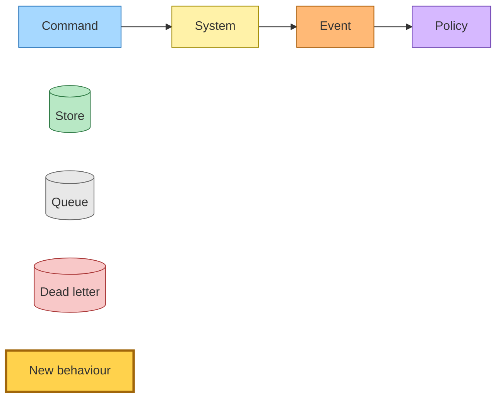

## Mapping a newsletter to a readlist

The Gmail integration page offers two pickers: a sender picker and a readlist picker. With an empty search the sender picker lists only discovered senders the catalog recognises as approved newsletters; a typed search or advanced mode covers every discovered sender, and recognition runs before the 100-result limit. When the catalog cannot be read, the picker says so and still allows search. The readlist picker lists the reader's readlists plus All, and a reader can create a readlist inline, which reuses an existing readlist of the same name and never saves a mapping on its own.

Saving a mapping resolves the readlist to its hidden `gmail-readlist` address through get-or-create. A claim item in the addresses table, keyed by user and readlist slug, makes the allocation idempotent: a consistent read of the claim returns the existing address, otherwise a new address is minted and the claim is conditionally written, and the loser of a concurrent race disables its minted address and returns the winner. The sender row is pointed at that address and added to the filter, the existing filter-rewrite command is published with reason `sender-added`, and a sender that is not recognised as approved (including when the catalog is unavailable) is submitted to the catalog. Remapping a sender cancels its unfinished imports with `destination-changed`. Readlist addresses are uncapped and hidden from inbox management, so the address cap and the `/inbox` address list count only reader-named aliases.

Removing a mapping publishes `sender-removed` and cancels that sender's imports with `mapping-removed`. Deleting a readlist runs a new decorator before the existing inbox-unrouting decorator: it finds the readlist's address through the claim, moves every sender mapped to it onto All (allocating All only if needed), cancels those senders' imports, publishes the filter-rewrite command with reason `readlist-deleted` so the moved mappings read as live once Gmail records the unchanged filter, then disables the address and deletes its claim. Legacy mappings to named `gmail-mapped` inboxes keep working and are shown as such; remapping one leaves the named inbox untouched.


Mermaid source

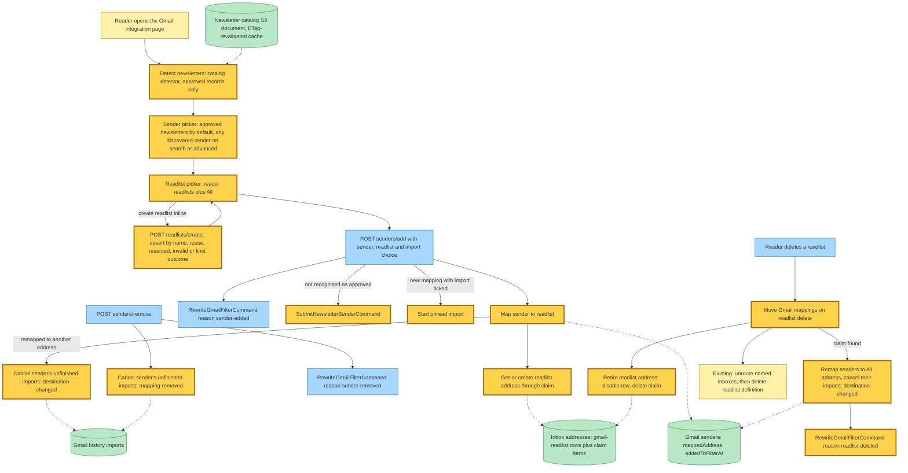

## Newsletter catalog: suggestions and moderation

The catalog is one JSON document in a new private bucket. Every read sends `IfNoneMatch` with the cached ETag and reuses the parsed document on 304; a missing object reads as an empty catalog; any other failure reads as unavailable. Every write is conditional (`IfNoneMatch: *` for the first write, `IfMatch` afterwards) and a 409 or 412 is a conflict. Every change goes through one update loop that re-reads and re-applies the pure moderation rule on conflict, up to three attempts.

A reader's submission is a command. The suggestions Lambda merges the sender as a `pending` record only when it is absent: it never renames an approved record and never reopens a rejected one. It publishes `NewsletterSenderSubmitted` with `created-pending` or `already-present` on every success. A catalog that stays unavailable fails the record into the Lambda's own DLQ, whose backlog alarm pages the operator; the reader's mapping already works without the catalog.

Admins moderate at `/admin/newsletters`, behind the shared admin gate. The page lists records by status tab with search and pagination, and every action is a form that redirects on success: create (always pending, with evidence), edit, approve, reject, withdraw (approved to rejected), reconsider (rejected to pending), correct the FROM address (the new address becomes pending and the old record is rejected with `replacedBy`), and import the committed seed (idempotent; it never replaces an existing record). Stale edits, invalid transitions and conflicts return 409 with the attempted values; an unavailable catalog returns 503.


Mermaid source

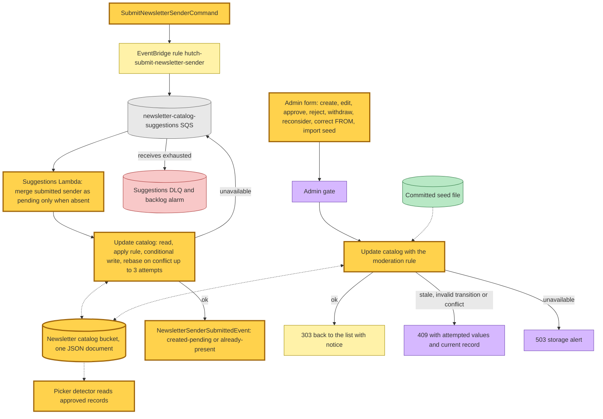

## Import orchestration

An import is a job row per sender. Starting one requires the connection to know its Gmail account; only one unfinished job per sender is allowed. The job is created `awaiting-permission`. When the stored grant already includes `gmail.readonly`, the web starts it straight away; otherwise the page shows a consent row whose form sends the reader through Google with `include_granted_scopes=true` and a signed import intent. On return, the OAuth callback resumes every job awaiting permission and restarts the intent sender's latest failed or partly failed job when it still follows the current mapping. A Google refusal or a grant still missing read access redirects with `import_permission_refused`, back to the picker state the reader left.

Starting a job (`startJob`) moves it to `queued` with a new generation, fixes the 30-day window the first time only, and on a retry rebuilds `listed` from the settled counts. The Start command carries that generation. The import Lambda runs page 0 in process; later pages loop through the same queue the way discovery does: every invocation ends in `PageProcessed`, whose progress branch dispatches the next page command directly to the Lambda's own queue with a 10-second delay. The Lambda is provisioned with recursive-loop detection set to Allow. Termination rests on the page token running out, the generation fence, the page claim, and the DLQ route that fails the job.

Each page re-checks that the connection still has the job's gateway and account (case-insensitive) with no disconnect requested, and that the sender still maps to the job's destination; a mismatch cancels the job. It then claims the page (a 60-second lease), lists unread messages from the sender in the window with a read-only token, and fetches each one as RAW. Mail that is gone or has moved to spam or trash is skipped. Each message's raw bytes go to the inbox raw-email bucket under a `gmail-import/` prefix, a message row is recorded (which adds to `listed` only for a message not yet counted), and its `MessageFetched` event is published before the page is saved. A redelivered page that was already saved republishes its progress, or completes the job when listing had finished. `reauth-required` marks the current connection revoked and fails the job as `permission-revoked`; missing read-only scope also fails it as `permission-revoked`; a Gmail rejection fails it as `gmail-rejected`; an unavailable Gmail throws for an SQS retry. Five exhausted receives dead-letter into a shared DLQ whose router fails the run the record belongs to as `dead-lettered`, fenced on that run's generation; a progress record with no next page names no run left to fail and is dropped.


Mermaid source

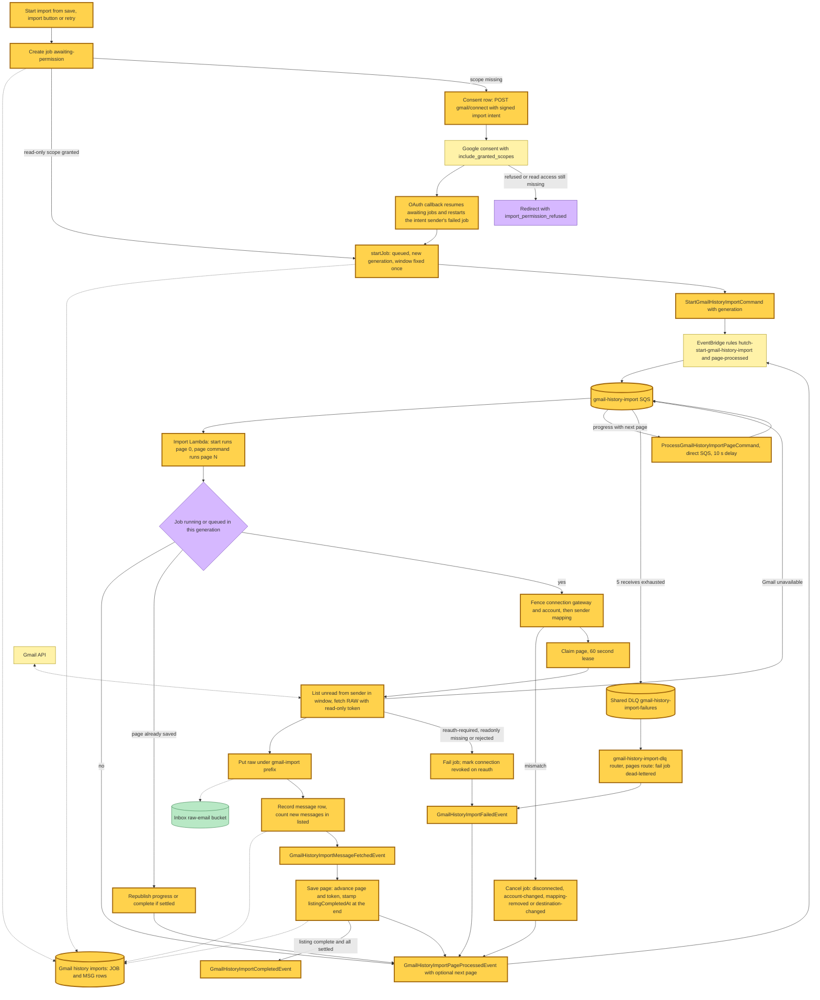

## Ingestion, deduplication and outcomes

The inbox stack consumes `MessageFetched` in a new ingest Lambda. It checks the job is still running in the event's generation (otherwise the outcome is `cancelled`), reads the raw object, and parses it; an oversize or unparseable message throws, retries, and dead-letters into the shared inbox failures DLQ, whose new route publishes the outcome `failed`. A message whose parsed From is not the job's sender is `skipped-sender-mismatch`; one with no real Message-ID is `skipped-no-message-id`; a destination address that is missing, disabled or owned by someone else is `cancelled`.

Deduplication uses a claim per `(user, sender, normalised Message-ID)` in a new identities table. A first claim wins. The same attempt (the same SES message for forwarding, or the same job, account and Gmail message for imports) proceeds with the stored row key, so retries and co-addressed recipients converge. Another attempt that finds a stored email row reports `already-imported`; if the other attempt left no row, a conditional takeover lets this one proceed. Before claiming, a new Message-ID index on the emails table lets a received row that predates claims be adopted. An imported message is then stored through the same ingest step that forwarded mail uses, and publishes `EmailReceived` with origin `gmail-import` addressed to the readlist address. The existing link extractor accepts that origin, resolves the readlist from the address, and submits kept links to it (All submits with readlist `default`), which is how imported links reach the chosen readlist.

Every parsed record publishes `MessageIngested` with its outcome. The outcomes Lambda records it on the message row and the job counts in one transaction fenced on both generations (a stale outcome is ignored, a duplicate is not counted twice) and then completes the job when listing has finished and every listed message has an outcome. Completion is idempotent, so a redelivered final outcome still completes an interrupted job. An outcome that dead-letters is recorded as `failed` by the shared DLQ router's outcomes route, which also completes the job.


Mermaid source

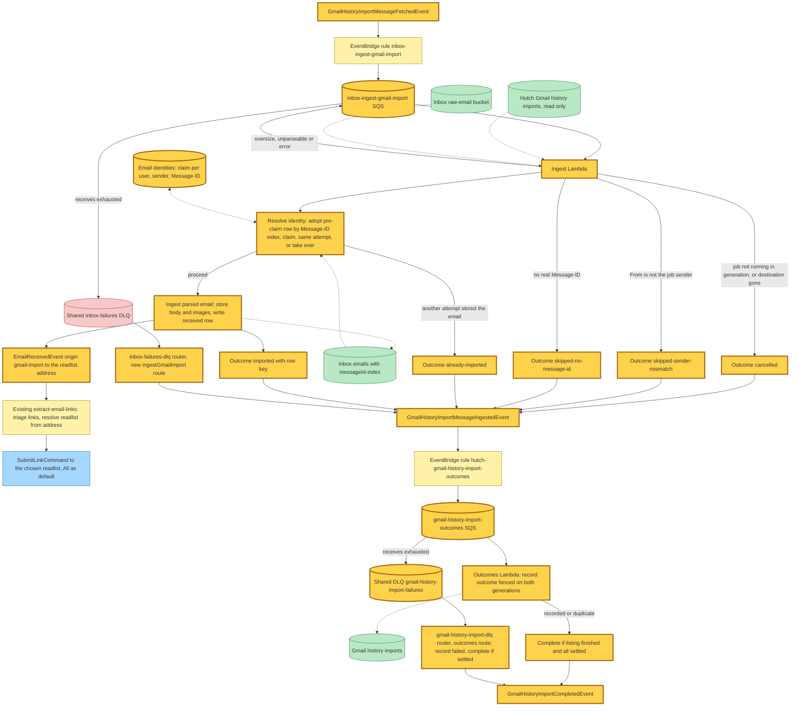

## Forwarded mail on the receive path

Forwarded newsletters still arrive through SES at the reader's gateway address. The receive Lambda keeps its existing order: confirmation interception, sender routing from the gateway to the sender's mapped address (now usually a readlist address), and holding mail for unmapped senders. After routing, and only for a deliverable recipient whose sender and normalised Message-ID are both known, it resolves the same identity claim with the SES message as the attempt. A message already imported is skipped with no row and no event, and co-addressed recipients of one SES message resolve as the same attempt, so the existing one-row, one-publish-per-recipient behaviour holds. Images are downloaded once per message, only after a copy is allowed to proceed. Mail sent directly to a readlist address takes the plain delivery branch.


Mermaid source

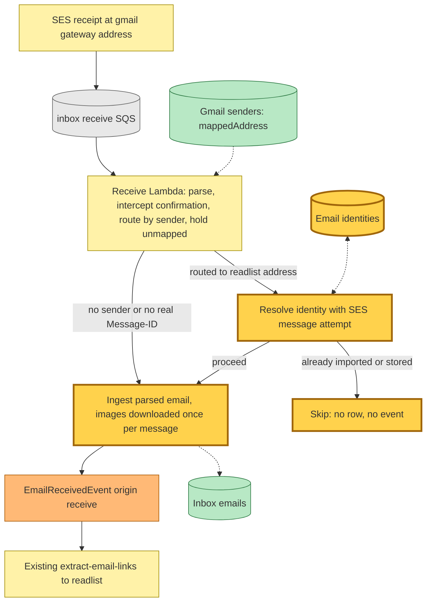

## Cancellation and erasure

Cancellation is a synchronous store transition with no event: it moves every non-terminal job that matches (all of a user's jobs, or one sender's) to `cancelled` with a reason. Pages in flight then fence on the job state and end in `PageProcessed` without a next page, and fetched messages still in flight are ingested as `cancelled`. The web cancels on remove (`mapping-removed`), remap and readlist delete (`destination-changed`), the reader's cancel button (`user-cancelled`) and disconnect (`disconnected`); the disconnect worker cancels again before it deletes the senders.

Account deletion adds four erasure steps to the existing user-data job, in order: sweep the imported raw mail under the user's `gmail-import/` prefix, delete every import job and message row, delete every identity claim through the identities table's user index, and, after Gmail is disconnected, delete the readlist-address claims (derived from the user's address rows, never scanned) before the addresses are tombstoned. Each step is a no-op on an empty account, so a redriven deletion converges.


Mermaid source

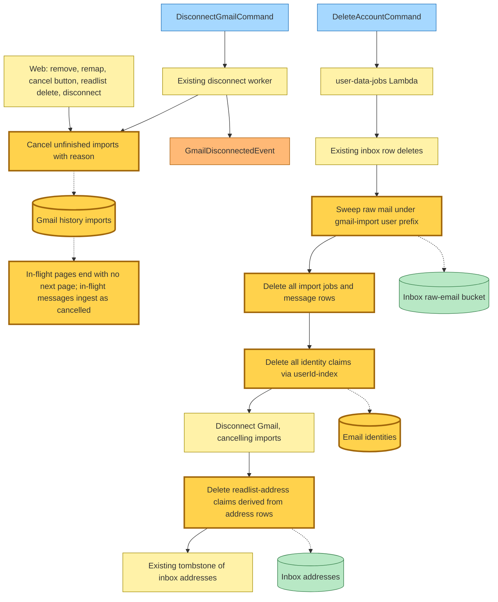

## Command → System → Event(s) reference

| Command / event | System that handles it | Event(s) emitted | Next command(s) triggered |
|---|---|---|---|
| **new** `SubmitNewsletterSenderCommand` (web, on save when the sender is not an approved newsletter) | `newsletter-catalog-suggestions` Lambda via its own SQS queue and DLQ | **new** `NewsletterSenderSubmittedEvent` (`created-pending` or `already-present`) | none |
| `RewriteGmailFilterCommand` (`sender-added`, `sender-removed`, `readlist-deleted`, existing reasons) | existing `rewrite-gmail-filter` Lambda | `GmailFilterRewrittenEvent` / `GmailFilterRewriteFailedEvent` | none |
| **new** `StartGmailHistoryImportCommand` `{userId, jobId, generation}` (web start, retry, OAuth callback resume) | `gmail-history-import` Lambda, page 0 in process | `MessageFetched` × n, optional `Completed` or `Failed`, always `PageProcessed` | none directly |
| **new** `ProcessGmailHistoryImportPageCommand` (direct SQS, 10 s delay) | `gmail-history-import` Lambda, page N | same as Start | none directly |
| **new** `GmailHistoryImportPageProcessedEvent` `{nextPage?}` | `gmail-history-import` Lambda progress branch (same queue) | none | `ProcessGmailHistoryImportPageCommand` when `nextPage` is set |
| **new** `GmailHistoryImportMessageFetchedEvent` | inbox `ingest-gmail-import` Lambda | `EmailReceivedEvent` (origin `gmail-import`) when imported; always `GmailHistoryImportMessageIngestedEvent` | the existing extractor's `SubmitLinkCommand` / triage chain |
| `EmailReceivedEvent` (origin widened with `gmail-import`) | existing `inbox-extract-email-links` Lambda | `EmailLinksTriaged` and the existing link events | `SubmitLinkCommand` to the address's readlist |
| **new** `GmailHistoryImportMessageIngestedEvent` | `gmail-history-import-outcomes` Lambda | **new** `GmailHistoryImportCompletedEvent` on the settling transition | none |
| **new** `GmailHistoryImportCompletedEvent` | no subscriber (the page polls the job row) | — | — |
| **new** `GmailHistoryImportFailedEvent` (`gmail-rejected`, `permission-revoked`, `dead-lettered`) | no subscriber (the page shows consent or retry) | — | — |
| dead letter from `gmail-history-import-q` | `gmail-history-import-dlq` router, pages route | `GmailHistoryImportFailedEvent` (`dead-lettered`) when the job transitioned | none |
| dead letter from `gmail-history-import-outcomes-q` | `gmail-history-import-dlq` router, outcomes route | `GmailHistoryImportCompletedEvent` when settled | none |
| dead letter from `inbox-ingest-gmail-import-q` | existing `inbox-failures-dlq` router, new `ingestGmailImport` route | `GmailHistoryImportMessageIngestedEvent` (`failed`) | none |
| `DisconnectGmailCommand` | existing disconnect worker, now also cancelling imports | `GmailDisconnectedEvent` | none |
| `DeleteAccountCommand` | existing `user-data-jobs` Lambda, four new erasure steps | existing deletion events | none |

## Stores and grants

| Store | Status | Keys and access pattern | Who reads / writes |
|---|---|---|---|
| Hutch Gmail history imports table | new | PK `userId`, SK `JOB#<jobId>` or `MSG#<jobId>#<gmailMessageId>`; queries use `begins_with` only | web (Get, BatchGet, Put, Update, Delete, Query); import Lambda (Get, Put, Update, Query, TransactWrite, ConditionCheck); outcomes Lambda and DLQ router (Get, Update, TransactWrite); inbox ingest (GetItem via a config-derived ARN); rewrite-gmail-filter (Query, Update); user-data-jobs (Query, Update, Delete) |
| Inbox email identities table | new | PK identity key; KEYS_ONLY `userId-index` for erasure | receive and ingest (Get, Put, Update); user-data-jobs (Query on the index, Delete) |
| Inbox emails table | changed | new GSI `messageId-index` (hash `messageId`, range `userId`, INCLUDE sender and status) over existing attributes | receive and ingest Query; ingest Get, Put, Update |
| Inbox addresses table | new items | readlist rows with purpose `gmail-readlist`, and claim items keyed `claim#gmail-readlist#<userId>#<slug>` that never enter the user index | web get-or-create, find, retire; user-data-jobs deletes claims |
| Newsletter catalog bucket | new | one private JSON object, ETag-conditional writes | web and suggestions Lambda (read and write policies) |
| Inbox raw-email bucket | new prefix | `gmail-import/<userId>/<jobId>/<gmailMessageId>.eml` | import Lambda (inline PutObject on the prefix only); ingest (read); user-data-jobs (existing Delete and List) |

Every new environment variable is a config-derived name (`DYNAMODB_GMAIL_HISTORY_IMPORTS_TABLE`, `DYNAMODB_INBOX_EMAIL_IDENTITIES_TABLE`, `NEWSLETTER_CATALOG_BUCKET_NAME`, `GMAIL_HISTORY_IMPORT_QUEUE_URL`), read only by Lambda entry points or by the production provider assembly. Cross-stack access uses ARNs built from stack config; no StackReference is added.

## Source map and deployment

| Area | Where to look |
|---|---|
| Domain types and rules | the domain package's `gmail` area (import job, summary, scope), `inbox` area (identity claim, readlist-address purpose), and new `newsletter-catalog` area (schema, moderation, detector) |
| Wire contracts | the infra-components package's event catalog (nine new commands and events, origin widening) and its DLQ source-queue maps |
| Adapters | the inbox-store package (imports, identities, readlist claims, Message-ID query, raw writer); hutch's Gmail API providers (read-only token, history) and S3 catalog provider |
| Hutch workers | the four new Lambda entry points (import, outcomes, DLQ router, catalog suggestions) and their domain handlers; the readlist-delete decorator and disconnect/cancel handlers |
| Inbox workers | the new ingest entry point and handler, the extracted ingest step, the identity resolver, and the receive handler changes |
| Web | the Gmail integration page, its mappings routes, import actions and OAuth connect routes; the admin index and admin newsletters pages |
| Infrastructure | hutch and inbox Pulumi programs and storage components; the four new hutch Lambdas, shared DLQ, rules and grants; the inbox ingest Lambda, receive and failures-DLQ grants |

Rollout is ordered storage first (new tables, the GSI, the bucket), then consumers (inbox ingest and receive with the identity claim, web and worker env), then producers and UI once the Google consent screen includes `gmail.readonly`. The Gmail page stays behind the existing `?feature=gmail` navigation gate.

## Known gaps

- The per-message fence cancels by sender, so an in-flight page of an old job can cancel a newer job for the same sender in a millisecond window; no occurrence has been observed.
- A crash between retiring a readlist address's row and deleting its claim can leave a claim pointing at a disabled address.
- Account deletion sweeps the raw prefix before cancelling imports, so a page in flight can write a raw object after the sweep.
- Dev mode (`PERSISTENCE=development`) has no local import runner: started jobs stay `queued`.
- Starting an import checks for an unfinished job without a lock; concurrent starts for one sender could create two jobs, which ingestion's identity claim converges.
- Readonly consent, the down-scoped token and Message-ID preservation through Gmail forwarding still need verification with a real account in staging.
