# Gmail newsletters: mandatory All and multiple readlists

Snapshot of the uncommitted working tree over `508b6d70027f4488b4eec9d3a3b9e05b18418add` (`main`), whose 2026-10-04 subject is **feat: notify readers about approved Gmail newsletters**. Generated 2026-10-04. The base commit identifies the starting point; the highlighted routing changes are not committed at capture time.

Every mapped Gmail newsletter sends eligible articles to All and optionally several independently filtered custom readlists. Existing scalar mappings and imports remain readable. Changes apply to future deliveries and newly consented imports; previously handled messages are not replayed. The [approved-newsletter notification snapshot](../2026-10-04-f532f07f0/gmail-newsletter-notifications.md) remains the record of the monitoring infrastructure, baseline and receipt protocol. New notification content describes multiple readlists and uses sender-bound confirmation; already-claimed payloads and stable retry keys are retained.

## Legend

Gold outlines identify behavior added or materially changed in this working tree; role colors identify the established infrastructure and contracts.


[BPMN image](diagrams-bpmn/legend.png) · [Editable BPMN](diagrams-bpmn/legend.bpmn)

Mermaid source

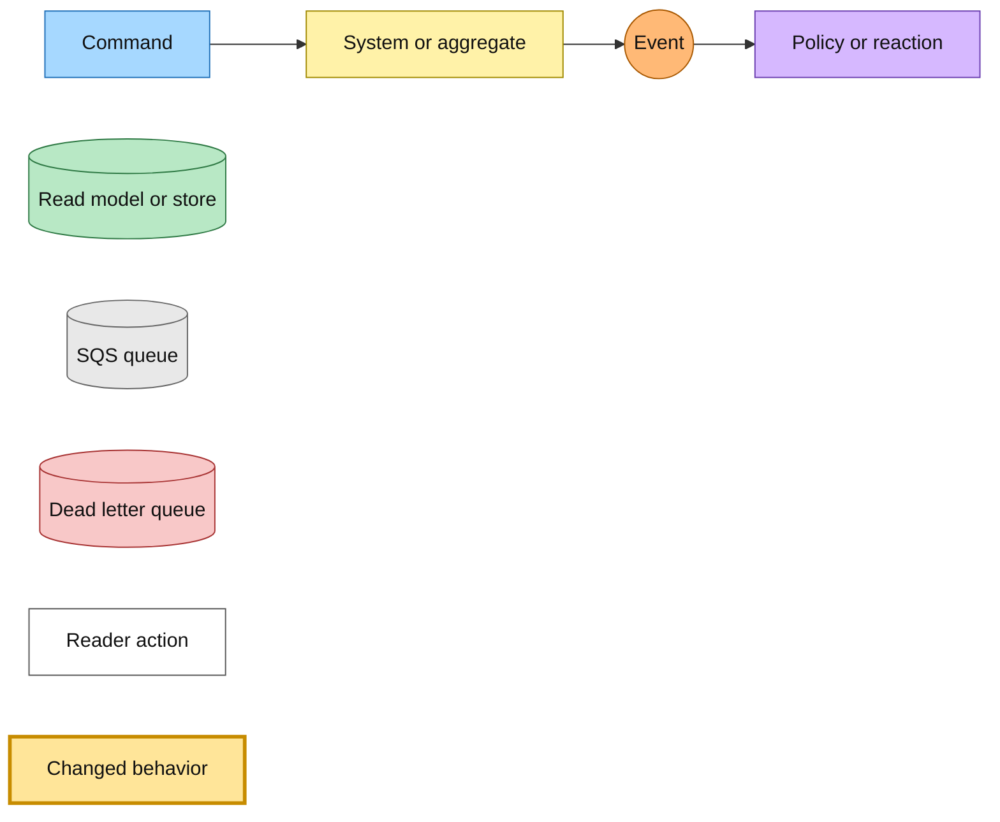

## Mapping selection and notification choice

All is always selected and locked. URL state carries repeated `readlist` values; ownership checks apply to every custom selection. Saved destinations are identified by `mappedAddresses`: they control picker preselection and satisfy the notification choice requirement. A notification for a sender without saved destinations, with custom lists available, starts with a sender-bound pending choice. GET confirmation explicitly accepts All-only; a JavaScript checkbox change submits the same action. Saved destinations and ordinary valid sender entry can Save immediately. Only-All accounts also Save immediately. Search, polling, login return, browser history, validation and failed inline creation preserve selections and the pending sender; highlight dismissal is a separate transient concern.

The resolver stores custom destinations, with All implicit, or the existing All address for All-only. `addedToFilterAt` remains authoritative for Gmail monitoring, saved-sender eligibility and import activation under the existing filter contract. Mapping changes preserve that timestamp, sightings, observations, receipts and checkpoints. Reordering the destination set preserves the saved order and mapping timestamp. An actual change cancels unfinished imports for that sender. The first filter activation starts a history import only when the reader explicitly chose the import checkbox.


[BPMN image](diagrams-bpmn/mapping-selection.png) · [Editable BPMN](diagrams-bpmn/mapping-selection.bpmn)

Mermaid source

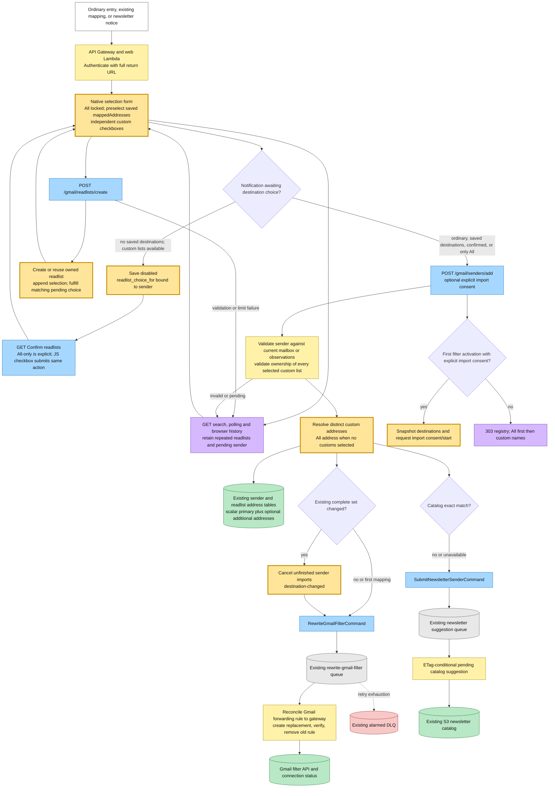

## One accepted message and its destination snapshot

SES stores forwarded raw mail in the existing S3 bucket and notifies the receive queue through SNS. Confirmation mail is intercepted before remote images. Gateway arrivals from unmapped senders are held without extraction. Legacy Gmail-mapped addresses use the sender mapping when present, otherwise their addressed destination. Ordinary inbox delivery keeps its separate routing variant.

A Gmail arrival is ingested once with the complete destination snapshot. The email identity claim joins forwarded and imported copies by reader, normalized message id and sender, adopts pre-claim received rows, and permits retry or takeover only when no accepted row exists. A retry of the same raw object first looks for its accepted Gmail row and republishes that row's original destinations before current mapping, destination retirement or import cancellation gates. Different delivery copies still follow the identity claim. This prevents a later mapping edit from rerouting or stranding an accepted message. Previously handled mail is never reprocessed by mapping edits.


[BPMN image](diagrams-bpmn/message-ingress.png) · [Editable BPMN](diagrams-bpmn/message-ingress.bpmn)

Mermaid source

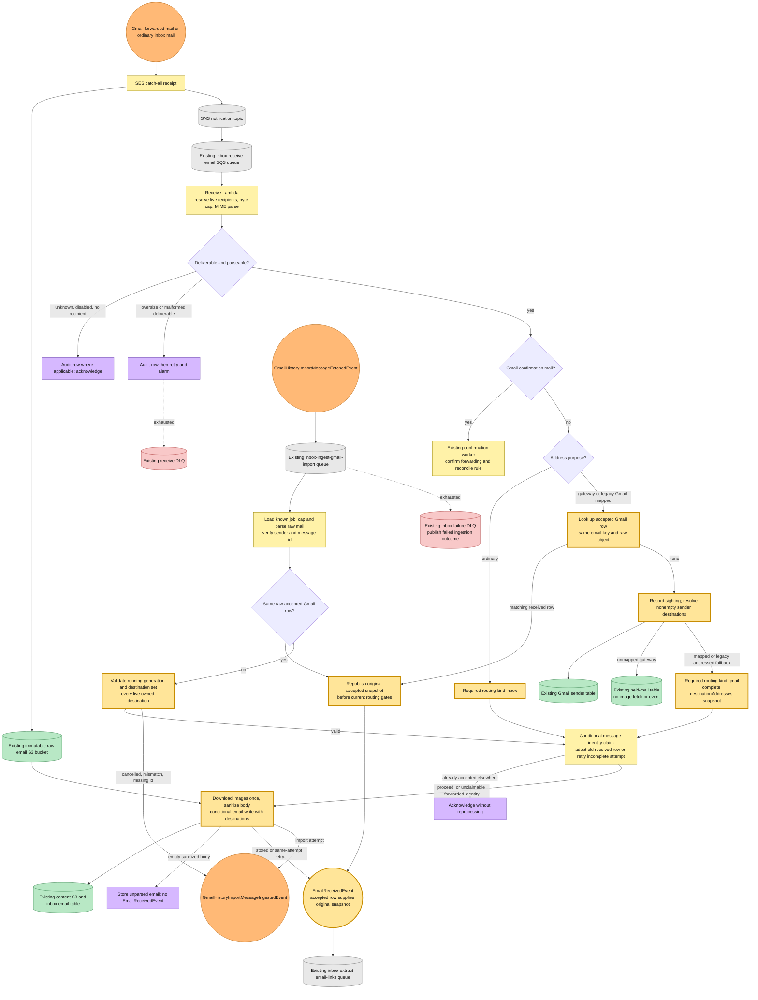

## Triage, mandatory All, previews and custom fan-out

Email extraction re-derives links from the immutable raw mail. Normal action-link classification and article triage still determine eligibility; non-article and unsafe links are not made eligible by the mandatory-All rule. Article triage unavailability keeps the existing fail-open behavior. Backfill and unrouted audit mail remain preview-only. Readers with insufficient write access receive the existing saves-held notice.

For an eligible full-access Gmail article, the extractor publishes `SubmitLinkCommand` for All before its preview command. After all preview rows and counts are written, Gmail extraction records its complete selected custom-list snapshot with display labels, `eligibleArticleCount` and `savesHeld`. Only a successful metadata write permits the independent `EmailLinksTriagedEvent` for each custom list, including an empty event when no eligible links remain. This ordering prevents late custom results from mistaking an extraction-failure marker for historical scalar metadata. Ordinary custom inbox routing retains its established event-before-metadata order. This is one extraction and one preview per article, not one per list. A held delivery records the same selection without save or filter commands; its UI shows the held state without polling custom decisions. Zero-eligible mail does not trigger the first-inbox-email notice. A crash can republish commands while a link stays pending; duplicate submissions converge to membership through the existing save pipeline, while duplicate crawling remains possible.


[BPMN image](diagrams-bpmn/extract-and-save-all.png) · [Editable BPMN](diagrams-bpmn/extract-and-save-all.bpmn)

Mermaid source

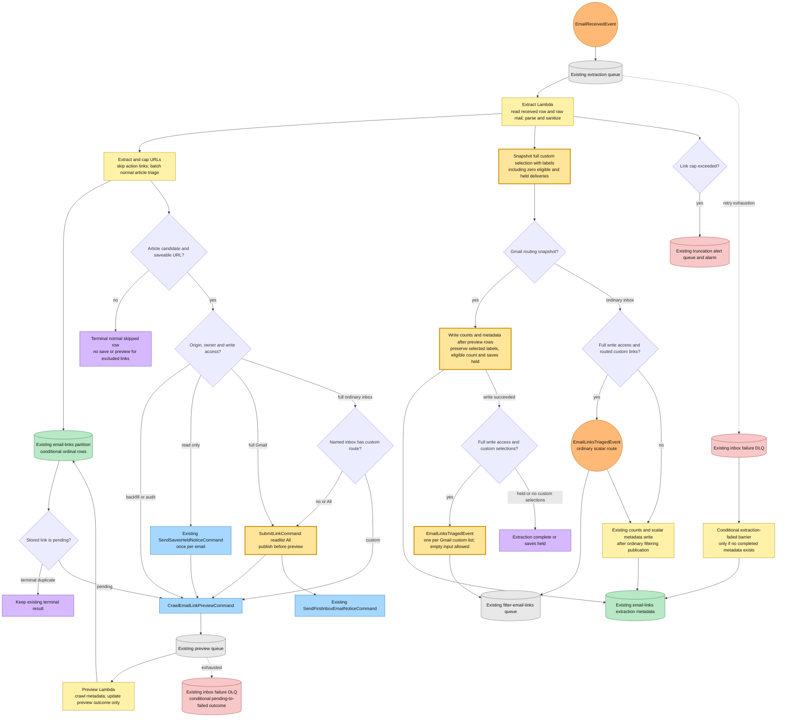

## Independent custom decisions and terminal results

The existing filter worker evaluates each custom list separately. A list with no purpose keeps all links without a model call; a deleted list falls back to All. Empty input emits a terminal zero result without a model request or save command. Otherwise one thinking-mode model request must classify every input ordinal. It publishes save commands for kept links before the successful filtering event. Exhaustion publishes the failure event for that list.

For Gmail snapshots, filtering publication follows a successful extraction metadata write. The recorder reads the existing primary email-links partition with a consistent Query, so a completed Gmail barrier cannot be mistaken for an older scalar-shaped extraction-failure marker. It still retries out-of-order facts when metadata is absent, verifies that the list belongs to the accepted selection, and conditionally inserts its first terminal outcome in a reserved `readlist#<slug>` row in the existing email-links partition. Extraction exhaustion cannot overwrite completed Gmail metadata with a scalar-shaped failure marker. A custom rejection does not change the base preview row or email counts, so an article retained in All remains visible. The read side shows each list's pending, accepted, rejected or failed result. Historical scalar decisions and ordinary routed inbox mail keep the existing dropped-row and recount behavior.


[BPMN image](diagrams-bpmn/custom-filtering-results.png) · [Editable BPMN](diagrams-bpmn/custom-filtering-results.bpmn)

Mermaid source

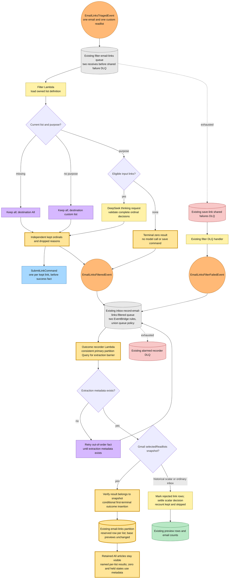

## Consented imports, continuation, cancellation and outcomes

The optional new-mapping import and the registry import action snapshot the full destination selection, sender and mailbox identity. They list only unread mail from the previous 30 days, excluding spam and trash. Read-only OAuth consent remains explicit and incremental; mapping alone grants no import permission. Retry retains the original window and snapshot, changes generation, and re-lists only unsettled messages.

Each page checks the current mailbox and the complete unordered mapping set before taking its lease. Mapping removal, any selected destination change, mailbox switch, disconnect or explicit cancellation stop unfinished work. The existing page worker deliberately self-loops through its progress event and own SQS queue; recursive-loop detection remains Allow. Ingestion outcomes count each message once in a generation and complete the job only after listing and all message outcomes settle. Import completion describes ingestion, not eventual custom-filter or crawl completion.


[BPMN image](diagrams-bpmn/history-import-lifecycle.png) · [Editable BPMN](diagrams-bpmn/history-import-lifecycle.bpmn)

Mermaid source

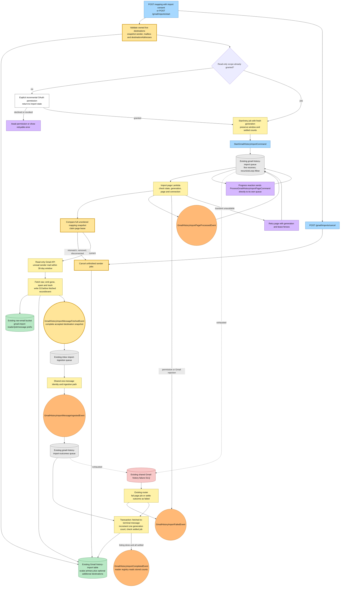

## Existing canonical save, membership and enrichment pipeline

Both mandatory-All submissions and accepted custom-list submissions reuse the existing `SubmitLinkCommand` consumer. It validates and normalizes the URL, resolves canonical identity and archive provenance, synchronously accepts the article into All, and files it into the requested custom list when applicable. Conditional per-user membership converges to one row per canonical article and destination. Repeated accepts can still bump save order or resurface read articles; at-least-once delivery can still repeat crawl work.

The submit worker keeps the existing archive behavior: capture URLs are saved under the original article, archive content becomes tier-2, live-origin content remains tier-1, and canonical selection compares every available tier. Crawl failures terminalize in process; accept failures retry and publish a queue-failed fact on exhaustion. Existing freshness, comprehensive crawl, selection, summary, related-article and reader-ready paths remain in place. No new worker, queue or permissions are introduced for saving to All.


[BPMN image](diagrams-bpmn/submit-and-enrich.png) · [Editable BPMN](diagrams-bpmn/submit-and-enrich.bpmn)

Mermaid source

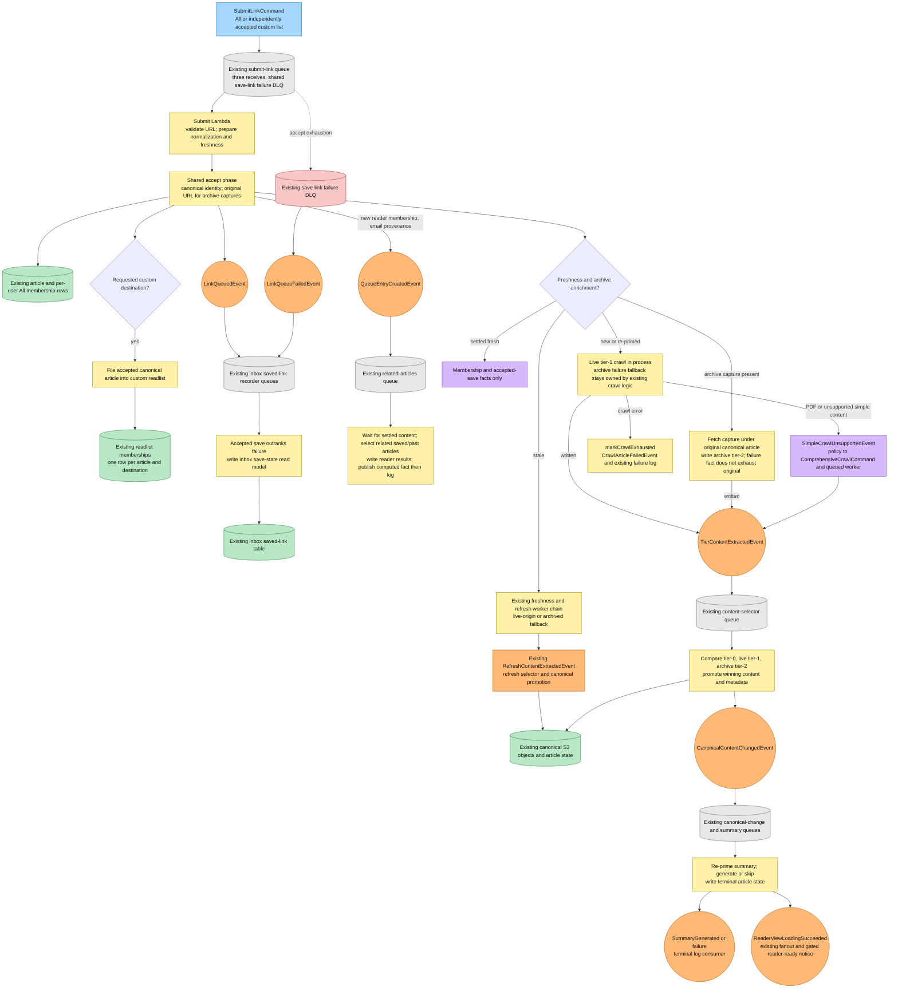

## Destination deletion, disconnect and account erasure

Deleting a selected readlist removes only its address from affected sender selections. Remaining custom destinations are retained; a sender whose final custom destination was removed uses All. The change cancels unfinished imports before the address is retired and the list definition deleted, then reconciles the existing Gmail forwarding rule.

Disconnect cancels jobs, removes saved senders and the Gmail forwarding filter, revokes the grant, disables the gateway and deletes the connection/discovery state. Notification monitoring receipts survive reconnect as before; only account erasure deletes them. Account deletion queries the existing reader partitions, removes email/link/result/identity/import/monitoring state and S3 raw/body/image objects, retires address claims and tombstones addresses, then completes the existing saved-article, billing, schedule and credential cleanup. No backfill, table scans, new Gmail scope, table, index, queue or Lambda is added by this routing change.


[BPMN image](diagrams-bpmn/deletion-and-cleanup.png) · [Editable BPMN](diagrams-bpmn/deletion-and-cleanup.bpmn)

Mermaid source

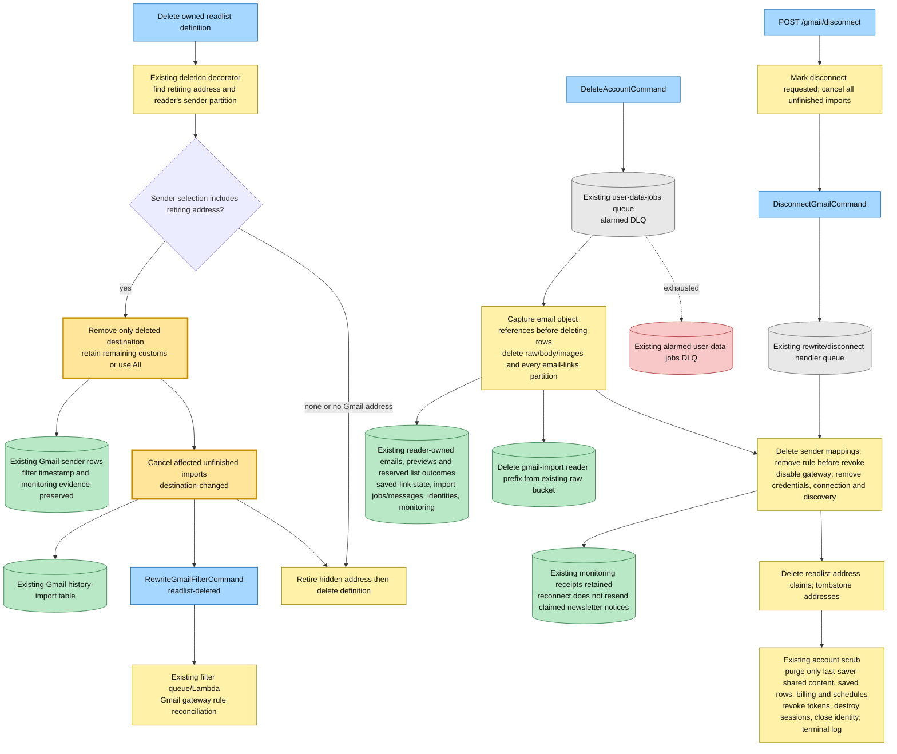

## Command → System → Event(s) reference

| Command or input event | System and durable result | Emitted events or next actions |
|---|---|---|
| GET picker state / Confirm readlists | Web Lambda validates URL state, preserves selections and sender-bound confirmation | HTML or HTMX fragment; explicit choice enables POST Save |
| POST create readlist | Web Lambda creates or reuses an owned readlist | 303 with appended selection; failures retain pending choice |
| POST save sender | Resolver allocates destinations, updates existing sender row and preserves eligibility | RewriteGmailFilterCommand; optional catalog suggestion; import only on explicit consent |
| RewriteGmailFilterCommand | Existing queued Gmail filter worker reconciles current truth against provider filters | Stored connection status, terminal log or queue retry/DLQ |
| SubmitNewsletterSenderCommand | Existing suggestion worker performs ETag-conditional catalog update | Pending S3 catalog entry; terminal log |
| SES receipt notification | Existing receive queue/Lambda parses and resolves addressed recipients; same-raw accepted retry reuses stored routing before mapping gates | Confirmation reaction, held unmapped sender, audit row, or EmailReceivedEvent |
| Gmail forwarding confirmation | Existing credential-free confirmation worker | Forwarding-confirmed/failed fact; existing filter reaction updates connection |
| EmailReceivedEvent | Existing extractor writes ordinal preview rows and counts; Gmail selection metadata must succeed before custom filtering publication | All SubmitLinkCommand before CrawlEmailLinkPreviewCommand; one EmailLinksTriagedEvent per custom list; ordinary event-before-metadata order preserved; existing notices |
| CrawlEmailLinkPreviewCommand | Existing preview worker writes metadata outcome without article queue access | Terminal preview row; failure router conditionally marks exhausted pending preview |
| SendSavesHeldNoticeCommand / SendFirstInboxEmailNoticeCommand | Existing notice workers re-check access and enforce existing claim gates | Resend email and existing terminal state; no new notice protocol |
| EmailLinksTriagedEvent | Existing filter queue/Lambda loads the list, evaluates purpose independently, validates ordinals; empty input bypasses the model | SubmitLinkCommand for each kept link; EmailLinksFilteredEvent, including terminal zero results |
| Filter triage exhaustion | Existing save-link shared failure router | EmailLinksFilterFailedEvent for one list |
| EmailLinksFilteredEvent / EmailLinksFilterFailedEvent | Existing inbox recorder consistently queries the primary partition, retries out-of-order facts while metadata is absent, then inserts first terminal reserved list row | Gmail per-list read model; ordinary/historical scalar settlement and counts |
| POST import start, retry or consent return | Existing web import actions snapshot destinations and mailbox, establish generation/window | StartGmailHistoryImportCommand |
| StartGmailHistoryImportCommand / ProcessGmailHistoryImportPageCommand | Existing import worker validates fences, leases page and calls read-only Gmail API | Fetched-message events; PageProcessed, Failed or Completed event |
| GmailHistoryImportPageProcessedEvent | Progress branch of same queued import worker | ProcessGmailHistoryImportPageCommand sent directly to own SQS queue |
| GmailHistoryImportMessageFetchedEvent | Existing inbox import-ingestion worker reuses a same-raw accepted snapshot before cancellation gates, otherwise validates current job and all destination ownership | EmailReceivedEvent plus GmailHistoryImportMessageIngestedEvent |
| GmailHistoryImportMessageIngestedEvent | Existing outcome worker transactionally counts one terminal outcome per generation | GmailHistoryImportCompletedEvent when listing and every message settle |
| Import page/outcome exhaustion | Existing shared Gmail history DLQ router | Failed job fact, or failed ingestion settlement and completion check |
| GmailHistoryImportCompletedEvent / GmailHistoryImportFailedEvent | Stored job state is read by registry polling; no new consumer | Reader sees current counts, retry, failure or cancellation |
| POST import cancel / mapping removal or change | Existing cancellation path marks unfinished sender jobs | Stored cancellation; future page claims stop |
| SubmitLinkCommand | Existing submit queue/Lambda validates identity, accepts into All, files custom membership, performs enrichment | LinkQueuedEvent; QueueEntryCreatedEvent on new email membership; tier extraction or existing refresh facts |
| LinkQueuedEvent / LinkQueueFailedEvent | Existing inbox saved-link recorder lets accepted save outrank failure | Saved-link read model; article Save/Save again UI |
| QueueEntryCreatedEvent | Existing related-articles worker and past-reads reaction inspect settled reader saves | Stored related results and computed fact; existing terminal log |
| TierContentExtractedEvent | Existing content selector compares available tiers and writes winning canonical source | CanonicalContentChangedEvent and existing crawl-completed/accepted content facts |
| SimpleCrawlUnsupportedEvent | Existing policy and comprehensive-crawl queue handle non-simple formats | Tier extraction or existing refresh/recrawl facts; failure terminalization |
| RefreshContentExtractedEvent | Existing refresh selector writes canonical content and article state | Existing summary dispatch and completion facts |
| CanonicalContentChangedEvent | Existing queued reaction re-primes summary | Existing GenerateSummaryCommand and summary worker |
| SummaryGenerated / summary failure / CrawlArticleFailedEvent | Existing summary and crawl completion/failure consumers | Stored terminal article state and logging; successful reader-ready fact where eligible |
| ReaderViewLoadingSucceeded | Existing reader-ready fanout and delayed gated notify worker | Existing per-reader success state, Resend notice and email-sent fact |
| Delete selected readlist | Existing deletion decorator removes one destination, preserves remaining lists/All, cancels affected imports | RewriteGmailFilterCommand; retired address and deleted definition |
| DisconnectGmailCommand | Existing queued teardown reconciles rule, revokes grant and disables gateway | Existing disconnected result/log; monitoring receipts remain |
| DeleteAccountCommand | Existing user-data-jobs queue/Lambda removes all reader partitions and referenced objects | Complete existing account scrub and terminal log; at-least-once retries/DLQ |

## Source evidence at capture time

The workspace is a pnpm/Nx TypeScript monorepo using the repository's Node 22 toolchain. EventBridge subscriptions grant queue policies through the existing infrastructure components; every asynchronous worker above retains its existing queue and alarmed DLQ. Datastore authorization grows only on existing tables: the extractor queries owned readlist definitions to snapshot display labels, and the existing custom-filter outcome recorder gains `PutItem` to insert reserved rows into the email-links table. The primary email-links partition Query uses `ConsistentRead: true`; this changes neither its existing authorization nor its key structure.

| Boundary | Evidence |
|---|---|
| Picker state and POST ownership gates | [Gmail page](../../projects/hutch/src/runtime/web/pages/integrations/gmail.page.ts), [URL state](../../projects/hutch/src/runtime/web/pages/integrations/gmail.url.ts), [mapping actions](../../projects/hutch/src/runtime/web/pages/integrations/gmail-mappings.page.ts) |
| Destination set comparison and list deletion | [Mapping resolver](../../projects/hutch/src/runtime/domain/gmail/resolve-readlist-mapping.ts), [deletion decorator](../../projects/hutch/src/runtime/domain/gmail/move-gmail-mappings-on-readlist-delete.ts) |
| Scalar-compatible persistence | [Sender store](../../src/packages/inbox-store/src/dynamodb-gmail-sender.ts), [history import store](../../src/packages/inbox-store/src/dynamodb-gmail-history-import.ts) |
| Accepted-message snapshot and identity | [Forwarded routing](../../projects/inbox/src/runtime/domain/gmail/route-gmail-forwarded-email.ts), [accepted retry](../../projects/inbox/src/runtime/domain/inbox/resume-accepted-gmail-email.ts), [identity resolution](../../projects/inbox/src/runtime/domain/inbox/resolve-email-identity.ts), [shared ingestion](../../projects/inbox/src/runtime/domain/inbox/ingest-parsed-email.ts) |
| Required routing contract | [Internal events](../../src/packages/hutch-infra-components/src/events.ts) |
| Mandatory All and custom fan-out | [Extractor](../../projects/inbox/src/runtime/domain/inbox/extract-email-links-handler.ts), [filter worker](../../projects/save-link/src/runtime/domain/filter-email-links/filter-email-links-handler.ts) |
| First-terminal list outcomes and historic scalar behavior | [Outcome recorder](../../projects/inbox/src/runtime/domain/inbox/record-email-links-filtered-handler.ts), [email-links store](../../src/packages/inbox-store/src/dynamodb-inbox-email-link.ts) |
| Import consent, fences and page continuation | [Web import actions](../../projects/hutch/src/runtime/web/pages/integrations/gmail-import-actions.ts), [worker](../../projects/hutch/src/runtime/domain/gmail/gmail-history-import.ts), [queue handler](../../projects/hutch/src/runtime/domain/gmail/gmail-history-import-handler.ts) |
| Import identity and settlement | [Ingestion worker](../../projects/inbox/src/runtime/domain/inbox/ingest-gmail-import-handler.ts), [outcome recorder](../../projects/hutch/src/runtime/domain/gmail/record-gmail-history-import-outcome-handler.ts) |
| Existing canonical/archive save | [Submit consumer](../../projects/save-link/src/runtime/domain/submit-link/submit-link-command-handler.ts), [shared accept phase](../../src/packages/save-article/src/save-article-from-url.ts) |
| Worker infrastructure and failure routing | [Hutch infrastructure](../../projects/hutch/src/infra/index.ts), [inbox infrastructure](../../projects/inbox/src/infra/index.ts), [save-link infrastructure](../../projects/save-link/src/infra/index.ts) |
| Erasure and receipt lifecycle | [Disconnect](../../projects/hutch/src/runtime/domain/gmail/disconnect-gmail.ts), [account scrub](../../projects/hutch/src/runtime/delete-account/delete-account-handler.ts) |

This snapshot describes the dirty working tree, including the monitoring infrastructure committed at the base. The routing change adds neither content backfill nor mail replay. A complete destination snapshot is a delivery decision; custom filtering, preview crawling and enrichment remain independently retried asynchronous work.
