# Verified archive saves and canonical content — event storming

**Commit:** `94eb31827` — *test(@packages/crawl-article): canary Wayback and archive.today captures*
**Commit date:** 2026-10-04 · **Generated:** 2026-10-06 · **Branch:** `main`

A point-in-time map of what happens when a reader saves a wrapper URL — a
Wayback Machine or archive.today capture, an archive.today outbound link, a
newsletter tracker, an Apple News link or a share-intent link — instead of the
article itself.

The rule the whole flow enforces: **a wrapper is never the article URL.** The
original article URL owns the article row, the card and the reader link. A
wrapper contributes two things only: evidence of which original it stands for,
and, when it holds a copy of the article, one more content candidate. Every
candidate — the live page, the wrapper's response, an extension capture — is
stored immutably with its provenance and the save attempt that produced it, an
AI comparison picks the most complete readable one, and a revision-guarded
commit points the article at the winner. Cards that already exist keep their
row key, reading history and reader link; nothing is bulk rekeyed or merged.

No new Lambda, queue, table, schedule or command. The wire changes are a
required save-attempt id on the save, submit, newsletter-issue, crawl, recrawl
and refresh contracts, candidate references on the three content-extracted
events, and source provenance on the raw-capture and refresh commands.

> Captured from the uncommitted working tree on top of the base commit
> `94eb31827`, later carried onto `6effb2aca`, whose newsletter-issue saves
> it also covers.

## Legend

Gold marks behaviour or contracts that differ from the base commit. Arrows
crossing workers stand for the existing bus rules and queue subscriptions;
dashed arrows into a store are reads or writes.


[Editable BPMN](diagrams-bpmn/legend.bpmn) · [BPMN rendering](diagrams-bpmn/legend.png)

Mermaid source

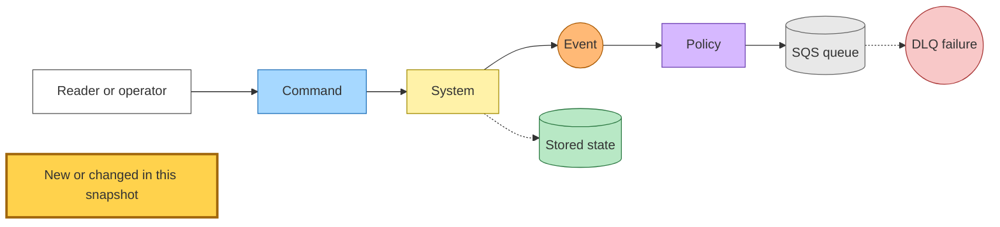

## Save surfaces and original identity

### Recovering the original

One resolver walks a wrapper chain, at most eight steps, until it reaches a URL
that is not a wrapper. Each step validates the URL and then tries, in order:

1. **Local unwrap** — the original is written in the wrapper's own path or
   query (Wayback captures including the `if_`, `fr_` and `id_` document
   modifiers, archive.today dated captures including dotted partial dates,
   share intents). An archive.today outbound link (`/o/<id>/<destination>`)
   unwraps to its destination and contributes **no** content source: the
   capture id in it belongs to the referring page, not the destination.
2. **Stored binding** — a wrapper saved before left an alias row carrying the
   capture URL and the original it was proved against.
3. **Network lookup** — a tracker's redirect chain (five hops), an Apple News
   story lookup, or an archive short link's Memento `rel="original"` header,
   under a three-second per-hop and six-second total budget, behind the same
   SSRF guard the crawler uses.

The chain ends *unresolved* — a bare outcome that carries no reason — when a
lookup returns nothing, when a URL fails validation, when an outbound link has
no destination to unwrap, when it lands on an archive host that names no
original, or when eight steps pass without reaching one. The first wrapper in
the chain that holds a copy of the article becomes the save's **content
source**; that copy is dropped again when the chain then passes through a share
intent or an outbound link, or leaves an archive capture for another kind of
wrapper, because it no longer stands for the final original.

The recovered original is then matched against stored identity. An alias row
collapses it onto the article it points at, and that article's established
destination is the identity the save uses. The content source is bound to the
save only when the original it was recovered for has the same canonical
identity as that destination, so a capture of a URL that merely used to
redirect to the article is never attached to it. A submitted wrapper that
resolves to a different URL claims an alias row pointing at the article and
carrying the binding when there is one, which is what lets a later save of the
same short link retry the same capture without a network hop.

### What each surface does with the answer

| Surface | Resolution | When the original cannot be resolved |
|---|---|---|
| Web save bar | In the request, including the network lookup | Publishes the submit command, redirects 303 to the readlist with a "queued while Readplace finds the original article" notice |
| Single save through the Siren API (extension, iOS, Android) | In the request, including the network lookup | Publishes one submit command per destination readlist under one save attempt, answers 409 with a Siren `messages` notice |
| MCP save tool | In the request, including the network lookup | Publishes one submit command per destination readlist, returns a pending result |
| Save button on a link listed in a saved newsletter issue | In the request, including the network lookup | Publishes the submit command and redirects back to the issue exactly as a resolved save does |
| Content intake, inline HTML or PDF bytes | In the request, including the network lookup | Publishes a URL-only submit command, answers 409 with the same notice; the bytes are not staged |
| Content intake, upload slot and upload completion | In the request, including the network lookup | 422 `original-unresolved`; no slot, no staged object, no article row |
| Bulk save | Stored bindings and local unwrap only | Publishes the submit command; the entry reports the shipped `created` outcome with an additive `queued` code, and the summary carries a `queued` count |
| Import commit | Stored bindings and local unwrap only | Publishes one submit command per link |
| Anonymous reader, first visit | In the request, including the network lookup | 422 error page; no article row |
| Inbox link producers (newsletter extractor, link filter, inbox Save button) | None — they publish the submit command directly | — |
| Hacker News digest suggestions | Stored bindings and local unwrap only | The item is skipped |

The 409 with a `messages` notice is the one unresolved-save shape every shipped
client renders without crashing or retrying. The bulk outcome enum stays closed
to its four shipped values; the extension subtracts the `queued` count from the
saved count it reports.

A resolved save is accepted under the original identity: the user's readlist
row is written, a new article gets its stub with crawl and summary pending, and
one save command carries the original, the capture URL, the original the
capture was proved against, and the save attempt. The web save bar's 303,
accepted or queued, names the attempt in an `x-readplace-save-attempt-id`
response header, which the production health check reads. Content intake
stages the captured bytes under a key scoped to the attempt, accepts the
save, and only then dispatches the raw-capture command with the submitted URL
as its source — the upload slot hands the attempt back to the client so the
completion call finds the same object.

**Only archive-host sources are pinned on the article.** A Wayback or
archive.today capture is recorded on the row and re-crawled on every later
recrawl. Any other wrapper body — a tracker's or Apple News response — is
offered as a one-off candidate for that save only. The pin is accepted only
when the capture's original equals the article's current destination.

An anonymous visit through a wrapper to an article that already exists offers
that wrapper's capture once (the alias binding records that it was offered,
unless the article's crawl has since failed) and spends the same per-IP crawl
budget a first visit does; when the budget is exhausted the reader simply sees
the existing article.

The submit worker resolves over the network with the queue's retry budget
behind it, then accepts and crawls in the same invocation. A wrapper that never
resolves exhausts the queue and its existing dead-letter consumer publishes the
save-failed fact.


[Editable BPMN](diagrams-bpmn/save-surfaces.bpmn) · [BPMN rendering](diagrams-bpmn/save-surfaces.png)

Mermaid source

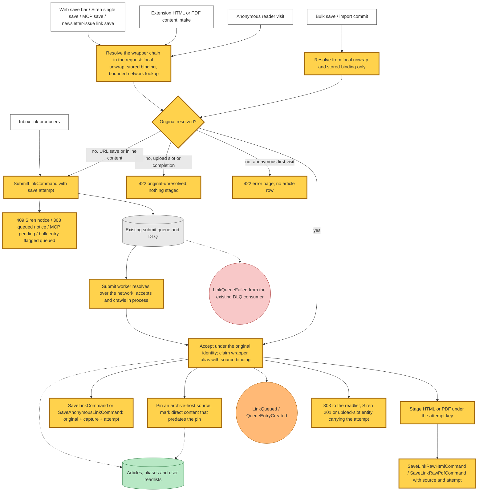

## One archive save attempt

A save command that carries a capture — or whose article has a pinned one —
runs the live crawl of the original and the capture crawl concurrently and
publishes one extracted event naming both candidates. A command without a
capture runs the live crawl alone, as before, and names its single candidate.

**The capture side.** The worker first re-verifies the source: the capture must
still resolve to an original whose canonical identity matches the article's,
and the original claimed in the command must match too. A source that fails
publishes the capture-failed fact and contributes nothing. A verified source is
fetched with the response body retained whatever the status, so a CAPTCHA or
HTTP error page arrives as a candidate with its status recorded, not as a
transport failure. Only a fetch that returns no body publishes the
capture-failed fact. Neither outcome moves the article's crawl state.

**The live side.** The live crawl fetches the original (never the capture) and
records the actual response as its evaluation body. Inside an archive attempt
it keeps the body whatever the status too: a body that fails to parse or that
came with a non-2xx status is stored as a candidate, and the fetch-timestamp
update is skipped for it. A classified crawl failure leaves the attempt with no
live candidate and a live outcome of *no body*, without moving the article's
crawl state; any other error fails the record so the queue retries it. An
infrastructure failure on the capture side fails the record the same way. A
save without a capture crawls the live original alone and keeps the base
commit's terminal handling of 404, blocked and unparseable responses.

**A deferred PDF.** When the simple crawl meets a body it cannot extract, the
attempt's live outcome is *deferred*: the unsupported fact carries the attempt
and the wrapper candidate references through the existing policy into the
comprehensive-crawl command, and the first extracted event goes out without a
live candidate. The comprehensive worker then publishes a second event for the
same attempt carrying the wrapper references plus its own live candidate — or,
when it produced no body or the paid-crawl budget is spent, the wrapper
references with a live outcome of *no body*. A save or recrawl comprehensive
command for a pinned article that arrives without references crawls the
capture itself first.

**Candidates.** A candidate's id is a hash of the attempt, its kind (live,
wrapper or extension), the original, the source URL, the evaluation body and
the finalized reader body, so a retry that localizes media differently is a
distinct candidate. The writer puts the candidate manifest first with a
create-only condition, then the reader and evaluation bodies under a key
derived from the id, then updates the tier's mutable pointer. A redelivery
that finds the manifest already written keeps the stored manifest; because the
id already hashes both bodies, its keys name the same objects.

**Media.** Images finalized for an attempt live under the storage article's
image prefix in a path scoped by a hash of the attempt and the submitting
author, named by a hash of the source URL and the image bytes. An authored
image gets a small ownership manifest written before its bytes. EPUB export
accepts that scoped path alongside the legacy flat filename, and the image CDN
reads only the image prefixes and `robots.txt`.


[Editable BPMN](diagrams-bpmn/capture-attempt.bpmn) · [BPMN rendering](diagrams-bpmn/capture-attempt.png)

Mermaid source

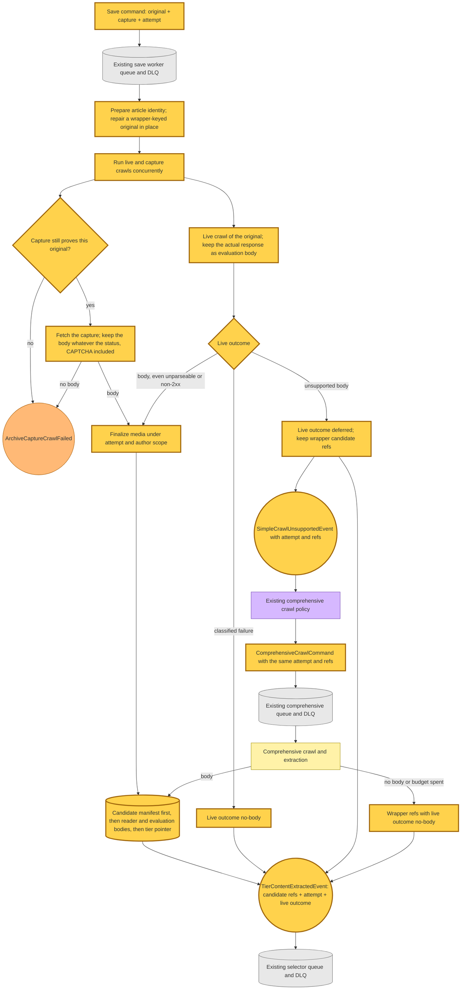

## Comparison, canonical commit and reader

Saves, recrawls, refreshes and reselection after a removal all run one
selection routine; they differ only in which aggregate transition records the
result.

**Which candidates are compared.** The selector loads the article and its
selection snapshot with a consistent read, then the candidates the event
names, the current tier pointer for every tier the event does not name, and
the current canonical candidate. A source enters the comparison only when its
manifest is complete, its original matches the article's identity, its stored
evaluation body hashes to the manifest's hash, its kind matches its tier, its
id is not revoked, and — for a wrapper source that is not already the
canonical — its source still verifies against the article. That last check
never goes back to the network: the worker that stored the candidate already
proved the pairing, so the selector unwraps the source locally or takes the
candidate's recorded original and checks it against the article's current
destination. One exception
admits content written before candidates existed: a direct (extension or live)
canonical whose stored hash matches, on an article with no pinned source or
with the pre-pin marker, is given a synthetic provenance so a clean legacy
article can keep its body.

**The judge.** The model receives the original URL and every candidate's id,
evaluation-body hash, tier, HTTP status, title, word count and condensed HTML.
It must return a readability verdict for every candidate plus a winner, a set
of tied candidates, or none. The audit records the id and hash of each body
submitted, a hash of the exact messages sent, and whether the response was
completed or rejected by the provider. A response that is empty or malformed,
names an unknown candidate, omits a readability verdict or contradicts its own
verdicts is invalid, and an invalid response fails the record so the queue
retries the comparison; so does any provider error other than a rejection of
the request (HTTP 400). A rejected request has no verdicts, so the selector
applies the deterministic tie rules below to every candidate that has a
readable body and a 2xx (or unrecorded) HTTP status.

**Choosing.** A winner is taken as named. Among tied candidates, when the
current canonical is an archive copy and a live copy is tied with it, the live
copy wins — whichever crawl finished first. Otherwise the existing rules hold:
a media difference between direct candidates goes to the fresh one, a healthy
direct canonical is kept, then live, then extension. A chosen candidate with
neither text nor media is discarded. When nothing new is chosen, the previous canonical is
retained if it is itself a verified readable candidate; when there is none,
the article is marked crawl-failed with a reason derived from this attempt's
live response status, and its summary skipped — unless the live outcome is
still *deferred*, in which case the comprehensive worker's later event decides,
or the only body is a legacy extension canonical with no tier slot left to
verify it against, which is withheld rather than failed.

**The commit.** Selection uploads nothing: it checks that the chosen
candidate's stored locations match its bytes and writes a pointer to them. The
one exception materializes a legacy direct canonical as a candidate. The
pointer, candidate id, source provenance and the aggregate transition go out
in one conditional update that requires the selection revision, content
location, destination and pinned source the selector read, an unrevoked
candidate and an unpurged row, and advances the revision. A lost race fails
the record and the retry starts from current state. When the canonical tier or
readable text changed, when the previous canonical was revoked, and on every
recrawl promotion, the same update resets the summary to pending. Version
history appends a reference to the selected immutable body — never a copy —
under the candidate and the revision just written, when the tier or the
readable text changed or when the retained canonical is this attempt's own
candidate.

**Summary and reader.** Summary generation asserts that the body it fetched
hashes to the committed canonical, conditions its own write on the selection
it read, and reuses a ready summary only when that summary was generated from
the current canonical. The reader resolves the committed pointer with a
consistent read and withholds the body, and the summary with it, when the row
is purged, when the canonical candidate is revoked, or when the committed
candidate's original no longer matches the article's destination. A row with
no committed candidate is withheld when it has archive-tier content or a
pinned source, when its stored original is an archive URL, or when its stored
original is another kind of wrapper whose redirect was never adopted to a
non-wrapper destination; a tracker or Apple News row whose destination was
already adopted keeps serving the content crawled through that redirect. A summary is
also withheld when it was not generated from the committed canonical.

**The pre-pin marker.** A clean article that is pinned after the fact would
otherwise fall into that last case. So the pin, when it lands on a row that
has no earlier pin, no committed candidate and direct content, also records
that the direct content predates the pin, and the reader and the selector both
honour that marker. A row that already carried a pin before this rule keeps
its content withheld until it is rebuilt.


[Editable BPMN](diagrams-bpmn/selection-and-reader.bpmn) · [BPMN rendering](diagrams-bpmn/selection-and-reader.png)

Mermaid source

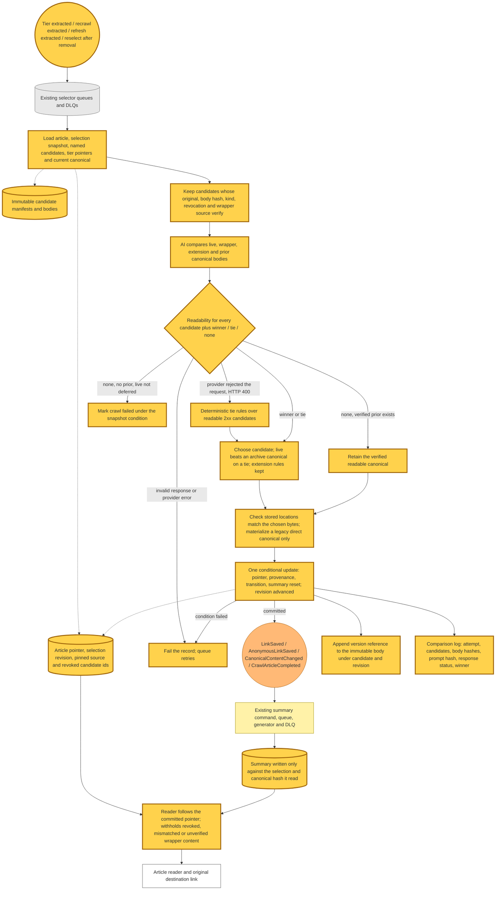

## Recrawl, refresh and authored removal

**Recrawl.** An admin recrawl stamps a fresh attempt on the recrawl event. The
worker first prepares the article's identity: a row whose stored original is
still a wrapper has the original recovered over the network and written onto
the same row — destination, and the capture as its pinned source when it is an
archive host — under a condition on the value it read, so the row key, cards
and reading history are untouched. The worker then crawls the pinned capture
and the live original concurrently, exactly as a save does, or the live
original alone when nothing is pinned, and publishes the candidates for the
shared selection. A rebuild of every already-rescued article at once has no
command and is not part of this flow.

**Redirect adoption.** Adopting a redirect destination writes the
destination's alias row and the article's destination in one transaction, and
declines when the article already has a pinned source proved against a
different original, already shows a different destination, has a committed
canonical proved against a different original, or serves a first-party capture
the reader took at the URL they saved. The pin, in turn, is accepted only for
the article's current destination. The two therefore compete on the same row and the loser
leaves neither a wrong pin nor a stray alias. A wrapper URL is never adopted
as a destination.

**Refresh.** The stale check prepares identity the same way; an article whose
original cannot be recovered has its fetch timestamp bumped and is left for the
next window. Otherwise the conditional fetch goes to the original, and a
changed body is staged as two objects — the reader body and the raw evaluation
body — under a key scoped to a fresh attempt, so one refresh cannot overwrite
another's staging. The refresh command names the response URL and the original
that was fetched. The refresh worker requires that original to still match the
article's identity before writing a live candidate and publishing it for
selection. Not-modified responses and summary auto-heal behave as before. In
production the web tier only requests a stale check; the in-process freshness
check that local development and the end-to-end server use fetches the
original and publishes the same command shape.

**Extension captures.** The raw HTML and PDF workers read the staged object for
their attempt and take its storage timestamp as the capture time, so a
redelivery does not restamp it. The submitted source must be a wrapper that
verifies against the article or a URL with the article's own identity. Raw
HTML captured on a wrapper that does not parse as an article is still stored
as an extension candidate, so the judge sees what the reader's browser saw.
A saved newsletter issue stores its email body the same way, as an extension
candidate for its attempt.

**Authored removal.** Removing an authored version resolves what the author
owns: the named legacy version copy; their extension tier slot when this is
their last authored version; when it is their last authored version or they
have none recorded, every extension candidate manifest they authored with the
bodies those name and their image manifests with the images those name;
otherwise only the candidates the removed versions name that no remaining
version of theirs still names.
The candidate ids are added to the article's revoked set, which also advances
the selection revision, before anything is deleted. Bodies and images are
deleted before their manifests and each delete response is checked for
per-object errors, so a failed delete leaves the manifest to find the object
on redelivery. The version log is pruned last.

What happens next is derived from stored state, so a redelivery reaches the
same answer. A row with a committed candidate has its legacy mutable canonical
copy deleted, so erased content cannot survive behind the pointer. When the
committed canonical is a revoked candidate — or a legacy canonical whose tier
slot is gone, in which case its hash is cleared under the selection snapshot
and its copy deleted — the article needs a new body: reselection when a
candidate with provenance and a successful (or unrecorded) HTTP status remains,
a recrawl with a fresh attempt when only savers remain, and
otherwise a purge of the article's storage prefixes followed by a tombstone.
Account deletion reaches the same purge and tombstone. A tombstone strips the
content columns, the pin and the committed candidate and advances the
revision; a later save revives the row in place, keeping the revoked set and
advancing the revision again, so an in-flight selection from before the purge
cannot commit.


[Editable BPMN](diagrams-bpmn/maintenance.bpmn) · [BPMN rendering](diagrams-bpmn/maintenance.png)

Mermaid source

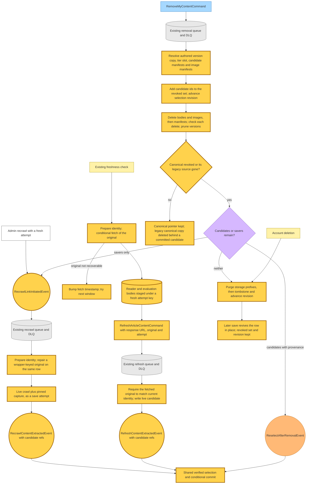

## Production health check

The existing daily health target keeps forcing a recrawl for its ordinary
sources. Its archive entries instead exercise the normal authenticated save: a
dedicated, existing, verified account logs in once and submits the readlist
save form for the exact Wayback capture, the Wayback calendar form, the direct
original, and an archive.today capture, in that order. The account's email and
password are required environment values; the check never signs up, deletes or
emails. Runs share one concurrency group and a running check is never
cancelled.

For each archive save the check requires the accepted 303 to name its attempt
in an `x-readplace-save-attempt-id` response header — an entry fails when the
header is absent — and polls the selector's log for that attempt's comparison. A comparison
counts only when it includes this attempt's fresh live candidate or an explicit
live *no body* outcome, so the first comparison of a deferred PDF cannot
satisfy it. The check then requires:

- the comparison ran under the expected original and every candidate belongs
  to it;
- exactly one fresh wrapper candidate, fetched from the capture the entry
  expects (the calendar entry expects the latest-capture URL), whose id and
  body hash appear in the audit of what was sent to the judge;
- a completed judge response — a rejected or invalid one cannot pass;
- the wrapper's stored evaluation body, read back from the content bucket,
  hashing to the hash the judge saw;
- for the Wayback entries, that fresh body judged readable and containing the
  expected article text — a retained copy that still reads fine does not make
  the entry pass;
- a readable selected or retained winner.

An archive.today CAPTCHA may lose to a live, extension or retained copy; the
report then says the fresh archive copy was *not confirmed* and names the real
winner. Every save entry must also leave exactly one card for the original at
the top of the readlist, and the calendar and direct saves must land on the
card the first save produced. The reader is then checked for the expected
content. The run writes a JSON report with attempt, capture, hashes and winner
per entry, uploads it as a workflow artifact, and appends a line per entry to
the run summary.


[Editable BPMN](diagrams-bpmn/production-health.bpmn) · [BPMN rendering](diagrams-bpmn/production-health.png)

Mermaid source

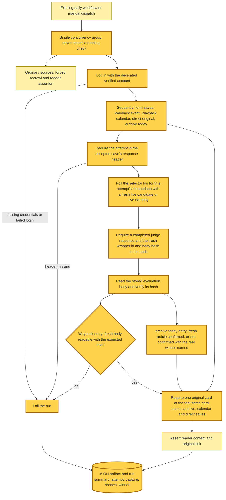

## Command → System → Event(s) reference

| Command or trigger | System and storage | Fact or terminal result | Next command or consumer |
|---|---|---|---|
| Web save bar, Siren single save, MCP save, newsletter-issue link save | Web tier resolves the wrapper chain in the request, then the shared accept phase writes the readlist row, alias binding and archive pin | LinkQueued, QueueEntryCreated; 303 or 201. Unresolved: 303 queued notice, 409 Siren notice or MCP pending | SaveLinkCommand; SubmitLinkCommand when unresolved |
| Bulk save, import commit | Web tier resolves from stored bindings and local unwrap; shared accept phase | LinkQueued, QueueEntryCreated per accepted link; unresolved bulk entries report `created` with a `queued` code | SaveLinkCommand; SubmitLinkCommand when unresolved |
| Content intake (inline bytes, upload slot, upload completion) | Web tier resolves in the request, stages bytes under the attempt key, accepts, then dispatches | LinkQueued, QueueEntryCreated; 201. Unresolved: 409 notice for inline bytes, 422 for slot and completion | SaveLinkRawHtmlCommand or SaveLinkRawPdfCommand; SubmitLinkCommand for unresolved inline bytes |
| Anonymous reader visit | Web tier resolves in the request; stub article, archive pin | Reader page; 422 error page when a new wrapper cannot be resolved | SaveAnonymousLinkCommand for a new article or an offered capture; StaleCheckRequested unless a capture was offered |
| SubmitLinkCommand | Existing submit queue and worker: network resolution, shared accept phase, live and capture crawl in process | LinkQueued, QueueEntryCreated, TierContentExtractedEvent; LinkQueueFailed from the existing DLQ consumer when retries are exhausted | Existing selector |
| SaveLinkCommand / SaveAnonymousLinkCommand | Existing save queues: identity preparation, live crawl of the original, verified capture crawl, immutable candidate storage | TierContentExtractedEvent with candidate references, attempt and live outcome; ArchiveCaptureCrawlFailed when the source does not verify or returns no body; SimpleCrawlUnsupportedEvent for a deferred body | Existing selector; comprehensive-crawl policy |
| SaveLinkRawHtmlCommand / SaveLinkRawPdfCommand | Existing raw-capture queues: read the attempt's staged object, verify the submitted source, finalize, store an extension candidate | TierContentExtractedEvent with the extension candidate and attempt | Existing selector |
| SaveEmailIssueCommand | Existing issue worker: stores the email body as an extension candidate for the attempt | TierContentExtractedEvent with the candidate and attempt | Existing selector |
| SimpleCrawlUnsupportedEvent | Existing policy forwards the attempt and candidate references | ComprehensiveCrawlCommand dispatched | Existing comprehensive queue |
| ComprehensiveCrawlCommand | Existing comprehensive worker: crawls a pinned capture when no references came with the command, then the original; immutable candidate storage | Tier, recrawl or refresh extracted event with the live candidate added; with wrapper references and no body, the same event with live outcome no-body | Save, recrawl or refresh selector according to command mode |
| TierContentExtractedEvent | Existing selector queue: candidate verification, AI comparison, conditional commit of pointer and aggregate transition, version reference | LinkSaved or AnonymousLinkSaved, CanonicalContentChanged, CrawlArticleCompleted as aggregate effects; comparison log entry | Summary pipeline and existing read-model consumers |
| RecrawlLinkInitiatedEvent | Existing recrawl worker: identity preparation with in-place repair, live crawl plus pinned capture | RecrawlContentExtractedEvent with candidate references and attempt | Existing recrawl selector, same selection routine |
| StaleCheckRequested | Existing stale-check worker: identity preparation, conditional fetch of the original, staging under a fresh attempt | RefreshArticleContentCommand; fetch-timestamp bump when the original cannot be recovered; SimpleCrawlUnsupportedEvent for a deferred body | Existing refresh queue; comprehensive-crawl policy |
| RefreshArticleContentCommand | Existing refresh worker: checks the fetched original against current identity, reads the attempt's staged bodies, stores a live candidate | RefreshContentExtractedEvent with candidate reference and attempt | Existing refresh selector, same selection routine |
| GenerateSummaryCommand | Existing generation queue and worker: reads the committed canonical, checks its hash, writes under the selection it read | GlobalSummaryGenerated or SummaryGenerationFailed; skipped where appropriate | Reader summary state; existing failure logging |
| RemoveMyContentCommand | Existing removal queue: resolve authored objects, revoke candidate ids, delete bodies then manifests, prune versions | ReselectAfterRemovalEvent, RecrawlLinkInitiatedEvent, or purge and tombstone | Existing reselection queue, same selection routine; existing recrawl worker |
| ReselectAfterRemovalEvent | Existing reselection queue: the shared selection over the remaining candidates | Same facts as a save selection | Summary pipeline and existing read-model consumers |
| Daily health workflow | Existing schedule and target: forced recrawls for ordinary sources; authenticated form saves, read-only log and candidate-object inspection for archive entries | Pass, or a failed entry recorded in the JSON artifact and run summary | Existing workflow failure handling |

## Failure and contract boundaries

The existing queues keep their retry windows and dead-letter routes, and
exhausted records still reach their existing failure handlers and alarms. A
capture that cannot be verified or fetched never relabels the original
article's crawl state. A selection that loses its conditional commit, or whose
judge response is invalid, fails the record and is retried from current state.

The save-attempt id is required and branded on every internal command, event
and provider contract that takes part in a save, recrawl or refresh, and the
content-extracted events require candidate references. A message published
before those fields existed fails schema validation in its consumer and drains
to that queue's dead-letter queue.

Infrastructure is limited to grants and a bucket policy on existing resources:
the refresh worker can read the content bucket and get the article row, and
the image CDN's read grant is
narrowed to the image prefixes and `robots.txt`. The health workflow needs the
canary account's credentials, read access to the selector's log group and to
candidate objects in the content bucket.

The evaluation-body hash shows which fetched bytes were given to the judge and
the prompt hash shows which exact messages were sent. Neither makes archived
content authentic, and the judge can still misjudge completeness.

The [health workflow runbook](../../.github/workflows/tier-1-plus-crawl-pipeline-health.md)
covers how to read a failed archive entry.

## Source map

- [Shared save acceptance and identity resolution](../../src/packages/save-article/src/) and the [wrapper grammar](../../src/packages/domain/src/article/wrapper-url.ts).
- [Save workers](../../projects/save-link/src/runtime/domain/save-link/) and the [selection routine](../../projects/save-link/src/runtime/domain/select-content/).
- [Immutable candidate providers](../../projects/save-link/src/runtime/providers/article-store/) and the [conditional commit and read guards](../../src/packages/article-store/src/).
- [Authored removal](../../projects/save-link/src/runtime/domain/remove-my-content/) and the [health check](../../src/packages/crawl-article/scripts/tier-1-plus-pipeline-health.ts) with its [archive save evidence](../../src/packages/crawl-article/scripts/archive-health-evidence.ts).
- [Shared event catalogue](../../src/packages/hutch-infra-components/) and the [save-link infrastructure](../../projects/save-link/src/infra/index.ts).
