# Archive capture tier — event storming

**Commit:** `a1a9ea793` — *fix(@packages/save-article,@packages/provider-contracts): save an archive URL under its original*
**Commit date:** 2026-10-04 · **Generated:** 2026-10-04 · **Branch:** `main`

A point-in-time map of what happens when a reader saves a Wayback Machine or
archive.today URL. The base commit already keys such a save on the **original**
article URL the archive path names, and records the archive URL on the article
row as its content source. Until now that recorded capture was the *only* thing
the crawl fetched: the "adopted fetch URL" lookup returned the capture, so the
tier-1 slot held the archive's copy and the live article was never crawled.

The working tree turns the capture into its own content tier. The tier-1 crawl
fetches the live original again. The capture is crawled separately into a third
per-tier source slot, **tier-2**, and the existing selector judges tier-0
(extension capture), tier-1 (live crawl) and tier-2 (archive capture) together.
A second command per save carries the capture, so the capture crawl runs on the
same Lambdas and queues as the tier-1 crawl. When the live origin is dead
(fetch failed, 404, or blocked), the tier-1 crawl falls back to fetching the
recorded capture, so an archived article whose origin has gone still gets a
tier-1 body. A capture that cannot be crawled publishes a new
`ArchiveCaptureCrawlFailedEvent` and never moves the article's crawl state,
because the tier-1 crawl owns that state.

No new Lambda, queue, EventBridge rule or IAM grant. The wire changes are one
optional field on two commands, one new event with no subscriber, and the tier
enum widened to `tier-2` on two events.

> Captured from the uncommitted working tree — the archive capture tier is
> uncommitted on top of the base commit `a1a9ea793` (which shipped the
> "save under the original" identity). Every claim below was checked against
> the tree as it stood when the snapshot was taken.

---

## Legend


Gold (`classDef new fill:#ffd24c,stroke:#a0660b,stroke-width:3px;`, applied with
`:::new`) marks a node that is new or whose behaviour changed in this snapshot.
The gold overrides the role colour; the role is still readable from the label.
The other colours keep the shared event-storming roles.

Mermaid source

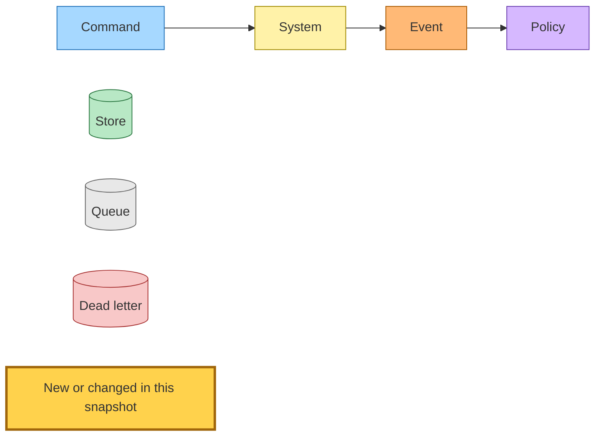

---

## 1. Accepting an archive save

Every authenticated save surface — the web save bar (`POST /queue/save`), the
extension and iOS Siren action, bulk save, import commit, the MCP save tool, and
the `SubmitLinkCommand` subscriber — runs the one shared accept phase. It first
resolves the save identity. For an archive snapshot URL (a Wayback or
archive.today shape, recognised syntactically or by the network wrapper
resolver), the identity is the original article URL and the archive URL becomes
the `contentSourceUrl`. The freshness probe returns the identity it resolved, so
the save never re-resolves between the probe and the write (base commit).

The accept phase then writes the global and per-user rows under the original.
**New:** on every freshness branch — `new`, `refreshed` and `skip` — it pins the
capture onto the article row (`contentSourceUrl`) and publishes a **second**
`SaveLinkCommand` carrying `captureUrl`. The `new` branch still publishes the
plain `SaveLinkCommand` for the live tier-1 crawl first; `refreshed` publishes
it only when the refreshed article has content; `skip` publishes none. On the
`new` branch a non-article host returns right after the pin, before either
publish. The accepted-save fact and the
queue-entry fact are unchanged.

The anonymous `/view/<url>` first visit does the same with
`SaveAnonymousLinkCommand`: after the global stub, the pin, and the two pending
marks, it publishes the plain command and then a second one carrying
`captureUrl`. A repeat visit only publishes a stale check, as before.

Inside the `submit-link` Lambda, `SaveLinkCommand` is never published: the
accept phase's link-saved publisher is an in-memory collector, so the capture
entry arrives in the same list as the tier-1 entry and is crawled in process
(section 2).


Mermaid source

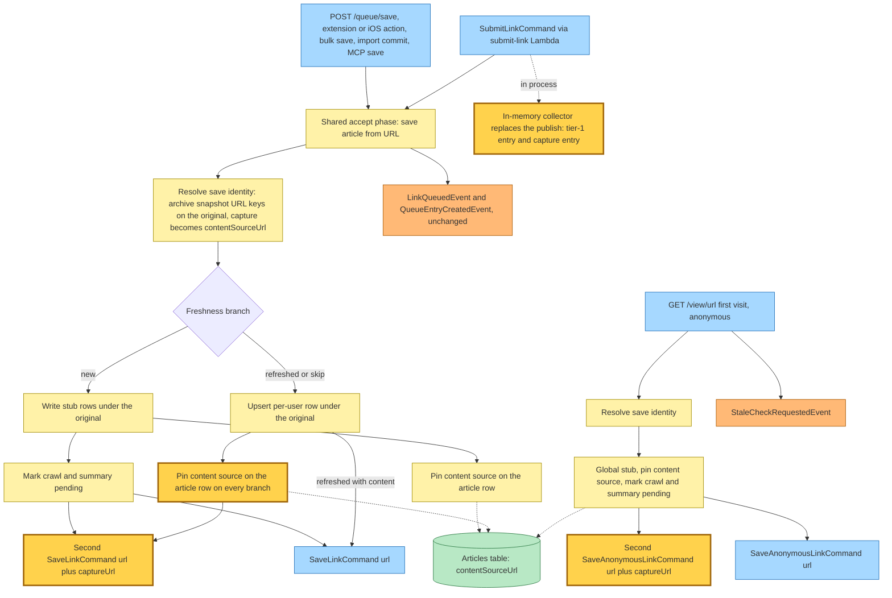

---

## 2. Crawling the capture into tier-2

`SaveLinkCommand` and `SaveAnonymousLinkCommand` reach their existing Lambdas
through their existing rules and queues (480 s visibility, `maxReceiveCount` 1,
the shared `save-link-failures` dead-letter queue). **New:** each handler checks
`captureUrl` first. When it is present the handler skips the tier-1 work
entirely and runs the capture crawl:

1. Crawl and finalize with a separate fetch URL: the capture is fetched (and is
   the URL the saveable-URL guard checks), but the article is finalized and its
   media stored under the original URL.
2. Read the tier snapshot only to log a crawl outcome line with
   `thisTier = tier-2`.
3. On success, write the tier-2 source — `articles/<id>/sources/tier-2.html`
   plus its JSON metadata sidecar, which now carries `sourceUrl` = the capture —
   and publish `TierContentExtractedEvent { tier: tier-2 }` (with `userId` on the
   authenticated path) into the existing selector.
4. On any non-fetched result (failed, unsupported, not-found, blocked,
   not-modified), publish the new `ArchiveCaptureCrawlFailedEvent
   { url, captureUrl, reason }`, log a warning, and ack. Nothing subscribes to
   the event. Crawl state is not touched: the tier-1 command for the same save
   owns pending → ready or exhausted.

A capture crawl that *throws* (an S3 or DynamoDB error, for example) fails the
record, which goes to the shared dead-letter queue after its one receive. The
dead-letter router's `SaveLinkCommand` and `SaveAnonymousLinkCommand` routes
**now skip** a command carrying `captureUrl`, logging a warning instead of
marking the original article's crawl exhausted — a capture failure must not
terminalise a tier-1 crawl that may still succeed.

The `submit-link` Lambda runs the same capture crawl in process for every
collected capture entry and publishes the same `TierContentExtractedEvent`. Its
tier-1 entries keep their try/catch that terminalises in process. The capture
crawl has no such wrapper, so a throw there fails the whole submit record, which
SQS redelivers (up to 3 receives); every step of the accept phase it replays is
idempotent. Its dead-letter route is unchanged (publishes `LinkQueueFailedEvent`).


Mermaid source

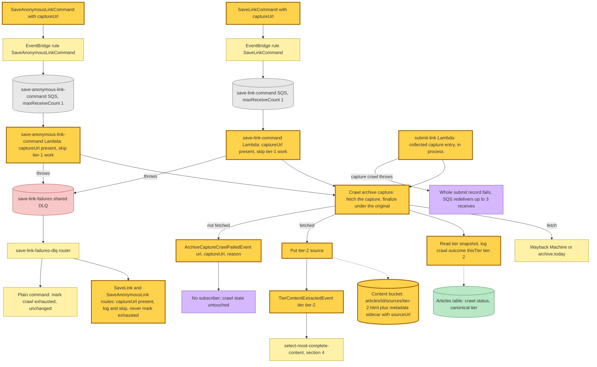

---

## 3. Tier-1 crawl: the live original, with a dead-origin fallback

The plain command's tier-1 crawl is the existing save-link work: crawl and
finalize, write the tier-1 source, publish `TierContentExtractedEvent
{ tier: tier-1 }` (or defer a non-HTML body to the comprehensive-crawl chain, or
terminalise in process). What changed is which URL the crawl fetches.

- **Changed:** the adopted-fetch-URL lookup that the pinned-crawl decorator
  calls now returns only an adopted redirect terminal (`displayUrl`). It no
  longer returns `contentSourceUrl`, so the tier-1 crawl of an archive-saved
  article fetches the live original instead of the capture. This lookup is
  shared by every crawl Lambda, so stale-check refreshes and comprehensive
  crawls of an archive-saved article also stop fetching the capture.
- **New:** a capture-fallback decorator wraps the crawl in the four Lambdas that
  take a save or recrawl — `save-link-command`, `save-anonymous-link-command`,
  `submit-link` and `recrawl-link-initiated`. When the live crawl comes back
  `failed`, `not-found` or `blocked`, it looks up the row's recorded capture.
  If there is one, it crawls the capture instead and returns that result, which
  is finalized and stored as **tier-1** under the original. `fetched`,
  `not-modified` and `unsupported` pass through untouched, and so does any
  result for an article with no recorded capture.

The capture crawl in section 2 goes through the same decorated crawl. Its fetch
URL is the capture itself, which has no adopted terminal and no content source
of its own, so neither decorator redirects it.


Mermaid source

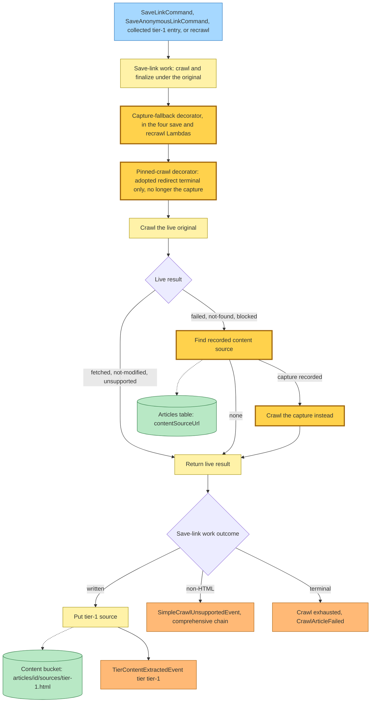

---

## 4. Selecting canonical across three tiers

`TierContentExtractedEvent` (any tier) reaches the existing
`select-most-complete-content` Lambda through its existing rule and queue. The
tier list it reads is now the shared three-value content-tier enum, so it
lists the tier-0, tier-1 and tier-2 sources for the URL. The rest of the flow is
unchanged: no source throws and redelivers; one source wins by default; two or
more go to the DeepSeek selector, which names a winner or a tie.

**Changed tie resolution:**

- The "media changed" promotion (promote the freshly written tier when the
  tiers differ in media) is skipped when the fresh tier is tier-2, and tier-2 is
  left out of the media comparison. An archive capture never wins on media.
- When there is no healthy canonical (none yet, or the canonical's summary was
  skipped as too short), the fallback order is tier-1, then tier-0, then tier-2.
  The archive copy is the last resort.
- A healthy canonical is kept, as before.

Promotion writes the canonical copy and the article row's `contentSourceTier`,
which can now be `tier-2`, and emits the existing `CanonicalContentChangedEvent`,
`CrawlArticleCompletedEvent` and `LinkSavedEvent` / `AnonymousLinkSavedEvent`.
The tier value carried downstream in `ReaderViewLoadingSucceeded.contentSourceTier`
is widened to `tier-2` to match, and the admin recrawl page's tier badge gains
"Showing Tier 2 (archive capture)".

The same three-tier listing is used by the refresh selector, the reselect-after-
removal selector and the remove-my-content handler, so a tier-2 source takes
part in refresh reselection and counts as a remaining source after a removal.
Tombstoning an article now also clears its `contentSourceUrl`.


Mermaid source

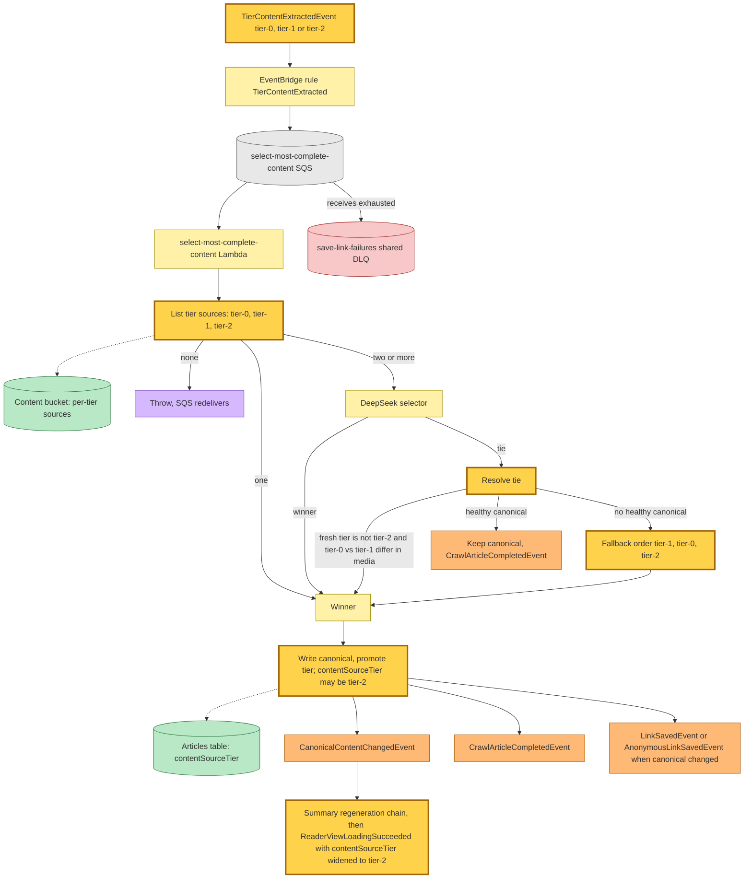

---

## 5. Recrawl

`RecrawlLinkInitiatedEvent` has two publishers: the admin recrawl page (after it
re-checks that a wrapper URL still resolves to the same article and forces the
crawl back to pending) and the remove-my-content handler (when no tier source is
left but savers remain). Its Lambda keeps its queue (480 s visibility,
`maxReceiveCount` 1, shared dead-letter queue).

**New:** the handler first looks up the row's recorded capture. If there is one,
it runs the capture crawl from section 2 into tier-2 — failures publish
`ArchiveCaptureCrawlFailedEvent` as before and do not stop the recrawl. Then it
runs the tier-1 recrawl of the live original, through the dead-origin fallback.
It publishes one `RecrawlContentExtractedEvent` when **either** tier wrote a
source. Before, a deferred or terminal tier-1 result skipped the event outright;
now a tier-2 write alone is enough to re-run selection. A deferred tier-1 result
still hands the tier-1 work to the comprehensive Lambda, which publishes its own
`RecrawlContentExtractedEvent` later.

The recrawl selector lists all three tiers and uses the same tie resolution
(with tier-1 as the fresh tier, so media promotion compares only tier-0 and
tier-1), then publishes `CanonicalContentChangedEvent` and
`RecrawlCompletedEvent` as before. Its dead-letter route is unchanged: a thrown
recrawl record still marks the crawl exhausted.


Mermaid source

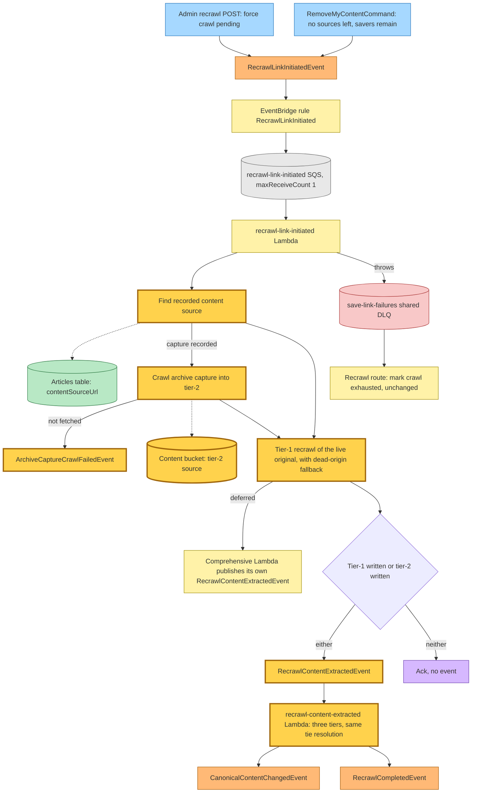

---

## Command → System → Event(s) reference

| Command / event | System that handles it | Event(s) emitted | Next command(s) triggered |
|---|---|---|---|
| `POST /queue/save` and the other authenticated save surfaces (archive URL) | hutch web Lambda, shared accept phase | `SaveLinkCommand` `{url}` (new branch, or refreshed with content); **changed:** a second `SaveLinkCommand` `{url, captureUrl}` on every freshness branch; `LinkQueuedEvent`; `QueueEntryCreatedEvent` | the two `SaveLinkCommand`s |
| `GET /view/<url>` first visit (archive URL, anonymous) | hutch web Lambda | `SaveAnonymousLinkCommand` `{url}`; **new:** a second `SaveAnonymousLinkCommand` `{url, captureUrl}`; `StaleCheckRequestedEvent` | the two `SaveAnonymousLinkCommand`s |
| `SubmitLinkCommand` (archive URL) | `submit-link` Lambda, accept phase plus in-process crawls | `TierContentExtractedEvent` tier-1 and/or **new** tier-2; **new** `ArchiveCaptureCrawlFailedEvent` on a failed capture; `LinkQueuedEvent`; `QueueEntryCreatedEvent` | none (crawls run in process) |
| `SaveLinkCommand` `{url}` | `save-link-command` Lambda, tier-1 crawl of the live original with the **new** dead-origin fallback | `TierContentExtractedEvent` tier-1, or `SimpleCrawlUnsupportedEvent`, or a terminal crawl failure | selector; comprehensive-crawl chain |
| **changed** `SaveLinkCommand` `{url, userId, captureUrl}` | `save-link-command` Lambda, capture crawl | **new** `TierContentExtractedEvent` tier-2 (with `userId`), or **new** `ArchiveCaptureCrawlFailedEvent` | selector |
| `SaveAnonymousLinkCommand` `{url}` | `save-anonymous-link-command` Lambda, tier-1 crawl with the dead-origin fallback | `TierContentExtractedEvent` tier-1, or the existing deferral / failure events | selector; comprehensive-crawl chain |
| **changed** `SaveAnonymousLinkCommand` `{url, captureUrl}` | `save-anonymous-link-command` Lambda, capture crawl | **new** `TierContentExtractedEvent` tier-2, or **new** `ArchiveCaptureCrawlFailedEvent` | selector |
| **new** `ArchiveCaptureCrawlFailedEvent` `{url, captureUrl, reason}` | no subscriber | — | — |
| dead letter from `save-link-command` or `save-anonymous-link-command` | `save-link-failures-dlq` router | **changed:** a command with `captureUrl` is logged and skipped; without it, crawl exhausted as before | none |
| **changed** `TierContentExtractedEvent` (tier enum widened to `tier-2`) | `select-most-complete-content` Lambda, three tiers, archive-last tie resolution | `CanonicalContentChangedEvent`, `CrawlArticleCompletedEvent`, `LinkSavedEvent` / `AnonymousLinkSavedEvent` | summary regeneration chain |
| `RecrawlLinkInitiatedEvent` (admin recrawl, remove-my-content) | `recrawl-link-initiated` Lambda, **changed:** capture crawl into tier-2 first, then tier-1 with the fallback | **changed:** `RecrawlContentExtractedEvent` when either tier wrote; **new** `ArchiveCaptureCrawlFailedEvent` | recrawl selector |
| `RecrawlContentExtractedEvent` | `recrawl-content-extracted` Lambda, three tiers | `CanonicalContentChangedEvent`, `RecrawlCompletedEvent` | summary regeneration chain |
| **changed** `ReaderViewLoadingSucceeded` (`contentSourceTier` widened to `tier-2`) | existing reader-ready fan-out | unchanged | unchanged |

## Stores

| Store | Status | What changed |
|---|---|---|
| Articles table | changed use | `contentSourceUrl` is pinned on every save branch, read by the capture-fallback decorator and the recrawl handler, no longer returned as the adopted fetch URL, and cleared on tombstone; `contentSourceTier` and `canonicalSourceTier` accept `tier-2` |
| Content bucket | new key | `articles/<id>/sources/tier-2.html` and its metadata sidecar, which gains an optional `sourceUrl` |

## Known gaps

- `ArchiveCaptureCrawlFailedEvent` has no subscriber. A failed capture is
  visible only in logs and the crawl-outcome stream; the article stays on
  whatever tier-1 produced.
- In `submit-link`, a throwing capture crawl fails the whole submit record and
  replays the accept phase and the tier-1 crawl on redelivery.
- The dead-origin fallback is wired only into the four save and recrawl
  Lambdas. Stale-check refreshes and comprehensive crawls of an archive-saved
  article now fetch the live original and get no capture fallback.
