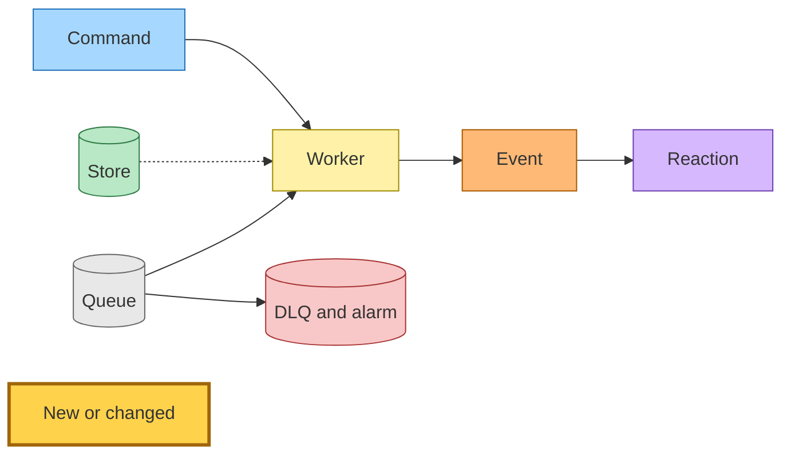
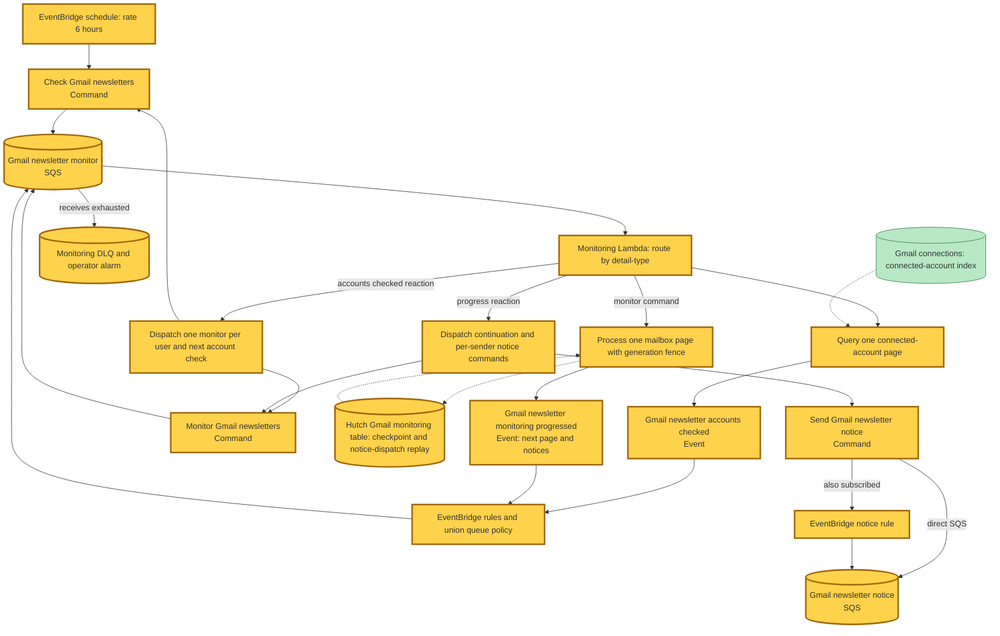
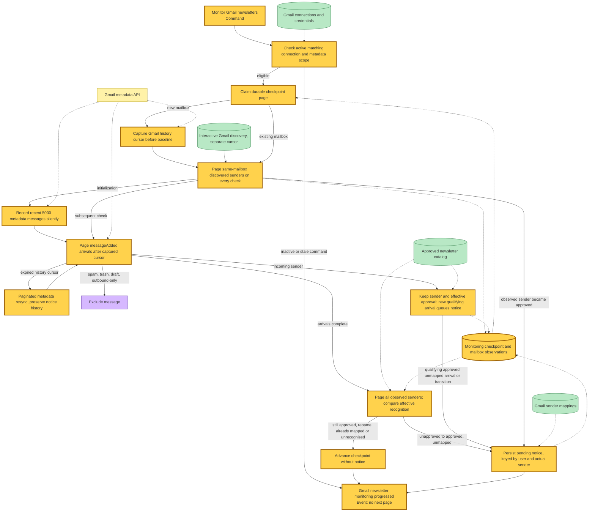
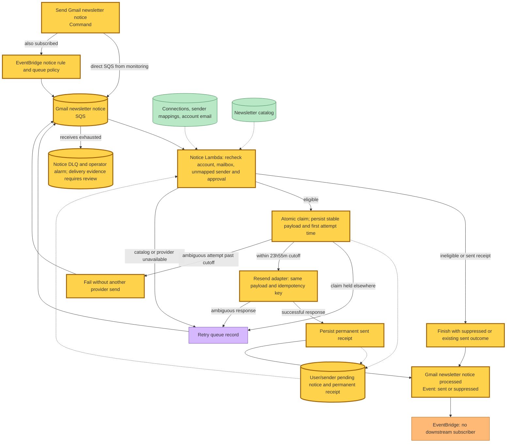
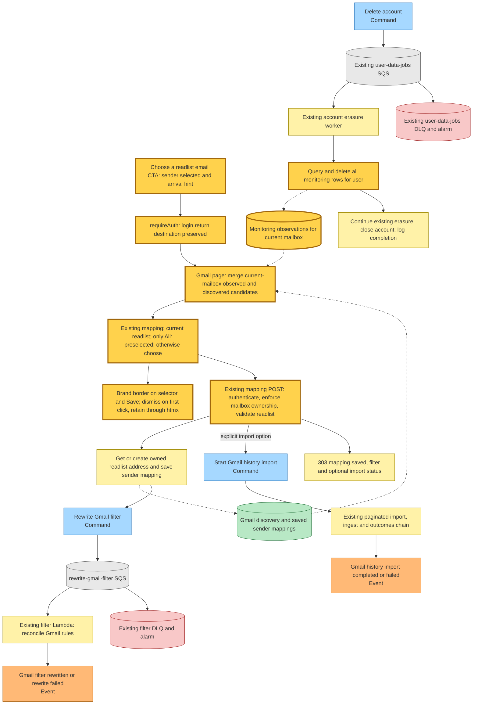

# Approved Gmail newsletter notifications

Generated **2026-10-04** on `main`, from the uncommitted working tree over **`f532f07f0`** (2026-10-04, `ci: check for newer completed runs per commit in the deploy re-run guard`). The entry is the six-hour scheduled Gmail check. The working tree adds monitoring, notification delivery, account erasure and the existing Gmail picker's email arrival experience; no commit has been created.

Readplace sends one email per user and actual FROM address when an approved, unmapped newsletter arrives in the user's connected Gmail mailbox, or when a previously observed sender becomes approved. The recipient is the user's Readplace account address. Initial observations are silent. Notification receipts survive mapping removal and Gmail reconnection; deleting the Readplace account erases them.

## Legend

Blue is a command; yellow a worker or aggregate; orange an event; purple a reaction; green a store; grey a queue; red a DLQ. **Gold with a thick border marks new or changed behaviour in this snapshot**, including the new table and queue-backed workers. Solid arrows carry commands, events or execution; dotted arrows read or write data. Every queue has a DLQ with an operator alarm. All new asynchronous command handlers finish by publishing a fact through EventBridge.

[BPMN PNG](diagrams-bpmn/legend.png) · [BPMN XML](diagrams-bpmn/legend.bpmn)

Mermaid source

## Scheduled account enumeration and durable continuation

An EventBridge schedule fires every six hours and delivers `CheckGmailNewslettersCommand` to the monitoring SQS queue. The worker queries the existing connected-account index in pages; it never scans DynamoDB. It emits `GmailNewsletterAccountsCheckedEvent` with the users in that page and an optional next account-page token. The same queue consumes that fact, dispatching one `MonitorGmailNewslettersCommand` per account and another check command when enumeration has more pages.

A monitoring command works one durable mailbox page and publishes `GmailNewsletterMonitoringProgressedEvent`. The event's reaction dispatches the next monitoring page and separate `SendGmailNewsletterNoticeCommand` messages directly to their SQS queues. EventBridge subscriptions also accept these commands. This separates preventable intent from the facts that route follow-up work. The monitoring Lambda allows recursive invocation because page continuations deliberately return to the same queue; page exhaustion and persisted generation/page fences terminate the loop. Duplicate deliveries replay the durable continuation and converge on the same notice rows.

The checkpoint stores `noticesToDispatch` alongside the page advancement before the worker publishes progress. If publication fails after the write, a retry of that page recovers the same notice list from the advanced checkpoint, including the terminal page. The following page clears the replay payload as it advances. Pending notice rows remain durable independently of EventBridge publication.

[BPMN PNG](diagrams-bpmn/scheduled-monitoring.png) · [BPMN XML](diagrams-bpmn/scheduled-monitoring.bpmn)

Mermaid source

## Mailbox observations and recognition

The monitoring history cursor is independent of the interactive sender-discovery cursor. A run requires an active Gmail connection with metadata permission. Reconnecting the same mailbox preserves its observations and cursor. Switching mailboxes initializes a new mailbox identity and observation set while retaining user/sender notification receipts. Earlier observation rows remain isolated by the current checkpoint, including when the reader later switches back; account deletion erases them all.

Initialization first captures the current Gmail history cursor, seeds previously discovered senders belonging to the same mailbox, and pages through the recent discovery window of approximately 5,000 incoming messages. Existing approved senders are recorded silently. It then reads arrivals after the captured cursor so issues arriving during initialization are still eligible. History requests select `messageAdded`; spam, trash, drafts and outbound-only messages use the existing exclusions. Label changes cannot qualify.

Unknown, pending and rejected senders stay observed. Every check pages through the current mailbox's interactive discovery cache before reading arrivals, retaining later-discovered senders outside the initial recent-message window. The discovery adapter provides a strongly consistent user-scoped sender-key query bounded to 25 entries, with a durable cursor; the original whole-list UI reader remains available. After arrivals, a paginated reconciliation compares observed senders' effective approval with the current catalog. An unrecognised-to-approved transition can queue a notice without a new arrival. Exact records take precedence over wildcards, including pending or rejected exact overrides; replaced records fall through. Renames and approved exact records created automatically under an already-approved wildcard preserve the existing approved state and produce no transition notice. Removing a mapping alone produces no notification.

An expired history cursor causes paginated metadata resynchronization, preserving observations and sent receipts. Gmail documents full synchronization after an expired `startHistoryId` returns HTTP 404 in its [history API](https://developers.google.com/workspace/gmail/api/reference/rest/v1/users.history/list). Interrupted pages resume from the stored mode, cursor and page token rather than restarting notification history. Catalog failures fail the queue record without treating an unavailable catalog as unapproved.

[BPMN PNG](diagrams-bpmn/mailbox-observations.png) · [BPMN XML](diagrams-bpmn/mailbox-observations.bpmn)

Mermaid source

## One email per sender and bounded retry

The notice worker rechecks the current connection and mailbox, sender mapping, approval and Readplace account email. Ineligible notices are suppressed. Eligible work atomically claims the user/sender notice, persists the rendered email and first-attempt time, then sends through the existing Resend adapter with a stable provider idempotency key. The payload includes the current newsletter name when available, the sender address, explanatory copy and a tracked **Choose a readlist** link. Retries use the persisted payload rather than rebuilding it from changed catalog or account data.

A successful send becomes a permanent sent receipt before `GmailNewsletterNoticeProcessedEvent` (`sent`) is published. A repeat command for a sent receipt publishes that same `sent` fact without sending another email. Competing workers cannot both claim a live attempt. Provider ambiguity is retried with the same key and payload only inside the first attempt's 24-hour window: [Resend retains idempotency keys for 24 hours](https://resend.com/changelog/idempotency-keys). Readplace stops retrying at 23 hours and 55 minutes, leaving a five-minute margin. An unresolved send beyond that cutoff fails to the DLQ while retaining its claim; an automatic redrive cannot risk a second email. A catalog outage likewise retries through SQS instead of sending with uncertain approval.

[BPMN PNG](diagrams-bpmn/notification-delivery.png) · [BPMN XML](diagrams-bpmn/notification-delivery.bpmn)

Mermaid source

## Choosing a readlist, forwarding and erasure

The email opens `/newsletters/gmail` with FROM selected. Authentication preserves this local destination. The Gmail page merges observations belonging to the authenticated user's current mailbox with the existing discovery candidates, and mapping POST validation uses the same ownership rule. A sender already mapped opens its current destination rather than overwriting it.

For multiple readlists, the reader chooses a destination before Save becomes available. With only All, that destination is preselected. On email arrival, both the selector and Save have a distinct `--color-brand` border. The first click anywhere, including a click on disabled Save, clears both. The picker retains dismissal through htmx refreshes; the arrival marker is excluded from subsequent form and polling URLs. Keyboard focus remains distinct, border space is reserved, and the mapping form still works without JavaScript.

Save uses the existing mapping POST and `RewriteGmailFilterCommand`. Future forwarding follows the existing Gmail filter and inbound sender-routing path. An explicitly selected import starts the existing unread-last-30-days job and incremental read-only consent flow; it remains optional. Disconnecting stops eligibility, while account deletion queries and deletes the user's entire monitoring partition, including permanent receipts. No Gmail reconnection or mapping removal deletes receipts.

[BPMN PNG](diagrams-bpmn/landing-and-cleanup.png) · [BPMN XML](diagrams-bpmn/landing-and-cleanup.bpmn)

Mermaid source

## Command → System → Event(s) reference

| Command or event | System that handles it | Event(s) emitted | Next command(s) triggered |
|---|---|---|---|
| **new** `CheckGmailNewslettersCommand` `{accountsPageToken?}` | monitoring Lambda, connected-account page branch | **new** `GmailNewsletterAccountsCheckedEvent` | none directly |
| **new** `GmailNewsletterAccountsCheckedEvent` `{userIds, nextAccountsPageToken?}` | monitoring Lambda, accounts reaction | none | **new** `MonitorGmailNewslettersCommand` per user; **new** `CheckGmailNewslettersCommand` for the next account page |
| **new** `MonitorGmailNewslettersCommand` `{userId, continuation?: {generation, page}}` | monitoring Lambda, one checkpointed mailbox page | **new** `GmailNewsletterMonitoringProgressedEvent` | none directly |
| **new** `GmailNewsletterMonitoringProgressedEvent` `{userId, nextPage?, notices}` | monitoring Lambda, progress reaction | none | **new** `MonitorGmailNewslettersCommand` continuation and **new** `SendGmailNewsletterNoticeCommand` per notice |
| **new** `SendGmailNewsletterNoticeCommand` `{userId, senderEmail}` | notice Lambda | **new** `GmailNewsletterNoticeProcessedEvent` (`sent` or `suppressed`) | none |
| **new** `GmailNewsletterNoticeProcessedEvent` | no subscriber | — | — |
| `RewriteGmailFilterCommand` | existing queue-backed filter Lambda | `GmailFilterRewrittenEvent` or `GmailFilterRewriteFailedEvent` | none |
| `StartGmailHistoryImportCommand` | existing paginated history import chain, when explicitly requested | existing page/fetched/ingested facts and `GmailHistoryImportCompletedEvent` or `GmailHistoryImportFailedEvent` | existing import page continuations and inbox link processing |
| `DeleteAccountCommand` | existing user-data-jobs Lambda, now also erasing monitoring rows | none (existing flow ends at completion log) | none |

## State and grants

| State | Ownership and access pattern | Readers and writers |
|---|---|---|
| **new** `hutch-gmail-monitoring-{stage}` | Hutch-owned DynamoDB table; partition `userId`, sort key `key`: `STATE`, `OBS#<mailboxId>#<senderEmail>` and `NOTICE#<senderEmail>`; durable checkpoints, mailbox observations, pending notices and permanent receipts; user-scoped Query, no Scan; no TTL on receipts | monitoring worker reads/writes pages and observations; notice worker atomically claims and stores receipts; web reads current-mailbox observations; account erasure queries/deletes the user partition |
| Existing Gmail connections | paginated connected-account index for enumeration; primary user lookup for eligibility | monitoring and notice workers read; existing connection lifecycle owns writes |
| Existing Gmail credentials | metadata token and scope; no message body permission added by monitoring | monitoring reads the existing credential provider |
| Existing Gmail sender mappings | user-scoped sender lookup before pending notice and again before send | monitoring and notice workers read; existing mapping POST writes |
| Existing discovery store | cached senders used only when mailbox ownership matches; strongly consistent 25-sender pages keyed by user and sender, reseeded each check; interactive history cursor remains independent | monitor reads paginated cached senders; existing discovery worker owns writes |
| Existing newsletter catalog bucket | private ETag-validated catalog document | monitor and notice workers read; existing web/admin and suggestions worker write |
| Existing account/user data | Readplace recipient address; account erasure owns deletion | notice worker reads through the existing typed account-email provider |

The new table uses point-in-time recovery and deletion protection. Runtime assembly explicitly injects DynamoDB in production and in-memory providers in tests and development. Configuration supplies the table name and queue URLs in both stacks; IAM grants only the needed table, index, catalog, credential and event-bus actions. Queues own redrive and operator alarms. New resources are Hutch-owned, so no new cross-project StackReference or deploy-order edge is needed.

## Source map

| Area | Current source |
|---|---|
| Provider boundaries | `src/packages/provider-contracts/src/gmail-monitoring.ts`, Gmail metadata interfaces, paginated connected-account query interface and email adapter's optional idempotency key |
| Wire declarations | `src/packages/hutch-infra-components/src/events.ts` |
| Production and test persistence | `src/packages/inbox-store/src/dynamodb-gmail-monitoring.ts` and `src/packages/test-fixtures/src/providers/gmail-monitoring/in-memory-gmail-monitoring.ts` |
| Monitor and notice orchestration | `projects/hutch/src/runtime/domain/gmail/monitor-gmail-newsletters.ts`, the monitor/notice domain handlers and `gmail-newsletter-monitor.main.ts` / `gmail-newsletter-notice.main.ts` composition roots |
| UI ownership, selection and hint | Hutch runtime's Gmail integration page, URL state, view model, picker client and styles |
| Infrastructure and cleanup | Hutch storage/Lambda components, stack config and user-data-jobs account deletion |
| Operational behavior | `projects/hutch/docs/newsletter-catalog.md` |

Deploy the table and worker grants with the consumers and routing before enabling the six-hour producer. Existing catalog approvals are silent at initial baseline; the first new qualifying arrival or later recognition transition can produce a notice. DLQ recovery of an ambiguous delivery must establish provider delivery evidence before changing notification state.
