# Approved Gmail newsletter notifications, grouped every three days

Generated **2026-10-05** on `claude/customer-email-inventory-5qzuyi`, from the uncommitted working tree over **`1cd1295ef`** (2026-10-05, `feat(hutch): send non-account emails as Readplace and slow the readlist digest`). No commit has been created. The entry is still the six-hour scheduled Gmail check. The earlier record of this flow is the [`f532f07f0` snapshot](../2026-10-04-f532f07f0/gmail-newsletter-notifications.md). This snapshot redraws every flow that touches the notice command and its processed fact, as they stand in the working tree. Other uncommitted changes in the tree fall outside these flows and are not drawn.

What changed: notices are now grouped per reader. The notice command names only the reader. The monitor sends one notice command per progressed page that lists waiting notices; it used to send one per sender. The notice worker sends at most **one email every three days**. That email lists every newsletter that is still eligible and waiting. A new per-reader batch row in the monitoring table makes the send idempotent. Two cases hold notices without publishing anything: a notice email went out less than three days ago, or All is the reader's only readlist. The pending rows wait for a later six-hour check to dispatch them again.

## Legend

Blue is a command, yellow a worker or aggregate, orange an event, purple a reaction, green a store, grey a queue and red a DLQ. **Gold with a thick border (`classDef new`) marks behaviour that is new or changed since the `f532f07f0` snapshot.** All other nodes use their role colour, including infrastructure that snapshot introduced. Solid arrows carry commands, events or execution; dotted arrows read or write data. Every queue has a DLQ with an operator alarm.


[BPMN PNG](diagrams-bpmn/legend.png) · [BPMN XML](diagrams-bpmn/legend.bpmn)

Mermaid source

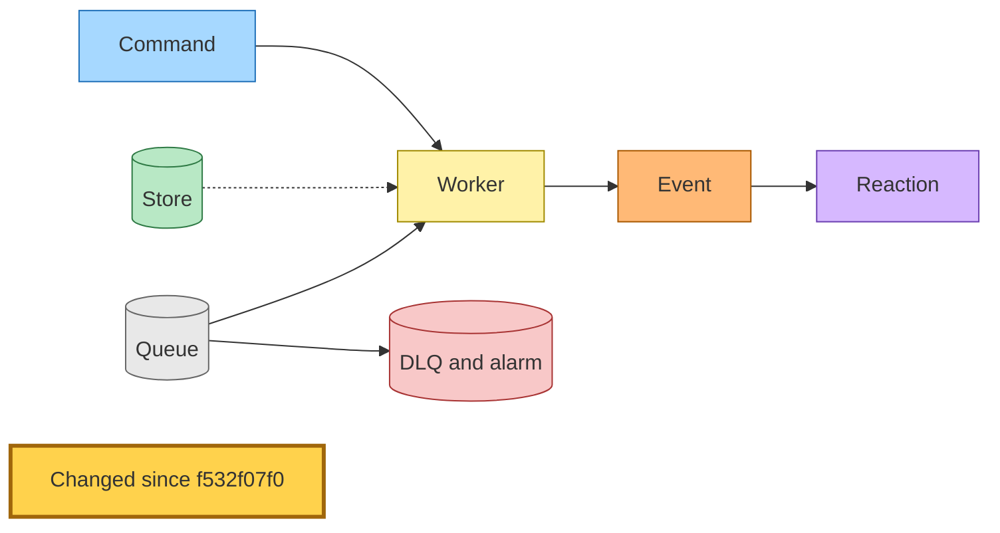

## Scheduled account enumeration and durable continuation

An EventBridge Scheduler rule runs every six hours. It sends `CheckGmailNewslettersCommand` straight to the monitoring SQS queue. The worker reads one page of the connected-account index and publishes `GmailNewsletterAccountsCheckedEvent`. The same queue consumes that fact and dispatches one `MonitorGmailNewslettersCommand` per account, plus a check command for the next account page. Each monitor command works one checkpointed mailbox page and publishes `GmailNewsletterMonitoringProgressedEvent`. The Lambda allows recursive invocation because continuations deliberately return to its own queue. The loop ends when pages run out, and generation and page fences reject stale work.

**Changed:** the progress reaction no longer sends one `SendGmailNewsletterNoticeCommand` per listed sender. When a progressed page lists any waiting senders, the reaction sends **one** command carrying only `userId`. A reader with more than 25 waiting notices spans several notice pages, so one run can dispatch several commands for that reader. They converge on the batch row described below. The event still carries the sender list, and the checkpoint still stores it for replay, but only the list being non-empty matters now. Commands still go directly to the notice SQS queue, and an EventBridge rule also subscribes that queue to the command.


[BPMN PNG](diagrams-bpmn/scheduled-monitoring.png) · [BPMN XML](diagrams-bpmn/scheduled-monitoring.bpmn)

Mermaid source

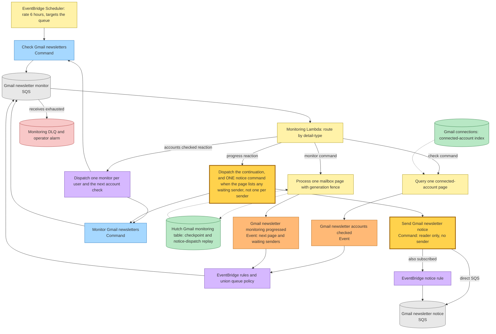

## Mailbox observations and recognition

This flow has not changed since the previous snapshot. It is redrawn here because it creates the notice rows the grouped worker reads, and because its last mode feeds the changed reaction above.

A run needs an active Gmail connection with metadata permission. Its history cursor is independent of interactive discovery. Initialization captures the Gmail history cursor first. It seeds same-mailbox discovered senders, then records about 5,000 recent incoming messages silently. Arrivals after the captured cursor stay eligible. Later checks page through the discovery cache, then read `messageAdded` arrivals, then reconcile every observed sender's approval against the catalog. Two things persist a pending notice row keyed by user and actual sender: a new arrival from an approved, unmapped sender, or a sender moving from unapproved to approved. An expired history cursor triggers a paginated metadata resync that keeps observations and receipts. The final notices mode lists pending and still-sending notice rows, 25 per page. It stores those senders on the checkpoint as dispatch replay and publishes them on the progress event. This listing is what re-dispatches held notices on every later six-hour check.


[BPMN PNG](diagrams-bpmn/mailbox-observations.png) · [BPMN XML](diagrams-bpmn/mailbox-observations.bpmn)

Mermaid source

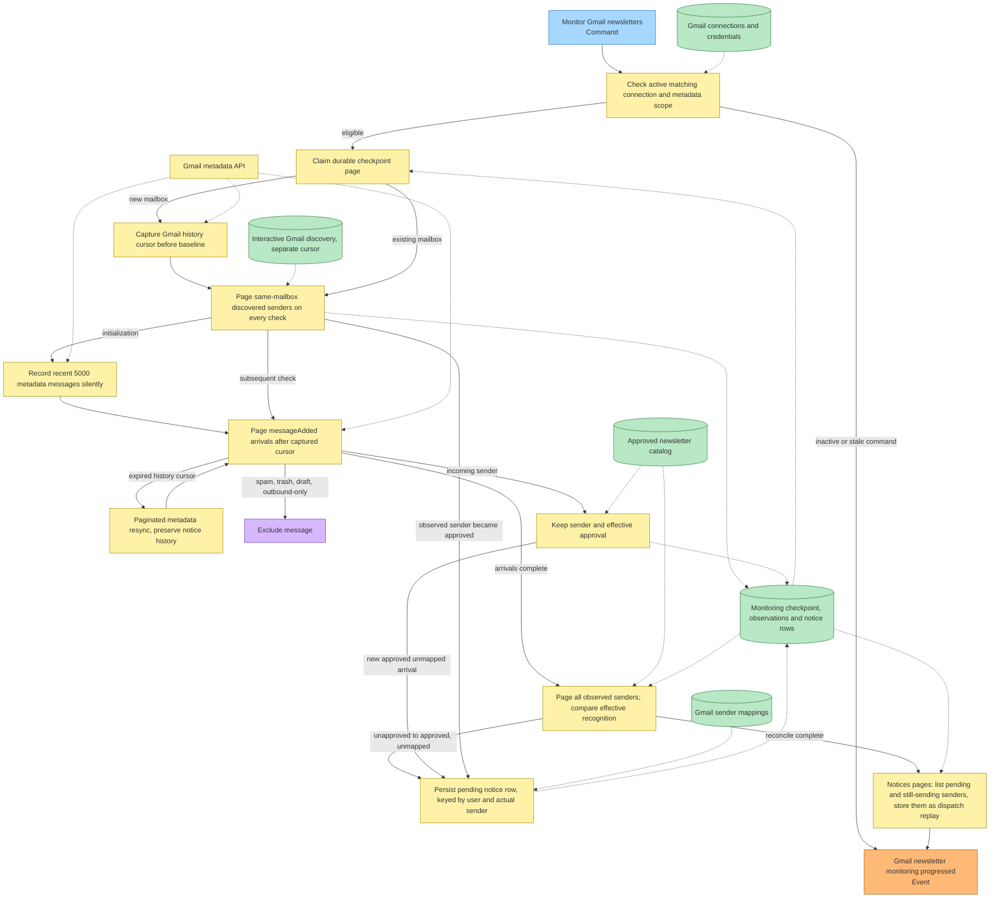

## One grouped email per reader, at most every three days

The notice Lambda takes one record at a time. It no longer reads a single sender from the command. Instead it lists every notice row for the reader and reads the reader's `NOTICE_BATCH` row with a strongly consistent read. The gates run in this order:

1. **The batch row is `sending`.** An earlier attempt claimed it and did not finish. The worker retries that stored email, as described in the next section.
2. **The batch row is `idle` and its last email went out less than three days ago.** The worker logs the hold and returns. It publishes nothing, and the pending rows stay pending.
3. **No notice row is pending.** The worker finishes silently.
4. **All is the reader's only readlist.** All is implicit and has no definition row in the user-articles table, so an empty definitions list means only All. The worker logs the hold, publishes nothing, and leaves the rows pending.
5. **Eligibility.** The worker reads the newsletter catalog first; an unavailable catalog fails the record so SQS retries it. Each pending notice is then rechecked. It needs the same connection, gateway, account and mailbox, a sender that is still unmapped and still approved, and an account email on file. An ineligible notice is cancelled and publishes `GmailNewsletterNoticeProcessedEvent` with outcome `suppressed`. If nothing is left, the worker stops.
6. **Send.** The worker renders **one** email listing every eligible newsletter, sorted by name. A single newsletter gets the familiar copy, whose call to action selects that sender. Several newsletters get the subject "Choose readlists for N newsletters". Each listed newsletter then has its own sender-selected link, and the main call to action opens the Gmail page with no sender. The email comes from Readplace, with replies going to the founder. The provider idempotency key hashes the reader and the ordered sender list. The worker claims the batch row, sends through the Resend adapter, and marks every listed notice `sent`; a notice can now move straight from `pending` to `sent`. It publishes one `sent` fact per listed sender, then finishes the batch as `idle` with `lastSentAt` set to now.

Once the grouped pass is done, the worker looks for notice rows that per-sender code claimed before grouping existed. Those are rows still in `sending` with a stored message. The worker resends each one individually with its original payload and key (next section). This runs even when gates 2 to 4 held the grouped pass.

Some behaviours from the previous snapshot are gone. A repeat command no longer republishes `sent` for a sent receipt. A command naming a missing or cancelled notice no longer publishes `suppressed`. Ineligible notices are cancelled only on a pass that gets past the holds, so they can wait in `pending` during a hold. A command still queued from before the deploy carries `senderEmail`, and it still parses because the schema strips unknown keys. The worker handles it as an ordinary reader-level run. Duplicate commands for one reader converge: the first claims the batch and sends. The others either find the lease live and retry, or find the batch idle within three days and hold.


[BPMN PNG](diagrams-bpmn/grouped-notice-delivery.png) · [BPMN XML](diagrams-bpmn/grouped-notice-delivery.bpmn)

Mermaid source

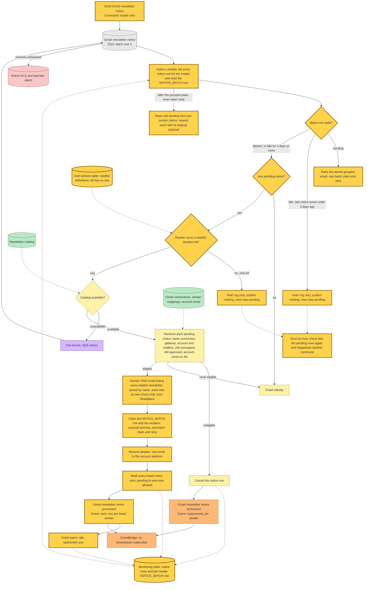

## Batch claim, retry window and per-sender claims from before grouping

The `NOTICE_BATCH` row is the reader's single send slot, claimed by one conditional write. The claim succeeds in three cases: no row exists; the row is `idle` and its `lastSentAt` is at least three days old; or the row is `sending` and its two-minute lease has expired. On the first claim the row stores the sender list, the rendered payload and `firstAttemptAt`. A later claim of an expired lease keeps those stored values (`if_not_exists`), so a retry sends the identical email under the identical idempotency key, even if the catalog, the account email or the pending set has changed since. A refused claim fails the record so SQS retries it. That covers a live lease held by a concurrent worker, and an idle row that another worker finished inside three days.

A batch found in `sending` is retried only within **23 hours 55 minutes** of `firstAttemptAt`. [Resend keeps idempotency keys for 24 hours](https://resend.com/changelog/idempotency-keys), and the five minutes are a margin. Past that point the record fails without sending and the claim stays in place, so a redrive cannot risk a second email. The queue allows 12 receives at a 180-second visibility timeout before the DLQ, so automatic retries end well inside the window. The window check guards later redrives. If a send succeeds but publishing a fact fails, the retry resends the stored email under the same key. Re-marking the notices changes nothing, the facts are published, and the batch finishes.

Notice rows that per-sender code left in `sending` follow the same rules, one row at a time. The worker checks the window against that row's own first attempt. It claims the row's own lease, resends the original single-sender payload and key, marks the row sent, and publishes one `sent` fact.


[BPMN PNG](diagrams-bpmn/batch-claim-and-retry.png) · [BPMN XML](diagrams-bpmn/batch-claim-and-retry.bpmn)

Mermaid source

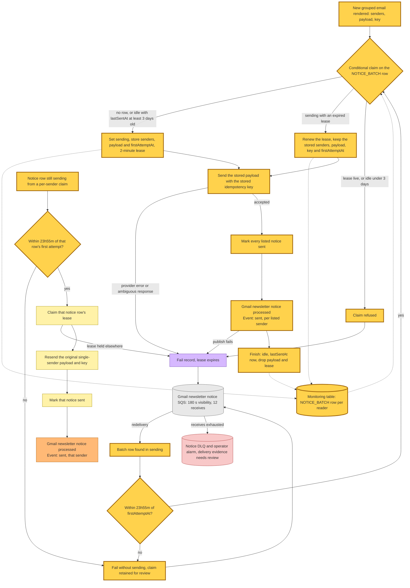

## Following the email, mapping and erasure

A single-newsletter email works as before: its **Choose readlists** button opens `/newsletters/gmail` with that sender selected and the arrival hint set. A grouped email links each newsletter to its own sender selection with the same hint. Its **Choose readlists** button opens the Gmail page with no sender selected. Signing in returns the reader to the same URL. The page merges the current mailbox's observed senders with the discovery candidates, and the mapping POST uses the same ownership rule.

A notified sender with no saved destination, for a reader who has custom readlists, starts with a sender-bound pending choice. Save is disabled until the reader confirms. A GET **Confirm readlists** accepts All-only explicitly, and changing a checkbox with JavaScript submits the same action. Saved destinations, ordinary entry and only-All readers can Save immediately. The grouped worker holds notices while All is the only readlist, so a notice now arrives only after the reader has a custom readlist. The only-All branch remains for a reader who deletes their custom readlists after the email. Saving resolves the readlist addresses, stores the mapping and publishes `RewriteGmailFilterCommand`. When the catalog match is not exact, which includes wildcard approvals, it also publishes `SubmitNewsletterSenderCommand`. An explicitly chosen import starts the existing history import. Account deletion still deletes the reader's whole monitoring partition, which now includes the `NOTICE_BATCH` row. Disconnecting or reconnecting Gmail deletes nothing, so the three-day cadence carries across reconnects.


[BPMN PNG](diagrams-bpmn/landing-and-cleanup.png) · [BPMN XML](diagrams-bpmn/landing-and-cleanup.bpmn)

Mermaid source

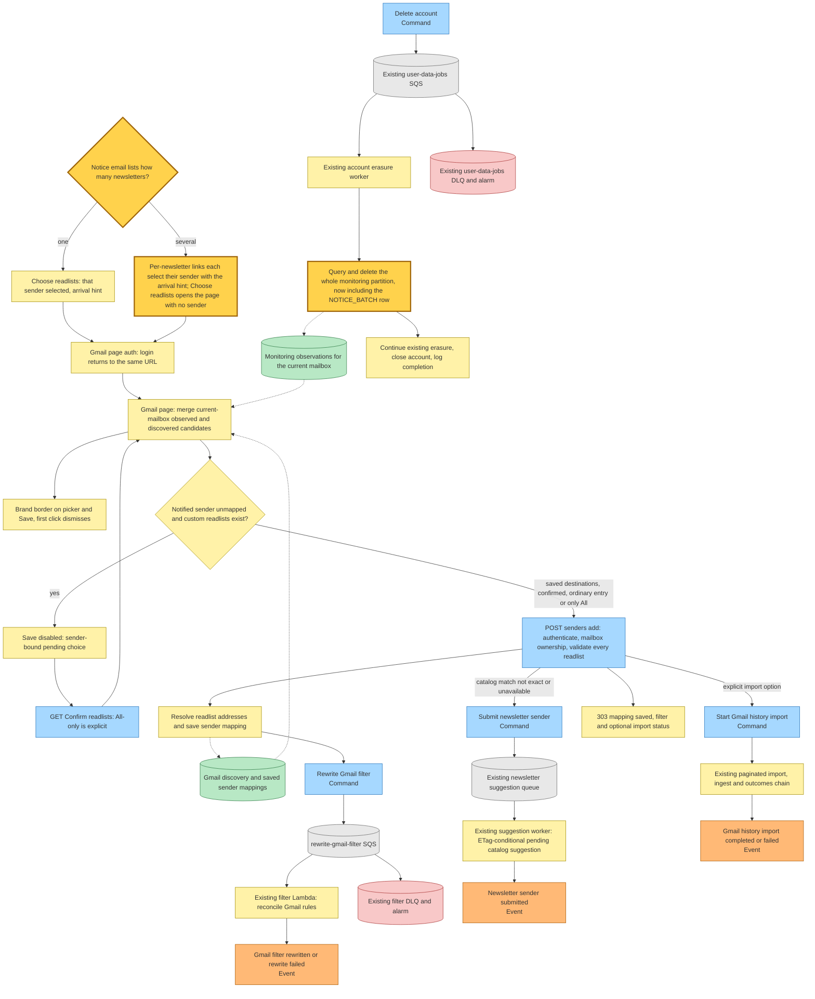

## Command → System → Event(s) reference

| Command or event | System that handles it | Event(s) emitted | Next command(s) triggered |
|---|---|---|---|
| `CheckGmailNewslettersCommand` `{accountsPageToken?}` | monitoring Lambda, connected-account page branch | `GmailNewsletterAccountsCheckedEvent` | none directly |
| `GmailNewsletterAccountsCheckedEvent` `{userIds, nextAccountsPageToken?}` | monitoring Lambda, accounts reaction | none | `MonitorGmailNewslettersCommand` per user; `CheckGmailNewslettersCommand` for the next account page |
| `MonitorGmailNewslettersCommand` `{userId, continuation?: {generation, page}}` | monitoring Lambda, one checkpointed mailbox page | `GmailNewsletterMonitoringProgressedEvent` | none directly |
| `GmailNewsletterMonitoringProgressedEvent` `{userId, nextPage?, notices}` (schema unchanged) | monitoring Lambda, progress reaction (**changed**) | none | `MonitorGmailNewslettersCommand` continuation; **changed:** one `SendGmailNewsletterNoticeCommand` when `notices` is non-empty, not one per sender |
| **changed** `SendGmailNewsletterNoticeCommand` `{userId}` (was `{userId, senderEmail}`; queued messages that still carry a sender parse with it stripped) | notice Lambda: grouped pass over every pending notice, then a resend of each per-sender claim still in flight (**changed**) | `GmailNewsletterNoticeProcessedEvent` `suppressed` per ineligible notice; `sent` per sender listed in the one grouped email; `sent` per resent per-sender claim; **nothing** while held (under three days since the last email, or only All) or when nothing is pending | none |
| `GmailNewsletterNoticeProcessedEvent` `{userId, senderEmail, outcome}` (schema unchanged; no longer republished for repeat or missing notices) | no subscriber | — | — |
| `RewriteGmailFilterCommand` | existing queue-backed filter Lambda | `GmailFilterRewrittenEvent` or `GmailFilterRewriteFailedEvent` | none |
| `SubmitNewsletterSenderCommand` | existing newsletter-catalog suggestion worker (ETag-conditional pending suggestion), when the mapped sender's catalog match is not exact | `NewsletterSenderSubmittedEvent` | none |
| `StartGmailHistoryImportCommand` | existing paginated history import chain, when explicitly requested | existing page, fetched and ingested facts, then `GmailHistoryImportCompletedEvent` or `GmailHistoryImportFailedEvent` | existing import continuations and inbox link processing |
| `DeleteAccountCommand` | existing user-data-jobs Lambda, erasing the whole monitoring partition including the new batch row | none (the flow ends at its completion log) | none |

## State and grants

| State | Ownership and access pattern | Readers and writers |
|---|---|---|
| `hutch-gmail-monitoring-{stage}` | Hutch-owned DynamoDB table; partition `userId`, sort key `key`. It holds `STATE`, per-mailbox sender observations, per-sender notice rows and, **new**, one `NOTICE_BATCH` row per reader (`idle` with `lastSentAt`, or `sending` with senders, payload, `firstAttemptAt` and a two-minute `claimUntil`). Every access is a user-scoped get, update or query; nothing scans | monitoring worker writes checkpoints, observations and pending notices; notice worker lists notices, cancels or marks them sent (now also `pending` to `sent`) and claims or finishes the batch row; web reads observations; account erasure deletes the partition |
| Existing user-articles table | readlist definition rows under the reader's partition; All is implicit and has no row | **new:** notice worker queries definitions (strongly consistent) to hold notices while only All exists |
| Existing Gmail connections, sender mappings, account email | primary-key lookups for eligibility | notice worker reads; existing lifecycle and mapping POST write |
| Existing newsletter catalog bucket | private ETag-validated catalog document | monitor and notice workers read |

**Changed infrastructure:** the notice Lambda gets a `DYNAMODB_USER_ARTICLES_TABLE` environment variable. Its existing read-only DynamoDB policy (`GetItem`, `Query`) gains the user-articles table without its indexes. Both come from the same Hutch stack, so no new StackReference, queue, rule, Lambda or table is added. The notice queue keeps its 180-second visibility timeout, 12-receive redrive, batch size of 1 and alarmed DLQ.

## Source map

| Area | Current source |
|---|---|
| Wire declarations | `src/packages/hutch-infra-components/src/events.ts` |
| Monitoring store contract, including the batch row | `src/packages/provider-contracts/src/gmail-monitoring.ts` |
| Production and test persistence | `src/packages/inbox-store/src/dynamodb-gmail-monitoring.ts` and `src/packages/test-fixtures/src/providers/gmail-monitoring/in-memory-gmail-monitoring.ts` |
| Monitor core and reaction | `projects/hutch/src/runtime/domain/gmail/monitor-gmail-newsletters.ts` and `gmail-newsletter-monitor-handler.ts` |
| Grouped notice worker and cadence | `projects/hutch/src/runtime/domain/gmail/send-gmail-newsletter-notice-handler.ts` and `gmail-newsletter-notice-cadence.ts` |
| Notice email (single and grouped copy) | `projects/hutch/src/runtime/web/auth/gmail-newsletter-notice-email.ts` and its template |
| Composition roots | `projects/hutch/src/runtime/gmail-newsletter-monitor.main.ts` and `gmail-newsletter-notice.main.ts` |
| Infrastructure | the gmail-newsletter-notice and gmail-newsletter-monitor Lambdas in `projects/hutch/src/infra/index.ts` |
| Operational behaviour | `projects/hutch/docs/newsletter-catalog.md` |

The monitor and the notice Lambda deploy from the same stack. A per-sender command queued before the deploy is handled as a reader-level run.
