# Gmail newsletters: save the issue, its links, or both

Snapshot of the uncommitted working tree over `e5a4079` (`rp/great-ride-0fy1uz`), whose 2026-10-06 subject is **feat: let readers choose what a Gmail newsletter saves**. Generated 2026-10-06. The base commit already stores the delivery mode on a sender and offers it in the mapping picker; the snapshot plumbing, the issue save pipeline, the extractor branch and the reader panel are uncommitted at capture time.

Each Gmail sender mapping now records a delivery mode: `issue` saves the email itself as one article, `links` saves the articles it links to (the behaviour every mapping had before), and `both` does the two. A new mapping starts on `issue`; a mapping written before the field existed keeps delivering links until the reader edits it. The mode is snapshotted onto each accepted email exactly like its destinations, so a later edit never reroutes mail that already arrived. Custom inbox addresses keep saving links. The [multiple-readlists snapshot](../2026-10-04-508b6d700/gmail-multiple-readlists.md) remains the record of destination selection, filtering and imports.

## Legend

Gold outlines identify behavior added or materially changed in this working tree; role colors identify the established infrastructure and contracts.

[BPMN image](diagrams-bpmn/legend.png) · [Editable BPMN](diagrams-bpmn/legend.bpmn)

Mermaid source

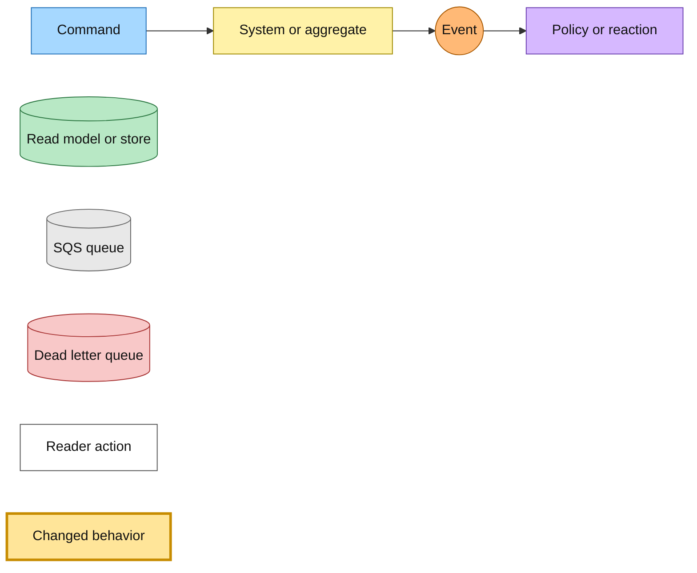

## Choosing what a sender saves

The picker offers the three modes as radios beside the readlist choice. A sender with no mapping preselects the issue itself, an existing mapping preselects its stored mode, and a mapping stored before modes existed preselects links. The mode rides the picker's URL state, so search, polling, login return and validation redirects keep it. Saving writes the mode with the destinations. A mode change is treated like a destination change: it cancels unfinished imports for that sender before the filter is reconciled. Deleting a selected readlist moves the remaining destinations and keeps the mode.


[BPMN image](diagrams-bpmn/delivery-choice.png) · [Editable BPMN](diagrams-bpmn/delivery-choice.bpmn)

Mermaid source

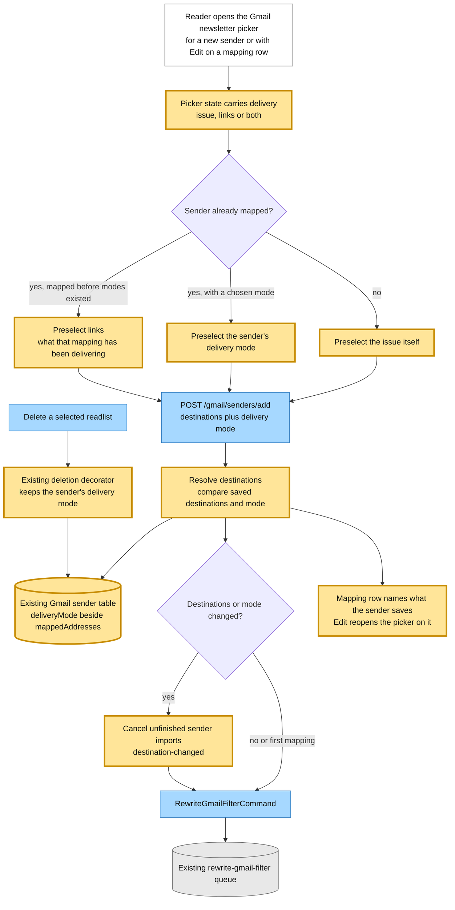

## The mode travels with each accepted message

The forwarded-mail router returns the sender's destinations and delivery mode together. Mail it delivers as addressed, from an unreadable sender or a sender with no mapping row, is delivered as links. The accepted email row stores the mode beside its destination snapshot, and a retry of the same raw object republishes that stored routing. An email accepted before the field existed replays as links. The history-import page worker reads the sender's current mode onto every fetched message, and the import ingestion builds its routing from the event. `EmailReceivedEvent` and `GmailHistoryImportMessageFetchedEvent` both carry the mode as a required field, so a message published before the deploy fails parsing and drains through the existing DLQs.


[BPMN image](diagrams-bpmn/message-ingress.png) · [Editable BPMN](diagrams-bpmn/message-ingress.bpmn)

Mermaid source

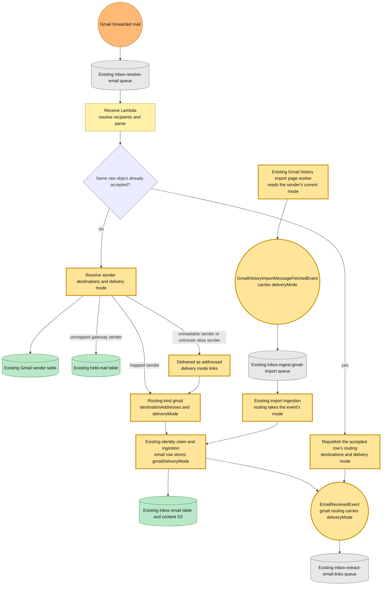

## The extractor branches on the mode

Extraction, triage and preview crawls run in every mode, so the issue's links can be listed and saved by hand later. In `issue` mode no link is submitted, no custom readlist is asked to choose, and the metadata records no readlist selection, so the inbox page shows plain link cards. A full-access reader's issue is published as one `SaveEmailIssueCommand` before the first preview, carrying every mapped custom readlist. The first-inbox email, whose copy says the email's links were saved, is sent only by the link fan-out. A read-only reader gets the existing saves-held notice once, and backfill or unrouted mail saves nothing. `both` publishes the issue command and the existing link fan-out. A crash after the command can republish it; the save converges on the same article row.


[BPMN image](diagrams-bpmn/extract-fan-out.png) · [Editable BPMN](diagrams-bpmn/extract-fan-out.bpmn)

Mermaid source

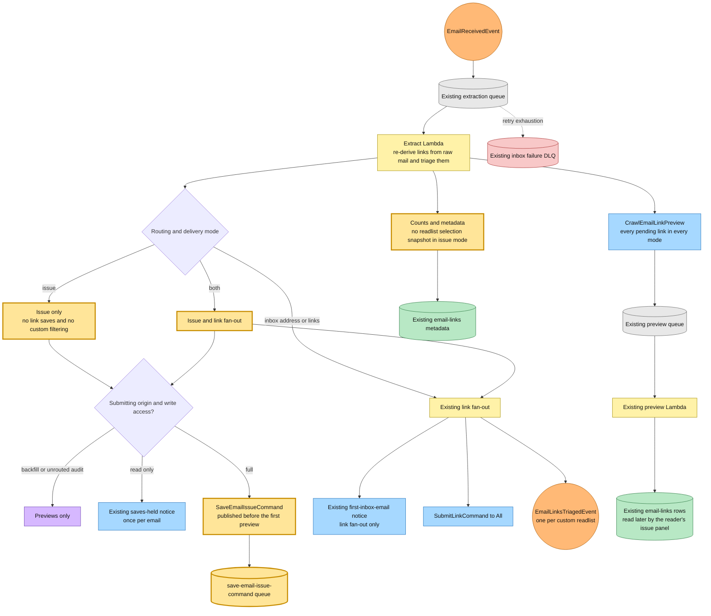

## Saving the issue as an article

A new save-link Lambda consumes the command from its own queue and DLQ. It reads the sanitized body the receive path already stored under the email's content key, derives the title from the subject, the newsletter name from the sender, an excerpt and a read time, and saves the article under that same key. Nothing fetches a URL: the `email://` key is refused by every public save surface, and the display URL points the card, the reader and the API at the email's inbox page. The issue is filed into each mapped custom readlist. When its content is not ready yet the body becomes its tier-0 source, written without an author so the reader offers no remove-my-version control, and the existing selector promotes it and the existing summary runs. A new membership publishes `QueueEntryCreatedEvent` for related reads. The save publishes no `LinkQueuedEvent`, whose consumer only accepts saveable web URLs.


[BPMN image](diagrams-bpmn/save-email-issue.png) · [Editable BPMN](diagrams-bpmn/save-email-issue.bpmn)

Mermaid source

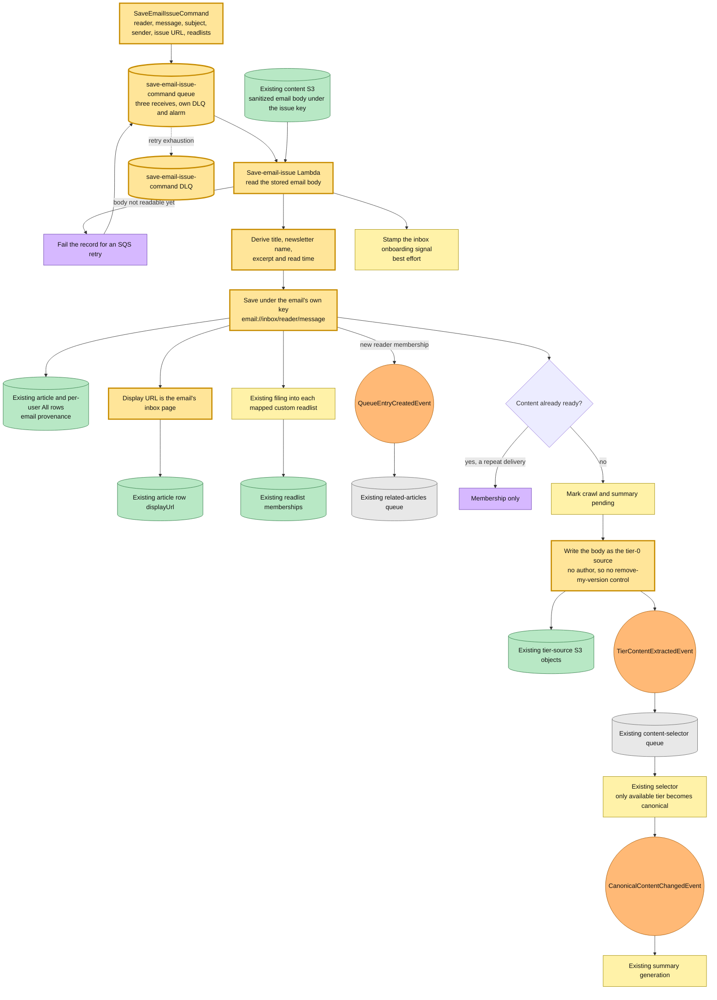

## Reading the issue and saving its links

The owner reader always renders the panel, hidden for an ordinary article. For an issue it lists the article links the extractor stored, with the saved state from the inbox saved-link read model, and withholds the share prompt and the EPUB download, both of which build a public `/view` link. The web Lambda gains read access to the two inbox tables. A Save posts the link's ordinal to a new route, which checks the issue is the reader's, the link exists and its URL is saveable, then runs the existing inline save with the newsletter as provenance and redirects back with a marker that shows the row as saved before the read model catches up. A non-owner opening an issue's reader link gets not found instead of the public view.


[BPMN image](diagrams-bpmn/reader-issue-links.png) · [Editable BPMN](diagrams-bpmn/reader-issue-links.bpmn)

Mermaid source

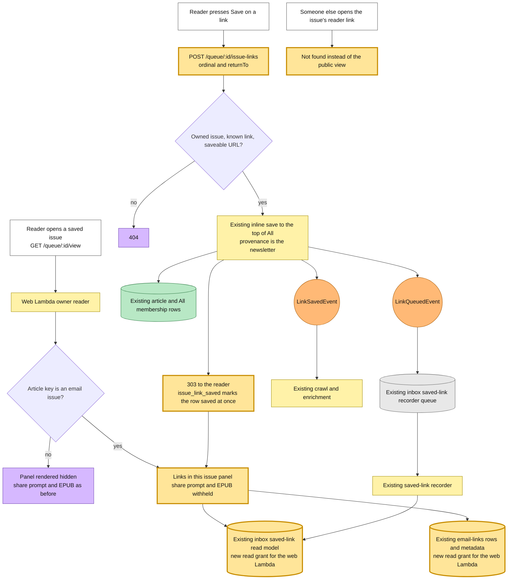

## Command → System → Event(s) reference

| Command or input event | System and durable result | Emitted events or next actions |
|---|---|---|
| POST save sender with a delivery mode | Web Lambda resolves destinations and stores the mode on the sender row; a changed mode cancels unfinished sender imports | RewriteGmailFilterCommand |
| Gmail forwarded mail (SES receipt) | Existing receive Lambda resolves destinations and mode, or replays an accepted row's routing; the email row stores `gmailDeliveryMode` | EmailReceivedEvent with the mode on its gmail routing |
| GmailHistoryImportMessageFetchedEvent | Existing import ingestion builds gmail routing from the event's mode | EmailReceivedEvent; GmailHistoryImportMessageIngestedEvent |
| EmailReceivedEvent | Existing extractor writes link rows, previews and metadata; the mode decides the save fan-out | SaveEmailIssueCommand for `issue` and `both`; SubmitLinkCommand and EmailLinksTriagedEvent for `links` and `both`; CrawlEmailLinkPreview in every mode; existing notices |
| SaveEmailIssueCommand | New save-email-issue Lambda saves the issue under its email key into All and its custom readlists, sets its display URL and stages its body as tier-0 | TierContentExtractedEvent when content is pending; QueueEntryCreatedEvent on a new membership |
| TierContentExtractedEvent | Existing selector promotes the only available tier | CanonicalContentChangedEvent and the existing summary chain |
| QueueEntryCreatedEvent | Existing related-articles worker | Stored related results and computed fact |
| POST /queue/:id/issue-links | Web Lambda validates the issue and link, then saves the link inline into All | LinkSavedEvent, LinkQueuedEvent, QueueEntryCreatedEvent on a new membership; 303 back to the reader |
| LinkQueuedEvent | Existing inbox saved-link recorder | Saved-link read model the issue panel reads |

## Source evidence at capture time

The new Lambda reads and writes only existing tables and buckets: the articles and user-articles tables, the onboarding table, and the content bucket. The extractor Lambda gains the app origin in its environment to build the issue's inbox URL. The hutch web Lambda gains read access to the inbox email-links and saved-links tables. No table, index or event bus changes.

| Boundary | Evidence |
|---|---|
| Delivery mode and its defaults | [Delivery mode](../../src/packages/domain/src/gmail/gmail-delivery-mode.ts), [sender store](../../src/packages/inbox-store/src/dynamodb-gmail-sender.ts), [mapping resolver](../../projects/hutch/src/runtime/domain/gmail/resolve-readlist-mapping.ts) |
| Mapping picker and rows | [Gmail page](../../projects/hutch/src/runtime/web/pages/integrations/gmail.page.ts), [URL state](../../projects/hutch/src/runtime/web/pages/integrations/gmail.url.ts), [picker view model](../../projects/hutch/src/runtime/web/pages/integrations/gmail.viewmodel.ts) |
| Routing contract | [Internal events](../../src/packages/hutch-infra-components/src/events.ts) |
| Accepted-message snapshot | [Forwarded routing](../../projects/inbox/src/runtime/domain/gmail/route-gmail-forwarded-email.ts), [receive handler](../../projects/inbox/src/runtime/domain/inbox/receive-email-handler.ts), [shared ingestion](../../projects/inbox/src/runtime/domain/inbox/ingest-parsed-email.ts), [accepted routing](../../projects/inbox/src/runtime/domain/inbox/accepted-gmail-routing.ts), [email row](../../src/packages/inbox-store/src/dynamodb-inbox-email.ts) |
| Imports | [Import worker](../../projects/hutch/src/runtime/domain/gmail/gmail-history-import.ts), [import ingestion](../../projects/inbox/src/runtime/domain/inbox/ingest-gmail-import-handler.ts) |
| Extractor branch | [Extractor](../../projects/inbox/src/runtime/domain/inbox/extract-email-links-handler.ts), [fan-out](../../projects/inbox/src/runtime/domain/inbox/email-fan-out.ts) |
| Issue save | [Command handler](../../projects/save-link/src/runtime/domain/save-email-issue/save-email-issue-command-handler.ts), [save](../../projects/save-link/src/runtime/domain/save-email-issue/save-email-issue.ts), [issue key](../../src/packages/domain/src/inbox/email-issue-url.ts), [issue metadata](../../src/packages/domain/src/inbox/email-issue-metadata.ts) |
| Reader panel | [Readlist routes](../../projects/hutch/src/runtime/web/pages/readlist/readlist.page.ts), [panel](../../projects/hutch/src/runtime/web/shared/issue-links/issue-links.component.ts), [permalink](../../projects/hutch/src/runtime/web/pages/readlist/reader-permalink.ts) |
| Infrastructure | [Save-link infrastructure](../../projects/save-link/src/infra/index.ts), [inbox infrastructure](../../projects/inbox/src/infra/index.ts), [hutch infrastructure](../../projects/hutch/src/infra/index.ts) |
