# Reader-ready fan-out retired: the queue digest is the only digest

Snapshot of the uncommitted working tree over `928cccbc6` (`main`), whose 2026-10-09 subject is **fix: recrawl an Apple News story with no publisher URL on its own link**. Generated 2026-10-09. The base commit still runs the reader-ready fan-out; its retirement is uncommitted at capture time.

The queue digest (`699f4566a`, live in production from 2026-09-30T22:23:29Z) moved digest selection to send time: `digest-scan` enumerates recipients from the subscription status index and `send-user-digest` reads each recipient's unread saves from the user-articles `userId-savedAt-index`. From that moment no feature read the digest-queue table, and only account deletion still queried it, to delete a departing user's rows. The old write side was left running on purpose so that `699f4566a` stayed a plain revert. The retirement gate (a week of clean queue-digest sends, issue #1177) passed on 2026-10-09, and this change removes the old write side in one commit and one deploy.

- **Deleted:** the `reader-ready-fanout` Lambda with its role, policies and log subscription filter; its queue, dead-letter queue, event source mapping, DLQ alarm and SNS email subscription; the EventBridge rule, target and both queue policies that delivered `ReaderViewLoadingSucceeded` to it; and the `hutch-digest-queue-{stage}` table. The Lambda's log group is retained (`retainOnDelete`): it leaves Pulumi state and stays in AWS.
- **`ReaderViewLoadingSucceeded` keeps its publisher and loses its only consumer.** The save-link summary worker still publishes it on the transition into a succeeded reader view. EventBridge accepts an event that matches no rule, so nothing fails; `ReaderReadyEmailSentEvent` is already published the same way.
- **Account deletion stops scrubbing the digest-queue table.** The data-rights worker (`user-data-jobs`) loses the table's IAM grant and its `DYNAMODB_DIGEST_QUEUE_TABLE` environment variable in the same deploy that deletes the table, so no running code can name a missing table.
- **The table's rows go with it.** It had no deletion protection and no point-in-time recovery. Since the queue digest shipped, its rows were per-user saved URLs that no feature read; they would otherwise have aged out under the 30-day TTL.
- **Kept:** the user-articles `url-index` (account deletion and save-link count savers through it), the `hutch-reader-ready-notifications` table (the regular-digest slot and the starter state), the per-save `emailSentAt` stamp, `SendUserDigestCommand` and `ReaderReadyEmailSentEvent`.
- **First drawing of the queue digest.** No earlier snapshot shows the six-hour tick as it now runs, so the digest flows below are drawn in full in their role colours: they are context, not part of this change.

---

## Legend

Amber marks what this retirement changes; dashed grey marks what it deletes. Everything else is existing infrastructure shown for context.


[BPMN image](diagrams-bpmn/legend.png) · [Editable BPMN](diagrams-bpmn/legend.bpmn)

Mermaid source

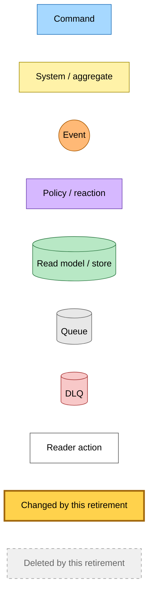

---

## 1. The reader-view fact loses its only consumer

The summary worker writes the summary axis and, only when that write moves the article's reader view into `succeeded`, publishes `ReaderViewLoadingSucceeded`. A re-summarise of an article whose reader view had already succeeded publishes nothing new. Before this change one rule matched the fact and fed the fan-out, which looked up every saver of the URL through the `url-index` and appended a digest-queue row for each saver who had opened the reader, when the event carried a ready summary. After it, no rule matches.


[BPMN image](diagrams-bpmn/reader-view-fact.png) · [Editable BPMN](diagrams-bpmn/reader-view-fact.bpmn)

Mermaid source

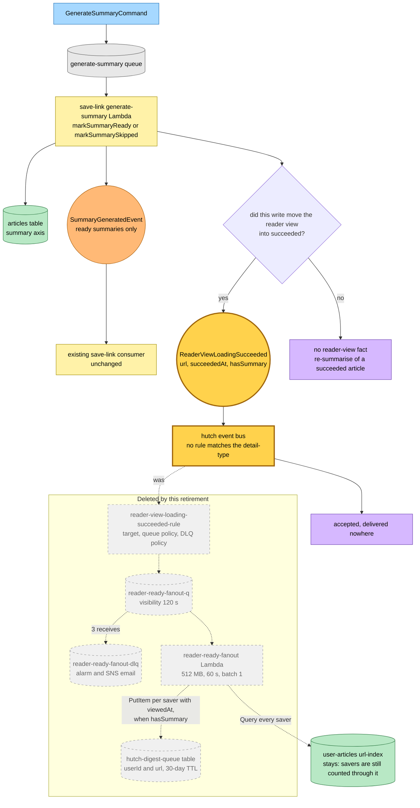

---

## 2. The six-hour tick: `digest-scan`

An EventBridge Scheduler schedule puts a trigger message on the `digest-scan` queue every six hours. The worker runs three steps in order. The first two only log their failures, so a broken Hacker News fetch or report never stops the digests. Recipients come from the KEYS_ONLY `status-index` on the subscription-providers table, and each one gets its own `SendUserDigestCommand` over direct SQS. A failed dispatch is counted and logged rather than failing the tick, because a redrive would re-dispatch every recipient; the next tick picks that user up. A new Hacker News story with no article row and no crawl starts an anonymous crawl, which is the one path from this tick back to `ReaderViewLoadingSucceeded`.


[BPMN image](diagrams-bpmn/digest-tick.png) · [Editable BPMN](diagrams-bpmn/digest-tick.bpmn)

Mermaid source

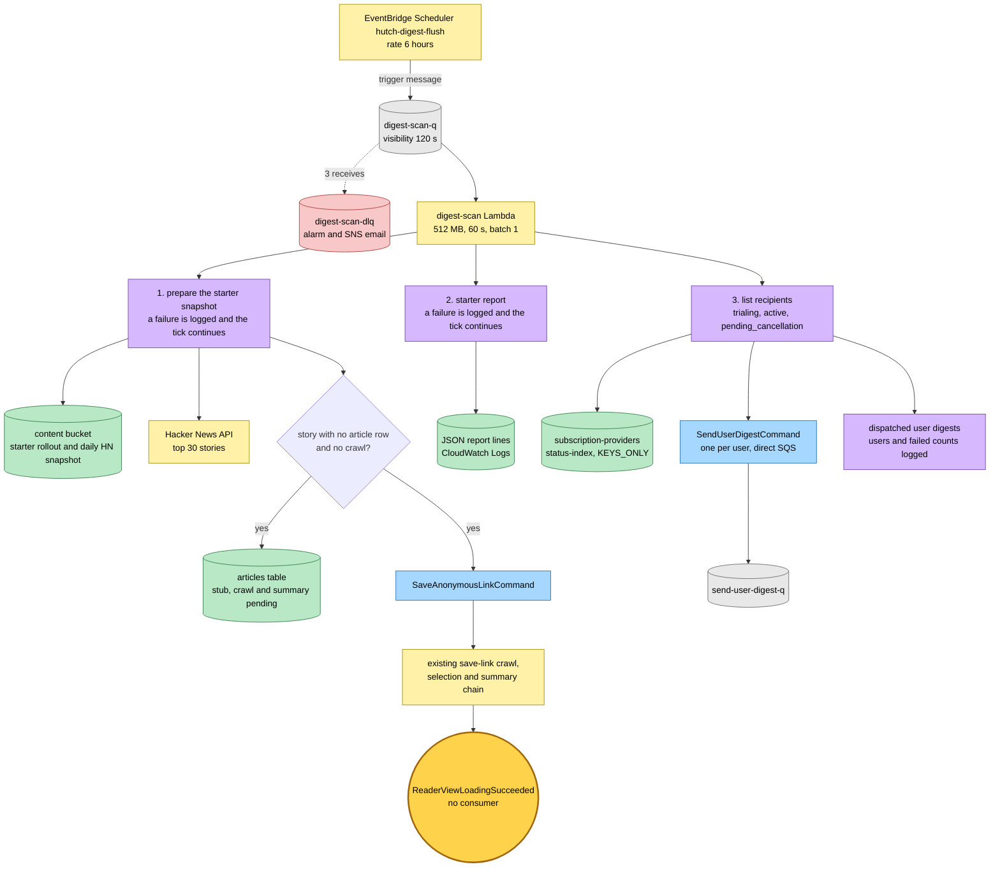

---

## 3. Send-time selection: `send-user-digest`

One message is one recipient. The worker first finishes its own redrive: a message that already holds the regular slot or the pay claim only completes the bookkeeping. It then enrols the reader in the Hacker News starter pack and, unless a pay digest is due, tries the starter email before any digest. A pay digest is due for a trialing row between 96 and 60 hours before the trial ends, once per trial. A regular digest waits seven days, less thirty minutes for tick jitter, after the last digest of either kind. Candidates are read at send time from the user-articles `userId-savedAt-index`: unread personal saves whose reader view is available and whose summary is ready. The regular digest also requires the save to be at least 30 days old and never emailed before. The claim is a conditional write, the email goes through Resend, and every listed save is stamped with `emailSentAt` before the consumer-less `ReaderReadyEmailSentEvent` is published. None of this reads the digest-queue table.


[BPMN image](diagrams-bpmn/send-user-digest.png) · [Editable BPMN](diagrams-bpmn/send-user-digest.bpmn)

Mermaid source

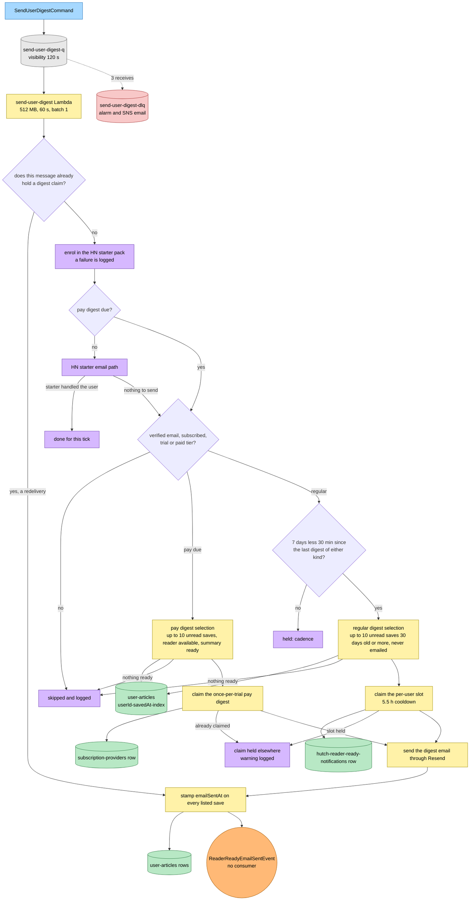

---

## 4. Account deletion without the digest queue

Account deletion is unchanged except for one removed step. The scrub used to delete the user's digest-queue rows right after their saved-article rows; that table is gone, so the step is gone, and the `user-data-jobs` role and environment lose the table with it. The `url-index` is still read here, to count the other savers of each URL before single-saver content is purged.


[BPMN image](diagrams-bpmn/account-deletion.png) · [Editable BPMN](diagrams-bpmn/account-deletion.bpmn)

Mermaid source

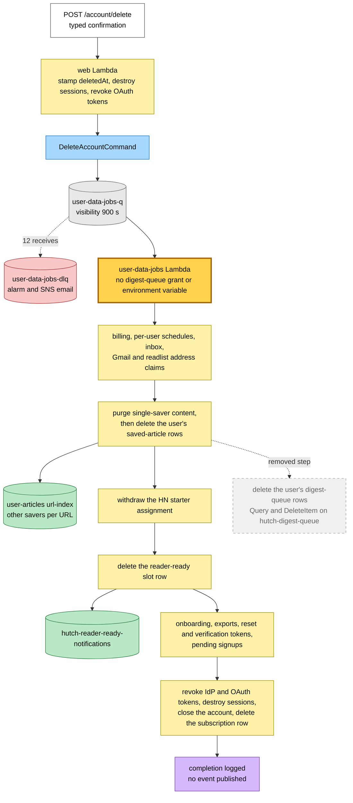

---

## 5. What the deploy deletes and updates

The staging preview of this tree (`pnpm check-infra`) was compared with the same preview of the base commit, taken earlier on 2026-10-09:

| Stack | Base commit | This change |
|---|---|---|
| hutch | 15 to update, 622 unchanged | 15 to update, **23 to delete**, 599 unchanged |
| save-link | 29 to update | 28 to update |
| inbox, web-embed, blog-site, platform | 7, 1, 1 and 0 to update | the same |

- **The 23 deletes** are the 18 AWS resources in the Deleted group below, the Lambda's log group as `delete[retain]`, and the four Pulumi components that wrapped them. Nothing is replaced.
- **One update is new:** the `user-data-jobs` DynamoDB role policy, whose resource list loses the `hutch-digest-queue-staging` ARN and nothing else. **One update is gone:** the fan-out Lambda's code drift, which is now a delete. The `user-data-jobs-handler` environment loses `DYNAMODB_DIGEST_QUEUE_TABLE` inside an update that the base preview already listed for local build drift.
- **The save-link difference is not this change.** The staging deploy of the base commit updated that one Lambda between the two previews.


[BPMN image](diagrams-bpmn/deploy-delta.png) · [Editable BPMN](diagrams-bpmn/deploy-delta.bpmn)

Mermaid source

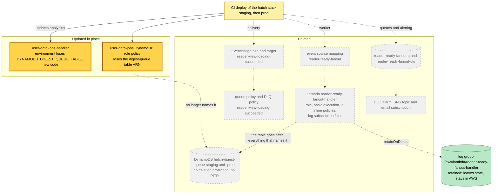

---

## Command → System → Event(s) reference

| Command or input | System and durable result | Emitted events or next actions |
|---|---|---|
| `GenerateSummaryCommand` | save-link `generate-summary` Lambda writes the summary axis as ready or skipped | `SummaryGeneratedEvent` for a ready summary; `ReaderViewLoadingSucceeded` when the write moves the reader view into succeeded, which **no rule matches after this change** |
| `ReaderViewLoadingSucceeded` | none: the rule, the fan-out Lambda and the digest-queue table are deleted | none |
| Scheduler `hutch-digest-flush`, every 6 hours | `digest-scan` Lambda: starter rollout and daily HN snapshot in the content bucket, starter report log lines, recipients from the subscription `status-index` | `SaveAnonymousLinkCommand` for a new HN story with no article row and no crawl; one `SendUserDigestCommand` per recipient over direct SQS |
| `SaveAnonymousLinkCommand` | existing save-link anonymous save, crawl, selection and summary chain | the existing chain, ending in `ReaderViewLoadingSucceeded` with no consumer |
| `SendUserDigestCommand` | `send-user-digest` Lambda: HN starter enrolment and starter email, or a queue digest selected at send time from `userId-savedAt-index`; claims the regular slot in `hutch-reader-ready-notifications` or the pay claim on the subscription row; stamps `emailSentAt` on each listed save | `ReaderReadyEmailSentEvent`, no consumer |
| `DeleteAccountCommand` | `user-data-jobs` Lambda scrubs every user-owned store, no longer including the digest-queue table | none; the scrub ends with a completion log line |

---

## Known gaps recorded with the retirement

- **`viewedAt` is now written and never read.** Every owner reader open and reader poll still stamps it, and `findUserArticlesByUrl`, its only reader, has no production caller. Keeping both was the minimal option; removing them is a separate, larger change.
- **Rolling back the queue digest is no longer a plain revert of `699f4566a`.** That revert names the digest-queue table this change deletes, so this change has to be reverted first, and the recreated table starts empty.
- **The fan-out's log group stays in AWS** outside Pulumi state, and the older `reader-ready-notify-handler` log group is still orphaned. Removing either is its own change.
- **Names still say "reader-ready".** `ReaderReadyEmailSentEvent` is published for every queue digest, regular and pay, and `SendUserDigestCommand` is documented as a reader-ready digest. Renaming either is a catalogue change with its own snapshot.

---

## Source evidence at capture time

| Boundary | Evidence |
|---|---|
| Publisher of the reader-view fact | [Summary worker](../../projects/save-link/src/runtime/domain/generate-summary/generate-summary-handler.ts), [summary-ready transition](../../src/packages/domain/src/article-aggregate/transitions/mark-summary-ready.ts), [summary-skipped transition](../../src/packages/domain/src/article-aggregate/transitions/mark-summary-skipped.ts), [effect dispatcher](../../projects/save-link/src/runtime/domain/article-aggregate/lambda-effect-dispatcher.ts), [event catalogue](../../src/packages/hutch-infra-components/src/events.ts) |
| Six-hour tick | [digest-scan composition root](../../projects/hutch/src/runtime/digest-scan.main.ts), [digest-scan handler](../../projects/hutch/src/runtime/digest-scan/digest-scan-handler.ts), [HN snapshot](../../projects/hutch/src/runtime/domain/engagement/hn-snapshot.ts) |
| Send-time selection | [send-user-digest composition root](../../projects/hutch/src/runtime/send-user-digest.main.ts), [queue digest handler](../../projects/hutch/src/runtime/send-queue-digest/send-queue-digest-handler.ts), [cadence](../../projects/hutch/src/runtime/domain/email/queue-digest-cadence.ts), [pay window](../../projects/hutch/src/runtime/domain/stripe/stripe-trial-config.ts) |
| Account deletion | [delete-account handler](../../projects/hutch/src/runtime/delete-account/delete-account-handler.ts), [user-data-jobs composition root](../../projects/hutch/src/runtime/user-data-jobs.main.ts) |
| Infrastructure | [hutch infrastructure](../../projects/hutch/src/infra/index.ts), [hutch storage](../../projects/hutch/src/infra/hutch-storage.ts), [Lambda component and its retained log group](../../src/packages/hutch-infra-components/src/infra/hutch-lambda.ts) |
