# Customer emails

Every automated email Readplace sends to customers: who gets it, exactly when, and what it looks like. There are 13 emails. Twelve have their own template, and the readlist digest template has two sending modes with different rules, so it appears twice (the readlist digest and the trial-ending digest).

Each example was produced by running the real sending code (the route, Lambda handler or sender function that calls `sendEmail`) with in-memory fakes and example inputs, using the production origins `https://readplace.com` and `https://static.readplace.com`. The capture records the exact message handed to the mail provider. The HTML files in [`html/`](html/) are those bodies, byte for byte. The screenshots are Chromium renders of the same HTML at 800px and 390px wide, with the brand font Inter installed. Mail clients without Inter fall back to the system fonts in the template's font stack.

Each email's conditions were traced through the code with `path:line` citations, then checked against the code by two independent reviews. The inventory reflects the code as of 2026-10-05. When an email's template, copy or trigger changes, update its section.

## How every email is delivered

- All of these emails are sent by the `hutch` project through Resend (`projects/hutch/src/runtime/providers/email/resend-email.ts:8`). Resend authenticates on the `send.readplace.com` envelope subdomain; its SPF, MX and DKIM records are managed in Resend, outside Pulumi (`projects/hutch/src/infra/outbound-mail-auth.ts:15`).
- Every production entry point wraps Resend in a filter that silently drops any message whose To address is at example.com, example.net or example.org, or under a .test, .example, .invalid or .localhost domain. The Bcc copy is dropped with it (`projects/hutch/src/runtime/providers/email/skip-reserved-domain.ts:31`).
- With `PERSISTENCE=development` the local dev server logs each message instead of sending it (`projects/hutch/src/runtime/providers/dev-providers.ts:533`); with `PERSISTENCE=prod` it uses the production providers and sends through Resend (`projects/hutch/src/runtime/dev-app.ts:15`). Staging runs the same code and sends real email through Resend, with links on `https://readplace-staging.com`.
- The account emails (email verification, welcome, password reset) come from `Fayner from Readplace <fayner@readplace.com>`; every other email comes from `Readplace <readplace@readplace.com>`, the support address. Replies reach `fayner@readplace.com`, a Google Workspace mailbox: through Reply-To on every email that sets one, which is every email except email verification and password reset, and through the From address on those two.
- Nine emails Bcc an internal archive address of the form `readplace+<tag>@readplace.com`. The readlist digest, the trial-ending digest, the data export email and the Gmail newsletter notice have no Bcc.
- Only the two digests carry `List-Unsubscribe` and `List-Unsubscribe-Post` headers and an unsubscribe link. Every other email is transactional or once-only and has no unsubscribe; the inbox saves paused email instead tells the reader that turning off their inbox addresses stops it.
- Only the Gmail newsletter notice sets a Resend idempotency key. The rest rely on their own once-only markers, or on none.

## At a glance

| # | Email | Subject | Sent when | Bcc |
|---|---|---|---|---|
| 1 | [Email verification](#1-email-verification) | `Verify your email — Readplace` | Immediately after someone creates an account with email and password on the signup form; never for Google or Apple sign-ups. | `readplace+account_verifications@readplace.com` |
| 2 | [Welcome email](#2-welcome-email) | `Welcome to Readplace` | Once per new account: email+password sign-ups when the verification link is first opened, Google and Apple sign-ups at account creation. | `readplace+welcome@readplace.com` |
| 3 | [Password reset](#3-password-reset) | `Reset your password — Readplace` | Immediately after someone submits the Forgot password form with an address that matches a Readplace account. | `readplace+password_resets@readplace.com` |
| 4 | [Trial-ending digest](#4-trial-ending-digest) | `Waiting in your readlist` | Once per trial window, on the first 6-hourly check 96h to 60h before the trial ends (around day 11 of 14) that finds a ready unread save; verified trialists who have not unsubscribed. A trial reopened by reactivation or an admin extension can get it again. | none |
| 5 | [Trial pre-expiry reminder](#5-trial-pre-expiry-reminder) | `your Readplace trial ends in 2 days` | 48 hours before a no-card trial ends (12 days after signup, day 13 of 14), if the reader is still trialing and got no trial-ending digest. | `readplace+trial_reminder@readplace.com` |
| 6 | [Pre-charge reminder](#6-pre-charge-reminder) | `your Readplace membership starts on {chargeDate}` | 7 days before a trial subscriber's first charge, or 5 minutes after subscribing or reactivating when less than 7 days remain. | `readplace+charge_reminder@readplace.com` |
| 7 | [Payment failed](#7-payment-failed) | `your Readplace payment didn't go through` | Within seconds of each failed renewal charge attempt that Stripe will retry; not on the final attempt and never during a trial. | `readplace+payment_failed@readplace.com` |
| 8 | [Trial feedback request](#8-trial-feedback-request) | `you tried Readplace — what was missing?` | About 3 days after a trial ends without a membership, normally 17 days and 1 hour after signup. | `readplace+trial_feedback@readplace.com` |
| 9 | [Inbox saves paused](#9-inbox-saves-paused) | `links sent to your Readplace inbox are waiting` | Immediately, the first time mail to a reader's Readplace inbox address brings article links while their subscription is read-only. Once per lapse. | `readplace+automation_saves_held@readplace.com` |
| 10 | [Readlist digest](#10-readlist-digest) | `Waiting in your readlist` | At most once every 7 days, for verified paying members (never founding members; trialists are checked, but a 14-day trial never holds a 30-day-old save), while saves at least 30 days old (unread, reader view and summary ready, never listed before) are waiting; checked every 6 hours. | none |
| 11 | [First inbox email arrived](#11-first-inbox-email-arrived) | `Your first email landed in your Readplace inbox` | Seconds after the first email with a saveable article link is sent directly to one of the reader's Readplace addresses while the reader can save (a read-only reader gets Inbox saves paused instead, and this email waits for a later email after access returns); mail routed from Gmail never sends it; once per account, ever. | `readplace+first_inbox_email@readplace.com` |
| 12 | [Gmail newsletter notice](#12-gmail-newsletter-notice) | `Choose readlists for {newsletterName}` | At the next 6-hourly check after an approved, unmapped newsletter mails a connected Gmail account or a seen sender becomes approved, once 3 days have passed since the reader's last notice email and the reader has a readlist besides All. | none |
| 13 | [Data export ready](#13-data-export-ready) | `Your Readplace export is ready` | Seconds to minutes after a signed-in customer clicks Email Me My Data on /export; one email per click. | none |

## 1. Email verification

**Account** · Anyone who creates a Readplace account with an email address and password, on the founding-member (free) plan or the 14-day trial; people who sign up with Google or Apple never get it.

### When it is sent

A visitor creates a Readplace account by submitting the email and password signup form. They reach that form from the website, from the sign-up screen that the iOS app, browser extensions and AI assistants open (`projects/hutch/src/runtime/web/oauth/oauth.routes.ts:255`), or from the logged-out import review when they commit their links (`projects/hutch/src/runtime/web/pages/import/import.page.ts:125`). The email goes out straight away on that same request, with a "Verify email" button that works once and expires after 7 days; clicking it marks the email verified and sends the separate welcome email. Nothing re-sends it, and if the customer never verifies, the account is locked for new saves 7 days after signup.

Trigger chain:

1. The visitor opens the signup form (signed-in visitors are redirected to /queue), which carries an empty honeypot field and a hidden loadedAt timestamp `projects/hutch/src/runtime/web/auth/auth.page.ts:261`
2. The visitor submits the form to POST /signup, which first passes the per-IP signup rate limit `projects/hutch/src/runtime/web/auth/auth.page.ts:278`
3. The route runs the bot checks, the email and password rules and the existing-account lookup `projects/hutch/src/runtime/web/auth/auth.page.ts:327`
4. It reads the user count and picks the founding-member (free) branch under 50 users or the 14-day trial branch at 50 or more `projects/hutch/src/runtime/web/auth/auth.page.ts:372`
5. It creates the unverified account and provisions its Readplace inbox address `projects/hutch/src/runtime/server.ts:1158`
6. On the trial branch it starts the 14-day trial before creating the unverified session and hutch_sid cookie `projects/hutch/src/runtime/web/auth/auth.page.ts:415`
7. It calls sendVerificationEmail without waiting for it and redirects with a 303 (founding-member branch here, trial branch at line 427) `projects/hutch/src/runtime/web/auth/auth.page.ts:381`
8. sendVerificationEmail stores a single-use 7-day token, builds the link with UTM tags and sends the message through Resend `projects/hutch/src/runtime/web/auth/auth.page.ts:167`

Sent only when:

- The visitor submits the email and password signup form (POST /signup), the only route that sends this email `projects/hutch/src/runtime/web/auth/auth.page.ts:278`
- The visitor's IP is within the production signup limit of 10 submissions per 3600 seconds `projects/hutch/Pulumi.prod.yaml:56`
- The bot checks pass: the hidden honeypot field is empty, the hidden loadedAt timestamp is present and a plain integer, and at least 2.5 seconds (2500 ms) passed between loading the form and submitting it `projects/hutch/src/runtime/web/auth/validate-signup.ts:37`
- The email address is valid and neither its domain nor any parent domain is on the disposable-email list `projects/hutch/src/runtime/web/auth/auth.schema.ts:6`
- The password is at least 8 characters `projects/hutch/src/runtime/web/auth/auth.schema.ts:17`
- No live account exists for the address, compared after lowercasing and trimming `projects/hutch/src/runtime/web/auth/validate-signup.ts:86`
- The new account is actually created, meaning no other account claimed the address first `projects/hutch/src/runtime/web/auth/auth.page.ts:374`
- On the trial branch, writing the trialing subscription succeeds (failures to schedule the trial-end and reminder jobs are only logged) `projects/hutch/src/runtime/domain/trial/start-trial.ts:117`
- The signup session is created `projects/hutch/src/runtime/web/auth/auth.page.ts:379`
- The verification token is stored and Resend accepts the message; a failure in either is only logged `projects/hutch/src/runtime/web/auth/auth.page.ts:181`

Not sent when:

- The address already has a live account: the form signs the visitor in when the password matches, otherwise it shows "This email is already registered. Check the password, or sign in the way you signed up.", and no email is sent either way `projects/hutch/src/runtime/web/auth/auth.page.ts:359`
- The address belongs to an account whose deletion has not finished: the new account cannot be written, the visitor sees the same "already registered" error and no email is sent `projects/hutch/src/runtime/providers/auth/dynamodb-auth.ts:153`
- A filled honeypot or a missing or malformed loadedAt silently redirects to /?signup=pending without creating an account `projects/hutch/src/runtime/web/auth/auth.page.ts:348`
- A form submitted less than 2.5 seconds after it loaded re-renders with "Please try again" and no account is created `projects/hutch/src/runtime/web/auth/auth.page.ts:343`
- An invalid email, a disposable-email domain or a password under 8 characters re-renders the form with field errors and no account is created `projects/hutch/src/runtime/web/auth/auth.page.ts:356`
- From the 11th signup submission from one IP in the same UTC clock hour, the visitor gets a 429 "Too many requests from your network"; the count resets at the top of each hour `projects/hutch/src/runtime/web/middleware/rate-limit.ts:20`
- A banned IP gets a 403 before any route runs `projects/hutch/src/runtime/web/middleware/ban.ts:29`
- Google and Apple sign-ups never get it: their accounts are created already verified and receive the welcome email instead `projects/hutch/src/runtime/providers/auth/dynamodb-auth.ts:266`
- Returning from Stripe checkout creates no account and sends no verification email `projects/hutch/src/runtime/web/auth/auth.page.ts:454`
- A failure after the account is created but before the send (writing the trial on the trial branch, or creating the session) returns a 500 with the account already in place; retrying the form only signs the visitor in, so that account never gets the email `projects/hutch/src/runtime/web/auth/auth.page.ts:415`
- In production, a `to` address at example.com, example.net or example.org, or ending in .test, .example, .invalid or .localhost, is dropped with a warning log `projects/hutch/src/runtime/providers/email/skip-reserved-domain.ts:31`
- There is no once-only marker and no opt-out: the email is transactional and goes out at most once per account because only the request that creates the account sends it `projects/hutch/src/runtime/web/auth/auth.page.ts:381`

**Timing:** Immediately, during the POST /signup request, with no delay, schedule or queue. The link works once and expires exactly 7 days (168 hours) after it is created, and an account still unverified 7 days after signup is locked for new saves.

**If sending fails:** Fire-and-forget with no retry and no DLQ: if storing the token or the Resend send fails, the error is logged as "[Email] Verification email failed" and signup still completes with a 303. The customer cannot request another link; they can still verify by signing in with Google or Apple on the same address, otherwise support has to restore the account after it locks.

<details><summary>Edge cases</summary>

- A Gmail address that is a dotted, +tagged or googlemail.com spelling of a mailbox that already has an account passes the lookup but loses the mailbox uniqueness claim, so the visitor sees "already registered" and gets no email `src/packages/domain/src/user/email.ts:68`
- The email goes to the address with the casing the visitor typed, while the account is stored lowercased and trimmed `projects/hutch/src/runtime/web/auth/auth.page.ts:174`
- When two signups for the same address race, the one that loses the conditional write takes the existing-account path and gets no email `projects/hutch/src/runtime/providers/auth/dynamodb-auth.ts:180`
- The reserved-domain filter checks only the `to` address, and only the exact apex domains and the last label, so an address at mail.example.com is still sent `projects/hutch/src/runtime/providers/email/skip-reserved-domain.ts:20`
- If counting users fails, the count is treated as 0, so the signup takes the founding-member (free) branch and the email is still sent `projects/hutch/src/runtime/web/auth/fetch-user-count.ts:14`
- The user count behind the branch choice is cached for 60 seconds in production `projects/hutch/src/runtime/app.ts:76`
- Requests on hutch-app.com are redirected with a 301 to readplace.com before the signup route runs `projects/hutch/src/runtime/server.ts:539`
- Any utm_* query value with characters outside [A-Za-z0-9._~-] gets a 400 before the route runs; the verification link's own UTM values pass this check `src/packages/web-analytics/src/utm-validation.middleware.ts:22`
- If the rate-limit store errors, the request goes to the error handler as a 500 and no email is sent `projects/hutch/src/runtime/web/middleware/rate-limit.ts:44`
- On the existing-account path, the per-account login limit (20 per 900 seconds in production) can also return a 429 `projects/hutch/src/runtime/web/auth/auth.page.ts:312`
- The link's expiry is checked when it is used, so it stops working at exactly 7 days rather than whenever DynamoDB's TTL removes the row `projects/hutch/src/runtime/providers/email-verification/dynamodb-email-verification.ts:74`
- Account creation asserts the address does not start with the internal canonical# prefix, but the signup email validator already rejects '#', so this cannot stop a signup `projects/hutch/src/runtime/providers/auth/dynamodb-auth.ts:223`
- The deployed SSR Lambda always builds production providers, so it always sends through Resend whatever PERSISTENCE says `projects/hutch/src/runtime/app.ts:99`
- The local server picks providers from PERSISTENCE; with development it only logs the message and keeps tokens in memory `projects/hutch/src/runtime/providers/dev-providers.ts:533`
- The staging stack runs the same code with links to https://readplace-staging.com and a Resend key from the deploy environment, so staging signups attempt real sends (delivery unverified) `projects/hutch/Pulumi.staging.yaml:9`
- The signup's return address or pending save never reaches the email: the link carries only the token and UTM tags, and the return address only shapes the redirect after signup `projects/hutch/src/runtime/web/auth/auth.page.ts:170`

</details>

> **Observations**
>
> - Every message is BCC'd to readplace+account_verifications@readplace.com with the customer's live single-use link. Anyone with access to that mailbox can verify any new account, and a click or link scan there uses up the token, so the customer's own click shows "This verification link is invalid or has already been used." even though the account is verified `projects/hutch/src/runtime/web/auth/auth.page.ts:175`
> - The link is consumed by a plain GET, so a mail security scanner that prefetches links on the customer's side would verify the account and leave the customer an "invalid or already used" page (unverified whether this happens in practice) `projects/hutch/src/runtime/providers/email-verification/dynamodb-email-verification.ts:63`
> - There is no way to get a second link: no route re-sends it, and the verify banner only says "Check your inbox or spam folder." `src/packages/web-shell/src/shared/verify-banner/verify-banner.template.ts:1`
> - If the trial write or session creation fails after the account exists, the customer gets a 500, a retry only signs them in, and the account never receives a link and locks after 7 days (reproduced with a local probe against the test app) `projects/hutch/src/runtime/domain/trial/start-trial.ts:117`
> - Signing in with Google (`projects/hutch/src/runtime/web/auth/google-auth.page.ts:187`) or Apple (`projects/hutch/src/runtime/web/auth/apple-auth.page.ts:239`) on the same address marks an unverified password account verified, even after the lock, but the locked page tells the customer only to email support `projects/hutch/src/runtime/web/auth/account-locked.template.html:4`
> - POST /signup has no signed-in check (only GET /signup redirects to /queue), so a signed-in visitor who posts the form with a new address creates a second account, has their session replaced and receives this email (reproduced with a local probe) `projects/hutch/src/runtime/web/auth/auth.page.ts:278`
> - In production the token write and the Resend call are not awaited and finish after the 303 is produced inside a Lambda handler; work still in flight when the Lambda freezes could be delayed until its next invocation or lost (unverified) `projects/hutch/src/runtime/lambda.main.ts:63`

### Message

| Field | Value |
|---|---|
| From | `Fayner from Readplace <fayner@readplace.com>` |
| To | The email address typed on the signup form, with its original casing |
| Bcc | `readplace+account_verifications@readplace.com` |
| Reply-To | none |
| Subject | Verify your email — Readplace |
| Headers | none |
| Plain-text part | none |
| Idempotency key | none |

Content variants:

| Variant | Shown when |
|---|---|
| default | The only content branch: the template has no conditionals, and founding-member (free) and 14-day trial signups get the same message apart from the random token in the link https://readplace.com/verify-email?token={token}&utm_source=verification-email&utm_medium=email&utm_content=verify-email. |

### Example

#### `default` — A 14-day trial signup for sam.reader@gmail.com showing the "Verify your email" heading, one line of copy, the "Verify email" button and the "If you didn't create a Readplace account, you can ignore this email." footer; a founding-member (free) signup gets the identical message apart from the random token.

Subject: **Verify your email — Readplace** · To: `sam.reader@gmail.com`

<details><summary>Example inputs</summary>

```json
{
  "route": "POST https://readplace.com/signup (application/x-www-form-urlencoded)",
  "formBody": {
    "website": "",
    "loadedAt": "1791189997456",
    "email": "sam.reader@gmail.com",
    "password": "<8+ chars, redacted>"
  },
  "secondsOnFormBeforeSubmit": 38,
  "existingUserCount": 113,
  "foundingMemberLimit": 50,
  "signupBranch": "founding allocation exhausted -> 14-day trial (startTrial mode 'signup')",
  "resultingSubscriptionStatus": "trialing",
  "routeRedirect": "/queue",
  "verificationToken": "669d1635354998dd40ca4c8bd8c60adefe77a7d759cb67d8ee85f8ed5978bbca (randomBytes(32).toString('hex'), 64 hex chars, single-use, valid 7 days)",
  "env": {
    "APP_ORIGIN": "https://readplace.com",
    "STATIC_BASE_URL": "https://static.readplace.com",
    "FOUNDING_MEMBER_LIMIT": "50",
    "RATE_LIMIT_SIGNUP": "10/3600"
  },
  "alsoVerified": {
    "foundingMemberBranch": {
      "existingUserCount": 37,
      "resultingSubscriptionStatus": "none (free founding-member tier)",
      "routeRedirect": "/queue",
      "messageIdenticalExceptToken": true
    }
  }
}
```

</details>

<table><tr><th>Desktop (800px)</th><th>Phone (390px)</th></tr><tr>
<td valign="top">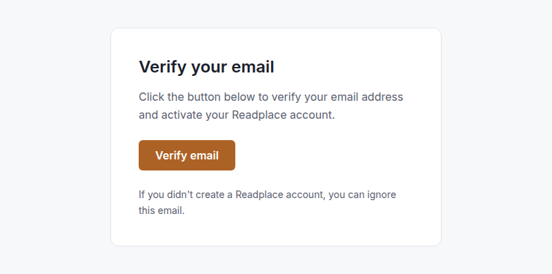</td>
<td valign="top">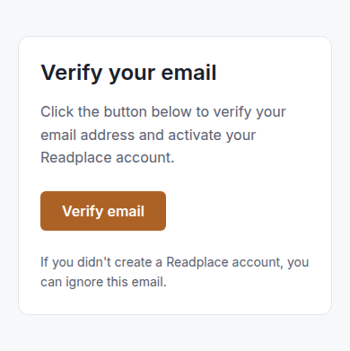</td>
</tr></table>

Exact HTML body: [`html/email-verification--default.html`](html/email-verification--default.html)

### Source

- `projects/hutch/src/runtime/web/auth/auth.page.ts:167` — sendVerificationEmail: stores the token, builds the link, sends, logs failures
- `projects/hutch/src/runtime/web/auth/auth.page.ts:278` — POST /signup handler; calls the sender at :381 (founding member) and :427 (trial)
- `projects/hutch/src/runtime/web/auth/verification-email.ts:19` — renderer; adds the UTM tags to the link
- `projects/hutch/src/runtime/web/auth/verification-email.template.html:1` — HTML template
- `projects/hutch/src/runtime/providers/email-verification/dynamodb-email-verification.ts:52` — token store: 64-hex token, 7-day expiry, single use
- `projects/hutch/src/runtime/providers/prod-providers.ts:486` — production sender: reserved-domain filter wrapping Resend
- `projects/hutch/src/runtime/server.ts:1174` — composition: wires the auth routes and sendEmail (line 1186)
- `projects/hutch/src/runtime/web/auth/auth.page.ts:578` — GET /verify-email: consumes the token, marks the email verified, sends the welcome email

## 2. Welcome email

**Account** · Every new Readplace account, founding member or trial, at most once: email+password accounts when their signup verification link is opened, Google and Apple accounts when the sign-in creates them.

### When it is sent

A new reader creates a Readplace account, on the web or from the iOS or Android app. For email and password signups, the welcome goes out the first time the link in 'Verify your email — Readplace' is opened, which can be any time in the 7 days after signup. For Google and Apple signups, it goes out as soon as the sign-in creates the account. Returning sign-ins, Stripe checkout returns and password resets never send it.

Trigger chain:

1. A new reader submits the email and password signup form at /signup (the iOS and Android apps' Sign up also lands here through /oauth/authorize) `projects/hutch/src/runtime/web/auth/auth.page.ts:278`
2. Readplace creates the account as a founding member or trial and emails the one 'Verify your email — Readplace' link, valid for 7 days `projects/hutch/src/runtime/web/auth/auth.page.ts:167`
3. Any client opens the link (GET or HEAD /verify-email?token=..., no sign-in needed) and the single-use token is deleted `projects/hutch/src/runtime/web/auth/auth.page.ts:593`
4. Readplace marks the account verified and sends the welcome to the address stored with the token `projects/hutch/src/runtime/web/auth/auth.page.ts:607`
5. Alternatively, a Google sign-in for an email with no Readplace account creates the account and session and sends the welcome before redirecting; a trial account sends from the same callback after its trial starts `projects/hutch/src/runtime/web/auth/google-auth.page.ts:225`
6. Apple sign-in does the same for a new account, founding member or trial `projects/hutch/src/runtime/web/auth/apple-auth.page.ts:301`
7. The sender builds the message (install link tagged utm_source=welcome-email, Fayner's avatar) and hands it to the mailer without waiting for the result `projects/hutch/src/runtime/web/auth/send-welcome-email.ts:24`
8. In production the mailer drops reserved test domains, then sends through Resend `projects/hutch/src/runtime/providers/prod-providers.ts:486`

Sent only when:

- Email+password: the signup form passes the bot checks and the email and password rules, and the email has no account yet `projects/hutch/src/runtime/web/auth/validate-signup.ts:67`
- Email+password: the verification mail was sent, because its link is the only way to trigger the welcome `projects/hutch/src/runtime/web/auth/auth.page.ts:168`
- Email+password: someone or something opens that link while it is unused and less than 7 days old; no sign-in or cookie is needed `projects/hutch/src/runtime/providers/email-verification/dynamodb-email-verification.ts:74`
- Email+password: the account still exists when the link is opened, so it can be marked verified `projects/hutch/src/runtime/web/auth/auth.page.ts:606`
- Google or Apple: the provider reports the email as verified (Apple applies the same check) `projects/hutch/src/runtime/web/auth/google-auth.page.ts:179`
- Google or Apple: no Readplace account exists for the provider's email, so the sign-in creates one `projects/hutch/src/runtime/web/auth/apple-auth.page.ts:229`

Not sent when:

- Sent at most once per account: there is no sent-marker, but the verification link is single-use and Google and Apple send only when the sign-in creates the account `projects/hutch/src/runtime/providers/email-verification/dynamodb-email-verification.ts:63`
- Returning sign-ins never send it: a Google or Apple sign-in for an existing account just signs the person in `projects/hutch/src/runtime/web/auth/google-auth.page.ts:185`
- A password account that first signs in with Google or Apple is marked verified without a welcome; it is welcomed only if it later opens its original link within 7 days `projects/hutch/src/runtime/web/auth/apple-auth.page.ts:238`
- There is no way to request a new verification link, so a password account whose only verification mail failed, was lost or went unopened never gets the welcome `projects/hutch/src/runtime/web/auth/auth.page.ts:181`
- Opening the link after 7 days, or a second time, shows 'This verification link is invalid or has already been used.' and sends nothing `projects/hutch/src/runtime/web/auth/auth.page.ts:600`
- Signing up with an email that already has an account signs the person in or shows 'This email is already registered', with no verification mail and no welcome `projects/hutch/src/runtime/web/auth/auth.page.ts:318`
- Signup is refused before any account exists for a filled honeypot field, a missing timestamp, a submit less than 2.5 seconds after page load, an invalid or disposable email, or a password under 8 characters `projects/hutch/src/runtime/web/auth/auth.page.ts:327`
- More than 10 email+password signups from one IP in an hour get a 429 before any account exists `projects/hutch/Pulumi.prod.yaml:56`
- A banned IP gets a 403 before any signup, verification or sign-in route runs `projects/hutch/src/runtime/web/middleware/ban.ts:28`
- A Google or Apple sign-in that fails (state mismatch, started more than 5 minutes ago, failed code exchange, unverified provider email) or an Apple cancel creates no account and sends nothing `projects/hutch/src/runtime/web/auth/google-auth.page.ts:165`
- Once the account-deletion worker has run for a deleted account, its verification link no longer works and sends nothing `projects/hutch/src/runtime/delete-account/delete-account-handler.ts:197`
- In production, a recipient at example.com, example.net or example.org, or at a .test, .example, .invalid or .localhost domain, has the whole message dropped, bcc copy included, with the log '[email] reserved recipient domain — not sent' `projects/hutch/src/runtime/providers/email/skip-reserved-domain.ts:33`

**Timing:** Immediate, during the HTTP request, with nothing scheduled: email+password accounts get it when the verification link is first opened, from seconds up to 7 days (168 hours) after signup. Google and Apple accounts get it during the sign-in callback that creates the account, before the redirect.

**If sending fails:** Fire-and-forget: the send is not awaited, and a Resend error is only logged as '[Email] Welcome email failed', with no retry, queue, DLQ or idempotency key and no effect on signup or verification. An error before the send (marking the account verified, starting the trial, creating the session) aborts the request, and that account is never welcomed.

<details><summary>Edge cases</summary>

- Recipient spelling: the email+password path mails the address exactly as typed at signup, case preserved (Sam.Reader@Gmail.com stays as typed), while the account is keyed by the normalized address `projects/hutch/src/runtime/providers/email-verification/dynamodb-email-verification.ts:56`
- Gmail aliases: an address that differs from an existing account only by dots, a +tag or googlemail.com counts as the same account, so signup shows 'This email is already registered' (password) or 'Account creation failed. Please try again.' (Google or Apple) and sends no welcome `projects/hutch/src/runtime/providers/auth/dynamodb-auth.ts:190`
- Google or Apple race: if account creation fails because the email was taken in the meantime, or its account is mid-deletion, the person is signed in to the existing account or shown 'Account creation failed. Please try again.', with no welcome `projects/hutch/src/runtime/web/auth/google-auth.page.ts:208`
- Store failure after the link is used: the token is deleted before the account is marked verified, so if that update throws, the welcome is lost for good and the link now reads as already used `projects/hutch/src/runtime/web/auth/auth.page.ts:606`
- Store failure during email+password signup: if starting the trial or creating the session throws after the account row is written, no verification mail goes out and the account can never be welcomed `projects/hutch/src/runtime/web/auth/auth.page.ts:415`
- Store failure during Google or Apple signup: if starting the trial or creating the session throws after the account row is written, the request fails before the send and a retry signs in as an existing account, so no welcome `projects/hutch/src/runtime/web/auth/google-auth.page.ts:272`
- Errors after the send (marking the browser session verified, building the page banner) can return a 500 on the verify page even though the welcome already went out `projects/hutch/src/runtime/web/auth/auth.page.ts:611`
- Reserved-domain matching is exact for example.com, example.net and example.org, so subdomains such as mail.example.com are still sent `projects/hutch/src/runtime/providers/email/skip-reserved-domain.ts:20`
- Environments: the local dev server with PERSISTENCE=development logs the full message instead of sending it; with PERSISTENCE=prod it uses the production providers and sends real mail through Resend `projects/hutch/src/runtime/dev-app.ts:15`
- Native apps: the iOS and Android Sign up and Login screens open /oauth/authorize, which sends a signed-out user to /signup or /login, so app signups follow the same web paths `projects/hutch/src/runtime/web/oauth/oauth.routes.ts:255`
- Production picks the founding member or trial branch from a user count cached for 60 seconds, falling back to 0 (founding member) if counting fails; the welcome is identical either way `projects/hutch/src/runtime/app.ts:76`

</details>

> **Observations**
>
> - Mail-security scanners and link prefetchers count as opening the link: a cookie-less GET or HEAD uses the token and sends the welcome, and the person's own click then shows 'This verification link is invalid or has already been used.' (confirmed by a capture probe) `projects/hutch/src/runtime/web/auth/auth.page.ts:578`
> - A person who deletes their account before verifying still gets the welcome if the link is opened before the async deletion worker removes the token, because marking the account verified ignores the deletion flag (confirmed by a capture probe) `projects/hutch/src/runtime/providers/auth/dynamodb-auth.ts:400`
> - The send is not awaited inside the Lambda request, so it may be delayed or dropped if the Lambda environment freezes before Resend responds (unverified) `projects/hutch/src/runtime/web/auth/send-welcome-email.ts:24`
> - There is no List-Unsubscribe header and no preference or opt-out check `projects/hutch/src/runtime/web/auth/send-welcome-email.ts:24`
> - Apple Hide My Email recipients get the welcome from fayner@readplace.com through Resend's send.readplace.com path, whose DNS is managed outside the repo; Apple's relay forwards it only if that sender is registered in the Apple Developer portal (unverified) `projects/hutch/src/infra/outbound-mail-auth.ts:15`
> - The message is HTML-only; whether Resend adds a plain-text part on its own is outside the repo (unverified) `projects/hutch/src/runtime/providers/email/resend-email.ts:14`

### Message

| Field | Value |
|---|---|
| From | `Fayner from Readplace <fayner@readplace.com>` |
| To | The new account's email: as typed at signup (email+password), or the Google or Apple ID-token email, including Apple Hide My Email relay addresses |
| Bcc | `readplace+welcome@readplace.com` |
| Reply-To | `fayner@readplace.com` |
| Subject | Welcome to Readplace |
| Headers | none |
| Plain-text part | none |
| Idempotency key | none |

Content variants:

| Variant | Shown when |
|---|---|
| default | Always: the template has no conditionals and takes only the fixed install link and avatar URL, so email+password, Google and Apple signups, founding member or trial, all get the same message; only the recipient differs. |

### Example

#### `default` — The only welcome body, captured from an email+password trial signup whose verification link was then opened; the same run confirmed that Google and Apple signups, as founding member or trial, send an identical message apart from the recipient.

Subject: **Welcome to Readplace** · To: `sam.reader@gmail.com`

<details><summary>Example inputs</summary>

```json
{
  "trigger": "GET /verify-email?token=<token>&utm_source=verification-email&utm_medium=email&utm_content=verify-email (first successful GET/HEAD of the signup verification link)",
  "verifyCtaUrl": "https://readplace.com/verify-email?token=9c947de1346e8568c6407d025b6b4cb0767ed3ee963e982680ee62ee63227a7f&utm_source=verification-email&utm_medium=email&utm_content=verify-email",
  "signupForm": {
    "email": "sam.reader@gmail.com",
    "password": "<8+ chars>",
    "loadedAt": "<page load ms, >= 2.5s before submit>"
  },
  "verificationToken": "9c947de1346e8568c6407d025b6b4cb0767ed3ee963e982680ee62ee63227a7f",
  "usersAtSignup": "1287 (illustrative; any count >= FOUNDING_MEMBER_LIMIT selects the trial branch of POST /signup — the welcome is identical in both branches)",
  "foundingMemberLimit": 50,
  "env": {
    "APP_ORIGIN": "https://readplace.com",
    "STATIC_BASE_URL": "https://static.readplace.com"
  },
  "derived": {
    "installUrl": "https://readplace.com/install?utm_source=welcome-email&utm_medium=email&utm_campaign=onboarding&utm_content=install",
    "avatarUrl": "https://static.readplace.com/fayner-brack.jpg"
  },
  "alsoVerifiedIdentical": {
    "emailPasswordFreeFoundingBranch": {
      "route": "POST /signup + GET /verify-email",
      "usersAtSignup": 12,
      "to": "sam.reader@gmail.com"
    },
    "googleNewUserFreeFounding": {
      "route": "GET /auth/google/callback",
      "usersAtSignup": 12,
      "to": "sam.reader@gmail.com"
    },
    "googleNewUserTrial": {
      "route": "GET /auth/google/callback",
      "usersAtSignup": 1287,
      "to": "sam.reader@gmail.com"
    },
    "appleNewUserFreeFoundingHideMyEmail": {
      "route": "POST /auth/apple/callback",
      "usersAtSignup": 12,
      "to": "x7k2m9qp4d@privaterelay.appleid.com"
    },
    "appleNewUserTrialHideMyEmail": {
      "route": "POST /auth/apple/callback",
      "usersAtSignup": 1287,
      "to": "x7k2m9qp4d@privaterelay.appleid.com"
    }
  }
}
```

</details>

<table><tr><th>Desktop (800px)</th><th>Phone (390px)</th></tr><tr>
<td valign="top">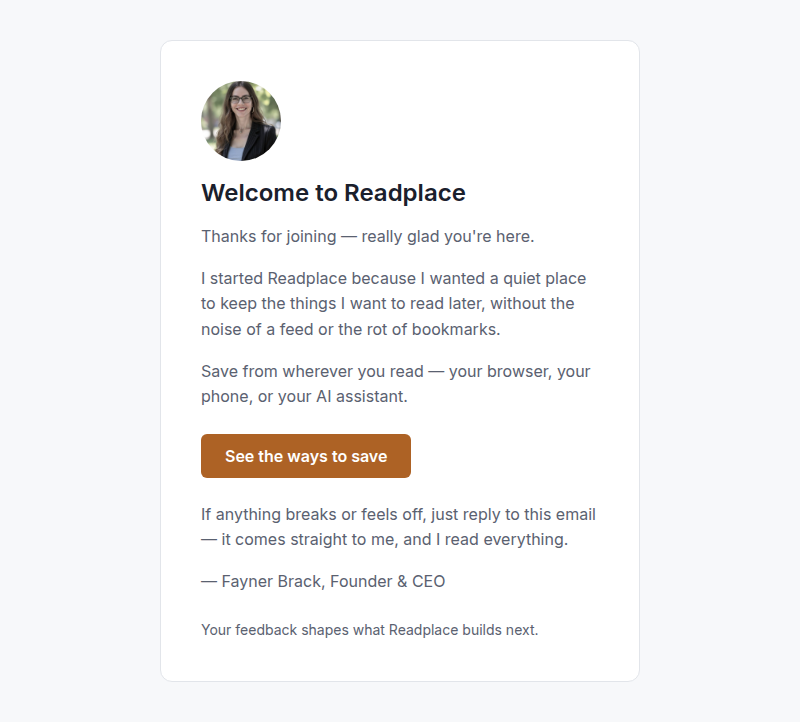</td>
<td valign="top">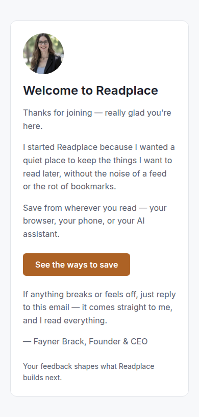</td>
</tr></table>

Exact HTML body: [`html/welcome--default.html`](html/welcome--default.html)

### Source

- `projects/hutch/src/runtime/web/auth/send-welcome-email.ts:16` — sender: from, bcc, reply-to, subject, tagged install link, fire-and-forget send
- `projects/hutch/src/runtime/web/auth/welcome-email.ts:9` — renderer
- `projects/hutch/src/runtime/web/auth/welcome-email.template.html:30` — template, with the 'See the ways to save' button
- `projects/hutch/src/runtime/web/auth/auth.page.ts:578` — GET /verify-email handler, sends at line 607
- `projects/hutch/src/runtime/web/auth/google-auth.page.ts:129` — Google callback, sends at lines 225 (founding member) and 284 (trial)
- `projects/hutch/src/runtime/web/auth/apple-auth.page.ts:165` — Apple callback, sends at lines 301 (founding member) and 363 (trial)
- `projects/hutch/src/runtime/server.ts:1174` — composition root wiring the auth, Google and Apple routers to the mailer
- `projects/hutch/src/runtime/providers/prod-providers.ts:486` — production mailer: reserved-domain filter around Resend

## 3. Password reset

**Account** · Anyone, signed in or not, who enters the email address of an existing Readplace account on the Forgot password page, whether the account uses a password, signs in only with Google or Apple, or is not yet verified.

### When it is sent

Someone opens the Forgot password page, usually from the "Forgot your password?" link on the sign-in page, enters an email address and submits it. The page always answers "Check your email", so it never reveals which addresses have accounts. If the address matches a Readplace account, the email goes out straight away with a Reset password button linking to https://readplace.com/reset-password?token=<token>&utm_source=password-reset-email&utm_medium=email&utm_content=reset-password, valid for one hour. Every allowed request creates a new token and sends a new email, and earlier links keep working until they expire.

Trigger chain:

1. The visitor reaches GET /forgot-password from the "Forgot your password?" link on the sign-in page, which the native apps, extensions and OAuth clients also show, or from the "Request a new link" button on a failed reset page `projects/hutch/src/runtime/web/auth/login.template.html:24`
2. The visitor submits the form, which POSTs the email field to /forgot-password `projects/hutch/src/runtime/web/auth/forgot-password.template.html:11`
3. The route consumes one unit of the per-IP forgot-password rate limit before doing anything else `projects/hutch/src/runtime/web/auth/forgot-password.page.ts:57`
4. A valid address gets the "Check your email" page straight away, whether or not an account exists `projects/hutch/src/runtime/web/auth/forgot-password.page.ts:76`
5. In the background, the users table is checked for a row keyed by the lower-cased address `projects/hutch/src/runtime/providers/auth/dynamodb-auth.ts:413`
6. A new single-use token (64 hex characters, expiring 3600 s later) is stored in the password-reset-tokens table `projects/hutch/src/runtime/providers/password-reset/dynamodb-password-reset.ts:49`
7. The email HTML is rendered with the reset link plus utm_source=password-reset-email, utm_medium=email and utm_content=reset-password `projects/hutch/src/runtime/web/auth/password-reset-email.ts:19`
8. The message goes to the production sender, which skips reserved test domains and otherwise sends through Resend `projects/hutch/src/runtime/providers/prod-providers.ts:486`

Sent only when:

- The visitor POSTs the Forgot password form; no sign-in is needed, and signed-in visitors can use it too, for any address `projects/hutch/src/runtime/web/auth/forgot-password.page.ts:57`
- The visitor's IP address has had fewer than 5 requests allowed on this form in the current UTC clock hour (production setting 5/3600) `projects/hutch/Pulumi.prod.yaml:57`
- The entered value is a valid email address `projects/hutch/src/runtime/web/auth/auth.schema.ts:21`
- A Readplace account exists whose stored email equals the entered address once lower-cased; password, Google-only, Apple-only and unverified accounts all qualify `projects/hutch/src/runtime/providers/auth/dynamodb-auth.ts:414`
- The recipient's domain is not a reserved test domain `projects/hutch/src/runtime/providers/email/skip-reserved-domain.ts:31`

Not sent when:

- Unknown address: nothing is sent, but the visitor still sees the same "Check your email" page `projects/hutch/src/runtime/web/auth/forgot-password.page.ts:80`
- Invalid address: the form shows an error with status 422 and nothing is sent `projects/hutch/src/runtime/web/auth/forgot-password.page.ts:58`
- Rate limited: from the 6th request from one IP in the same UTC clock hour, the visitor gets a 429 "Too many requests from your network" response; every allowed request counts, including invalid and unknown addresses `projects/hutch/src/runtime/web/middleware/rate-limit.ts:36`
- Banned visitor: a request from an IP on the ban list gets a 403 and never reaches the form handler `projects/hutch/src/runtime/web/middleware/ban.ts:28`
- Reserved recipient domain (example.com, example.net, example.org, or any .test, .example, .invalid or .localhost address): the send is skipped with a logged warning, and the BCC copy is skipped too `projects/hutch/src/runtime/providers/email/skip-reserved-domain.ts:32`
- Account purged: once the delete-account worker has removed the account's users row, the lookup finds nothing and no email is sent `projects/hutch/src/runtime/delete-account/delete-account-handler.ts:205`

**Timing:** Sent immediately, in the same web request, right after the "Check your email" page is returned; there is no queue, schedule or delay. The link expires 3600 s (1 hour) after the token is created, and the per-IP rate-limit window resets at the top of every UTC hour.

**If sending fails:** Fire-and-forget: the account lookup, token write and Resend call run after the response is sent, and any error is logged once as "[Email] Password reset email failed" with no retry, queue or DLQ. The visitor is not told and can only submit the form again.

<details><summary>Edge cases</summary>

- Gmail spellings do not match: the lookup only lower-cases the address and does not apply the Gmail canonical form that signup uses for uniqueness, so for the account sam.reader@gmail.com, typing samreader@gmail.com, sam.reader+x@gmail.com or sam.reader@googlemail.com shows "Check your email" but sends nothing (verified by driving the route) `projects/hutch/src/runtime/providers/auth/dynamodb-auth.ts:414`
- Mixed case: typing Sam.Reader@Gmail.com matches the account sam.reader@gmail.com, and the email is addressed to Sam.Reader@Gmail.com as typed, not to the stored address `projects/hutch/src/runtime/web/auth/forgot-password.page.ts:86`
- A whitespace-padded address or a repeated email field fails validation with a 422 before any lookup `projects/hutch/src/runtime/web/auth/auth.schema.ts:21`
- Apple "Hide my email" accounts are stored under the address Apple returns, which is the private-relay address, so typing the customer's real address finds no account and sends nothing (unverified, from code reading) `projects/hutch/src/runtime/providers/auth/dynamodb-auth.ts:259`
- Legacy host: a POST on hutch-app.com gets a 301 to https://readplace.com before the route runs, the browser re-requests the page as a GET and shows the form again, and no email is sent and no rate-limit unit is used `projects/hutch/src/runtime/server.ts:539`
- A malformed utm_* query value gets a 400 before the route runs `src/packages/web-analytics/src/utm-validation.middleware.ts:22`
- If the rate-limit store fails, the visitor gets a 500 JSON error and no email is sent `projects/hutch/src/runtime/web/middleware/rate-limit.ts:44`
- Requests with no resolvable client IP all share one "unknown" rate-limit bucket `projects/hutch/src/runtime/web/middleware/rate-limit.ts:12`
- Requests that are denied by the rate limit do not add to the count, because the counter update is conditional `projects/hutch/src/runtime/providers/rate-limit/dynamodb-rate-limit.ts:43`
- When a reserved domain skips the send, the token has already been written and stays until the DynamoDB TTL removes it `projects/hutch/src/runtime/web/auth/forgot-password.page.ts:81`
- A DynamoDB error, a Resend 4xx (EmailRejectedError) or a Resend 5xx or network failure in the background chain loses the email after one log line `projects/hutch/src/runtime/providers/email/resend-email.ts:27`
- Account deletion race: the delete-account worker scrubs reset tokens before it deletes the users row, so a request in between still sends an email and leaves a fresh token that outlives the account until the TTL removes it `projects/hutch/src/runtime/delete-account/delete-account-handler.ts:186`
- Staging runs the same code and sends real email through Resend, with links on https://readplace-staging.com and a limit of 5000 requests per IP per hour `projects/hutch/Pulumi.staging.yaml:49`
- Local development with PERSISTENCE=development only logs the message, HTML included, and never sends, and its in-memory tokens never expire; the production web Lambda always runs with PERSISTENCE=prod `projects/hutch/src/runtime/providers/dev-providers.ts:533`

</details>

> **Observations**
>
> - Every reset email is BCC'd to readplace+password_resets@readplace.com with the live single-use link, so anyone who can read that mailbox can reset any customer's password within the hour, and the reset signs the customer out of every session `projects/hutch/src/runtime/web/auth/forgot-password.page.ts:87`
> - Earlier links are not revoked: each request writes a new token, and a successful reset deletes only the token it used, so several reset links for one account work at once until each expires `projects/hutch/src/runtime/providers/password-reset/dynamodb-password-reset.ts:57`
> - Accounts that sign in only with Google or Apple get the email, and using the link gives them a password for the first time, although the copy says "set a new password" `projects/hutch/src/runtime/providers/auth/dynamodb-auth.ts:532`
> - Soft-deleted accounts still get the email between deletion and the purge, because the existence check ignores deletedAt, but the link always fails with "This reset link is invalid or has already been used." since the reset step skips deleted accounts `projects/hutch/src/runtime/web/auth/forgot-password.page.ts:141`
> - The only throttle is per IP: there is no per-recipient limit, no bot defence and no opt-out, so requests from many IPs could send repeated reset emails to one address `projects/hutch/src/runtime/web/auth/forgot-password.page.ts:52`
> - The send chain runs after the response, and the web Lambda handler returns as soon as the response finishes without waiting for it, so Lambda may freeze or reclaim the environment before the Resend call completes; no delay or loss has been observed in production (unverified) `projects/hutch/src/runtime/lambda.main.ts:63`

### Message

| Field | Value |
|---|---|
| From | `Fayner from Readplace <fayner@readplace.com>` |
| To | The address typed into the Forgot password form, with its casing kept |
| Bcc | `readplace+password_resets@readplace.com` |
| Reply-To | none |
| Subject | Reset your password — Readplace |
| Headers | none |
| Plain-text part | none |
| Idempotency key | none |

Content variants:

| Variant | Shown when |
|---|---|
| default | The only branch: the template has no conditionals, so every account type gets the same body, and only the recipient and the token in the Reset password link differ. |

### Example

#### `default` — A customer with a password account (sam.reader@gmail.com) submits the Forgot password form on readplace.com, and the email shows the heading, the one-hour expiry note and a Reset password button carrying a fresh 64-character token.

Subject: **Reset your password — Readplace** · To: `sam.reader@gmail.com`

<details><summary>Example inputs</summary>

```json
{
  "request": {
    "method": "POST",
    "path": "/forgot-password?utm_source=auth-forgot&utm_medium=internal&utm_content=send-reset-link",
    "body": {
      "email": "sam.reader@gmail.com"
    }
  },
  "existingAccount": {
    "email": "sam.reader@gmail.com",
    "signInMethod": "password"
  },
  "generatedToken": "c6bfc985741f2c645e5927d720c232635628f32acf4c48af5e516f08b000aae6",
  "tokenFormat": "randomBytes(32).toString('hex') — 64 lowercase hex chars, single-use, expires 3600 s after creation",
  "env": {
    "APP_ORIGIN": "https://readplace.com",
    "STATIC_BASE_URL": "https://static.readplace.com",
    "RATE_LIMIT_FORGOT_PASSWORD": "5/3600"
  },
  "sendEmailWiring": "initSkipReservedDomain(capturing sink in place of initResendEmail)"
}
```

</details>

<table><tr><th>Desktop (800px)</th><th>Phone (390px)</th></tr><tr>
<td valign="top">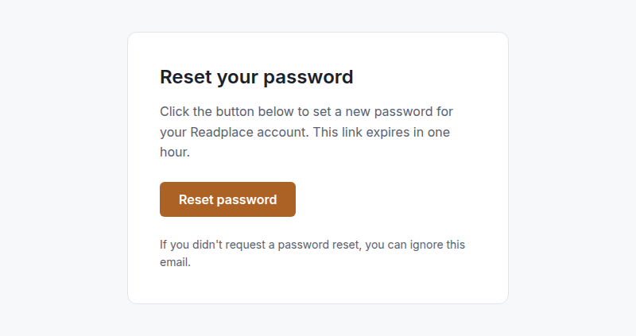</td>
<td valign="top">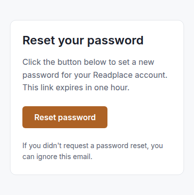</td>
</tr></table>

Exact HTML body: [`html/password-reset--default.html`](html/password-reset--default.html)

### Source

- `projects/hutch/src/runtime/web/auth/forgot-password.page.ts:57` — handler: POST /forgot-password with rate limit, validation, lookup, token and send
- `projects/hutch/src/runtime/web/auth/forgot-password.page.ts:84` — sendEmail call setting from, to, bcc and subject
- `projects/hutch/src/runtime/web/auth/password-reset-email.ts:19` — renderer: adds UTM tags to the reset URL and renders the template
- `projects/hutch/src/runtime/web/auth/password-reset-email.template.html:22` — template: heading, one-hour expiry copy and Reset password button
- `projects/hutch/src/runtime/providers/password-reset/dynamodb-password-reset.ts:49` — token creation with 1-hour expiry
- `projects/hutch/src/runtime/providers/prod-providers.ts:486` — composition root: wraps the Resend sender in the reserved-domain guard
- `projects/hutch/src/runtime/providers/email/skip-reserved-domain.ts:30` — reserved-domain guard on the recipient
- `projects/hutch/src/runtime/providers/email/resend-email.ts:8` — sender: Resend API call and 4xx/5xx error mapping

## 4. Trial-ending digest

**Trial & billing** · Trialists who have not pressed cancel or chosen a plan, with a verified email, still subscribed to the readlist digest, and with at least one ready unread save in their All readlist.

### When it is sent

When a trialist reaches 96 hours before their trial ends, the next 6-hourly digest check sends this version of 'Waiting in your readlist' instead of the regular readlist digest. It lists up to 10 of their newest ready unread saves of any age, including ones already emailed, then states the date to choose a plan by and adds a Keep Readplace button to /account/plans. It goes out once per trial window, ignores the readlist digest's 7-day gap and restarts it, and once sent it stops the 'your Readplace trial ends in 2 days' reminder from going out 48 hours before the end. Because the regular readlist digest only lists saves at least 30 days old, on a standard 14-day trial this is the only readlist digest a trialist gets.

Trigger chain:

1. EventBridge Scheduler `hutch-digest-flush` puts a trigger message on the digest-scan queue every 6 hours `projects/hutch/src/infra/index.ts:881`
2. digest-scan lists trialing, active and pending_cancellation users and sends one SendUserDigestCommand per user `projects/hutch/src/runtime/digest-scan/digest-scan-handler.ts:46`
3. send-user-digest loads the user's contact, subscription row and last regular-digest state `projects/hutch/src/runtime/send-queue-digest/send-queue-digest-handler.ts:143`
4. It skips users who are unverified, unsubscribed, or not on a trial or paid tier `projects/hutch/src/runtime/send-queue-digest/send-queue-digest-handler.ts:157`
5. isPayDigestDue finds a trialing row inside [trialEndsAt − 96h, trialEndsAt − 60h) with no trial-ending digest yet, so the pay plan replaces the regular one `projects/hutch/src/runtime/domain/stripe/stripe-trial-config.ts:44`
6. It picks up to 10 ready unread saves of any age and claims the pay marker (payDigestEmailSentAt) on the subscription row `projects/hutch/src/runtime/providers/subscription-providers/dynamodb-subscription-writes.ts:189`
7. It sends through Resend with the pay block, then stamps emailSentAt on every listed save `projects/hutch/src/runtime/send-queue-digest/send-queue-digest-handler.ts:197`
8. When the trial reminder fires 48h before trial end, it sees the pay marker and skips `projects/hutch/src/runtime/send-trial-feedback-email/send-trial-feedback-email-handler.ts:297`

Sent only when:

- The subscription status is trialing; a trialist who pressed cancel (pending_cancellation) or already chose a plan (active) never gets it `projects/hutch/src/runtime/domain/stripe/stripe-trial-config.ts:50`
- The check runs at or after trialEndsAt − 96h `projects/hutch/src/runtime/domain/stripe/stripe-trial-config.ts:55`
- The check runs before trialEndsAt − 60h `projects/hutch/src/runtime/domain/stripe/stripe-trial-config.ts:56`
- No trial-ending digest has been sent in this trial window yet `projects/hutch/src/runtime/domain/stripe/stripe-trial-config.ts:58`
- The user row exists and its email is verified `projects/hutch/src/runtime/send-queue-digest/send-queue-digest-handler.ts:157`
- The user has not unsubscribed from the readlist digest `projects/hutch/src/runtime/send-queue-digest/send-queue-digest-handler.ts:158`
- At least one save qualifies: it is in the All readlist and unread, at any age, including saves already listed in an earlier digest `projects/hutch/src/runtime/send-queue-digest/send-queue-digest-handler.ts:297`
- Its reader view has loaded, its content has not been purged, and it is not the consent-seed article `projects/hutch/src/runtime/send-queue-digest/send-queue-digest-handler.ts:360`
- Its AI summary is ready `projects/hutch/src/runtime/send-queue-digest/send-queue-digest-handler.ts:371`
- The email lists at most 10 qualifying saves, newest save first `projects/hutch/src/runtime/send-user-digest.main.ts:29`
- The claim on the subscription row succeeds: the row is still trialing with the same trialEndsAt and no pay marker `projects/hutch/src/runtime/providers/subscription-providers/dynamodb-subscription-writes.ts:196`

Not sent when:

- No user row or an unverified email: skipped with reason no-verified-email, and the trial reminder goes out 48h before trial end instead `projects/hutch/src/runtime/send-queue-digest/send-queue-digest-handler.ts:157`
- Unsubscribed from the readlist digest: this version is never sent either, and the trial reminder goes out instead `projects/hutch/src/runtime/send-queue-digest/send-queue-digest-handler.ts:158`
- The trialist pressed cancel (pending_cancellation): never sent `projects/hutch/src/runtime/domain/stripe/stripe-trial-config.ts:50`, and since the regular readlist digest only lists saves at least 30 days old `projects/hutch/src/runtime/domain/email/queue-digest-cadence.ts:7`, on a standard 14-day trial they get no readlist digest before access ends either
- The trialist already chose a plan: their row is active, so they count as a paying member and get regular readlist digests only `src/packages/subscription-access/src/effective-access.ts:45`
- Already sent in this trial window: not sent again `projects/hutch/src/runtime/domain/stripe/stripe-trial-config.ts:58`
- Re-opening the trial window clears the once-only marker, so a trialist who cancels and then reactivates, or gets an admin trial extension, can receive it again `projects/hutch/src/runtime/providers/subscription-providers/dynamodb-subscription-writes.ts:58`
- No ready unread save on a check: skipped with reason pay-no-ready-saves and retried on the next check; if none of the window's 6 checks finds one, it never goes out and the trial reminder is sent instead `projects/hutch/src/runtime/send-queue-digest/send-queue-digest-handler.ts:170`
- Deleting an account does not stop it right away; it stops when the background deletion job removes the user's saves `projects/hutch/src/runtime/delete-account/delete-account-handler.ts:180`

**Timing:** Sent on the first 6-hourly check at or after trialEndsAt − 96h that finds a ready unread save, and never at or after trialEndsAt − 60h; on a standard 14-day trial that is 10.0 to 11.5 days after signup, normally the first check of the window, 90 to 96h before the trial ends. On a standard trial no regular readlist digest comes before it, since none of the trialist's saves is 30 days old yet (after an admin extension one can, as little as 6h earlier); the next regular digest waits at least 7 days less 30 minutes (167.5h) after it, and the deadline it shows is trialEndsAt − 48h05m in UTC.

**If sending fails:** Any error fails the SQS record, which is retried after 120s up to 3 receives and then moves to the send-user-digest DLQ, whose alarm emails the team. A Resend 4xx releases the pay marker so a retry or a later check in the window can send, while a 5xx or network error keeps it so the trialist never gets a second copy.

<details><summary>Edge cases</summary>

- The pay claim requires the row to still be trialing with the same trialEndsAt; an admin extension or a cancel landing between the read and the claim makes that check log '[SendQueueDigest] pay-already-claimed' and send nothing `projects/hutch/src/runtime/providers/subscription-providers/dynamodb-subscription-writes.ts:196`
- A redelivered message that already holds the pay marker only finishes stamping saves and never sends a second copy `projects/hutch/src/runtime/send-queue-digest/send-queue-digest-handler.ts:252`
- The window is measured from the current trialEndsAt, so after an admin extension it moves with the new end date `projects/hutch/src/runtime/domain/stripe/stripe-trial-config.ts:52`
- Saves are picked by the same reader as the readlist digest apart from the age floor and the emailed filter: All readlist only, 10-item cap, 50-candidate read budget, consent-seed URL match, and saves with no shared article row dropped `projects/hutch/src/runtime/send-queue-digest/send-queue-digest-handler.ts:334`
- Recipients at reserved test domains are dropped by a wrapper that reports success, so the pay marker is still set and the trial reminder is then skipped for that account `projects/hutch/src/runtime/providers/email/skip-reserved-domain.ts:31`
- queue_digest_sent records kind pay with hours_to_trial_end rounded down `projects/hutch/src/runtime/send-queue-digest/send-queue-digest-handler.ts:296`
- The deadline and end date are always formatted in UTC, whatever the reader's timezone `projects/hutch/src/runtime/web/queue-digest-email.ts:137`
- Every deployed stack, staging included, sends it through Resend with that stack's APP_ORIGIN in the links `projects/hutch/src/infra/index.ts:781`

</details>

> **Observations**
>
> - A second trial-ending digest can go out in the same trial: reactivating after a cancel keeps the same trialEndsAt but re-opens the window, which clears the pay marker `projects/hutch/src/runtime/web/pages/account/account.page.ts:622`; the admin extend-trial page does the same `projects/hutch/src/runtime/web/pages/admin/extend-trial.page.ts:169`.
> - If a send fails ambiguously (Resend 5xx or network error) and Resend never accepted it, the pay marker stays set, so the trialist gets neither this email nor the trial reminder `projects/hutch/src/runtime/send-trial-feedback-email/send-trial-feedback-email-handler.ts:297`.
> - A Resend 4xx removes the pay marker `projects/hutch/src/runtime/providers/subscription-providers/dynamodb-subscription-writes.ts:227`, so an address Resend keeps refusing is retried on each check in the window (3 receives each), and each check ends in the DLQ alarm.
> - Unsubscribing from the readlist digest also stops this email, which carries the charge terms, while the unsubscribe page says account and billing emails still arrive `projects/hutch/src/runtime/web/pages/queue-digest-unsubscribe/queue-digest-unsubscribe.component.ts:25`; the trial reminder still goes out in its place.
> - A trialist who pressed cancel gets neither this email nor the trial reminder, which also requires status trialing `projects/hutch/src/runtime/send-trial-feedback-email/send-trial-feedback-email-handler.ts:276`.
> - It shares the readlist digest's template, so the developer HTML comment in every card `projects/hutch/src/runtime/web/queue-digest-email.template.html:28` and the reply line without a closing period `projects/hutch/src/runtime/web/email-copy.ts:2` appear here too.
> - On a standard 14-day trial `projects/hutch/src/runtime/domain/stripe/stripe-trial-config.ts:4` no save reaches the readlist digest's 30-day age floor `projects/hutch/src/runtime/domain/email/queue-digest-cadence.ts:7`, so a trialist gets no regular readlist digest: this email is the first and only readlist digest of the trial, and in the trial's first window none of the saves it lists has been emailed before.
> - After an admin extension that leaves a trialist with saves at least 30 days old (the extension accepts any future end date `projects/hutch/src/runtime/domain/trial/resolve-trial-extension.ts:62`), they can get a regular readlist digest that says 'This is a one-time reminder about them.' `projects/hutch/src/runtime/web/queue-digest-email.ts:131`, and this email can then list the same saves again, because it ignores whether a save was already emailed `projects/hutch/src/runtime/send-queue-digest/send-queue-digest-handler.ts:297`.

### Message

| Field | Value |
|---|---|
| From | `Readplace <readplace@readplace.com>` |
| To | The trialist's account email (the email on their Readplace user row, looked up by userId) |
| Bcc | none |
| Reply-To | `fayner@readplace.com` |
| Subject | Waiting in your readlist |
| Headers | List-Unsubscribe: <https://readplace.com/email/queue-digest/unsubscribe?t={userId}.{hmacSha256Hex}>; List-Unsubscribe-Post: List-Unsubscribe=One-Click |
| Plain-text part | Yes: the readlist digest's plain-text layout with this version's one-line intro and footer reason and without the 'Mark all as read: {link}' line, plus the charge-terms paragraph and a 'Keep Readplace: {link}' line. |
| Idempotency key | none |

Content variants:

| Variant | Shown when |
|---|---|
| pay | The trial-ending digest is due. Unlike the readlist digest, the intro is '{n} articles you saved are ready to read.' and the footer reason is 'You're getting this because you save articles to Readplace.'. Below a divider it adds 'Choose a plan before {trialEndsAt − 48h05m, e.g. Oct 7, 2026, 07:26 UTC} and nothing is charged until {trialEndsAt date, e.g. Oct 9, 2026}. After that, choosing a plan starts it the same day.' and an amber Keep Readplace button to /account/plans; Continue reading becomes a white button with a grey border, the readlist digest's Mark all as read button is left out, and every link carries utm_campaign=pay. |
| pay-single-article | Exactly one ready unread save: intro '1 article you saved is ready to read.'. Not captured for this version. |
| pay-summary-fallback-preview | Card previews follow the readlist digest's rules: the excerpt, or for a summary that predates excerpts, the summary cut to 200 characters with '…'. Not captured for this version. |

### Example

#### `pay` — A trialist 94h before trial end, on the first check of the window (the 03:12 check before it found no save old enough for a regular digest), gets '3 articles you saved are ready to read.' over three saves from the last three days, the newest 2.5h old and none emailed before, then the paragraph 'Choose a plan before Oct 7, 2026, 07:26 UTC and nothing is charged until Oct 9, 2026.' and the amber Keep Readplace button, with Continue reading turned white and no Mark all as read button.

Subject: **Waiting in your readlist** · To: `sam.reader@gmail.com`

<details><summary>Example inputs</summary>

```json
{
  "sqsRecord": {
    "messageId": "7f2c8a91-4be3-4d0a-b6e5-19c3d7a0f4e2",
    "body": {
      "detail": {
        "userId": "4f9a1c7e2b3d48e6a0c5d9f1e7b2a6c3"
      }
    }
  },
  "sendInstant": "2026-10-05T09:12:41.337Z",
  "env": {
    "APP_ORIGIN": "https://readplace.com",
    "ANALYTICS_SALT": "(placeholder; prod value is a secret)"
  },
  "productionConstants": {
    "cooldownMs": "5.5h",
    "regularDigestMinGapMs": "7 days less 30 minutes (167.5h)",
    "minSaveAgeMs": "30 days",
    "maxDigestItems": 10,
    "maxCandidatesRead": 50
  },
  "contact": {
    "email": "sam.reader@gmail.com",
    "emailVerified": true
  },
  "subscription": {
    "kind": "trialing",
    "trialEndsAt": "2026-10-09T07:31:09.482Z"
  },
  "previousRegularDigest": null,
  "saves": [
    {
      "url": "https://jvns.ca/blog/2025/02/05/some-terminal-frustrations/",
      "title": "Some terminal frustrations",
      "siteName": "Julia Evans",
      "savedAt": "2026-10-05T06:40:27.000Z",
      "readerAvailableAt": "2026-10-05T06:41:10.000Z",
      "summaryStatus": "ready",
      "excerpt": "1,600 terminal users shared what trips them up, from copy and paste to remembering syntax.",
      "emailSentAt": null
    },
    {
      "url": "https://martinfowler.com/articles/patterns-of-distributed-systems/",
      "title": "Patterns of Distributed Systems",
      "siteName": "martinfowler.com",
      "savedAt": "2026-10-04T07:48:12.000Z",
      "readerAvailableAt": "2026-10-04T07:49:03.000Z",
      "summaryStatus": "ready",
      "excerpt": "The patterns Kafka, Cassandra and etcd share, from write-ahead logs to leader election.",
      "emailSentAt": null
    },
    {
      "url": "https://mcfunley.com/choose-boring-technology",
      "title": "Choose Boring Technology",
      "siteName": "mcfunley.com",
      "savedAt": "2026-10-02T07:02:51.000Z",
      "readerAvailableAt": "2026-10-02T07:03:40.000Z",
      "summaryStatus": "ready",
      "excerpt": "Every team gets about three innovation tokens, so spend them on what makes the product different.",
      "emailSentAt": null
    }
  ],
  "analyticsEmitted": [
    {
      "stream": "analytics",
      "event": "queue_digest_sent",
      "timestamp": "2026-10-05T09:12:41.337Z",
      "user_id": "4f9a1c7e2b3d48e6a0c5d9f1e7b2a6c3",
      "send_id": "7f2c8a91-4be3-4d0a-b6e5-19c3d7a0f4e2",
      "kind": "pay",
      "hours_to_trial_end": 94,
      "item_count": 3,
      "previously_emailed_count": 0,
      "tier": "trial",
      "trial_day": 11
    }
  ],
  "previousTick": {
    "at": "2026-10-05T03:12:41.337Z",
    "outcome": [
      {
        "userId": "4f9a1c7e2b3d48e6a0c5d9f1e7b2a6c3",
        "reason": "no-eligible-items"
      }
    ]
  }
}
```

</details>

<table><tr><th>Desktop (800px)</th><th>Phone (390px)</th></tr><tr>
<td valign="top">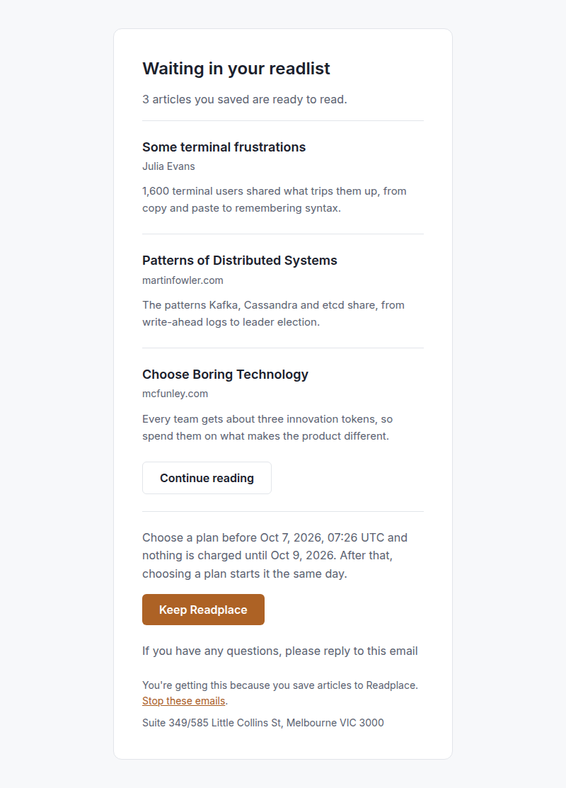</td>
<td valign="top">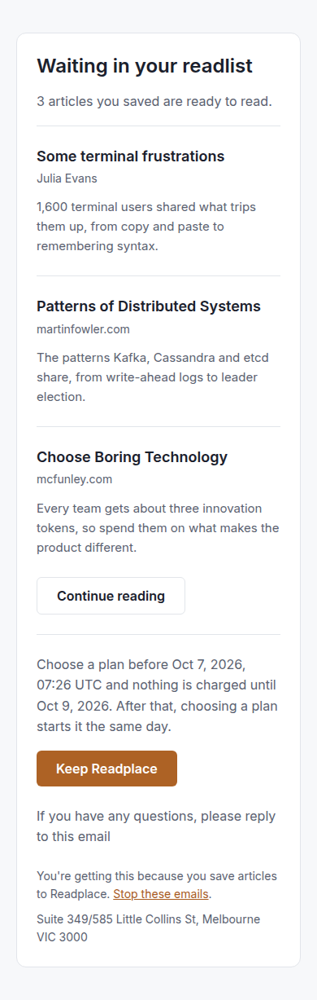</td>
</tr></table>

Exact HTML body: [`html/trial-ending-digest--pay.html`](html/trial-ending-digest--pay.html)

### Source

- `projects/hutch/src/runtime/domain/stripe/stripe-trial-config.ts:44` — isPayDigestDue: trialing, window, once per window
- `projects/hutch/src/runtime/send-queue-digest/send-queue-digest-handler.ts:288` — pay plan: no age floor, any emailed state, pay claim and release
- `projects/hutch/src/runtime/web/queue-digest-email.ts:132` — pay intro '{n} articles you saved are ready to read.' (pay footer reason at :25)
- `projects/hutch/src/runtime/web/queue-digest-email.ts:135` — charge-terms paragraph, Keep Readplace link at :175, and at :95 the neutral Continue reading button with no Mark all as read
- `projects/hutch/src/runtime/web/queue-digest-email.template.html:63` — pay block template
- `projects/hutch/src/runtime/providers/subscription-providers/dynamodb-subscription-writes.ts:189` — pay marker claim (release at :223)
- `projects/hutch/src/runtime/send-queue-digest/send-queue-digest-handler.ts:197` — sender (sendEmail call)
- `projects/hutch/src/runtime/send-user-digest.main.ts:88` — composition root
- `projects/hutch/src/runtime/send-trial-feedback-email/send-trial-feedback-email-handler.ts:297` — trial reminder skipped once this is sent

## 5. Trial pre-expiry reminder

**Trial & billing** · Readers on the 14-day no-card trial who are still trialing 48 hours before it ends and have not had this trial's trial-ending digest; founding members, paid members and readers who cancelled never get it, but unverified email signups do.

### When it is sent

A no-card trial starts when someone signs up after the founding-member allocation is used up, reactivates a cancelled trial before it ends, or gets a trial extension from an admin. At that point Readplace schedules a one-shot reminder for exactly 48 hours before the trial ends. When the reminder fires, the send-trial-feedback-email Lambda reads the reader's subscription again. It sends only if the reader is still trialing, the trial has not ended, and neither this reminder nor this trial's trial-ending digest has gone out. The email asks them to subscribe from their account page and mentions how many articles they have saved. Subscribing at checkout, cancelling or deleting the account removes the schedule before it fires.

Trigger chain:

1. A reader signs up by email after the founding-member allocation is used up, and the signup calls startTrial with a trial ending 14 days later. Google and Apple sign-up do the same `projects/hutch/src/runtime/web/auth/auth.page.ts:415`
2. A trial can also reopen. Reactivating a cancelled trial that has not ended, or an admin extending a trial, calls startTrial in reset mode, which first deletes the old trial-reminder schedule `projects/hutch/src/runtime/domain/trial/start-trial.ts:99`
3. startTrial sets the fire time to the trial end minus 48 hours and creates the schedule only if that time is still ahead `projects/hutch/src/runtime/domain/trial/start-trial.ts:108`
4. The scheduler creates trial-reminder-<userId>, a one-shot UTC schedule that deletes itself after it runs. When it fires, it puts SendTrialFeedbackEmailCommand {userId, kind: "reminder"} on the hutch event bus `projects/hutch/src/runtime/providers/trial-scheduler/aws-trial-scheduler.ts:226`
5. startTrial writes the trialing row last. That write clears trialReminderEmailSentAt and the pay-digest marker, so a reopened trial gets its own reminder `projects/hutch/src/runtime/providers/subscription-providers/dynamodb-subscription-writes.ts:58`
6. When the schedule fires, the rule send-trial-feedback-email-command-rule forwards the command to send-trial-feedback-email-q, which invokes the send-trial-feedback-email-handler Lambda one message at a time `projects/hutch/src/infra/index.ts:1204`
7. The handler sends kind "reminder" to processReminder, which reads the subscription row and the email address again and runs the guards `projects/hutch/src/runtime/send-trial-feedback-email/send-trial-feedback-email-handler.ts:82`
8. processReminder counts the reader's saves, renders the email and sends it through Resend behind the reserved-domain filter. It then sets trialReminderEmailSentAt `projects/hutch/src/runtime/send-trial-feedback-email/send-trial-feedback-email-handler.ts:327`

Sent only when:

- startTrial opened a no-card trial for the reader. That happens on an email, Google or Apple signup after the founding-member allocation ran out, on reactivating a cancelled trial that has not ended, or on an admin trial extension `projects/hutch/src/runtime/domain/trial/start-trial.ts:70`
- When the trial opened, its end was more than 48 hours away and the trial-reminder schedule was created `projects/hutch/src/runtime/domain/trial/start-trial.ts:110`
- At send time the reader's subscription row exists and its status is still trialing `projects/hutch/src/runtime/send-trial-feedback-email/send-trial-feedback-email-handler.ts:276`
- At send time the trial end is still in the future `projects/hutch/src/runtime/send-trial-feedback-email/send-trial-feedback-email-handler.ts:283`
- No trial reminder has gone out in this trial window, so trialReminderEmailSentAt is unset `projects/hutch/src/runtime/send-trial-feedback-email/send-trial-feedback-email-handler.ts:290`
- This trial's trial-ending digest has not been claimed, so payDigestEmailSentAt is unset `projects/hutch/src/runtime/send-trial-feedback-email/send-trial-feedback-email-handler.ts:297`
- The account has an email address on file `projects/hutch/src/runtime/send-trial-feedback-email/send-trial-feedback-email-handler.ts:306`
- The address is not on a reserved test domain: not example.com, example.net or example.org, and not under a .test, .example, .invalid or .localhost TLD `projects/hutch/src/runtime/providers/email/skip-reserved-domain.ts:31`

Not sent when:

- Founding members never get it. Their signup returns before startTrial, so they have no trial and no subscription row `projects/hutch/src/runtime/web/auth/auth.page.ts:372`
- Subscribing during the trial stops it. Landing on the checkout success page makes the reader active and deletes the reminder schedule, and the status guard drops any fire that still arrives `projects/hutch/src/runtime/web/auth/auth.page.ts:551`
- Cancelling the trial stops it. The cancel job deletes the reminder schedule and the row moves to pending_cancellation `projects/hutch/src/runtime/cancel-subscription/cancel-subscription-handler.ts:94`
- Deleting the account stops it once the deletion job deletes the reminder schedule `projects/hutch/src/runtime/delete-account/delete-account-handler.ts:134`
- A reader gets one reminder per trial window. Once trialReminderEmailSentAt is set, later fires are skipped until a reopened trial clears it `projects/hutch/src/runtime/send-trial-feedback-email/send-trial-feedback-email-handler.ts:290`
- The trial-ending digest replaces it. If this trial's trial-ending digest has been claimed, the reminder is skipped. The trial-ending digest goes out 96 to 60 hours before the trial ends, and only to trialists with a verified email, no readlist-digest opt-out and at least one ready save `projects/hutch/src/runtime/send-trial-feedback-email/send-trial-feedback-email-handler.ts:297`
- A trial that is reactivated or extended by an admin with 48 hours or less left gets no reminder, because the fire time has already passed `projects/hutch/src/runtime/domain/trial/start-trial.ts:110`
- If creating the schedule fails at signup, the failure is logged and the trial starts anyway. Nothing retries it, so that reader never gets a reminder `projects/hutch/src/runtime/domain/trial/start-trial.ts:80`
- A reserved test-domain recipient is dropped with a warning and nothing is sent `projects/hutch/src/runtime/providers/email/skip-reserved-domain.ts:33`

**Timing:** Fires once at the trial end minus exactly 48 hours, in UTC, to the second (milliseconds are dropped). For a standard trial that is 12 days after signup at the signup's UTC time of day, the start of day 13 of 14: a signup at 2026-09-23T07:42:18.604Z is sent at 2026-10-05T07:42:18Z, and a reopened trial fires 48 hours before its restored or admin-chosen end. Delivery through EventBridge, SQS and Lambda normally adds only seconds.

**If sending fails:** A failed record (a DynamoDB read, the Resend send or the marker write) goes back to send-trial-feedback-email-q. It is retried for up to 3 receives with a 60-second visibility timeout, then moves to send-trial-feedback-email-dlq, which keeps it for 14 days and has a CloudWatch alarm that emails the alert address. The schedule sets no retry policy or DLQ of its own, so EventBridge Scheduler's defaults apply, and every guard runs again on each retry.

<details><summary>Edge cases</summary>

- Checkout success deletes the trial-end schedule and then the reminder schedule in one try block, and only logs a failure. If the first delete throws, the reminder schedule survives, but the active status still stops the send `projects/hutch/src/runtime/web/auth/auth.page.ts:549`
- Cancelling is asynchronous. POST /account/cancel only publishes CancelSubscriptionCommand, so a reminder that fires before the subscription-events Lambda deletes the schedule and moves the row to pending_cancellation is still sent `projects/hutch/src/runtime/web/pages/account/account.page.ts:515`
- Reactivation and admin extension delete the old reminder schedule before creating new schedules. If a create then throws, startTrial rethrows before writing the row, so the reader keeps the old trial end but loses the reminder. The admin page still says nothing was changed `projects/hutch/src/runtime/domain/trial/start-trial.ts:79`
- The command carries no trial end. A fire that is already in flight when an admin reopens a trial passes every guard against the new window and still says "ends in 2 days". It also sets the marker, so the new window's own reminder is skipped `projects/hutch/src/runtime/providers/trial-scheduler/aws-trial-scheduler.ts:241`
- A reserved-domain drop returns normally, so the handler still sets trialReminderEmailSentAt `projects/hutch/src/runtime/send-trial-feedback-email/send-trial-feedback-email-handler.ts:338`
- The recipient is the stored login email, lowercased and trimmed when the account was created, not exactly as the reader typed it `projects/hutch/src/runtime/providers/auth/dynamodb-auth.ts:200`
- Sign in with Apple accounts get it at whatever address Apple returned, which can be a @privaterelay.appleid.com relay address `projects/hutch/src/runtime/web/auth/apple-auth.page.ts:325`
- The save count is a COUNT over all of the reader's saves, read and unread, with no status filter `src/packages/article-store/src/dynamodb-saved-article-store.ts:513`
- The charge reminder uses the same trialReminderEmailSentAt marker and is skipped when the marker is set, and becoming active does not clear it. They do conflict: the 48 hours 5 minutes check runs only when Checkout starts, so a reader who starts Checkout with at least that much left and finishes it after this reminder went out keeps the trial and gets a charge-reminder schedule, but that charge reminder is skipped and the reader is charged at trial end with no pre-charge notice (see the Pre-charge reminder's observations) `projects/hutch/src/runtime/send-trial-feedback-email/send-trial-feedback-email-handler.ts:380`
- Local dev uses an in-memory scheduler that records schedules and never fires them, so the email is never sent locally `projects/hutch/src/runtime/providers/dev-providers.ts:166`

</details>

> **Observations**
>
> - Copy defect: with exactly one save the email says "the 1 article you've saved stay readable either way" (singular noun, plural verb), and trial-reminder-email.test.ts asserts that exact text `projects/hutch/src/runtime/web/auth/trial-reminder-email.ts:31`
> - Readers can get two copies. There is no idempotency key, and the sent marker is written only after Resend accepts the email. If the marker write fails, the redelivery sends a second copy (up to 3 receives), and a concurrent duplicate delivery can do the same `projects/hutch/src/runtime/send-trial-feedback-email/send-trial-feedback-email-handler.ts:337`
> - Deleted accounts can be emailed. POST /account/delete only sets deletedAt, processReminder never checks it, and findEmailByUserId does not filter it. A fire before the deletion job removes the schedule sends to the deleted account `projects/hutch/src/runtime/providers/auth/dynamodb-auth.ts:423`
> - Paying readers can get it. Before the trial ends, the checkout success page is the only path from trialing to active, and the Stripe webhook receiver handles only customer.subscription.deleted and invoice.payment_failed. A reader who pays but never lands on the success page stays trialing and is still asked to keep using Readplace `projects/hutch/src/runtime/stripe-webhook-receiver.main.ts:33`
> - There is no email-verification check. Unverified email signups get it, including accounts already locked from saving after their 7-day window `projects/hutch/src/runtime/web/middleware/require-not-locked.middleware.ts:10`
> - There is no way to opt out. It ignores the queue-digest opt-out and has no List-Unsubscribe header or unsubscribe link, even though it is a nudge to subscribe `projects/hutch/src/runtime/send-trial-feedback-email/send-trial-feedback-email-handler.ts:327`
> - The copy always says the trial ends in 2 days, but the handler only checks that the end is still ahead. A late delivery, such as an SQS redrive or EventBridge Scheduler's default retries for up to 24 hours (from AWS docs, unverified in code), overstates the time left `projects/hutch/src/runtime/send-trial-feedback-email/send-trial-feedback-email-handler.ts:283`
> - A permanent Resend rejection (a 4xx, such as an invalid address) is retried like any other error. After 3 receives it lands in the DLQ and emails the alert address `projects/hutch/src/runtime/send-trial-feedback-email/send-trial-feedback-email-handler.ts:99`
> - The trial-ending digest's claim (payDigestEmailSentAt) is set before that digest is sent and is released only on a Resend 4xx. After a 5xx or network failure, the reminder is skipped even if the trial-ending digest never arrived `projects/hutch/src/runtime/send-queue-digest/send-queue-digest-handler.ts:199`
> - The wording for the same email varies. The subject says "ends in 2 days", the HTML title says "Your Readplace trial ends soon", the button reads "Keep using Readplace", and the text part labels the same link "Subscribe:" `projects/hutch/src/runtime/web/auth/trial-reminder-email.template.html:36`
> - Staging deploys the same Lambda and its own scheduler group, hutch-trial-end-staging, so staging trialists with real addresses may also get it through Resend (unverified: depends on staging's RESEND_API_KEY) `projects/hutch/Pulumi.staging.yaml:56`

### Message

| Field | Value |
|---|---|
| From | `Readplace <readplace@readplace.com>` |
| To | The account's login email, looked up by userId in the users table (lowercased and trimmed when the account was created) |
| Bcc | `readplace+trial_reminder@readplace.com` |
| Reply-To | `fayner@readplace.com` |
| Subject | your Readplace trial ends in 2 days |
| Headers | none |
| Plain-text part | Yes. It has the same four paragraphs, then "Subscribe: <account link>" and the signoff, where the HTML shows a "Keep using Readplace" button instead. |
| Idempotency key | none |

Content variants:

| Variant | Shown when |
|---|---|
| default | The reader has 2 or more saves, read or unread. The first paragraph ends ", but the N articles you've saved stay readable either way." (`projects/hutch/src/runtime/web/auth/trial-reminder-email.ts:32`) |
| one-saved-article | The reader has exactly 1 save. The noun turns singular but the verb stays plural: ", but the 1 article you've saved stay readable either way." (`projects/hutch/src/runtime/web/auth/trial-reminder-email.ts:31`) |
| no-saved-articles | The reader has no saves. The clause is left out and the first paragraph ends "your account goes read-only." (`projects/hutch/src/runtime/web/auth/trial-reminder-email.ts:30`) |

### Example

#### `default` — A trialist with 17 saves. The first paragraph ends with the plural line about their saves staying readable.

Subject: **your Readplace trial ends in 2 days** · To: `sam.reader@gmail.com`

<details><summary>Example inputs</summary>

```json
{
  "env": {
    "APP_ORIGIN": "https://readplace.com",
    "STATIC_BASE_URL": "https://static.readplace.com",
    "founderAvatarUrl": "https://static.readplace.com/fayner-brack.jpg"
  },
  "signup": {
    "userId": "9f3c2a71e4b84d0c8a5e17b6d2f04c93",
    "signupAt": "2026-09-23T07:42:18.604Z",
    "trialEndsAt": "2026-10-07T07:42:18.604Z",
    "trialReminderArmed": true
  },
  "reminderSchedule": {
    "Name": "trial-reminder-9f3c2a71e4b84d0c8a5e17b6d2f04c93",
    "GroupName": "hutch-trial-end-prod",
    "ScheduleExpression": "at(2026-10-05T07:42:18)",
    "Target": {
      "Arn": "arn:aws:events:ap-southeast-2:278728209435:event-bus/hutch-event-bus-4202fdd",
      "EventBridgeParameters": {
        "Source": "hutch.subscriptions",
        "DetailType": "SendTrialFeedbackEmailCommand"
      },
      "Input": "{\"userId\":\"9f3c2a71e4b84d0c8a5e17b6d2f04c93\",\"kind\":\"reminder\"}"
    }
  },
  "sqsBody": {
    "version": "0",
    "id": "c0e6d2a8-3f41-7b9c-5e2d-8a1f4c6b9d30",
    "detail-type": "SendTrialFeedbackEmailCommand",
    "source": "hutch.subscriptions",
    "account": "278728209435",
    "time": "2026-10-05T07:42:18Z",
    "region": "ap-southeast-2",
    "resources": [
      "arn:aws:scheduler:ap-southeast-2:278728209435:schedule/hutch-trial-end-prod/trial-reminder-9f3c2a71e4b84d0c8a5e17b6d2f04c93"
    ],
    "detail": {
      "userId": "9f3c2a71e4b84d0c8a5e17b6d2f04c93",
      "kind": "reminder"
    }
  },
  "handlerNow": "2026-10-05T07:42:19.273Z",
  "subscriptionRowAtFire": {
    "userId": "9f3c2a71e4b84d0c8a5e17b6d2f04c93",
    "provider": "stripe",
    "status": "trialing",
    "trialEndsAt": "2026-10-07T07:42:18.604Z",
    "createdAt": "2026-09-23T07:42:18.604Z",
    "updatedAt": "2026-09-23T07:42:18.604Z"
  },
  "customerEmail": "sam.reader@gmail.com",
  "findArticlesByUserQuery": {
    "userId": "9f3c2a71e4b84d0c8a5e17b6d2f04c93",
    "excludeContent": true,
    "includeTotal": true
  },
  "savedArticlesTotal": 17,
  "trialReminderEmailSentAtAfter": "2026-10-05T07:42:19.273Z",
  "handlerLogs": [
    "info: [send-trial-feedback-email] reminder sent"
  ]
}
```

</details>

<table><tr><th>Desktop (800px)</th><th>Phone (390px)</th></tr><tr>
<td valign="top">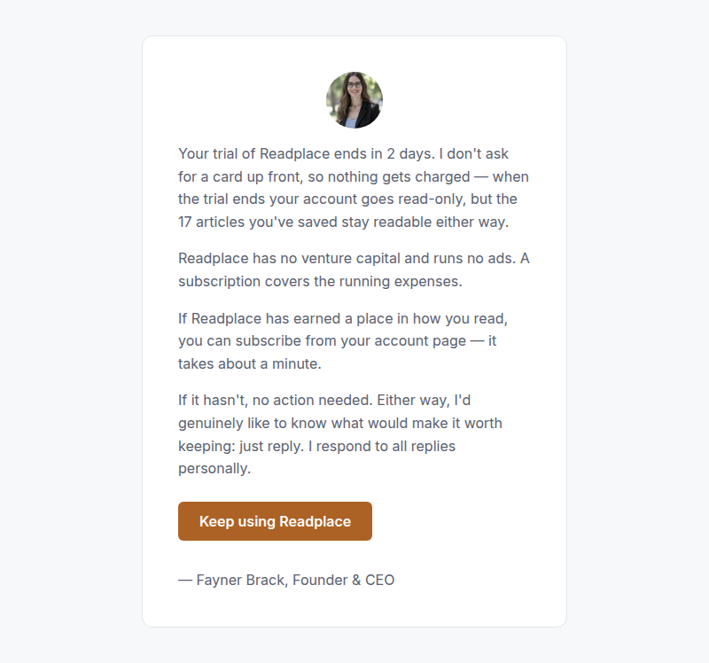</td>
<td valign="top">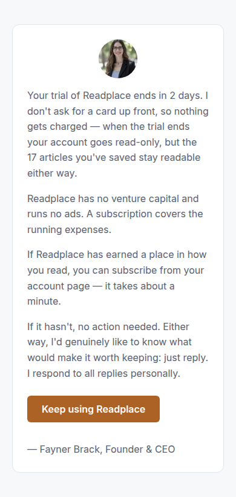</td>
</tr></table>

Exact HTML body: [`html/trial-reminder--default.html`](html/trial-reminder--default.html)

#### `one-saved-article` — A trialist with exactly 1 save. It shows the singular noun next to the plural verb: "the 1 article you've saved stay readable either way".

Subject: **your Readplace trial ends in 2 days** · To: `sam.reader@gmail.com`

<details><summary>Example inputs</summary>

```json
{
  "env": {
    "APP_ORIGIN": "https://readplace.com",
    "STATIC_BASE_URL": "https://static.readplace.com",
    "founderAvatarUrl": "https://static.readplace.com/fayner-brack.jpg"
  },
  "signup": {
    "userId": "2d7e90b4c1a64f38b5e3a8c0f6d21e57",
    "signupAt": "2026-09-23T14:05:51.237Z",
    "trialEndsAt": "2026-10-07T14:05:51.237Z",
    "trialReminderArmed": true
  },
  "reminderSchedule": {
    "Name": "trial-reminder-2d7e90b4c1a64f38b5e3a8c0f6d21e57",
    "GroupName": "hutch-trial-end-prod",
    "ScheduleExpression": "at(2026-10-05T14:05:51)",
    "Target": {
      "Arn": "arn:aws:events:ap-southeast-2:278728209435:event-bus/hutch-event-bus-4202fdd",
      "EventBridgeParameters": {
        "Source": "hutch.subscriptions",
        "DetailType": "SendTrialFeedbackEmailCommand"
      },
      "Input": "{\"userId\":\"2d7e90b4c1a64f38b5e3a8c0f6d21e57\",\"kind\":\"reminder\"}"
    }
  },
  "sqsBody": {
    "version": "0",
    "id": "7d3b1e9f-5a2c-4c8e-b6d0-1f9a3e5c7b28",
    "detail-type": "SendTrialFeedbackEmailCommand",
    "source": "hutch.subscriptions",
    "account": "278728209435",
    "time": "2026-10-05T14:05:51Z",
    "region": "ap-southeast-2",
    "resources": [
      "arn:aws:scheduler:ap-southeast-2:278728209435:schedule/hutch-trial-end-prod/trial-reminder-2d7e90b4c1a64f38b5e3a8c0f6d21e57"
    ],
    "detail": {
      "userId": "2d7e90b4c1a64f38b5e3a8c0f6d21e57",
      "kind": "reminder"
    }
  },
  "handlerNow": "2026-10-05T14:05:52.273Z",
  "subscriptionRowAtFire": {
    "userId": "2d7e90b4c1a64f38b5e3a8c0f6d21e57",
    "provider": "stripe",
    "status": "trialing",
    "trialEndsAt": "2026-10-07T14:05:51.237Z",
    "createdAt": "2026-09-23T14:05:51.237Z",
    "updatedAt": "2026-09-23T14:05:51.237Z"
  },
  "customerEmail": "sam.reader@gmail.com",
  "findArticlesByUserQuery": {
    "userId": "2d7e90b4c1a64f38b5e3a8c0f6d21e57",
    "excludeContent": true,
    "includeTotal": true
  },
  "savedArticlesTotal": 1,
  "trialReminderEmailSentAtAfter": "2026-10-05T14:05:52.273Z",
  "handlerLogs": [
    "info: [send-trial-feedback-email] reminder sent"
  ]
}
```

</details>


Exact HTML body: [`html/trial-reminder--one-saved-article.html`](html/trial-reminder--one-saved-article.html)

#### `no-saved-articles` — A trialist with no saves. The first paragraph stops at "your account goes read-only."

Subject: **your Readplace trial ends in 2 days** · To: `sam.reader@gmail.com`

<details><summary>Example inputs</summary>

```json
{
  "env": {
    "APP_ORIGIN": "https://readplace.com",
    "STATIC_BASE_URL": "https://static.readplace.com",
    "founderAvatarUrl": "https://static.readplace.com/fayner-brack.jpg"
  },
  "signup": {
    "userId": "b61f0a3d8e2c47c59d14e7a20c8f3b6e",
    "signupAt": "2026-09-23T21:17:03.958Z",
    "trialEndsAt": "2026-10-07T21:17:03.958Z",
    "trialReminderArmed": true
  },
  "reminderSchedule": {
    "Name": "trial-reminder-b61f0a3d8e2c47c59d14e7a20c8f3b6e",
    "GroupName": "hutch-trial-end-prod",
    "ScheduleExpression": "at(2026-10-05T21:17:03)",
    "Target": {
      "Arn": "arn:aws:events:ap-southeast-2:278728209435:event-bus/hutch-event-bus-4202fdd",
      "EventBridgeParameters": {
        "Source": "hutch.subscriptions",
        "DetailType": "SendTrialFeedbackEmailCommand"
      },
      "Input": "{\"userId\":\"b61f0a3d8e2c47c59d14e7a20c8f3b6e\",\"kind\":\"reminder\"}"
    }
  },
  "sqsBody": {
    "version": "0",
    "id": "a4c8e2f6-9b1d-4f3a-8c5e-7d9b1f3a5c7e",
    "detail-type": "SendTrialFeedbackEmailCommand",
    "source": "hutch.subscriptions",
    "account": "278728209435",
    "time": "2026-10-05T21:17:03Z",
    "region": "ap-southeast-2",
    "resources": [
      "arn:aws:scheduler:ap-southeast-2:278728209435:schedule/hutch-trial-end-prod/trial-reminder-b61f0a3d8e2c47c59d14e7a20c8f3b6e"
    ],
    "detail": {
      "userId": "b61f0a3d8e2c47c59d14e7a20c8f3b6e",
      "kind": "reminder"
    }
  },
  "handlerNow": "2026-10-05T21:17:04.273Z",
  "subscriptionRowAtFire": {
    "userId": "b61f0a3d8e2c47c59d14e7a20c8f3b6e",
    "provider": "stripe",
    "status": "trialing",
    "trialEndsAt": "2026-10-07T21:17:03.958Z",
    "createdAt": "2026-09-23T21:17:03.958Z",
    "updatedAt": "2026-09-23T21:17:03.958Z"
  },
  "customerEmail": "sam.reader@gmail.com",
  "findArticlesByUserQuery": {
    "userId": "b61f0a3d8e2c47c59d14e7a20c8f3b6e",
    "excludeContent": true,
    "includeTotal": true
  },
  "savedArticlesTotal": 0,
  "trialReminderEmailSentAtAfter": "2026-10-05T21:17:04.273Z",
  "handlerLogs": [
    "info: [send-trial-feedback-email] reminder sent"
  ]
}
```

</details>

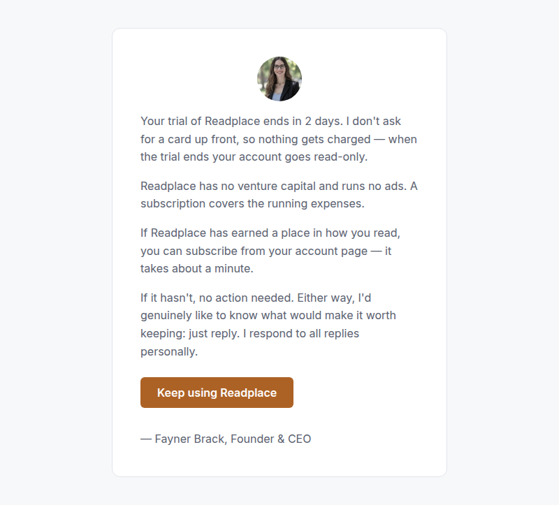

Exact HTML body: [`html/trial-reminder--no-saved-articles.html`](html/trial-reminder--no-saved-articles.html)

### Source

- `projects/hutch/src/runtime/web/auth/trial-reminder-email.ts:44` — renders the HTML and text parts; the subject constant and the save-count clause are in the same file
- `projects/hutch/src/runtime/web/auth/trial-reminder-email.template.html:1` — HTML template
- `projects/hutch/src/runtime/send-trial-feedback-email/send-trial-feedback-email-handler.ts:264` — processReminder: guards, render, send and sent marker
- `projects/hutch/src/runtime/send-trial-feedback-email.main.ts:45` — composition root: Resend behind the reserved-domain filter
- `projects/hutch/src/runtime/domain/trial/start-trial.ts:70` — startTrial: opens the trial and creates the reminder schedule
- `projects/hutch/src/runtime/providers/trial-scheduler/aws-trial-scheduler.ts:217` — creates and deletes the trial-reminder-<userId> schedule
- `projects/hutch/src/runtime/domain/stripe/stripe-trial-config.ts:15` — fire time: trial end minus 2 days
- `projects/hutch/src/infra/index.ts:1167` — queue, Lambda and event-bus subscription

## 6. Pre-charge reminder

**Trial & billing** · Readers who subscribe during their free trial with at least 48 hours 5 minutes left, so Stripe keeps the trial and charges the card when it ends, and members who undo a scheduled cancellation (Reactivate subscription on /account, before the membership ends) while Stripe still has them on trial. Members whose membership has already ended and who subscribe again are charged at once and never get it.

### When it is sent

A reader on the free trial subscribes from /account with at least 48 hours 5 minutes of trial left, so Stripe keeps the trial and first charges the card when it ends; when their browser returns from Stripe Checkout, Readplace schedules this email for 7 days before that charge, or 5 minutes later if less than 7 days 5 minutes remain. A member who undoes a scheduled cancellation (Reactivate subscription on /account) while Stripe still has them on trial gets the same schedule. When it fires, the email goes out only if the membership is still active, the charge is still ahead, and neither the trial pre-expiry reminder ('your Readplace trial ends in 2 days') nor an earlier charge reminder went out in this trial; having had the trial-ending digest does not stop it. It tells the reader the charge date, the amount and how to cancel before then, with a "Manage your subscription" button to /account.

Trigger chain:

1. A trial starts at email, Google or Apple signup and ends 14 days later to the millisecond; an admin can also set a new trial end on a row with no Stripe link `projects/hutch/src/runtime/web/auth/auth.page.ts:418`
2. The trialing reader subscribes from /account; Readplace keeps the trial end only if at least 48 hours 5 minutes remain at that moment, and the plan defaults to Yearly `projects/hutch/src/runtime/web/pages/account/account.page.ts:722`
3. Readplace creates a Stripe Checkout session with that trial end and stores a pending signup holding the trial end and plan `projects/hutch/src/runtime/web/pages/account/account.page.ts:662`
4. Stripe sends the browser back to /auth/checkout/success, which marks the membership active with the chosen plan and deletes the trial-end and trial pre-expiry reminder schedules `projects/hutch/src/runtime/web/auth/auth.page.ts:527`
5. Because the pending signup carries a trial end, the route creates the one-shot schedule charge-reminder-{userId} for max(chargeAt − 7 days, now + 5 minutes) `projects/hutch/src/runtime/web/auth/auth.page.ts:560`
6. Alternatively, a paid member reactivating a cancelled membership re-creates the same schedule when Stripe reports the subscription still on trial `projects/hutch/src/runtime/web/pages/account/account.page.ts:594`
7. At that time EventBridge Scheduler puts SendTrialFeedbackEmailCommand {userId, kind: "charge_reminder", chargeAt} on the hutch event bus, and a rule routes it through the send-trial-feedback-email queue to its Lambda `projects/hutch/src/infra/index.ts:1204`
8. The Lambda re-reads the subscription row, runs its guards, sends through Resend and then stamps trialReminderEmailSentAt `projects/hutch/src/runtime/send-trial-feedback-email/send-trial-feedback-email-handler.ts:404`

Sent only when:

- The reader is on the free trial (status trialing) when they subscribe from /account; members resubscribing after a cancellation pay at once and never get this email `projects/hutch/src/runtime/web/pages/account/account.page.ts:872`
- At least 48 hours 5 minutes of trial remain when Checkout starts; with less, Stripe charges immediately and nothing is scheduled `projects/hutch/src/runtime/domain/stripe/stripe-trial-config.ts:27`
- The reader's browser comes back from Stripe Checkout to /auth/checkout/success, because no Stripe webhook arms the reminder `projects/hutch/src/runtime/stripe-webhook-receiver.main.ts:33`
- The Checkout session is complete and counts as paid `projects/hutch/src/runtime/web/auth/auth.page.ts:502`
- The pending signup for that Checkout session is being used for the first time `projects/hutch/src/runtime/web/auth/auth.page.ts:516`
- The pending signup carries the preserved trial end `projects/hutch/src/runtime/web/auth/auth.page.ts:558`
- Or, on the reactivate path: the member is pending cancellation with a Stripe subscription, and Stripe returns that subscription still trialing with a trial end `projects/hutch/src/runtime/providers/stripe-subscriptions/stripe-subscriptions.ts:230`
- When the schedule fires, the subscription row exists and its status is still active `projects/hutch/src/runtime/send-trial-feedback-email/send-trial-feedback-email-handler.ts:366`
- The charge instant is still in the future `projects/hutch/src/runtime/send-trial-feedback-email/send-trial-feedback-email-handler.ts:373`
- Neither the trial pre-expiry reminder ('your Readplace trial ends in 2 days') nor an earlier charge reminder has gone out in this trial window (trialReminderEmailSentAt is unset); the trial-ending digest sets a different marker and does not block it `projects/hutch/src/runtime/send-trial-feedback-email/send-trial-feedback-email-handler.ts:380`
- The user has an email address on file `projects/hutch/src/runtime/send-trial-feedback-email/send-trial-feedback-email-handler.ts:388`
- The address is not on a reserved test domain `projects/hutch/src/runtime/providers/email/skip-reserved-domain.ts:31`

Not sent when:

- The reader cancels first: processing the cancellation deletes the schedule, and reactivating re-creates it `projects/hutch/src/runtime/cancel-subscription/cancel-subscription-handler.ts:68`
- The membership is no longer active when the schedule fires, for example because the cancellation has been processed `projects/hutch/src/runtime/send-trial-feedback-email/send-trial-feedback-email-handler.ts:366`
- Once per trial window: a trial pre-expiry reminder or charge reminder already sent in this trial stops it, so a member who cancels and reactivates after the notice gets no second one, and a reader who finishes Checkout after the trial pre-expiry reminder went out gets none `projects/hutch/src/runtime/send-trial-feedback-email/send-trial-feedback-email-handler.ts:380`
- The reader deletes their account: the deletion job removes the schedule and then the subscription row `projects/hutch/src/runtime/delete-account/delete-account-handler.ts:135`
- The charge instant has already passed, which happens when a member reactivates less than 5 minutes before the charge `projects/hutch/src/runtime/send-trial-feedback-email/send-trial-feedback-email-handler.ts:373`
- No email address is on file `projects/hutch/src/runtime/send-trial-feedback-email/send-trial-feedback-email-handler.ts:389`
- Recipients on example.com, example.net or example.org, or on a .test, .example, .invalid or .localhost domain, are dropped `projects/hutch/src/runtime/providers/email/skip-reserved-domain.ts:20`
- The schedule could not be created at Checkout return or reactivate: the failure is logged and never retried `projects/hutch/src/runtime/web/auth/auth.page.ts:568`
- There is no opt-out: the email reads no preference, so unsubscribing from the readlist digest does not stop it `projects/hutch/src/runtime/send-trial-feedback-email/send-trial-feedback-email-handler.ts:346`

**Timing:** Fires once at max(chargeAt − 7 days, schedule creation + 5 minutes) in UTC: chargeAt is the trial end (normally signup + 14 days, so usually signup + 7 days at the signup's time of day), and schedule creation is when the browser returns from Checkout or the member reactivates. The schedule drops fractional seconds and has no flexible window, and the email prints the charge as a UTC date with no time.

**If sending fails:** Inside the Lambda any error fails the SQS record, which is retried after the 60-second visibility timeout up to 3 receives and then moves to a DLQ whose alarm emails readplace+devops@readplace.com. Earlier failures are not retried: a schedule that cannot be created at Checkout return or reactivate is only logged, and the schedule's own delivery relies on EventBridge Scheduler's default retries with no DLQ, so that reader gets no email and no alarm fires.

<details><summary>Edge cases</summary>

- The 48h05m check runs when Checkout starts, but the 7-day lead is measured when the browser returns, and the Checkout session sets no expiry (Stripe's default is 24 hours), so the two moments can be up to a day apart `projects/hutch/src/runtime/providers/stripe-checkout/stripe-checkout.ts:57`
- A trial-preserving Checkout reports payment_status no_payment_required, which Readplace counts as paid `projects/hutch/src/runtime/providers/stripe-checkout/stripe-checkout.ts:120`
- If marking the membership active fails after the pending signup was consumed, a retry of the return URL gets 409 "already used" and no schedule is ever created, while Stripe still charges at trial end `projects/hutch/src/runtime/web/auth/auth.page.ts:516`
- Schedule creation failures, including an existing charge-reminder-{userId} schedule with the same name (AWS conflict behaviour, unverified), are logged as "Charge-reminder schedule creation failed" and the request carries on, at Checkout return `projects/hutch/src/runtime/web/auth/auth.page.ts:568` and at reactivate `projects/hutch/src/runtime/web/pages/account/account.page.ts:604`
- On reactivate, an error deleting the deferred-cancellation schedule, reversing the Stripe cancellation, marking the row active or publishing the reactivation skips schedule creation entirely `projects/hutch/src/runtime/web/pages/account/account.page.ts:632`
- On reactivate, a Stripe 404 or a subscription that is no longer trialing arms nothing `projects/hutch/src/runtime/providers/stripe-subscriptions/stripe-subscriptions.ts:218`
- On reactivate, chargeAt is Stripe's trial_end in whole seconds rather than the original millisecond trial end `projects/hutch/src/runtime/providers/stripe-subscriptions/stripe-subscriptions.ts:231`
- Cancel race: POST /account/cancel only publishes a command, the cancellation Lambda deletes the schedule later and the row turns pending_cancellation later still, so a reminder that fires in that gap goes to a reader who just cancelled `projects/hutch/src/runtime/web/pages/account/account.page.ts:515`
- Deletion race: the address lookup ignores the soft-delete flag, so a schedule that fires between the reader confirming deletion and the deletion job still sends `projects/hutch/src/runtime/providers/auth/dynamodb-auth.ts:423`
- An admin extend-trial on a row with no Stripe link sets any future trial end and clears every email marker; a later trial-preserving Checkout keeps that instant as chargeAt `projects/hutch/src/runtime/web/pages/admin/extend-trial.page.ts:169`
- Reserved-domain matching lower-cases the address and checks the exact domain or the last label only, so an address at mail.example.com is still sent `projects/hutch/src/runtime/providers/email/skip-reserved-domain.ts:18`
- A command without chargeAt is logged as a warning and skipped; the only producer always sets it `projects/hutch/src/runtime/send-trial-feedback-email/send-trial-feedback-email-handler.ts:351`
- If the row is deleted between the send and the marker write, the conditional write fails, the record is retried and the retry stops on "no subscription row" `projects/hutch/src/runtime/providers/subscription-providers/dynamodb-subscription-writes.ts:159`
- The at() expression drops milliseconds, so the schedule can fire up to 999 ms before the computed time `projects/hutch/src/runtime/providers/trial-scheduler/aws-trial-scheduler.ts:24`
- Local and dev wiring use an in-memory trial scheduler, so this email never fires outside AWS `projects/hutch/src/runtime/providers/dev-providers.ts:166`

</details>

> **Observations**
>
> - The once-per-trial marker is shared with the trial pre-expiry reminder, and the DynamoDB membership update keeps it. A reader who starts Checkout with 48h05m or more left and finishes after the 48-hour trial pre-expiry reminder went out (which happens only when no trial-ending digest went out before it) is charged with no pre-charge notice; a review probe reproduced this with the real handler `projects/hutch/src/runtime/providers/subscription-providers/dynamodb-subscription-writes.ts:84`, `projects/hutch/src/runtime/send-trial-feedback-email/send-trial-feedback-email-handler.ts:297`
> - The amount is the list price from PRICING_PLANS, but Checkout accepts promotion codes, so readers with a discount, tax or credit are told a different first charge than Stripe takes; the /account page uses the invoice amount_due for this reason `projects/hutch/src/runtime/web/auth/charge-reminder-email.ts:42`, `projects/hutch/src/runtime/providers/stripe-subscriptions/stripe-subscriptions.ts:69`
> - The charge date is a UTC calendar date with no time, so for readers west of UTC the charge can land the evening before the printed date while the copy says "Cancel any time before {chargeDate}" `projects/hutch/src/runtime/web/auth/charge-reminder-email.ts:33`
> - Only the browser's return from Checkout arms the reminder, and there is no checkout.session.completed webhook, so a reader who closes the tab after paying is charged at trial end with no notice `projects/hutch/src/runtime/stripe-webhook-receiver.main.ts:33`
> - Schedule-creation failures raise no alarm: none of the LogMetricFilters in the hutch stack (the first is at `projects/hutch/src/infra/index.ts:970`) match the log line, and the Scheduler target has no DeadLetterConfig `projects/hutch/src/runtime/providers/trial-scheduler/aws-trial-scheduler.ts:281`
> - Duplicates are possible but not observed: the send happens before the marker write, there is no Resend idempotency key, and the marker is an unconditional SET rather than a claim like automation-saves-held, so a marker-write failure after a successful send, or two overlapping deliveries, can send twice `projects/hutch/src/runtime/send-trial-feedback-email/send-trial-feedback-email-handler.ts:404`, `projects/hutch/src/runtime/providers/subscription-providers/dynamodb-subscription-writes.ts:176`
> - The reactivate path has no 48-hour floor: a member who reactivates hours before the charge gets the notice 5 minutes later, and one who reactivates under 5 minutes before gets none `projects/hutch/src/runtime/web/pages/account/account.page.ts:594`
> - The 7-day lead follows a code comment saying Visa requires at least 7 days' notice and Mastercard caps it at 7 days (network rules unverified) `projects/hutch/src/runtime/domain/stripe/stripe-trial-config.ts:61`
> - The plain-text part keeps "the button below takes you there" although plain text has no button `projects/hutch/src/runtime/web/auth/charge-reminder-email.ts:48`
> - When the reserved-domain wrapper drops a message, the handler still stamps the marker and logs "charge reminder sent" `projects/hutch/src/runtime/send-trial-feedback-email/send-trial-feedback-email-handler.ts:415`
> - The plan-unknown copy needs legacy data: current Checkout always stores a plan, but pending-signup rows never expire, so whether any production reader can still get it is unknown (unverified) `projects/hutch/src/runtime/web/pages/account/account.page.ts:724`

### Message

| Field | Value |
|---|---|
| From | `Readplace <readplace@readplace.com>` |
| To | Account email for the reader's userId, looked up in the users table at send time |
| Bcc | `readplace+charge_reminder@readplace.com` |
| Reply-To | `fayner@readplace.com` |
| Subject | your Readplace membership starts on {chargeDate} |
| Headers | none |
| Plain-text part | Yes: the three body paragraphs, a "Manage your subscription: {ctaUrl}" line and the signoff, separated by blank lines. |
| Idempotency key | none |

Content variants:

| Variant | Shown when |
|---|---|
| yearly | row.plan is yearly (the default plan). Paragraph 1: "Your free trial ends on {chargeDate}. You added a card when you subscribed, so your membership starts on its own — $60 charged to the card on file on {chargeDate}, then once a year after that." |
| monthly | row.plan is monthly. Paragraph 1 quotes "$10 charged to the card on file on {chargeDate}, then once a month after that." |
| triennial-late-card | row.plan is triennial. Paragraph 1 quotes "$108 charged to the card on file on {chargeDate}, then once every 3 years after that." The capture also shows a card added with less than 7 days 5 minutes left, which changes only when the email is sent, not its copy. |
| plan-unknown | row.plan is missing or not a recognised plan. Paragraph 1 ends "— the plan you are on is charged to the card on file on {chargeDate}, then renews automatically at the end of each billing period." with no amount. |

### Example

#### `yearly` — The most common case: a reader on the default Yearly plan subscribed with more than 7 days of trial left, so the email goes out exactly 7 days before the $60 charge.

Subject: **your Readplace membership starts on Oct 12, 2026** · To: `sam.reader@gmail.com`

<details><summary>Example inputs</summary>

```json
{
  "env": {
    "APP_ORIGIN": "https://readplace.com",
    "STATIC_BASE_URL": "https://static.readplace.com",
    "founderAvatarUrl": "https://static.readplace.com/fayner-brack.jpg"
  },
  "customerEmail": "sam.reader@gmail.com",
  "userId": "9f2c4e7a1b3d5f60718293a4b5c6d7e8",
  "plan": "yearly",
  "planOrigin": "POST /account/subscribe plan=yearly (or no plan field -> DEFAULT_BILLING_PLAN 'yearly') -> pending.plan 'yearly' -> upsertActive",
  "path": "GET /auth/checkout/success",
  "signupAt": "2026-09-28T09:14:52.318Z",
  "trialEndsAt": "2026-10-12T09:14:52.318Z",
  "checkoutStartedAt": "2026-09-30T18:39:44.120Z",
  "checkoutSuccessAt": "2026-09-30T18:41:07.902Z",
  "chargeAt": "2026-10-12T09:14:52.318Z",
  "schedule": {
    "Name": "charge-reminder-9f2c4e7a1b3d5f60718293a4b5c6d7e8",
    "GroupName": "hutch-trial-end-prod",
    "ScheduleExpression": "at(2026-10-05T09:14:52)",
    "Input": "{\"userId\":\"9f2c4e7a1b3d5f60718293a4b5c6d7e8\",\"kind\":\"charge_reminder\",\"chargeAt\":\"2026-10-12T09:14:52.318Z\"}"
  },
  "sqsBody": {
    "version": "0",
    "id": "5d1f0c3e-8a4b-4b7e-9c2a-1e6f3d9a7b40",
    "detail-type": "SendTrialFeedbackEmailCommand",
    "source": "hutch.subscriptions",
    "account": "278728209435",
    "time": "2026-10-05T09:14:52Z",
    "region": "ap-southeast-2",
    "resources": [
      "arn:aws:scheduler:ap-southeast-2:278728209435:schedule/hutch-trial-end-prod/charge-reminder-9f2c4e7a1b3d5f60718293a4b5c6d7e8"
    ],
    "detail": {
      "userId": "9f2c4e7a1b3d5f60718293a4b5c6d7e8",
      "kind": "charge_reminder",
      "chargeAt": "2026-10-12T09:14:52.318Z"
    }
  },
  "handlerNow": "2026-10-05T09:14:53.412Z",
  "subscriptionRowAtSend": {
    "status": "active",
    "subscriptionId": "sub_1SBk2xHq7Rv3LmNp0aYzQ4cD",
    "customerId": "cus_T8fKp2WqLx9vNe",
    "plan": "yearly",
    "trialReminderEmailSentAt": "(absent before send; set to handlerNow after)"
  },
  "handlerLogs": [
    {
      "level": "info",
      "message": "[send-trial-feedback-email] charge reminder sent"
    }
  ]
}
```

</details>

<table><tr><th>Desktop (800px)</th><th>Phone (390px)</th></tr><tr>
<td valign="top">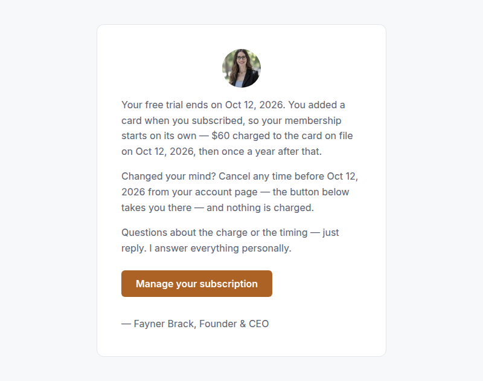</td>
<td valign="top">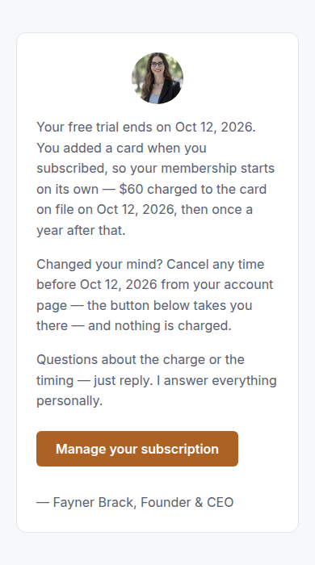</td>
</tr></table>

Exact HTML body: [`html/charge-reminder--yearly.html`](html/charge-reminder--yearly.html)

#### `monthly` — A reader who chose the Monthly plan, so the charge sentence quotes $10 and "then once a month after that".

Subject: **your Readplace membership starts on Oct 13, 2026** · To: `sam.reader@gmail.com`

<details><summary>Example inputs</summary>

```json
{
  "env": {
    "APP_ORIGIN": "https://readplace.com",
    "STATIC_BASE_URL": "https://static.readplace.com",
    "founderAvatarUrl": "https://static.readplace.com/fayner-brack.jpg"
  },
  "customerEmail": "sam.reader@gmail.com",
  "userId": "3a8e1d0c6b5f49a2e7d3c1b0f9a8e7d6",
  "plan": "monthly",
  "planOrigin": "POST /account/subscribe plan=monthly -> pending.plan 'monthly' -> upsertActive",
  "path": "GET /auth/checkout/success",
  "signupAt": "2026-09-29T21:03:11.540Z",
  "trialEndsAt": "2026-10-13T21:03:11.540Z",
  "checkoutStartedAt": "2026-10-01T07:20:58.031Z",
  "checkoutSuccessAt": "2026-10-01T07:22:45.117Z",
  "chargeAt": "2026-10-13T21:03:11.540Z",
  "schedule": {
    "Name": "charge-reminder-3a8e1d0c6b5f49a2e7d3c1b0f9a8e7d6",
    "GroupName": "hutch-trial-end-prod",
    "ScheduleExpression": "at(2026-10-06T21:03:11)",
    "Input": "{\"userId\":\"3a8e1d0c6b5f49a2e7d3c1b0f9a8e7d6\",\"kind\":\"charge_reminder\",\"chargeAt\":\"2026-10-13T21:03:11.540Z\"}"
  },
  "sqsBody": {
    "version": "0",
    "id": "5d1f0c3e-8a4b-4b7e-9c2a-1e6f3d9a7b40",
    "detail-type": "SendTrialFeedbackEmailCommand",
    "source": "hutch.subscriptions",
    "account": "278728209435",
    "time": "2026-10-06T21:03:11Z",
    "region": "ap-southeast-2",
    "resources": [
      "arn:aws:scheduler:ap-southeast-2:278728209435:schedule/hutch-trial-end-prod/charge-reminder-3a8e1d0c6b5f49a2e7d3c1b0f9a8e7d6"
    ],
    "detail": {
      "userId": "3a8e1d0c6b5f49a2e7d3c1b0f9a8e7d6",
      "kind": "charge_reminder",
      "chargeAt": "2026-10-13T21:03:11.540Z"
    }
  },
  "handlerNow": "2026-10-06T21:03:12.087Z",
  "subscriptionRowAtSend": {
    "status": "active",
    "subscriptionId": "sub_1SCN7aHq7Rv3LmNpTq2W8eRb",
    "customerId": "cus_T8xQd4ZrMh1sJb",
    "plan": "monthly",
    "trialReminderEmailSentAt": "(absent before send; set to handlerNow after)"
  },
  "handlerLogs": [
    {
      "level": "info",
      "message": "[send-trial-feedback-email] charge reminder sent"
    }
  ]
}
```

</details>

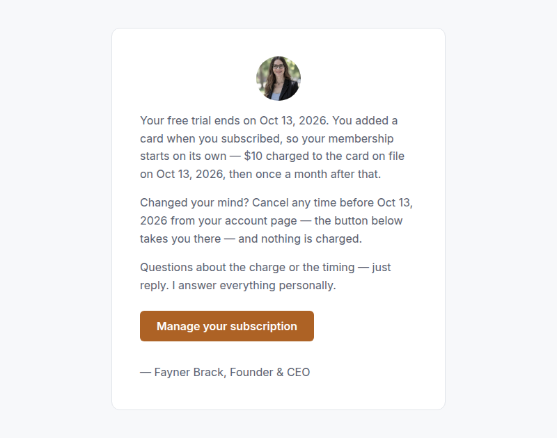

Exact HTML body: [`html/charge-reminder--monthly.html`](html/charge-reminder--monthly.html)

#### `triennial-late-card` — A reader on the Every 3 years plan ($108) who added the card with about 3 days of trial left, so the email went out 5 minutes after Checkout instead of 7 days before the charge.

Subject: **your Readplace membership starts on Oct 8, 2026** · To: `sam.reader@gmail.com`

<details><summary>Example inputs</summary>

```json
{
  "env": {
    "APP_ORIGIN": "https://readplace.com",
    "STATIC_BASE_URL": "https://static.readplace.com",
    "founderAvatarUrl": "https://static.readplace.com/fayner-brack.jpg"
  },
  "customerEmail": "sam.reader@gmail.com",
  "userId": "c41b7e92d0a3f5168e2b9c7d4a0f6e13",
  "plan": "triennial",
  "planOrigin": "POST /account/subscribe plan=triennial -> pending.plan 'triennial' -> upsertActive",
  "path": "GET /auth/checkout/success",
  "signupAt": "2026-09-24T13:47:29.004Z",
  "trialEndsAt": "2026-10-08T13:47:29.004Z",
  "checkoutStartedAt": "2026-10-05T10:00:31.276Z",
  "checkoutSuccessAt": "2026-10-05T10:02:16.733Z",
  "chargeAt": "2026-10-08T13:47:29.004Z",
  "schedule": {
    "Name": "charge-reminder-c41b7e92d0a3f5168e2b9c7d4a0f6e13",
    "GroupName": "hutch-trial-end-prod",
    "ScheduleExpression": "at(2026-10-05T10:07:16)",
    "Input": "{\"userId\":\"c41b7e92d0a3f5168e2b9c7d4a0f6e13\",\"kind\":\"charge_reminder\",\"chargeAt\":\"2026-10-08T13:47:29.004Z\"}"
  },
  "sqsBody": {
    "version": "0",
    "id": "5d1f0c3e-8a4b-4b7e-9c2a-1e6f3d9a7b40",
    "detail-type": "SendTrialFeedbackEmailCommand",
    "source": "hutch.subscriptions",
    "account": "278728209435",
    "time": "2026-10-05T10:07:16Z",
    "region": "ap-southeast-2",
    "resources": [
      "arn:aws:scheduler:ap-southeast-2:278728209435:schedule/hutch-trial-end-prod/charge-reminder-c41b7e92d0a3f5168e2b9c7d4a0f6e13"
    ],
    "detail": {
      "userId": "c41b7e92d0a3f5168e2b9c7d4a0f6e13",
      "kind": "charge_reminder",
      "chargeAt": "2026-10-08T13:47:29.004Z"
    }
  },
  "handlerNow": "2026-10-05T10:07:17.265Z",
  "subscriptionRowAtSend": {
    "status": "active",
    "subscriptionId": "sub_1SEo4LHq7Rv3LmNpKc5V1uXg",
    "customerId": "cus_TAc6Yv0nPf3kLo",
    "plan": "triennial",
    "trialReminderEmailSentAt": "(absent before send; set to handlerNow after)"
  },
  "handlerLogs": [
    {
      "level": "info",
      "message": "[send-trial-feedback-email] charge reminder sent"
    }
  ]
}
```

</details>


Exact HTML body: [`html/charge-reminder--triennial-late-card.html`](html/charge-reminder--triennial-late-card.html)

#### `plan-unknown` — A member who reactivated after cancelling and whose subscription row has no recognised plan (legacy data), so the email quotes no amount and says the plan renews at the end of each billing period.

Subject: **your Readplace membership starts on Oct 10, 2026** · To: `sam.reader@gmail.com`

<details><summary>Example inputs</summary>

```json
{
  "env": {
    "APP_ORIGIN": "https://readplace.com",
    "STATIC_BASE_URL": "https://static.readplace.com",
    "founderAvatarUrl": "https://static.readplace.com/fayner-brack.jpg"
  },
  "customerEmail": "sam.reader@gmail.com",
  "userId": "e07d5a3c9b18f4e62d0c7a5b3e9f1d84",
  "plan": "(none — row.plan undefined)",
  "planOrigin": "Legacy data: the pending-signup row consumed at checkout success had no plan attribute (or one that fails BillingPlanSchema), so pending.plan was undefined and DynamoDB upsertActive REMOVEd #plan; markPendingCancellation/markActive never touch plan. Today's startCheckout always stores a plan, so this cannot be produced by a fresh checkout.",
  "path": "POST /account/reactivate",
  "signupAt": "2026-09-26T16:22:05.871Z",
  "trialEndsAt": "2026-10-10T16:22:05.871Z",
  "checkoutStartedAt": "2026-09-27T08:10:12.455Z",
  "cancelledAt": "2026-10-01T19:45:30.002Z",
  "reactivatedAt": "2026-10-03T11:58:41.390Z",
  "chargeAt": "2026-10-10T16:22:05.000Z",
  "schedule": {
    "Name": "charge-reminder-e07d5a3c9b18f4e62d0c7a5b3e9f1d84",
    "GroupName": "hutch-trial-end-prod",
    "ScheduleExpression": "at(2026-10-03T16:22:05)",
    "Input": "{\"userId\":\"e07d5a3c9b18f4e62d0c7a5b3e9f1d84\",\"kind\":\"charge_reminder\",\"chargeAt\":\"2026-10-10T16:22:05.000Z\"}"
  },
  "sqsBody": {
    "version": "0",
    "id": "5d1f0c3e-8a4b-4b7e-9c2a-1e6f3d9a7b40",
    "detail-type": "SendTrialFeedbackEmailCommand",
    "source": "hutch.subscriptions",
    "account": "278728209435",
    "time": "2026-10-03T16:22:05Z",
    "region": "ap-southeast-2",
    "resources": [
      "arn:aws:scheduler:ap-southeast-2:278728209435:schedule/hutch-trial-end-prod/charge-reminder-e07d5a3c9b18f4e62d0c7a5b3e9f1d84"
    ],
    "detail": {
      "userId": "e07d5a3c9b18f4e62d0c7a5b3e9f1d84",
      "kind": "charge_reminder",
      "chargeAt": "2026-10-10T16:22:05.000Z"
    }
  },
  "handlerNow": "2026-10-03T16:22:06.530Z",
  "subscriptionRowAtSend": {
    "status": "active",
    "subscriptionId": "sub_1SBB9dHq7Rv3LmNp6yHs3MzA",
    "customerId": "cus_T7wRm8Ja2Kd5Tq",
    "trialReminderEmailSentAt": "(absent before send; set to handlerNow after)"
  },
  "handlerLogs": [
    {
      "level": "info",
      "message": "[send-trial-feedback-email] charge reminder sent"
    }
  ]
}
```

</details>

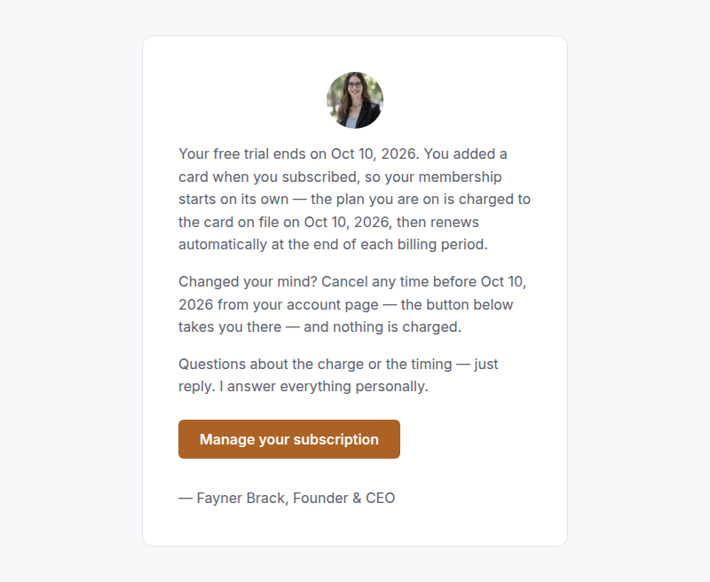

Exact HTML body: [`html/charge-reminder--plan-unknown.html`](html/charge-reminder--plan-unknown.html)

### Source

- `projects/hutch/src/runtime/web/auth/charge-reminder-email.ts:53` — renderer: subject, UTC charge date, plan sentence, plain-text part
- `projects/hutch/src/runtime/web/auth/charge-reminder-email.template.html:1` — HTML template
- `projects/hutch/src/runtime/send-trial-feedback-email/send-trial-feedback-email-handler.ts:346` — handler: processChargeReminder guards, send and marker
- `projects/hutch/src/runtime/send-trial-feedback-email.main.ts:45` — composition root: Resend wrapped by the reserved-domain skip
- `projects/hutch/src/runtime/web/auth/auth.page.ts:558` — trigger: Checkout return creates the schedule
- `projects/hutch/src/runtime/domain/stripe/stripe-trial-config.ts:71` — chargeReminderFiresAt (7-day lead, 5-minute floor)
- `projects/hutch/src/runtime/providers/trial-scheduler/aws-trial-scheduler.ts:263` — EventBridge Scheduler one-shot charge-reminder-{userId}
- `projects/hutch/src/infra/index.ts:1194` — trigger infra: queue, SQS-backed Lambda, bus subscription

## 7. Payment failed

**Trial & billing** · Paying members on a monthly, yearly or triennial plan, including members who kept their trial at checkout, whose renewal charge fails while Stripe still has another retry scheduled; people on a Readplace trial never receive it.

### When it is sent

A member's card is declined when Stripe tries to collect a membership renewal. Stripe sends Readplace an invoice.payment_failed webhook, and if Stripe still has another automatic retry scheduled and the membership is active, the email goes out within seconds asking the member to add a new card and make it primary. Every later failed attempt that still has a retry after it sends another identical copy, and the last failed attempt sends nothing.

Trigger chain:

1. Stripe fails to collect a membership renewal and POSTs invoice.payment_failed to POST /webhooks/stripe `projects/hutch/src/infra/index.ts:1062`
2. The stripe-webhook-receiver Lambda verifies the Stripe signature `projects/hutch/src/runtime/stripe-webhook-receiver/stripe-webhook-receiver-handler.ts:41`
3. It dispatches the event to the invoice.payment_failed handler `projects/hutch/src/runtime/stripe-webhook-receiver.main.ts:38`
4. The handler keeps only renewal invoices (billing_reason subscription_cycle) that have another retry scheduled `projects/hutch/src/runtime/stripe-webhook-receiver/handlers/invoice-payment-failed.ts:44`
5. It finds the member's subscription row by Stripe subscription id, requires status active, and publishes SendTrialFeedbackEmailCommand {userId, kind: payment_failed} to EventBridge `projects/hutch/src/runtime/stripe-webhook-receiver/handlers/invoice-payment-failed.ts:83`
6. An EventBridge rule routes the command to the send-trial-feedback-email-q SQS queue `projects/hutch/src/infra/index.ts:1204`
7. The send-trial-feedback-email Lambda routes kind payment_failed to processPaymentFailed, which re-checks the membership is active and loads the account email `projects/hutch/src/runtime/send-trial-feedback-email/send-trial-feedback-email-handler.ts:86`
8. It renders the email and sends it through Resend behind the reserved-domain filter `projects/hutch/src/runtime/send-trial-feedback-email/send-trial-feedback-email-handler.ts:457`

Sent only when:

- invoice.payment_failed is enabled on the Stripe Dashboard webhook endpoint for POST /webhooks/stripe, an operator setting outside the repo `src/packages/hutch-infra-components/src/stripe-events.ts:8`
- The webhook carries a valid Stripe signature timestamped within 300 seconds of receipt `projects/hutch/src/runtime/stripe-webhook-receiver/verify-stripe-signature.ts:56`
- The failed invoice is a renewal (billing_reason subscription_cycle) `projects/hutch/src/runtime/stripe-webhook-receiver/handlers/invoice-payment-failed.ts:44`
- Stripe has another automatic retry scheduled (next_payment_attempt is set) `projects/hutch/src/runtime/stripe-webhook-receiver/handlers/invoice-payment-failed.ts:53`
- The invoice belongs to a Stripe subscription `projects/hutch/src/runtime/stripe-webhook-receiver/handlers/invoice-payment-failed.ts:61`
- That Stripe subscription is the one currently recorded on the member's Readplace subscription row `projects/hutch/src/runtime/stripe-webhook-receiver/handlers/invoice-payment-failed.ts:67`
- The membership status is active when the webhook arrives `projects/hutch/src/runtime/stripe-webhook-receiver/handlers/invoice-payment-failed.ts:75`
- The membership is still active when the email Lambda runs, seconds later `projects/hutch/src/runtime/send-trial-feedback-email/send-trial-feedback-email-handler.ts:435`
- The account has an email address on file `projects/hutch/src/runtime/send-trial-feedback-email/send-trial-feedback-email-handler.ts:444`
- The address is not on a reserved test domain (example.com, example.net, example.org, or a .test, .example, .invalid or .localhost TLD) `projects/hutch/src/runtime/providers/email/skip-reserved-domain.ts:32`

Not sent when:

- People on a Readplace trial never get it: starting a trial removes the Stripe subscription id from the row, so a failed invoice finds no matching row `projects/hutch/src/runtime/providers/subscription-providers/dynamodb-subscription-writes.ts:58`
- A trial that ends with no card on file ends without any Stripe charge, so there is no failed invoice to react to `projects/hutch/src/runtime/subscription-start-request/subscription-start-request-handler.ts:51`
- A failed first charge on a new subscription (billing_reason subscription_create) or any other non-renewal invoice is skipped `projects/hutch/src/runtime/stripe-webhook-receiver/handlers/invoice-payment-failed.ts:44`
- The final failed attempt, when Stripe has no retry left, sends nothing `projects/hutch/src/runtime/stripe-webhook-receiver/handlers/invoice-payment-failed.ts:53`
- Members who scheduled cancellation (pending_cancellation) or are cancelled when the webhook arrives are skipped `projects/hutch/src/runtime/stripe-webhook-receiver/handlers/invoice-payment-failed.ts:75`
- A failed invoice on any Stripe subscription other than the one on the member's row, such as an old subscription after a resubscribe, finds no row and is skipped `projects/hutch/src/runtime/stripe-webhook-receiver/handlers/invoice-payment-failed.ts:68`
- A one-off invoice that belongs to no subscription is skipped `projects/hutch/src/runtime/stripe-webhook-receiver/handlers/invoice-payment-failed.ts:61`
- The subscription row is gone by send time: dropped `projects/hutch/src/runtime/send-trial-feedback-email/send-trial-feedback-email-handler.ts:428`
- The membership is no longer active by send time, for example Stripe already cancelled it or the member scheduled cancellation: dropped `projects/hutch/src/runtime/send-trial-feedback-email/send-trial-feedback-email-handler.ts:435`
- No email address on file for the account: dropped `projects/hutch/src/runtime/send-trial-feedback-email/send-trial-feedback-email-handler.ts:444`
- Recipients on a reserved test domain are dropped with a warning `projects/hutch/src/runtime/providers/email/skip-reserved-domain.ts:32`

**Timing:** Event-driven with no schedule: the email goes out within seconds of each qualifying invoice.payment_failed webhook, at whatever UTC time Stripe's charge attempt fails (in the capture, webhook at 2026-10-05T10:32:51Z and send 1 second later). Stripe's Smart Retries settings, not Readplace, decide when retries happen and so when later copies go out (the captured invoice's next retry was 3 days later, on 2026-10-08).

**If sending fails:** Webhook-stage errors, including a 10 s Lambda timeout, return 5xx so Stripe redelivers, and a Lambda Errors alarm emails ops; skipped events return 200 and are never redelivered. Email-stage errors are retried by SQS after 60 s, up to 3 receives, then the message moves to send-trial-feedback-email-dlq, which alarms; with no idempotency key, a retry after an ambiguous Resend failure can send a second copy.

<details><summary>Edge cases</summary>

- A missing stripe-signature header or body, a malformed or mismatched v1 HMAC, invalid JSON, or a timestamp more than 300 seconds from the Lambda clock in either direction returns 400 and queues nothing `projects/hutch/src/runtime/stripe-webhook-receiver/stripe-webhook-receiver-handler.ts:48`
- The handler reads the subscription id from either the older top-level `subscription` field or the newer `parent.subscription_details.subscription`, so a webhook API version change on the Stripe endpoint still works `projects/hutch/src/runtime/stripe-webhook-receiver/handlers/invoice-payment-failed.ts:60`
- An invoice whose subscription arrives as an expanded object fails the payload parse and is skipped with a warning `projects/hutch/src/runtime/stripe-webhook-receiver/handlers/invoice-payment-failed.ts:34`
- Every skipped webhook still returns 200, so Stripe never redelivers it `projects/hutch/src/runtime/stripe-webhook-receiver/stripe-webhook-receiver-handler.ts:59`
- A webhook Lambda timeout (10 s) after EventBridge already accepted the command returns 5xx; Stripe redelivers and the member gets a second copy `src/packages/hutch-infra-components/src/infra/hutch-stripe-webhook-receiver.ts:55`
- The send-time re-check reads the row by user and checks only that it is active, not that it is still on the failing Stripe subscription; a member whose row moved to a new subscription between webhook and send still gets the email `projects/hutch/src/runtime/send-trial-feedback-email/send-trial-feedback-email-handler.ts:435`
- The recipient lookup reads the users table userId-index with Limit 1; Gmail canonical-claim items carry ownerUserId instead of userId, so they never stand in for the real address `projects/hutch/src/runtime/providers/auth/dynamodb-auth.ts:84`
- Reserved-domain matching is exact and case-insensitive on the whole domain or the TLD, so an address like user@mail.example.com is not matched and is sent `projects/hutch/src/runtime/providers/email/skip-reserved-domain.ts:20`
- Members who kept their trial at checkout have their row written active at checkout `projects/hutch/src/runtime/web/auth/auth.page.ts:527`; their first post-trial charge qualifies only because Stripe labels it subscription_cycle (Stripe behaviour, unverified in code)
- Legacy trial rows that still carry a customerId are charged at trial end with payment_behavior allow_incomplete `projects/hutch/src/runtime/subscription-start-request/subscription-start-request-handler.ts:61`; a declined first charge can still leave the membership active, but its invoice is subscription_create, so no email goes out (Stripe behaviour, unverified)
- Members who reactivate a scheduled cancellation on the account page are set back to active and qualify again `projects/hutch/src/runtime/web/pages/account/account.page.ts:589`
- Staging runs the same code and the same From, Reply-To and BCC addresses; only the avatar and CTA hosts change to static.readplace-staging.com and readplace-staging.com `projects/hutch/Pulumi.staging.yaml:9`
- The only wiring in any environment is Resend wrapped in the reserved-domain filter; there is no local log-only path `projects/hutch/src/runtime/send-trial-feedback-email.main.ts:45`
- The CTA href is Handlebars-escaped in the HTML (`=` as `&#x3D;`, `&` as `&amp;`); mail clients decode it to the plain URL `projects/hutch/src/runtime/web/auth/payment-failed-email.template.html:36`

</details>

> **Observations**
>
> - No dedup: there is no idempotency key or sent marker, so a member gets an identical copy for every qualifying failed attempt (the first failure, each non-final Stripe retry, any manual Dashboard or API retry) plus any duplicate Stripe delivery or SQS retry after an ambiguous Resend failure; the test names per-attempt sending as deliberate `projects/hutch/src/runtime/send-trial-feedback-email/send-trial-feedback-email-handler.test.ts:893`
> - The copy promises "If every retry fails, the subscription cancels and your account goes read-only" `projects/hutch/src/runtime/web/auth/payment-failed-email.ts:27`; that holds only if Stripe's 'after all retries fail' setting cancels the subscription (Dashboard setting, unverified), because Readplace ends the membership only on customer.subscription.deleted `projects/hutch/src/runtime/stripe-webhook-receiver/handlers/customer-subscription-deleted.ts:48`
> - If Stripe automatic retries are turned off, next_payment_attempt is empty on the first failure and no member ever gets this email (Stripe behaviour, unverified) `projects/hutch/src/runtime/stripe-webhook-receiver/handlers/invoice-payment-failed.ts:53`
> - A logged-out reader who clicks 'Update your card' is sent to /login with no return URL and lands on /queue after signing in, not on the account page, and the utm parameters are lost `projects/hutch/src/runtime/server.ts:514`
> - A just-deleted account can still get the email: the email lookup does not skip soft-deleted users, so a webhook that lands between POST /account/delete and the async delete job (which deletes the Stripe customer and the subscription row) still sends `projects/hutch/src/runtime/providers/auth/dynamodb-auth.ts:423`
> - There is no opt-out, unsubscribe header, email-verification or account-lock check at either stage, so every member who meets the conditions gets it `projects/hutch/src/runtime/send-trial-feedback-email/send-trial-feedback-email-handler.ts:423`
> - When the reserved-domain filter drops a recipient, the handler still logs 'payment-failed email sent' `projects/hutch/src/runtime/send-trial-feedback-email/send-trial-feedback-email-handler.ts:467`
> - A permanent Resend 4xx rejection is retried like a 5xx, up to 3 receives, then lands in the DLQ and alarms `projects/hutch/src/runtime/send-trial-feedback-email/send-trial-feedback-email-handler.ts:104`
> - The email shows no amount, plan or retry date because the builder takes only the avatar and CTA URLs `projects/hutch/src/runtime/web/auth/payment-failed-email.ts:15`; the test asserts only that no dollar amount appears `projects/hutch/src/runtime/web/auth/payment-failed-email.test.ts:30`
> - Several behaviours live in the Stripe Dashboard, outside the repo: enabling invoice.payment_failed on the webhook endpoint, the Smart Retries schedule that sets how many copies a member gets, and whether Stripe also sends its own failed-payment email (unverified) `src/packages/hutch-infra-components/src/stripe-events.ts:8`
> - The 'Make primary' action the copy tells members to use exists on the account page's saved-card list `projects/hutch/src/runtime/web/pages/account/account.view-model.ts:314`

### Message

| Field | Value |
|---|---|
| From | `Readplace <readplace@readplace.com>` |
| To | The Readplace account email of the member who owns the failing subscription, read from the users table (not Stripe's customer_email) |
| Bcc | `readplace+payment_failed@readplace.com` |
| Reply-To | `fayner@readplace.com` |
| Subject | your Readplace payment didn't go through |
| Headers | none |
| Plain-text part | Yes: the same three paragraphs, then "Update your card: {ctaUrl}" and the signoff, separated by blank lines. |
| Idempotency key | none |

Content variants:

| Variant | Shown when |
|---|---|
| default | Every send: the body has no conditional content, and its only inputs are the avatar URL and the CTA URL, both fixed per environment, so only the recipient changes `projects/hutch/src/runtime/web/auth/payment-failed-email.ts:15` |

### Example

#### `default` — A yearly member's first failed renewal attempt on 2026-10-05, with Stripe's next retry scheduled for 2026-10-08, rendered with production URLs; every send looks exactly like this apart from the recipient.

Subject: **your Readplace payment didn't go through** · To: `sam.reader@gmail.com`

<details><summary>Example inputs</summary>

```json
{
  "env": {
    "APP_ORIGIN": "https://readplace.com",
    "STATIC_BASE_URL": "https://static.readplace.com",
    "founderAvatarUrl": "https://static.readplace.com/fayner-brack.jpg"
  },
  "stripeWebhook": {
    "route": "POST /webhooks/stripe",
    "event": {
      "id": "evt_1SFq2kLx9cR3mT7aB4nW8pQe",
      "object": "event",
      "api_version": "2026-04-22.dahlia",
      "created": 1791196367,
      "livemode": true,
      "pending_webhooks": 1,
      "request": {
        "id": null,
        "idempotency_key": null
      },
      "type": "invoice.payment_failed",
      "data": {
        "object": {
          "id": "in_1SFq2hLx9cR3mT7aK2dV5sYr",
          "object": "invoice",
          "account_country": "AU",
          "amount_due": 6000,
          "amount_paid": 0,
          "amount_remaining": 6000,
          "attempt_count": 1,
          "attempted": true,
          "auto_advance": true,
          "billing_reason": "subscription_cycle",
          "collection_method": "charge_automatically",
          "currency": "usd",
          "customer": "cus_R8sV2mK4pQ7nXa",
          "customer_email": "sam.reader@gmail.com",
          "next_payment_attempt": 1791455567,
          "number": "8F3C21A7-0002",
          "parent": {
            "type": "subscription_details",
            "quote_details": null,
            "subscription_details": {
              "metadata": {},
              "subscription": "sub_1QF7ZtLx9cR3mT7aY2hN4kPd"
            }
          },
          "period_start": 1759656704,
          "period_end": 1791192704,
          "status": "open",
          "total": 6000
        }
      }
    },
    "stripeSignatureHeader": "t=1791196371,v1=e0662c12788fde24e4c75f7d6c8b4c0ae595695cb48f9d5de8845df22246b5b8"
  },
  "subscriptionRow": {
    "userId": "9f2c4e7a1b3d4c8e9a0f6b2d5c7e1a34",
    "provider": "stripe",
    "subscriptionId": "sub_1QF7ZtLx9cR3mT7aY2hN4kPd",
    "customerId": "cus_R8sV2mK4pQ7nXa",
    "status": "active",
    "plan": "yearly",
    "createdAt": "2025-10-05T09:31:44.000Z",
    "updatedAt": "2025-10-05T09:31:44.000Z"
  },
  "userRow": {
    "userId": "9f2c4e7a1b3d4c8e9a0f6b2d5c7e1a34",
    "email": "sam.reader@gmail.com"
  },
  "eventBridgePutEventsEntry": {
    "Source": "hutch.subscriptions",
    "DetailType": "SendTrialFeedbackEmailCommand",
    "Detail": "{\"userId\":\"9f2c4e7a1b3d4c8e9a0f6b2d5c7e1a34\",\"kind\":\"payment_failed\"}",
    "EventBusName": "hutch-event-bus-4202fdd"
  },
  "sqsMessageBody": {
    "version": "0",
    "id": "6a1f0c3e-2b7d-4e9a-8c5f-0d1e2f3a4b5c",
    "detail-type": "SendTrialFeedbackEmailCommand",
    "source": "hutch.subscriptions",
    "account": "278728209435",
    "time": "2026-10-05T10:32:51Z",
    "region": "ap-southeast-2",
    "resources": [],
    "detail": {
      "userId": "9f2c4e7a1b3d4c8e9a0f6b2d5c7e1a34",
      "kind": "payment_failed"
    }
  },
  "clock": {
    "webhookReceivedAt": "2026-10-05T10:32:51.000Z",
    "emailLambdaNow": "2026-10-05T10:32:52.000Z"
  },
  "pipelineLog": [
    "INFO [stripe-webhook] dispatched payment-failed email command {\"userId\":\"9f2c4e7a1b3d4c8e9a0f6b2d5c7e1a34\",\"invoiceId\":\"in_1SFq2hLx9cR3mT7aK2dV5sYr\",\"subscriptionId\":\"sub_1QF7ZtLx9cR3mT7aY2hN4kPd\"}",
    "INFO [send-trial-feedback-email] payment-failed email sent {\"userId\":\"9f2c4e7a1b3d4c8e9a0f6b2d5c7e1a34\"}"
  ]
}
```

</details>

<table><tr><th>Desktop (800px)</th><th>Phone (390px)</th></tr><tr>
<td valign="top">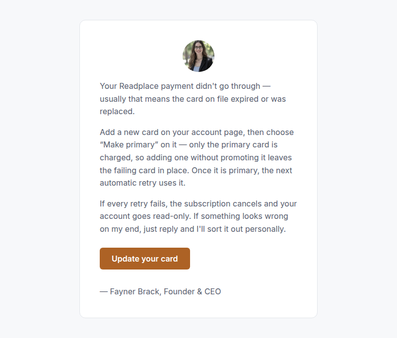</td>
<td valign="top">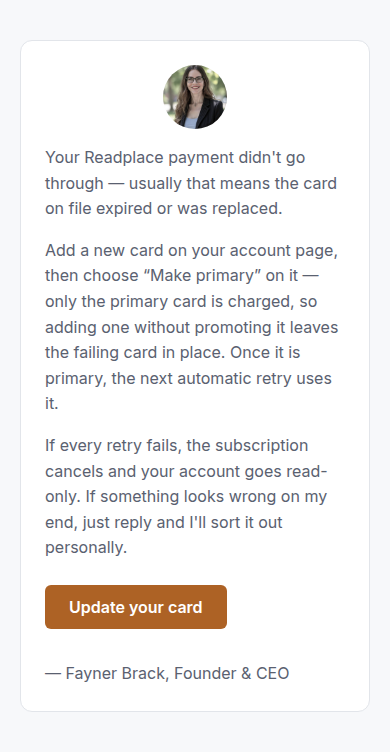</td>
</tr></table>

Exact HTML body: [`html/payment-failed--default.html`](html/payment-failed--default.html)

### Source

- `projects/hutch/src/runtime/web/auth/payment-failed-email.ts:30` — renderer for HTML and plain text; subject constant and paragraphs live in the same file
- `projects/hutch/src/runtime/web/auth/payment-failed-email.template.html:1` — HTML template: avatar, three paragraphs, 'Update your card' button, signoff
- `projects/hutch/src/runtime/send-trial-feedback-email/send-trial-feedback-email-handler.ts:423` — sender: send-time re-checks and the sendEmail call with from, bcc and reply-to
- `projects/hutch/src/runtime/stripe-webhook-receiver/handlers/invoice-payment-failed.ts:29` — webhook handler: invoice guards and command publish
- `projects/hutch/src/runtime/stripe-webhook-receiver.main.ts:38` — webhook composition root wiring invoice.payment_failed
- `projects/hutch/src/runtime/send-trial-feedback-email.main.ts:45` — email composition root: Resend wrapped in the reserved-domain filter
- `projects/hutch/src/infra/index.ts:1059` — webhook infra: POST /webhooks/stripe route and receiver Lambda
- `projects/hutch/src/infra/index.ts:1204` — EventBridge rule routing the command to send-trial-feedback-email-q

## 8. Trial feedback request

**Trial & billing** · Readers who signed up after the founding-member spots were gone and whose 14-day trial ended without a membership, almost always because it ran out with no card on file; founding members never receive it.

### When it is sent

A reader who signs up after the founding-member spots are gone gets a 14-day trial. When the trial ends without a membership, usually because it ran out with no card on file, Readplace makes the cancellation final 1 hour after the trial end date and schedules this founder-signed email for 3 days later. A trialist can also cancel early with a direct POST to /account/cancel, because the account page shows trialists no Cancel button, and the email still waits until 1 hour plus 3 days after the trial end date. When the schedule fires, the email goes out only if the subscription is still cancelled and this email has not already gone out for that trial.

Trigger chain:

1. Email, Google or Apple signup, once the founding allocation is used up, starts a 14-day trial and arms a trial-end schedule at trialEndsAt `projects/hutch/src/runtime/web/auth/auth.page.ts:415`
2. At trialEndsAt the trial-end schedule finds no card on file and publishes SubscriptionChargeFailed with reason no_card_on_file `projects/hutch/src/runtime/subscription-start-request/subscription-start-request-handler.ts:51`
3. The charge-failed handler publishes CancelSubscriptionCommand with reason trial_expired_no_card `projects/hutch/src/runtime/subscription-charge-failed/subscription-charge-failed-handler.ts:43`
4. Alternatively, a trialist's direct POST /account/cancel publishes CancelSubscriptionCommand with no reason `projects/hutch/src/runtime/web/pages/account/account.page.ts:515`
5. The trialing branch deletes the trial-end and trial-reminder schedules, arms a deferred cancellation at trialEndsAt + 1 hour and moves the row to pending_cancellation `projects/hutch/src/runtime/cancel-subscription/cancel-subscription-handler.ts:95`
6. At trialEndsAt + 1 hour the deferred cancellation publishes SubscriptionCancelled with reason trial_expired_no_card, or user_initiated_trial when the command carried no reason `projects/hutch/src/runtime/cancel-subscription/cancel-subscription-handler.ts:118`
7. The subscription-events Lambda marks the row cancelled and, independently, creates the one-shot trial-feedback-<userId> schedule for now + 3 days `projects/hutch/src/runtime/schedule-trial-feedback-email/schedule-trial-feedback-email-handler.ts:60`
8. The schedule puts SendTrialFeedbackEmailCommand {userId} on the event bus; the send-trial-feedback-email Lambda re-checks the row, counts saved articles, sends through Resend, then stamps trialFeedbackEmailSentAt `projects/hutch/src/runtime/send-trial-feedback-email/send-trial-feedback-email-handler.ts:160`

Sent only when:

- The account was created after the founding allocation filled up (50 accounts in prod), so signup opened a trial instead of a founding membership `projects/hutch/src/runtime/web/auth/auth.page.ts:372`
- The trial was cancelled with a trial reason: trial_expired_no_card (trial ran out with no card) or user_initiated_trial (trialist cancelled); trial_expired_charge_failed is also accepted but cannot occur today `projects/hutch/src/runtime/schedule-trial-feedback-email/schedule-trial-feedback-email-handler.ts:44`
- The trial-feedback-<userId> schedule was created and still exists when it fires 3 days later `projects/hutch/src/runtime/schedule-trial-feedback-email/schedule-trial-feedback-email-handler.ts:60`
- A subscription row still exists for the user `projects/hutch/src/runtime/send-trial-feedback-email/send-trial-feedback-email-handler.ts:117`
- The row's status is still cancelled when the schedule fires; the cancel reason and trial origin are not re-checked `projects/hutch/src/runtime/send-trial-feedback-email/send-trial-feedback-email-handler.ts:124`
- This email has not already gone out for the current trial (trialFeedbackEmailSentAt is unset) `projects/hutch/src/runtime/send-trial-feedback-email/send-trial-feedback-email-handler.ts:131`
- An email address is on file for the user `projects/hutch/src/runtime/send-trial-feedback-email/send-trial-feedback-email-handler.ts:140`
- The saved-article count query returns a total; without one the record fails and is retried `projects/hutch/src/runtime/send-trial-feedback-email/send-trial-feedback-email-handler.ts:153`
- The recipient is not on a reserved test domain (example.com, example.net, example.org, or a .test, .example, .invalid or .localhost address) `projects/hutch/src/runtime/providers/email/skip-reserved-domain.ts:32`

Not sent when:

- Once per trial: if trialFeedbackEmailSentAt is set on the row, the send is skipped `projects/hutch/src/runtime/send-trial-feedback-email/send-trial-feedback-email-handler.ts:131`
- Only opening a new trial window clears that marker, so a reader can get the email again only after a later trial (for example an admin extension) ends; starting a membership does not clear it `projects/hutch/src/runtime/providers/subscription-providers/dynamodb-subscription-writes.ts:58`
- Members who cancel a paid membership, and Stripe-side cancellations (payment failure, dashboard), get no schedule because their reasons are not trial reasons `projects/hutch/src/runtime/schedule-trial-feedback-email/schedule-trial-feedback-email-handler.ts:44`
- A reader who starts a membership through checkout within the 3 days has an active row, so the send is skipped `projects/hutch/src/runtime/send-trial-feedback-email/send-trial-feedback-email-handler.ts:124`
- An admin extending a cancelled ex-trialist's trial deletes the pending trial-feedback schedule and puts the row back to trialing `projects/hutch/src/runtime/domain/trial/start-trial.ts:100`
- A trialist who cancelled early and clicks Reactivate before the trial end date never reaches a final cancellation, so no schedule is created `projects/hutch/src/runtime/web/pages/account/account.page.ts:622`
- Deleting the account removes the trial-feedback schedule during the asynchronous deletion scrub `projects/hutch/src/runtime/delete-account/delete-account-handler.ts:133`
- No subscription row at send time, for example after account deletion, skips the send `projects/hutch/src/runtime/send-trial-feedback-email/send-trial-feedback-email-handler.ts:117`
- No email address on file skips the send `projects/hutch/src/runtime/send-trial-feedback-email/send-trial-feedback-email-handler.ts:140`
- A reserved test-domain recipient is dropped with a warning log, and the sent marker is still stamped `projects/hutch/src/runtime/providers/email/skip-reserved-domain.ts:33`

**Timing:** The one-shot schedule fires exactly 3 days (259,200,000 ms) after the subscription-events Lambda processes SubscriptionCancelled, as an EventBridge Scheduler at() in UTC to the whole second with no flexible window `projects/hutch/src/runtime/schedule-trial-feedback-email/schedule-trial-feedback-email-handler.ts:19`. For both trial paths that is normally trialEndsAt + 1 hour + 3 days, which for an unextended 14-day trial is signup + 17 days 1 hour (captured: signup 2026-09-18T14:22:08Z, cancellation final 2026-10-02T15:22:09Z, sent 2026-10-05T15:22:10Z).

**If sending fails:** Each record runs in its own try/catch; a Resend, DynamoDB or missing-total error fails only that record, which SQS retries after the 60-second visibility timeout up to 3 receives before moving it to the queue's DLQ, whose CloudWatch alarm emails readplace+devops@readplace.com in prod `projects/hutch/src/runtime/send-trial-feedback-email/send-trial-feedback-email-handler.ts:99`. The email is sent before the trialFeedbackEmailSentAt marker is written and without an idempotency key, so a failure between the two steps sends a second copy on retry.

<details><summary>Edge cases</summary>

- The saved-article count is taken at send time, 3 days after the cancellation, over the reader's whole library (read and unread) with a paginated COUNT, and prints without a thousands separator, e.g. "saved 1500 articles" `projects/hutch/src/runtime/web/auth/trial-feedback-email.ts:32`, `src/packages/article-store/src/dynamodb-saved-article-store.ts:507`
- The cancel reason never changes the content; every trial reason produces the same email `projects/hutch/src/runtime/web/auth/trial-feedback-email.ts:46`
- The recipient is the address stored at signup, lowercased and trimmed with plus-tags kept `projects/hutch/src/runtime/providers/auth/dynamodb-auth.ts:200`; Gmail uniqueness-claim rows carry ownerUserId instead of userId, so the userId-index lookup never returns a claim key `projects/hutch/src/runtime/providers/auth/dynamodb-auth.ts:84`
- The address is not checked for verification before sending `projects/hutch/src/runtime/providers/auth/dynamodb-auth.ts:423`
- Staging deploys the same Lambda with its own Resend wiring and a founding allocation of 5 accounts, so staging trial accounts receive this email too `projects/hutch/Pulumi.staging.yaml:80` (prod is 50 at `projects/hutch/Pulumi.prod.yaml:87`)
- Local dev never sends it: the handler is wired only in the Lambda composition root, and dev uses an in-memory trial scheduler that records schedules but never fires them `projects/hutch/src/runtime/providers/dev-providers.ts:166`
- The command must carry no kind; kind "feedback" is accepted for backward compatibility but no producer emits it, and every other kind selects a different email from the same Lambda `projects/hutch/src/runtime/send-trial-feedback-email/send-trial-feedback-email-handler.ts:97`, `src/packages/hutch-infra-components/src/events.ts:836`
- Any CancelSubscriptionCommand processed while the row is pending_cancellation makes the cancellation final at once: a second POST /account/cancel, a duplicate delivery of the trial_expired_no_card command, or a retry after a cancel-<userId> name conflict; the email then goes out 3 days after that instead of at trialEndsAt + 1 hour + 3 days `projects/hutch/src/runtime/cancel-subscription/cancel-subscription-handler.ts:109`
- A redelivered SubscriptionCancelled deletes and recreates the schedule, which pushes the send time later `projects/hutch/src/runtime/schedule-trial-feedback-email/schedule-trial-feedback-email-handler.ts:59`
- Both SubscriptionCancelled handlers receive the record independently, so the schedule is created even if marking the row cancelled fails; if the mark never succeeds, the status guard skips the send `projects/hutch/src/runtime/handle-by-detail-type.ts:39`
- If the trial-end schedule fails to arm at signup, the error is only logged and the trial goes read-only at its end date without any cancellation, so no email follows unless the trialist cancels early `projects/hutch/src/runtime/domain/trial/start-trial.ts:80`
- A reader whose trial lapsed cannot start a membership between trialEndsAt and trialEndsAt + 1 hour, because /account/subscribe does nothing while the row is pending_cancellation `projects/hutch/src/runtime/web/pages/account/account.page.ts:883`
- Reactivate only runs on a pending_cancellation row, so it can never remove a live trial-feedback schedule, which exists only once the row is cancelled `projects/hutch/src/runtime/web/pages/account/account.page.ts:570`
- If the row is deleted right after the send, the marker write fails its attribute_exists(userId) condition and the retry hits the no-row guard, so no duplicate goes out in that case `projects/hutch/src/runtime/providers/subscription-providers/dynamodb-subscription-writes.ts:147`

</details>

> **Observations**
>
> - A stale schedule can email a churned paying member: checkout success deletes only the trial-end and trial-reminder schedules `projects/hutch/src/runtime/web/auth/auth.page.ts:550`, and the send step checks only status === cancelled `projects/hutch/src/runtime/send-trial-feedback-email/send-trial-feedback-email-handler.ts:124`, so a cancelled trialist who starts a membership within the 3 days and is cancelled again (for example Stripe-side) before the schedule fires gets this trial email.
> - Duplicate risk: the send happens before the marker write with no idempotency key `projects/hutch/src/runtime/send-trial-feedback-email/send-trial-feedback-email-handler.ts:160`, while the automation-saves-held email in the same file claims its marker first `projects/hutch/src/runtime/send-trial-feedback-email/send-trial-feedback-email-handler.ts:219`.
> - A reader who deleted their account can still get it: findEmailByUserId ignores the deletedAt soft-delete marker `projects/hutch/src/runtime/providers/auth/dynamodb-auth.ts:423`, so a schedule that fires between POST /account/delete `projects/hutch/src/runtime/web/pages/account/account.page.ts:550` and the scrub removing it `projects/hutch/src/runtime/delete-account/delete-account-handler.ts:133`, or after the scrub lands in the DLQ, still sends.
> - Trialists see only Subscribe on the account page, never Cancel `projects/hutch/src/runtime/web/pages/account/account.view-model.ts:505`, so nearly every recipient's trial simply ran out, yet the copy says they "decided not to continue" `projects/hutch/src/runtime/web/auth/trial-feedback-email.ts:37`.
> - trial_expired_charge_failed is in the accepted reasons but cannot occur: upsertTrialing removes customerId and only upsertActive, which sets status active, writes it, so a trialing row always takes the no-card branch `projects/hutch/src/runtime/providers/subscription-providers/dynamodb-subscription-writes.ts:58`.
> - The HTML <title> differs from the subject and has typos: "Hii Fayner here! So you tried Readplace.. what was missing?" `projects/hutch/src/runtime/web/auth/trial-feedback-email.template.html:6`.
> - There is no unsubscribe link, no List-Unsubscribe header and no opt-out check `projects/hutch/src/runtime/send-trial-feedback-email/send-trial-feedback-email-handler.ts:160`; whether that is intended for a one-time founder email is (unverified).
> - The status-guard log line says "user reactivated during delay window", but reactivation cannot happen once the row is cancelled; the real causes are a checkout membership or an admin trial extension `projects/hutch/src/runtime/send-trial-feedback-email/send-trial-feedback-email-handler.ts:126`.
> - Copy defect: the closing paragraph joins two sentences with a comma and sets "ALL" in capitals ("I respond to ALL replies personally, this is my promise 🤝 :D"), although the brand guidelines rule out all-caps in body text `projects/hutch/src/runtime/web/auth/trial-feedback-email.ts:39`.

### Message

| Field | Value |
|---|---|
| From | `Readplace <readplace@readplace.com>` |
| To | The account's login email, looked up by userId in the users table |
| Bcc | `readplace+trial_feedback@readplace.com` |
| Reply-To | `fayner@readplace.com` |
| Subject | you tried Readplace — what was missing? |
| Headers | none |
| Plain-text part | Yes: the same three paragraphs and sign-off as plain text, separated by blank lines. |
| Idempotency key | none |

Content variants:

| Variant | Shown when |
|---|---|
| default | The reader has 2 or more saved articles at send time, so the first sentence reads "You started a trial of Readplace, saved N articles, and decided not to continue." with no thousands separator. |
| one-article | The reader has exactly 1 saved article at send time, so the clause reads "saved 1 article". |
| no-articles | The reader has 0 saved articles at send time, so the first sentence reads "You started a trial of Readplace and decided not to continue." |

### Example

#### `default` — A reader whose trial ran out with no card on file and who had saved 23 articles, so the first sentence reads "saved 23 articles".

Subject: **you tried Readplace — what was missing?** · To: `sam.reader@gmail.com`

<details><summary>Example inputs</summary>

```json
{
  "sqsBody": {
    "version": "0",
    "id": "5f1c2d8e-0008-4b7a-9c3e-1a2b3c4d5e6f",
    "detail-type": "SendTrialFeedbackEmailCommand",
    "source": "hutch.subscriptions",
    "account": "278728209435",
    "time": "2026-10-05T15:22:10Z",
    "region": "ap-southeast-2",
    "resources": [
      "arn:aws:scheduler:ap-southeast-2:278728209435:schedule/hutch-trial-end-prod/trial-feedback-a3f1c9e27b5d4086b2e4f71c0d9a8e35"
    ],
    "detail": {
      "userId": "a3f1c9e27b5d4086b2e4f71c0d9a8e35"
    }
  },
  "commandDetail": {
    "userId": "a3f1c9e27b5d4086b2e4f71c0d9a8e35"
  },
  "cancelReason": "trial_expired_no_card",
  "subscriptionRowAtSend": {
    "userId": "a3f1c9e27b5d4086b2e4f71c0d9a8e35",
    "provider": "stripe",
    "status": "cancelled",
    "createdAt": "2026-09-18T14:22:08.512Z",
    "updatedAt": "2026-10-02T15:22:09.530Z",
    "trialReminderEmailSentAt": "2026-09-30T14:22:09.350Z"
  },
  "findEmailByUserId": "sam.reader@gmail.com",
  "savedArticlesTotal": 23,
  "findArticlesByUserQuery": {
    "userId": "a3f1c9e27b5d4086b2e4f71c0d9a8e35",
    "excludeContent": true,
    "includeTotal": true
  },
  "founderAvatarUrl": "https://static.readplace.com/fayner-brack.jpg",
  "env": {
    "STATIC_BASE_URL": "https://static.readplace.com",
    "APP_ORIGIN": "https://readplace.com"
  },
  "signupPrecondition": "signed up after the founding allocation was exhausted (users >= FOUNDING_MEMBER_LIMIT = 50 in prod, Pulumi.prod.yaml), so signup opened a 14-day trial instead of a founding membership",
  "timeline": [
    "2026-09-18T14:22:08.512Z signup -> trialing, trialEndsAt=2026-10-02T14:22:08.512Z, trial-end schedule 2026-10-02T14:22:08.512Z",
    "2026-09-30T14:22:09.350Z trial-reminder schedule fired -> SendTrialFeedbackEmailCommand {userId,kind:\"reminder\"} (separate email, not this one)",
    "2026-10-02T14:22:09.420Z trial-end schedule fired -> SubscriptionStartRequestCommand",
    "2026-10-02T14:22:09.570Z subscription-events <- SubscriptionChargeFailed {\"userId\":\"a3f1c9e27b5d4086b2e4f71c0d9a8e35\",\"reason\":\"no_card_on_file\"}",
    "2026-10-02T14:22:09.720Z subscription-events <- CancelSubscriptionCommand {\"userId\":\"a3f1c9e27b5d4086b2e4f71c0d9a8e35\",\"reason\":\"trial_expired_no_card\"}",
    "2026-10-02T14:22:09.870Z subscription-events <- SubscriptionCancellationScheduled {\"userId\":\"a3f1c9e27b5d4086b2e4f71c0d9a8e35\",\"cancellationEffectiveAt\":\"2026-10-02T14:22:08.512Z\"}",
    "2026-10-02T15:22:09.380Z deferred-cancellation schedule fired -> CancelSubscriptionCommand {\"userId\":\"a3f1c9e27b5d4086b2e4f71c0d9a8e35\",\"reason\":\"trial_expired_no_card\"}",
    "2026-10-02T15:22:09.530Z subscription-events <- SubscriptionCancelled {\"userId\":\"a3f1c9e27b5d4086b2e4f71c0d9a8e35\",\"reason\":\"trial_expired_no_card\"}",
    "2026-10-05T15:22:10.510Z trial-feedback schedule fired -> SendTrialFeedbackEmailCommand {\"userId\":\"a3f1c9e27b5d4086b2e4f71c0d9a8e35\"}"
  ],
  "sentAt": "2026-10-05T15:22:10.510Z"
}
```

</details>

<table><tr><th>Desktop (800px)</th><th>Phone (390px)</th></tr><tr>
<td valign="top">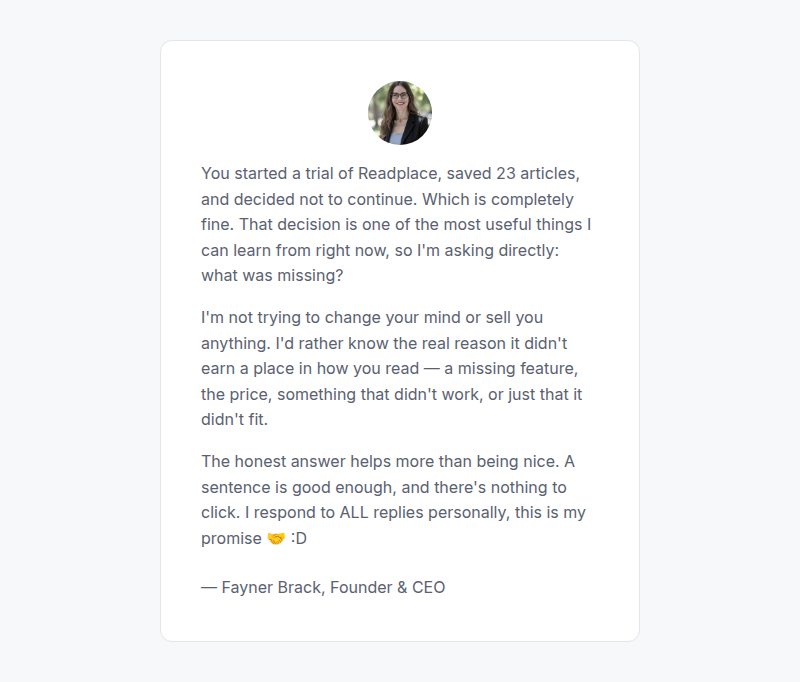</td>
<td valign="top">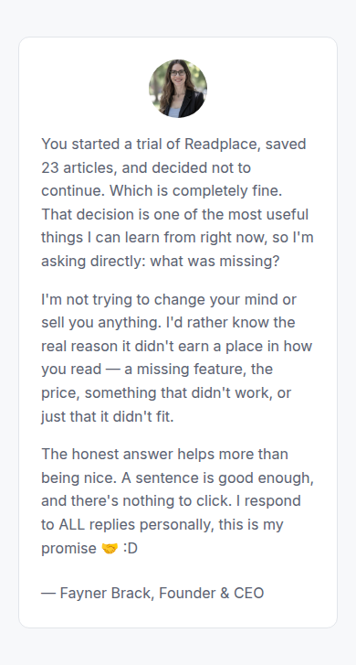</td>
</tr></table>

Exact HTML body: [`html/trial-feedback--default.html`](html/trial-feedback--default.html)

#### `one-article` — A trialist who cancelled early with POST /account/cancel and had saved 1 article, so the first sentence uses the singular "saved 1 article".

Subject: **you tried Readplace — what was missing?** · To: `sam.reader@gmail.com`

<details><summary>Example inputs</summary>

```json
{
  "sqsBody": {
    "version": "0",
    "id": "5f1c2d8e-0013-4b7a-9c3e-1a2b3c4d5e6f",
    "detail-type": "SendTrialFeedbackEmailCommand",
    "source": "hutch.subscriptions",
    "account": "278728209435",
    "time": "2026-10-05T09:03:53Z",
    "region": "ap-southeast-2",
    "resources": [
      "arn:aws:scheduler:ap-southeast-2:278728209435:schedule/hutch-trial-end-prod/trial-feedback-7c04e8b1f29a4d5e8b63a0f2c9d17e44"
    ],
    "detail": {
      "userId": "7c04e8b1f29a4d5e8b63a0f2c9d17e44"
    }
  },
  "commandDetail": {
    "userId": "7c04e8b1f29a4d5e8b63a0f2c9d17e44"
  },
  "cancelReason": "user_initiated_trial",
  "subscriptionRowAtSend": {
    "userId": "7c04e8b1f29a4d5e8b63a0f2c9d17e44",
    "provider": "stripe",
    "status": "cancelled",
    "createdAt": "2026-09-18T08:03:51.227Z",
    "updatedAt": "2026-10-02T09:03:52.530Z"
  },
  "findEmailByUserId": "sam.reader@gmail.com",
  "savedArticlesTotal": 1,
  "findArticlesByUserQuery": {
    "userId": "7c04e8b1f29a4d5e8b63a0f2c9d17e44",
    "excludeContent": true,
    "includeTotal": true
  },
  "founderAvatarUrl": "https://static.readplace.com/fayner-brack.jpg",
  "env": {
    "STATIC_BASE_URL": "https://static.readplace.com",
    "APP_ORIGIN": "https://readplace.com"
  },
  "signupPrecondition": "signed up after the founding allocation was exhausted (users >= FOUNDING_MEMBER_LIMIT = 50 in prod, Pulumi.prod.yaml), so signup opened a 14-day trial instead of a founding membership",
  "timeline": [
    "2026-09-18T08:03:51.227Z signup -> trialing, trialEndsAt=2026-10-02T08:03:51.227Z, trial-end schedule 2026-10-02T08:03:51.227Z",
    "2026-09-25T19:40:12.880Z POST /account/cancel -> CancelSubscriptionCommand {userId}",
    "2026-09-25T19:40:13.030Z subscription-events <- CancelSubscriptionCommand {\"userId\":\"7c04e8b1f29a4d5e8b63a0f2c9d17e44\"}",
    "2026-09-25T19:40:13.180Z subscription-events <- SubscriptionCancellationScheduled {\"userId\":\"7c04e8b1f29a4d5e8b63a0f2c9d17e44\",\"cancellationEffectiveAt\":\"2026-10-02T08:03:51.227Z\"}",
    "2026-10-02T09:03:52.380Z deferred-cancellation schedule fired -> CancelSubscriptionCommand {\"userId\":\"7c04e8b1f29a4d5e8b63a0f2c9d17e44\"}",
    "2026-10-02T09:03:52.530Z subscription-events <- SubscriptionCancelled {\"userId\":\"7c04e8b1f29a4d5e8b63a0f2c9d17e44\",\"reason\":\"user_initiated_trial\"}",
    "2026-10-05T09:03:53.510Z trial-feedback schedule fired -> SendTrialFeedbackEmailCommand {\"userId\":\"7c04e8b1f29a4d5e8b63a0f2c9d17e44\"}"
  ],
  "sentAt": "2026-10-05T09:03:53.510Z"
}
```

</details>

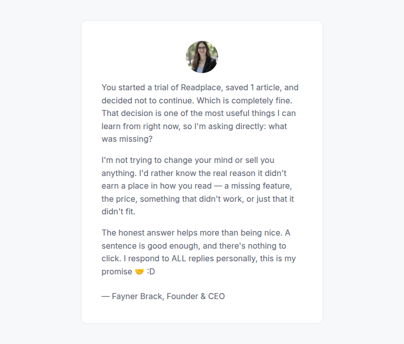

Exact HTML body: [`html/trial-feedback--one-article.html`](html/trial-feedback--one-article.html)

#### `no-articles` — A reader whose trial ran out with no card on file and nothing saved, so the first sentence leaves out the saved-articles clause.

Subject: **you tried Readplace — what was missing?** · To: `sam.reader@gmail.com`

<details><summary>Example inputs</summary>

```json
{
  "sqsBody": {
    "version": "0",
    "id": "5f1c2d8e-0021-4b7a-9c3e-1a2b3c4d5e6f",
    "detail-type": "SendTrialFeedbackEmailCommand",
    "source": "hutch.subscriptions",
    "account": "278728209435",
    "time": "2026-10-05T22:47:32Z",
    "region": "ap-southeast-2",
    "resources": [
      "arn:aws:scheduler:ap-southeast-2:278728209435:schedule/hutch-trial-end-prod/trial-feedback-e9b27d5a03c14f6896d1b8a4e2f0c357"
    ],
    "detail": {
      "userId": "e9b27d5a03c14f6896d1b8a4e2f0c357"
    }
  },
  "commandDetail": {
    "userId": "e9b27d5a03c14f6896d1b8a4e2f0c357"
  },
  "cancelReason": "trial_expired_no_card",
  "subscriptionRowAtSend": {
    "userId": "e9b27d5a03c14f6896d1b8a4e2f0c357",
    "provider": "stripe",
    "status": "cancelled",
    "createdAt": "2026-09-18T21:47:30.004Z",
    "updatedAt": "2026-10-02T22:47:31.530Z",
    "trialReminderEmailSentAt": "2026-09-30T21:47:31.350Z"
  },
  "findEmailByUserId": "sam.reader@gmail.com",
  "savedArticlesTotal": 0,
  "findArticlesByUserQuery": {
    "userId": "e9b27d5a03c14f6896d1b8a4e2f0c357",
    "excludeContent": true,
    "includeTotal": true
  },
  "founderAvatarUrl": "https://static.readplace.com/fayner-brack.jpg",
  "env": {
    "STATIC_BASE_URL": "https://static.readplace.com",
    "APP_ORIGIN": "https://readplace.com"
  },
  "signupPrecondition": "signed up after the founding allocation was exhausted (users >= FOUNDING_MEMBER_LIMIT = 50 in prod, Pulumi.prod.yaml), so signup opened a 14-day trial instead of a founding membership",
  "timeline": [
    "2026-09-18T21:47:30.004Z signup -> trialing, trialEndsAt=2026-10-02T21:47:30.004Z, trial-end schedule 2026-10-02T21:47:30.004Z",
    "2026-09-30T21:47:31.350Z trial-reminder schedule fired -> SendTrialFeedbackEmailCommand {userId,kind:\"reminder\"} (separate email, not this one)",
    "2026-10-02T21:47:31.420Z trial-end schedule fired -> SubscriptionStartRequestCommand",
    "2026-10-02T21:47:31.570Z subscription-events <- SubscriptionChargeFailed {\"userId\":\"e9b27d5a03c14f6896d1b8a4e2f0c357\",\"reason\":\"no_card_on_file\"}",
    "2026-10-02T21:47:31.720Z subscription-events <- CancelSubscriptionCommand {\"userId\":\"e9b27d5a03c14f6896d1b8a4e2f0c357\",\"reason\":\"trial_expired_no_card\"}",
    "2026-10-02T21:47:31.870Z subscription-events <- SubscriptionCancellationScheduled {\"userId\":\"e9b27d5a03c14f6896d1b8a4e2f0c357\",\"cancellationEffectiveAt\":\"2026-10-02T21:47:30.004Z\"}",
    "2026-10-02T22:47:31.380Z deferred-cancellation schedule fired -> CancelSubscriptionCommand {\"userId\":\"e9b27d5a03c14f6896d1b8a4e2f0c357\",\"reason\":\"trial_expired_no_card\"}",
    "2026-10-02T22:47:31.530Z subscription-events <- SubscriptionCancelled {\"userId\":\"e9b27d5a03c14f6896d1b8a4e2f0c357\",\"reason\":\"trial_expired_no_card\"}",
    "2026-10-05T22:47:32.510Z trial-feedback schedule fired -> SendTrialFeedbackEmailCommand {\"userId\":\"e9b27d5a03c14f6896d1b8a4e2f0c357\"}"
  ],
  "sentAt": "2026-10-05T22:47:32.510Z"
}
```

</details>

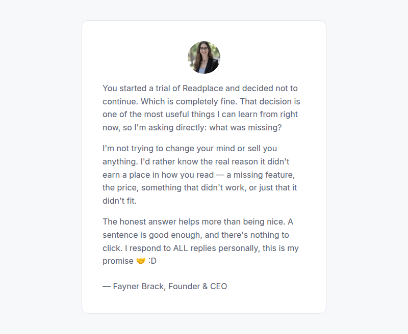

Exact HTML body: [`html/trial-feedback--no-articles.html`](html/trial-feedback--no-articles.html)

### Source

- `projects/hutch/src/runtime/web/auth/trial-feedback-email.ts:43` — renderer: subject constant, saved-articles clause, HTML and plain-text bodies
- `projects/hutch/src/runtime/web/auth/trial-feedback-email.template.html:30` — HTML template: white card, founder avatar, paragraphs and sign-off
- `projects/hutch/src/runtime/send-trial-feedback-email/send-trial-feedback-email-handler.ts:112` — sender: guards, saved-article count, send, then marker
- `projects/hutch/src/runtime/send-trial-feedback-email.main.ts:45` — composition root: Resend behind the reserved-domain filter, avatar URL
- `projects/hutch/src/runtime/schedule-trial-feedback-email/schedule-trial-feedback-email-handler.ts:44` — handler: keeps trial reasons and arms the 3-day schedule
- `projects/hutch/src/runtime/providers/trial-scheduler/aws-trial-scheduler.ts:166` — trigger infra: trial-feedback-<userId> one-shot EventBridge Scheduler
- `projects/hutch/src/runtime/cancel-subscription/cancel-subscription-handler.ts:84` — handler: trial cancel at trialEndsAt + 1 hour and the SubscriptionCancelled reason
- `projects/hutch/src/infra/index.ts:1167` — trigger infra: send-trial-feedback-email queue, Lambda and event-bus subscription

## 9. Inbox saves paused

**Trial & billing** · Readers whose subscription is read-only (cancelled, trial ended, or a cancellation that has taken effect) and whose Readplace inbox address, Gmail forwarding or still-running Gmail import brings in mail with article links; founding members never get it.

### When it is sent

When a reader's subscription is read-only and mail with article links reaches one of their Readplace inbox addresses, Readplace keeps the email and its link previews in the inbox but does not save the articles to their readlist. The first time that happens in a lapse, the inbox link extractor asks the subscription email Lambda to send this notice, which re-checks that the reader is still read-only and has not had one already. The email names the address that received the mail and links to the held email in the inbox, to the account page to reactivate, and to the page that turns inbox addresses off. Later held emails stay silent until the reader starts a trial, subscribes or becomes active again, so each new lapse gets one new notice.

Trigger chain:

1. Mail addressed to a read.place address hits the SES catch-all rule, which stores the raw .eml under inbound/ and notifies the inbox receive queue `projects/inbox/src/infra/inbox-mail.ts:176`
2. The receive-email Lambda resolves each recipient to an enabled address, routes Gmail-forwarded mail to its mapped destinations, drops duplicates by sender and Message-ID, and ingests the email with origin "receive" `projects/inbox/src/runtime/domain/inbox/receive-email-handler.ts:321`
3. Alternatively, a running Gmail history import ingests a historical message with origin "gmail-import" `projects/inbox/src/runtime/domain/inbox/ingest-gmail-import-handler.ts:151`
4. Ingest stores the inbox email row as "received" and publishes EmailReceivedEvent `projects/inbox/src/runtime/domain/inbox/ingest-parsed-email.ts:102`
5. The inbox-extract-email-links Lambda re-parses the email, extracts and triages its links, and resolves the reader's write access from their subscription row `projects/inbox/src/runtime/domain/inbox/extract-email-links-handler.ts:282`
6. For the first saveable pending link under read-only access, it skips SubmitLinkCommand and calls publishSaveHeldNotice once for the email `projects/inbox/src/runtime/domain/inbox/extract-email-links-handler.ts:411`
7. publishSaveHeldNotice publishes SendTrialFeedbackEmailCommand {kind: "automation_saves_held", receivedAtMessageId, inboxAddress}, which EventBridge delivers to send-trial-feedback-email-q `projects/inbox/src/runtime/extract-email-links.main.ts:126`
8. processAutomationSavesHeld re-checks access, the once-per-lapse marker and the login email, claims the marker, renders the email and sends it through Resend `projects/hutch/src/runtime/send-trial-feedback-email/send-trial-feedback-email-handler.ts:248`

Sent only when:

- The reader has a subscription row that is read-only when the links are extracted: status "cancelled", "trialing" past trialEndsAt, or "pending_cancellation" past cancellationEffectiveAt; a reader with no row (founding member) always has full access `src/packages/subscription-access/src/resolve-write-access.ts:26`
- The mail reaches a Readplace inbox address that exists and is turned on, including addresses routed to a custom readlist `projects/inbox/src/runtime/domain/inbox/receive-email-handler.ts:143`
- For Gmail forwarding, the sender is mapped (or unreadable) so the mail is routed rather than held `projects/inbox/src/runtime/domain/gmail/route-gmail-forwarded-email.ts:66`
- For Gmail forwarding and imports, every destination address exists, is turned on and belongs to the reader `projects/inbox/src/runtime/domain/inbox/receive-email-handler.ts:292`
- The mail arrived live or through a Gmail history import, not a backfill replay, and is attributed to a real reader `projects/inbox/src/runtime/domain/inbox/extract-email-links-handler.ts:280`
- The email is new for the reader: the same sender and Message-ID has not already been ingested for them `projects/inbox/src/runtime/domain/inbox/receive-email-handler.ts:313`
- The email body is not empty after sanitising `projects/inbox/src/runtime/domain/inbox/ingest-parsed-email.ts:82`
- At least one link is not an action or unsubscribe link and was not judged non-article by the AI triage; if triage is unavailable, every such link counts `projects/inbox/src/runtime/domain/inbox/extract-email-links-handler.ts:349`
- That link is a saveable URL and its link row is still pending `projects/inbox/src/runtime/domain/inbox/extract-email-links-handler.ts:385`
- When the send Lambda runs, the reader is still read-only `projects/hutch/src/runtime/send-trial-feedback-email/send-trial-feedback-email-handler.ts:194`
- No notice has gone out in this lapse (automationSavesHeldEmailSentAt is unset) `projects/hutch/src/runtime/send-trial-feedback-email/send-trial-feedback-email-handler.ts:201`
- The account has a login email on file; there is no email-verified or account-lock check `projects/hutch/src/runtime/send-trial-feedback-email/send-trial-feedback-email-handler.ts:210`
- This delivery wins the conditional claim on the marker `projects/hutch/src/runtime/providers/subscription-providers/dynamodb-subscription-writes.ts:176`

Not sent when:

- Once per lapse: a set automationSavesHeldEmailSentAt marker silences every later held email `projects/hutch/src/runtime/send-trial-feedback-email/send-trial-feedback-email-handler.ts:201`
- The marker is cleared only when the reader starts a trial (upsertTrialing), subscribes (upsertActive) or becomes active again (markActive); a pending cancellation or a cancellation keeps it `projects/hutch/src/runtime/providers/subscription-providers/dynamodb-subscription-writes.ts:133`
- At most one notice request per inbound email, however many links are held `projects/inbox/src/runtime/domain/inbox/extract-email-links-handler.ts:409`
- Full access at extraction (no row, active, a trial or pending cancellation still in its window): the links are saved and no notice is requested `projects/inbox/src/runtime/domain/inbox/extract-email-links-handler.ts:392`
- Full access again at send time, for example after reactivating in between: nothing is sent `projects/hutch/src/runtime/send-trial-feedback-email/send-trial-feedback-email-handler.ts:194`
- No login email on file: nothing is sent, the request is not retried and the marker stays unset `projects/hutch/src/runtime/send-trial-feedback-email/send-trial-feedback-email-handler.ts:210`
- Mail to a turned-off address is recorded under the unrouted partition, so turning addresses off stops future notices from that address `projects/inbox/src/runtime/domain/inbox/receive-email-handler.ts:258`
- Mail to an unknown address is recorded under the unrouted partition and never extracted for the reader `projects/inbox/src/runtime/domain/inbox/receive-email-handler.ts:248`
- Gmail-forwarded mail from an unmapped sender is held in the held-mail table and not ingested `projects/inbox/src/runtime/domain/gmail/route-gmail-forwarded-email.ts:68`
- A Gmail destination that is missing, turned off or owned by someone else stops the ingest `projects/inbox/src/runtime/domain/inbox/ingest-gmail-import-handler.ts:126`
- A duplicate message, such as the same newsletter sent to two of the reader's addresses or one already imported from Gmail, is skipped `projects/inbox/src/runtime/domain/inbox/receive-email-handler.ts:313`
- A cancelled, superseded or re-selected Gmail import job ingests no new mail `projects/inbox/src/runtime/domain/inbox/ingest-gmail-import-handler.ts:117`
- Oversize or unparseable mail is recorded as rejected or unparsed and never extracted `projects/inbox/src/runtime/domain/inbox/receive-email-handler.ts:176`
- A backfill replay never saves or notifies `projects/inbox/src/runtime/domain/inbox/extract-email-links-handler.ts:48`
- No link is held: every link is an action or unsubscribe link, judged non-article, unsaveable, or already terminal on a redelivery `projects/inbox/src/runtime/domain/inbox/extract-email-links-handler.ts:371`

**Timing:** Sent immediately with no configured delay: usually seconds to tens of seconds after the mail reaches the Readplace address, and up to about 2 minutes when the AI link triage needs both of its 60-second attempts. Retries add the queue visibility timeouts (receive 180s, extract 240s, send 60s), and for a Gmail history import it goes out when the import processes the message, which can be long after the mail first arrived.

**If sending fails:** Thrown errors are reported as batch item failures and retried by SQS after the 60s visibility timeout, up to 3 receives, then moved to send-trial-feedback-email-dlq, whose CloudWatch alarm emails the alert address; because the marker is claimed before rendering and sending, a render or Resend failure makes every retry no-op as already sent, so the notice is lost for the rest of the lapse without reaching the DLQ. No email on file, regained access and a lost claim race count as success and are not retried, while upstream inbox failures retry after 180s (receive) or 240s (extract) before landing in the shared inbox failures DLQ.

<details><summary>Edge cases</summary>

- The reserved-domain wrapper drops a `to` at example.com, example.net or example.org, or any .test, .example, .invalid or .localhost domain (subdomains such as foo.example.com still send); it runs after the marker is claimed, so the marker records a claim rather than a delivery `projects/hutch/src/runtime/providers/email/skip-reserved-domain.ts:31`
- Gmail forwarding-confirmation mails are intercepted before ingest `projects/inbox/src/runtime/domain/inbox/receive-email-handler.ts:225`
- Mail with no <alias>-<token>@domain recipient is acknowledged with nothing written `projects/inbox/src/runtime/domain/inbox/receive-email-handler.ts:117`
- A redelivered Gmail email already stored as received is republished as EmailReceived without a new ingest; on the import path this runs before the job check, so a stale job's redelivered message can still trigger extraction `projects/inbox/src/runtime/domain/inbox/ingest-gmail-import-handler.ts:114`
- Duplicate detection only runs when the sender and Message-ID can be read; otherwise the email proceeds with its proposed id `projects/inbox/src/runtime/domain/inbox/receive-email-handler.ts:303`
- When an earlier stalled claim is taken over, the highlight id in the button is that earlier claim's receivedAtMessageId `projects/inbox/src/runtime/domain/inbox/resolve-email-identity.ts:77`
- A Gmail import message whose sender does not match, or that has no Message-ID, is skipped `projects/inbox/src/runtime/domain/inbox/ingest-gmail-import-handler.ts:99`
- On first delivery a non-article verdict skips the link for both inbox and Gmail routing; Gmail falls through only on a redelivery when the row was already stored as pending `projects/inbox/src/runtime/domain/inbox/extract-email-links-handler.ts:355`
- AI triage gives up after 2 attempts and returns "unavailable", so every crawl candidate is treated as an article `projects/inbox/src/runtime/domain/inbox/triage-email-links.ts:133`
- A raw .eml that is not yet readable at extraction is retried after the 240s extract visibility timeout `projects/inbox/src/runtime/domain/inbox/extract-email-links-handler.ts:197`
- Extraction does not re-check that the address is still turned on, so mail received just before the reader turns it off can still trigger the notice `projects/inbox/src/runtime/domain/inbox/extract-email-links-handler.ts:280`
- The notice is requested before that link's preview publish, so a crash in between republishes the request on retry and the marker deduplicates it `projects/inbox/src/runtime/domain/inbox/extract-email-links-handler.ts:411`
- Two concurrent held emails both pass the marker check; the loser of the conditional claim logs "another delivery sent it" and sends nothing `projects/hutch/src/runtime/send-trial-feedback-email/send-trial-feedback-email-handler.ts:220`
- findEmailByUserId takes the first users row on userId-index; Gmail claim rows carry ownerUserId instead of userId, so they never match `projects/hutch/src/runtime/providers/auth/dynamodb-auth.ts:423`
- Account deletion deletes the subscription row, which restores full access, so nothing is sent `projects/hutch/src/runtime/providers/subscription-providers/dynamodb-subscription-writes.ts:268`
- The handler is wired only in the Lambda composition root (Resend wrapped by the reserved-domain skip), with no local log-only path; staging deploys the same Lambda, where inbox addresses use readplace-staging.com `projects/inbox/Pulumi.staging.yaml:11`

</details>

> **Observations**
>
> - The marker is claimed before rendering and sending, so delivery is at-most-once: a Resend rejection, Resend outage or render error loses the notice for the whole lapse, never reaches the DLQ alarm and leaves only an error log `projects/hutch/src/runtime/send-trial-feedback-email/send-trial-feedback-email-handler.ts:219`
> - The reassurance says the held email and articles "go back to saving automatically once your subscription is active again", but nothing resubmits held links on reactivation: only new mail saves automatically, and held links must be saved one at a time from the inbox, a route that needs write access `projects/inbox/src/runtime/web/pages/inbox/inbox.page.ts:493`
> - Starting or retrying a Gmail history import needs write access, but the import worker and ingest never re-check it, so an import still running after the lapse triggers this notice on old mail while the copy says the email "just arrived" `projects/hutch/src/runtime/web/auth/automation-saves-held-email.ts:32`
> - Turning inbox addresses off is the only opt-out the email offers; no unsubscribe header or email preference is consulted `projects/hutch/src/runtime/send-trial-feedback-email/send-trial-feedback-email-handler.ts:248`
> - Because AI triage fails open, an email with no real articles (only menu or ad links) can trigger the notice when DeepSeek is unavailable `projects/inbox/src/runtime/domain/inbox/triage-email-links.ts:133`
> - Unverified and locked accounts receive the notice, since the send handler checks neither `projects/hutch/src/runtime/send-trial-feedback-email/send-trial-feedback-email-handler.ts:209`
> - The no-address and plain-/inbox branches cannot be reached from the only publisher, which always sends both fields `projects/inbox/src/runtime/extract-email-links.main.ts:126`
> - The infra comment for this Lambda names only the Scheduler and stripe-webhook-receiver as callers and lists four kinds, omitting the inbox extractor and automation_saves_held `projects/hutch/src/infra/index.ts:1136`
> - Cosmetic: the HTML <title> is capitalised while the subject is lowercase, the opening uses " - " as a dash, the reply line has no closing period, and the reactivate link goes out with raw & while the other links are entity-escaped; all render correctly `projects/hutch/src/runtime/web/auth/automation-saves-held-email.template.html:6`

### Message

| Field | Value |
|---|---|
| From | `Readplace <readplace@readplace.com>` |
| To | The reader's login email from the users table (findEmailByUserId), not their Readplace inbox address |
| Bcc | `readplace+automation_saves_held@readplace.com` |
| Reply-To | `fayner@readplace.com` |
| Subject | links sent to your Readplace inbox are waiting |
| Headers | none |
| Plain-text part | A plain-text version with the same six paragraphs, each link written out as a full URL. |
| Idempotency key | none |

Content variants:

| Variant | Shown when |
|---|---|
| default | The command carries inboxAddress and receivedAtMessageId, which the only publisher always sets (`projects/inbox/src/runtime/extract-email-links.main.ts:126`). The opening names the address in bold and the button opens /inbox?highlight={receivedAtMessageId} with utm tags. The address is the one that received the mail for an inbox address; for Gmail forwarding it is the first mapped destination, or the Gmail address itself when the sender is unreadable or a gmail-mapped address has no sender mapping (`projects/inbox/src/runtime/domain/gmail/route-gmail-forwarded-email.ts:56`); for a Gmail import it is the first selected destination (`projects/inbox/src/runtime/domain/inbox/ingest-gmail-import-handler.ts:153`). Everything else is fixed and does not change with subscription status, routing, origin or the number of held links. |
| no-inbox-address | inboxAddress is missing, so the opening reads "An email to your Readplace inbox just arrived..." with no address (`projects/hutch/src/runtime/web/auth/automation-saves-held-email.ts:41`); receivedAtMessageId is missing, so the button opens the plain /inbox list (`src/packages/domain/src/inbox/inbox-routes.ts:33`). Each field controls its own part independently; the schema allows both to be absent, but no current publisher sends such a command. |

### Example

#### `default` — A cancelled reader's first held newsletter (a TLDR issue to inbox-k7m2q9@read.place), run through the real extract and send handlers, showing the address in bold and the button deep-linking to the highlighted email in /inbox.

Subject: **links sent to your Readplace inbox are waiting** · To: `sam.reader@gmail.com`

<details><summary>Example inputs</summary>

```json
{
  "env": {
    "APP_ORIGIN": "https://readplace.com",
    "STATIC_BASE_URL": "https://static.readplace.com",
    "EVENT_BUS_NAME": "hutch-event-bus-4202fdd"
  },
  "subscriptionRow": {
    "userId": "4c9e2a7f1b3d48e6a05f9c2d7e81b364",
    "provider": "stripe",
    "status": "cancelled",
    "createdAt": "2026-09-07T08:15:22.000Z",
    "updatedAt": "2026-09-21T08:15:40.000Z"
  },
  "userEmail": "sam.reader@gmail.com",
  "emailReceivedDetail": {
    "userId": "4c9e2a7f1b3d48e6a05f9c2d7e81b364",
    "receivedAtMessageId": "2026-10-05T11:42:07.318Z#<20261005114158.3f7c2a91d4e8b605@tldrnewsletter.com>",
    "recipientAddress": "inbox-k7m2q9@read.place",
    "routing": {
      "kind": "inbox"
    },
    "origin": "receive"
  },
  "rawEmail": {
    "from": "TLDR <dan@tldrnewsletter.com>",
    "to": "inbox-k7m2q9@read.place",
    "messageId": "<20261005114158.3f7c2a91d4e8b605@tldrnewsletter.com>",
    "s3Key": "inbound/k4r8vq1m0c7d2nhs5t9ue3bj6gplfa0oiw2x8y01",
    "articleLinks": 3,
    "unsubscribeLinks": 1
  },
  "publishedCommand": {
    "eventBusName": "hutch-event-bus-4202fdd",
    "source": "hutch.subscriptions",
    "detailType": "SendTrialFeedbackEmailCommand",
    "detail": {
      "userId": "4c9e2a7f1b3d48e6a05f9c2d7e81b364",
      "kind": "automation_saves_held",
      "receivedAtMessageId": "2026-10-05T11:42:07.318Z#<20261005114158.3f7c2a91d4e8b605@tldrnewsletter.com>",
      "inboxAddress": "inbox-k7m2q9@read.place"
    }
  },
  "handlerNow": "2026-10-05T11:42:15.276Z"
}
```

</details>

<table><tr><th>Desktop (800px)</th><th>Phone (390px)</th></tr><tr>
<td valign="top">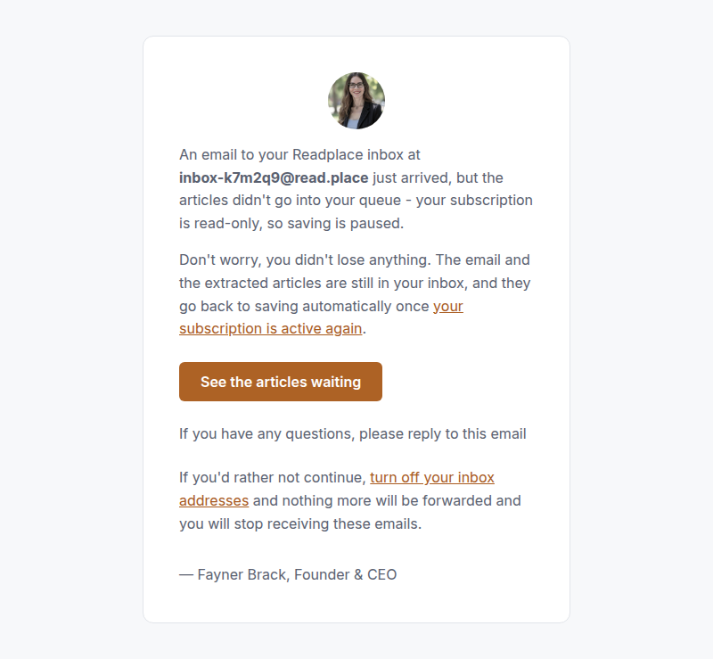</td>
<td valign="top">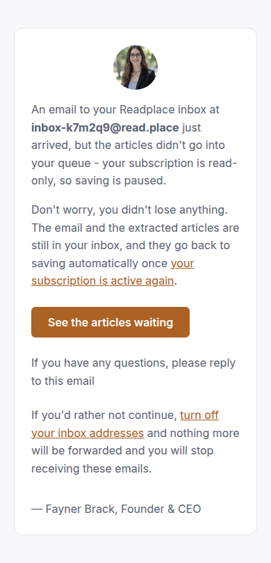</td>
</tr></table>

Exact HTML body: [`html/automation-saves-held--default.html`](html/automation-saves-held--default.html)

#### `no-inbox-address` — A hand-built command with no inboxAddress or receivedAtMessageId, which no current publisher sends, showing the opening without an address and the button linking to the plain /inbox list.

Subject: **links sent to your Readplace inbox are waiting** · To: `sam.reader@gmail.com`

<details><summary>Example inputs</summary>

```json
{
  "env": {
    "APP_ORIGIN": "https://readplace.com",
    "STATIC_BASE_URL": "https://static.readplace.com",
    "EVENT_BUS_NAME": "hutch-event-bus-4202fdd"
  },
  "subscriptionRow": {
    "userId": "4c9e2a7f1b3d48e6a05f9c2d7e81b364",
    "provider": "stripe",
    "status": "cancelled",
    "createdAt": "2026-09-07T08:15:22.000Z",
    "updatedAt": "2026-09-21T08:15:40.000Z"
  },
  "userEmail": "sam.reader@gmail.com",
  "commandDetail": {
    "userId": "4c9e2a7f1b3d48e6a05f9c2d7e81b364",
    "kind": "automation_saves_held"
  },
  "handlerNow": "2026-10-05T11:42:15.276Z"
}
```

</details>

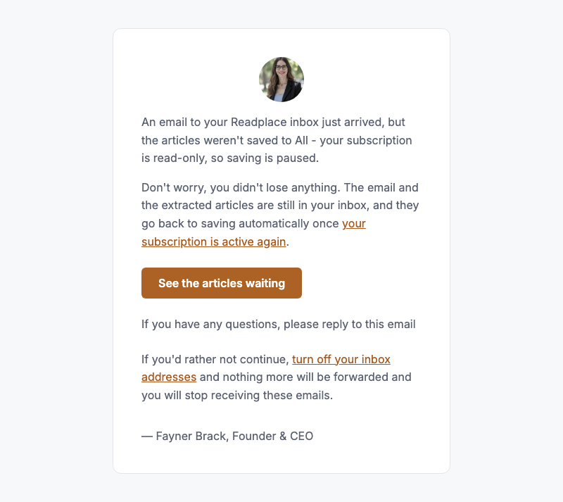

Exact HTML body: [`html/automation-saves-held--no-inbox-address.html`](html/automation-saves-held--no-inbox-address.html)

### Source

- `projects/hutch/src/runtime/web/auth/automation-saves-held-email.ts:66` — renderer for HTML and plain text; subject constant at :12
- `projects/hutch/src/runtime/web/auth/automation-saves-held-email.template.html:30` — Handlebars template; opening :30, button :37, opt-out footer :42
- `projects/hutch/src/runtime/send-trial-feedback-email/send-trial-feedback-email-handler.ts:188` — processAutomationSavesHeld: guards, marker claim, tracked URLs and sendEmail call
- `projects/hutch/src/runtime/send-trial-feedback-email.main.ts:45` — composition root: Resend wrapped by the reserved-domain skip, avatar URL, APP_ORIGIN
- `projects/hutch/src/runtime/providers/subscription-providers/dynamodb-subscription-writes.ts:167` — once-per-lapse marker claim
- `projects/inbox/src/runtime/domain/inbox/extract-email-links-handler.ts:391` — held-save decision that requests the notice
- `projects/inbox/src/runtime/extract-email-links.main.ts:126` — publishSaveHeldNotice wired to SendTrialFeedbackEmailCommand
- `projects/hutch/src/infra/index.ts:1167` — send-trial-feedback-email queue, Lambda, DLQ alarm and EventBridge subscription (:1204)

## 10. Readlist digest

**Reading** · Paying members (including members who cancelled but whose access has not ended yet) with a verified email who have not unsubscribed. Trialists are checked too, but a trial ends 14 days after signup and a save must be 30 days old, so a trialist only gets it if an operator extends or re-opens the trial past that point. Founding members, expired trials and ended memberships never get it.

### When it is sent

Every 6 hours Readplace checks every trialist and paying member. If at least 7 days less 30 minutes have passed since their last digest and their All readlist holds unread saves that are at least 30 days old, were never in an earlier digest, and have a ready reader view and AI summary, it emails up to 10 of the newest. On the checks where a trialist's trial-ending digest is due, that version goes out instead, and once it is sent the next readlist digest waits at least 7 days less 30 minutes from it and never repeats the saves it listed. A trial ends 14 days after signup, so in practice the readlist digest goes to paying members, not trialists.

Trigger chain:

1. EventBridge Scheduler `hutch-digest-flush` puts a trigger message on the digest-scan queue every 6 hours `projects/hutch/src/infra/index.ts:881`
2. digest-scan lists every user whose subscription is trialing, active or pending_cancellation and sends one SendUserDigestCommand per user to the send-user-digest queue `projects/hutch/src/runtime/digest-scan/digest-scan-handler.ts:46`
3. send-user-digest loads the user's contact, subscription row and last regular-digest state `projects/hutch/src/runtime/send-queue-digest/send-queue-digest-handler.ts:143`
4. It skips users who are unverified, unsubscribed, or not on a trial or paid tier `projects/hutch/src/runtime/send-queue-digest/send-queue-digest-handler.ts:157`
5. The trial-ending digest is not due, so the regular plan applies `projects/hutch/src/runtime/send-queue-digest/send-queue-digest-handler.ts:164`
6. The regular plan holds if under 7 days less 30 minutes (167.5h) have passed since the last regular or trial-ending digest `projects/hutch/src/runtime/send-queue-digest/send-queue-digest-handler.ts:281`
7. It picks up to 10 qualifying saves and claims the user's digest slot on the reader-ready-notifications row `projects/hutch/src/runtime/send-queue-digest/send-queue-digest-handler.ts:172`
8. It signs a mark-read token over the user id and the ids of the listed saves for the Mark all as read button `projects/hutch/src/runtime/send-queue-digest/send-queue-digest-handler.ts:193`
9. It sends through Resend, then stamps emailSentAt on every listed save `projects/hutch/src/runtime/send-queue-digest/send-queue-digest-handler.ts:197`

Sent only when:

- The user's subscription status is trialing, active or pending_cancellation, so the 6-hourly scan includes them `projects/hutch/src/runtime/digest-scan/digest-scan-handler.ts:15`
- The user row exists and its email is verified `projects/hutch/src/runtime/send-queue-digest/send-queue-digest-handler.ts:157`
- The user has not unsubscribed from this digest; it is on by default `projects/hutch/src/runtime/send-queue-digest/send-queue-digest-handler.ts:158`
- Access is trial (trialing before trialEndsAt, or a cancelled trial before its end date) or paid (an active membership, including a trialist who already chose a plan, or a cancelled membership before its end date) `projects/hutch/src/runtime/send-queue-digest/send-queue-digest-handler.ts:159`
- The trial-ending digest is not due on this check `projects/hutch/src/runtime/send-queue-digest/send-queue-digest-handler.ts:164`
- At least 7 days less 30 minutes (167.5h) have passed since the later of the last regular digest and the trial-ending digest `projects/hutch/src/runtime/send-queue-digest/send-queue-digest-handler.ts:281`
- At least one save qualifies: it is in the All readlist, unread, and was saved at least 30 days before this check `projects/hutch/src/runtime/send-queue-digest/send-queue-digest-handler.ts:278`
- The save was never listed in an earlier regular or trial-ending digest `src/packages/article-store/src/dynamodb-saved-article-store.ts:615`
- Its reader view has loaded, its content has not been purged, and it is not the consent-seed article (the one saved automatically when a user with no saves first authorizes an external app or AI assistant) `projects/hutch/src/runtime/send-queue-digest/send-queue-digest-handler.ts:360`
- Its AI summary is ready `projects/hutch/src/runtime/send-queue-digest/send-queue-digest-handler.ts:371`
- The email lists at most 10 qualifying saves, newest save first `projects/hutch/src/runtime/send-user-digest.main.ts:29`
- No other message claimed this user's digest slot in the last 5.5h `projects/hutch/src/runtime/providers/reader-ready-state/dynamodb-reader-ready-state.ts:60`

Not sent when:

- No user row or an unverified email: skipped, and queue_digest_skipped is recorded with reason no-verified-email `projects/hutch/src/runtime/send-queue-digest/send-queue-digest-handler.ts:157`
- Unsubscribed, either by confirming on the page behind the email's Stop these emails link or through the mail client's one-click unsubscribe: skipped for good with reason unsubscribed `projects/hutch/src/runtime/web/pages/queue-digest-unsubscribe/queue-digest-unsubscribe.page.ts:68`
- Founding members (no subscription row), expired trials, cancelled memberships and cancellations past their end date: never sent, logged only with no analytics event `projects/hutch/src/runtime/send-queue-digest/send-queue-digest-handler.ts:159`
- Under 7 days less 30 minutes (167.5h) since the last regular or trial-ending digest: held and logged as cadence `projects/hutch/src/runtime/send-queue-digest/send-queue-digest-handler.ts:281`
- A trialist inside [trialEndsAt − 96h, trialEndsAt − 60h) who has not had the trial-ending digest gets that version instead on every check until it is sent `projects/hutch/src/runtime/send-queue-digest/send-queue-digest-handler.ts:164`
- No qualifying save: skipped with reason no-eligible-items; nothing is recorded, so a later check can still send `projects/hutch/src/runtime/send-queue-digest/send-queue-digest-handler.ts:170`
- Saves under 30 days old are not listed yet; because a trial ends 14 days after signup `projects/hutch/src/runtime/domain/trial/start-trial.ts:33`, a trialist whose trial was not extended holds no qualifying save and is skipped with reason no-eligible-items on every check outside the trial-ending window `projects/hutch/src/runtime/send-queue-digest/send-queue-digest-handler.ts:278`
- A save listed in any earlier digest, regular or trial-ending, is stamped once and never listed in a regular digest again, so a user whose waiting saves were all listed gets nothing `src/packages/article-store/src/dynamodb-saved-article-store.ts:1214`
- Saves whose summary was skipped or failed, or whose reader view never loads, are never listed `projects/hutch/src/runtime/send-queue-digest/send-queue-digest-handler.ts:371`
- Deleting an account does not stop the digest right away; it stops when the background deletion job removes the user's saves `projects/hutch/src/runtime/delete-account/delete-account-handler.ts:180`

**Timing:** Checked every 6 hours by an EventBridge Scheduler rate(6 hours) schedule whose clock times depend on when it was created (the examples assume 03:12, 09:12, 15:12 and 21:12 UTC). A user gets it at most once per 7 days less 30 minutes (167.5h) after their last regular or trial-ending digest, which is every 7 days (every 28th check) while unlisted saves keep turning 30 days old; the 30 minutes stop a few minutes of processing delay from holding the 28th check. A save first qualifies on the first check at least 30 days after it was saved.

**If sending fails:** Any error fails the SQS record, which is retried after 120s up to 3 receives and then moves to the send-user-digest DLQ, whose alarm emails the team. A Resend 4xx releases the claim so the retry sends a fresh copy, while a 5xx or network error keeps the claim so the retry never sends again (at most once); failures stamping saves or publishing the sent event afterwards are logged and ignored.

<details><summary>Edge cases</summary>

- A save that exists only in a named readlist (removed from All) is never read, because the query covers only the All readlist partition `src/packages/article-store/src/dynamodb-saved-article-store.ts:622`
- Re-saving an article moves its savedAt forward, which restarts the 30-day wait, but keeps its read status and its emailSentAt stamp `src/packages/article-store/src/dynamodb-saved-article-store.ts:410`
- A save whose shared article row is missing is dropped without notice `src/packages/article-store/src/dynamodb-saved-article-store.ts:598`
- Each check reads at most 50 candidate saves, newest first; unready saves are never stamped and are re-read every check, so a user whose 50 newest unread saves are all unready never sees older ready ones `projects/hutch/src/runtime/send-queue-digest/send-queue-digest-handler.ts:350`
- The consent-seed exclusion matches by URL, so a user who saves that fagnerbrack.com article themselves never sees it in a digest either `projects/hutch/src/runtime/send-queue-digest/send-queue-digest-handler.ts:360`
- The query also accepts saves whose emailSentAt equals this run's instant, but that never matches: each receive takes a fresh time and a redelivery finishes from the URLs stored with its claim `src/packages/article-store/src/dynamodb-saved-article-store.ts:615`
- The 7-day gap check uses eventually consistent reads; the 5.5h conditional claim is the only atomic guard against a duplicate `projects/hutch/src/runtime/providers/reader-ready-state/dynamodb-reader-ready-state.ts:119`
- Another message for the same user already holds the slot (for example after a scan tick is redelivered): this one logs '[SendQueueDigest] rate-limited' and sends nothing `projects/hutch/src/runtime/send-queue-digest/send-queue-digest-handler.ts:326`
- A redelivered message that already holds the claim only finishes stamping saves and never sends a second copy `projects/hutch/src/runtime/send-queue-digest/send-queue-digest-handler.ts:239`
- If stamping a save fails after the send, the error is logged and that save can be listed again in a later digest `projects/hutch/src/runtime/send-queue-digest/send-queue-digest-handler.ts:406`
- Recipients at example.com, example.net or example.org, or under .test, .example, .invalid or .localhost, are dropped by a wrapper that reports success, so the handler still claims, stamps the saves and records queue_digest_sent `projects/hutch/src/runtime/providers/email/skip-reserved-domain.ts:31`
- Every deployed stack, staging included, runs this Lambda and sends through Resend with that stack's APP_ORIGIN in the links; the local dev server has no wiring for this email `projects/hutch/src/infra/index.ts:781`
- A failed per-user dispatch in the scan is logged and that user waits for the next 6h check; if the scan itself fails, the whole tick is retried after 120s and the cadence check and claim prevent duplicates `projects/hutch/src/runtime/digest-scan/digest-scan-handler.ts:45`
- An unverified or unsubscribed user whose access has ended still records queue_digest_skipped with tier inactive, because those gates run before the tier gate `projects/hutch/src/runtime/send-queue-digest/send-queue-digest-handler.ts:153`
- Opening the Mark all as read link only shows a confirm page ('Mark these articles as read?'); nothing is marked until the reader presses that page's Mark all as read button, which posts the form, so a mail scanner that opens every link marks nothing `projects/hutch/src/runtime/web/pages/queue-digest-mark-read/queue-digest-mark-read.page.ts:51` `projects/hutch/src/runtime/web/pages/queue-digest-mark-read/queue-digest-mark-read.page.ts:70`
- Confirming marks each listed save read in the first readlist that still holds it (All first, then the reader's other readlists) and in every other readlist that holds the same save, so a save moved out of All since the email is still marked read. Only a save the reader deleted from every readlist is skipped, but the done page still says all {N} articles were marked as read, because it counts the ids in the link `projects/hutch/src/runtime/web/pages/queue-digest-mark-read/queue-digest-mark-read.page.ts:43` `src/packages/article-store/src/dynamodb-saved-article-store.ts:962` `projects/hutch/src/runtime/web/pages/queue-digest-mark-read/queue-digest-mark-read.page.ts:80` `projects/hutch/src/runtime/web/pages/queue-digest-mark-read/queue-digest-mark-read.page.ts:57`
- A changed or cut-off Mark all as read link shows 'Couldn't read this mark-as-read link' with status 400 and marks nothing `projects/hutch/src/runtime/web/pages/queue-digest-mark-read/queue-digest-mark-read.component.ts:59`

</details>

> **Observations**
>
> - In practice the readlist digest reaches only paying members and pending cancellations: a trial ends 14 days after signup `projects/hutch/src/runtime/domain/trial/start-trial.ts:33` and every save is stamped with the time it was made, imports included `projects/hutch/src/runtime/web/pages/import/import.page.ts:361`, so a trialist never holds a 30-day-old save unless an operator extends or re-opens the trial at /admin/extend-trial `projects/hutch/src/runtime/web/pages/admin/extend-trial.page.ts:169`. The trial-ending digest is the only digest a trialist gets.
> - The readlist digest calls itself 'a one-time reminder' about the articles it lists `projects/hutch/src/runtime/web/queue-digest-email.ts:130` `projects/hutch/src/runtime/web/queue-digest-email.ts:24`, but a save whose emailSentAt stamp fails after the send can be listed again `projects/hutch/src/runtime/send-queue-digest/send-queue-digest-handler.ts:406`, and so can a save the reader deletes and saves again, because deleting removes the stamped row `src/packages/article-store/src/dynamodb-saved-article-store.ts:815`.
> - Each weekly digest lists at most 10 saves, newest first `projects/hutch/src/runtime/send-user-digest.main.ts:29`, so when more than 10 unlisted saves turn 30 days old in a week, the rest are listed only in a later week when fewer than 10 newer ones qualify; a reader who keeps leaving more than 10 saves a week unread is never reminded about the older ones `src/packages/article-store/src/dynamodb-saved-article-store.ts:631`.
> - Accounts pending deletion keep getting the digest: deleting an account only stamps deletedAt `projects/hutch/src/runtime/web/pages/account/account.page.ts:550` and the contact lookup does not check it `projects/hutch/src/runtime/providers/auth/dynamodb-auth.ts:468`, so mail continues until the deletion job removes the saves, and longer if that job is stuck in its DLQ.
> - There is no way to opt back in: the opt-out's clear branch has no caller `projects/hutch/src/runtime/providers/auth/dynamodb-auth.ts:516`, and the done page says Readplace won't send this email again `projects/hutch/src/runtime/web/pages/queue-digest-unsubscribe/queue-digest-unsubscribe.component.ts:38`.
> - Unsubscribe tokens (an HMAC of the userId) and Mark all as read tokens (an HMAC of the userId and the listed article ids) are keyed by ANALYTICS_SALT and never expire, so rotating the analytics salt breaks every unsubscribe and Mark all as read link already sent `projects/hutch/src/runtime/send-user-digest.main.ts:105` `projects/hutch/src/runtime/send-user-digest.main.ts:106`.
> - The Mark all as read link works without signing in: the page is mounted without the sign-in gate `projects/hutch/src/runtime/server.ts:1547` and marks the saves of the userId inside the token, whoever is signed in `projects/hutch/src/runtime/web/pages/queue-digest-mark-read/queue-digest-mark-read.page.ts:76`, so anyone the email is forwarded to can mark those articles read, and an old email's button marks them read again after the reader marked them unread.
> - Articles marked read from the email record no article_read analytics event, unlike marking one read in the readlist `projects/hutch/src/runtime/web/pages/readlist/readlist.page.ts:2724`; the mark-read page has no analytics dependency `projects/hutch/src/runtime/web/pages/queue-digest-mark-read/queue-digest-mark-read.page.ts:21`.
> - A Resend 4xx removes the user's last-digest time along with the claim `projects/hutch/src/runtime/providers/reader-ready-state/dynamodb-reader-ready-state.ts:104`, so an address Resend keeps refusing is retried on every 6h check (3 receives each) and every check ends in the DLQ alarm.
> - Delivery is at most once: after a 5xx or network error the claim is kept and the retry only stamps the saves `projects/hutch/src/runtime/send-queue-digest/send-queue-digest-handler.ts:207`, so if Resend never accepted the message that digest is lost and its saves never appear in a later regular digest; the comment at `projects/hutch/src/runtime/send-user-digest.main.ts:19` says this is deliberate.
> - Sends dropped for reserved test domains still count in queue_digest_sent analytics `projects/hutch/src/runtime/providers/email/skip-reserved-domain.ts:37`.
> - The template's developer HTML comment ships inside every article card of the real email `projects/hutch/src/runtime/web/queue-digest-email.template.html:28`.
> - The shared reply line 'If you have any questions, please reply to this email' has no closing period in both the HTML and text parts `projects/hutch/src/runtime/web/email-copy.ts:2`.
> - The public blog post still describes the older email (only articles opened while still loading, at most every 6 hours, a button per row) `projects/blog-site/src/runtime/web/pages/blog/posts/one-email-for-every-ready-article.md:3`, and the reader-ready fan-out still writes to the digest-queue table, which this sender never reads `projects/hutch/src/runtime/reader-ready-fanout.main.ts:33`.

### Message

| Field | Value |
|---|---|
| From | `Readplace <readplace@readplace.com>` |
| To | The user's account email (the email on their Readplace user row, looked up by userId) |
| Bcc | none |
| Reply-To | `fayner@readplace.com` |
| Subject | Waiting in your readlist |
| Headers | List-Unsubscribe: <https://readplace.com/email/queue-digest/unsubscribe?t={userId}.{hmacSha256Hex}>; List-Unsubscribe-Post: List-Unsubscribe=One-Click |
| Plain-text part | Yes: the same copy as plain text, with each article reduced to its title and reader link (no site name or preview). |
| Idempotency key | none |

Content variants:

| Variant | Shown when |
|---|---|
| default | Two or more qualifying saves: the intro paragraph 'These {n} articles are ready and have been in your readlist for some time but are still unread. This is a one-time reminder about them.', an amber Continue reading button (#AD6225) to /queue beside a white Mark all as read button (#FFFFFF with a #E2E5EA edge) to /email/queue-digest/mark-read?t={token signed over the userId and the ids of the listed saves}, no pay block, the footer 'You're getting this because Readplace sends a one-time reminder for articles that stay unread in your readlist for 30 days. Stop these emails.', and every link tagged utm_campaign=regular. |
| single-article | Exactly one qualifying save: the intro paragraph 'This article is ready and has been in your readlist for some time but is still unread. This is a one-time reminder about it.'; the Mark all as read button still shows and covers that one save. |
| excerpt-preview | The article's ready summary has an excerpt, as all current summaries do: the card preview is the excerpt with whitespace collapsed and no length cap, so a model excerpt longer than the prompt's 100 characters shows in full. Captured in default. |
| summary-fallback-preview | The summary predates excerpts: the preview is the summary text with whitespace collapsed, cut at a word boundary to 200 characters with '…' only when longer. Captured in single-article. |
| no-preview | The template drops the preview line when the preview is empty; unreachable because only ready summaries, which always carry text, are listed. Not captured. |

### Example

#### `default` — A paying member whose last readlist digest went out exactly 7 days earlier (the check 6 hours before was held by cadence) gets three unread saves that are 36, 44 and 84 days old, each previewed by its excerpt, under the one-paragraph intro with the amber Continue reading button beside a white Mark all as read button whose link covers those three saves; a 15-day-old save, a save whose summary was skipped, a save already listed in the previous digest and the consent-seed article are left out.

Subject: **Waiting in your readlist** · To: `sam.reader@gmail.com`

<details><summary>Example inputs</summary>

```json
{
  "sqsRecord": {
    "messageId": "b6e3f0a2-5c1d-4e7f-9a83-2d4c6e8f1a57",
    "body": {
      "detail": {
        "userId": "4f9a1c7e2b3d48e6a0c5d9f1e7b2a6c3"
      }
    }
  },
  "sendInstant": "2026-10-05T09:12:41.337Z",
  "env": {
    "APP_ORIGIN": "https://readplace.com",
    "ANALYTICS_SALT": "(placeholder; prod value is a secret)"
  },
  "productionConstants": {
    "cooldownMs": "5.5h",
    "regularDigestMinGapMs": "7 days less 30 minutes (167.5h)",
    "minSaveAgeMs": "30 days",
    "maxDigestItems": 10,
    "maxCandidatesRead": 50
  },
  "contact": {
    "email": "sam.reader@gmail.com",
    "emailVerified": true
  },
  "subscription": {
    "kind": "active",
    "subscriptionId": "sub_1Q3mKdL4kM2nP7aB",
    "customerId": "cus_Qh7RwX2yZa9bC4"
  },
  "previousRegularDigest": {
    "at": "2026-09-28T09:12:40.902Z",
    "messageId": "1d7c9e44-0b2a-4f31-8e6d-a95c3b2f7e10",
    "urls": [
      "https://mcfunley.com/choose-boring-technology"
    ]
  },
  "saves": [
    {
      "url": "https://martinfowler.com/articles/patterns-of-distributed-systems/",
      "title": "Patterns of Distributed Systems",
      "siteName": "martinfowler.com",
      "savedAt": "2026-08-30T07:48:12.000Z",
      "readerAvailableAt": "2026-08-30T07:49:03.000Z",
      "summaryStatus": "ready",
      "excerpt": "The patterns Kafka, Cassandra and etcd share, from write-ahead logs to leader election.",
      "emailSentAt": null
    },
    {
      "url": "https://paulgraham.com/greatwork.html",
      "title": "How to Do Great Work",
      "siteName": "paulgraham.com",
      "savedAt": "2026-08-21T21:05:44.000Z",
      "readerAvailableAt": "2026-08-21T21:06:30.000Z",
      "summaryStatus": "ready",
      "excerpt": "Pick work you have a natural aptitude for and a deep interest in, then push to the edge of it.",
      "emailSentAt": null
    },
    {
      "url": "https://www.theatlantic.com/magazine/archive/2022/05/social-media-democracy-trust-babel/629369/",
      "title": "Why the Past 10 Years of American Life Have Been Uniquely Stupid",
      "siteName": "The Atlantic",
      "savedAt": "2026-07-12T18:30:09.000Z",
      "readerAvailableAt": "2026-07-12T18:31:52.000Z",
      "summaryStatus": "ready",
      "excerpt": "Social media broke the shared stories that held democracy together, and it started around 2009.",
      "emailSentAt": null
    },
    {
      "url": "https://jvns.ca/blog/2025/02/05/some-terminal-frustrations/",
      "title": "Some terminal frustrations",
      "siteName": "Julia Evans",
      "savedAt": "2026-09-20T06:40:27.000Z",
      "readerAvailableAt": "2026-09-20T06:41:10.000Z",
      "summaryStatus": "ready",
      "excerpt": "1,600 terminal users shared what trips them up, from copy and paste to remembering syntax.",
      "emailSentAt": null
    },
    {
      "url": "https://www.dreamsongs.com/WorseIsBetter.html",
      "title": "Worse Is Better",
      "siteName": "dreamsongs.com",
      "savedAt": "2026-08-01T12:15:00.000Z",
      "readerAvailableAt": "2026-08-01T12:15:41.000Z",
      "summaryStatus": "skipped",
      "excerpt": null,
      "emailSentAt": null
    },
    {
      "url": "https://mcfunley.com/choose-boring-technology",
      "title": "Choose Boring Technology",
      "siteName": "mcfunley.com",
      "savedAt": "2026-08-10T07:02:51.000Z",
      "readerAvailableAt": "2026-08-10T07:03:40.000Z",
      "summaryStatus": "ready",
      "excerpt": "Every team gets about three innovation tokens, so spend them on what makes the product different.",
      "emailSentAt": "2026-09-28T09:12:40.902Z"
    },
    {
      "url": "https://fagnerbrack.com/whats-the-point-to-save-articles-youll-never-read-22d07f6609ad",
      "title": "What's the point to save articles you'll never read?",
      "siteName": "Medium",
      "savedAt": "2026-06-14T15:20:09.000Z",
      "readerAvailableAt": "2026-06-14T15:20:40.000Z",
      "summaryStatus": "ready",
      "excerpt": "Saving articles you never read still tells you what you care about.",
      "emailSentAt": null
    }
  ],
  "analyticsEmitted": [
    {
      "stream": "analytics",
      "event": "queue_digest_sent",
      "timestamp": "2026-10-05T09:12:41.337Z",
      "user_id": "4f9a1c7e2b3d48e6a0c5d9f1e7b2a6c3",
      "send_id": "b6e3f0a2-5c1d-4e7f-9a83-2d4c6e8f1a57",
      "kind": "regular",
      "item_count": 3,
      "previously_emailed_count": 0,
      "tier": "paid",
      "trial_day": null
    }
  ],
  "previousTick": {
    "at": "2026-10-05T03:12:41.337Z",
    "outcome": [
      {
        "userId": "4f9a1c7e2b3d48e6a0c5d9f1e7b2a6c3",
        "reason": "cadence"
      }
    ]
  }
}
```

</details>

<table><tr><th>Desktop (800px)</th><th>Phone (390px)</th></tr><tr>
<td valign="top">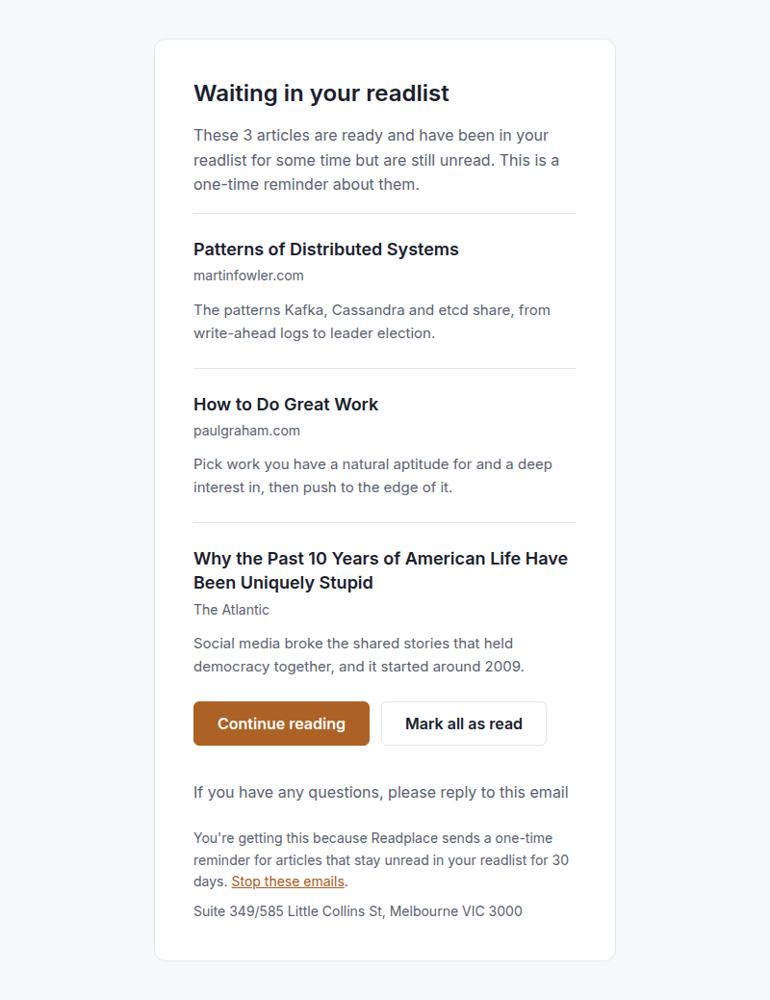</td>
<td valign="top">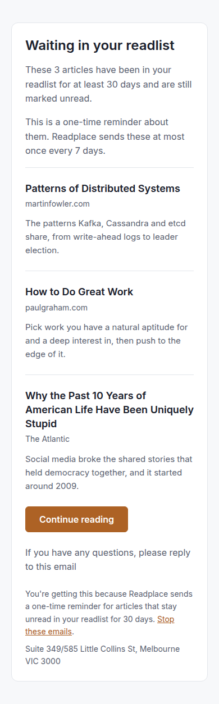</td>
</tr></table>

Exact HTML body: [`html/queue-digest--default.html`](html/queue-digest--default.html)

#### `single-article` — A paying member with exactly one qualifying save, 62 days old, gets the singular intro paragraph and a Mark all as read link for that one save, and because that article's summary predates excerpts, its preview is the summary cut at a word boundary to 200 characters with an ellipsis.

Subject: **Waiting in your readlist** · To: `sam.reader@gmail.com`

<details><summary>Example inputs</summary>

```json
{
  "sqsRecord": {
    "messageId": "e41a7b39-6d02-4c85-b1f3-7a9e2c5d0b68",
    "body": {
      "detail": {
        "userId": "4f9a1c7e2b3d48e6a0c5d9f1e7b2a6c3"
      }
    }
  },
  "sendInstant": "2026-10-05T09:12:41.337Z",
  "env": {
    "APP_ORIGIN": "https://readplace.com",
    "ANALYTICS_SALT": "(placeholder; prod value is a secret)"
  },
  "productionConstants": {
    "cooldownMs": "5.5h",
    "regularDigestMinGapMs": "7 days less 30 minutes (167.5h)",
    "minSaveAgeMs": "30 days",
    "maxDigestItems": 10,
    "maxCandidatesRead": 50
  },
  "contact": {
    "email": "sam.reader@gmail.com",
    "emailVerified": true
  },
  "subscription": {
    "kind": "active",
    "subscriptionId": "sub_1Q8xYzL4kM2nP7rS",
    "customerId": "cus_QkT3vW9xZa1bC2"
  },
  "previousRegularDigest": {
    "at": "2026-09-28T09:12:39.114Z",
    "messageId": "8a2f6c1d-3e5b-4a97-b0c4-6d1e9f2a7b35",
    "urls": [
      "https://danluu.com/sounds-easy/"
    ]
  },
  "saves": [
    {
      "url": "http://www.incompleteideas.net/IncIdeas/BitterLesson.html",
      "title": "The Bitter Lesson",
      "siteName": "www.incompleteideas.net",
      "savedAt": "2026-08-04T08:22:05.000Z",
      "readerAvailableAt": "2026-08-04T08:22:48.000Z",
      "summaryStatus": "ready",
      "excerpt": null,
      "emailSentAt": null
    }
  ],
  "analyticsEmitted": [
    {
      "stream": "analytics",
      "event": "queue_digest_sent",
      "timestamp": "2026-10-05T09:12:41.337Z",
      "user_id": "4f9a1c7e2b3d48e6a0c5d9f1e7b2a6c3",
      "send_id": "e41a7b39-6d02-4c85-b1f3-7a9e2c5d0b68",
      "kind": "regular",
      "item_count": 1,
      "previously_emailed_count": 0,
      "tier": "paid",
      "trial_day": null
    }
  ],
  "previousTick": {
    "at": "2026-10-05T03:12:41.337Z",
    "outcome": [
      {
        "userId": "4f9a1c7e2b3d48e6a0c5d9f1e7b2a6c3",
        "reason": "cadence"
      }
    ]
  }
}
```

</details>

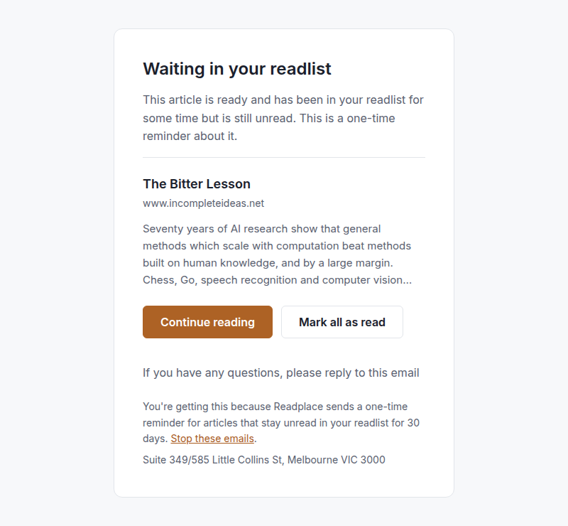

Exact HTML body: [`html/queue-digest--single-article.html`](html/queue-digest--single-article.html)

### Source

- `projects/hutch/src/runtime/web/queue-digest-email.ts:143` — renderer: subject, unsubscribe headers, tracked links, HTML and text parts
- `projects/hutch/src/runtime/web/queue-digest-email.ts:127` — intro paragraph: one for the readlist digest, one for the trial-ending digest
- `projects/hutch/src/runtime/web/queue-digest-email.ts:90` — buttons: amber Continue reading and white Mark all as read for the readlist digest, a white Continue reading alone for the trial-ending digest
- `projects/hutch/src/runtime/web/queue-digest-email.ts:23` — footer reason for each kind
- `projects/hutch/src/runtime/web/queue-digest-email.template.html:1` — HTML template
- `projects/hutch/src/runtime/web/digest-preview.ts:17` — card preview (excerpt or summary fallback)
- `projects/hutch/src/runtime/domain/email/queue-digest-cadence.ts:1` — 7-day gap less 30 minutes and 30-day minimum save age for the sender; the email copy uses only the 30 days, in the readlist digest's footer
- `projects/hutch/src/runtime/send-queue-digest/send-queue-digest-handler.ts:266` — regular plan: 7-day gap less 30 minutes, 30-day floor, not-emailed filter, slot claim
- `projects/hutch/src/runtime/send-queue-digest/send-queue-digest-handler.ts:197` — sender (sendEmail call)
- `projects/hutch/src/runtime/send-user-digest.main.ts:88` — composition root: constants, unsubscribe and mark-read token signers, Resend wrapped in the reserved-domain skip
- `projects/hutch/src/runtime/domain/email/queue-digest-mark-read-token.ts:18` — Mark all as read token: the userId and the listed article ids, HMAC-signed
- `projects/hutch/src/runtime/web/pages/queue-digest-mark-read/queue-digest-mark-read.page.ts:51` — Mark all as read page: the GET shows a confirm form, the POST marks each listed save read in the readlist that still holds it
- `projects/hutch/src/runtime/digest-scan/digest-scan-handler.ts:29` — 6-hourly fan-out to every trialist and member
- `projects/hutch/src/infra/index.ts:881` — rate(6 hours) schedule, queues and Lambdas

## 11. First inbox email arrived

**Integrations** · Readers with full write access (an active trial, an active membership, a membership pending cancellation before its end date, or a founding member with no membership row) the first time an email with a saveable article link is sent directly to one of their Readplace inbox addresses (the signup address, a custom alias, or a Gmail readlist address). Mail that reaches Readplace through Gmail auto-forwarding or a Gmail history import never counts.

### When it is sent

The first time Readplace acts on an email sent directly to one of the reader's Readplace inbox addresses, it tells the reader the address works. The email can be a newsletter sent to their signup address or mail to a custom address routed to a readlist; mail auto-forwarded from Gmail and messages from a Gmail history import never trigger it. The inbox Lambda publishes the trigger as soon as it submits the email's first article link to All (or hands the links to a custom readlist's filter), and the send Lambda emails the reader moments later. Each account gets it at most once, ever.

Trigger chain:

1. An email reaches one of the reader's addresses on read.place; the SES catch-all receipt rule stores the raw .eml under inbound/ and notifies the receive-email queue `projects/inbox/src/infra/inbox-mail.ts:176`
2. receive-email resolves the recipient address, skips a message already ingested, and ingests the email as inbox mail; mail to the Gmail forwarding address or a gmail-mapped address is ingested as Gmail mail instead, which never triggers this email `projects/inbox/src/runtime/domain/inbox/receive-email-handler.ts:321`
3. Ingest writes a 'received' inbox row and publishes EmailReceivedEvent, which EventBridge routes to the extract-email-links Lambda `projects/inbox/src/runtime/domain/inbox/ingest-parsed-email.ts:102`
4. extract-email-links re-parses the email, drops unsubscribe and action links and LLM-judged non-articles, and checks the reader's write access `projects/inbox/src/runtime/domain/inbox/extract-email-links-handler.ts:282`
5. Right after the email's first SubmitLinkCommand to All (or after EmailLinksTriaged on an alias routed to a custom readlist) it publishes SendFirstInboxEmailNoticeCommand once for that email, only when the email is routed as inbox mail `projects/inbox/src/runtime/domain/inbox/extract-email-links-handler.ts:399`
6. EventBridge routes the command to the send-first-inbox-email-notice-q SQS queue and Lambda `projects/hutch/src/infra/index.ts:1249`
7. The handler re-checks write access, looks up the login email, claims the once-only marker, renders the email and sends it through Resend behind the reserved-domain filter `projects/hutch/src/runtime/send-first-inbox-email-notice/send-first-inbox-email-notice-handler.ts:101`

Sent only when:

- The email is addressed to a Readplace address that exists, is enabled and belongs to the reader `projects/inbox/src/runtime/domain/inbox/receive-email-handler.ts:143`
- The email is at most 20 MiB and parses `projects/inbox/src/runtime/domain/inbox/receive-email-handler.ts:176`
- The email body is not empty after sanitizing `projects/inbox/src/runtime/domain/inbox/ingest-parsed-email.ts:82`
- The email arrived live (origin 'receive') at a Readplace address that is not the Gmail forwarding address or a gmail-mapped address, so it is routed as inbox mail; Gmail history imports are always routed as Gmail mail `projects/inbox/src/runtime/domain/inbox/receive-email-handler.ts:268`
- The reader has full write access when the links are extracted: an active trial, an active membership, a pending cancellation before its end date, or no membership row (founding member) `projects/inbox/src/runtime/domain/inbox/extract-email-links-handler.ts:282`
- At least one link is not an unsubscribe or action link and is not judged a non-article by the LLM triage; if the triage is unavailable, every link is kept `projects/inbox/src/runtime/domain/inbox/extract-email-links-handler.ts:349`
- That link is a saveable URL `projects/inbox/src/runtime/domain/inbox/extract-email-links-handler.ts:371`
- Signup address and other addresses on All: the link's row is pending and its SubmitLinkCommand to All was just published `projects/inbox/src/runtime/domain/inbox/extract-email-links-handler.ts:399`
- Alias routed to a custom readlist: at least one saveable link was handed to that readlist's filter through EmailLinksTriaged `projects/inbox/src/runtime/domain/inbox/extract-email-links-handler.ts:460`
- The reader still has full write access when the send Lambda runs `projects/hutch/src/runtime/send-first-inbox-email-notice/send-first-inbox-email-notice-handler.ts:63`
- The account has a login email on file `projects/hutch/src/runtime/send-first-inbox-email-notice/send-first-inbox-email-notice-handler.ts:72`
- This email has never been sent to the account (the once-only marker is unset) `projects/hutch/src/runtime/send-first-inbox-email-notice/send-first-inbox-email-notice-handler.ts:82`
- The login email is not at a reserved test domain `projects/hutch/src/runtime/providers/email/skip-reserved-domain.ts:32`

Not sent when:

- Once per account, ever: every later trigger finds the firstInboxEmailNoticeSentAt marker set and is skipped; only deleting the account removes the marker `projects/hutch/src/runtime/delete-account/delete-account-handler.ts:183`
- A reader who is read-only when the links are extracted (trial ended, membership cancelled or past its end date) does not get it for that email; the inbox Lambda requests the separate Inbox saves paused email instead, and since no marker is set, a later email after access returns can still trigger this one `projects/inbox/src/runtime/domain/inbox/extract-email-links-handler.ts:411`
- A reader who is read-only when the send Lambda runs is skipped without setting the marker, so a later email can still trigger it once access returns `projects/hutch/src/runtime/send-first-inbox-email-notice/send-first-inbox-email-notice-handler.ts:63`
- An account with no login email on file is skipped without setting the marker `projects/hutch/src/runtime/send-first-inbox-email-notice/send-first-inbox-email-notice-handler.ts:72`
- Email to an unknown or disabled address gets an audit row only and is never ingested `projects/inbox/src/runtime/domain/inbox/receive-email-handler.ts:248`
- Mail routed from Gmail never triggers it, even when its links are submitted to All: newsletters Gmail auto-forwards to the reader's Gmail forwarding address (or a gmail-mapped address) and every message from a Gmail history import `projects/inbox/src/runtime/domain/inbox/extract-email-links-handler.ts:399`
- Gmail's forwarding-confirmation email is consumed by setup and never ingested `projects/inbox/src/runtime/domain/inbox/receive-email-handler.ts:225`
- A message already ingested for the reader (same sender and Message-ID, for example a copy sent to two of their addresses) is skipped; when the copy ingested first came through Gmail, neither copy triggers it `projects/inbox/src/runtime/domain/inbox/receive-email-handler.ts:313`
- An email whose links are all skipped (unsubscribe, action, LLM non-article, or unsaveable URLs) never triggers it `projects/inbox/src/runtime/domain/inbox/extract-email-links-handler.ts:349`
- Backfill replays (origin 'backfill') never trigger it; no code publishes that origin today `projects/inbox/src/runtime/domain/inbox/extract-email-links-handler.ts:48`
- A login email at example.com, example.net, example.org, or under .test, .example, .invalid or .localhost is dropped, after the marker is already set `projects/hutch/src/runtime/providers/email/skip-reserved-domain.ts:32`

**Timing:** Event-driven with no configured delay: the inbox Lambda publishes the command right after it submits the email's first article link, and the send Lambda runs as soon as SQS delivers it, so the email normally arrives within seconds (unverified in production); the LLM link triage can add up to 2 attempts of 60s each, and retries add 240s (extraction) or 60s (send).

**If sending fails:** Any thrown error fails the SQS record, which retries after 60s and moves to send-first-inbox-email-notice-dlq (with an email alarm) after 3 receives. The marker is claimed before Resend is called, so after a Resend failure the retry finds the marker and skips: the email is lost without ever reaching the DLQ.

<details><summary>Edge cases</summary>

- Two triggers for the same account race for the marker; the one that loses sends nothing, so the highlighted email is whichever claims first, not necessarily the earliest one `projects/hutch/src/runtime/send-first-inbox-email-notice/send-first-inbox-email-notice-handler.ts:82`
- The inbox side republishes the command for every qualifying email and on redeliveries (ingest republishes EmailReceivedEvent on a duplicate row, and extraction republishes while a link row is still pending); only the hutch marker deduplicates `projects/inbox/src/runtime/domain/inbox/ingest-parsed-email.ts:89`
- Mail sent directly to a gmail-<token> readlist address is treated as ordinary inbox mail, so it follows the default or custom-readlist path depending on that address's readlist `projects/inbox/src/runtime/domain/inbox/receive-email-handler.ts:268`
- When an earlier ingest attempt claimed the same sender and Message-ID but never wrote its row, the later attempt reuses the earlier highlight id, so an email sent straight to a Readplace address can carry an import-shaped id ({Gmail internal date}#{Message-ID}) left by an unfinished Gmail history import `projects/inbox/src/runtime/domain/inbox/resolve-email-identity.ts:77`
- If access is full at extraction but read-only when the send Lambda runs, the reader gets neither this email nor the Inbox saves paused email for that message `projects/hutch/src/runtime/send-first-inbox-email-notice/send-first-inbox-email-notice-handler.ts:63`
- If extraction fails 3 times, the inbox-failures DLQ handler only marks extraction failed; the trigger for that email is never published, though a later email can still trigger it `projects/inbox/src/runtime/domain/inbox/extract-email-links-dlq-handler.ts:44`
- An unreadable raw .eml in S3 fails the extraction record so SQS retries it `projects/inbox/src/runtime/domain/inbox/extract-email-links-handler.ts:197`
- Reserved-domain matching is exact for example.com, example.net and example.org (case-insensitive) and by TLD for .test, .example, .invalid and .localhost; a subdomain such as mail.example.com is not matched and would be sent `projects/hutch/src/runtime/providers/email/skip-reserved-domain.ts:20`
- The recipient is the first users row found on the userId-index; whether that email is verified is not checked `projects/hutch/src/runtime/providers/auth/dynamodb-auth.ts:423`
- Only the deployed send-first-inbox-email-notice Lambda consumes the command; no local or dev composition root wires either side, so local development never sends it `projects/hutch/src/runtime/send-first-inbox-email-notice.main.ts:45`

</details>

> **Observations**
>
> - Silent loss: the once-only marker is claimed before Resend is called, so a Resend failure (4xx or 5xx) is retried into a skip and the reader never gets the email, with nothing in the DLQ; the colocated test checks only the first attempt (`projects/hutch/src/runtime/send-first-inbox-email-notice/send-first-inbox-email-notice-handler.test.ts:207`) `projects/hutch/src/runtime/send-first-inbox-email-notice/send-first-inbox-email-notice-handler.ts:81`
> - Premature on the custom-readlist path: the email goes out before the readlist's filter decides, and a readlist with a purpose can keep zero links, so the reader can be told their links were added when nothing was saved `projects/save-link/src/runtime/domain/filter-email-links/filter-email-links-handler.ts:85`
> - The copy says Readplace adds the links 'to your queue' for every address, including aliases routed to a custom readlist where the readlist's filter decides `projects/hutch/src/runtime/web/auth/inbox-first-arrival-email.ts:23`
> - A reader whose mail all reaches Readplace through Gmail (auto-forwarding or history imports) never gets this email, even though those links are saved to All `projects/inbox/src/runtime/domain/inbox/extract-email-links-handler.ts:399`
> - Gmail mail sets no marker, so a reader whose Gmail newsletters have been landing in their inbox for weeks is still told 'The first email to your Readplace inbox at {address} just came through' the first time mail reaches a Readplace address directly `projects/hutch/src/runtime/web/auth/inbox-first-arrival-email.ts:19`
> - The LLM triage fails open, so during a DeepSeek outage a non-article email (a receipt or notification) can trigger this once-ever onboarding email `projects/inbox/src/runtime/domain/inbox/triage-email-links.ts:133`
> - No unsubscribe or preference check and no List-Unsubscribe header; it is sent as a one-time transactional notice `projects/hutch/src/runtime/send-first-inbox-email-notice/send-first-inbox-email-notice-handler.ts:101`
> - The internal BCC copy carries the reader's Readplace inbox address, which anyone can use to send mail into their inbox `projects/hutch/src/runtime/send-first-inbox-email-notice/send-first-inbox-email-notice-handler.ts:104`
> - The HTML <title> repeats the subject as a literal instead of using the subject constant, so the two can drift `projects/hutch/src/runtime/web/auth/inbox-first-arrival-email.template.html:6`
> - Cosmetic: the shared reply line 'If you have any questions, please reply to this email' has no closing period in both the HTML and text parts `projects/hutch/src/runtime/web/email-copy.ts:2`

### Message

| Field | Value |
|---|---|
| From | `Readplace <readplace@readplace.com>` |
| To | The account's login email, looked up by userId in the users table |
| Bcc | `readplace+first_inbox_email@readplace.com` |
| Reply-To | `fayner@readplace.com` |
| Subject | Your first email landed in your Readplace inbox |
| Headers | none |
| Plain-text part | Yes: the same copy as plain text, with the button written as "See it in your inbox: {inboxUrl}". |
| Idempotency key | none |

Content variants:

| Variant | Shown when |
|---|---|
| default | Live email to the signup address inbox-<token>@read.place, or any address left on All. There is one template with no conditional copy: only the bold address and the button's highlight id change. The button links to https://readplace.com/inbox?highlight={receivedAtMessageId}&utm_source=first-inbox-email&utm_medium=email&utm_campaign=inbox-first-arrival&utm_content=open-inbox, and the highlight id here is {SES receipt time}#{Message-ID}. |
| custom-readlist-alias | Live email to a Readplace address the reader routed to a custom readlist, while they have full write access. No link is submitted to All; the email is sent right after the links are handed to that readlist's filter, and the body names the custom address. |

### Example

#### `default` — A newsletter sent to the reader's signup address inbox-k7m2q9@read.place during their trial: the body names that address and the button highlights the email by its SES receipt time and Message-ID.

Subject: **Your first email landed in your Readplace inbox** · To: `sam.reader@gmail.com`

<details><summary>Example inputs</summary>

```json
{
  "env": {
    "APP_ORIGIN": "https://readplace.com",
    "STATIC_BASE_URL": "https://static.readplace.com",
    "founderAvatarUrl": "https://static.readplace.com/fayner-brack.jpg",
    "inboxAddressDomain": "read.place"
  },
  "customer": {
    "userId": "9c4e1f7a2b3d48e6a05f6c7d8e9b0a12",
    "email": "sam.reader@gmail.com",
    "subscriptionRow": {
      "userId": "9c4e1f7a2b3d48e6a05f6c7d8e9b0a12",
      "provider": "stripe",
      "status": "trialing",
      "trialEndsAt": "2026-10-17T21:05:44.000Z",
      "createdAt": "2026-10-03T21:05:44.000Z",
      "updatedAt": "2026-10-03T21:05:44.000Z"
    },
    "onboardingRowBefore": "no firstInboxEmailNoticeSentAt"
  },
  "inboxAddress": {
    "address": "inbox-k7m2q9@read.place",
    "purpose": "user-alias",
    "readlist": "(none — All)"
  },
  "source": {
    "kind": "ses",
    "sesMessageId": "o3vrnil0e2ic28trm7dfhrc2v0clambda4nbp0g1",
    "rawEmailS3Key": "inbound/o3vrnil0e2ic28trm7dfhrc2v0clambda4nbp0g1",
    "sesReceivedAt": "2026-10-05T07:42:18.613Z"
  },
  "newsletter": {
    "from": "longreadweekly@substack.com",
    "subject": "Five essays worth your Monday",
    "messageId": "<20261005074211.3.8f2c4a91d7e6b035@mg-d1.substack.com>",
    "dateHeader": "Mon, 05 Oct 2026 07:42:11 +0000",
    "articleLinks": [
      "https://www.theatlantic.com/technology/archive/2026/10/the-quiet-death-of-the-bookmark/680112/",
      "https://aeon.co/essays/what-slow-reading-does-to-a-restless-mind"
    ]
  },
  "emailReceivedEventDetail": {
    "userId": "9c4e1f7a2b3d48e6a05f6c7d8e9b0a12",
    "receivedAtMessageId": "2026-10-05T07:42:18.613Z#<20261005074211.3.8f2c4a91d7e6b035@mg-d1.substack.com>",
    "recipientAddress": "inbox-k7m2q9@read.place",
    "routing": {
      "kind": "inbox"
    },
    "origin": "receive"
  },
  "extractLambdaNow": "2026-10-05T07:42:20.947Z",
  "inboxLambdaPublishes": [
    "SubmitLinkCommand",
    "SendFirstInboxEmailNoticeCommand",
    "CrawlEmailLinkPreview",
    "SubmitLinkCommand",
    "CrawlEmailLinkPreview"
  ],
  "sendFirstInboxEmailNoticeCommand": {
    "source": "hutch.inbox",
    "detailType": "SendFirstInboxEmailNoticeCommand",
    "detail": {
      "userId": "9c4e1f7a2b3d48e6a05f6c7d8e9b0a12",
      "receivedAtMessageId": "2026-10-05T07:42:18.613Z#<20261005074211.3.8f2c4a91d7e6b035@mg-d1.substack.com>",
      "inboxAddress": "inbox-k7m2q9@read.place"
    }
  },
  "handlerNow": "2026-10-05T07:42:24.381Z",
  "hutchLogLines": [
    {
      "level": "info",
      "message": "[send-first-inbox-email-notice] sent"
    },
    {
      "level": "info",
      "message": "[send-first-inbox-email-notice] already sent — noop"
    }
  ]
}
```

</details>

<table><tr><th>Desktop (800px)</th><th>Phone (390px)</th></tr><tr>
<td valign="top">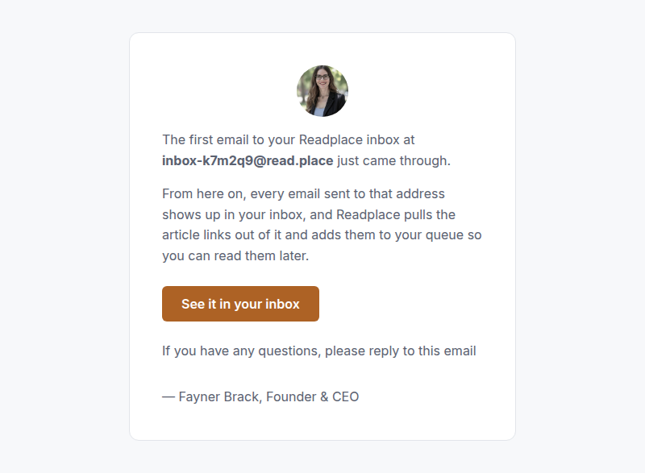</td>
<td valign="top">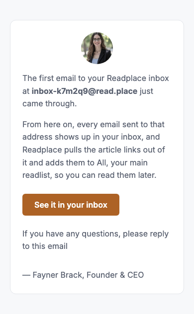</td>
</tr></table>

Exact HTML body: [`html/inbox-first-arrival--default.html`](html/inbox-first-arrival--default.html)

#### `custom-readlist-alias` — A newsletter sent to the custom address longreads-p4n8z2@read.place, which the reader routed to their 'Long reads' readlist; the email goes out when the links are handed to that readlist's filter, before anything is saved.

Subject: **Your first email landed in your Readplace inbox** · To: `sam.reader@gmail.com`

<details><summary>Example inputs</summary>

```json
{
  "env": {
    "APP_ORIGIN": "https://readplace.com",
    "STATIC_BASE_URL": "https://static.readplace.com",
    "founderAvatarUrl": "https://static.readplace.com/fayner-brack.jpg",
    "inboxAddressDomain": "read.place"
  },
  "customer": {
    "userId": "9c4e1f7a2b3d48e6a05f6c7d8e9b0a12",
    "email": "sam.reader@gmail.com",
    "subscriptionRow": {
      "userId": "9c4e1f7a2b3d48e6a05f6c7d8e9b0a12",
      "provider": "stripe",
      "status": "trialing",
      "trialEndsAt": "2026-10-17T21:05:44.000Z",
      "createdAt": "2026-10-03T21:05:44.000Z",
      "updatedAt": "2026-10-03T21:05:44.000Z"
    },
    "onboardingRowBefore": "no firstInboxEmailNoticeSentAt"
  },
  "inboxAddress": {
    "address": "longreads-p4n8z2@read.place",
    "purpose": "user-alias",
    "readlist": {
      "slug": "3f9a1c7e5b2d8046",
      "label": "Long reads"
    }
  },
  "source": {
    "kind": "ses",
    "sesMessageId": "k1d8s3f0a6g2h9j4lambda7q5w1e8r3t0y6u2i9a",
    "rawEmailS3Key": "inbound/k1d8s3f0a6g2h9j4lambda7q5w1e8r3t0y6u2i9a",
    "sesReceivedAt": "2026-10-05T07:42:19.204Z"
  },
  "newsletter": {
    "from": "longreadweekly@substack.com",
    "subject": "Five essays worth your Monday",
    "messageId": "<20261005074211.3.8f2c4a91d7e6b035@mg-d1.substack.com>",
    "dateHeader": "Mon, 05 Oct 2026 07:42:11 +0000",
    "articleLinks": [
      "https://www.theatlantic.com/technology/archive/2026/10/the-quiet-death-of-the-bookmark/680112/",
      "https://aeon.co/essays/what-slow-reading-does-to-a-restless-mind"
    ]
  },
  "emailReceivedEventDetail": {
    "userId": "9c4e1f7a2b3d48e6a05f6c7d8e9b0a12",
    "receivedAtMessageId": "2026-10-05T07:42:19.204Z#<20261005074211.3.8f2c4a91d7e6b035@mg-d1.substack.com>",
    "recipientAddress": "longreads-p4n8z2@read.place",
    "routing": {
      "kind": "inbox"
    },
    "origin": "receive"
  },
  "extractLambdaNow": "2026-10-05T07:42:21.493Z",
  "inboxLambdaPublishes": [
    "CrawlEmailLinkPreview",
    "CrawlEmailLinkPreview",
    "EmailLinksTriaged",
    "SendFirstInboxEmailNoticeCommand"
  ],
  "sendFirstInboxEmailNoticeCommand": {
    "source": "hutch.inbox",
    "detailType": "SendFirstInboxEmailNoticeCommand",
    "detail": {
      "userId": "9c4e1f7a2b3d48e6a05f6c7d8e9b0a12",
      "receivedAtMessageId": "2026-10-05T07:42:19.204Z#<20261005074211.3.8f2c4a91d7e6b035@mg-d1.substack.com>",
      "inboxAddress": "longreads-p4n8z2@read.place"
    }
  },
  "handlerNow": "2026-10-05T07:42:26.517Z",
  "hutchLogLines": [
    {
      "level": "info",
      "message": "[send-first-inbox-email-notice] sent"
    },
    {
      "level": "info",
      "message": "[send-first-inbox-email-notice] already sent — noop"
    }
  ]
}
```

</details>


Exact HTML body: [`html/inbox-first-arrival--custom-readlist-alias.html`](html/inbox-first-arrival--custom-readlist-alias.html)

### Source

- `projects/hutch/src/runtime/web/auth/inbox-first-arrival-email.ts:35` — renderer: subject constant, copy, HTML and plain text
- `projects/hutch/src/runtime/web/auth/inbox-first-arrival-email.template.html:1` — HTML template
- `projects/hutch/src/runtime/send-first-inbox-email-notice/send-first-inbox-email-notice-handler.ts:46` — handler: access and email checks, marker claim, From/BCC/Reply-To, send
- `projects/hutch/src/runtime/send-first-inbox-email-notice.main.ts:40` — composition root: Resend wrapped by the reserved-domain filter
- `projects/hutch/src/runtime/providers/email/resend-email.ts:9` — sender: Resend API call
- `src/packages/onboarding-signals/src/dynamodb-onboarding-signals.ts:175` — once-only marker firstInboxEmailNoticeSentAt
- `projects/inbox/src/runtime/domain/inbox/extract-email-links-handler.ts:399` — publisher of SendFirstInboxEmailNoticeCommand
- `projects/hutch/src/infra/index.ts:1220` — trigger infra: SQS queue, Lambda and EventBridge subscription

## 12. Gmail newsletter notice

**Integrations** · Readplace users with a connected Gmail account (account email recorded, not revoked, no disconnect pending) and at least one readlist besides All, whose mailbox gets mail from an approved catalog newsletter they have not mapped to readlists; forwarding confirmation is not required.

### When it is sent

Every 6 hours Readplace checks each connected Gmail account using message metadata only. When an approved catalog newsletter the reader has not mapped to readlists sends a new message, or a sender Readplace has already seen as unapproved becomes approved, Readplace records a notice for that sender address. At the end of the check it sends the reader one email listing every newsletter waiting for a notice. It sends at most one such email every 3 days, and it holds notices while All is the reader's only readlist. The first check of a newly connected Gmail account only records what is already in the mailbox; it sends a notice only for an approved, unmapped newsletter whose mail arrives while that first check is running. Each reader hears about each sender address at most once, and there are no reminders.

Trigger chain:

1. EventBridge Scheduler sends CheckGmailNewsletters to the gmail-newsletter-monitor queue every 6 hours `projects/hutch/src/infra/index.ts:1475`
2. The monitor Lambda lists connected Gmail accounts 25 per page and dispatches one MonitorGmailNewsletters command per user `projects/hutch/src/runtime/domain/gmail/gmail-newsletter-monitor-handler.ts:43`
3. start() opens a new run, or resumes an unfinished one; a Gmail account not seen before starts an initializing (silent) run `projects/hutch/src/runtime/domain/gmail/monitor-gmail-newsletters.ts:118`
4. The run pages through its modes; the arrivals page reads Gmail history messageAdded since the stored cursor `projects/hutch/src/runtime/domain/gmail/monitor-gmail-newsletters.ts:89`
5. For every sender seen, the monitor sets notify when the sender is approved, unmapped and either newly mailed or newly approved `projects/hutch/src/runtime/domain/gmail/monitor-gmail-newsletters.ts:57`
6. The store writes a pending NOTICE#<sender> row when no notice exists or the old one was cancelled `src/packages/inbox-store/src/dynamodb-gmail-monitoring.ts:74`
7. The final notices pages list pending and sending notices 25 at a time, and each page that finds any dispatches one SendGmailNewsletterNotice naming only the user straight onto the notice queue `projects/hutch/src/runtime/domain/gmail/gmail-newsletter-monitor-handler.ts:53`
8. The notice Lambda lists all of the reader's notices and the reader's NOTICE_BATCH row, and holds the pending notices while the last notice email went out under 3 days ago or All is the reader's only readlist `projects/hutch/src/runtime/domain/gmail/send-gmail-newsletter-notice-handler.ts:167`, `projects/hutch/src/runtime/domain/gmail/send-gmail-newsletter-notice-handler.ts:134`
9. Otherwise it re-checks each pending notice, cancels the ineligible ones, renders one email for the rest, claims the NOTICE_BATCH row, sends through Resend, marks each listed notice sent, publishes one sent fact per sender and records the send time `projects/hutch/src/runtime/domain/gmail/send-gmail-newsletter-notice-handler.ts:144`, `projects/hutch/src/runtime/domain/gmail/send-gmail-newsletter-notice-handler.ts:76`

Sent only when:

- Gmail is connected with a recorded account email, is not revoked and has no disconnect request; forwarding confirmation is not required `projects/hutch/src/runtime/domain/gmail/monitor-gmail-newsletters.ts:35`
- The sender address is approved in the live newsletter catalog: its own record is approved, or it has no record of its own and an approved *@domain wildcard covers it `src/packages/domain/src/newsletter-catalog/newsletter-detector.ts:59`
- The user has not mapped the sender to readlists when the check sees it `projects/hutch/src/runtime/domain/gmail/monitor-gmail-newsletters.ts:57`
- A qualifying event happened: a new message from the sender arrived in Gmail after the stored history cursor, or a sender previously observed as unapproved is now approved `projects/hutch/src/runtime/domain/gmail/monitor-gmail-newsletters.ts:57`
- No notice for this user and sender address has been sent or is in flight; a cancelled one can be re-created `src/packages/inbox-store/src/dynamodb-gmail-monitoring.ts:74`
- The notice is still pending or sending when a check reaches its final notices page `projects/hutch/src/runtime/domain/gmail/monitor-gmail-newsletters.ts:105`
- The reader has at least one readlist besides All (a readlist definition in the user-articles table) `projects/hutch/src/runtime/domain/gmail/send-gmail-newsletter-notice-handler.ts:140`
- The reader's last notice email went out at least 3 days ago (GMAIL_NEWSLETTER_NOTICE_INTERVAL_DAYS), or the reader has no NOTICE_BATCH row yet; the batch claim enforces the same rule `projects/hutch/src/runtime/domain/gmail/send-gmail-newsletter-notice-handler.ts:134`, `src/packages/inbox-store/src/dynamodb-gmail-monitoring.ts:128`
- At send time the connection still matches the notice: same Readplace inbox address for Gmail, same Gmail account, same mailbox, not revoked and no disconnect request `projects/hutch/src/runtime/domain/gmail/send-gmail-newsletter-notice-handler.ts:92`
- At send time the sender is still unmapped `projects/hutch/src/runtime/domain/gmail/send-gmail-newsletter-notice-handler.ts:94`
- At send time the catalog still approves the sender and the user still has a Readplace account email `projects/hutch/src/runtime/domain/gmail/send-gmail-newsletter-notice-handler.ts:94`
- An already-claimed email is resent only while one of its listed notices is still pending (or, for a notice claimed before grouping, while it is still sending) and less than 23h55m has passed since its first attempt `projects/hutch/src/runtime/domain/gmail/send-gmail-newsletter-notice-handler.ts:126`, `projects/hutch/src/runtime/domain/gmail/send-gmail-newsletter-notice-handler.ts:153`

Not sent when:

- The first check of a newly connected Gmail account, or of a different Gmail account after switching, is silent: approved senders already in the mailbox, including mail that arrived between connecting and that check, send nothing; mail arriving while that check runs still counts `projects/hutch/src/runtime/domain/gmail/monitor-gmail-newsletters.ts:54`
- Once only per user and sender address: after a notice is sent, later issues and approvals never send another, even after disconnecting, reconnecting or switching Gmail accounts; only account deletion clears the receipt `src/packages/inbox-store/src/dynamodb-gmail-monitoring.ts:74`
- Held while the reader's last notice email went out under 3 days ago: pending notices are not cancelled and nothing is published, and they go out together at the first check at least 3 days after that email; ineligible notices are not cancelled during the hold `projects/hutch/src/runtime/domain/gmail/send-gmail-newsletter-notice-handler.ts:134`
- Held while All is the reader's only readlist (no readlist definitions): pending notices are not cancelled and nothing is published, every 6-hourly check re-dispatches and logs the hold, and the notices go out at the first check after the reader creates another readlist `projects/hutch/src/runtime/domain/gmail/send-gmail-newsletter-notice-handler.ts:140`
- The user mapped the sender: no notice is created, and a pending notice is cancelled at send time `projects/hutch/src/runtime/domain/gmail/send-gmail-newsletter-notice-handler.ts:94`
- Gmail was disconnected, revoked, reconnected with a new Readplace inbox address, or switched to another Gmail account or mailbox before sending: a pending notice is cancelled `projects/hutch/src/runtime/domain/gmail/send-gmail-newsletter-notice-handler.ts:92`
- The sender is no longer approved at send time (rejected, withdrawn, removed, or overridden by its own non-approved record), or the user has no account email: a pending notice is cancelled `projects/hutch/src/runtime/domain/gmail/send-gmail-newsletter-notice-handler.ts:94`
- Messages that never count: spam, trash and drafts, mail the user sent (SENT without INBOX), messages deleted before Readplace reads them, and label changes `projects/hutch/src/runtime/providers/gmail-api/gmail-mailbox.ts:126`
- Reserved recipient domains (exactly example.com, example.net or example.org, or a final label of test, example, invalid or localhost) are logged and not sent, yet every listed notice is still marked sent and the 3-day interval starts `projects/hutch/src/runtime/providers/email/skip-reserved-domain.ts:32`
- A delivery still unresolved 23h55m after its first attempt (a batch with a listed notice still pending, or a notice claimed before grouping) is never resent; the record fails into the DLQ for manual review `projects/hutch/src/runtime/domain/gmail/send-gmail-newsletter-notice-handler.ts:127`, `projects/hutch/src/runtime/domain/gmail/send-gmail-newsletter-notice-handler.ts:153`

**Timing:** An EventBridge Scheduler runs the Gmail check every 6 hours (rate(6 hours), flexible window off). When the reader's last notice email went out at least 3 days ago and they have a readlist besides All, the email goes out seconds to minutes after the check that first sees the arrival or approval, so up to about 6 hours plus processing after the issue lands or the sender is approved. Otherwise the notice is held: within 3 days of the last notice email it goes, grouped with any others, at the first check at least 3 days after that email finished sending (between 3 days and about 3 days 6 hours after it; a batch settled late after failed bookkeeping restarts the 3 days from the settle), and for a reader whose only readlist is All at the first check after they create another readlist. Connecting Gmail does not start a check, no SQS hop is delayed on purpose, and there are no reminders.

**If sending fails:** A failed notice command is retried by SQS every 180 seconds for up to 12 receives (about 36 minutes), then moves to the gmail-newsletter-notice DLQ, whose alarm emails the alert address; retries reuse the message, sender list and Resend idempotency key stored on the reader's NOTICE_BATCH row (or on the notice, for a claim made before grouping), and after 23h55m from the first attempt the handler refuses to resend. Only a batch with a listed notice still pending is resent; a batch whose email already went out (no listed notice still pending, for example when publishing the sent facts failed) is settled by the next command for that reader without resending and with no time limit, publishing sent for the listed notices marked sent and finishing the batch. Every 6-hourly check also re-dispatches a command for each reader with notices still pending or sending, which recovers lost commands and sends held notices once the hold ends.

<details><summary>Edge cases</summary>

- An expired Gmail history cursor (HTTP 404) makes the next check rescan the whole mailbox with no 5,000-message cap, and any approved, unmapped sender whose newest message is at or after the last completed check gets a notice; large mailboxes take many pages `projects/hutch/src/runtime/domain/gmail/monitor-gmail-newsletters.ts:91`
- Senders read from the sender-discovery cache carry no message dates, so on their own they can only cause an approval notice, never a new-message notice `src/packages/inbox-store/src/dynamodb-gmail-discovery.ts:89`
- When a sender has its own catalog record, that record alone decides: a pending or rejected exact record blocks the email even under an approved *@domain wildcard `src/packages/domain/src/newsletter-catalog/newsletter-detector.ts:40`
- Catalog records replaced by a correction (replacedBy set) are ignored `src/packages/domain/src/newsletter-catalog/newsletter-detector.ts:54`
- Notices are keyed by the lowercased FROM address, so a wildcard-approved newsletter that mails from several addresses gets one notice per address: separate entries in one grouped email, or separate emails when they become due more than 3 days apart `src/packages/inbox-store/src/dynamodb-gmail-monitoring.ts:80`
- A sender silently recorded as approved can still trigger a notice later if it is seen unapproved and then approved again, for example withdrawn, reconsidered and re-approved `projects/hutch/src/runtime/domain/gmail/monitor-gmail-newsletters.ts:55`
- A retry after an ambiguous send, while any listed notice is still pending, resends the stored email unchanged without re-checking eligibility, keeping the original recipient, subject, newsletter list and links even if the catalog name, account email or mappings changed, and marks every stored sender sent `projects/hutch/src/runtime/domain/gmail/send-gmail-newsletter-notice-handler.ts:126`
- A batch whose email went out but whose bookkeeping failed past its SQS retries (every listed notice marked sent, batch still sending) stays unfinished until another command arrives for that reader; checks dispatch only for pending or sending notices, so without a DLQ redrive that is when another of their notices becomes pending, and that command settles the batch, starts the 3-day interval then and returns, so the new notice waits 3 more days from the settle `projects/hutch/src/runtime/domain/gmail/send-gmail-newsletter-notice-handler.ts:131`, `projects/hutch/src/runtime/domain/gmail/monitor-gmail-newsletters.ts:105`
- Settling a delivered batch does not wait for the 120-second batch lease, so a duplicate command arriving after the listed notices are marked sent but before the first worker finishes publishes the sent facts a second time (inferred from code) `projects/hutch/src/runtime/domain/gmail/send-gmail-newsletter-notice-handler.ts:131`
- A stale or duplicate monitoring page, or waiting notices spread over several 25-row notices pages, dispatches several commands for the same reader; the 120-second batch lease and the 3-day interval stop a second email `projects/hutch/src/runtime/domain/gmail/monitor-gmail-newsletters.ts:65`, `projects/hutch/src/runtime/domain/gmail/gmail-newsletter-monitor-handler.ts:53`
- When another worker holds the reader's 120-second batch lease, or finished a batch within 3 days after this worker read the row, the claim is refused, the record fails and SQS retries it `projects/hutch/src/runtime/domain/gmail/send-gmail-newsletter-notice-handler.ts:78`
- A catalog read error other than a missing object fails the record in both the monitor and the notice worker, and the notice stays pending for retry `projects/hutch/src/runtime/domain/gmail/send-gmail-newsletter-notice-handler.ts:85`
- Gmail errors: re-authorisation required marks the connection revoked, a missing metadata permission or other rejection ends the page without saving, and only HTTP 429 or 5xx throws for an SQS retry; the next 6-hourly check resumes the unfinished run while the connection is active `projects/hutch/src/runtime/domain/gmail/monitor-gmail-newsletters.ts:39`
- Only the deployed gmail-newsletter-notice Lambda sends this email; there is no local or dev path, and staging and production both send through Resend with that stage's RESEND_API_KEY `projects/hutch/src/infra/index.ts:1398`
- The rate(6 hours) schedule runs at times set by when it was created, not at fixed clock hours (AWS behaviour, unverified from the repo) `projects/hutch/src/infra/index.ts:1475`
- The recipient is the Readplace account email, which can differ from the connected Gmail address; for a Sign in with Apple user it may be an Apple private-relay address (unverified) `projects/hutch/src/runtime/providers/auth/dynamodb-auth.ts:431`
- Newsletter names appear raw in the subject and plain text but HTML-escaped everywhere in the HTML, including the title, opening, list and footer ("Energy & Capital" becomes Energy &amp; Capital in the HTML source) `projects/hutch/src/runtime/web/auth/gmail-newsletter-notice-email.template.html:6`, `projects/hutch/src/runtime/web/auth/gmail-newsletter-notice-email.template.html:31`
- The 3-day interval belongs to the Readplace reader and survives disconnecting, reconnecting or switching Gmail accounts; only account deletion removes the NOTICE_BATCH row `src/packages/inbox-store/src/dynamodb-gmail-monitoring.ts:143`
- The 3-day interval counts only emails sent since grouping: a reader notified one sender at a time before the deploy has no NOTICE_BATCH row and can get a grouped email at the next check, and resending a claim made before grouping does not start the interval (inferred from code) `projects/hutch/src/runtime/domain/gmail/send-gmail-newsletter-notice-handler.ts:134`
- A SendGmailNewsletterNotice queued before grouping still names one sender; the schema drops senderEmail and the worker handles the whole reader `src/packages/hutch-infra-components/src/events.ts:1313`

</details>

> **Observations**
>
> - Reconnecting the same Gmail account is not silent: disconnect deletes the mappings but keeps the monitoring cursor, so the next check resumes from the old cursor and notifies every approved sender that mailed while disconnected, including senders the user had mapped before; a probe of the real chain confirmed it, and whether notifying formerly mapped senders is intended needs confirming `projects/hutch/src/runtime/domain/gmail/disconnect-gmail.ts:42`, `projects/hutch/src/runtime/domain/gmail/monitor-gmail-newsletters.ts:124`
> - Re-authorising a revoked connection keeps the Readplace inbox address and resumes the halted run, so a backlog of mail since the old cursor can notify at once `projects/hutch/src/runtime/web/pages/integrations/gmail-connect.page.ts:205`
> - Notices claimed one by one before grouping are resent with no eligibility re-check, so one whose reader has since mapped the sender, disconnected Gmail or lost catalog approval still goes out within 23h55m of its first attempt, possibly in the same run as a grouped email (inferred from code) `projects/hutch/src/runtime/domain/gmail/send-gmail-newsletter-notice-handler.ts:150`
> - A NOTICE_BATCH row still sending with a listed notice still pending 23h55m after its first attempt fails every later command for that reader into the DLQ again, a repeating DLQ alarm on every 6-hourly check, and blocks every further notice email to that reader, not just one sender, until someone fixes the row (a batch whose listed notices were all marked sent is settled instead); a claim made before grouping that passes the window also fails every command for that reader, after the grouped pass; the SQS budget (about 36 minutes) is far shorter than that window (inferred from code) `projects/hutch/src/runtime/domain/gmail/send-gmail-newsletter-notice-handler.ts:127`, `projects/hutch/src/runtime/domain/gmail/send-gmail-newsletter-notice-handler.ts:153`
> - A missing catalog object is read as an empty catalog, which cancels pending notices and records every sender as unapproved; restoring it turns every approved, unmapped observed sender without a receipt into an approval notice at once, contrary to the design doc (inferred, not observed) `projects/hutch/src/runtime/providers/newsletter-catalog/s3-newsletter-catalog.ts:35`, `.architecture/2026-10-04-f532f07f0/gmail-newsletter-notifications.md:96`
> - Reserved-domain recipients are marked sent, publish outcome sent and start the 3-day interval although nothing was sent, so receipts and metrics overcount `projects/hutch/src/runtime/domain/gmail/send-gmail-newsletter-notice-handler.ts:70`
> - The email has no unsubscribe link, no List-Unsubscribe header and no opt-out preference (the footer only says why it was sent), and the handler does not check membership or trial status, email verification, account lock or pending deletion; confirm this suits a non-transactional product notice `projects/hutch/src/runtime/domain/gmail/send-gmail-newsletter-notice-handler.ts:115`
> - Account deletion erases monitoring before Gmail teardown; if teardown fails and the job redrives, a fresh check could email a user who asked for deletion (inferred, low probability) `projects/hutch/src/runtime/delete-account/delete-account-handler.ts:156`
> - A notice claimed by build 508b6d7 would be resent with the old subject "Choose a readlist for ..." and a link without readlist_choice_for, and any notice claimed one by one before grouping is resent with its build's From and copy and no footer; whether that build was deployed is unverified `projects/hutch/src/runtime/domain/gmail/send-gmail-newsletter-notice-handler.test.ts:215`
> - An EventBridge rule routes SendGmailNewsletterNotice to the notice queue but nothing publishes that command on the bus, and GmailNewsletterNoticeProcessedEvent has no subscriber `projects/hutch/src/infra/index.ts:1415`
> - Cosmetic: the shared reply invitation has no trailing period, and the CTA and newsletter-list hrefs show '=' as &#x3D;, which email clients decode `projects/hutch/src/runtime/web/email-copy.ts:2`

### Message

| Field | Value |
|---|---|
| From | `Readplace <readplace@readplace.com>` |
| To | The user's Readplace account email from the users table (findEmailByUserId), not the connected Gmail address |
| Bcc | none |
| Reply-To | `fayner@readplace.com` |
| Subject | Choose readlists for {newsletterName} — the email lists one newsletter and the deciding approved catalog record (the sender's own record, or the *@domain wildcard when it has none) has a name; names are trimmed, 1 to 80 characters, and appear unescaped<br>Choose readlists for {senderEmail} — the email lists one newsletter and the deciding approved record has no name, for example a reader-submitted record approved without a name<br>Choose readlists for {N} newsletters — the email lists two or more newsletters that were due together; N is how many it lists<br>Choose a readlist for {newsletterName or senderEmail} — only when resending a message first claimed by the superseded build 508b6d7 (in the repo on 2026-10-04 from 08:06Z to 11:10Z; whether it was deployed is unverified) and still unresolved within 23h55m of its first attempt |
| Headers | none |
| Plain-text part | Yes: the same component builds plain text. For one newsletter: the opening line, the paragraph, "Choose readlists: {url}", the reply invitation, the signoff and the footer. For several: the intro line, one "{name} ({address}): {url}" or "{address}: {url}" line per newsletter, the paragraph, "Choose readlists: {Gmail newsletters page url}", the reply invitation, the signoff and the footer. |
| Idempotency key | gmail-newsletter/{sha256 hex of JSON.stringify([userId, ...senderEmails])}, with the senders in the email's order (sorted by name or address); for one newsletter this is the same key as before grouping |

Content variants:

| Variant | Shown when |
|---|---|
| named-newsletter | One eligible newsletter is due and the deciding approved record has a name: subject "Choose readlists for {newsletterName}", opening "Readplace recognizes {newsletterName} in your Gmail: {senderEmail}. It is ready to connect to your readlists." with the address in bold, the button selecting that sender, and the footer "You are receiving this email because you haven't mapped this newsletter to a readlist. This is a one-time notification for {newsletterName}." |
| unnamed-sender | One eligible newsletter is due and the deciding approved record has no name (a reader-submitted record approved without a name, an unnamed *@domain wildcard or a record auto-approved under one, or a name cleared by an admin edit): subject "Choose readlists for {senderEmail}", opening "Readplace recognizes this newsletter in your Gmail: {senderEmail}. ...", and the footer ends "This is a one-time notification for {senderEmail}." |
| grouped | Two or more eligible newsletters are due when the email is built, usually after the 3-day interval or the All-only hold kept them waiting: subject "Choose readlists for {N} newsletters", intro "Readplace recognizes {N} newsletters in your Gmail that are ready to connect to your readlists:", then every eligible newsletter with no cap, sorted by name or address, each name and the address beneath it linking to that newsletter's readlist choice (an unnamed one shows only its address), the button opening /newsletters/gmail with no sender selected (utm_content=choose-readlists), and the footer "You are receiving this email because you haven't mapped these newsletters to a readlist. This is a one-time notification for each of them." |
| persisted-payload-resend | A claim already holds a message from an earlier ambiguous attempt and at least one of its listed notices is still pending: that stored message is resent exactly, including its original recipient, subject and links. The reader's NOTICE_BATCH row holds a single or grouped email; a batch whose listed notices are all already marked sent is settled without resending. A notice claimed one by one by a build before grouping is resent on its own, with that build's From and copy and no footer. One stored by build 508b6d7 has subject "Choose a readlist for ..." and no readlist_choice_for in the link (not captured, the current template cannot produce it). |

### Example

#### `named-newsletter` — JavaScript Weekly (jsw@peterc.org) is an admin-approved catalog record with a name: a new issue arrived after the silent first check, the next check sent this email with the name in the subject and opening, and a later issue sent nothing.

Subject: **Choose readlists for JavaScript Weekly** · To: `sam.reader@gmail.com`

<details><summary>Example inputs</summary>

```json
{
  "APP_ORIGIN": "https://readplace.com",
  "STATIC_BASE_URL": "https://static.readplace.com",
  "founderAvatarUrl": "https://static.readplace.com/fayner-brack.jpg",
  "readplaceUserId": "4f9c2e7a1b3d58e6c0a7f2d9b4e1c6a8",
  "readplaceAccountEmail": "sam.reader@gmail.com",
  "connectedGmailAccount": "sam.reader@gmail.com",
  "gmailGatewayAddress": "gmail-q7k2xm@read.place",
  "readplaceReadlists": [
    "All",
    "Engineering"
  ],
  "schedulerInput": {
    "detail-type": "CheckGmailNewsletters",
    "detail": {}
  },
  "trigger": "new arrival (Gmail history messageAdded) from approved unmapped sender",
  "catalogRecord": {
    "from": "jsw@peterc.org",
    "name": "JavaScript Weekly",
    "status": "approved",
    "match": "exact"
  },
  "gmailConnectedAt": "2026-10-02T09:14:00Z",
  "jswMessageArrivedAt": "2026-10-04T21:30:00Z",
  "scheduledChecks": [
    "2026-10-02T12:00:00Z (initial silent baseline)",
    "2026-10-05T00:00:00Z (arrival -> notice sent)",
    "2026-10-05T06:00:00Z (another jsw@peterc.org message -> no email, sent receipt)"
  ],
  "sqsNoticeBody": {
    "detail": {
      "userId": "4f9c2e7a1b3d58e6c0a7f2d9b4e1c6a8"
    }
  },
  "noticeProcessedFacts": [
    {
      "userId": "4f9c2e7a1b3d58e6c0a7f2d9b4e1c6a8",
      "senderEmail": "jsw@peterc.org",
      "outcome": "sent"
    }
  ]
}
```

</details>

<table><tr><th>Desktop (800px)</th><th>Phone (390px)</th></tr><tr>
<td valign="top">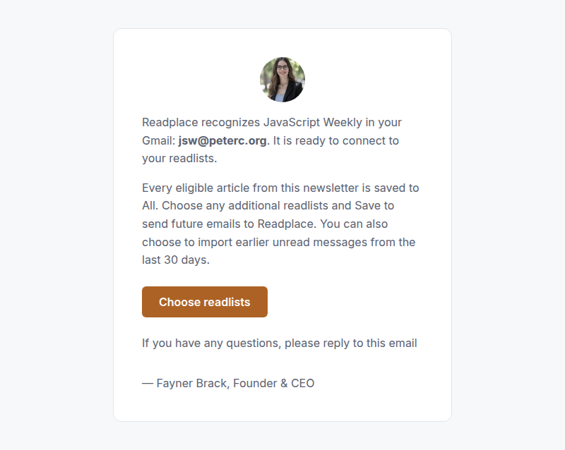</td>
<td valign="top">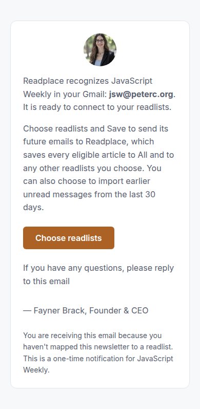</td>
</tr></table>

Exact HTML body: [`html/gmail-newsletter-notice--named-newsletter.html`](html/gmail-newsletter-notice--named-newsletter.html)

#### `unnamed-sender` — lenny@substack.com is a reader-submitted record that an admin approved without a name: the reconcile phase found the approval and sent this email with the address in the subject and "this newsletter" in the opening.

Subject: **Choose readlists for lenny@substack.com** · To: `sam.reader@gmail.com`

<details><summary>Example inputs</summary>

```json
{
  "APP_ORIGIN": "https://readplace.com",
  "STATIC_BASE_URL": "https://static.readplace.com",
  "founderAvatarUrl": "https://static.readplace.com/fayner-brack.jpg",
  "readplaceUserId": "4f9c2e7a1b3d58e6c0a7f2d9b4e1c6a8",
  "readplaceAccountEmail": "sam.reader@gmail.com",
  "connectedGmailAccount": "sam.reader@gmail.com",
  "gmailGatewayAddress": "gmail-q7k2xm@read.place",
  "readplaceReadlists": [
    "All",
    "Engineering"
  ],
  "schedulerInput": {
    "detail-type": "CheckGmailNewsletters",
    "detail": {}
  },
  "trigger": "catalog approval transition (observed sender went pending -> approved), reconcile phase",
  "catalogRecord": {
    "from": "lenny@substack.com",
    "status": "approved (was pending, user-submission)",
    "match": "exact"
  },
  "gmailConnectedAt": "2026-09-29T10:05:00Z",
  "scheduledChecks": [
    "2026-09-29T12:00:00Z (baseline; sender observed while pending)",
    "2026-10-05T00:00:00Z (approved 2026-10-04T21:47:33Z -> notice sent)"
  ],
  "sqsNoticeBody": {
    "detail": {
      "userId": "4f9c2e7a1b3d58e6c0a7f2d9b4e1c6a8"
    }
  },
  "noticeProcessedFacts": [
    {
      "userId": "4f9c2e7a1b3d58e6c0a7f2d9b4e1c6a8",
      "senderEmail": "lenny@substack.com",
      "outcome": "sent"
    }
  ]
}
```

</details>

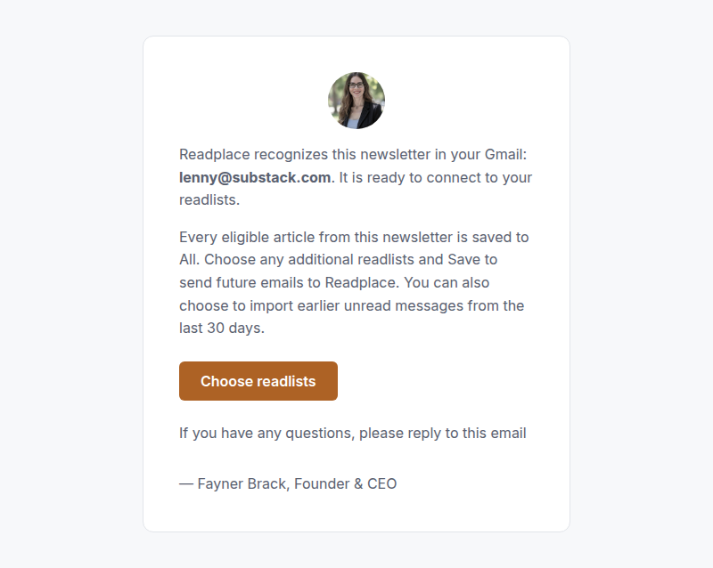

Exact HTML body: [`html/gmail-newsletter-notice--unnamed-sender.html`](html/gmail-newsletter-notice--unnamed-sender.html)

#### `grouped` — TLDR, Pointer and the unnamed lenny@substack.com became due within 3 days of the reader's single JavaScript Weekly notice, were held, and went out together at the first check 3 days later in this email, which lists them as lenny@substack.com, Pointer, TLDR, each linked to its own readlist choice.

Subject: **Choose readlists for 3 newsletters** · To: `sam.reader@gmail.com`

<details><summary>Example inputs</summary>

```json
{
  "APP_ORIGIN": "https://readplace.com",
  "STATIC_BASE_URL": "https://static.readplace.com",
  "founderAvatarUrl": "https://static.readplace.com/fayner-brack.jpg",
  "readplaceUserId": "4f9c2e7a1b3d58e6c0a7f2d9b4e1c6a8",
  "readplaceAccountEmail": "sam.reader@gmail.com",
  "connectedGmailAccount": "sam.reader@gmail.com",
  "gmailGatewayAddress": "gmail-q7k2xm@read.place",
  "readplaceReadlists": [
    "All",
    "Engineering"
  ],
  "schedulerInput": {
    "detail-type": "CheckGmailNewsletters",
    "detail": {}
  },
  "trigger": "new arrivals from approved unmapped senders, held by the three-day notice interval",
  "catalogRecords": [
    {
      "from": "dan@tldrnewsletter.com",
      "name": "TLDR",
      "status": "approved",
      "match": "exact"
    },
    {
      "from": "suraj@pointer.io",
      "name": "Pointer",
      "status": "approved",
      "match": "exact"
    },
    {
      "from": "lenny@substack.com",
      "status": "approved",
      "match": "exact"
    }
  ],
  "gmailConnectedAt": "2026-09-28T08:00:00Z",
  "scheduledChecks": [
    "2026-09-28T12:00:00Z (initial silent baseline)",
    "2026-10-01T00:00:00Z (JavaScript Weekly arrived -> single notice sent)",
    "2026-10-01T06:00:00Z (TLDR arrived -> held: last notice under 3 days ago)",
    "2026-10-02T12:00:00Z (Pointer and lenny@substack.com arrived -> held)",
    "2026-10-03T18:00:00Z (still held)",
    "2026-10-04T00:00:00Z (3 days since the last notice -> one grouped email)",
    "2026-10-04T06:00:00Z (nothing waiting -> no email)"
  ],
  "sqsNoticeBody": {
    "detail": {
      "userId": "4f9c2e7a1b3d58e6c0a7f2d9b4e1c6a8"
    }
  },
  "noticeProcessedFacts": [
    {
      "userId": "4f9c2e7a1b3d58e6c0a7f2d9b4e1c6a8",
      "senderEmail": "jsw@peterc.org",
      "outcome": "sent"
    },
    {
      "userId": "4f9c2e7a1b3d58e6c0a7f2d9b4e1c6a8",
      "senderEmail": "lenny@substack.com",
      "outcome": "sent"
    },
    {
      "userId": "4f9c2e7a1b3d58e6c0a7f2d9b4e1c6a8",
      "senderEmail": "suraj@pointer.io",
      "outcome": "sent"
    },
    {
      "userId": "4f9c2e7a1b3d58e6c0a7f2d9b4e1c6a8",
      "senderEmail": "dan@tldrnewsletter.com",
      "outcome": "sent"
    }
  ]
}
```

</details>

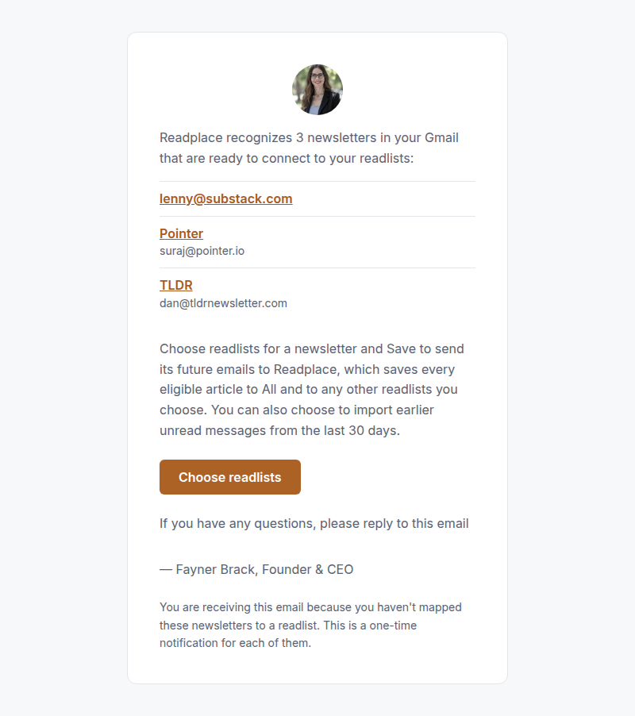

Exact HTML body: [`html/gmail-newsletter-notice--grouped.html`](html/gmail-newsletter-notice--grouped.html)

### Source

- `projects/hutch/src/runtime/domain/gmail/send-gmail-newsletter-notice-handler.ts:123` — notice handler: batch resend or settle, and holds (:124-143), eligibility checks (:83-102), grouped message with from, to, subject and idempotency key (:104-121), batch claim, send, mark sent and finish (:70-81), resends of claims made before grouping (:150-159)
- `projects/hutch/src/runtime/web/auth/gmail-newsletter-notice-email.ts:44` — renderer for HTML and plain text: single layout with named or unnamed opening (:21), grouped layout (:35), both footers; it hands the template the opening and the list as zero-or-one-item lists (:53, :71)
- `projects/hutch/src/runtime/web/auth/gmail-newsletter-notice-email.template.html:30` — HTML template: the single opening (:31) and the grouped list (:33-46) render from zero-or-one-item lists rather than {{#if}} branches; CTA at :51; footer at :57
- `projects/hutch/src/runtime/domain/gmail/gmail-newsletter-notice-cadence.ts:1` — GMAIL_NEWSLETTER_NOTICE_INTERVAL_DAYS (3)
- `projects/hutch/src/runtime/gmail-newsletter-notice.main.ts:24` — composition root wiring Resend behind the reserved-domain skip; readlist definitions at :31
- `projects/hutch/src/runtime/providers/email/resend-email.ts:9` — Resend sender; idempotency key passed at :18
- `projects/hutch/src/runtime/domain/gmail/monitor-gmail-newsletters.ts:57` — monitoring decides when a notice is created
- `projects/hutch/src/runtime/domain/gmail/gmail-newsletter-monitor-handler.ts:53` — one notice command per monitoring page with waiting notices
- `src/packages/inbox-store/src/dynamodb-gmail-monitoring.ts:104` — notice claim, sent receipt and cancel in DynamoDB; NOTICE_BATCH find, claim and finish at :123-142
- `projects/hutch/src/infra/index.ts:1474` — 6-hourly schedule; notice queue and Lambda at :1382; readlist-definitions read grant at :1378

## 13. Data export ready

**Your data** · Any signed-in Readplace customer who requests an export on the website, whether they are on a trial, a membership, lapsed, read-only, or locked for an unverified email.

### When it is sent

A signed-in customer opens Export Your Data (/export) from Export my data on the Account page or from the Privacy page, and clicks Email Me My Data. Readplace queues a background job that collects every saved article across all their readlists into one JSON file, stores it in S3 and emails a download link to the account's address. The email normally arrives within seconds to a few minutes. Every click sends its own email, because nothing deduplicates or rate-limits requests.

Trigger chain:

1. The customer opens /export from the Account page or the Privacy page and clicks Email Me My Data, which posts to /export/start `projects/hutch/src/runtime/web/pages/export/export.template.html:29`
2. requireAuth lets the request through only when it carries a signed-in cookie session `projects/hutch/src/runtime/server.ts:1534`
3. The route reads the account's email address from the users table `projects/hutch/src/runtime/web/pages/export/export.page.ts:30`
4. The route publishes ExportUserDataCommand { userId, email, requestedAt } to EventBridge and redirects to /export?status=preparing `projects/hutch/src/runtime/web/pages/export/export.page.ts:37`
5. The rule export-user-data-command-rule delivers the command to SQS user-data-jobs-q, and the user-data-jobs Lambda picks it up with batch size 1 `projects/hutch/src/infra/index.ts:749`
6. The Lambda routes the command to the export handler, which reads every saved article across the customer's readlists, 500 per page, until a page comes back empty `projects/hutch/src/runtime/export-user-data/export-user-data-handler.ts:72`
7. The handler writes the JSON file to s3://hutch-user-exports-prod/exports/<userId>/<timestamp>.json and presigns a GET link with X-Amz-Expires=604800 `projects/hutch/src/runtime/providers/user-data-export/s3-user-data-export.ts:38`
8. The handler emails the link to the address carried in the command, then publishes UserDataExported `projects/hutch/src/runtime/export-user-data/export-user-data-handler.ts:110`

Sent only when:

- The customer is signed in on the website with a session cookie `projects/hutch/src/runtime/server.ts:1534`
- The customer clicks Email Me My Data on /export, and each click queues its own email `projects/hutch/src/runtime/web/pages/export/export.template.html:29`
- Account status does not matter: trial, membership, lapsed, read-only and locked (unverified past the 7-day window) accounts all qualify, because the route checks only sign-in and exporting is deliberately left open to locked accounts `projects/hutch/src/runtime/web/middleware/require-not-locked.middleware.ts:13`
- The account has an email address in the users table at the moment of the click `projects/hutch/src/runtime/web/pages/export/export.page.ts:31`
- The command publishes to EventBridge without error `projects/hutch/src/runtime/web/pages/export/export.page.ts:37`
- The worker reads every saved article across the customer's readlists without error; a customer with no saved articles still gets the email `projects/hutch/src/runtime/export-user-data/export-user-data-handler.ts:88`
- Reading the articles, uploading the file and sending all finish inside the 900 s Lambda timeout `projects/hutch/src/infra/index.ts:687`
- The JSON file uploads to S3 and the download link is signed `projects/hutch/src/runtime/providers/user-data-export/s3-user-data-export.ts:28`
- The address is not on a reserved test domain (example.com, example.net, example.org, or any .test, .example, .invalid or .localhost address) `projects/hutch/src/runtime/providers/email/skip-reserved-domain.ts:31`
- Resend accepts the message `projects/hutch/src/runtime/providers/email/resend-email.ts:19`

Not sent when:

- Not signed in: the click redirects to /login and nothing is queued. This includes a phone browser, opened from the iOS or Android app, that has no Readplace session `projects/hutch/src/runtime/server.ts:516`
- Banned IP address: the request gets a 403 before the app runs `projects/hutch/src/runtime/web/middleware/ban.ts:29`
- No email address found for the account: the customer lands back on /export with no error message and nothing is queued `projects/hutch/src/runtime/web/pages/export/export.page.ts:33`
- Reserved test domain: the send is skipped with the warning "[email] reserved recipient domain — not sent" `projects/hutch/src/runtime/providers/email/skip-reserved-domain.ts:33`
- A failure that repeats on every attempt, such as a saved article with no matching global article row, fails all 12 tries, so the command ends in the dead-letter queue and the customer never gets the email `src/packages/article-store/src/dynamodb-saved-article-store.ts:758`
- Repeat requests are never held back: there is no once-only marker, rate limit, unsubscribe or opt-out, so every click sends another email `projects/hutch/src/runtime/web/pages/export/export.page.ts:27`
- Deleting the account does not stop an export that is already queued, because the worker mails the address carried in the command without checking that the account still exists `projects/hutch/src/runtime/export-user-data/export-user-data-handler.ts:113`

**Timing:** No deliberate delay: the worker runs as soon as SQS delivers the command, so the email normally lands seconds to a few minutes after the click, and the run must finish within the 900 s Lambda timeout. A failed attempt is retried every 900 s (15 min) for up to 12 receives, so the last try is about 2 h 45 min after the click; the link nominally lasts 604,800 s (7 days), and the S3 lifecycle rule deletes the file 7 days after it is written.

**If sending fails:** If the address lookup or the EventBridge publish fails, the click returns a 500 error and nothing retries. Any worker failure (article store, S3, Resend or the follow-up event) reruns the whole export every 15 minutes for up to 12 receives, then moves the command to user-data-jobs-dlq, whose alarm emails ops at readplace+devops@readplace.com; the customer is never told.

<details><summary>Edge cases</summary>

- Only a cookie session counts: the session is read from the Cookie header, so the browser extension, MCP and the apps' bearer-token API calls cannot request an export `projects/hutch/src/runtime/server.ts:741`
- The iOS and Android apps show the Account page in an in-app sheet with the session cookie injected, but tapping Export my data there opens /export outside the app (Chrome first on iOS, the default browser on Android), so the export works only if that browser is signed in to Readplace `projects/native-apps/ios/App/ReaderNavigation.swift:43`, `projects/native-apps/android/app/src/main/kotlin/com/readplace/android/app/ReaderNavigation.kt:57`
- The session cookie is SameSite=Lax, so a form posted from another site arrives without it and is redirected to /login `src/packages/web-analytics/src/cookie-options.ts:6`
- Requests on the old hutch-app.com host get a 301 to readplace.com before any route runs, so a POST there never reaches /export/start `projects/hutch/src/runtime/server.ts:542`
- A malformed utm_* query value gets a 400 before the route runs; the page's own form always sends valid values `src/packages/web-analytics/src/utm-validation.middleware.ts:23`
- The recipient is the stored account address, lowercased and trimmed, with Gmail dots and +tags kept and never the Gmail canonical identity key: a signup as " Sam.Reader@Gmail.com" is mailed at "sam.reader@gmail.com" `src/packages/domain/src/user/email.ts:8`
- If the address lookup or the EventBridge publish throws, the customer sees the JSON body {"error":"Internal Server Error","statusCode":500} instead of the preparing page, and nothing retries `projects/hutch/src/runtime/web/middleware/error-handler.ts:33`
- If EventBridge cannot deliver the command to the queue, it applies its default retry policy and then sends the event to the target's dead-letter queue, user-data-jobs-dlq `src/packages/hutch-infra-components/src/infra/event-bus.ts:89`
- The worker runs only if its whole composition root initialises: about 40 required environment variables, including unrelated Stripe, Apple and Gmail secrets, plus an assert that the Apple key decodes to a PKCS#8 PEM. Any failure there fails every export `projects/hutch/src/runtime/user-data-jobs.main.ts:184`
- A malformed message body, a detail that fails the schema, or an unknown detail-type is retried until the dead-letter queue and never emailed `projects/hutch/src/runtime/handle-by-detail-type.ts:24`
- A retry after a successful send reruns the whole export and sends a second email with a new file and link. This happens when publishing UserDataExported fails, or when Resend returns an ambiguous 5xx after accepting the message, because no idempotency key is passed `projects/hutch/src/runtime/export-user-data/export-user-data-handler.ts:126`
- Export and account deletion share the unordered user-data-jobs-q queue. If deletion runs first, the export still emails the deleted account's address, typically reporting 0 articles; if the export runs first, deletion removes the file and the emailed link stops working `projects/hutch/src/runtime/delete-account/delete-account-handler.ts:184`
- Local dev with PERSISTENCE=development and the e2e server use an in-memory publisher that only logs, so no email goes out; a dev server with PERSISTENCE=prod publishes to the real event bus, and whichever stack's worker consumes it sends a real email `projects/hutch/src/runtime/dev-app.ts:15`

</details>

> **Observations**
>
> - The "7 days" promise may not hold (unverified): the worker presigns the link with the Lambda role's temporary credentials, so the URL carries X-Amz-Security-Token, and AWS stops honouring such a URL when those credentials expire, likely within hours. The email, the /export page, the preparing page and the Privacy page all promise 7 days `projects/hutch/src/runtime/user-data-jobs.main.ts:52`
> - A failed export is invisible to the customer. They have already seen "I'm preparing your export. Check your inbox shortly.", and when every retry fails only ops hear about it, through the dead-letter alarm email `projects/hutch/src/runtime/web/pages/export/export-preparing.template.html:5`
> - Duplicate emails are possible: /export/start has no rate limit or dedupe, and the worker passes no idempotency key to Resend, so repeat clicks and retries after a successful send each deliver another email with a different link `projects/hutch/src/runtime/web/pages/export/export.page.ts:37`
> - On a reserved test domain the worker still logs "[ExportUserData] sent email" and publishes UserDataExported although nothing was sent, so logs and events overstate deliveries `projects/hutch/src/runtime/export-user-data/export-user-data-handler.ts:121`
> - The worker logs the recipient address alongside the userId on every send `projects/hutch/src/runtime/export-user-data/export-user-data-handler.ts:123`
> - The download link is a raw presigned S3 URL of about 1.6 KB on hutch-user-exports-prod.s3.ap-southeast-2.amazonaws.com, not a readplace.com address. The email no longer prints it: the fallback line reads "If the button above doesn't work, use this download link." and links the same URL as the button, so the customer cannot see or copy the address from the text, and the fallback helps only when the button fails to render, not when the link itself fails `projects/hutch/src/runtime/web/pages/export/user-data-export-email.template.html:31`
> - The message is HTML only, with no plain-text part `projects/hutch/src/runtime/export-user-data/export-user-data-handler.ts:110`
> - An empty export still emails "Readplace packaged 0 articles"; the handler test asserts this, so it appears intended `projects/hutch/src/runtime/export-user-data/export-user-data-handler.test.ts:240`
> - The worker never reads the command's requestedAt, and no rule subscribes to UserDataExported, so the event triggers nothing `src/packages/hutch-infra-components/src/events.ts:636`

### Message

| Field | Value |
|---|---|
| From | `Readplace <readplace@readplace.com>` |
| To | The account's email address from the users table, read when the customer clicks and carried in the command |
| Bcc | none |
| Reply-To | `fayner@readplace.com` |
| Subject | Your Readplace export is ready |
| Headers | none |
| Plain-text part | none |
| Idempotency key | none |

Content variants:

| Variant | Shown when |
|---|---|
| default | articleCount is 2 or more: "Readplace packaged {n} articles as a single JSON file. Click the button below to download it. The link expires in 7 days." The count is distinct URLs across all the customer's readlists, so a link saved to several readlists counts once (`projects/hutch/src/runtime/web/pages/export/user-data-export-email.ts:19`, `src/packages/article-store/src/dynamodb-saved-article-store.ts:709`). |
| single-article | articleCount is exactly 1: the sentence reads "1 article". |
| no-articles | articleCount is 0: the plural branch reads "0 articles", and the link opens a file whose articles list is empty. |

### Example

#### `default` — A customer with 14 saved articles, some read and some unread, gets "Readplace packaged 14 articles as a single JSON file" and a Download my data button linking to the presigned S3 file.

Subject: **Your Readplace export is ready** · To: `sam.reader@gmail.com`

<details><summary>Example inputs</summary>

```json
{
  "customerAction": "Logged-in user POSTs /export/start?utm_source=export&utm_medium=internal&utm_content=start (the \"Email Me My Data\" button on https://readplace.com/export)",
  "customerEmail": "sam.reader@gmail.com",
  "userId": "944bd89b7f3dea9073c72bedad648df4",
  "savedArticles": [
    {
      "title": "How to Do Great Work",
      "url": "https://paulgraham.com/greatwork.html",
      "status": "read",
      "savedAt": "2026-03-14T08:21:09.000Z"
    },
    {
      "title": "Choose Boring Technology",
      "url": "https://mcfunley.com/choose-boring-technology",
      "status": "read",
      "savedAt": "2026-04-02T21:47:55.000Z"
    },
    {
      "title": "How Complex Systems Fail",
      "url": "https://how.complexsystems.fail/",
      "status": "read",
      "savedAt": "2026-04-19T06:03:12.000Z"
    },
    {
      "title": "Things You Should Never Do, Part I",
      "url": "https://www.joelonsoftware.com/2000/04/06/things-you-should-never-do-part-i/",
      "status": "unread",
      "savedAt": "2026-05-07T12:30:40.000Z"
    },
    {
      "title": "Falsehoods Programmers Believe About Names",
      "url": "https://www.kalzumeus.com/2010/06/17/falsehoods-programmers-believe-about-names/",
      "status": "read",
      "savedAt": "2026-05-22T19:11:02.000Z"
    },
    {
      "title": "The Bitter Lesson",
      "url": "http://www.incompleteideas.net/IncIdeas/BitterLesson.html",
      "status": "read",
      "savedAt": "2026-06-03T07:45:18.000Z"
    },
    {
      "title": "The Tyranny of the Marginal User",
      "url": "https://nothinghuman.substack.com/p/the-tyranny-of-the-marginal-user",
      "status": "unread",
      "savedAt": "2026-06-28T22:09:33.000Z"
    },
    {
      "title": "The Web We Lost",
      "url": "https://www.anildash.com/2012/12/13/the_web_we_lost/",
      "status": "unread",
      "savedAt": "2026-07-11T10:58:27.000Z"
    },
    {
      "title": "Do Things that Don't Scale",
      "url": "https://paulgraham.com/ds.html",
      "status": "read",
      "savedAt": "2026-08-01T05:16:44.000Z"
    },
    {
      "title": "Don't Call Yourself A Programmer, And Other Career Advice",
      "url": "https://www.kalzumeus.com/2011/10/28/dont-call-yourself-a-programmer/",
      "status": "unread",
      "savedAt": "2026-08-19T14:37:51.000Z"
    },
    {
      "title": "The Log: What every software engineer should know about real-time data's unifying abstraction",
      "url": "https://engineering.linkedin.com/distributed-systems/log-what-every-software-engineer-should-know-about-real-time-datas-unifying",
      "status": "unread",
      "savedAt": "2026-09-06T09:24:05.000Z"
    },
    {
      "title": "Write Simply",
      "url": "https://paulgraham.com/simply.html",
      "status": "read",
      "savedAt": "2026-09-21T23:02:19.000Z"
    },
    {
      "title": "Is Google Making Us Stupid?",
      "url": "https://www.theatlantic.com/magazine/archive/2008/07/is-google-making-us-stupid/306868/",
      "status": "unread",
      "savedAt": "2026-09-30T18:40:36.000Z"
    },
    {
      "title": "Spaced Repetition for Efficient Learning",
      "url": "https://gwern.net/spaced-repetition",
      "status": "unread",
      "savedAt": "2026-10-03T07:12:58.000Z"
    }
  ],
  "putEventsEntry": {
    "Source": "hutch.api",
    "DetailType": "ExportUserDataCommand",
    "Detail": "{\"userId\":\"944bd89b7f3dea9073c72bedad648df4\",\"email\":\"sam.reader@gmail.com\",\"requestedAt\":\"2026-10-06T05:17:44.302Z\"}",
    "EventBusName": "hutch-event-bus-4202fdd"
  },
  "sqsRecordBody": {
    "version": "0",
    "id": "29814def-5f50-4e5c-be32-2fc1483bf071",
    "detail-type": "ExportUserDataCommand",
    "source": "hutch.api",
    "account": "278728209435",
    "time": "2026-10-06T05:17:44Z",
    "region": "ap-southeast-2",
    "resources": [],
    "detail": {
      "userId": "944bd89b7f3dea9073c72bedad648df4",
      "email": "sam.reader@gmail.com",
      "requestedAt": "2026-10-06T05:17:44.302Z"
    }
  },
  "s3PutObject": {
    "Bucket": "hutch-user-exports-prod",
    "Key": "exports/944bd89b7f3dea9073c72bedad648df4/2026-10-06T05-17-44-312Z.json",
    "ContentType": "application/json",
    "ContentDisposition": "attachment; filename=\"readplace-export-2026-10-06.json\"",
    "bodyBytes": 7395
  },
  "env": {
    "AWS_REGION": "ap-southeast-2",
    "USER_EXPORT_BUCKET_NAME": "hutch-user-exports-prod",
    "EVENT_BUS_NAME": "hutch-event-bus-4202fdd",
    "USER_DATA_JOBS_QUEUE_NAME": "user-data-jobs-q",
    "EXPORT_DOWNLOAD_TTL_DAYS": 7,
    "presignExpiresInSeconds": 604800,
    "lambdaCredentials": "fake STS-shaped placeholders (ASIA… access key + session token), real values come from the Lambda execution role"
  },
  "userDataExportedEvent": {
    "source": "hutch.export-user-data",
    "detailType": "UserDataExported",
    "detail": {
      "userId": "944bd89b7f3dea9073c72bedad648df4",
      "articleCount": 14,
      "s3Key": "exports/944bd89b7f3dea9073c72bedad648df4/2026-10-06T05-17-44-312Z.json",
      "exportedAt": "2026-10-06T05:17:44.312Z"
    }
  }
}
```

</details>

<table><tr><th>Desktop (800px)</th><th>Phone (390px)</th></tr><tr>
<td valign="top">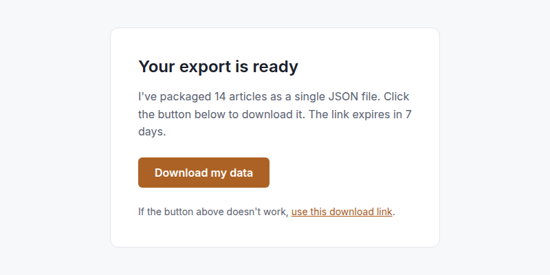</td>
<td valign="top">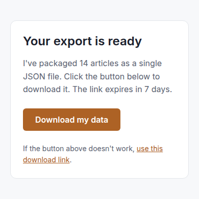</td>
</tr></table>

Exact HTML body: [`html/user-data-export--default.html`](html/user-data-export--default.html)

#### `single-article` — A customer with exactly one saved article gets the singular wording "Readplace packaged 1 article"; the rest of the email is identical.

Subject: **Your Readplace export is ready** · To: `sam.reader@gmail.com`

<details><summary>Example inputs</summary>

```json
{
  "customerAction": "Logged-in user POSTs /export/start?utm_source=export&utm_medium=internal&utm_content=start (the \"Email Me My Data\" button on https://readplace.com/export)",
  "customerEmail": "sam.reader@gmail.com",
  "userId": "c1c4bd92a3f35e7421ea2a3533ad7ab4",
  "savedArticles": [
    {
      "title": "How to Do Great Work",
      "url": "https://paulgraham.com/greatwork.html",
      "status": "read",
      "savedAt": "2026-03-14T08:21:09.000Z"
    }
  ],
  "putEventsEntry": {
    "Source": "hutch.api",
    "DetailType": "ExportUserDataCommand",
    "Detail": "{\"userId\":\"c1c4bd92a3f35e7421ea2a3533ad7ab4\",\"email\":\"sam.reader@gmail.com\",\"requestedAt\":\"2026-10-06T05:17:44.354Z\"}",
    "EventBusName": "hutch-event-bus-4202fdd"
  },
  "sqsRecordBody": {
    "version": "0",
    "id": "ff3f70e3-319d-4c80-a467-073a77e48f45",
    "detail-type": "ExportUserDataCommand",
    "source": "hutch.api",
    "account": "278728209435",
    "time": "2026-10-06T05:17:44Z",
    "region": "ap-southeast-2",
    "resources": [],
    "detail": {
      "userId": "c1c4bd92a3f35e7421ea2a3533ad7ab4",
      "email": "sam.reader@gmail.com",
      "requestedAt": "2026-10-06T05:17:44.354Z"
    }
  },
  "s3PutObject": {
    "Bucket": "hutch-user-exports-prod",
    "Key": "exports/c1c4bd92a3f35e7421ea2a3533ad7ab4/2026-10-06T05-17-44-357Z.json",
    "ContentType": "application/json",
    "ContentDisposition": "attachment; filename=\"readplace-export-2026-10-06.json\"",
    "bodyBytes": 594
  },
  "env": {
    "AWS_REGION": "ap-southeast-2",
    "USER_EXPORT_BUCKET_NAME": "hutch-user-exports-prod",
    "EVENT_BUS_NAME": "hutch-event-bus-4202fdd",
    "USER_DATA_JOBS_QUEUE_NAME": "user-data-jobs-q",
    "EXPORT_DOWNLOAD_TTL_DAYS": 7,
    "presignExpiresInSeconds": 604800,
    "lambdaCredentials": "fake STS-shaped placeholders (ASIA… access key + session token), real values come from the Lambda execution role"
  },
  "userDataExportedEvent": {
    "source": "hutch.export-user-data",
    "detailType": "UserDataExported",
    "detail": {
      "userId": "c1c4bd92a3f35e7421ea2a3533ad7ab4",
      "articleCount": 1,
      "s3Key": "exports/c1c4bd92a3f35e7421ea2a3533ad7ab4/2026-10-06T05-17-44-357Z.json",
      "exportedAt": "2026-10-06T05:17:44.357Z"
    }
  }
}
```

</details>

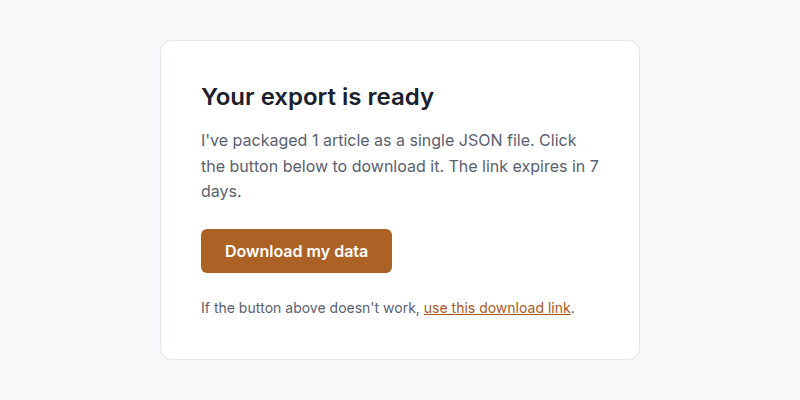

Exact HTML body: [`html/user-data-export--single-article.html`](html/user-data-export--single-article.html)

#### `no-articles` — A new account with nothing saved still gets the email, reading "Readplace packaged 0 articles", with a link to a file whose articles list is empty.

Subject: **Your Readplace export is ready** · To: `sam.reader@gmail.com`

<details><summary>Example inputs</summary>

```json
{
  "customerAction": "Logged-in user POSTs /export/start?utm_source=export&utm_medium=internal&utm_content=start (the \"Email Me My Data\" button on https://readplace.com/export)",
  "customerEmail": "sam.reader@gmail.com",
  "userId": "ae70c7d8d05cba7ca83575ce2d89516b",
  "savedArticles": [],
  "putEventsEntry": {
    "Source": "hutch.api",
    "DetailType": "ExportUserDataCommand",
    "Detail": "{\"userId\":\"ae70c7d8d05cba7ca83575ce2d89516b\",\"email\":\"sam.reader@gmail.com\",\"requestedAt\":\"2026-10-06T05:17:44.371Z\"}",
    "EventBusName": "hutch-event-bus-4202fdd"
  },
  "sqsRecordBody": {
    "version": "0",
    "id": "1357c9c0-125e-4769-ab1a-65fda42d94f0",
    "detail-type": "ExportUserDataCommand",
    "source": "hutch.api",
    "account": "278728209435",
    "time": "2026-10-06T05:17:44Z",
    "region": "ap-southeast-2",
    "resources": [],
    "detail": {
      "userId": "ae70c7d8d05cba7ca83575ce2d89516b",
      "email": "sam.reader@gmail.com",
      "requestedAt": "2026-10-06T05:17:44.371Z"
    }
  },
  "s3PutObject": {
    "Bucket": "hutch-user-exports-prod",
    "Key": "exports/ae70c7d8d05cba7ca83575ce2d89516b/2026-10-06T05-17-44-373Z.json",
    "ContentType": "application/json",
    "ContentDisposition": "attachment; filename=\"readplace-export-2026-10-06.json\"",
    "bodyBytes": 85
  },
  "env": {
    "AWS_REGION": "ap-southeast-2",
    "USER_EXPORT_BUCKET_NAME": "hutch-user-exports-prod",
    "EVENT_BUS_NAME": "hutch-event-bus-4202fdd",
    "USER_DATA_JOBS_QUEUE_NAME": "user-data-jobs-q",
    "EXPORT_DOWNLOAD_TTL_DAYS": 7,
    "presignExpiresInSeconds": 604800,
    "lambdaCredentials": "fake STS-shaped placeholders (ASIA… access key + session token), real values come from the Lambda execution role"
  },
  "userDataExportedEvent": {
    "source": "hutch.export-user-data",
    "detailType": "UserDataExported",
    "detail": {
      "userId": "ae70c7d8d05cba7ca83575ce2d89516b",
      "articleCount": 0,
      "s3Key": "exports/ae70c7d8d05cba7ca83575ce2d89516b/2026-10-06T05-17-44-373Z.json",
      "exportedAt": "2026-10-06T05:17:44.373Z"
    }
  }
}
```

</details>

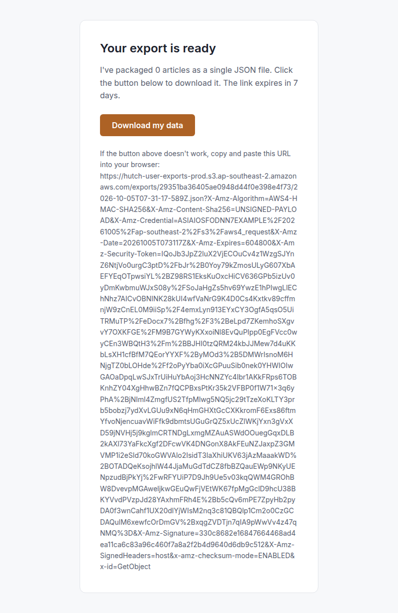

Exact HTML body: [`html/user-data-export--no-articles.html`](html/user-data-export--no-articles.html)

### Source

- `projects/hutch/src/runtime/export-user-data/export-user-data-handler.ts:110` — sender: builds from, reply-to, to, subject and HTML and calls sendEmail
- `projects/hutch/src/runtime/web/pages/export/user-data-export-email.ts:11` — renderer: picks "1 article" or "{n} articles" and renders the template
- `projects/hutch/src/runtime/web/pages/export/user-data-export-email.template.html:22` — template: heading, count sentence, Download my data button and fallback download link
- `projects/hutch/src/runtime/web/pages/export/export.page.ts:27` — web handler for POST /export/start: reads the address and publishes ExportUserDataCommand
- `projects/hutch/src/runtime/user-data-jobs.main.ts:302` — worker composition root: routes ExportUserDataCommand to the export handler
- `projects/hutch/src/runtime/providers/user-data-export/s3-user-data-export.ts:23` — writes the JSON file to S3 and presigns the 7-day link
- `projects/hutch/src/runtime/providers/email/skip-reserved-domain.ts:30` — reserved-domain filter in front of Resend, wired at user-data-jobs.main.ts:161
- `projects/hutch/src/infra/index.ts:749` — trigger infra: EventBridge rule to user-data-jobs-q and the user-data-jobs Lambda

## Not in this inventory

- **Stripe billing emails.** The code sets no Stripe email options (no `receipt_email` or invoice emails; Checkout gets only `customer_email`, `projects/hutch/src/runtime/providers/stripe-checkout/stripe-checkout.ts:61`). Whether Stripe sends receipts, renewal reminders or failed-payment notices therefore depends on the Stripe Dashboard settings. If those are on, a customer can get a Stripe notice and Readplace's pre-charge reminder or payment-failed email for the same event. Check the Dashboard.
- **Google's security alert** when a customer grants Readplace access to Gmail. Google sends it and controls its content; nothing in the repo triggers or shapes it (not verified from code).
- **Gmail's forwarding confirmation.** Gmail sends it to the customer's Readplace forwarding address (`gmail-…@read.place`), not to their own mailbox, and Readplace confirms it automatically (`projects/inbox/src/runtime/domain/inbox/intercept-gmail-confirmation.ts:17`).
- **Personal replies** from `fayner@readplace.com` or `support@readplace.com`. These are written by people in Google Workspace, with no template.
- **Internal mail.** This covers the Bcc archive copies, and the CloudWatch alarm emails sent through SNS to `readplace+devops@readplace.com` (`projects/hutch/Pulumi.prod.yaml:72`), which go to the team only.
- **TestFlight.** The iOS release lane sets `notify_external_testers: false`, so Apple does not email beta testers about new builds (`projects/native-apps/ios/fastlane/Fastfile:361`).
